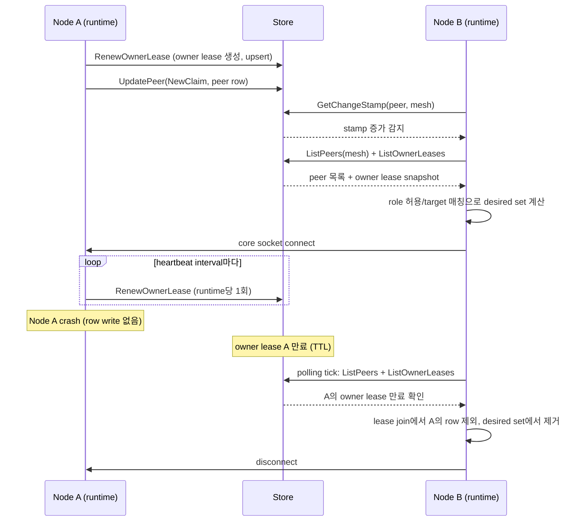
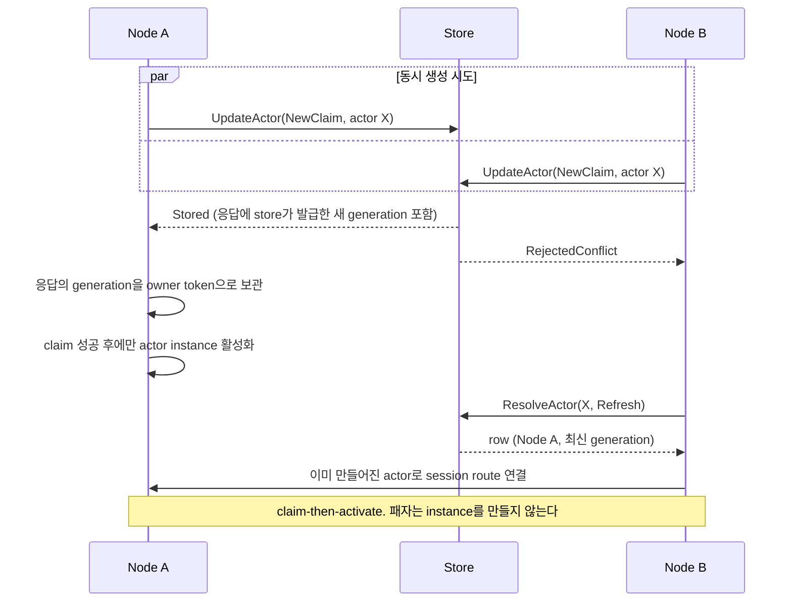
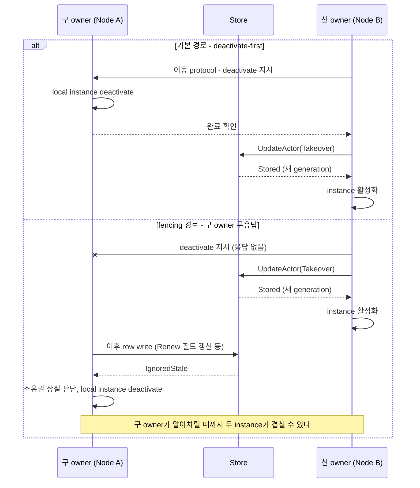
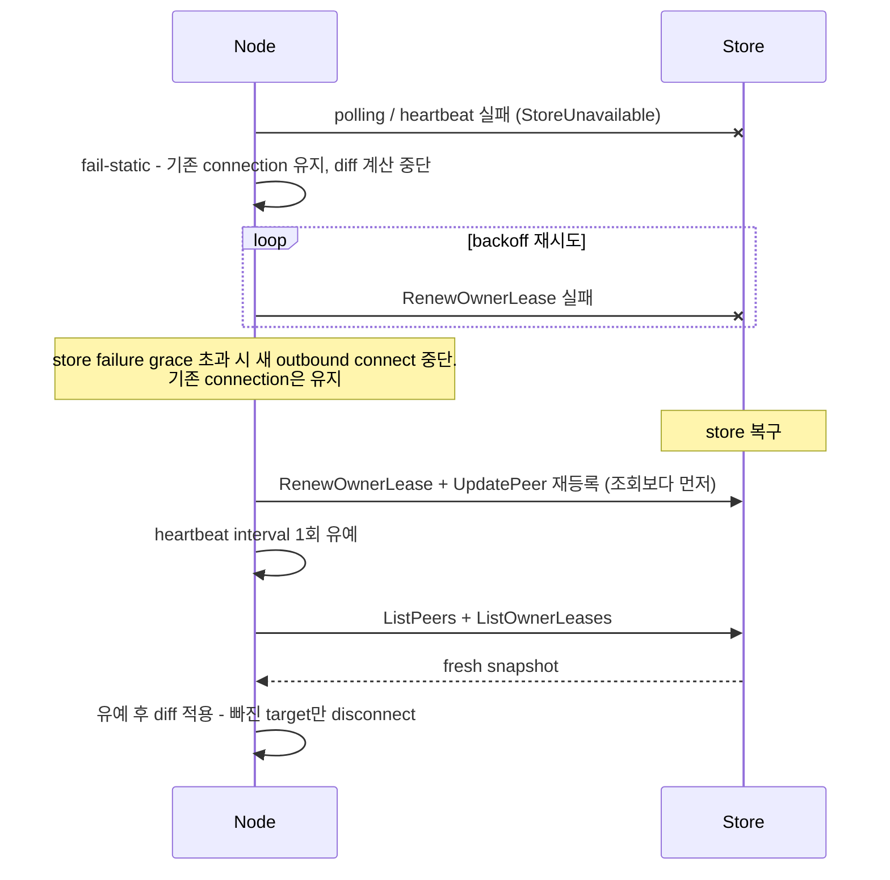

# Framework Location Resolver/Store 계약 초안

> 이 문서는 구현 전 초안이다. 현재 공개 계약이 아니며, framework 구현, 언어별 API,
> location store interface, extension package, 회귀 테스트가 끝난 뒤 정식 spec/guide 문서에
> 나누어 반영한다.
>
> 이 문서는 core registry/discovery에 의존하지 않고 framework가 자동 연결, spot 위치 조회,
> actor 위치 조회를 제공하기 위한 공통 계약 후보를 정의한다.

## 1. 목적

framework는 분산 환경에서 아래 세 가지 위치 문제를 해결해야 한다.

- 같은 mesh에 참여한 peer node를 찾아 자동으로 연결한다.
- `spot rid`로 그 spot을 소유한 node와 route endpoint를 찾는다.
- `actor id`로 actor의 현재 node, spot, generation을 찾는다.

이 기능은 core native registry/discovery가 아니라 framework의 location resolver/store 계약으로
제공한다. 자동연결 정책은 기존 core discovery가 제공하던 role 매칭과 peer diff 동작을 framework로
옮긴다. framework 본체는 storage interface와 등록 지점만 제공하고, 실제 저장소 구현은 사용자 코드나
별도 extension package가 제공한다.

### 1.1 스케일 목표

이 계약은 아래 규모를 기본 목표로 한다. 개별 배포는 훨씬 작을 수 있지만, 계약이 이 규모에서 깨지는
구조면 안 된다.

| 항목 | 목표 규모 |
|------|-----------|
| node (framework runtime instance) | 수천 |
| mesh당 peer row | 수천 |
| actor location row | 수백만 이상 |
| spot location row | 수백만 이상 |
| route location row | actor/session 수에 비례 |

이 목표가 계약에 강제하는 원칙은 다음과 같다.

- 위치 resolve는 메시징마다 수행하지 않는다. store 조회는 session 수립, 재연결, 실패 복구, reconcile
  tick에서만 일어나고, 일반 packet 경로는 이미 연결된 route와 local cache를 사용한다.
- heartbeat는 row 단위가 아니라 owner 단위다. actor/spot row 수백만 개의 lease를 개별 write로 연장하는
  구조는 금지한다. 6.6의 owner lease 모델을 따른다. lease write 부하는 actor 수가 아니라 node 수에
  비례해야 한다.
- spot/actor/route 목록 조회는 pagination을 지원한다. 수백만 row를 한 번에 반환하는 표면은 두지 않는다.
- peer polling은 change stamp로 변경이 없는 tick의 비용을 O(1)로 만든다. node 수천 개의 1초 polling이
  store에 full list 조회로 도달하면 안 된다.

## 2. 비목표

- core registry/discovery 기능을 확장하지 않는다.
- actor 업무 상태, spot 업무 상태, session payload를 location store에 저장하지 않는다.
- actor placement policy를 store가 결정하지 않는다.
- 특정 storage 제품을 유일한 표준으로 고정하지 않는다.
- application handler가 일반 흐름에서 위치 row를 직접 갱신하도록 요구하지 않는다.

## 3. 기본 원칙

location store는 위치 정보의 authoritative source다. 하지만 위치 정책은 store가 아니라 framework가
소유한다. 사용자는 위치 row를 어디에 저장하고 어떻게 조회할지만 선택한다. 자동연결, spot resolve,
actor resolve의 key 모델, lifecycle update/remove, freshness, cache, owner/generation 처리 정책은
framework가 공통으로 제공한다.

사용자는 storage 구현체를 등록한다. framework의 자동연결과 resolver는 store interface만 사용하므로,
저장 위치와 query 방식은 구현체가 책임진다.

```csharp
options.AddPeerLocationStore<MyPeerLocationStore>();
options.AddSpotLocationStore<MySpotLocationStore>();
options.AddActorLocationStore<MyActorLocationStore>();
options.AddRouteLocationStore<MyRouteLocationStore>();
options.AddOwnerLeaseStore<MyOwnerLeaseStore>();
```

Redis, RDB, MongoDB 같은 구현체는 framework 본체가 아니라 별도 extension package나 사용자 코드가
위 interface를 구현해 등록한다. extension package는 편의 builder를 제공할 수 있지만, 공통 framework
계약은 특정 제품 이름의 builder를 요구하지 않는다.

일반 application 코드는 peer/spot/actor 위치를 직접 저장하지 않는다. 수동 update/remove API는 custom
runtime, 운영 도구, 테스트처럼 자동 lifecycle 밖에서 row를 관리해야 하는 경우에만 사용한다.

## 4. 기존 core discovery/registry 기능 이관 범위

이 절은 `core/doc/spec/core/service/discovery.ko.md`,
`core/doc/spec/core/service/registry.ko.md`,
`core/doc/guide/07-1-discovery.ko.md`,
`core/doc/guide/07-4-registry.ko.md`,
`core/doc/internals/discovery-internals.ko.md`,
`core/doc/internals/registry-internals.ko.md`가 설명하던 기능을 framework에서 어떻게 다시 제공할지
정리한다.

작업자는 core registry/discovery 구현 코드를 읽지 않아도 이 문서만으로 framework 구현을 진행할 수
있어야 한다. 위 core 문서는 왜 이런 기능이 있었는지 확인하는 참고 자료일 뿐이다. 새 구현은 core의
Registry/Discovery control plane을 framework로 포팅하는 작업이 아니라, 기존 framework가 쓰던
registry/discovery 의존 지점을 제거하고 같은 사용자 기능을 location runtime/store/resolver로 다시
제공하는 작업이다.

따라서 구현 중 판단 기준은 아래와 같다.

- core의 `zlink_discovery_*`, `zlink_registry_*` API를 새 framework 기능의 내부 구현으로 호출하지 않는다.
- 기존 framework의 `UseRegistry...` resolver, embedded registry host, registry topology query endpoint는
  location store/resolver/runtime query로 교체한다.
- 자동 연결은 core service list broadcast를 재현하지 않고, peer location list와 watch/polling으로
  desired target set을 계산한다.
- spot/actor/route 조회는 core route table을 읽지 않고, framework lifecycle이 갱신한 location row를
  resolver가 읽는다.
- Redis extension은 framework의 공식 공유 저장소 구현체지만, framework 본체는 Redis client나 Redis
  key schema를 직접 알지 않는다.
- 이 문서에 없는 core 내부 동작은 새 framework 계약으로 보장하지 않는다. 필요하다고 판단되면 먼저 이
  draft에 기능을 추가한 뒤 구현한다.

기존 core discovery/registry는 크게 네 가지 일을 했다.

- service participant를 등록하고 heartbeat로 생존을 유지한다.
- 같은 channel 안의 peer 목록을 배포하고 자동 연결 대상 집합을 만든다.
- spot/actor/route 위치 정보를 owner-bound row로 저장하고 조회한다.
- topology, member peer, service summary, status 같은 운영 조회를 제공한다.

core에서 registry/discovery 구현을 제거하더라도 위 사용자 기능은 사라지면 안 된다. 다만 구현 방식은
core의 PUB/SUB 브로드캐스트, ROUTER/DEALER control plane, registry flooding이 아니라 framework의
location runtime과 사용자가 등록한 store interface로 옮긴다.

캐싱은 기존 core discovery의 cache 구현을 옮기는 대상이 아니다. 기존 문서의 cache 설명은 어떤 문제가
있었는지 파악하기 위한 참고 자료로만 사용한다. framework는 10절에서 새로 정의하는 공통 cache 정책으로
peer, spot, actor, route 조회를 처리한다. 이 정책은 actor와 spot을 1:1로 많이 만드는 topology까지 고려해,
각 resolver별 cache enable, TTL, max entry, `Normal`/`Refresh` freshness를 같은 의미로
제공해야 한다.

| 기존 기능 | core 문서 기준 동작 | framework 구현 방향 |
|-----------|--------------------|---------------------|
| bootstrap | Discovery가 Registry control endpoint에 붙고 PUB/uplink endpoint와 heartbeat 주기를 배운다. | framework에는 registry bootstrap API를 두지 않는다. store 연결과 heartbeat 주기는 framework option과 등록된 store 구현체 설정에서 온다. |
| service registration | socket, SpotNode가 endpoint, role, weight, value, metadata를 Registry에 등록한다. | framework lifecycle이 peer location row를 자동 upsert한다. row에는 auto-connect type, mesh name, role, endpoint, node rid, weight, value, metadata, owner/generation을 담는다. 생존 판정은 row가 아니라 owner lease가 담당한다. |
| unregister | owner가 종료되면 등록 row를 제거한다. owner가 사라지면 timeout으로 정리한다. | 정상 종료에서는 owner/generation guard로 remove한다. 비정상 종료는 owner lease 만료와 cleanup으로 제거한다. |
| heartbeat | Discovery가 등록된 service participant의 heartbeat를 주기적으로 보낸다. | framework location runtime이 runtime instance당 하나의 owner lease를 주기적으로 갱신한다. peer/spot/actor row를 heartbeat마다 개별 write하지 않는다. |
| service list broadcast | Registry가 service list를 Discovery에 broadcast하고 Discovery가 local provider snapshot을 갱신한다. | store watch가 있으면 변경 event로 reconcile을 깨운다. watch가 없으면 polling으로 같은 결과를 얻는다. cache 동작은 기존 broadcast cache가 아니라 10절의 새 framework cache 정책을 따른다. |
| auto-connect role matching | auto-connect type별 허용 role과 outbound 방향을 정한다. | 14절의 role 허용 정책과 target 매칭 정책으로 그대로 옮긴다. |
| pairwise initiator | route mesh, dealer mesh, spot mesh에서 routing id와 endpoint total order로 한쪽만 dial한다. | framework reconcile loop가 같은 비교 규칙으로 desired target set을 만든다. |
| peer weight/value | member peer entry가 weight와 `int64` value를 노출한다. | peer location row에 `Weight`, `Value`를 포함하고, member peer 조회와 admission 정책이 이 값을 사용한다. |
| member peers | Discovery cache 또는 Registry에서 현재 peer 목록을 조회한다. | resolver의 `ListPeersAsync(filter, freshness)`와 framework query API로 제공한다. |
| topology query | service kind, role, state, channel, routing id 등으로 topology snapshot을 조회한다. | peer/spot/actor list query와 별도 `LocationTopology` 조회 모델로 제공한다. store 구현체는 filter 조회를 제공하고, framework가 state와 stale 판정을 해석한다. |
| service summary | channel별 total/ready/error/stopped 집계를 제공한다. | framework runtime이 location row와 connection state를 집계해 운영 조회 API로 제공한다. store가 집계를 결정하지 않는다. |
| status | registry id, state, entry count, peer registry count, last error 등을 제공한다. | registry process가 없어지므로 같은 필드를 보존하지 않는다. 대신 location runtime status로 store health, watch/poll 상태, cache entry 수, last error, last refresh 시각을 제공한다. |
| registry clustering | Registry끼리 service list와 route snapshot을 flooding하고 `registry_id + list_seq`로 중복을 제거한다. | framework는 저장소 클러스터링을 직접 구현하지 않는다. HA와 복제는 사용자가 선택한 store 구현체의 책임이다. framework는 store-issued generation, lease, store 기준 updated time으로 중복과 stale row를 걸러낸다. |
| spot owner resolve | `spot_rid -> owner_node_rid + spot_kind`를 cache 후 필요하면 Registry topology query로 refresh한다. | 15절의 spot resolve/list로 옮긴다. 기준 저장소는 spot store이고, cache는 기존 core 동작이 아니라 10절의 새 framework cache 정책을 사용한다. |
| actor active route | `actor_id -> actor ref + current spot` route를 owner-bound row로 조회한다. | 16절의 actor resolve/list로 옮긴다. actor lifecycle이 row를 자동 갱신하고, 재연결 경로는 `Refresh`를 사용한다. |
| generic route bind/resolve | framework 계층이 `kind + key -> owner rid + value` owner-bound route를 직접 관리할 수 있다. | 공통 location 계약에 route store를 포함한다. actor session binding, spot name 같은 framework route도 같은 owner/generation/lease 정책을 사용한다. |
| attach ownership | Discovery에 attach된 socket/SpotNode는 Discovery destroy 때 함께 정리된다. | framework runtime이 자신이 만든 channel participant와 location row의 lifecycle을 소유한다. core socket handle 자체의 소유권은 각 언어 framework의 channel runtime 규칙에 맞춘다. |

문서도 이관한다. core 문서에 있던 discovery/registry 사용자 설명과 내부 구조 설명은 기능 구현이
framework로 옮겨진 뒤 `framework/doc/` 아래의 공통 spec, guide, internals로 나누어 다시 작성한다.
core 문서는 core socket과 low-level service primitive에 남는 계약만 유지하고, framework location
runtime 동작을 core 정식 spec처럼 설명하지 않는다.

## 5. 공통 Location Runtime

framework는 자동연결, spot resolve, actor resolve를 별도 기능처럼 구현하지 않고 하나의 location
runtime 위에 올린다.

```text
framework lifecycle
  -> location runtime policy
  -> location store interface
  -> user or extension storage implementation
```

store 구현체가 바뀌어도 아래 정책은 바뀌면 안 된다.

| 정책 | framework 책임 |
|------|----------------|
| key 생성 | peer, spot, actor, route location key를 같은 규칙으로 만든다. |
| 자동 update/remove | node, spot, actor lifecycle event를 받아 row를 갱신한다. |
| resolve freshness | `Normal`, `Refresh` 의미를 동일하게 적용한다. |
| cache | peer/spot/actor/route cache enable, TTL, max entries를 동일한 방식으로 적용한다. not-found 결과는 cache하지 않는다. |
| owner/generation guard | 오래된 owner가 최신 row를 덮거나 지우지 못하게 한다. |
| owner lease 만료 | owner lease가 만료된 owner의 row는 resolve 성공으로 반환하지 않는다. |
| 오류 의미 | not found, stale, conflict, store 장애를 구분한다. |

store 구현체는 아래 동작만 제공한다.

| 구현체 책임 | 설명 |
|-------------|------|
| row upsert/remove | framework가 만든 key와 value를 저장하거나 제거한다. |
| row lookup/list | key 또는 filter로 row를 조회한다. |
| conditional update | owner/generation 조건을 저장소 기능으로 보장한다. |
| owner lease/cleanup | owner lease 갱신과 만료 판정, 만료 owner row의 물리 정리를 저장소에 맞는 방식으로 구현한다. |
| optional watch | 저장소가 지원하면 변경 알림을 framework에 전달한다. |

즉 어떤 구현체를 등록해도 자동연결이나 actor 재연결 알고리즘이 달라지면 안 된다.

### 5.1 전체 흐름 다이어그램

아래 다이어그램은 여러 참여자 사이의 순서 자체가 계약인 네 가지 흐름을 요약한 이해 보조 자료다.
내용이 본문과 충돌하면 본문 절이 기준이다. 해당 절의 계약을 바꾸면 이 다이어그램도 함께 갱신한다.

#### 자동 연결과 node crash (6.6, 14절)

owner lease 하나로 생존을 신고하고, crash는 row write 없이 lease 만료만으로 전파된다.



#### actor 생성 race — claim-then-activate (17절)

위치 claim이 성공한 쪽만 instance를 활성화한다. 패자는 instance를 만들기 전에 물러난다.



generation은 어느 경로로도 node 사이에 배포되지 않는다. 승자는 자신의 write 응답
(`ZLinkLocationWriteResult`)에 담겨 온 generation을 owner token으로 보관하고, 이후의 `Renew`와
remove에 그 token을 제시한다. 패자는 최신 generation 값을 알 필요가 없다. resolve로 현재 row를 읽어
승자의 위치를 사용할 뿐이다. 구 owner도 마찬가지로 새 generation 값을 전달받지 않으며, 자기 token이
`IgnoredStale`로 거부되는 순간 소유권 상실만 알게 된다. token 비교는 항상 store 안에서 일어나므로,
generation을 배포하는 별도 protocol이 없어도 fencing이 성립한다(9절).

#### 계획된 이동과 Takeover fencing (9절)

기본 경로는 구 instance를 먼저 멈추는 deactivate-first다. `Takeover`는 구 owner가 협조하지 못할 때의
fencing 경로다.



#### store 장애와 복구 (14.8)

장애 중에는 fail-static으로 버티고, 복구 시에는 재등록과 유예를 diff보다 먼저 수행한다.



## 6. 위치 모델

### 6.1 peer location

peer location은 자동 연결에 필요한 node endpoint 정보다.

| 필드 | 의미 |
|------|------|
| `AutoConnectType` | route mesh, client/server, dealer mesh, fanout, spot mesh |
| `MeshName` | route mesh 또는 spot mesh 이름 |
| `NodeRid` | node routing id |
| `Role` | router, dealer, pub, sub, spot. 6.5의 닫힌 값 집합을 따른다 |
| `Endpoint` | 연결할 transport endpoint |
| `Weight` | admission 또는 load balancing에 쓰는 `0..100` 값 |
| `Value` | framework가 해석하는 정수 metadata. 없으면 0 |
| `Metadata` | route endpoint, pub endpoint, capability 같은 구조화 metadata |
| `Capabilities` | router, pub/sub, route bridge 같은 기능 |
| `OwnerId` | framework runtime instance id |
| `Generation` | 같은 peer key가 다시 claim될 때 이전 row와 구분하는 fencing token |
| `UpdatedAt` | store가 기록한 마지막 갱신 시각. 사용자 node의 wall clock 값이 아니다 |

framework는 같은 mesh의 peer location을 조회하거나 watch해서 필요한 socket connect/disconnect를
자동 수행한다.

### 6.2 spot location

spot location은 `spot rid`가 어느 node에 있는지 나타낸다.

| 필드 | 의미 |
|------|------|
| `MeshName` | spot mesh 이름 |
| `SpotRid` | logical spot routing id |
| `SpotType` | 선택적 spot type |
| `NodeRid` | spot을 소유한 node routing id |
| `SpotKind` | `ENTRY_SPOT` 또는 `USER_SPOT` |
| `RouteEndpoint` | 외부 route client가 연결할 endpoint. 필요 없으면 비울 수 있다 |
| `OwnerId` | framework runtime instance id |
| `Generation` | 같은 spot id가 재생성될 때 stale row를 구분하는 값 |
| `UpdatedAt` | store가 기록한 마지막 갱신 시각. 사용자 node의 wall clock 값이 아니다 |

spot 생성/start 시 framework가 spot location을 update한다. spot stop/destroy 시 framework가 remove한다.

### 6.3 actor location

actor location은 `actor type + actor id`로 현재 actor 위치를 찾기 위한 값이다.

| 필드 | 의미 |
|------|------|
| `ActorType` | 선택적 actor type |
| `ActorId` | application actor id |
| `ActorRef` | framework가 actor instance를 다시 찾을 때 쓰는 opaque actor reference |
| `NodeRid` | actor가 존재하는 node routing id |
| `Generation` | actor 재생성 또는 이동을 구분하는 fencing token |
| `LocationKind` | `ENTRY_SPOT` 또는 `USER_SPOT` |
| `SpotRid` | user spot actor이면 필수. entry spot actor이면 비울 수 있다 |
| `SpotKind` | spot rid가 있을 때 spot 종류. 현재는 `LocationKind`와 값이 같지만 spot kind 확장에 대비해 둔다 |
| `OwnerId` | framework runtime instance id |
| `UpdatedAt` | store가 기록한 마지막 갱신 시각. 사용자 node의 wall clock 값이 아니다 |

actor 생성 시 framework가 actor location을 update한다. actor가 user spot에 join/leave하면 location을
갱신한다. actor destroy 시 remove한다.

### 6.4 route location

route location은 actor/spot으로 직접 표현되지 않는 framework route를 owner-bound row로 저장하기 위한
값이다.

| 필드 | 의미 |
|------|------|
| `RouteKind` | `ActorSession`, `SpotName`, `FrameworkRoute` |
| `RouteKey` | route kind 안에서 해석되는 binary 또는 string key |
| `OwnerNodeRid` | route owner node routing id |
| `OwnerId` | framework runtime instance id |
| `Generation` | 같은 route key가 다시 claim될 때 이전 row와 구분하는 fencing token |
| `Value` | framework가 해석하는 route value. store는 payload를 해석하지 않는다 |
| `UpdatedAt` | store가 기록한 마지막 갱신 시각. 사용자 node의 wall clock 값이 아니다 |

### 6.5 key 모델

key는 framework가 만든다. store 구현체는 전달받은 key를 그대로 저장하고 비교한다.

| key | 구성 |
|-----|------|
| peer key | `AutoConnectType + MeshName + Role + NodeRid`. `NodeRid`가 없는 role은 `AutoConnectType + MeshName + Role + Endpoint`를 사용한다. |
| spot key | `MeshName + SpotRid` |
| actor key | `ActorType + ActorId`. `ActorType`이 없으면 빈 문자열로 정규화한다. 빈 문자열과 null은 같은 값이다. |
| route key | `RouteKind + RouteKey` |

key 문자열 비교가 필요한 구현체는 각 구성 요소를 길이 prefix 또는 escaping이 있는 stable encoding으로
직렬화해야 한다. 단순 문자열 이어 붙이기는 금지한다.

`AutoConnectType`과 `Role`은 닫힌 값 집합이다. auto-connect type은 route mesh, client/server, dealer
mesh, fanout, spot mesh 5종이고 role은 router, dealer, pub, sub, spot 5종이다(14.2). .NET 첫 구현은 이를
enum으로 정의하되, key 직렬화는 언어 중립적인 canonical 소문자 문자열로 고정한다:
`route-mesh`, `client-server`, `dealer-mesh`, `fanout`, `spot-mesh` / `router`, `dealer`, `pub`, `sub`,
`spot`. 언어별 enum 표기가 달라도 store에 저장되는 key는 같아야 한다. store에서 읽힌 row의 값이 이
집합 밖이면 reconcile과 resolve는 그 row를 무시하고 진단에 보고한다. 등록 경로에서 집합 밖 값은
validation error다.

### 6.6 owner lease

location row는 row별 lease를 갖지 않는다. row의 살아 있음은 owner lease로 판단한다. owner lease는
framework runtime instance당 하나이며, heartbeat도 runtime당 한 번씩만 일어난다. actor가 수백만 개라도
lease write 부하는 node 수에만 비례한다.

| 필드 | 의미 |
|------|------|
| `OwnerId` | framework runtime instance id |
| `NodeRid` | owner runtime의 node routing id |
| `LeaseExpiresAt` | heartbeat가 끊겼을 때 이 owner의 모든 row를 만료 취급하는 시각. store 기준 시간 |
| `UpdatedAt` | store가 기록한 마지막 갱신 시각 |

row 유효성 규칙: row가 존재하고, row의 `OwnerId`에 해당하는 owner lease가 만료되지 않았을 때만
유효하다. resolver와 reconcile은 owner lease 목록(runtime instance 수만큼, 수천 건 이하)을 cache하고
이 join을 local에서 수행한다. owner lease가 만료된 owner의 row는 resolve/list 성공 결과에서 제외하고,
물리 삭제는 background cleanup 또는 lazy 삭제가 담당한다.

만료 판정에 application node의 wall clock을 쓰지 않는다. owner lease 목록 조회 결과에 포함된 store
기준 현재 시각으로 각 lease의 남은 시간을 계산하고, 조회 이후의 경과는 local monotonic clock으로 잰다.
owner lease 목록은 watch와 change stamp의 대상이 아니며 polling interval마다 갱신한다. 따라서 owner
lease cache의 staleness 상한은 polling interval 한 번이다.

owner lease store와 location store는 같은 물리 저장소를 사용해야 한다. `NewClaim`의 "만료된 row" 판정은
location store가 owner lease를 원자적으로 참조해야 하는데, 서로 다른 저장소에 걸친 원자적 판정은
불가능하기 때문이다. interface와 등록 지점은 책임별로 나뉘지만 backing 저장소는 하나여야 한다. 공식
extension도 owner lease와 location row를 같은 저장소에 둔다.

## 7. Store 계약

store는 peer, spot, actor, route 위치 row를 저장하고 조회한다. 공통 framework 계약은 책임별 interface를
분리한다. 한 구현체가 네 interface를 모두 구현할 수는 있지만, framework가 요구하는 등록 지점은
peer, spot, actor, route별로 나뉜다. owner lease store는 7.5, 네 store가 공유하는 write 결과와 write
intent, owner token은 7.6, optional watch는 7.7에서 정의한다.

### 7.1 peer store

```csharp
public interface IZLinkPeerLocationStore
{
    ValueTask<ZLinkLocationWriteResult> UpdatePeerAsync(
        ZLinkPeerLocation peer,
        ZLinkLocationWriteIntent intent,
        CancellationToken ct = default);
    ValueTask<ZLinkLocationWriteResult> RemovePeerAsync(
        ZLinkPeerLocationKey key,
        ZLinkLocationOwnerToken owner,
        CancellationToken ct = default);
    ValueTask<long> RemoveByOwnerAsync(
        string ownerId,
        CancellationToken ct = default);
    ValueTask<IReadOnlyList<ZLinkPeerLocation>> ListPeersAsync(
        ZLinkPeerLocationFilter filter,
        CancellationToken ct = default);
}
```

peer row는 node lifecycle과 heartbeat에 의해 자동 갱신된다. 사용자가 직접 호출하는 API는 custom
runtime 또는 운영 도구용이다.

### 7.2 spot store

```csharp
public interface IZLinkSpotLocationStore
{
    ValueTask<ZLinkLocationWriteResult> UpdateSpotAsync(
        ZLinkSpotLocation spot,
        ZLinkLocationWriteIntent intent,
        CancellationToken ct = default);
    ValueTask<ZLinkLocationWriteResult> RemoveSpotAsync(
        ZLinkSpotLocationKey key,
        ZLinkLocationOwnerToken owner,
        CancellationToken ct = default);
    ValueTask<long> RemoveByOwnerAsync(
        string ownerId,
        CancellationToken ct = default);
    ValueTask<ZLinkSpotLocation?> ResolveSpotAsync(
        ZLinkSpotLocationKey key,
        CancellationToken ct = default);
    ValueTask<ZLinkLocationPage<ZLinkSpotLocation>> ListSpotsAsync(
        ZLinkSpotLocationFilter filter,
        ZLinkPageRequest page = default,
        CancellationToken ct = default);
}
```

spot row는 spot lifecycle이 자동 갱신한다. 목록 조회는 운영 화면, placement, 복구 작업, 테스트에서
사용한다.

### 7.3 actor store

```csharp
public interface IZLinkActorLocationStore
{
    ValueTask<ZLinkLocationWriteResult> UpdateActorAsync(
        ZLinkActorLocation actor,
        ZLinkLocationWriteIntent intent,
        CancellationToken ct = default);
    ValueTask<ZLinkLocationWriteResult> RemoveActorAsync(
        ZLinkActorLocationKey key,
        ZLinkLocationOwnerToken owner,
        CancellationToken ct = default);
    ValueTask<long> RemoveByOwnerAsync(
        string ownerId,
        CancellationToken ct = default);
    ValueTask<ZLinkActorLocation?> ResolveActorAsync(
        ZLinkActorLocationKey key,
        CancellationToken ct = default);
    ValueTask<ZLinkLocationPage<ZLinkActorLocation>> ListActorsAsync(
        ZLinkActorLocationFilter filter,
        ZLinkPageRequest page = default,
        CancellationToken ct = default);
}
```

actor row는 actor lifecycle이 자동 갱신한다. 목록 조회는 운영 화면, placement, 복구 작업, 테스트에서
사용한다.

### 7.4 route store

generic route store는 actor/spot으로 직접 표현되지 않는 framework route를 저장한다. 이 store는 기존
core discovery의 route bind/resolve 기능을 framework로 옮긴 것이다. route row는 arbitrary key-value
저장소가 아니라 owner-bound location row다.

```csharp
public interface IZLinkRouteLocationStore
{
    ValueTask<ZLinkLocationWriteResult> UpdateRouteAsync(
        ZLinkRouteLocation route,
        ZLinkLocationWriteIntent intent,
        CancellationToken ct = default);
    ValueTask<ZLinkLocationWriteResult> RemoveRouteAsync(
        ZLinkRouteLocationKey key,
        ZLinkLocationOwnerToken owner,
        CancellationToken ct = default);
    ValueTask<long> RemoveByOwnerAsync(
        string ownerId,
        CancellationToken ct = default);
    ValueTask<ZLinkRouteLocation?> ResolveRouteAsync(
        ZLinkRouteLocationKey key,
        CancellationToken ct = default);
    ValueTask<ZLinkLocationPage<ZLinkRouteLocation>> ListRoutesAsync(
        ZLinkRouteLocationFilter filter,
        ZLinkPageRequest page = default,
        CancellationToken ct = default);
}
```

route kind는 framework가 정의한 좁은 용도로만 사용한다. 초기 대상은 `ActorSession`, `SpotName`,
`FrameworkRoute`다. application이 임의 key-value 저장소처럼 route store를 직접 쓰는 것은 이 문서의
목표가 아니다.

### 7.5 owner lease store

```csharp
public interface IZLinkOwnerLeaseStore
{
    ValueTask<ZLinkLocationWriteResult> RenewOwnerLeaseAsync(
        ZLinkOwnerLease lease,
        CancellationToken ct = default);
    ValueTask<ZLinkLocationWriteResult> RemoveOwnerLeaseAsync(
        string ownerId,
        CancellationToken ct = default);
    ValueTask<ZLinkOwnerLeaseSnapshot> ListOwnerLeasesAsync(
        CancellationToken ct = default);
}
```

owner lease는 runtime start 때 만들어지고 heartbeat interval마다 갱신된다. `RenewOwnerLeaseAsync`는
upsert다. lease row가 없으면 만들고 있으면 연장한다. heartbeat write는 runtime instance당 한 번이므로
store 부하는 node 수에 비례한다.

`ZLinkOwnerLeaseSnapshot`은 owner lease 목록과 store 기준 현재 시각(`StoreNow`)을 함께 담는다. runtime
instance 수만큼만 반환하므로 pagination 없이 전체 목록을 돌려준다. resolver와 reconcile은 이 snapshot을
cache해서 row 유효성 join에 사용하고, 만료 판정은 `LeaseExpiresAt - StoreNow`와 조회 이후의 local
monotonic 경과 시간으로 계산한다(6.6). application node의 wall clock을 store 시각과 직접 비교하지
않는다.

`RemoveOwnerLeaseAsync`는 owner 자신의 shutdown 경로와 운영 복구 도구 전용이다. 다른 owner의 lease
제거는 운영 복구 상황에서만 허용한다.

### 7.6 write 결과와 owner token

네 store의 update/remove는 공통으로 `ZLinkLocationWriteResult`를 반환한다. 저장에 성공했으면 store가
확정한 `Generation`과 `UpdatedAt`을 함께 돌려준다. lease는 row가 아니라 owner lease store가 관리한다.

| 결과 | 의미 |
|------|------|
| `Stored` | 저장 또는 교체에 성공했다. |
| `IgnoredStale` | 이미 교체된 구세대 owner token으로 온 update/remove라 무시했다. row는 바뀌지 않는다. |
| `RejectedConflict` | 살아 있는 row가 있는 key에 대한 new claim이 실패했다. 동시 claim 패배가 여기에 해당한다. |
| `StoreUnavailable` | store 연결 또는 저장이 실패했다. |

update 요청은 `ZLinkLocationWriteIntent`로 세 가지 의도 중 하나를 명시한다.

```csharp
public enum ZLinkLocationWriteIntent
{
    NewClaim,
    Renew,
    Takeover
}
```

| intent | 성공 조건 | generation |
|--------|-----------|------------|
| `NewClaim` | 현재 row가 없거나 row owner의 owner lease가 만료된 경우에만 성공한다. generation을 비워서 요청한다. | store가 key별로 원자적으로 증가시킨 새 token을 반환한다. |
| `Renew` | 현재 row의 owner token과 같은 `OwnerId + Generation`을 제시해야 성공한다. user spot join/leave처럼 같은 owner가 row 필드를 갱신할 때 쓴다. lease 연장은 owner lease store가 담당한다. | 바뀌지 않는다. |
| `Takeover` | 살아 있는 row를 새 owner가 명시적으로 교체한다. actor move, spot move, route owner 이전처럼 framework가 의도한 이동에만 쓴다. | store가 새 token을 원자적으로 발급한다. |

동시 `Takeover`는 store가 원자적으로 순서대로 처리하고 마지막 claim이 최신 generation을 가진다. 밀린
owner는 이후 write에서 `IgnoredStale`을 받고 9절의 소유권 상실 규칙을 따른다.

`ZLinkLocationOwnerToken`은 `OwnerId + Generation`이다. remove는 owner token이 현재 row와 일치할 때만
성공한다. 구세대 token의 remove는 `IgnoredStale`이다.

read API(`Resolve...`, `List...`)는 store 장애를 결과값이 아니라 infrastructure error로 구분해 던진다.
write API는 예외 대신 `StoreUnavailable`을 반환한다.

### 7.7 optional watch

watch는 별도 optional interface로 분리한다.

```csharp
public interface IZLinkLocationWatchStore
{
    IAsyncEnumerable<ZLinkLocationChanged> WatchAsync(
        ZLinkLocationWatchFilter filter,
        CancellationToken ct = default);
}
```

store 구현체가 이 interface도 구현하면 framework runtime은 watch event로 reconcile과 cache invalidation을
깨운다. 구현하지 않으면 polling이 correctness 경로다. watch event는 latency 최적화일 뿐이고, event 유실이
있어도 다음 polling 결과로 같은 상태에 도달해야 한다.

| 모델 | 필수 필드 |
|------|-----------|
| `ZLinkLocationWatchFilter` | location kind(peer/spot/actor/route). mesh name과 route kind는 선택 filter이고 비어 있으면 wildcard다. |
| `ZLinkLocationChanged` | location kind, location key, 변경 종류(`Upserted`, `Removed`, `Expired`), generation, updated at |

## 8. Resolver 계약

resolver는 framework runtime과 application-facing client가 위치를 찾을 때 사용하는 읽기 표면이다.
기본 구현은 store를 읽지만, 사용자가 별도 resolver를 꽂을 수도 있다.

```csharp
public enum ZLinkResolveFreshness
{
    Normal,
    Refresh
}
```

```csharp
public interface IZLinkPeerLocationResolver
{
    ValueTask<IReadOnlyList<ZLinkPeerLocation>> ListPeersAsync(
        ZLinkPeerLocationFilter filter,
        ZLinkResolveFreshness freshness = ZLinkResolveFreshness.Normal,
        CancellationToken ct = default);
}

public interface IZLinkSpotLocationResolver
{
    ValueTask<ZLinkSpotLocation?> ResolveSpotAsync(
        ZLinkSpotLocationKey key,
        ZLinkResolveFreshness freshness = ZLinkResolveFreshness.Normal,
        CancellationToken ct = default);
}

public interface IZLinkActorLocationResolver
{
    ValueTask<ZLinkActorLocation?> ResolveActorAsync(
        ZLinkActorLocationKey key,
        ZLinkResolveFreshness freshness = ZLinkResolveFreshness.Normal,
        CancellationToken ct = default);
}

public interface IZLinkRouteLocationResolver
{
    ValueTask<ZLinkRouteLocation?> ResolveRouteAsync(
        ZLinkRouteLocationKey key,
        ZLinkResolveFreshness freshness = ZLinkResolveFreshness.Normal,
        CancellationToken ct = default);
}
```

`ZLinkResolveFreshness`는 resolver 계약이다. store 구현체는 freshness를 받지 않는다. cache read/write,
TTL 판단, stale row 제거는 framework resolver가 처리한다.

| mode | 의미 |
|------|------|
| `Normal` | cache hit를 허용한다. cache miss 또는 TTL 만료 시 store를 조회하고 cache를 갱신한다. |
| `Refresh` | cache가 있어도 store를 조회한다. 조회 결과로 cache를 갱신한다. |

재연결과 “없으면 생성” 판단은 `Refresh`를 사용한다. cache 영향을 완전히 배제해야 하는 운영 진단은
resolver가 아니라 `IZLinkLocationRuntimeQuery`를 사용한다. 이 표면은 cache 없이 store를 직접 읽는다.

### 8.1 목록 조회 filter

spot/actor/route resolver는 단건 resolve만 노출한다. 목록 조회는 자동연결이 사용하는 peer resolver의
peer list, 운영 조회 표면 `IZLinkLocationRuntimeQuery`, store interface에만 둔다. application이 위치
목록 스캔을 업무 로직으로 쓰는 것은 이 계약의 목표가 아니다. 특정 spot에 참여한 actor 목록 같은
정보는 location store 조회가 아니라 spot 자신의 상태에서 얻는다.

peer, spot, actor, route 목록 조회는 filter 기반이다. filter의 비어 있는 값은 wildcard로 처리한다.

| filter | 필드 | 의미 |
|--------|------|------|
| peer | `AutoConnectType` | 특정 자동 연결 type만 조회한다. |
| peer | `MeshName` | 특정 mesh만 조회한다. |
| peer | `Role` | router, dealer, pub, sub, spot role로 제한한다. |
| peer | `NodeRid` | 특정 node가 소유한 peer row만 조회한다. |
| peer | `Endpoint` | 특정 endpoint row만 조회한다. |
| spot | `MeshName` | 특정 spot mesh만 조회한다. |
| spot | `SpotType` | 특정 spot type만 조회한다. |
| spot | `NodeRid` | 특정 node가 소유한 spot만 조회한다. |
| spot | `SpotKind` | entry/user spot 종류로 제한한다. |
| actor | `ActorType` | 특정 actor type만 조회한다. |
| actor | `NodeRid` | 특정 node가 소유한 actor만 조회한다. |
| actor | `SpotRid` | 특정 spot에 join한 actor만 조회한다. |
| actor | `LocationKind` | entry spot actor 또는 user spot actor로 제한한다. |
| route | `RouteKind` | actor session, spot name, framework route 종류로 제한한다. |
| route | `OwnerNodeRid` | 특정 node가 소유한 route만 조회한다. |
| route | `OwnerId` | 특정 framework runtime instance가 소유한 route만 조회한다. |

목록 조회도 stale row를 성공 결과에 포함하지 않는다. stale row는 owner lease가 만료된 owner의
row이거나, 같은 key에 대해 이 runtime이 이미 관찰한 generation보다 오래된 generation의 row다. 후자는
복제 지연이 있는 store에서 뒤늦게 읽힌 값을 걸러내기 위한 규칙이다. 운영 진단에서 stale row까지 보고
싶다면 별도의 diagnostic API로 분리한다.

spot/actor/route 목록 조회는 `ZLinkPageRequest`(page size, continuation token)를 받고
`ZLinkLocationPage<T>`(item 목록, next continuation token)를 반환한다. row가 수백만 개일 수 있으므로
전체 목록을 한 번에 반환하는 표면은 두지 않는다. continuation token은 store 구현체가 정의하는 opaque
값이다. `ZLinkPageRequest`의 default 값은 `list page size` option의 기본 page 크기를 사용한다는 뜻이다.

peer 목록과 owner lease 목록은 pagination 없는 단일 snapshot 계약이다. reconcile의 desired target set
계산은 한 시점의 전체 목록을 전제로 하므로, page 간 시점 불일치가 생기는 pagination을 넣지 않는다.
이 계약은 1.1의 mesh당 peer row 수천 목표를 전제로 하며, 이를 넘는 topology는 pagination이 아니라
mesh 분할로 해결한다. store 구현체는 peer list와 owner lease list에 pagination을 구현하지 않는다.

### 8.2 운영 조회 모델

framework는 registry topology/status/service summary를 그대로 복제하지 않는다. 대신 location runtime
기준의 운영 조회 모델을 제공한다.

```csharp
public interface IZLinkLocationRuntimeQuery
{
    ValueTask<ZLinkLocationRuntimeStatus> GetStatusAsync(CancellationToken ct = default);
    ValueTask<IReadOnlyList<ZLinkPeerLocation>> ListPeersAsync(
        ZLinkPeerLocationFilter filter,
        CancellationToken ct = default);
    ValueTask<ZLinkLocationPage<ZLinkSpotLocation>> ListSpotsAsync(
        ZLinkSpotLocationFilter filter,
        ZLinkPageRequest page = default,
        CancellationToken ct = default);
    ValueTask<ZLinkLocationPage<ZLinkActorLocation>> ListActorsAsync(
        ZLinkActorLocationFilter filter,
        ZLinkPageRequest page = default,
        CancellationToken ct = default);
    ValueTask<ZLinkLocationPage<ZLinkRouteLocation>> ListRoutesAsync(
        ZLinkRouteLocationFilter filter,
        ZLinkPageRequest page = default,
        CancellationToken ct = default);
    ValueTask<ZLinkLocationPage<ZLinkLocationTopologyEntry>> ListTopologyAsync(
        ZLinkLocationTopologyFilter filter,
        ZLinkPageRequest page = default,
        CancellationToken ct = default);
    ValueTask<IReadOnlyList<ZLinkLocationServiceSummary>> ListServiceSummariesAsync(
        ZLinkLocationServiceSummaryFilter filter,
        CancellationToken ct = default);
}
```

| 모델 | 필수 필드 |
|------|-----------|
| `ZLinkLocationRuntimeStatus` | store health, watch enabled, polling interval, last refresh time, last error, owner lease 갱신 상태, peer/spot/actor/route cache entry count |
| `ZLinkLocationTopologyEntry` | kind, mesh name, role, node rid, spot rid, actor id, endpoint, state, desired count, ready count, error code, updated time |
| `ZLinkLocationServiceSummary` | mesh name, auto-connect type, role, total count, ready count, error count, stopped count, last updated time |

runtime query의 raw list API는 운영 도구와 E2E가 peer, spot, actor, route location row를 직접 확인하기
위한 표면이다. runtime query의 모든 조회는 cache 없이 store를 직접 읽으므로 freshness를 받지 않는다.
freshness는 cache를 가진 resolver 표면(`IZLinkPeerLocationResolver`의 peer list와 spot/actor/route 단건
resolve)에만 있다. `LocationTopology`는 운영과 E2E 검증을 위한 projection이다. store가 topology 의미를
결정하지 않는다. framework runtime이 location row, connection state, lease, generation을 합쳐
projection을 만든다.

## 9. Owner/Generation 규칙

`OwnerId`는 framework runtime instance가 시작할 때 생성하는 안정적인 process-local id다. 같은 process가
재시작하면 새 `OwnerId`를 사용한다.

`Generation`은 같은 logical key를 다시 claim할 때 stale row를 구분하는 fencing token이다. generation은
node의 wall clock으로 만들지 않는다. store 구현체가 key별로 원자적으로 할당하거나, 같은 효과를 내는
compare-and-set token을 제공해야 한다.

.NET 첫 구현은 아래 규칙을 사용한다.

- `OwnerId`는 runtime start 시 생성한 UUID 문자열을 사용한다.
- location row를 처음 claim할 때는 `NewClaim` intent를 사용한다. store가 해당 key의 generation을
  증가시키고 새 token을 반환한다.
- heartbeat는 location row가 아니라 owner lease store의 owner lease만 갱신한다. 같은 owner가 row
  필드를 갱신할 때는(user spot join/leave 등) `Renew` intent를 사용하고 generation을 바꾸지 않는다.
- actor move, spot move, route owner 변경처럼 owner claim이 바뀌는 작업은 `Takeover` intent로 새
  generation을 받아 update한다. `NewClaim`은 살아 있는 row를 교체하지 못하므로 이동 경로에 쓰지 않는다.
  계획된 이동은 가능하면 구 instance를 먼저 멈춘 뒤 `Takeover`한다. `Takeover`는 구 owner가 응답하지
  않을 때도 이동을 진행하기 위한 fencing 경로다.
- 살아 있는 다른 owner의 row를 wall clock이 더 크다는 이유로 덮어쓰지 않는다. 교체는 항상 `Takeover`
  intent와 store가 발급한 새 generation으로만 일어난다.
- remove는 `key + ownerId + generation`이 일치할 때만 성공한다.
- 서로 다른 owner가 같은 key를 동시에 claim하면 store의 atomic claim이 하나만 성공해야 한다. 실패한 쪽은
  `RejectedConflict`를 받고 resolver `Refresh` 또는 placement retry로 다시 판단한다.

generation 전달 규칙: generation은 store가 발급하고 write 응답으로만 전달된다. 성공한 owner는
`ZLinkLocationWriteResult`의 generation을 owner token으로 보관해 이후 write에 제시한다. framework는
최신 generation을 다른 node에 배포하지 않는다. 다른 node는 resolve로 현재 row를 읽을 뿐이고, 구
owner는 자기 token이 `IgnoredStale`로 거부되는 것으로 상실을 알 뿐 새 generation 값 자체를 알 필요가
없다. token 비교는 항상 store 안에서 일어난다. generation 값을 배포해야 동작하는 설계는 배포 실패가
곧 정합성 구멍이 되므로 금지한다.

소유권 상실 규칙: owner는 자신이 소유한 row에 대한 write(`Renew` 필드 갱신, remove)가 `IgnoredStale`을
반환하거나, watch event 또는 이동 protocol로 교체 사실을 전달받으면 자신의 row가 다른 owner에게 교체된
것으로 판단한다. 이때 owner는 해당 위치 광고를 중단하고, actor/spot이면 local instance를 deactivate해서
같은 logical id가 두 node에서 동시에 살아 있지 않게 한다(single-activation). 교체된 row에 대한 remove는
시도하지 않는다. 구세대 token의 remove는 어차피 `IgnoredStale`로 무시되고, 최신 row를 지울 방법이
없어야 정상이다.

row 단위 heartbeat가 없으므로 구 owner가 조용한 `Takeover`를 즉시 알아차리지 못할 수 있다. 따라서
계획된 이동은 구 owner에게 deactivate를 먼저 지시하고 확인한 뒤 새 owner가 claim하는 것을 기본 절차로
삼는다. `Takeover`는 구 owner가 협조하지 못할 때의 fencing 경로이며, 이 경로에서는 구 owner가 다음
row write 또는 이동 protocol 재전송으로 상실을 알아차릴 때까지 두 instance가 겹칠 수 있다. 이 한계는
actor 계약 문서에 명시한다.

`UpdatedAt`과 owner lease의 `LeaseExpiresAt`은 store가 기록한 시간이다. 서로 다른 application node의 wall clock을 비교해
winner를 정하지 않는다. Redis extension은 Redis server time 또는 Redis TTL을 사용한다. RDB/MongoDB 같은
다른 구현체도 저장소 기준 시간이나 단일 writer transaction 기준 시간을 사용해야 한다.

`UpdatedAt`의 용도는 운영 표시와 목록의 stable ordering 보조로 한정한다. 충돌 해소, row 유효성,
freshness 판단에는 사용하지 않는다. 그 판단은 각각 generation, owner lease, cache TTL이 담당한다.

Redis extension은 generation claim, owner lease refresh, owner-guarded remove를 Lua script 또는 transaction으로
원자적으로 처리해야 한다. 다른 store 구현도 같은 관찰 가능한 결과를 보장해야 한다.

## 10. 캐시 정책

이 절의 cache 정책은 새 framework location resolver 기능이다. 기존 core discovery의 spot owner cache,
service list snapshot cache, membership sequence 기반 무효화 방식을 그대로 가져오지 않는다. 새 정책은
peer, spot, actor, route resolver가 같은 freshness 의미를 사용하도록 정의한다.

framework resolver는 peer, actor, spot, route cache를 각각 켜고 끌 수 있어야 한다. peer 자동 연결도 peer
list cache 또는 watch buffer를 가질 수 있지만, stale peer로 계속 연결을 시도하지 않도록 owner lease를
확인해야 한다.

기본 후보:

| 항목 | 기본값 후보 | 설명 |
|------|-------------|------|
| actor cache enabled | true | actor location cache 사용 여부 |
| spot cache enabled | true | spot location cache 사용 여부 |
| route cache enabled | true | framework route location cache 사용 여부 |
| peer cache enabled | true | 자동 연결 peer list cache 사용 여부 |
| max entries | 4096 | actor/spot/route 단건 cache entry 상한 |
| positive TTL | 1000 ms | actor/spot/route 단건 성공 조회 TTL |

not-found 결과는 cache하지 않는다. actor 재연결과 “없으면 생성” 흐름에서 not-found 결과를 잠깐이라도
믿으면 방금 생성된 actor를 놓칠 수 있기 때문이다. negative cache option은 계약에 두지 않는다. 존재하지
않는 key에 대한 반복 조회가 store 부하로 실측되면, 그때 이 draft에 별도 정책으로 추가한 뒤 구현한다.

cache는 이 node의 working set만 담는다. actor가 수백만 개여도 이 node가 실제로 통신하는 상대만
cache에 남으면 되므로, max entries는 전체 actor 수가 아니라 working set 크기 기준으로 정한다.
cache miss는 실패가 아니라 store 단건 조회로 이어질 뿐이다.

cache는 actor/spot/route 단건 resolve와 peer list에만 둔다. spot/actor/route 목록 조회는 운영 조회
표면 전용이므로 cache하지 않고 항상 store를 읽는다. peer list cache는 자동연결 reconcile이 사용하는
mesh 단위 snapshot이며, watch event 또는 change stamp 변화로 무효화된다.

## 11. Store 구현체 요구

framework는 등록된 store 구현체에 아래 능력을 요구한다.

| 기능 | 설명 |
|------|------|
| conditional upsert | write intent와 owner/generation 조건에 맞는 row 갱신을 원자적으로 처리한다. |
| remove with owner guard | 현재 owner/generation이 일치할 때만 row를 제거한다. |
| bulk remove by owner | owner shutdown 때 그 owner의 row 전체를 개별 호출 없이 제거한다. |
| owner lease | owner lease row의 원자적 갱신과 만료 판정을 제공한다. |
| list by mesh | 자동연결 loop가 같은 mesh의 peer row를 조회할 수 있어야 한다. |
| resolve by key | spot rid 또는 actor key로 단건 위치를 조회한다. |
| paged list by filter | 운영 조회, placement, 복구 작업이 continuation token으로 수백만 row를 나눠 조회할 수 있어야 한다. |
| generation guard | 오래된 owner가 최신 row를 덮거나 지우지 못하게 한다. |
| optional watch | 구현체가 지원하면 변경 event를 받을 수 있다. 지원하지 않으면 polling으로 동작한다. |
| optional change stamp | 구현체가 지원하면 kind/mesh별 change stamp를 제공해 변경 없는 polling tick의 비용을 줄인다. |

store 구현체는 Redis, RDB, MongoDB, 파일, in-memory 등 어떤 저장소를 써도 된다. framework runtime은
interface만 사용하고 저장소의 query 언어나 schema detail을 알지 않는다.

## 12. Extension 구현 지침

framework 본체는 storage 제품별 구현을 요구하지 않는다. Redis, RDB, MongoDB 같은 구현은 사용자가
직접 만들거나 별도 extension package로 제공할 수 있다.

다만 Redis store는 공식 framework extension으로 기본 제공한다. Redis는 분산 sample, E2E, 운영
시작점에서 가장 쉽게 공유 저장소로 쓸 수 있으므로, 사용자가 직접 구현체를 만들지 않아도 바로 사용할
수 있어야 한다. 이 기본 제공은 framework 본체 dependency가 아니라 공식 extension package의 책임이다.
framework 본체는 Redis client library를 직접 참조하지 않고, Redis key schema와 connection lifecycle도
extension 내부에 둔다.

extension package가 제공할 수 있는 예:

```csharp
// 공식 Redis extension이 peer, spot, actor, route store와 owner lease store를 한 번에 등록한다.
options.AddRedisLocationStore(redis =>
{
    redis.ConnectionString = "...";
    redis.KeyPrefix = "zlink:sample";
});

// 다른 저장소 extension이나 사용자 코드도 같은 interface를 구현해 등록할 수 있다.
options.AddSqlLocationStore(...);
options.AddMongoLocationStore(...);
```

위 builder 이름은 extension package의 API다. `AddRedisLocationStore(...)`는 peer, spot, actor, route
store와 owner lease store 구현체, 필요한 resolver default를 함께 등록한다. 공통 framework spec은
`AddPeerLocationStore<T>()`, `AddSpotLocationStore<T>()`, `AddActorLocationStore<T>()`,
`AddRouteLocationStore<T>()`, `AddOwnerLeaseStore<T>()` 같은 interface 등록 지점만 정의한다.
하나의 구현체가 peer, spot, actor, route store interface를 모두 구현할 수 있지만, framework 등록 표면은
각 책임을 명확히 나눠 둔다.

구현체 필수 조건:

- key field에 unique index를 둔다.
- owner lease store와 peer/spot/actor/route store는 같은 물리 저장소를 사용한다.
- owner lease 만료를 query filter, TTL, cleanup job 중 저장소에 맞는 방식으로 판정하고, 만료 owner의
  row를 background에서 정리한다.
- owner/generation guard를 conditional update로 처리한다.
- spot/actor/route list는 pagination을 지원한다.
- store 장애와 not found를 구분해서 framework에 반환한다.
- watch 기능이 없더라도 polling 조회가 가능해야 한다.

## 13. In-memory 구현

in-memory store는 framework 본체가 테스트용으로 제공하거나, test helper extension으로 제공할 수 있다.
local 개발, 단일 process 테스트, sample smoke test용이다. 여러 process가 같은 위치 정보를 공유해야
하는 production topology에는 사용하지 않는다.

in-memory store도 같은 interface와 TTL/generation 규칙을 지켜야 한다. 그래야 sample이 in-memory에서
통과했지만 외부 storage 구현체에서 다른 의미를 갖는 일을 줄일 수 있다.

## 14. 자동 연결 구현

자동 연결은 core discovery 대신 peer location store를 기반으로 동작한다. 구현은 기존 core discovery의
정책을 framework runtime으로 옮긴다.

### 14.1 자동연결 record

각 socket 또는 spot node capability는 시작할 때 6.1의 `ZLinkPeerLocation` row를 update한다.

기존 core discovery의 provider record가 갖던 `auto_connect_type`, `channel_name`, `service_role`,
`endpoint`, `routing_id`, `weight`, `value`, `metadata`, `registration_id` 의미를 framework record로
옮긴 것이다. 자동 연결 구현은 별도 record를 만들지 않고 `ZLinkPeerLocation`을 사용한다.

### 14.2 role 허용 정책

framework는 store가 돌려준 row를 그대로 연결하지 않는다. 먼저 auto-connect type별 role 허용 정책을
적용한다.

| auto-connect type | 허용 role |
|-------------------|-----------|
| route mesh | router |
| client/server | router, dealer |
| dealer mesh | dealer |
| fanout | pub, sub |
| spot mesh | spot, router |

row의 role이 현재 auto-connect type에서 허용되지 않으면 무시한다.

### 14.3 target 매칭 정책

local capability는 같은 mesh의 peer list를 읽은 뒤 아래 규칙으로 connect 대상만 고른다.

| auto-connect type | connect 대상 |
|-------------------|--------------|
| route mesh | local router -> remote router. local과 remote가 같은 routing id 또는 같은 endpoint이면 제외한다. |
| client/server | local dealer -> remote router. router는 dealer로 outbound connect하지 않는다. |
| dealer mesh | local dealer -> remote dealer. 중복 연결을 피하려고 routing id와 endpoint를 비교해 한쪽만 connect한다. |
| fanout | local sub -> remote pub. pub는 sub로 outbound connect하지 않는다. |
| spot mesh | local spot -> remote spot. 같은 endpoint와 같은 routing id는 제외한다. router role row는 spot endpoint metadata를 풀 때만 사용한다. |

dealer mesh의 한쪽 선택 규칙은 기존 core 정책처럼 routing id가 둘 다 있으면 routing id byte order를
먼저 비교하고, 없거나 같으면 endpoint 문자열을 비교한다. 비교 결과 local이 더 작은 쪽일 때만
connect한다. 이렇게 해야 양쪽 dealer가 동시에 서로 connect하는 중복 연결을 피할 수 있다.

### 14.4 reconcile loop

자동연결 runtime은 mesh별로 reconcile loop를 가진다.

```text
1. local capability 시작
2. local peer location update
3. store에서 같은 mesh의 peer list 조회
4. role 허용 정책과 target 매칭 정책으로 desired target set 생성
5. 현재 active connection set과 desired target set 비교
6. desired에는 있고 active에는 없으면 connect
7. active에는 있고 desired에는 없으면 disconnect
8. 같은 peer id의 endpoint가 바뀌었으면 기존 endpoint disconnect 후 새 endpoint connect
9. heartbeat 주기마다 owner lease 갱신
10. watch event 또는 polling tick 때 3-8 반복
11. shutdown 때 owner lease와 local peer location remove 후 active connection 정리
```

desired target key는 가능한 경우 `remote node rid + role`로 잡는다. routing id가 없는 role이면
`endpoint + role`을 key로 잡는다. 같은 key의 endpoint가 바뀌면 peer handover로 보고 연결을 갱신한다.

### 14.5 watch와 polling

store가 watch를 지원하면 변경 event를 받아 reconcile을 즉시 깨운다.

store가 watch를 지원하지 않으면 polling으로 동작한다.

| 항목 | 기본값 후보 |
|------|-------------|
| heartbeat interval | 5초 |
| owner lease TTL | heartbeat interval의 3배 |
| polling interval | 1초 |
| connect retry backoff | 250 ms에서 시작해 상한 5초 |

polling은 correctness의 기본 경로다. watch는 latency와 부하를 줄이는 최적화다. 따라서 어떤
extension 구현체를 사용해도 watch event와 polling 결과는 같은 의미를 가져야 한다.

polling 비용은 change stamp로 줄인다. store가 아래 optional interface를 구현하면 poller는 tick마다
change stamp만 읽고, 이전 값과 같으면 목록 조회를 건너뛴다.

```csharp
public interface IZLinkLocationChangeStampStore
{
    ValueTask<long> GetChangeStampAsync(
        ZLinkLocationChangeStampScope scope,
        CancellationToken ct = default);
}
```

scope는 location kind와 mesh name이다. stamp는 해당 scope의 row가 바뀔 때마다 store가 단조 증가시키는
값이다. Redis extension은 write Lua script 안에서 scope별 counter를 INCR한다. 변경이 없는 tick의
비용은 O(1)이므로, node 수천 개가 1초 polling을 해도 store에는 stamp 조회만 도달하고 full list 조회는
실제 변경이 있을 때만 일어난다. change stamp가 없는 구현체는 full list polling으로 동작하되, polling
interval을 mesh 크기에 맞춰 늘릴 수 있어야 한다.

### 14.6 연결 실행

framework runtime은 target set이 정해진 뒤 core socket API로 connect/disconnect만 수행한다.
store 구현체는 socket을 직접 만지지 않는다.

연결 실패는 location row를 지우는 이유가 아니다. 실패한 endpoint는 local runtime의 connection state에
기록하고 retry backoff를 적용한다. row 제거는 owner shutdown, owner lease 만료, generation 교체 같은
location lifecycle이 담당한다.

### 14.7 기존 수동 연결과의 관계

manual connection은 그대로 지원한다. 같은 endpoint가 manual과 auto 둘 다에서 나오면 manual connection이
우선한다. auto reconcile은 manual endpoint를 끊지 않는다.

자동 연결은 core discovery에 의존하지 않는다. core socket connect/disconnect만 사용한다.

### 14.8 store 장애 중 자동 연결 정책

store 조회나 heartbeat가 일시적으로 실패해도 framework는 즉시 기존 자동 연결을 모두 끊지 않는다.
기본 정책은 fail-static이다.

| 상황 | 동작 |
|------|------|
| peer list 조회 실패 | 마지막으로 성공한 desired target set을 유지하고 새 connect/disconnect diff를 계산하지 않는다. |
| owner lease heartbeat 실패 | owner lease가 연장되지 않았음을 runtime status에 기록하고 backoff 후 재시도한다. |
| store failure grace 안에 복구 | 기존 connection을 유지하고 다음 성공 조회 결과로 reconcile한다. |
| store failure grace 초과 | 새 outbound connect는 중단한다. 이미 ready인 connection은 transport failure가 나기 전까지 유지한다. |
| store 복구 직후 | 먼저 owner lease와 local peer row를 다시 upsert한 뒤 peer list를 조회한다. disconnect diff는 heartbeat interval 1회 유예 뒤에 적용한다. |
| store 복구 후 stale row 발견 | 유예가 지난 뒤 성공 조회 결과에서 빠진 target만 disconnect한다. |

기본 `store failure grace` 후보는 `owner lease TTL * 2`다. 이 값은 store 장애가 짧게 지나갔을 때 mesh 전체가
동시에 disconnect/reconnect하는 일을 줄이기 위한 완충 시간이다. stale row를 무기한 유지하라는 뜻은
아니며, store가 복구되면 항상 fresh list로 reconcile한다.

복구 직후의 재등록과 유예가 필요한 이유: 장애가 owner lease TTL보다 길었으면 복구 시점에 모든 owner
lease가 만료되어 있다. 각 node가 자기 owner lease를 다시 갱신하기 전에 첫 조회 결과로 바로 disconnect
diff를 적용하면, 살아 있지만 아직 재등록하지 못한 peer까지 mesh 전체가 한꺼번에 끊게 된다. 재등록을
먼저 수행하고 heartbeat interval 1회를 기다리면 다른 node들도 재등록을 마칠 시간을 갖는다.

## 15. spot 위치 조회 구현

spot 위치 조회도 자동연결과 같은 location runtime을 사용한다. 차이는 list reconcile이 아니라
`spot key -> location` 단건 resolve라는 점뿐이다.

### 15.1 lifecycle update/remove

framework spot runtime은 아래 event에서 store를 자동 갱신한다.

| event | 동작 |
|-------|------|
| spot node start | entry spot location과 node capability metadata를 update한다. |
| user spot created | `SpotRid`, `NodeRid`, `SpotKind`, `Generation`, endpoint metadata를 update한다. |
| user spot moved | 새 owner가 `Takeover` intent로 store가 발급한 새 generation을 받아 spot location을 update한다. |
| user spot stopped/destroyed | owner/generation guard로 spot location을 remove한다. |
| owner heartbeat | owner lease를 연장한다. spot row는 개별 write하지 않는다. |
| owner shutdown | owner lease를 제거하고 `RemoveByOwnerAsync`로 owner가 소유한 spot row를 bulk remove한다. |

### 15.2 resolve 알고리즘

```text
ResolveSpot(mesh, spotRid, freshness)
  1. freshness가 Normal이고 cache hit가 있으면 owner lease 만료 여부를 확인 후 반환
  2. freshness가 Refresh이거나 cache miss이면 store에서 spot key 조회
  3. store row가 없거나 owner lease가 만료되었으면 not found
  4. row가 있으면 framework location model로 검증
  5. 조회 결과로 cache 갱신
  6. NodeRid와 route endpoint metadata를 반환
```

store 구현체는 spot key lookup만 제공한다. stale row 판단, cache update, 오류 의미는 framework가
처리한다.

### 15.3 list 알고리즘

```text
ListSpots(filter, page)
  1. store에서 filter와 page로 조회
  2. 조회 결과에서 owner lease 만료 row와 stale row를 제거
  3. framework location model로 각 row 검증
  4. filter 조건에 맞는 spot location page 반환
```

spot 목록 조회는 `IZLinkLocationRuntimeQuery` 전용이며 cache를 사용하지 않고 항상 store를 읽는다.
결과는 placement, 운영 화면, 복구 작업에 사용할 수 있다. 일반 spot packet send/request는 단건
`ResolveSpot`을 사용한다.

## 16. actor 위치 조회 구현

actor 위치 조회도 같은 location runtime을 사용한다. actor resolve는 actor 재연결과 “없으면 생성”
판단에 직접 쓰이므로 freshness 정책이 중요하다.

### 16.1 lifecycle update/remove

framework actor runtime은 아래 event에서 store를 자동 갱신한다.

| event | 동작 |
|-------|------|
| actor created in entry spot | `NewClaim`으로 `ActorType`, `ActorId`, `NodeRid`, `Generation`, `ENTRY_SPOT` location을 claim한다. claim 성공 후에 instance를 활성화한다(17절). |
| actor joined user spot | 같은 actor key를 `USER_SPOT` location과 `SpotRid`로 update한다. |
| actor left user spot | 같은 actor key를 `ENTRY_SPOT` location으로 update한다. |
| actor moved | 새 owner가 `Takeover` intent로 store가 발급한 새 generation을 받아 actor location을 update한다. |
| actor destroyed | owner/generation guard로 actor location을 remove한다. |
| owner heartbeat | owner lease를 연장한다. actor row는 개별 write하지 않는다. |
| owner shutdown | owner lease를 제거하고 `RemoveByOwnerAsync`로 owner가 소유한 actor row를 bulk remove한다. |

### 16.2 resolve 알고리즘

```text
ResolveActor(actorType, actorId, freshness)
  1. freshness가 Normal이고 cache hit가 있으면 owner lease 만료 여부를 확인 후 반환
  2. freshness가 Refresh이거나 cache miss이면 store에서 actor key 조회
  3. store row가 없거나 owner lease가 만료되었으면 not found
  4. row가 있으면 location kind와 spot rid 필수 조건을 검증
  5. 조회 결과로 cache 갱신
  6. actor ref, node rid, optional spot rid, generation을 반환
```

store 구현체는 actor key lookup만 제공한다. actor가 entry spot에 있는지 user spot에 있는지, spot rid가
필수인지, stale generation인지 판단하는 정책은 framework가 처리한다.

### 16.3 list 알고리즘

```text
ListActors(filter, page)
  1. store에서 filter와 page로 조회
  2. 조회 결과에서 owner lease 만료 row와 stale row를 제거
  3. location kind와 spot rid 필수 조건을 검증
  4. filter 조건에 맞는 actor location page 반환
```

actor 목록 조회는 `IZLinkLocationRuntimeQuery` 전용이며 cache를 사용하지 않고 항상 store를 읽는다.
결과는 placement, 운영 화면, 복구 작업에 사용할 수 있다. actor 재연결과 “없으면 생성” 판단은 단건
`ResolveActor(..., Refresh)`를 사용한다.

## 17. actor 재연결과 생성

actor 재연결 또는 “없으면 생성” 흐름은 cache만 믿지 않는다.

```text
1. ResolveActor(actorType, actorId, Refresh)
2. 있으면 해당 actor에 session route를 다시 연결한다.
3. 없으면 placement policy로 target node 또는 spot을 정한다.
4. target node의 framework가 actor location을 NewClaim으로 먼저 claim한다.
5. claim이 Stored이면 actor instance를 활성화한다.
6. claim이 RejectedConflict이면 instance를 만들지 않고 Refresh로 재조회해
   이미 만들어진 actor를 사용한다.
```

순서는 claim-then-activate다. 위치 claim이 성공한 뒤에만 actor instance를 활성화하므로, 같은 actor
id를 동시에 만드는 race에서 진 쪽은 instance를 만들기 전에 `RejectedConflict`를 받고 물러난다.
활성화를 먼저 하면 패자 instance가 이미 처리한 메시지를 되돌릴 수 없으므로 이 순서를 뒤집으면 안
된다. store는 구세대 owner가 최신 row를 지우지 못하게 해야 한다.

## 18. 수동 갱신 API

수동 update/remove API는 유지한다.

사용할 수 있는 경우:

- custom actor runtime
- custom spot runtime
- 운영 복구 도구
- migration tool
- 회귀 테스트

일반 framework sample과 application handler 문서에서는 수동 update/remove를 기본 흐름으로 안내하지
않는다.

## 19. 오류 규칙

| 상황 | 결과 |
|------|------|
| store 연결 실패 | infrastructure error |
| write 중 store 연결 실패 | `StoreUnavailable`. 기존 connection은 fail-static 정책을 따른다 |
| 위치 없음 | not found |
| stale row만 있음 | not found |
| owner/generation 충돌 | conflict 또는 rejected |
| 잘못된 actor id/spot rid | validation error |
| cache disabled | store 직접 조회. 결과 의미는 동일 |

## 20. Framework API 변경 목록

이 절은 기존 framework API에서 제거하거나 바꿀 표면과 새로 추가할 표면을 정리한다. 이름은 .NET 첫
구현의 후보이며, 다른 언어 framework는 같은 의미의 public contract를 각 언어 관용에 맞춰 제공한다.

### 20.1 제거 또는 대체할 API

아래 API는 core registry/discovery 의존을 드러내므로 location runtime 기반 API로 대체한다.

| 기존 API/개념 | 처리 | 대체 |
|---------------|------|------|
| `UseRegistrySpotResolver()` | 제거 | `AddSpotLocationStore<T>()` 또는 공식 Redis extension 등록 후 기본 `IZLinkSpotLocationResolver` 사용 |
| `UseRegistryActorResolver()` 계열 | 제거 | `AddActorLocationStore<T>()` 또는 공식 Redis extension 등록 후 기본 `IZLinkActorLocationResolver` 사용 |
| `UseRegistryRouteResolver()` 계열 | 제거 | `AddRouteLocationStore<T>()` 또는 공식 Redis extension 등록 후 기본 `IZLinkRouteLocationResolver` 사용 |
| `UseDiscovery(...)`가 registry endpoint를 직접 받는 channel 설정 | 대체 | location store 기반 자동 연결 option으로 대체 |
| embedded registry host registration API | 제거 | 공식 Redis extension 또는 사용자 store 구현체 등록 |
| registry topology query client API를 framework 운영 조회로 노출하는 표면 | 제거 | `IZLinkLocationRuntimeQuery` |
| registry/discovery monitor event source | 대체 | location runtime event source |

기존 sample과 E2E에서 위 API를 사용하면 새 API로 바꾼다. compatibility wrapper는 만들지 않는다. 이번
변경은 호환성을 유지하지 않고 한 번에 바꾸는 방향이다.

### 20.2 새로 추가할 등록 API

```csharp
options.AddPeerLocationStore<TStore>();
options.AddSpotLocationStore<TStore>();
options.AddActorLocationStore<TStore>();
options.AddRouteLocationStore<TStore>();
options.AddOwnerLeaseStore<TStore>();
```

이 API는 store 구현체를 등록한다. store는 cache/freshness 정책을 알지 않는다. framework runtime과
resolver가 store 위에서 policy를 적용한다.

공식 Redis extension은 아래 편의 API를 제공한다.

```csharp
options.AddRedisLocationStore(redis =>
{
    redis.ConnectionString = "...";
    redis.KeyPrefix = "zlink:sample";
});
```

`AddRedisLocationStore(...)`는 peer, spot, actor, route store와 owner lease store, 기본 resolver를
함께 등록한다.

### 20.3 새로 추가할 resolver/query API

| API | 용도 |
|-----|------|
| `IZLinkPeerLocationResolver` | 자동 연결이 peer list를 조회한다. cache와 freshness를 받는 유일한 목록 표면이다. |
| `IZLinkSpotLocationResolver` | `spot rid`로 owner node와 route endpoint를 찾는다. 단건 resolve 전용이다. |
| `IZLinkActorLocationResolver` | `actor type + actor id`로 actor 위치와 `ActorRef`를 찾는다. 단건 resolve 전용이다. |
| `IZLinkRouteLocationResolver` | actor session, spot name, framework route 같은 owner-bound route를 단건 resolve한다. |
| `IZLinkLocationRuntimeQuery` | 운영 도구와 E2E가 raw location row, topology projection, runtime status를 조회한다. spot/actor/route 목록 조회는 이 표면에만 있다. |

### 20.4 새로 추가할 option

| option | 의미 |
|--------|------|
| peer cache enabled | peer list cache 사용 여부 |
| spot cache enabled | spot 단건 cache 사용 여부 |
| actor cache enabled | actor 단건 cache 사용 여부 |
| route cache enabled | route 단건 cache 사용 여부 |
| positive TTL | 성공 조회 cache TTL |
| max entries | cache entry 상한 |
| heartbeat interval | owner lease 갱신 주기 |
| owner lease TTL | owner lease 만료 기준. 만료된 owner의 row는 전부 stale 취급 |
| polling interval | watch가 없을 때 store 재조회 주기 |
| list page size | 목록 조회 기본 page 크기. 기본값 후보는 1000 |
| store failure grace | store 장애 중 기존 자동 연결을 유지하는 완충 시간 |

### 20.5 새로 추가할 event/source

registry/discovery event source는 location runtime event source로 바꾼다.

| event source | event |
|--------------|-------|
| `location-runtime` | `StatusChanged`, `TopologyChanged`, `ServiceSummaryChanged`, `StoreUnavailable`, `StoreRecovered`, `CacheInvalidated` |
| `location-peer` | peer row update/remove, auto-connect desired set 변경 |
| `location-spot` | spot row update/remove, spot resolve miss |
| `location-actor` | actor row update/remove, actor reconnect resolve miss |
| `location-route` | route row update/remove, route resolve miss |

## 21. .NET 우선 구현과 포팅 순서

첫 구현은 .NET framework에서 진행한다. .NET 구현은 public contract, runtime policy, Redis extension,
E2E 수정의 기준이 된다. Java, Kotlin, Node.js, C++ framework는 .NET 구현이 통과한 뒤 같은 공통 spec을
기준으로 포팅한다.

.NET 구현 순서:

1. 공통 모델과 interface를 추가한다.
   `ZLinkPeerLocation`, `ZLinkSpotLocation`, `ZLinkActorLocation`, `ZLinkRouteLocation`,
   `ZLinkOwnerLease`, key/filter/page/status/topology/summary 모델, store interface, resolver
   interface를 먼저 정의한다.
2. in-memory store와 resolver를 만든다.
   단일 process unit test와 빠른 sample smoke test에서 사용한다.
3. location runtime을 만든다.
   framework lifecycle event에서 peer/spot/actor/route row를 자동 update/remove하고, owner lease
   heartbeat를 처리한다.
4. 자동 연결 reconcile loop를 location runtime에 연결한다.
   기존 core discovery 호출을 제거하고 peer location resolver를 통해 desired target set을 계산한다.
5. actor/spot/route resolver를 channel, session, actor runtime에 연결한다.
   재연결과 “없으면 생성” 경로는 `Refresh`를 사용한다.
6. 공식 Redis extension을 추가한다.
   Redis extension은 peer/spot/actor/route store를 모두 제공하고, Lua script 또는 transaction으로
   owner/generation guard를 보장한다.
7. 기존 .NET E2E와 sample을 location store 기반으로 바꾼다.
   공통 E2E 시나리오 문서(`framework/doc/framework/common/e2e/`)를 먼저 수정한 뒤(22절) 코드를
   바꾼다. embedded registry process, `UseRegistry...` resolver, registry topology endpoint에 의존하는
   경로를 제거한다.
8. .NET 문서와 공통 spec draft를 맞춘 뒤 다른 언어 포팅 inventory를 작성한다.

포팅 순서:

1. .NET public API와 E2E evidence를 기준으로 공통 feature map을 갱신한다.
2. 각 언어별 framework에 같은 store/resolver interface와 Redis extension 등록 방식을 추가한다.
3. 각 언어의 기존 registry/discovery E2E를 location store E2E로 바꾼다.
4. 포팅 중 해당 언어에서 바로 구현할 수 없는 항목은 feature map에 gap으로 남기고, sample 코드에
   private helper나 raw 우회 경로를 넣지 않는다.

## 22. 회귀 테스트

필수 테스트:

- custom store actor location update/resolve/remove
- custom store spot location update/resolve/remove
- custom store route location update/resolve/remove
- custom store actor location list by actor type, node rid, spot rid, location kind
- custom store spot location list by mesh name, spot type, node rid, spot kind
- custom store route location list by route kind, owner node rid, owner id
- custom store peer location list/update/remove
- in-memory 또는 test store actor/spot/peer parity
- in-memory 또는 test store route parity
- actor create 시 actor location 자동 update
- actor join/leave 시 actor location 자동 update
- actor destroy 시 actor location 자동 remove
- spot create/start 시 spot location 자동 update
- spot stop/destroy 시 spot location 자동 remove
- peer node start/stop 시 자동 연결 정보 update/remove
- actor reconnect는 `Refresh`로 기존 actor를 찾고 session만 다시 연결
- actor not-found 결과는 cache되지 않고, 직후 생성된 actor를 다음 resolve가 찾음
- store 장애와 not-found를 구분
- cache disabled 조합: peer off / actor off, spot on / actor on, spot off / route off / 모두 off
- actor/spot/route 목록 조회가 owner lease 만료 row와 stale row를 성공 결과에서 제외
- spot/actor/route 목록 조회는 runtime query 표면에서만 제공되고 cache 없이 store를 직접 읽음
- runtime query의 peer list도 cache 없이 store를 직접 읽고 freshness를 받지 않음
- `AutoConnectType`/`Role`의 key 직렬화가 언어와 무관하게 canonical 소문자 문자열로 저장됨
- 닫힌 값 집합 밖의 값을 가진 row는 reconcile/resolve가 무시하고 진단에 보고함
- store 장애 중 자동 연결은 fail-static으로 동작하고 store 복구 뒤 fresh list로 reconcile
- store 복구 직후 local row 재등록과 heartbeat interval 유예 뒤에 disconnect diff를 적용해 살아 있는
  peer를 한꺼번에 끊지 않음
- 서로 다른 owner의 동시 `NewClaim`은 하나만 `Stored`가 되고 패자는 `RejectedConflict`를 받음
- actor 생성은 claim-then-activate 순서를 지키고, `RejectedConflict`를 받은 쪽은 instance를 활성화하지
  않음
- owner lease 만료 판정이 snapshot의 store 기준 시각과 local monotonic 경과로 계산되고 wall clock
  비교를 쓰지 않음
- `Takeover` 뒤 구 owner의 다음 row write가 `IgnoredStale`을 받고 local instance를 deactivate함
- owner lease 만료 시 그 owner의 peer/spot/actor/route row가 resolve/list에서 제외됨
- owner shutdown 시 `RemoveByOwnerAsync`가 그 owner의 row를 bulk remove함
- spot/actor/route list가 continuation token으로 전체 row를 나눠 순회함
- change stamp가 바뀌지 않은 polling tick은 목록 조회를 생략함

기존 E2E 수정은 공통 시나리오 문서부터 고친다. `framework/doc/framework/common/e2e/`의 config 문서가
각 언어 E2E의 검증 기준이므로, 코드보다 시나리오 문서를 먼저 location store 기준으로 수정하고, .NET
E2E와 언어별 E2E는 수정된 문서를 따라간다.

| 시나리오 문서 | 처리 |
|---------------|------|
| `config-1-registry-messaging.ko.md` | location store 기반 messaging 시나리오로 재작성한다. embedded registry process 전제를 제거하고, 검증 기준을 registry topology가 아니라 peer location list와 framework connection state로 바꾼다. 문서 이름도 registry가 아니라 location 기준으로 바꾼다. |
| `config-6-discovery-registry-ha.ko.md` | store 장애/복구 시나리오로 재작성한다. fail-static, owner lease 만료, 복구 재등록 유예, polling fallback을 검증 항목으로 넣는다. 문서 이름도 store 장애/복구 기준으로 바꾼다. |
| `config-7-monitoring.ko.md` | registry event source 검증을 location runtime event source(`TopologyChanged`, `ServiceSummaryChanged`, `StatusChanged`) 검증으로 바꾼다. |
| `config-2-spot-service.ko.md`, `config-3-pubsub.ko.md`, `config-4-registration-codec.ko.md`, `config-5-resilience-lifecycle.ko.md`, `config-8-yield-dispatch.ko.md` | 시나리오 본문은 유지하되, setup의 registry/discovery 연결 전제를 location store 등록으로 교체한다. registry 등록/조회를 검증하던 단계는 location row 검증으로 바꾼다. |
| `README.ko.md` | config 목차와 문서 이름 변경을 반영한다. |

기존 E2E 수정 항목:

- `RegistryMessaging` 계열 E2E는 embedded registry process와 `UseRegistry...` 연결을 전제로 한
  시나리오를 location store 기반 시나리오로 바꾼다. provider 등록, discovery request, 다중 channel
  isolation, same-rid failover 검증은 유지하되, 검증 기준은 registry topology가 아니라 peer location
  list와 framework connection state가 된다.
- registry topology HTTP endpoint를 직접 조회하던 검증은 location runtime query endpoint로 바꾼다.
  필요한 endpoint는 peer list, spot list, actor list, location runtime status, cache status를
  반환해야 한다.
- `RuntimeMonitoring`에서 registry event source를 기대하던 검증은 location runtime event source로
  바꾼다. `TopologyChanged`, `ServiceSummaryChanged`, `StatusChanged`와 같은 의미는 유지하되,
  source 이름과 payload는 registry process가 아니라 framework location runtime 기준으로 정의한다.
- 기존 discovery/manual 혼합 실패 테스트는 유지한다. 다만 실패 원인은 “registry discovery와 manual
  연결 혼합”이 아니라 “location-store 자동 연결과 manual 연결 혼합”으로 바뀐다.
- 기존 registry 장애/HA 테스트는 store 장애/복구 테스트로 바꾼다. Redis extension E2E에서는 Redis
  연결 끊김, 재연결, owner lease 만료, stale row 제거, polling fallback을 검증한다.
- 기존 `zlink_discovery_member_peers()` 또는 registry member peer 조회를 사용하던 검증은 용도에 따라
  나눈다. member peer 사용자 기능 검증은 `IZLinkPeerLocationResolver.ListPeersAsync(..., Refresh)`로,
  E2E의 raw peer row 상태 확인은 freshness 없는 `IZLinkLocationRuntimeQuery.ListPeersAsync(filter)`로
  바꾼다.
- actor/spot resolve E2E는 “cache hit만으로 통과”하면 안 된다. 재연결, 생성 race, handover,
  stale owner 제거 시나리오는 `Refresh` 경로를 반드시 포함한다.
- E2E runner는 공식 Redis extension을 기본 공유 저장소로 띄울 수 있어야 한다. Redis를 쓰는 테스트는
  sample처럼 전용 key prefix를 사용하고, 실행 후 key cleanup 또는 disposable Redis instance를 사용한다.
- in-memory store E2E는 단일 process 또는 단일 host smoke test로만 둔다. multi-process 자동 연결,
  actor 재연결, spot owner 조회의 기준 E2E는 Redis extension 또는 외부 공유 store 구현체로 실행한다.
- 기존 core registry/discovery C API 자체의 E2E는 framework E2E에서 제거하거나 별도 legacy/core
  제거 검증으로 분리한다. framework 기능 검증은 core registry/discovery API 성공 여부에 의존하지
  않아야 한다.

기존 sample 수정 항목:

- Bingo, DeliveryDispatch, GameQuest, ShoppingMall, SupportChat sample의 전용 registry host
  프로젝트(`Server/Registry`)를 제거한다. sample은 registry process 없이 location store 등록만으로
  구동되어야 한다.
- sample 코드의 `UseRegistry...` 계열 호출과 registry endpoint 설정을 `AddRedisLocationStore(...)`
  또는 `Add...LocationStore<T>()` 등록으로 교체한다.
- multi-process 분산 sample은 공식 Redis extension을 기본 공유 저장소로 사용하고 sample별 전용
  key prefix를 쓴다. 단일 process sample과 smoke test는 in-memory store를 사용한다.
- DeliveryDispatch, SupportChat의 actor 재연결 흐름은 `ResolveActor(..., Refresh)` 기반으로 바꾸고,
  session rebind 전에 위치를 재조회하는 17절 흐름을 따른다.
- `run_samples` 스크립트와 sample runner에서 registry process 기동/대기 단계를 제거하고, Redis가
  필요한 sample은 Redis 기동 또는 연결 확인 단계로 교체한다.
- sample README와 sample 문서의 registry/discovery 설명을 location store/resolver 설명으로 교체한다.
- sample 코드에 수동 update/remove API를 기본 흐름으로 넣지 않는다(18절). 위치는 자동 lifecycle로만
  갱신되는 모습을 보여준다.
- Java, Kotlin, Node.js, C++ sample(Bingo, DeliveryDispatch, TicTacToe 계열)도 각 언어 포팅 단계에서
  같은 항목을 적용한다.

## 23. 문서 반영 계획

구현이 끝난 뒤 `framework/doc/framework/common/spec/` 아래 문서에 나누어 반영한다. 구현 전에는 이
draft가 기준이며, 정식 spec 문서에는 아직 구현되지 않은 계약을 섞지 않는다.

공통 spec 반영 계획:

| 문서 | 처리 | 반영 내용 |
|------|------|-----------|
| `overview.ko.md` | 수정 | framework의 distributed location 기능이 core discovery/registry가 아니라 location runtime/store/resolver 기반이라는 전체 그림을 반영한다. |
| `channel-topology.ko.md` | 수정 | 자동 연결 source를 discovery에서 peer location store로 바꾼다. auto-connect type, role matching, pairwise initiator, manual connection과의 관계를 정식 계약으로 옮긴다. |
| `actor-model.ko.md` | 수정 | actor location row, `ActorRef`, actor generation, Entry Spot/user Spot 위치 갱신, actor 재연결 규칙을 반영한다. |
| `session-actor-dispatch.ko.md` | 수정 | session rebind 전에 actor location을 `Refresh`로 조회하고, 없으면 placement 후 생성하는 흐름을 반영한다. registry metadata resolver 예시는 제거하거나 location store 구현 예로 바꾼다. |
| `framework-api.ko.md` | 수정 | store/resolver interface, `ZLinkResolveFreshness`, cache option, runtime query API, 수동 update/remove API의 공개 표면을 반영한다. |
| `usecase-validation.ko.md` | 수정 | location store 기반 자동 연결, actor 재연결, spot owner 조회, cache freshness, Redis extension E2E를 validation 항목에 추가한다. |
| `location-runtime.ko.md` | 신규 | peer/spot/actor/route location model, owner/generation, owner lease, lifecycle update/remove, watch/polling, change stamp, pagination, topology/status/summary projection을 정식 spec으로 분리한다. |
| `location-store-redis.ko.md` | 신규 | 공식 Redis extension의 key prefix, key schema, lease, owner/generation Lua 또는 transaction, watch/polling, 오류 변환, connection lifecycle을 정의한다. |

`framework/doc/framework/common/spec/`에 반영할 때는 아래 순서를 따른다.

1. `location-runtime.ko.md`를 먼저 만든다. 다른 spec 문서는 이 문서를 링크하고 세부 모델을 반복하지 않는다.
2. `framework-api.ko.md`에 public API 표면을 반영한다.
3. `channel-topology.ko.md`, `actor-model.ko.md`, `session-actor-dispatch.ko.md`에서 기존 discovery/registry
   설명을 location runtime 설명으로 교체한다.
4. `location-store-redis.ko.md`를 작성하고, Redis extension은 공식 제공이지만 framework 본체 dependency가
   아니라는 점을 명시한다.
5. `overview.ko.md`와 `usecase-validation.ko.md`를 마지막에 갱신해 목차와 검증 기준이 새 구조를 가리키게
   한다.

추가 반영 대상:

| 문서 위치 | 반영 내용 |
|-----------|-----------|
| 언어별 framework spec/guide | framework store interface 등록 예, 공식 Redis extension 사용 예, 사용자가 직접 만든 store 구현체 등록 예 |
| sample 문서 | DeliveryDispatch, SupportChat의 actor 재연결 흐름 |

## 24. 구현 적용 확인표

이 절은 구현과 리뷰에서 누락을 점검하기 위한 확인표다. 각 항목은 본문 절을 역참조하는 요약일 뿐이며,
내용이 충돌하면 본문 절이 기준이다. 계약을 바꿀 때는 본문 절과 이 확인표를 함께 갱신한다. 언어별
포팅도 같은 확인표를 사용한다.

### 24.1 공통 모델

- [x] `ZLinkPeerLocation` — 6.1의 필드 전부
- [x] `ZLinkSpotLocation` — 6.2의 필드 전부
- [x] `ZLinkActorLocation` — 6.3의 필드 전부, `SpotRid` 필수 조건 포함
- [x] `ZLinkRouteLocation` — 6.4의 필드 전부
- [x] key 모델 4종과 stable encoding 규칙 — 6.5
- [x] `AutoConnectType`/`Role` 닫힌 값 집합과 canonical 소문자 key 직렬화, unknown 값 처리 — 6.5
- [x] `ZLinkOwnerLease`, `ZLinkOwnerLeaseSnapshot`(`StoreNow` 포함) — 6.6, 7.5
- [x] `ZLinkLocationWriteResult` 4종, `ZLinkLocationWriteIntent` 3종, `ZLinkLocationOwnerToken` — 7.6
- [x] `ZLinkLocationWatchFilter`, `ZLinkLocationChanged` — 7.7
- [x] `ZLinkResolveFreshness`(`Normal`/`Refresh` 2종) — 8절
- [x] filter 모델 4종 — 8.1
- [x] `ZLinkPageRequest`, `ZLinkLocationPage<T>` — 8.1
- [x] status/topology/summary 모델 — 8.2
- [x] `ZLinkLocationChangeStampScope` — 14.5

### 24.2 store interface

- [x] `IZLinkPeerLocationStore` — update(intent), remove(owner guard), `RemoveByOwnerAsync`, list — 7.1
- [x] `IZLinkSpotLocationStore` — 위 항목 + 단건 resolve + paged list — 7.2
- [x] `IZLinkActorLocationStore` — 위 항목과 동일 구성 — 7.3
- [x] `IZLinkRouteLocationStore` — 위 항목과 동일 구성, route kind 3종 — 7.4
- [x] `IZLinkOwnerLeaseStore` — renew는 upsert, remove는 shutdown/운영 복구 전용, snapshot list — 7.5
- [x] `IZLinkLocationWatchStore` (optional) — 7.7
- [x] `IZLinkLocationChangeStampStore` (optional) — 14.5
- [x] read는 infrastructure error 예외, write는 `StoreUnavailable` 반환 — 7.6, 19절

### 24.3 runtime 정책

- [ ] `OwnerId` 생성 규칙 (runtime start 시 UUID) — 9절
- [ ] `NewClaim`/`Renew`/`Takeover` 성공 조건과 generation 규칙 — 7.6, 9절
- [ ] generation 전달 규칙 (write 응답으로만 전달, node 간 배포 금지) — 9절
- [ ] 소유권 상실 규칙 (`IgnoredStale` → 광고 중단, local instance deactivate) — 9절
- [ ] claim-then-activate 생성 순서 — 16.1, 17절
- [ ] owner lease heartbeat (runtime당 1회, row 개별 write 금지) — 6.6, 14.4
- [ ] owner lease snapshot join과 monotonic 만료 판정 (wall clock 비교 금지) — 6.6, 7.5
- [ ] owner lease 목록 polling 갱신 (staleness 상한 = polling interval) — 6.6
- [ ] 단건 cache (enable/TTL/max entries, not-found 미cache, working set 기준) — 10절
- [ ] peer list cache와 watch/change stamp 무효화 — 10절
- [ ] stale row 정의 (owner lease 만료 또는 관찰한 generation보다 오래된 row) — 8.1
- [ ] `UpdatedAt` 용도 제한 (운영 표시/정렬 보조만, 충돌 해소·유효성·freshness에 사용 금지) — 9절
- [ ] runtime query는 freshness 없이 항상 direct store read — 8.2
- [ ] 오류 구분 표 — 19절

### 24.4 자동 연결

- [ ] role 허용 정책 표 — 14.2
- [ ] target 매칭 정책과 dealer mesh pairwise initiator — 14.3
- [ ] reconcile loop 11단계 — 14.4
- [ ] watch 우선, polling correctness, change stamp 생략 경로 — 14.5
- [ ] 연결 실패 backoff, 연결 실패는 row 제거 사유 아님 — 14.6
- [ ] manual connection 우선 규칙 — 14.7
- [ ] fail-static 표와 store failure grace — 14.8
- [ ] store 복구 순서 (owner lease/local row 재등록 → heartbeat interval 유예 → disconnect diff) — 14.8

### 24.5 spot/actor/route 조회

- [ ] spot lifecycle update/remove 이벤트 표 — 15.1
- [ ] `ResolveSpot` 알고리즘 — 15.2
- [ ] `ListSpots` (runtime query 전용, cache 없음) — 15.3
- [ ] actor lifecycle update/remove 이벤트 표 — 16.1
- [ ] `ResolveActor` 알고리즘 — 16.2
- [ ] `ListActors` (runtime query 전용, cache 없음) — 16.3
- [ ] actor 재연결/생성 흐름 (`Refresh` 사용) — 17절
- [ ] 수동 update/remove API 사용 범위 — 18절

### 24.6 공개 표면과 등록

- [ ] store 등록 API 5종 (`Add...LocationStore<T>`, `AddOwnerLeaseStore<T>`) — 3절, 20.2
- [ ] resolver 4종 (peer는 list, spot/actor/route는 단건 전용) — 8절, 20.3
- [ ] `IZLinkLocationRuntimeQuery` (spot/actor/route 목록은 이 표면에만) — 8.2, 20.3
- [ ] option 목록 — 20.4
- [ ] event source 목록 — 20.5
- [ ] 기존 registry/discovery API 제거 목록 (compatibility wrapper 없음) — 20.1

### 24.7 구현체

- [ ] 공식 Redis extension — Lua/transaction 원자성, key schema 내부화, owner lease 동일 저장소,
      change stamp INCR, `AddRedisLocationStore` builder — 9절, 12절, 14.5
- [ ] 구현체 필수 조건 전부 (unique index, 동일 물리 저장소, pagination, 장애/not-found 구분,
      polling 가능) — 11절, 12절
- [ ] in-memory store — 같은 interface/규칙 parity, production 사용 금지 명시 — 13절

### 24.8 검증, sample, 문서

- [ ] 22절 필수 테스트 전부
- [ ] 22절 E2E 시나리오 문서 수정 전부 (`framework/doc/framework/common/e2e/` config-1~8, README) —
      E2E 코드 수정보다 먼저
- [ ] 22절 기존 E2E 수정 항목 전부
- [ ] 22절 기존 sample 수정 항목 전부 — registry host 프로젝트 제거, store 등록 교체, Redis/in-memory
      선택, actor 재연결 흐름, run script, README
- [ ] 5.1 흐름 다이어그램이 최종 계약과 일치함 (계약 변경 시 함께 갱신)
- [ ] 23절 spec 반영 순서 (구현 완료 후)
