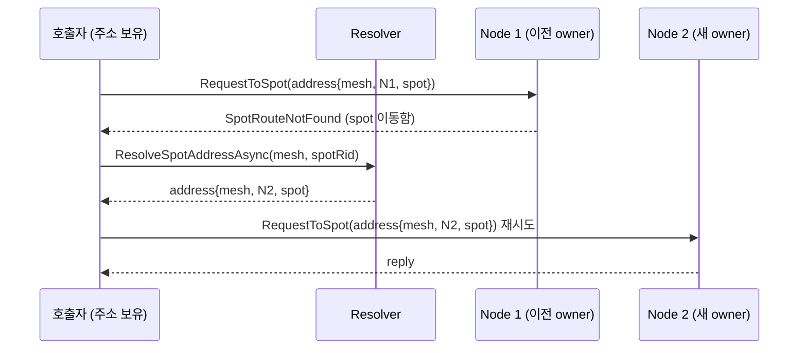

# Framework Spot 주소 기반 메시징 전환과 캐시 제거 계획 초안

> 이 문서는 구현 전 초안이다. 현재 공개 계약이 아니며, framework 구현, 언어별 API, 회귀 테스트가
> 끝난 뒤 정식 spec/guide 문서에 나누어 반영한다.
>
> 이 문서는 [framework-location-resolver-store.ko.md](framework-location-resolver-store.ko.md)의
> 후속 결정이다. location store/resolver 계약의 row 모델, owner lease, 자동연결은 그대로 두고,
> **spot 메시징 표면과 resolver 조회 표면, 캐시 정책만** 바꾼다. 두 문서가 충돌하면 이 문서가
> 우선하며, 구현 완료 후 location resolver/store 초안의 해당 절을 이 문서 기준으로 고친다.

## 1. 결정 요약

- spot 메시징 표면은 spot rid 하나가 아니라 **spot full 주소(node rid + spot rid)** 를 받는다.
  framework는 send/request 경로에서 위치를 resolve하지 않는다.
- 위치 resolve는 **명시적 control-plane 1회 조회**다. 반복 메시징이 필요하면 호출자가 조회 결과를
  자기 로직/상태에 보관하고 재사용한다.
- resolver는 두 가지 조회로 정리한다: **spot rid → spot full 주소**, **actor id → 그 actor가
  위치한 spot의 full 주소**.
- framework location resolver의 **캐시 기능(positive cache, TTL, freshness, cache 옵션,
  cache invalidation)은 계약과 구현에서 제거**한다. 조회 결과 캐싱이 필요한 사용자는 resolver를
  감싸서 자기 정책으로 구현한다.

## 2. 배경

현재 계약과 구현은 spot 메시징 표면이 spot rid만 받는다.

```csharp
// 현재: IZLinkSpotOutbound — 위치는 framework가 안에서 푼다.
IZLinkSendCall SendToSpot<TMessage>(RoutingId spotRid, TMessage message);
IZLinkRequestCall RequestToSpot<TRequest>(RoutingId spotRid, TRequest request);
```

이 형태 때문에 framework egress 경로(`ZLinkSpotRouteEgressDispatcher`)가 **send/request마다**
`spot rid -> owner node rid` resolve를 수행하고, 그 store 왕복을 감당하려고 resolver에
positive cache(TTL 1s, `Normal`/`Refresh` freshness, kind별 enable 옵션, invalidation event)가
들어갔다. 그런데 캐시를 실측 관점에서 보면:

- 캐시가 의미를 갖는 조건은 "resolve가 메시지 경로에 있고 같은 key가 TTL 안에 반복 조회될 때"
  하나뿐이다. 그 조건 자체가 spot rid만 받는 send 표면이 만든 것이다.
- 재연결, "없으면 생성", 운영 조회 같은 correctness 경로는 전부 `Refresh` 또는 runtime query로
  캐시를 우회하도록 계약되어 있다. actor/route cache는 `Normal`로 조회하는 소비자가 없다.
- 저빈도 key(초당 1건 미만)에서는 TTL 1s 캐시의 hit율이 사실상 0이라 store 부하를 줄이지 못한다.

즉 캐시는 send 표면의 설계를 보정하는 장치였고, 표면을 고치면 캐시의 존재 이유가 사라진다.
send가 주소를 받으면 framework 전송 경로는 숨은 store I/O가 없는 순수 경로가 되고, 위치 정보의
보관과 갱신 시점은 호출자가 명시적으로 소유한다.

## 3. 비목표

- location store 계약(key 모델, owner lease, generation, conditional upsert)은 바꾸지 않는다.
  row 모델에는 하나의 예외를 둔다: actor location row에 현재 위치의 spot mesh name 필드를
  추가한다(§5 — actor 주소의 완결성에 필요).
- 자동연결(peer location reconcile, change stamp, watch/polling)은 바꾸지 않는다. reconciler가
  들고 있는 peer snapshot과 owner lease 목록은 캐시 기능이 아니라 알고리즘 내부 상태이며 그대로
  유지한다(§8).
- generation fencing을 메시징 주소로 옮기지 않는다. fencing은 지금처럼 lifecycle
  claim/takeover guard가 담당한다.
- 전송 실패 시 framework가 자동으로 재resolve/재시도하는 편의 기능은 이 범위가 아니다. 필요가
  실측되면 opt-in helper로 별도 검토하되, 허용 경계를 미리 정해 둔다: **resolve를 숨기지 않고
  (주소가 API 표면에 계속 보인다), 재시도 정책이 명시적 파라미터인 wrapper까지만** 허용한다.
  내부에서 resolve를 대신 해 주는 overload는 이름만 바꾼 호환 표면의 부활이므로 금지한다.
- core socket framing은 바꾸지 않는다. spot route bridge는 비목표가 아니다 — relay framing
  단일화(§6)와 spot 부재 오류 reply(§7 선행 작업)는 이 계획이 소유하는 전송 동작 변경이다.

## 4. Spot 주소 모델

```csharp
/// <summary>spot 하나를 가리키는 자기완결 논리 주소. MeshName이 전송 route channel을
/// 결정하므로 주소만으로 전송 경로가 정해진다.</summary>
public readonly record struct ZLinkSpotAddress(
    string MeshName,
    RoutingId NodeRid,
    RoutingId SpotRid);
```

- **MeshName + NodeRid + SpotRid를 담는다.** 같은 runtime이 여러 spot mesh에 참여할 수 있으므로
  mesh가 빠지면 어떤 route channel로 보낼지 API 표면에서 결정할 수 없다 — mesh는 위치의
  일부다. 주소에 mesh가 있으면 다른 mesh의 outbound로 보내는 오용도 표면에서 검증된다.
  endpoint metadata는 넣지 않는다 — node로의 물리 연결은 자동연결(peer location)의 책임이고,
  메시징 주소는 mesh 연결이 있다는 전제 위의 논리 주소다.
- **generation을 넣지 않는다.** generation을 주소에 넣으면 node가 바뀌지 않은 generation
  bump에도 보유 주소가 전부 낡아져 재조회만 늘어난다. stale 판정은 owner lease와 수신측
  dispatch 실패가 담당한다(§7).
- **주소는 spot의 현재 활성 생애 동안만 유효한 값이다.** spot은 고정 인프라가 아니다 — 이동
  (takeover)하고, 소멸했다 재활성되며, actor 하나당 spot 하나를 할당하는 1:1 topology처럼
  생성·소멸이 actor lifecycle을 따라 잦은 구성도 있다. 주소 보유 기간은 대상 spot의 lifecycle에
  맞춰야 하고, 어긋난 보유는 §7의 실패 계약으로 드러난다.
- entry spot의 주소는 `NodeRid == SpotRid`다(entry spot row의 `SpotRid`는 spot node의 routing
  id이므로). 별도 특례를 두지 않는다.

### 네이밍 정리

같은 `RoutingId` 타입 두 개를 나란히 받는 내부 시그니처(`targetPeerRid`, `targetSpotRid`)는
순서 실수를 컴파일러가 잡지 못한다. 주소 도입과 함께 아래로 통일한다.

| 기존 이름 | 새 이름 | 비고 |
|-----------|---------|------|
| `targetPeerRid` / `owner node rid` (전송 파라미터) | `address.NodeRid` | 전송 표면에서 낱개 rid 파라미터 제거 |
| `targetSpotRid` (전송 파라미터) | `address.SpotRid` | 〃 |
| `ZLinkSpotLocationRidResolver` (rid → row 내부 resolver) | 제거 | egress 경로에서 resolve 자체가 사라짐 |
| "spot 위치" (조회 결과 서술) | "spot 주소" (`ZLinkSpotAddress`) | 메시징용 조회 결과의 정식 명칭 |

location row(`ZLinkSpotLocation`, `ZLinkActorLocation`)는 운영 조회·lifecycle용 모델로 이름을
유지한다. 주소는 row에서 파생되는 메시징용 값이다.

## 5. Resolver 계약 변경

`ZLinkResolveFreshness`는 캐시가 있어서 존재하는 개념이므로 enum과 파라미터를 모두 제거한다.
resolver는 항상 store를 읽고, owner lease join으로 유효성을 판정한 뒤 결과를 반환한다.

```csharp
// 변경 후 계약 (dotnet 기준)
public interface IZLinkSpotLocationResolver
{
    /// <summary>spot mesh 안에서 spot rid로 spot full 주소를 조회한다.
    /// 없거나 owner lease가 만료됐으면 null.</summary>
    ValueTask<ZLinkSpotAddress?> ResolveSpotAddressAsync(
        string meshName,
        RoutingId spotRid,
        CancellationToken ct = default);
}

public interface IZLinkActorLocationResolver
{
    /// <summary>actor가 위치한 spot의 full 주소를 조회한다.
    /// ENTRY_SPOT이면 entry spot 주소, USER_SPOT이면 그 user spot 주소. 없으면 null.</summary>
    ValueTask<ZLinkSpotAddress?> ResolveActorSpotAddressAsync(
        string actorType,
        string actorId,
        CancellationToken ct = default);
}
```

- spot 조회 입력은 location key 모델(`ZLinkSpotLocationKey = MeshName + SpotRid`)과 같다.
  spot rid는 mesh 안에서만 유일하므로 mesh 없는 rid 단독 조회는 모호하다 — 기존 내부
  resolver(`ZLinkSpotLocationRidResolver`)가 모든 mesh를 순회하던 것도 이 입력 누락의
  보정이었고, mesh를 명시하면 그 순회가 사라진다. 조회 입력의 mesh는 그대로 반환 주소의
  `MeshName`이 된다.
- actor 조회는 actor key(`ActorType + ActorId`)가 전역이므로 mesh 입력이 없다. 대신 actor
  location row가 현재 위치의 spot mesh name을 lifecycle 갱신마다 함께 기록해(생성 시 entry
  spot의 mesh, join 시 user spot의 mesh), resolver가 mesh를 포함한 완결 주소를 반환한다.
  호출자에게 topology 지식을 요구하지 않는다.
- `IZLinkPeerLocationResolver.ListPeersAsync`, `IZLinkRouteLocationResolver.ResolveRouteAsync`도
  freshness 파라미터만 제거하고 유지한다.
- actor 하나당 spot 하나를 할당하는 1:1 topology에서는 호출자가 아는 것이 transient한 spot
  rid가 아니라 actor id이므로 `ResolveActorSpotAddressAsync`가 1차 조회 표면이 된다. spot rid
  조회는 spot rid를 도메인 key에서 파생하는 topology(player owner spot 등)에서 쓴다.
- actor 재연결과 "없으면 생성" 판단, takeover 같은 lifecycle 흐름은 주소가 아니라 generation을
  포함한 location row가 필요하므로, resolver가 아니라 기존 store/runtime 경로를 그대로 쓴다.
  resolver는 메시징을 위한 조회 표면이다.
- 운영 조회(목록, topology, 진단)는 지금처럼 `IZLinkLocationRuntimeQuery`가 담당하며 항상 store를
  직접 읽는다. 이 구분(메시징 조회 vs 운영 조회)은 변경 없다.

resolve 알고리즘은 캐시 단계가 빠져 4단계로 준다.

```text
ResolveSpotAddress(meshName, spotRid)
  1. store에서 spot key(`MeshName + SpotRid`) 조회
  2. row의 OwnerId에 대한 owner lease 만료 여부 확인 (lease 목록 join)
  3. framework location model로 row 검증
  4. ZLinkSpotAddress(meshName, NodeRid, SpotRid) 반환 (불일치·만료면 null)
```

## 6. 메시징 표면 변경

```csharp
// 변경 후: IZLinkSpotOutbound — 주소를 받고, framework는 전송만 한다.
IZLinkSendCall SendToSpot<TMessage>(ZLinkSpotAddress address, TMessage message);
IZLinkRequestCall RequestToSpot<TRequest>(ZLinkSpotAddress address, TRequest request);
```

- spot rid만 받는 기존 overload는 **제거**한다(draft 단계의 파괴적 변경). 내부적으로 resolve를
  숨겨 주는 호환 overload를 남기면 이 전환의 목적이 사라진다.
- egress 경로(`ZLinkSpotRouteEgressDispatcher`)는 resolve를 하지 않는다: 전송 route channel은
  `address.MeshName`으로 선택하고, `address.NodeRid`가 local node면 직접 dispatch, 아니면 그
  channel의 route bridge로 `address.NodeRid`에 전달한다. location resolver 의존이 egress에서
  사라진다. local runtime이 `address.MeshName`의 참여자가 아니면 대기 없이 즉시 구성 오류로
  실패한다(§7).
- **원격 spot 전달의 wire form은 route socket 위의 spot route bridge relay framing 하나로
  고정한다.** 소켓 수준 SendToSpot framing과 bridge relay framing이 혼용되면 수신 pump가
  한쪽을 일반 envelope로 오인해 drop한다. 포팅 언어는 이 framing 하나만 구현한다.
  이 고정은 **framework node 간 route channel 평면에 한정**한다. 외부 connector client
  (`IZLinkRouteClient`, `IZLinkSpotPublisherClient`)가 spot node router 평면으로 직접 보내는
  inbound는 기존 계약 그대로이며 이 절의 범위가 아니다.
- entry spot 대상 메시징은 `ZLinkSpotAddress(nodeRid, nodeRid)`로 표현된다.

### 사용 패턴 — 조회 1회, 로직에서 재사용

```csharp
// 예: GameQuest session actor가 player owner spot으로 반복 메시징하는 경우.
// bind 시점에 1회 조회해서 session 상태에 보관한다.
var questSpot = await spots.ResolveSpotAddressAsync("quest-mesh", playerQuestSpotRid, ct);
if (questSpot is not { } address)
{
    // 미활성이면 도메인 규칙에 따라 활성화(placement) 경로로 넘어간다.
}

// 이후 gameplay event마다 보관한 주소로 전송한다. store 조회 없음.
await outbound.SendToSpot(address, new ApplyGameplayEvent(...)).SendAsync(ct);
```

framework 내부 호출자(bound session notify, actor session relay 등)도 같은 규칙을 따른다:
session bind/route 수립 시점에 resolve해서 session·binding 상태에 주소를 보관하고, 전송 실패
시 재resolve한다. 즉 "이름 없는 전역 캐시"가 각 보유자의 명시적 상태로 바뀐다.

주소 보유 범위는 대상 spot의 lifecycle에 맞춘다. player owner spot처럼 도메인 key에 묶여 오래
사는 spot은 session 상태에 보관해 재사용하고, actor 하나당 하나를 할당하는 1:1 spot처럼 actor
lifecycle을 따라 생성·소멸하는 spot은 상호작용 범위에서만 조회·보관한다. 보유가 lifecycle보다
길어진 경우는 §7의 실패 계약이 재조회로 유도한다.

## 7. stale 주소 실패 계약

owner 이동, node 장애, 그리고 정상 lifecycle의 spot destroy(actor 1:1 spot의 actor 종료 등)
후 보유 주소는 낡는다. 이 설계의 핵심은 그때의 실패가 **구분 가능**해야 한다는 것이다.

| 경로 | stale 주소일 때의 동작 | 호출자 책임 |
|------|------------------------|-------------|
| `RequestToSpot` | 로컬에서 판정 가능한 실패(모르는 node, 미연결)는 대기 없이 즉시 typed error로 반환한다. node에 도달했는데 spot이 없으면 수신측이 `SpotRouteNotFound` 오류 reply를 보낸다. timeout은 "전송했고 응답이 없다"에만 남는다. | 오류 종류별 아래 분류표를 따른다(횟수·정책은 호출자 소유). |
| `SendToSpot` | best-effort. 대상 node에 spot이 없으면 packet은 버려지고 통지는 없다. | 도메인 보정(reconcile 등)이나 location event 구독으로 회복. |

### request 실패 분류 — fail-fast

로컬에서 이미 판정할 수 있는 상태를 submitter가 재시도로 흡수해 generic timeout으로 뭉개면,
호출자는 재resolve 시점을 알 수 없어 이 설계 전체가 무너진다. request 실패는 판정 즉시 구분
가능한 오류로 반환한다. 오류 종류는 전부 기존 `ZLinkFrameworkErrorKind`를 쓴다.

| 상태 | 판정 위치 | 오류 | 호출자의 다음 행동 |
|------|-----------|------|--------------------|
| local runtime이 `address.MeshName`에 미참여 | local, 즉시 | 구성 오류(`ZLinkConfigurationException`) | 재시도 대상 아님 — 잘못된 주소 사용, 코드/구성 수정 |
| mesh가 모르는 node rid | local, 즉시 | `RequestTargetNotFound` | 재resolve (주소가 근본적으로 낡음) |
| node는 알지만 미연결 | local, 즉시 | `RouteNotConnected` (`IsRetriable=true`) | 짧은 backoff 재시도 — mesh 수렴 창(reconcile 한 tick)일 수 있다. 반복되면 재resolve |
| node 도달, spot 부재 | 수신측, 오류 reply 1왕복 | `SpotRouteNotFound` | 재resolve 후 재시도 |
| 전송 후 무응답 | timeout | timeout | 도메인 정책 (요청 중복 위험을 고려) |

"모르는 node"와 "미연결"의 로컬 판정은 **자동연결 reconciler의 mesh 구성원 snapshot(§8이
캐시가 아닌 알고리즘 상태로 유지하는 것)과 소켓 연결 상태에서만** 나온다. 판정 기준은 desired
dial set이 아니라 **mesh 구성원 전체**다 — pairwise initiator 때문에 상대가 나를 dial하는
peer는 desired set에 없지만 rid 지정 가능한 도달 대상이다. 구성원 row가 있는데 연결이 아직
수렴하지 않았으면 미연결, 구성원 row 자체가 없으면 모르는 node다. 이 판정을 위해 전송
경로에서 store를 읽지 않는다 — 읽는 순간 이 문서의 제1원칙(숨은 store I/O 금지)이 §7에서
깨진다. 자동연결 없이 수동 connect만 쓰는 구성은 snapshot이 없으므로 이 구분 없이 기존
동작(연결 수렴 대기)을 유지한다.

미연결을 즉시 오류로 반환하면 startup·mesh 수렴 창에서 오류가 호출자에게 그대로 드러난다.
이건 의도된 동작이다 — 그 창을 매끄럽게 넘기는 대기·재시도 편의는 submitter가 몰래 하는 게
아니라 §3의 helper 경계(명시적 재시도 정책 파라미터) 안에서 제공한다.

### 재시도의 의미

이 문서의 재시도는 framework가 전송 계층에서 몰래 반복하는 것이 아니라, **호출자가 오류를
보고 같은 API를 다시 부르는 명시적 재호출**이다. 오류 종류가 재호출의 형태를 가른다.

| 재시도 형태 | 트리거 | 이유 |
|-------------|--------|------|
| 같은 주소로 재전송 | `RouteNotConnected` (`IsRetriable=true`) | 주소는 유효하고 연결만 아직 없다 — mesh 수렴 창(reconcile 한 tick)일 수 있으므로 짧은 backoff 후 같은 주소로 다시 부른다. 몇 회 반복해도 실패하면 재resolve로 전환한다 |
| 재resolve 후 재전송 | `SpotRouteNotFound`, `RequestTargetNotFound` | 주소 자체가 낡았다 — 같은 주소 재호출은 무의미하므로 `ResolveSpotAddressAsync(mesh, spotRid)`로 새 주소를 받아 그 주소로 다시 부른다 |
| 재시도 금지 | 구성 오류(미참여 mesh) | 몇 번을 불러도 같은 결과다 — 재시도 대상이 아니라 코드/구성 수정 대상이다 |
| 도메인 판단 | timeout(전송 후 무응답) | handler 실행 여부를 알 수 없어 재호출이 중복 실행이 될 수 있다 — 도메인 idempotency(예: 같은 `IdempotencyKey` → 같은 `EventId`)가 있을 때만 재시도한다 |

재시도가 안전한 근거는 오류마다 다르다. 로컬 판정 오류(미연결, 모르는 node)는 요청이 밖으로
나가지 않았고, `SpotRouteNotFound`는 node에 도달했어도 spot이 없어 handler가 실행되지 않았다.
즉 앞의 두 형태는 **handler 미실행이 확정**이라 중복 위험 없이 재호출할 수 있다. timeout만
실행 여부가 불확정이라 도메인 판단으로 넘긴다.

전송 계층의 숨은 재시도는 금지한다. submitter가 NotConnected를 속으로 재시도하다 generic
timeout으로 끝내는 현재 동작이 제거 대상 1호다(아래 전송 스택 정비). 자동 재시도가 필요한
사용자는 §3의 helper 경계 — 재시도 횟수·backoff가 명시적 파라미터인 wrapper — 를 쓴다.



- errno는 기존 `ZLinkFrameworkErrorKind`의 `SpotRouteNotFound`(spot 부재),
  `ActorRouteNotFound`(actor 대상), `RequestTargetNotFound`(모르는 node),
  `RouteNotConnected`(미연결)를 그대로 쓴다. 새 종류를 추가하지 않는다.
- `RouteNotConnected`의 `IsRetriable=true`는 "**전송 전 실패라 요청 중복 없이 안전하게
  재시도할 수 있다**"는 의미다. timeout(전송 후 무응답)과의 대비가 이 분류표의 실질
  가치다 — timeout 재시도는 요청 중복 위험을 호출자가 감수해야 한다.
- destroy된 spot의 주소는 재resolve가 null을 반환한다. 재활성(placement 경로)할지 포기할지는
  도메인 결정이다.
- **spot 이동·재활성은 메시지 순서·전달 경계다.** 이동 창에서 이전 주소로의 in-flight 전송은
  drop될 수 있고 새 주소 전송은 도달하므로, 이동을 가로지르는 전달 순서와 전달 자체를 보장하지
  않는다. 순서에 민감한 도메인(event sourcing 등)은 이 경계를 dedupe·reconcile 보정으로
  흡수한다.
- send-only로 오래 보유하는 주소는 stale을 스스로 알 수 없다. 이런 보유자는
  spot location event source(`framework location event`)를 구독해 보유 주소를 무효화하거나,
  주기 request(health/‌sync 성격)를 섞어 stale을 노출시킨다. 어느 쪽을 쓸지는 사용자 설계다.
- 재resolve 직후에도 store 반영 지연(lease polling 한 tick) 동안 null이나 이전 주소가 나올 수
  있다. 호출자 재시도는 이 창을 감안해 bounded backoff를 갖는 것을 권장한다.

### 전송 스택 정비 — 이 계약의 선행 작업

위 표의 실패 구분은 현재 전송 스택이 이미 보장하는 사실이 아니라 **이 계획이 만들어야 하는
상태**다. 실측 기준 현재 동작과 정비 대상은 아래와 같다.

| 현재 동작 | 문제 | 정비 |
|-----------|------|------|
| 미연결 node로의 send/request를 submitter가 재시도 대상(NotConnected)으로 분류하고, 최종적으로 generic timeout으로 끝낸다 | 로컬에서 즉시 판정 가능한 실패가 timeout 뒤에 숨어, 호출자가 재resolve 시점을 알 수 없다 | **rid 지정 router 전송 경로에 한정해** NotConnected 재시도 흡수를 제거하고 위 fail-fast 분류표대로 즉시 반환한다. dealer/pub의 connect-창 버퍼링(client/server 채널이 dial 직후 send하는 패턴)은 유지한다. 실제 구현 지점은 두 곳 — egress의 bridge 호출부(원격 spot request는 bridge native `start_request` 경로라 framework submitter를 타지 않는다)와 route mesh 직접 요청의 submitter. 회귀 테스트 대상 |
| send는 fire-and-forget submit이라 local submit 실패도 무통지다 | §7 표의 drop 시멘틱보다 나쁜 상태 — 로컬 큐에서 죽어도 관측할 수 없다 | 최소 debug/monitoring event로 submit 실패를 관측 가능하게 한다 |
| `SpotRouteNotFound`는 수신측 bridge가 spot 부재 시 오류 reply를 보내야 성립한다 | 아직 검증되지 않은 가정이다 | 수신측 bridge의 spot 부재 오류 reply를 구현·검증 범위에 포함한다 |

이 정비 없이는 "재resolve 후 재시도" 계약이 실행 불가능하므로, §10 구현 순서에서 contracts
전환보다 먼저 처리한다.

## 8. 캐시 제거 범위

### 계약에서 제거

- `ZLinkResolveFreshness` enum과 4개 resolver의 freshness 파라미터.
- location resolver 캐시 정책 절 전체(초안 §10): kind별 cache enable, positive TTL,
  max entries, not-found 비캐시 규칙.
- cache 관련 option 표면(초안 §20.4의 cache 항목)과 runtime status의 cache entry count 필드.
- cache invalidation event(초안 §20.5의 해당 항목). 단 **resolve-miss 관측**(디버그/모니터링
  event)은 캐시와 무관한 stale-loop 진단 수단이므로 남긴다.

### 구현에서 제거 (dotnet 기준)

| 대상 | 처리 |
|------|------|
| `ZLinkStoreLocationResolvers`의 `PositiveCache` 4종과 TTL/entry 관리 | 삭제. resolver는 store 조회 + lease join만 수행 |
| `Contracts/Locations/Options.cs`의 cache 옵션들 | 삭제 |
| `Contracts/Locations/Resolvers.cs`의 `ZLinkResolveFreshness` | 삭제, 시그니처 정리 |
| `ZLinkSpotRouteEgressDispatcher`의 per-send resolve와 `ZLinkSpotLocationRidResolver` | 삭제. 주소 기반 전송으로 대체 |
| route 전송마다 peer row를 조회해 직송/egress 경로를 고르는 로직 (commit `bffb264e2`) | 삭제. 전송 경로의 store 조회 금지 원칙과 충돌 — 주소 기반 전환 시 함께 제거 |
| runtime status의 cache counter, cache invalidation event 발행 | 삭제 |

### 캐시가 아니므로 유지

- 자동연결 reconciler의 **peer snapshot + change stamp**: 무변경 tick을 O(1)로 만들기 위해
  reconcile 알고리즘이 어차피 들고 있어야 하는 직전 상태다.
- resolver/reconcile의 **owner lease 목록**(polling interval마다 갱신, staleness 상한 = 한 tick):
  row 유효성 join을 local에서 수행하기 위한 알고리즘 상태다.

이 둘은 location resolver/store 초안에서 "cache"라는 단어 대신 내부 상태로 다시 서술한다.

## 9. location resolver/store 초안 수정 목록

구현 반영 후 [framework-location-resolver-store.ko.md](framework-location-resolver-store.ko.md)를
아래와 같이 고친다.

| 절 | 수정 |
|----|------|
| §1.1 스케일 원칙 | "일반 packet 경로는 이미 연결된 route와 local cache를 사용한다" → "일반 packet 경로는 호출자가 보관한 spot 주소와 이미 연결된 route를 사용한다" |
| §4 이관 표 | cache 정책 참조 3곳(서두 문단, service list broadcast, spot owner resolve)을 주소 기반 모델 서술로 교체 |
| §8 Resolver 계약 | freshness enum·표 제거, 주소 반환 시그니처로 교체 |
| §8.2 runtime status | cache entry count 필드 제거 |
| §10 캐시 정책 | 절 삭제, 이 문서로의 포인터만 남김 |
| §15.2/§15.3, §16.2/§16.3 | resolve 알고리즘에서 cache 단계 제거, "일반 spot packet send/request는 단건 ResolveSpot을 사용한다" → 주소 기반 전송 서술로 교체 |
| §6.3, §16.1 | actor location row에 현재 위치의 spot mesh name 필드 추가 — 생성(entry spot)·join(user spot)·leave lifecycle event가 mesh를 함께 기록 |
| §14.3 | 이 문서의 전제("mesh 연결이 있다는 전제 위의 논리 주소")를 지탱하는 자동연결 규칙 — endpoint 없는 구성원의 initiator 예외, 재시작 peer의 owner 변경 handover — 를 선행 반영 |
| §17 | "cache만 믿지 않는다" 단락을 store/runtime 직접 경로 서술로 단순화 |
| §20.3/§20.4/§20.5 | resolver API 시그니처, cache option, cache invalidation event 항목 갱신 |
| §22, §24 | cache 회귀 테스트·확인표 항목을 §10(이 문서) 기준으로 교체 |

## 10. 구현 순서

1. **전송 스택 정비 (dotnet)**: §7의 선행 작업 3건 — request 실패 errno 분류, send submit 실패
   관측, 수신측 bridge의 spot 부재 오류 reply — 를 먼저 완료한다. 이게 없으면 주소 계약의 실패
   흐름이 성립하지 않는다.
2. **contracts (dotnet)**: `ZLinkSpotAddress` 추가, resolver 시그니처 교체, freshness 제거,
   `IZLinkSpotOutbound` 주소 기반으로 교체.
3. **runtime (dotnet)**: `ZLinkStoreLocationResolvers` 캐시 제거, egress dispatcher 주소 기반
   전환(route 전송마다 peer row를 조회하는 경로 제거 포함), framework 내부 호출자(bound
   session notify 등)의 주소 보관·재resolve 적용.
4. **samples/E2E (dotnet)**: GameQuest·SupportChat·DeliveryDispatch의 owner 메시징 경로를
   조회 1회 + 보관 패턴으로 정리, config-2 spot service E2E 갱신. 샘플 시나리오 문서도 같은
   단계에서 정렬한다 — 특히 `gamequest.ko.md`의 "owner routing by PlayerId"와 "첫 메시징에서
   활성(생성)" 서술을 session actor가 주소를 명시적으로 조회·활성·보관하고 stale 실패 시
   재조회하는 흐름으로 바꾼다. 샘플 문서는 현재 구현 기준이므로 구현 전환 전에 먼저 바꾸지
   않는다.
5. **문서**: 이 초안 확정 → §9의 수정 목록 반영 → 정식 spec/guide 반영 시 함께 이관.
6. **타 언어 포팅**: location store 포팅 순서(초안 §21)에 이 변경을 포함해 함께 진행한다.
   spot rid 단독 send 표면을 새 언어에 이식하지 않는다.

## 11. 회귀 테스트

- 주소 기반 send/request: local node 주소, 원격 node 주소, entry spot 주소(`NodeRid == SpotRid`).
- stale 주소: spot 이동 후 이전 주소로 request → `SpotRouteNotFound`, 재resolve 후 성공.
- transient spot(actor 1:1 할당): destroy 후 이전 주소로 request → `SpotRouteNotFound`,
  재resolve → null, 재활성 후 새 주소로 성공.
- 실패 분류(fail-fast): 모르는 node → 즉시 `RequestTargetNotFound`, 미연결 node → 즉시
  `RouteNotConnected`(대기·timeout 없음), spot 부재 → `SpotRouteNotFound` 오류 reply,
  timeout은 전송 후 무응답에서만 발생(§7 분류표의 수용 기준).
- send submit 실패 관측: 미연결 node로의 send가 monitoring event로 관측됨.
- send best-effort: spot 이동 후 이전 주소로 send → 오류 없이 drop, 도메인 reconcile로 회복
  (GameQuest reset/reconcile 시나리오 재사용).
- resolver: 같은 key 연속 조회가 매번 store에 도달함(캐시 부재 검증, store 호출 수 계측).
- resolver lease join: owner lease 만료 row는 주소로 반환되지 않음.
- actor 주소 조회: ENTRY_SPOT/USER_SPOT 각각에서 mesh를 포함한 완결 주소 반환(호출자
  topology 지식 불필요 검증). join/leave 후 row의 mesh 갱신 확인.
- 다중 spot mesh: 두 mesh에 참여한 runtime에서 주소의 `MeshName`으로 route channel이
  선택됨. 미참여 mesh 주소는 대기 없이 즉시 구성 오류.
- egress dispatcher: location resolver 의존이 없음(전송 경로에서 store 호출 0 검증).
- 자동연결: peer snapshot + change stamp 동작이 캐시 제거와 무관하게 유지됨.

## 12. 진행 확인표

- [x] 전송 스택 정비: request 실패 fail-fast 분류 — rid 지정 router 경로 한정, 판정 소스 = reconciler snapshot + 소켓 상태 (§7)
- [x] 전송 스택 정비: send submit 실패 관측 event (§7)
- [x] 전송 스택 정비: 수신측 bridge spot 부재 오류 reply 구현·검증 (§7)
- [x] contracts: `ZLinkSpotAddress` + resolver 시그니처 교체 + freshness 제거 (§4, §5)
- [x] runtime: resolver 캐시 제거 (§8)
- [ ] runtime: egress 주소 기반 전환 + per-send resolve 제거 + `bffb264e2` 경로 제거 (§6, §8)
- [ ] runtime: framework 내부 호출자(bound session notify, actor session relay) 주소 보관·재resolve 전환 (§6)
- [ ] 샘플: GameQuest·SupportChat·DeliveryDispatch 조회 1회 + 보관 패턴 정리 (§10.4)
- [ ] E2E: config-2 spot service 갱신 + DD courier 결정 릴레이·YD shutdown-recovery 잔여 실패 소화 (§10.4)
- [ ] 문서: §9 수정 목록 반영 (location resolver/store 초안 갱신)
