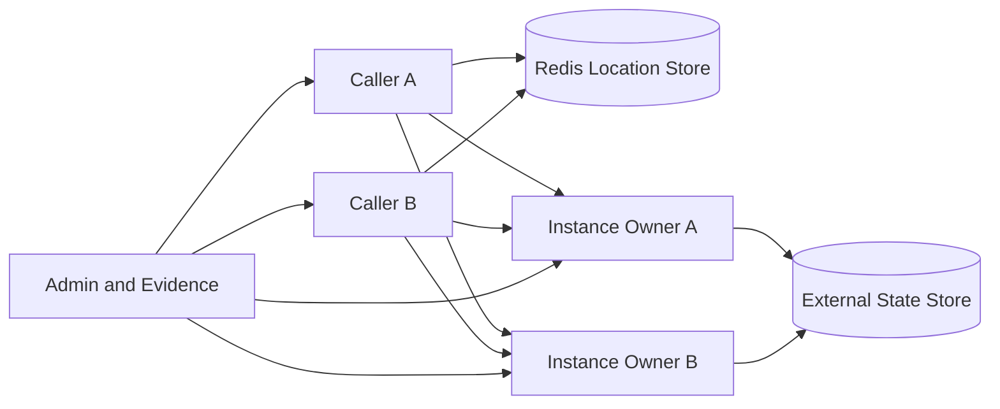

<!-- framework-adapter-nav:start -->
[E2E 목차](README.ko.md) | [이전: One-way submit admission](config-13-submit-admission.ko.md)
<!-- framework-adapter-nav:end -->

# Config 14 — Instance Spot activation

이 config는 `InstanceSpotAddress`로 보낸 첫 direct send/request가 Location authority owner 하나와
언어별 Framework runtime의 Instance Spot 하나로 수렴하는지 검증한다. Location row가
`Ready`가 되기 전에는 application handler를 실행하지 않고, `Ready` commit 뒤에는 첫
message부터 Instance Spot queue에서 순서대로 처리해야 한다.

기존 `SpotHandle`과 Spot manager는 existing-only·local-only다. 이 config는 해당 표면에 숨은 remote
creation을 추가하는 근거가 아니다. Core와 bindings는 raw socket transport만 제공하며 Instance
activation, owner claim, barrier와 queue를 해석하지 않는다.

공개 계약은 [비동기 실행 정책](../../spec/04-async-execution-policy.ko.md),
[Spot 메시징](../../spec/server/20-spot-messaging.ko.md),
[Spot 주소 메시징](../../spec/server/24-spot-address-messaging.ko.md),
[Location runtime](../../spec/server/40-location-runtime.ko.md)과
[Redis location store](../../spec/server/41-location-store-redis.ko.md)가 소유한다.

## 1. 검증 범위

- Address는 MeshName, stable Instance Spot type과 Spot RID만 포함한다.
- 같은 MeshName에서 type을 제공하고 `Serving` 상태이며 maintenance 대상이 아닌 node만
  placement 후보가 된다.
- Source runtime은 public send deadline 안에서 Location Store resolve, eligible target 선택과 `ColdActivating`
  authority claim을 끝낸 뒤 fenced outbound record를 제출하며 caller에게 endpoint, node RID, owner token과
  generation을 요구하지 않는다.
- Target runtime은 새 claim을 만들지 않는다. Source가 전달한 current authority와 owner lease fence를 exact
  확인하고 activation leader 하나만 factory를 실행한 뒤 `Ready` CAS를 수행한다.
- Source가 `ColdActivating` claim 뒤 target submit 전에 종료되면 exact target owner는 initial·background bounded
  authority scan으로 기존 claim을 발견해 같은 activation barrier를 idempotent하게 재개한다. Scan은 owner를
  선택하거나 새 row를 만들지 않고 original operation payload를 숨게 재제출하지 않는다.
- Internal activation barrier가 닫혀 있는 동안 업무 message와 timer를 application handler에 전달하지
  않는다.
- `Ready` owner에 보낸 후속 message는 cold first message를 추월하지 않는다.
- Actor membership과 Logical Multicast subscription은 Instance Spot에 등록할 수 없다.
- CAS loser의 application pre-admission redirect 한 번 외에는 send/request를 다른 owner에게 재제출하지
  않는다.
- Instance one-way call은 source outbound admission으로 완료하며 remote handler 실행 완료를
  기다리지 않는다.
- Process pause 뒤 재개한 stale owner는 local monotonic authority deadline을 확인하고 message,
  timer, factory completion과 Store CAS를 모두 거부한다.

HTTP client package와 stream connector package에는 Instance Spot API를 추가하지 않는다. Client는 실제
역할 server의 HTTP endpoint를 호출하고, 역할 server가 Framework 공개 API로 Instance Spot을 호출한다.

## 2. 서버 구성

다이어그램의 화살표는 검증에서 사용하는 호출·제어 관계다. Actual owner는 caller가
endpoint를 지정해 선택하지 않고 Location authority CAS가 결정한다.

| 역할 | 수 | 책임 |
|---|---:|---|
| `InstanceCaller` | 2 | 서로 다른 process에서 같은 address와 서로 다른 address로 send/request를 시작한다 |
| `InstanceOwner` | 2 | 같은 MeshName·Instance type factory를 제공하고 activation·handler·timer evidence를 기록한다 |
| `SpotOwner` | 1 | 같은 RID의 Entry·User Spot 충돌과 existing-only Spot 회귀를 검증한다 |
| `MultiMeshCaller` | 1 | 다른 MeshName의 같은 RID·type과 outbound operation을 격리한다 |
| Redis Location Store | 1 | Descriptor, owner lease, Instance authority와 CAS를 제공한다 |
| External State Store | 1 | Factory 복구와 reference sample의 domain state를 보존한다 |
| `AdminAndEvidence` | 1 | Process pause·resume·crash, barrier와 bounded evidence wait를 제어하며 Framework message를 대신 보내지 않는다 |

Runner는 자신이 시작한 Redis와 child process만 정리한다. Readiness와 evidence 대기는
[E2E 공통 로컬 대기 기준](README.ko.md#21-로컬-e2e-대기-기준)을 따른다. 로컬 실패를
통과시키기 위해 timeout과 settle 값을 늘리지 않는다.

## 3. 결정적 경합 제어

### 3.1 Lease와 Store 시각

Lease 시나리오는 장시간 `sleep`으로 만료를 추정하지 않는다. Redis script는 authority row,
owner lease와 Redis `TIME`을 한 operation에서 반환한다. 검증 전용 clock hook은 expiry 경계를
앞당길 수 있지만 CAS 결과를 만들거나 authority 검증을 우회하지 않는다.

Evidence는 operation ID, Store call 시작·완료의 local monotonic 시각, `StoreNow`,
`LeaseExpiresAt`, fencing margin, owner ID, authority owner generation, object generation, opaque store version과 CAS
status를 같이 기록한다.

### 3.2 Activation barrier

Factory 초기화 뒤와 `Ready` CAS 전에 internal test barrier를 둔다. 이 barrier는 public API가
아니며 activation 결과를 변경하거나 handler를 직접 호출하지 않는다. Barrier가 닫혀 있을
때는 application handler count 0, activation leader 1, bounded pending record 수와 type slot 1을
확인한다. Barrier를 열면 `Ready` CAS를 먼저 확인한 뒤 admission sequence 순서로 handler가
실행되어야 한다.

### 3.3 Process pause·crash

Stale owner 검증은 owner process를 실제로 중지했다가 local monotonic authority deadline 뒤에
재개한다. Crash 시나리오는 정상 maintenance endpoint를 사용하지 않고 process를 종료한다.
정상 `Retire`·`Shutdown` 결과와 crash recovery evidence를 섞지 않는다.

### 3.4 Call deadline

짧은 request와 긴 request는 같은 activation group에 제출하되 각 public deadline을 유지한다. Address
resolve·claim에 사용한 시간도 각 deadline에 포함한다. 짧은 request가 만료되어도 shared
activation, 긴 request와 one-way send를 취소하지 않는다.

## 4. Contract test matrix

### 4.1 Raw Core·bindings 경계

| ID | 검증 대상 | 완료 조건 |
|---|---|---|
| `IS-R01` | 제거 표면 | Core install header·export와 네 bindings public package에 Instance target·token·activation·claim·barrier type·function이 0건 |
| `IS-R02` | Raw capability | 네 bindings의 공개 raw socket API만으로 multipart, routing ID, monitor, bounded send·receive와 close를 구현할 수 있음 |
| `IS-R03` | Package boundary | Framework가 binding private symbol, reflection, generated native service symbol과 Core private header를 사용하지 않음 |

### 4.2 Framework public contract

| ID | 검증 대상 | 완료 조건 |
|---|---|---|
| `IS-F01` | Address | MeshName, stable Instance type과 Spot RID만 포함하고 언어별 equality·hash·UTF-8 검증이 같음 |
| `IS-F02` | Factory | Actor-free Instance lifecycle과 packet·timer handler registry만 제공하고 잘못된 capability를 startup에서 거부 |
| `IS-F03` | Builder | Factory option과 send/request overload가 다섯 public 언어에서 같은 의미를 가짐 |
| `IS-F04` | Descriptor | Instance type set을 정렬·중복 제거해 게시하고 runtime 중 변경하지 않음 |
| `IS-F05` | Placement | 같은 MeshName, valid lease·generation, `Serving`, type capacity를 모두 만족하는 node만 선택 |
| `IS-F06` | Location authority | Claim, `Ready`, `Closing`, release가 opaque expected-version CAS와 같은 state transition을 사용 |
| `IS-F07` | Activation leader | 같은 logical address의 concurrent call이 leader, factory, DI scope과 type slot 하나로 수렴 |
| `IS-F08` | Ordering | Configure, message 없는 initialize, `Ready` CAS, barrier open, first message 순서를 지킴 |
| `IS-F09` | Failure cleanup | Factory·initialize·`Ready`·barrier 실패에서 local barrier를 닫고 request를 typed terminal-once로 완료하며 one-way drop·event를 기록한다. Exact owner fence로 row를 삭제한 뒤 Missing 또는 current replacement를 확인하고 queue·scope·slot을 한 번 정리하며 같은 registry에서 hidden rerun을 하지 않음 |
| `IS-F10` | 재제출 경계 | CAS loser redirect 한 번 외의 hidden retry·replay가 없음 |
| `IS-F11` | Lease fence | Local monotonic deadline 뒤 stale message·timer·factory completion·CAS를 application admission 전에 거부 |
| `IS-F12` | Takeover | Background cleanup이 owner를 선택하지 않고 expiry 뒤 새 caller claim만 더 높은 authority owner generation과 store version으로 교체. Exact owner의 recovery scan은 기존 `ColdActivating` claim만 재개 |
| `IS-F13` | Maintenance | 신규 placement 제외, accepted turn, `Closing`, release가 host deadline과 terminal-once를 지킴 |
| `IS-F14` | Observability | Activation 결과·시간, bounded pending, conflict, takeover과 one-way drop을 bounded label로 기록 |
| `IS-F15` | Async-only | Instance send에도 async submit 하나만 제공하고 `TrySubmit` 계열을 제공하지 않음 |

### 4.3 Internal protocol·runtime contract

| ID | 검증 대상 | 완료 조건 |
|---|---|---|
| `IS-P01` | Cold target | MeshName, node·Spot identity, Instance type, packet contract과 request correlation을 보존 |
| `IS-P02` | Authority fence | Source가 outbound 전 claim한 owner ID, authority owner generation, object generation, store version과 lease-derived deadline을 target admission에서 exact match하며 target claim은 0건 |
| `IS-P03` | Bounded queue | Activation 중 message·byte 상한, FIFO과 request terminal-once를 보존 |
| `IS-P04` | Barrier | `Ready` CAS 전 application handler count 0, barrier open 뒤 admission sequence 순서를 보존 |
| `IS-P05` | Failure code | Stable wire code, payload presence과 unknown code를 네 decoder가 같게 검증 |
| `IS-P06` | Resource cleanup | Close, lease expiry, activation abort과 host terminal 뒤 pending operation·timer·scope·socket이 남지 않음 |
| `IS-P07` | Lost source submit | Source claim 뒤 submit 전 crash를 target owner의 bounded recovery scan이 같은 generation·barrier로 수렴시키고 original payload는 재제출하지 않음 |
| `IS-P08` | Activation failure release | Factory·initialize·`Ready` 실패는 current Store version, object generation, authority owner generation과 owner lease를 모두 확인한 delete로만 `ColdActivating` row를 제거한다. 결과가 불명확하면 exact read로 수렴하고 Missing 뒤 다음 caller만 새 generation으로 claim함 |

## 5. 회귀 시나리오

| ID | 검증 대상 | 완료 조건 |
|---|---|---|
| `IS-REG-01` | Missing `SpotHandle` | Existing handle 호출은 not-found이며 Instance activation을 시작하지 않음 |
| `IS-REG-02` | Generation fence | Direct Spot generation 0·stale generation을 거부하고 create-if-missing으로 해석하지 않음 |
| `IS-REG-03` | 일반 Spot local creation | Entry·User Spot의 local Create·GetOrCreate가 하나로 수렴하고 remote placement를 시작하지 않음 |
| `IS-REG-04` | Entry Spot | Startup Entry Spot, Actor 기본 위치와 shutdown 순서가 유지됨 |
| `IS-REG-05` | Actor membership | Entry·User Spot의 Actor join·leave·transfer는 유지되고 Instance target에서만 거부됨 |
| `IS-REG-06` | 일반 Spot maintenance | Entry·User Spot authority를 Instance kind로 변경하거나 자동 activation하지 않음 |
| `IS-REG-07` | Channel messaging | Channel handler 선택·reply correlation이 Instance resolve의 영향을 받지 않음 |
| `IS-REG-08` | Row compatibility | `Activating`·`Closing` Instance row를 `SpotHandle`로 반환하지 않음 |
| `IS-REG-09` | Kind·type conflict | 유지 중인 Entry·User Spot 또는 다른 Instance type을 변경하지 않고 activation 전에 실패 |
| `IS-REG-10` | Existing send | `Ready` Instance를 포함한 existing-only send가 exact direct route와 source submit 의미를 사용 |
| `IS-REG-11` | Existing request | Request deadline·cancellation·terminal-once가 Instance hidden retry로 바뀌지 않음 |
| `IS-REG-12` | Public surface | Address·factory·async send/request만 노출하고 raw placement·token·phase helper를 노출하지 않음 |
| `IS-REG-13` | Multi-Mesh | 같은 RID·type을 다른 MeshName에서 사용해도 source, authority, queue와 generation이 분리됨 |
| `IS-REG-14` | Core·binding removal | Core·binding public surface에 Instance service API를 복구하지 않음 |

## 6. E2E 시나리오

| ID | 시나리오 | 완료 조건 |
|---|---|---|
| `IS-E2E-01` | Cold request | Row가 없는 address의 첫 request가 claim·factory·`Ready` 뒤 handler에서 한 번 실행되고 reply를 반환 |
| `IS-E2E-02` | Cold send | Resolve·selection·claim과 outbound admission은 같은 send deadline 안에서 끝나고 Submit은 outbound admission으로 완료되며 target factory·Ready를 기다리지 않음. Target activation 실패는 이미 반환한 결과를 바꾸지 않고 drop·flow event로 관측 |
| `IS-E2E-03` | Concurrent first call | 두 caller의 request 100개가 authority owner·runtime object·factory 하나와 handler concurrency 1로 수렴 |
| `IS-E2E-04` | Different address | 여러 RID가 eligible node에 분산되고 RID별 serial queue가 서로를 차단하지 않음 |
| `IS-E2E-05` | `Ready` owner crash | Lease 만료 전에는 새 owner가 없고 expiry 뒤 새 call만 같은 object generation과 더 높은 authority owner generation으로 복구 |
| `IS-E2E-06` | `Activating` owner crash | Pending request가 claim에서 발급한 같은 nonzero object generation과 owner fence의 terminal failure로 완료되고 lease expiry 뒤 새 call만 activation을 시작 |
| `IS-E2E-07` | Normal `Retire` | 신규 placement에서 A를 제외하고 accepted turn·owner commit 뒤 B가 같은 object generation과 더 높은 authority owner generation으로 materialize |
| `IS-E2E-08` | Close and reactivate | `Closing` 중 신규 activation을 막고 release 뒤 새 call만 더 높은 object·authority owner generation을 사용 |
| `IS-E2E-09` | Concurrent takeover | 만료 row를 신고한 두 caller 중 CAS winner의 factory·handler만 실행 |
| `IS-E2E-10` | Stale owner resume | A를 deadline 뒤 재개해도 message·timer·factory completion·CAS·release를 수행하지 못함 |
| `IS-E2E-11` | Confirmed not admitted | Target 미수락이 확정되어도 같은 request를 다른 owner에 재제출하지 않고 terminal 하나로 완료 |
| `IS-E2E-12` | Ambiguous result | Target 수락 뒤 connection을 종료해도 다른 owner로 재제출하지 않음 |
| `IS-E2E-13` | Accepted send then failure | 다른 owner에서 replay하지 않고 runtime error·trace·drop metric으로 관측 |
| `IS-E2E-14` | Store outage | Authority deadline 뒤 cached route와 target admission을 막고 missing address를 local 상태로 추측하지 않음 |
| `IS-E2E-15` | Kind·type atomic conflict | 같은 `(MeshName, SpotRid)`에 Entry 또는 User Spot create와 Instance cold request를 동시에 제출해 authority CAS winner의 kind·type·factory 하나만 성공하고 loser가 별도 location row·generation을 남기지 않음. Winner close 뒤 다른 kind를 만들면 더 높은 object generation을 사용 |
| `IS-E2E-16` | No eligible node | Request와 send가 target-not-found로 종료하고 authority row를 남기지 않음 |
| `IS-E2E-17` | Activation backpressure | Message·byte 상한 초과가 bounded 결과로 종료하고 accepted order와 serial handler를 유지 |
| `IS-E2E-18` | Cross-language | 다른 Framework 언어 caller·owner 조합이 authority, queue, failure code와 timeout을 같게 해석 |
| `IS-E2E-19` | `Ready` ordering | `Ready`를 본 뒤의 message가 cold first message를 추월하지 않음 |
| `IS-E2E-20` | `Closing` owner crash | Lease 전 takeover를 막고 expiry 뒤 높은 authority owner generation으로 close recovery를 끝낸 뒤 다음 activation이 높은 object generation을 사용하며 A의 늦은 release를 거부 |
| `IS-E2E-21` | Multi-Mesh source | 두 MeshName의 같은 RID·type과 cross-topology call이 target MeshName의 source·authority·queue만 사용 |
| `IS-E2E-22` | Monotonic owner deadline | Process pause를 authority deadline 뒤 재개해도 target runtime이 신규 message·timer admission을 거부 |
| `IS-E2E-23` | Handler capability | Actor handler·Logical Multicast subscription 등록이 `Ready` 전에 실패하고 authority·scope·slot을 정리 |
| `IS-E2E-24` | Late lease response | Store call 중 pause 시간이 deadline을 넘으면 과거 응답으로 admission을 다시 열지 않음 |
| `IS-E2E-25` | `Ready` 후 barrier 실패 | Claim에서 발급한 nonzero object generation을 바꾸지 않고 authority를 `Closing`·release하며 runtime object·scope·slot을 한 번 정리해 dangling `Ready` row를 남기지 않음 |
| `IS-E2E-26` | Concurrent claim | Leader 하나만 factory·`Ready`·barrier open을 수행하고 follower reservation을 반환 |
| `IS-E2E-27` | Deadline isolation | 짧은 request만 timeout되고 긴 request·send와 shared activation은 계속됨 |
| `IS-E2E-28` | Close·admission 경쟁 | Internal seal과 `Closing` CAS 사이 cached submit을 handler queue에 수락하지 않음 |
| `IS-E2E-29` | Cross-Mesh in-flight `Retire` | Mesh B가 수락한 completion·claim release 뒤 Mesh A의 원래 Spot turn이 재개 |
| `IS-E2E-30` | Multi-Mesh concurrent `Retire` | 새 dependency 없이 shared deadline 안에 완료하거나 각 terminal result를 한 번만 반환 |
| `IS-E2E-31` | Remote CAS loser | 별도 owner object를 만들지 않고 `Ready` 뒤 current direct route로 한 번만 redirect하며 correlation·payload를 보존 |
| `IS-E2E-32` | Claim 뒤 source crash | Source가 `ColdActivating` CAS 뒤 outbound submit 전에 종료되어도 exact target owner의 bounded scan이 factory·Ready barrier를 한 번 재개하고 row가 고착되지 않음. Original request payload와 handler call은 숨게 재제출하지 않고 caller는 normal timeout/failure를 따름 |
| `IS-E2E-33` | Cold activation failure release | Factory·initialize·`Ready` 각 실패에서 current request는 typed terminal 하나, accepted one-way는 drop·event 하나로 끝나고 application handler는 실행되지 않음. Exact fenced delete의 응답 손실은 row read로 재확인하며 Missing 또는 current replacement가 확인될 때까지 registry는 failed·sealed를 유지한다. Missing 뒤의 다음 caller만 새 object·authority owner generation으로 새 factory를 시작하고 이전 registry는 hidden rerun하지 않음 |

## 7. Reference sample gate

### 7.1 GameQuest

`PlayerQuestSpot`은 Instance Spot으로 등록한다. Caller는 Player ID로 `InstanceSpotAddress`를
만들고 gameplay send와 quest progress request를 보낸다. 수동 `GetOrCreate`, `SpotHandle` resolve와
owner node 선택 코드를 두지 않는다.

- 다른 QuestMission node에 동시에 도착한 첫 message가 authority owner·factory 하나로 수렴한다.
- 같은 Player ID의 gameplay send와 progress request가 같은 queue에서 순서대로 실행된다.
- Owner close·crash 뒤 새 object generation이 event stream과 projection store에서 domain state를 복구한다.
- 이미 적용한 gameplay event를 다시 적용하지 않는다.

### 7.2 ShoppingMall

`OrderWorkflowSpot`은 Instance Spot으로 등록한다. `StartOrderWorkflowReq`,
`ContinueOrderWorkflowReq`와 `RebuildOrderProjectionReq`는 Order ID address를 사용한다. Caller에는
수동 `GetOrCreate`, `SpotHandle` resolve와 owner node 선택 코드를 두지 않는다.

- 첫 start가 runtime Instance와 domain workflow를 각각 한 번만 만든다.
- Runtime Spot이 없는 기존 주문은 event stream에서 domain state를 복구한다.
- Runtime과 domain workflow가 모두 없는 ID의 continue·rebuild는 빈 workflow를 만들지 않는다.
- Terminal·idle close 뒤 다음 유효 command만 새 object generation을 activation한다.

## 8. 금지 표면과 완료 gate

다음 표면이나 우회가 남으면 config를 완료로 판정하지 않는다.

- Public `TrySubmit`, cache-hit 전용 동기 submit 또는 caller retry option
- `createIfMissing`, target node RID, endpoint, Spot generation, owner ID·store version input
- Public Instance target·mode·token과 begin·commit·close activation lifecycle
- Core·binding service symbol, native Instance driver, raw frame과 private binding helper
- 기존 `SpotHandle`·Create·GetOrCreate에 숨은 remote activation을 추가하는 동작
- Background cleanup이 owner를 선택하거나 새 `ColdActivating` row를 만드는 동작. Exact target owner가 기존
  durable claim을 bounded recovery scan으로 materialize하는 것은 허용한다.
- Actor lifecycle이나 Logical Multicast registry를 Instance context에 노출하고 runtime 거부로만 막는 표면
- Reflection, private symbol, test-only adapter, timeout·settle 증가와 반복 submit으로 race를 우회하는 동작

Config 14 완료에는 다음 증거가 모두 필요하다.

1. `IS-R01~03`, `IS-F01~15`, `IS-P01~07`이 네 Framework runtime과 최종 internal Core·binding
   package 조합에서 통과한다.
2. 각 지원 언어 feature map이 `IS-REG-01~14`, `IS-E2E-01~33`과 실제 process log를 연결한다.
3. 최소 두 Framework 언어를 사용한 caller·owner 조합이 같은 authority·queue·failure code로
   수렴한다.
4. GameQuest와 ShoppingMall이 같은 public address 계약으로 동작하고 기존 Spot·Actor·Channel
   회귀가 통과한다.
5. Public source, exact interface, sample과 E2E에서 금지 표면이 0건이다.
