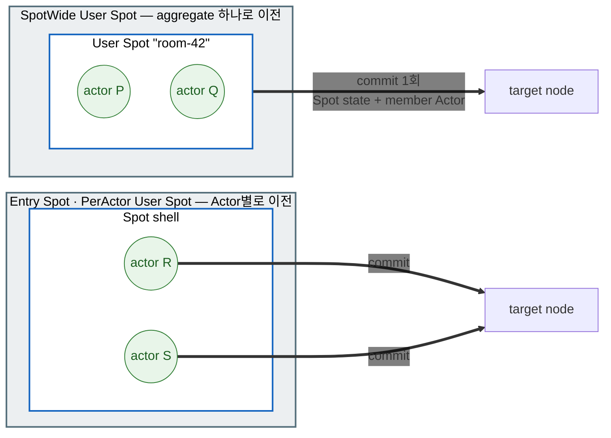
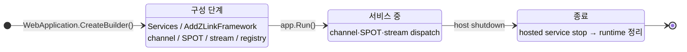

# 12. 운영 — 런타임 메트릭 · graceful drain · readiness

> 정식 계약은 공통 스펙 [런타임 메트릭](../../../common/spec/25-runtime-metrics.ko.md)과
> [Graceful Drain & Handoff](../../../common/spec/28-graceful-drain-handoff.ko.md)가 다룬다.
> `.NET` 표면의 정식 정의는
> [언어별 topology·monitoring 공개 계약](../../../common/spec/server/languages/README.ko.md)가
> 소유한다.
> 이 챕터는 운영 환경에서 실제로 무엇을 붙이고 무엇을 선언하는지 사용법 중심으로 다룬다.

## 0. 제공하는 기능

서비스를 운영에 올리면 `11. Monitoring` 장의 이벤트 관측 외에 다음 항목이
더 필요하다.

1. **메트릭** — CCU, 큐 깊이, 요청 지연 같은 수치를 대시보드로 본다.
2. **graceful drain** — 배포·축소로 노드를 내릴 때 접속 유저를 튕기지 않고 정리한다.
3. **readiness** — "이 노드가 새 요청을 받아도 되는가"를 배포 인프라에 알린다.

framework는 메트릭 계기와 host 종료 시의 drain 절차를 제공한다. 앱은 meter 이름을 수집
파이프라인에 넣고, 배포 환경이 호출할 readiness endpoint를 공개 런타임 조회 API로 구성한다.

처음 나오는 용어는 다음과 같다.

| 용어 | 한 줄 풀이 |
|---|---|
| Meter / 계기(instrument) | .NET 표준 메트릭 방출 단위. counter·gauge·histogram이 계기다 |
| OpenTelemetry(OTel) | 메트릭·트레이스 수집 표준. Prometheus 등 exporter로 내보낸다 |
| Relocate | stateful object를 compatible target으로 이전하고 host를 `Relocated` 상태로 만드는 operation |
| Shutdown | 새 relocation 없이 local resource를 bounded cleanup하는 operation |
| readiness probe | "새 요청을 받아도 되는가"를 묻는 배포 인프라의 상태 확인 |

## 1. 런타임 메트릭

framework는 `"zlink.framework"`라는 이름의 `System.Diagnostics.Metrics.Meter` 하나로
모든 계기를 방출한다. 앱은 이 정식 meter 이름을 수집 파이프라인에 등록한다.

=== "C#/.NET"

    ```csharp
    // 이 한 줄로 zlink 계기 전체가 앱의 OTel 파이프라인에 들어간다.
    builder.Services.AddOpenTelemetry().WithMetrics(m => m
        .AddMeter("zlink.framework") // Framework가 계기를 방출하는 정식 meter 이름이다.
        .AddPrometheusExporter());
    ```

=== "C++"

    C++ 예제는 준비 중이다.

=== "Java"

    Java 예제는 준비 중이다.

=== "Kotlin"

    Kotlin 예제는 준비 중이다.

=== "Node/TypeScript"

    Node 예제는 준비 중이다.


- zlink 전용 메트릭 API는 없다. `.NET` 표준 `Meter`/`MeterListener`가 그대로 표면이다.
  OTel 없이 수집하려면 `MeterListener`에서 meter 이름 `"zlink.framework"`를 직접 구독한다.
- 어떤 listener도 붙지 않으면 계기 갱신은 최소 비용의 비활성 경로로 끝난다. 계기를
  등록만 해 두고 켜지 않아도 messaging 성능에 영향이 없다.
- 대시보드와 exporter 선택은 앱 몫이다. framework는 내장 scrape 서버를 두지 않는다.

계기 카탈로그는 다음과 같다. MeshNode, object·STREAM, location·fanout 계기의 라벨·단위·종류는
[Runtime Metrics §§3~5](../../../common/spec/25-runtime-metrics.ko.md)가 정하고, drain 계기는
[Host Relocate와 Shutdown §13](../../../common/spec/28-graceful-drain-handoff.ko.md#13-관측-정보)이 정한다.

| 계기 | 무엇을 재나 |
|---|---|
| `zlink.stream.connections.active` | 활성 STREAM 연결 수(CCU) |
| `zlink.stream.connections.opened` | 누적 STREAM 연결 시작 수 |
| `zlink.stream.connections.closed` | 누적 STREAM 연결 종료 수 |
| `zlink.spot.count` | 활성 spot 수 |
| `zlink.actor.count` | 활성 Actor 수 |
| `zlink.relocation.started` | Actor·User·Instance Spot relocation 시작 누계 |
| `zlink.relocation.completed` | relocation terminal 결과 누계 |
| `zlink.relocation.duration` | prepare부터 terminal phase까지의 시간 |
| `zlink.relocation.recovered` | recovery coordinator가 이어서 처리한 relocation 수 |
| `zlink.relocation.journal.messages` | relocation root에 포함한 accepted message 수 |
| `zlink.relocation.bytes` | immutable relocation envelope 크기 |
| `zlink.instance_spot.activations` | Instance Spot activation 결과 누계 |
| `zlink.instance_spot.activation.duration` | 첫 주소 확인부터 Ready 또는 terminal 실패까지의 시간 |
| `zlink.instance_spot.pending.messages` | activation barrier 앞에서 기다리는 message 수 |
| `zlink.instance_spot.pending.bytes` | activation barrier 앞에서 예약한 payload byte 수 |
| `zlink.instance_spot.claim.conflicts` | Instance location claim 충돌 누계 |
| `zlink.mesh_node.peers.configured` | descriptor에 존재하는 peer 수 |
| `zlink.mesh_node.peers.connected` | transport가 연결된 peer 수 |
| `zlink.mesh_node.peers.ready` | admission과 handler readiness를 통과한 peer 수 |
| `zlink.mesh_node.channels.ready_members` | ChannelName select-one에 사용할 수 있는 member 수 |
| `zlink.mesh_node.channel.selection_failures` | Select-one에 사용할 member가 없었던 횟수 |
| `zlink.mesh_node.requests.inflight` | reply를 기다리는 request 수 |
| `zlink.mesh_node.request.duration` | request submit부터 terminal completion까지의 시간 |
| `zlink.mesh_node.request.timeouts` | request timeout 누계 |
| `zlink.mesh_node.messages.dropped` | Framework가 원인을 확인한 one-way drop 누계 |
| `zlink.fanout.published` | classic fanout publish 누계 |
| `zlink.fanout.received` | classic fanout receive 누계 |
| `zlink.fanout.dropped` | Framework가 원인을 확인한 classic fanout drop 누계 |
| `zlink.location.store.errors` | Redis read·write·lease failure 누계 |
| `zlink.location.owner_lease.renew.failures` | owner lease 갱신 실패 누계 |
| `zlink.location.owner_lease.renew.lateness` | 예정 시각 대비 owner lease 갱신 지연 |
| `zlink.observability.events.overflow` | monitoring·trace observer queue overflow 누계 |
| `zlink.host.state` | 현재 host Framework runtime state |
| `zlink.host.relocation.duration` | Host `Relocate` 시작부터 terminal result까지의 시간 |
| `zlink.host.relocation.blocked` | `Blocked`로 끝난 host `Relocate` 수 |
| `zlink.host.shutdown.duration` | Host `Shutdown` 시작부터 terminal result까지의 시간 |
| `zlink.host.shutdown.forced` | Bounded teardown으로 끝난 host `Shutdown` 수 |

## 2. Relocate — 상태를 유지한 채 다른 host로 옮기기

`RelocateAsync(...)`는 이 host에서 살아 있는 User Spot·Instance Spot·Actor를 다른 Serving node로
옮긴다. Host 전체를 대상으로 하는 operation이며, 이 호출 자체가 host를 종료하지는 않는다.

**무엇이 유지되나.** 옮긴 뒤에도 client와 다른 node가 쓰던 것이 그대로 남는다는 뜻이다.

| 유지되는 것 | 의미 |
| --- | --- |
| SpotId · ActorId와 `ObjectGeneration` | 호출하는 쪽이 쓰던 논리 ID가 바뀌지 않는다. 주소를 다시 알릴 필요가 없다 |
| 아직 실행하지 않은 message와 accepted journal | seal 시점에 queue에 남아 있던 작업을 target에서 이어서 실행한다 |
| timer 등록과 pending tick | 이름·주기·옵션·스케줄 커서를 함께 옮기므로 target에서 다시 등록하지 않는다 |
| application state | factory에 등록한 relocation adapter의 `CaptureAsync`·`RestoreAsync`로 옮긴다 |
| bound STREAM session route | client session은 그대로 두고 route가 새 owner를 가리키도록 바꾼다 |

절차는 다음과 같다.

1. Preflight에서 모든 stateful object, target capability·capacity와 Relocation Store를 확인한다. Eligible
   target이 없으면 source admission을 바꾸지 않고 `Blocked`로 끝난다.
2. Host를 `Relocating`으로 게시하고 standalone Actor, Instance Spot과 User Spot aggregate execution queue에
   infrastructure notification을 예약한다.
3. Notification이 turn boundary에 도달했을 때 현재 실행 중인 turn만 source에서 완료한다. Outbound·inbound,
   `Capture`·`Restore`와 encoded payload permit을 모두 얻은 ready unit만 queue를 seal한다. Permit을 얻지
   못한 unit은 source에서 application message와 timer를 계속 처리한다.
4. Seal 시점에 실행하지 않은 message, accepted journal, logical timer registration·pending tick과 optional
   Snapshot bytes를 immutable relocation root에 저장한다. Target factory·`Restore`와 journal staging은
   owner·membership commit 전에 끝낸다.
5. `SpotWide` User Spot과 member Actor는 하나의 aggregate commit으로 owner·membership을 함께 바꾼다.
   Entry Spot과 `PerActor` User Spot의 Actor는 각각 이전한다. Infrastructure relocation은 application의
   join·leave callback을 호출하지 않는다.
6. Frozen queue·timer를 target에 복원하고 seal 뒤 source hold를 target으로 relay한다. Source cleanup,
   `Completed`, bound STREAM route ACK와 steady normalization을 끝낸 뒤 target admission을 연다.
7. 모든 unit이 source dispatch에서 분리되면 host를 `Relocated`로 전환한다. 연결과 infrastructure는
   `ShutdownAsync(...)`를 호출할 때까지 유지한다.

첫 relocation commit 전 failure는 source queue와 admission을 복원할 수 있다. 첫 commit 뒤에는 source로
rollback하지 않고 target recovery를 계속하며 deadline을 넘기면 `ForceStopped`로 끝낸다.

### 2.1 execution mode별 이전 단위

같은 host 안에서도 무엇을 하나의 단위로 묶어 옮기는지가 Spot 종류와 execution mode에
따라 다르다. `SpotWide` User Spot은 Spot과 member Actor가 하나의 aggregate이므로 함께
commit한다. Entry Spot과 `PerActor` User Spot은 Actor가 각각 독립된 단위이므로 Actor별로
이전하며, 이때 Spot instance는 state를 옮기지 않는 shell이다.



따라서 `PerActor` User Spot의 factory relocation 방식은 `RecreateOnRelocation()`만
사용할 수 있다. Member Actor의 policy는 각 Actor factory가 따로 정한다. Instance Spot은
Actor가 없으므로 Spot 하나가 그대로 이전 단위다.

## 3. Shutdown — 옮기지 않고 종료하기

`ShutdownAsync(...)`는 이 host를 종료한다. §2와 달리 **상태를 다른 node로 옮기지 않는다.**

호출하면 새 relocation을 시작하지 않고, 진행 중인 작업을 주어진 deadline 안에서 끝내거나
실패로 확정한다. 그다음 Entry·User·Instance Spot에 `OnClosingAsync`를 `HostShutdown` reason으로
알리고, 그 callback이 끝난 뒤 scope·authority·session·topology resource를 정리한다. deadline을
주지 않으면 30초다.

여기서 정리되는 Spot의 state는 남지 않는다. 배포 자동화가 상태를 살려서 내려야 한다면 종료
전에 `RelocateAsync(...)`를 먼저 호출하고 그 결과가 `Relocated`인지 확인한 뒤 이 호출로
넘어간다(§4의 예제).

Spot의 수명은 request와 무관하다. 일반 request가 끝났다는 이유만으로 User·Instance Spot을 닫지
않는다. 없는 Instance Spot을 준비시키는 것도 마찬가지로 별도 address나 manager create가 아니라,
SpotId direct 호출에 Instance intent를 붙였을 때만 시작한다([06-spot](06-spot.ko.md) §5).

## 4. 운영 호출과 readiness 연결

앞의 두 operation은 자동으로 일어나지 않는다. Application이 `IZLinkFrameworkRuntime`으로 직접
호출한다. 이 interface는 host maintenance를 소유하는 DI singleton이다.

배포에서 쓰는 순서는 "먼저 옮기고, 성공했으면 종료한다"다.

=== "C#/.NET"

    ```csharp
    var runtime = app.Services.GetRequiredService<IZLinkFrameworkRuntime>();
    var result = await runtime.RelocateAsync(
        new ZLinkFrameworkRelocationOptions
        {
            Mode = ZLinkFrameworkRelocationMode.RollingUpdate,
            TargetApplicationVersion = 12,      // 지정한 새 버전의 eligible node만 사용한다.
            Deadline = TimeSpan.FromSeconds(25)
        },
        cancellationToken: ct);

    if (result.Outcome == ZLinkFrameworkRelocationOutcome.Relocated)
        await runtime.ShutdownAsync(TimeSpan.FromSeconds(10), ct);
    else
        Console.Error.WriteLine($"host relocation blocked: {result.Reason}");
    ```

=== "C++"

    C++ 예제는 준비 중이다.

=== "Java"

    Java 예제는 준비 중이다.

=== "Kotlin"

    Kotlin 예제는 준비 중이다.

=== "Node/TypeScript"

    Node 예제는 준비 중이다.


`PlannedMaintenance`는 source와 같은 application version의 target만 사용한다.
`RollingUpdate`는 source보다 큰 `TargetApplicationVersion`을 요구하고 그 version과 정확히 같은 target만
사용한다. Eligible target이 없으면 deadline까지 기다린 뒤 `Blocked/TargetUnavailable`을 반환한다.
Cancellation은 해당 waiter만 끝내며 이미 시작한 shared lifecycle operation은 계속 실행된다.

Readiness는 host `IZLinkFrameworkRuntime.IsReady`와 업무에 필요한 component runtime의 readiness를 함께
확인해 기존 HTTP endpoint에 연결한다.

=== "C#/.NET"

    ```csharp
    app.MapGet("/healthz/ready", (IZLinkFrameworkRuntime runtime) =>
        runtime.Status.IsReady
            ? Results.Ok()
            : Results.StatusCode(StatusCodes.Status503ServiceUnavailable));
    ```

=== "C++"

    C++ 예제는 준비 중이다.

=== "Java"

    Java 예제는 준비 중이다.

=== "Kotlin"

    Kotlin 예제는 준비 중이다.

=== "Node/TypeScript"

    Node 예제는 준비 중이다.


Kubernetes 배포에 연결하면 다음 개념이 된다.

```yaml
# readiness probe → /healthz/ready — Draining 진입 즉시 신규 트래픽 대상에서 제외
# preStop hook + terminationGracePeriodSeconds ≥ drain deadline — 자동 drain이 끝날 시간을 확보
```

## 5. MeshNode 런타임 제어와 관측

`AddRouteMesh`로 등록한 MeshNode는 두 DI singleton으로 운영한다.

**런타임 옵션 — `IZLinkRouteMeshRuntimeOptions`.** serving 중에 바꿀 수 있는 값은
다음과 같다. 나머지 소켓 옵션(HWM·timeout)은 시작 전 `ConfigureRouterSocket()`
전용이다.

=== "C#/.NET"

    ```csharp
    var meshOptions = app.Services.GetRequiredService<IZLinkRouteMeshRuntimeOptions>();
    meshOptions.Mesh("game.room").PlacementWeight = 0; // 새 object 배치 대상에서 제외
    meshOptions.Channel("game.room").Weight = 0;       // 새 channel select-one 대상에서 제외
    ```

=== "C++"

    C++ 예제는 준비 중이다.

=== "Java"

    Java 예제는 준비 중이다.

=== "Kotlin"

    Kotlin 예제는 준비 중이다.

=== "Node/TypeScript"

    Node 예제는 준비 중이다.


두 weight는 독립적이며 실행 중 새 선택에 반영된다. Placement weight는 Actor·Spot create와 relocation
target 선택에만 사용한다. Channel weight는 해당 server membership의 새 select-one 대상 선택에만
사용한다. 등록되지 않은 mesh나 membership을 조회하면 `ZLinkConfigurationException`이다.

**상태 조회 — `IZLinkRouteMeshRuntime`.** Mesh 하나에 대해 일관된 snapshot 한 장과
순서 있는 component 이벤트 스트림을 제공한다. Host termination은 `IZLinkFrameworkRuntime`이 소유한다.

=== "C#/.NET"

    ```csharp
    var meshRuntime = app.Services.GetRequiredService<IZLinkRouteMeshRuntime>();

    var status = meshRuntime.GetStatus("game.room"); // 노드·peer·channel의 immutable 현재 상태
    var ready = status.IsReady;

    await foreach (var meshEvent in meshRuntime.ObserveAsync("game.room", cancellationToken: ct))
    {
        // state/peer 전이가 Sequence 순서로 온다 — 상태 표면의 공통 규칙은
        // 11-monitoring §2를 참고한다.
    }
    ```

=== "C++"

    C++ 예제는 준비 중이다.

=== "Java"

    Java 예제는 준비 중이다.

=== "Kotlin"

    Kotlin 예제는 준비 중이다.

=== "Node/TypeScript"

    Node 예제는 준비 중이다.


## 6. Host lifecycle

Framework runtime은 `ASP.NET Core`의 **hosted service**로 host 시작·종료에 묶인다.
channel·SPOT·STREAM runtime은 startup에서 등록한 역할을 보고 생성되어 shutdown에서
정리된다.



- **구성 단계** — `app.Run()` 전에 모든 선언을 끝낸다. 잘못된 구성은 host
  startup에서 예외로 거부된다.
- **종료** — host shutdown 신호가 오면 hosted service `stop()` → channel/SPOT/STREAM
  runtime 정리 순으로 내려간다.
- 백그라운드 작업은 표준 `IHostedService`로 같은 수명주기에 편입시킨다.

### 6.1 상태 관측

Host `Relocate`·`Shutdown` 상태 전이는 `IZLinkFrameworkRuntime`의 bounded status stream에서 관측한다. MeshName별
runtime은 component snapshot을 제공하지만 별도 termination authority나 partial drain operation을 만들지 않는다.

=== "C#/.NET"

    ```csharp
    var runtime = app.Services.GetRequiredService<IZLinkFrameworkRuntime>();

    await foreach (var hostEvent in runtime.ObserveAsync(cancellationToken: ct))
    {
        // Host 전체 state, effective intent와 terminal outcome을 sequence 순서로 기록한다.
        logger.LogInformation(
            "host lifecycle: {State} {Relocation} {Termination}",
            hostEvent.State,
            hostEvent.RelocationResult,
            hostEvent.TerminationResult);
    }
    ```

=== "C++"

    C++ 예제는 준비 중이다.

=== "Java"

    Java 예제는 준비 중이다.

=== "Kotlin"

    Kotlin 예제는 준비 중이다.

=== "Node/TypeScript"

    Node 예제는 준비 중이다.


`ZLinkFrameworkRuntimeState`의 `Preparing`·`Serving`·`Relocating`·`Relocated`·`Draining`·`Stopped`·`Error`를
그대로 관측한다. Status의 relocation·termination 결과는 해당 operation의 terminal 결과와 같아야 한다.
수치로 보려면 §1의 `zlink.host.*` 계기를 사용한다.

## 7. 관련 문서

- 이 챕터 계약의 실행 검증 예문: `13. Interface 카탈로그` 장 §7 — 검증 클래스 `FrameworkRuntimeContracts`
- 정식 계약: [Host Relocate와 Shutdown](../../../common/spec/28-graceful-drain-handoff.ko.md) · [Runtime Metrics](../../../common/spec/25-runtime-metrics.ko.md)
- 상태 관측과 진단: `11. Monitoring` 장
- relocation 경계를 application이 정하는 Spot: [06-spot §7](06-spot.ko.md#7-relocation을-시작해도-되는-시점-알리기)
