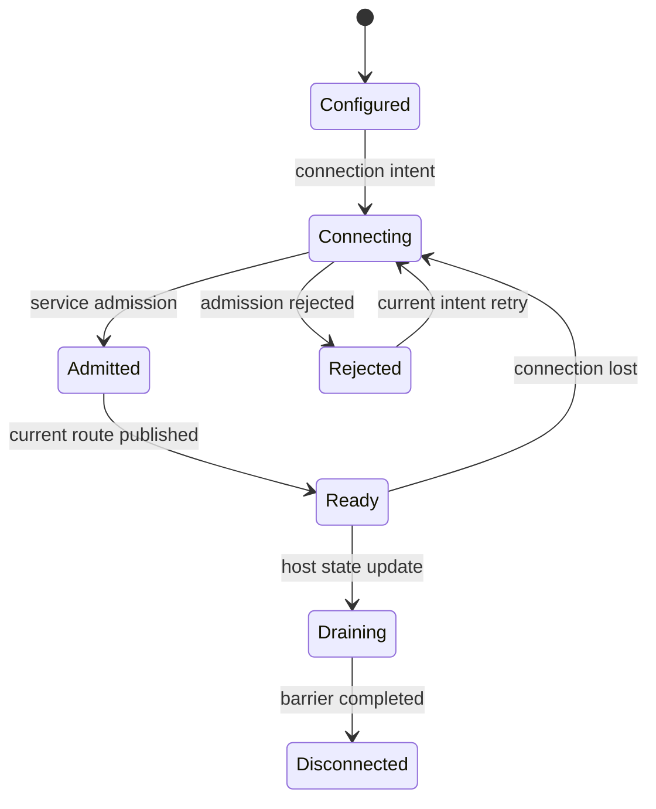

# Transport liveness runtime

[내부 구조 목차](README.ko.md) · [Service wire protocol](service-wire-protocol.ko.md) ·
[Transport liveness 계약](../../spec/server/55-transport-liveness.ko.md) ·
[Core raw 내부 경계](../../../../../core/doc/internals/runtime-boundary.ko.md)

## 1. 책임 경계

Core raw transport는 byte 전달, orderly disconnect·error monitor event와 reconnect primitive를 제공한다. Core option,
ZMP frame과 engine timer에는 heartbeat 기능을 두지 않는다. Service connection의 half-open 판정은 Framework가
`livenessProbe`·`livenessAck`과 monotonic timer로 구현한다.

Framework public API는 probe interval과 peer timeout을 노출하지 않는다. C++·.NET·JVM·Node.js runtime은
RouteMesh와 ClientServer에 5초 probe tick과 15초 peer timeout을 적용한다. Classic fanout도 5초 beacon과 15초
publisher timeout을 사용하지만 ACK가 없는 별도 단방향 규칙을 따른다.

Location owner lease, request timeout과 service liveness는 서로 다른 authority다. Store read나 application traffic을
probe round-trip의 대체 증거로 사용하지 않는다.

## 2. Connection identity

Runtime은 logical peer와 current physical connection을 분리해 저장한다.

- RID와 non-zero lifecycle token은 logical peer incarnation을 구분한다. Token은 opaque equality 값이며 숫자 순서로
  비교하지 않는다.
- Connection ID 또는 binding이 보존하는 동등한 opaque 값은 transport lifetime을 구분한다.
- `DescriptorRevision`만 같은 lifecycle에서 strictly increasing ordering을 가진다.
- Store-backed peer는 current host `OwnerId`와 `OwnerLeaseGeneration`도 admission fence로 사용한다.

Reconnect 뒤 endpoint와 RID가 같아도 새 physical connection이다. 이전 connection의 late disconnect, ACK, reply와
send-ready event는 current connection identity와 일치하지 않으면 무시한다. 새 admission이 current connection을
교체할 때 lifecycle token의 숫자 크기를 비교하지 않는다.

## 3. RouteMesh와 ClientServer state



Raw connect 성공만으로 Ready가 되지 않는다. Current physical connection에서 transport setup과 Framework service
admission이 모두 성공해야 Ready index에 넣는다. Admission과 함께 initial 15초 deadline을 시작한다. Draining peer는
새 application selection에서 제외하지만 accepted reply, transfer control과 STREAM barrier가 끝날 때까지 current
connection을 유지할 수 있다.

Orderly disconnect와 raw transport failure는 즉시 not-ready로 전환한다. Timer를 기다리거나 reconnect 전까지 Ready
snapshot을 유지하지 않는다.

## 4. Periodic probe scheduler

각 admitted connection은 shared infrastructure scheduler에 다음 state를 둔다.

```text
currentConnectionId
outstandingProbeId or none
peerDeadline
nextProbeTick
```

Probe tick은 application send·receive activity와 무관하게 5초마다 실행한다. Outstanding ID가 없으면 connection에서
유일한 non-zero `u64` ID를 만들고 `livenessProbe`를 보낸다. Outstanding ID가 있으면 새 ID를 만들지 않고 같은
probe를 재전송한다. Connection마다 outstanding probe는 최대 하나다.

Peer는 받은 ID를 같은 physical connection의 `livenessAck`으로 그대로 돌려준다. Current connection의 current
outstanding ID와 일치하는 첫 ACK만 다음 동작을 수행한다.

1. Peer deadline을 현재 monotonic 시각부터 15초로 갱신한다.
2. Outstanding ID를 제거한다.
3. 다음 periodic tick에서 새 ID를 만들 수 있게 한다.

Duplicate ACK, 이전 probe ID와 다른 connection에서 온 ACK는 무시한다. Application frame, 다른 infrastructure
command와 raw receive activity는 diagnostic timestamp에 기록할 수 있지만 peer deadline을 연장하지 않는다.
Deadline을 넘으면 connection을 not-ready로 바꾸고 닫은 뒤 current intent에 따라 reconnect한다.

Scheduler는 application mailbox와 분리된 infrastructure reserve를 사용한다. Handler가 실행 중이거나 application
queue가 가득 차도 probe, ACK와 timeout을 처리한다. Executor pause 뒤에는 monotonic elapsed를 한 번에 적용하며
wall clock 변경으로 deadline을 조정하지 않는다.

## 5. Classic fanout

Subscriber는 automatic descriptor의 publisher마다, manual mode에서는 endpoint마다 전용 SUB socket과 receive loop를
하나씩 둔다. 여러 publisher를 한 socket에 연결하지 않는다. 그래야 inbound record와 timeout을 해당 publisher에
정확히 연결할 수 있다.

Publisher는 application topic traffic과 무관하게 5초마다 다음 exact two-frame beacon을 보낸다.

```text
Topic:   01 5A 4C 46 31
Payload: 5A 46 01 01
```

Subscriber는 application filter 외에 reserved topic을 exact subscription으로 항상 등록한다. 전용 socket에서 첫
valid application record 또는 exact beacon을 받으면 해당 publisher를 Ready로 publish한다. 이후 둘 가운데 하나를
받을 때마다 publisher receive deadline을 15초로 갱신한다. Timeout은 해당 publisher만 not-ready로 바꾸고 전용
socket을 다시 만든다. Subscriber는 beacon ACK를 보내지 않는다.

Reserved topic은 전체 byte가 일치할 때만 infrastructure record다. Exact reserved topic인데 frame 수가 2가 아니거나
payload가 다르면 application delivery와 receive activity를 만들지 않고 protocol error로 connection을 닫는다. 같은
prefix의 다른 topic은 application topic이다. Public topic derivation 결과가 exact reserved topic이면 transport에
쓰기 전에 argument 또는 configuration error로 거부한다.

Orderly disconnect와 raw transport failure는 fanout에서도 15초 timeout을 기다리지 않는다. Location descriptor와
owner lease는 publisher association을 제공할 뿐 receive liveness를 대신하지 않는다.

## 6. Reconnect와 operation completion

Reconnect는 current configured intent 또는 discovery descriptor로 새 raw connection을 만든다. RouteMesh와
ClientServer는 service admission을 다시 수행하며 이전 connection ID, outstanding probe, reply route, session binding과
Ready state를 재사용하지 않는다. Fanout은 전용 SUB socket을 새로 만들고 첫 valid receive 전에는 Ready가 아니다.

Connection loss와 request reply가 경쟁하면 correlation owner가 terminal result 하나만 완료한다. Transport가
request를 수락하지 않았음이 확정되면 route failure로 끝낸다. 수락 여부가 불명확하거나 이미 수락된 request를
다른 peer에 숨겨서 다시 제출하지 않는다. One-way operation도 connection loss 때문에 다른 target으로 자동
재제출하지 않는다.

## 7. 종료와 cleanup

Host admission seal은 peer를 신규 selection에서 제외하지만 accepted completion과 maintenance control에 필요한
connection은 deadline까지 유지한다. Reply relay, STREAM route ACK와 transfer completion을 처리한 뒤 reconnect
intent를 제거하고 raw socket을 닫는다.

Terminal cleanup은 connection의 scheduler entry, monitor subscription, reconnect timer와 pending callback을 함께
제거한다. Late timer와 monitor event는 current connection identity를 통과하지 못하므로 새 connection state를
바꾸지 않는다.

## 8. 검증

- Core raw header, option, ZMP codec와 engine timer에 heartbeat 기능이 없다.
- Admission 직후 initial 15초 deadline과 application traffic과 무관한 5초 tick이 시작된다.
- Connection마다 outstanding probe가 최대 하나이고 ACK 전 tick은 같은 ID를 재전송한다.
- Current connection의 current ID와 일치하는 첫 ACK만 deadline을 갱신한다.
- 다른 inbound traffic, duplicate ACK와 previous connection ACK가 deadline을 갱신하지 않는다.
- Orderly disconnect가 timeout을 기다리지 않고 Ready index에서 제거된다.
- Liveness control이 application queue와 handler를 사용하지 않는다.
- Fanout publisher가 application publish와 무관하게 exact beacon을 5초마다 보낸다.
- Publisher별 전용 SUB socket과 15초 timeout이 다른 publisher state를 바꾸지 않는다.
- Malformed reserved-topic record가 application delivery나 liveness activity를 만들지 않는다.
- Reconnect가 이전 connection의 liveness·reply·binding state를 재사용하지 않는다.
- Host cleanup 뒤 scheduler, monitor와 reconnect callback이 남지 않는다.
