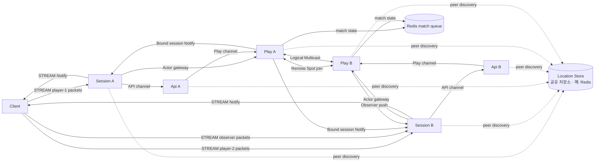
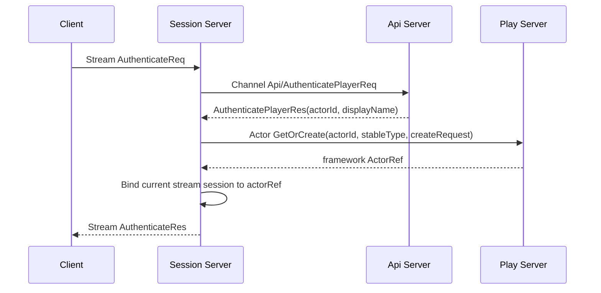
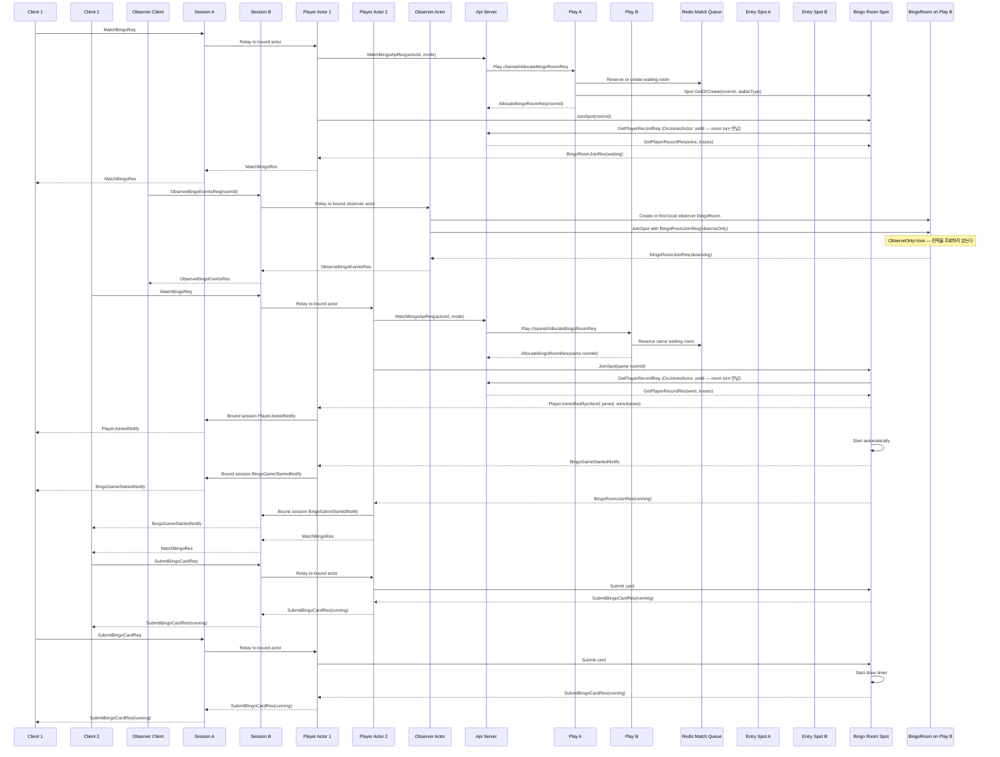
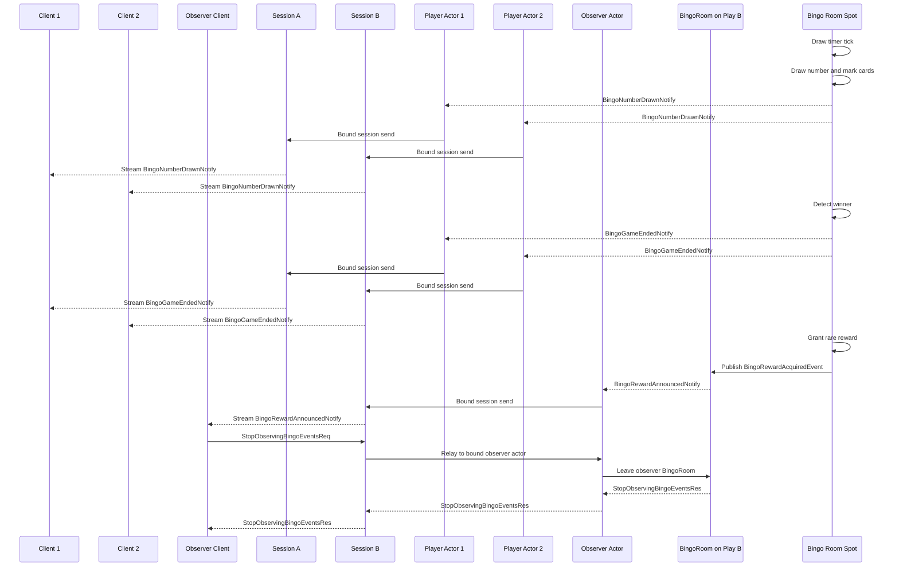
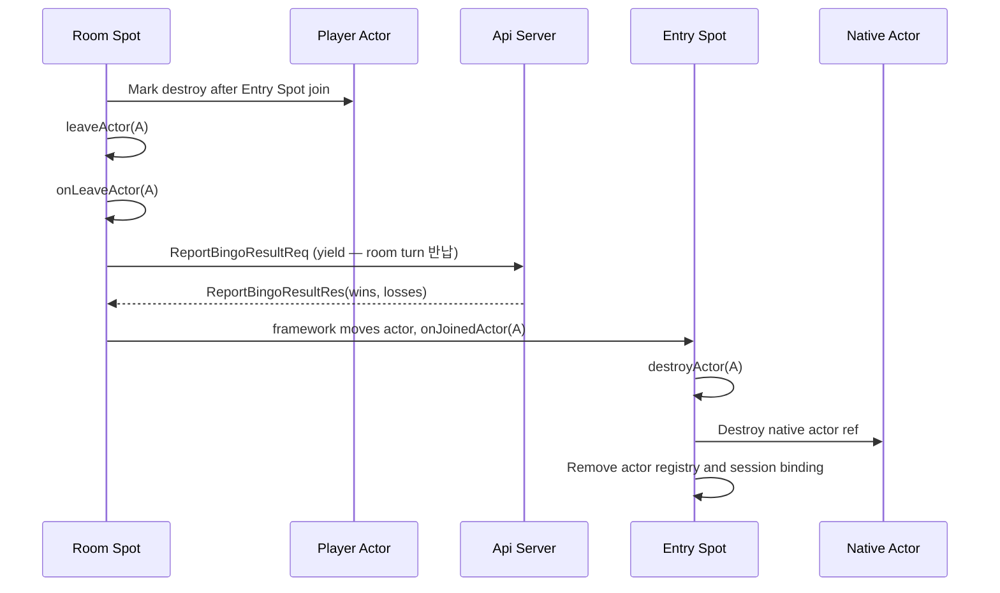

# Bingo Sample Scenario

[샘플 목록](../README.ko.md)

> 이 문서는 모든 framework 언어가 공유하는 Bingo 샘플 시나리오를 정의한다.
> 언어별 샘플은 이 문서를 기준으로 서버 역할, 메시지 흐름, smoke 검증 기준을 맞춘다.
>
> **자동 routing id 필수.** Bingo의 API·Play·Session runtime은 §3.3의 allocation group을 사용해야
> 하며 고정 RID를 설정하면 안 된다. `.NET` 샘플은 이 구성을 적용했다. 다른 언어 구현도 같은 public
> 계약과 group 구성을 사용해야 완료로 판정한다.

## 1. 목적

Bingo 샘플은 client가 하나의 Session 서버 stream 연결만 유지해도 인증, 매칭,
게임 진행, server push를 모두 처리할 수 있음을 보여 준다. Session 서버는 client
연결과 actor binding을 맡고, Play 서버는 player actor와 room Spot을 소유한다.
API 서버는 인증과 매칭 요청을 처리하며, 서버 간 endpoint 발견은 공유 location store가
맡는다. 샘플은 `api-a`, `api-b`, `play-a`, `play-b`, `session-a`, `session-b`를 실행해
gateway 구조에서도 scale-out, remote Spot join, Logical Multicast event fan-out이 함께
동작하는지 보여 준다.

이 샘플에서 확인해야 하는 핵심은 아래와 같다.

- client는 Session 서버 stream endpoint 하나만 알고 연결한다.
- Session, API, Play 역할은 각각 2개 이상 실행할 수 있다.
- Session 서버는 인증 후 현재 stream session을 Play 서버의 player actor에 bind한다.
- client packet은 bound actor로 relay된다.
- API 서버는 매칭 요청을 받고 Play 서버에 room 배정을 요청한다.
- Play 서버는 Redis-backed match queue를 사용해 waiting room state를 공유한다.
- match queue Redis는 matching state 공유에만 사용하고, room Spot owner lookup은
  location store가 맡는다.
- Play 서버는 Entry Spot에서 room Spot으로 actor를 join시킨다. player actor와 room Spot이
  서로 다른 Play 서버에 있으면 location store 기반 resolver를 통해 remote Spot join이
  실행된다.
- client는 자기 bingo card를 입력해 room Spot에 제출한다.
- room Spot은 제출된 카드, 번호 추첨, mark, 승리 판정을 소유한다.
- 두 player client의 card가 모두 제출되면 room Spot이 server timer로 번호를 뽑고,
  Play 서버는 번호와 state를 bound session으로 Notify한다.
- 승자가 나오고 결과 처리 중 희귀 보상이 지급되면 owner `BingoRoom`은 Logical Multicast
  topic으로 `BingoRewardAcquiredEvent`를 publish하고, 다른 Play 서버의 `BingoRoom`은
  event를 받아 observer client로 push한다.
- 공유 location store를 사용해 서버 간 endpoint를 자동으로 발견하고 연결한다.
- handler는 typed handler 계약을 구현하고 스캔·선언형 metadata로 **자동 등록**된다.
- Bingo의 stream, channel, actor, room Spot payload는 Protobuf를 사용한다.

Client self-check도 샘플의 일부다. client는 `.NET` 샘플처럼 각 request 응답과 server
push payload를 즉시 검증해야 한다. 특히 `PlayerJoinedNotify`,
`BingoGameStartedNotify`, `BingoNumberDrawnNotify`, `BingoGameEndedNotify`,
`BingoRewardAnnouncedNotify` 대기는
stream connector의 public wait interface를 직접 사용한다. inbox를 두더라도 push 도착을
기다리는 로직을 sample-local polling 함수로 숨기면 안 된다.

Bingo가 Protobuf를 맡는 이유는 이 샘플이 여러 서버 역할과 많은 request/response/notify
계약을 가진 gateway형 게임이기 때문이다. Protobuf schema는 언어별 샘플이 같은 필드와
같은 wire 이름을 유지하도록 돕는다. JSON payload 가독성은 TicTacToe와 다른 JSON 기반
샘플이 맡는다.

## 2. 서버 구성

Bingo의 Channel 역할과 물리 연결은 [공통 topology 기준](../README.ko.md#channel-역할과-물리-topology-기준)을
따른다. Session·Api·Play는 `bingo` RouteMesh 하나를 공유하고 ClientServer Channel을 추가하지 않는다.
Session과 Play는 `bingo.api` Client, Api는 그 Channel의 Server다. Api는 room 배정을 위해
`bingo.room` Client를 등록하고 Play는 그 Channel의 Server이자 reward Logical Multicast 대상이다.



client가 직접 연결하는 서버는 Session 서버뿐이다. API 서버와 Play 서버는
client-facing stream endpoint를 열지 않는다. Session 서버는 인증과 session lifecycle을
소유하지만, 게임 규칙을 해석하지 않는다. 게임 packet은 현재 session에 bind된 actor로
전달되고, actor와 room Spot이 domain state를 처리한다.

다이어그램은 room owner가 `Play A`인 경우의 예시다. Actor와 room Spot의 실제 owner는
framework가 stable type, Serving 상태, capacity와 node-wide weight를 기준으로 선택한다.
샘플의 설정·업무 메시지·match queue는 NodeRid를 배치 입력이나 검증값으로 사용하지 않는다.
client는 전역 `ActorId`와 `RoomId`로 요청하고, framework가 Location Store에서 현재 owner를
확인한다. 특정 두 node를 반드시 거치는 검증은 공통 E2E가 담당한다.

## 3. 자동 연결 방식

Bingo는 공유 location store 기반 자동 연결을 사용한다. 각 서버는 MeshName, RID, ChannelName set과
MeshNode endpoint를 descriptor로 게시하고, STREAM endpoint는 해당 stream node 계약으로 게시한다.
다른 서버는 같은 MeshName의 descriptor를 확인해 peer를 연결하며 application은 기능별 endpoint를
관리하지 않는다.

| 연결 | 연결 방식 | 이유 |
|------|-----------|------|
| Session -> API ChannelName | RouteMesh peer + select-one | Session 서버가 API 서버 주소를 직접 보관하지 않게 한다. |
| API -> Play `bingo.room` | RouteMesh peer + select-one | matching API가 ready Play member 하나를 선택한다. |
| Play -> API ChannelName | RouteMesh peer + select-one | room Spot이 actor join/leave에서 player 전적을 조회·기록한다(§7.1). |
| Session -> Play session relay | location store 기반 actor locator | Session 서버가 Play 서버 actor의 위치를 직접 관리하지 않게 한다. |
| Play actor -> remote room Spot | location store 기반 Spot resolver | actor가 다른 Play 서버의 room Spot에 join할 수 있게 한다. |
| Play Logical Multicast | 같은 RouteMesh의 routed multicast | reward event를 target channel의 각 node에 한 번 전달하고 local `BingoRoom` subscription으로 fan-out한다. |
| Play -> Session bound push | location store 기반 session route | Play 서버가 현재 client session 위치를 framework route로 찾는다. |
| Play -> Redis match queue | Redis endpoint 설정 | 여러 Play 서버가 waiting room state를 공유한다. |

이 샘플이 자동 연결을 쓰는 이유는 운영형 gateway 구조에서 서버 증설과 endpoint
변경을 application 코드 밖으로 밀어내는 흐름을 보여 주기 위해서다. 수동 endpoint
연결은 TicTacToe 샘플이 맡는다.

Logical Multicast는 별도 PUB/SUB connection을 만들지 않는다. origin MeshNode는 target ChannelName의
ready remote node마다 같은 ROUTER mesh로 routed message를 한 번 제출하고, 수신 MeshNode는 topic과
일치하는 local `BingoRoom` subscription에 message ref를 공유한다. 언어별 sample은 peer별 반복 전송이나
topic과 일치하는 local Spot subscription에 message ref를 공유하는 동작을 application code에서 구현하지 않는다.

Bingo는 Redis를 두 가지 다른 용도로 쓴다. 하나는 framework의 location store 구현체로,
peer discovery·actor route·session route를 담당한다. Logical Multicast도 같은 RouteMesh peer set을 사용한다. 다른 하나는
§3.1의 match queue로, matching 중인 waiting room의 짧은 상태만 저장한다. 두 용도는
같은 Redis 인스턴스를 공유할 수 있지만 책임은 다르다 — room Spot owner 조회 같은
위치 정보는 location store가, waiting room state 공유는 match queue가 맡는다.

### 3.1 Redis match queue

Play 서버가 둘 이상이면 Play-local singleton allocator만으로는 같은 mode의 두 player를
같은 room으로 모을 수 없다. Bingo는 Redis-backed match queue를 사용해 waiting room
state를 공유한다.

Redis key는 mode 기준으로 잡는다.

```text
bingo:match:{Mode} {
  RoomId: string
  ReservedActorIds: string[]
  RequiredPlayers: int
  CreatedAtUnixMs: int64
}
```

첫 player가 matching을 요청하면 allocator는 Redis에 waiting room이 있는지 확인한다.
없으면 allocator가 새 `RoomId`와 첫 actor reservation을 atomic하게 저장한다. Play handler는
그 `RoomId`로 room Spot의 `GetOrCreate`를 요청하며, framework가 eligible Play node를 선택한다.
두 번째 player가 matching을 요청하면 allocator는 같은 record에 actor id를 reserve하고 같은
`RoomId`를 반환한다. actor가 어느 Play 서버에 있든 `JoinSpot(RoomId, ...)`가 Location Store에서
현재 room owner를 확인한다.

동시 matching 때문에 같은 mode의 waiting room이 둘 생기면 scale-out 검증이 깨진다.
언어별 구현은 Redis transaction, Lua script, 또는 같은 수준의 atomic operation으로
room 생성과 actor reservation을 하나의 결정으로 처리해야 한다. 샘플 전용 in-memory
fallback으로 성공시키면 안 된다.

### 3.2 Match queue Redis 실행 책임

샘플 애플리케이션은 Docker를 직접 호출하지 않는다. Docker container 준비는 runner의
책임이다.

- `run_sample`은 실행마다 pinned Redis image로 전용 container를 시작하고 ready 상태를 확인한 뒤
  Play 프로세스에 전달한다. 이미 떠 있는 Redis나 host Redis endpoint를 재사용하지 않는다.
- runner가 만든 Redis container는 실행마다 고유한 이름을 사용하고, Docker가 배정한
  loopback port를 Play 프로세스에 전달한다. 다른 테스트가 쓰는 Redis container나 호스트
  Redis와 섞이지 않게 하기 위해서다.
- runner는 Play 서버에 실행마다 고유한 Redis key prefix도 전달한다. prefix는 같은 전용
  container 안에서 sample 내부 key를 구분하기 위한 값이지, 여러 실행이 Redis를 공유하기 위한
  장치가 아니다.
- runner는 정상 종료와 실패 종료 모두에서 Redis container를 정리한다.
- Docker를 사용할 수 없으면 runner는 명확한 오류를 출력하고 중단한다.
- C++, .NET, Java, Kotlin, Node 샘플은 모두 같은 Redis endpoint 계약을 사용한다.

### 3.3 서버 routing id 자동 할당

API, Play와 Session runtime은 location store에서 역할별 slot을 받는다. 역할마다 allocation group을
분리하므로 각 역할은 독립적으로 1번부터 번호를 사용한다. Play runtime만 Play ChannelName과
room Spot을 소유하는 MeshNode를 같은 group에 넣어 번호를 공유한다.

| 역할 | allocation group | slot count | prefix와 결과 | group member |
|------|------------------|-----------:|----------------|--------------|
| API | `bingo.api` | 2 | `api1`, `api2` | API channel |
| Play | `bingo.play` | 2 | `play1`, `play2` | MeshNode의 `bingo.room` Server membership |
| Session | `bingo.session` | 2 | `session1`, `session2` | MeshNode의 `bingo.api` Client membership |

Play entry spot RID는 room MeshNode에 할당된 `play1` 또는 `play2`를 그대로 사용한다. Play와 Session은
같은 MeshName을 사용하지만 Channel 역할과 allocation group, prefix가 다르다. 두 역할 모두 allocated
identity를 사용하므로 같은 allocation group에 fixed RID와 allocated RID를 섞지 않으며, 생성되는 RID도
서로 충돌하지 않는다.

필수 구성은 다음과 같다. `.NET` 구현은 이 구성을 사용하며, 다른 언어도 각 언어의 같은 public
계약으로 구성한다. 언어별 sample helper로 자동 할당을 흉내 내면 안 된다.

```csharp
// API runtime: 한 MeshNode에 API membership을 등록한다.
var apiMesh = options.AddRouteMesh(SampleNames.Mesh)
    // 동일한 API 설정의 두 runtime이 api1과 api2를 나눠 사용한다.
    .UseAllocatedRoutingId(slotCount: 2, routingIdPrefix: "api")
    .SetRoutingIdAllocationGroup("bingo.api")
    .Listen(); // automatic discovery가 port 0의 실제 endpoint를 descriptor에 기록한다.

apiMesh.Channel(SampleNames.ApiChannel)
    .Server(); // Session과 Play의 API request를 처리한다.
apiMesh.Channel(SampleNames.RoomChannel)
    .Client(); // room 배정을 ready Play member 하나에 요청한다.

// Play runtime
const string playAllocationGroup = "bingo.play";

var playMesh = options.AddRouteMesh(SampleNames.Mesh)
    // Play channel과 room MeshNode가 사용할 번호를 함께 할당받는다.
    .UseAllocatedRoutingId(slotCount: 2, routingIdPrefix: "play")
    .SetRoutingIdAllocationGroup(playAllocationGroup)
    .Listen() // runner가 고정 port를 배정하지 않고 실제 bound port를 사용한다.
    .AddEntrySpot<BingoEntrySpot>()
    .AddSpotFactory<BingoRoom>();

playMesh.Channel(SampleNames.ApiChannel)
    .Client(); // room Spot의 전적 요청을 API로 보낸다.
playMesh.Channel(SampleNames.RoomChannel)
    .Server(); // reward Logical Multicast의 처리 대상 membership이다.

// Session runtime
var sessionMesh = options.AddRouteMesh(SampleNames.Mesh)
    // Session MeshNode는 Play pool과 분리된 session1 또는 session2를 사용한다.
    .UseAllocatedRoutingId(slotCount: 2, routingIdPrefix: "session")
    .SetRoutingIdAllocationGroup("bingo.session")
    .Listen(); // remote peer는 location descriptor의 advertised endpoint에 연결한다.

sessionMesh.Channel(SampleNames.ApiChannel)
    .Client(); // 인증 request를 API로 직접 보낸다.
```

API, Play와 Session 구성에서는 `SetRoutingId(...)`와 `SetEntrySpotRoutingId(...)`를 사용하지
않는다. `SampleApiNode`, `SamplePlayNode`와 `SampleSessionNode`는 고정 RID field를 두지 않고
endpoint만 유지한다. 각 runtime은 역할을 나타내는 prefix로 NodeRid를 자동 발급받는다.

location store와 match queue가 같은 Redis instance를 사용하더라도 책임은 합치지 않는다. 공식
Redis location store가 owner lease와 generation을 원자적으로 관리하고, `RedisBingoMatchQueue`는
`RoomId`와 actor reservation만 저장한다. match queue는 node를 선택하거나 lease를 갱신하지 않는다.

API, Play와 Session은 heartbeat 10초, owner lease TTL 30초, fencing margin 5초와 renew timeout
3초의 framework 기본값을 함께 사용한다. 역할별 override는 두지 않는다.

#### Actor와 room의 배치

Session 인증 handler는 전역 `ActorId`와 stable actor type으로 `GetOrCreate`를 요청한다. Actor 생성
request에는 display name만 담으며 NodeRid를 전달하지 않는다. API의 matching handler도 Play
channel로 room 할당 업무를 요청할 뿐 특정 Play node를 선택하지 않는다. Play handler가 받은
`RoomId`로 Spot `GetOrCreate`를 요청하면 framework가 배치와 현재 owner route를 처리한다.

runner는 여러 Play runtime이 Ready인지 확인하지만 각 Actor와 room이 어느 runtime에 배치되는지는
성공 조건으로 고정하지 않는다. cross-node object routing은 별도 E2E에서 target 배치를 통제해
검증한다.

#### 시작과 교체

runner는 두 Play runtime을 먼저 시작하고 `play1`, `play2`가 모두 ready인지 확인한 뒤 Session을
시작한다. Play process 시작 순서와 slot 번호를 결합하지 않는다. 예를 들어 두 번째로 명명한 process가
먼저 시작해 `play1`을 받아도 client 검증 결과는 같아야 한다.

두 slot이 사용 중일 때 replacement를 먼저 시작하면 `WaitingForSlot` 상태에서 socket을 bind하지
않는다. 기존 owner가 정상 종료해 slot을 release하거나 crash 뒤 30초 TTL이 만료되면 replacement가
가장 작은 빈 slot과 증가한 generation을 받는다. 새 location row가 게시되면 Session과 다른 Play
runtime은 기존 reconcile 경로로 새 endpoint에 연결한다. 이 기능은 종료된 process의 메모리 actor나
진행 중인 room state를 복구하지 않는다.

## 4. 프로세스와 책임

| 프로세스 | 구성 요소 | 책임 |
|----------|-----------|------|
| `Bingo.Api` | `bingo.api` ChannelName handler | access token 인증과 matching API 요청을 처리한다. |
| `Bingo.Api` | player record store(프로세스 메모리) | player 전적 조회(`GetPlayerRecordReq`)와 경기 결과 기록(`ReportBingoResultReq`)을 소유한다. room Spot은 이 값을 계산하지 않고 join/leave에서 `yield`로 물어본다(§7.1). |
| `Bingo.Api` | `bingo.room` ChannelName client | Play 서버에 room 배정을 요청한다. |
| `Bingo.Session` | stream server | client 연결, 인증 packet, actor binding, actor relay를 처리한다. |
| `Bingo.Session` | session gateway MeshNode | session relay와 bound session push 수신을 담당한다. |
| `Bingo.Play` | actor runtime | player actor를 만들고 Entry Spot에 join시킨다. |
| `Bingo.Play` | `BingoEntrySpot` | actor가 특정 room에 들어가기 전의 admission 지점을 맡는다. |
| `Bingo.Play` | `BingoRoom` room Spot | game room에서는 room 참가자, 제출된 카드, draw deck, 승리 판정, player Notify 생성을 소유한다. observer용 local room에서는 reward topic 수신과 observer push 전달만 맡는다. |
| `Bingo.Play` | `bingo.room` ChannelName handler | API 서버의 room 배정 요청을 받는다. |
| `Bingo.Play` | `bingo.api` ChannelName client | room Spot의 join/leave callback이 전적을 조회·기록한다. 이 왕복은 `yield`로 기다린다(§7.1). |
| `Bingo.Play` | Redis match queue adapter | 여러 Play 서버가 같은 waiting room state를 공유하게 한다. |
| `Location Store` | framework location store 계약의 공유 저장소 구현체(예: Redis) | Session·API·Play peer discovery(자동 연결)와 actor/session/Spot 위치 조회를 담으며, 등록·조회·lifecycle 정책은 framework가 소유. |

## 5. 디렉토리와 파일 구성

Bingo 샘플은 Session, API, Play가 분리된 gateway형 게임 샘플이다. 규모가
TicTacToe보다 크기 때문에 DDD와 헥사고날 아키텍처의 경계를 더 분명히 유지해야 한다.
이 구조는 C++, Java, Kotlin, TypeScript, .NET 샘플을 작성할 때 함께 따라야 하는
공통 기준이다. 언어별 빌드 도구, 파일 확장자, package/module 표현은 달라질 수 있지만,
`Client`, `Shared`, `Server/Api`, `Server/Session`, `Server/Play/Domain`,
`Server/Play/Application`, `Server/Play/Infrastructure` 경계와 각 책임은 유지해야 한다.

```text
Bingo/
  README
  build files
  run sample script
  Client/
    Program
    BingoClientScenario
    client build/module files
  Shared/
    shared build/module files
    Configuration/
      SampleNames
      SampleTopology
    Contracts/
      bingo_messages.proto
  Server/
    Api/
      Program
      ApiServerHostFactory
      api build/module files
      Handlers/
        AuthenticatePlayerHandler
        MatchBingoHandler
    Session/
      Program
      SessionServerHostFactory
      session build/module files
      Sessions/
        BingoSession
        Handlers/
          AuthenticateSessionHandler
    Play/
      Program
      PlayServerHostFactory
      play build/module files
      Domain/
        Bingo/
          BingoCard
          BingoGame
          BingoRoomGame
          BingoRoomModels
      Application/
        RoomAllocation/
          BingoMatchQueue
          BingoRoomAllocator
      Infrastructure/
        Redis/
          RedisBingoMatchQueue
        ZLink/
          Actors/
            PlayerActor
            PlayerActorFactory
          Handlers/
            AllocateBingoRoomHandler
          Spots/
            EntrySpot/
              BingoEntrySpot
              Handlers/
                ObserveBingoEventsHandler
                MatchBingoActorHandler
            BingoRoomSpot/
              BingoRoom
              Handlers/
                BingoRoomDrawTimerHandler
                StopObservingBingoEventsHandler
                BingoRewardAcquiredEventHandler
                SubmitBingoCardHandler
```

위 구조는 파일명 고정 규칙이 아니라 역할과 경계의 기준이다. 예를 들어 Java/Kotlin은
package와 class 이름으로, TypeScript는 module과 file 이름으로, C++은 header/source
쌍과 namespace로, .NET은 project와 class 이름으로 같은 구조를 표현할 수 있다. 중요한
점은 같은 책임의 코드가 같은 위치에 있고, 다른 레이어로 섞이지 않는 것이다.

각 영역의 역할은 아래와 같다.

| 위치 | 공통 아키텍처 역할 | 책임 |
|------|----------------------|------|
| `Client/Program` | 외부 driving adapter | Session stream 연결을 만들고 client self-check 시나리오를 실행한다. |
| `Client/BingoClientScenario` | sample scenario | 인증, matching, observer 등록, card 제출, draw push, rare reward publish 수신, final state 검증을 순서대로 수행한다. |
| `Shared/Configuration/*` | shared settings | sample service 이름, packet 이름, endpoint topology를 공유한다. |
| `Shared/Contracts/*` | shared contract | Protobuf schema처럼 언어 간 동일해야 하는 payload 계약을 둔다. |
| `Server/Api/*` | API channel adapter | 인증과 matching 요청을 처리하고 Play 서버 room allocation으로 연결한다. |
| `Server/Session/*` | stream gateway adapter | client stream, 인증, actor binding, bound session relay를 처리한다. |
| `Server/Play/Domain/Bingo/*` | domain model | card, draw deck, room status, winner 판정 같은 게임 규칙을 framework 타입 없이 표현한다. |
| `Server/Play/Application/RoomAllocation/*` | application use case | match queue 계약, waiting room 재사용 결정, room allocation 결과 생성을 조율한다. |
| `Server/Play/Infrastructure/ZLink/*` | ZLink adapter | channel, actor, Spot callback, bound session push, Logical Multicast publish/subscribe를 application/domain 호출로 변환한다. |
| `Server/Play/Infrastructure/Redis/*` | external adapter | Redis를 사용해 mode별 waiting room record와 actor reservation을 atomic하게 저장한다. |

의존 방향은 `Infrastructure -> Application -> Domain`이다. Domain은 ZLink framework, location store,
stream session, session relay, logger를 알지 않는다. Application은 room 배정 같은 use
case 조율만 맡고, server endpoint 발견, session binding, push 전송 같은 외부 입출력은
adapter에 둔다. 이 규칙 덕분에 다른 언어로 옮겨도 gateway 구조와 게임 규칙의 위치가
같게 유지된다.

알림 전송을 위해 별도 notification Spot이나 별도 notification publisher 계층을 만들지 않는다.
player에게 가는 게임 진행 알림은 `PlayerActor`가 자기 bound session으로 보내고, 서버 간 보상
fan-out은 `BingoRoom`이 Logical Multicast topic으로 publish/subscribe한다. Logical Multicast event
수신도 `Spots/BingoRoomSpot/BingoRoom` 안에서 처리한다.

## 6. 언어별 구현 기준

Bingo 샘플은 현재 .NET 샘플에서 검증된 실행 형태와 같은 수준으로 C++, Java, Kotlin,
TypeScript에서도 작성되어야 한다. 언어 문법과 빌드 도구는 달라도 사용자가 샘플을 열었을
때 같은 서버 역할, 같은 gateway 흐름, 같은 검증 지점을 찾을 수 있어야 한다.

언어별 구현은 아래 기준을 만족해야 한다.

- 샘플 루트에는 client, shared contracts, api, session, play 역할이
  한 번만 보이게 구성한다. IDE나 build tool에서 같은 역할의 프로젝트나 module이 중복으로
  보이면 안 된다.
- 각 실행 역할은 명시적인 entry point를 가진다. 실행 시작 코드는 짧게 두고, host 구성과
  client self-check 시나리오는 역할별 구성 요소로 분리한다.
- `Shared/Contracts`에는 Protobuf schema를 둔다. 각 언어는 이 schema에서 생성한 message를
  사용해야 하며, Protobuf와 별도로 손으로 만든 parallel message 정의를 유지하면 안 된다.
  client와 server는 생성된 message 객체의 public interface만 사용해야 하며, 샘플 전용
  helper로 payload 계약을 감추면 안 된다.
- Bingo의 payload codec은 Protobuf다. stream, channel, actor, room Spot payload는 같은
  schema와 같은 packet 이름을 사용하고, JSON이나 MessagePack으로 바꾸지 않는다.
- client self-check는 별도 테스트 프로젝트가 아니라 샘플 client 실행 흐름 안에 둔다.
  샘플 실행은 API 2개, Session 2개, Play 2개 server를 시작하고 client가 Session
  stream에 접속해 `bingo=completed`와 server evidence에 해당하는 성공 결과를 만들 수 있어야
  한다.
- runner는 서버 프로세스를 시작한 뒤 필요한 TCP endpoint가 열린 것을 확인하고 곧바로
  client self-check를 시작한다. 고정 sleep을 준비 상태 확인으로 사용하지 않는다. 별도 readiness 프로젝트나 게임 시나리오
  안의 Logical Multicast 확인 message를 사용하지 않는다.
- 샘플 실행에는 match queue Redis가 필요하다. 애플리케이션 코드는 Redis endpoint만 설정으로
  받고, Docker container 생성이나 종료를 직접 맡지 않는다. `run_sample`은 실행마다 Docker로
  전용 Redis container를 준비하고, 샘플 종료 시 자신이 만든 container만 정리한다.
- Redis client dependency는 match queue adapter 안에만 둔다. handler, actor, Spot, Domain
  코드가 Redis client 타입을 직접 참조하면 안 된다.
- match queue Redis는 waiting room matching state 공유에만 사용한다. Spot owner lookup,
  actor route, session route, Logical Multicast peer discovery를 match queue Redis로 우회하면
  Bingo 샘플의 location store 자동 연결 목적이 흐려진다.
- actor가 room에 join하는 흐름은 각 언어 framework의 public actor/Spot API와 location
  store 기반 **spot handle resolver** 계약을 사용해야 한다. resolver가 돌려주는 값은 불투명한
  `SpotHandle`이며, `SpotRef`(내부 주소 snapshot)는 public 표면에 없다
  ([24 §2](../../spec/24-spot-address-messaging.ko.md)). 샘플을 통과시키기
  위해 framework의 internal runtime 객체나 sample-local route helper로 remote join 경로를
  우회하면 안 된다.
- Logical Multicast 흐름은 각 언어 framework의 public Logical Multicast API를 사용해야 한다.
  `BingoRoom`은 public publish API로 reward event를 발행하고, 같은 `BingoRoom` 타입이
  public subscribe 등록 API로 reward topic을 구독한다. reward event를 받기 위해
  `BingoNotificationSpot` 같은 별도 Spot 타입을 만들면 안 된다.
  topic 이름은 `bingo.room.reward`처럼 모든 언어에서 같은 문자열 의미를 유지해야 한다.
- push 대기는 connector 객체의 public wait interface를 직접 사용한다. 필요한 push를 고를
  때는 connector wait API의 filter 기능을 사용하고, 받은 message 객체의 public interface로
  payload를 읽어 `Ensure(condition)`처럼 조건식이 직접 보이는 방식으로 검증한다.
- client는 stream connector를 만든 직후, `connect` 전에 inbound observer를 등록해
  `stream-inbound` marker가 포함된 수신 로그를 남긴다. 이 로그는 request 응답과
  server push 수신을 관찰하기 위한 것이며, payload 검증이나 push 대기를 대신하지 않는다.
  observer callback에서는 connector send/request/wait를 다시 호출하지 않는다.
- Java와 Kotlin client scenario의 `submit`과 `await` 의미는
  [framework 공통 비동기 정책](../../spec/04-async-execution-policy.ko.md)을 따른다.
  `submit`은 작업을 시작하고 future를 반환하는 이름으로, `await`는 완료를 기다려
  결과를 받는 이름으로 사용한다.
- sample-local inbox, sleep, 임시 polling 함수로 준비 상태나 push 도착을 숨기면 안 된다.
  대기와 검증은 connector와 message 객체 인터페이스를 사용하는 샘플 시나리오 코드에서
  드러나야 한다.
- Session 서버는 gateway 역할만 한다. 인증, actor binding, packet relay, bound session
  push 수신을 맡고, card 검증, draw, winner 판정 같은 게임 규칙을 해석하지 않는다.
- Domain에는 card, draw deck, room status, winner 판정만 둔다. location store, stream session,
  session relay, handler, logger, codec, endpoint 설정은 Domain으로 들어오면 안 된다.
- Application은 room allocation use case를 조율한다. framework callback을 직접 받거나
  transport 세부 구현을 다루지 않는다.
- Infrastructure는 location store 자동 연결, channel, stream session, actor, Spot, timer,
  bound session push, reward Logical Multicast publish, codec 연결을 맡는다. handler나 Spot
  adapter가 card 판정, draw order, winner 판정을 직접 구현하면 안 된다.

이 기준은 샘플의 모양을 통일하려는 목적만이 아니다. 같은 시나리오를 여러 언어에서
나란히 읽었을 때 framework 기능 차이와 언어 차이만 보이고, 샘플 구조 차이 때문에
흐름을 다시 해석하지 않아도 되게 하기 위한 기준이다.

## 7. Play 서버 내부 레이어

Bingo Play 서버는 domain logic과 framework adapter를 분리해야 한다. 다른 언어
framework로 구현할 때도 아래 책임 분리를 유지한다.

```text
Server/Play/
  Domain/
    Bingo/
      BingoCard
      BingoGame
      BingoRoomGame
      BingoRoomModels
  Application/
    RoomAllocation/
      BingoMatchQueue
      BingoRoomAllocator
  Infrastructure/
    Redis/
      RedisBingoMatchQueue
    ZLink/
      Actors/
        PlayerActor
        PlayerActorFactory
      Handlers/
        AllocateBingoRoomHandler
      Spots/
        EntrySpot/
          BingoEntrySpot
          Handlers/
            ObserveBingoEventsHandler
            MatchBingoActorHandler
        BingoRoomSpot/
          BingoRoom
          Handlers/
            BingoRoomDrawTimerHandler
            StopObservingBingoEventsHandler
            BingoRewardAcquiredEventHandler
            SubmitBingoCardHandler
```

역할은 아래처럼 나눈다.

| 위치 | 책임 |
|------|------|
| `Domain/Bingo/BingoCard` | 3 x 3 card 검증, free cell, mark, complete line 계산을 소유한다. |
| `Domain/Bingo/BingoGame` | 제출된 card, draw deck, drawn numbers, winners, draw 종료 조건을 소유한다. |
| `Domain/Bingo/BingoRoomGame` | player join, room status, card 제출 가능 여부, draw timer 시작/종료 신호, room event 생성을 소유한다. |
| `Application/RoomAllocation/BingoMatchQueue` | room allocation use case가 필요로 하는 waiting room reservation 계약을 정의한다. |
| `Application/RoomAllocation/BingoRoomAllocator` | matching 요청을 받아 match queue reservation과 room allocation 결과 생성을 조율한다. |
| `Infrastructure/Redis/RedisBingoMatchQueue` | mode별 waiting room record와 actor reservation을 Redis에 atomic하게 저장한다. |
| `Infrastructure/ZLink/Spots/BingoRoomSpot/BingoRoom` | ZLink Spot lifecycle, actor join callback, draw 진행, domain 호출, player actor push, reward Logical Multicast publish/subscribe를 맡는다. |
| `Infrastructure/ZLink/Spots/BingoRoomSpot/BingoRoom` | observer용 local room 인스턴스에서 reward topic subscribe callback을 받고 observer actor에게 push를 전달한다. |
| `Infrastructure/ZLink/Actors/PlayerActor` | player별 bound session push를 감싼다. room Spot은 immutable `ActorRef`로 typed actor message를 보내며 mutable actor instance나 stream frame을 직접 다루지 않는다. |
| `Infrastructure/ZLink/Handlers/*` | channel request를 받아 application adapter로 연결한다. |
| `Infrastructure/ZLink/Spots/EntrySpot/Handlers/*` | Entry Spot actor request를 받아 matching과 room join을 연결한다. |
| `Infrastructure/ZLink/Spots/BingoRoomSpot/Handlers/*` | room Spot actor request와 timer/event callback을 받아 domain operation을 호출한다. |

Domain 객체는 ZLink framework 타입을 직접 참조하지 않는다. `BingoRoom` Spot은 framework
callback을 받아 domain method를 호출하고, domain이 반환한 change와 event를 adapter가
message로 바꾼다. card validation, draw order, winner 판정이 handler나 Spot handler에
흩어지면 안 된다.

### 7.1 실행 turn과 `yield` — actor join/leave의 외부 조회

**room Spot은 하나의 실행 줄이다.** draw timer, card 제출, join/leave callback, reward
publish가 모두 그 줄에서 순서대로 실행된다. 그래서 handler 안의 대기 하나가 **room 전체를
멈춘다.**

`BingoRoom`의 player join/leave callback에는 **room의 공유 상태와 아무 관련 없는 대기**가 있다 —
player의 **전적(record)은 Api 서버가 소유한다.** room은 전적을 계산하거나 보관하지 않는다.

| 지점 | 호출 | terminator | 왜 |
|------|------|-----------|-----|
| `BingoRoom.OnJoinedActor` (player) | Api 서버에 `GetPlayerRecordReq` | **`yield`** | 전적 조회는 board·draw와 무관하다. room 실행 줄을 붙잡을 이유가 없다 |
| `BingoRoom.OnLeaveActor` (player) | Api 서버에 `ReportBingoResultReq` | **`yield`** | 결과 기록도 마찬가지다. 이 왕복이 room teardown을 붙잡으면 안 된다 |
| Entry Spot의 room 배정 (`MatchBingoApiReq`) | Api 서버 channel request | **`async`** | 이 응답으로 **Entry Spot이 어느 room에 넣을지 판단한다.** 판단과 대기가 한 turn 안에 있어야 옳다 |

**card 제출·draw 진행·winner 판정은 terminator 대상이 아니다.** 그건 room이 소유한 domain
객체의 동기 호출이라 기다릴 것이 없다. terminator는 **완료를 기다리는 framework 호출**(request,
actor join, worker, HTTP client)에만 적용된다([04 §1.1](../../spec/04-async-execution-policy.ko.md)).

**`observer`는 전적을 조회하지 않는다.** observer actor는 `BingoRoomJoinReq.ObserveOnly = true`로
관전 전용 local room에 join하며, player membership·card·draw·winner 판정에 참여하지 않는다(§14).
`BingoRoom`의 join/leave callback은 **같은 callback**이므로, 전적 조회·기록은 `ObserveOnly`가
`false`일 때만 수행한다. observer의 `BingoPlayerState`는 만들지 않으므로 `Wins`/`Losses`도 없다.

### 왜 `yield`인가

`.Async()`로 기다리면 그 왕복 동안 **room 실행 줄이 통째로 멈춘다.** draw timer의 다음 draw,
같은 room의 card 제출, 다른 player의 leave가 전부 그 뒤로 밀린다. `.Yield()`는 turn을 반납하므로
그것들이 그대로 진행되고, 조회가 끝난 continuation이 room 실행 줄의 큐에 재삽입되어 순서대로
재개된다([04 §1.1](../../spec/04-async-execution-policy.ko.md)).

**이 샘플의 스크립트 흐름만으로는 그 차이가 눈에 띄지 않는다.** client 시나리오는 join → 시작 →
카드 제출 → draw를 순서대로 밟기 때문에, join 왕복과 겹칠 작업이 마침 없다(§10). 실부하에서는
겹친다 — 그리고 **turn 유지/반납의 결정적 검증은 이 샘플이 아니라
[config-8 execution turn](../../e2e/config-8-execution-turn.ko.md)의 TD-A3·TD-B1이 소유한다.**
샘플의 몫은 **어느 대기에 어느 terminator를 고르는지**를 보여 주는 것이다.

### `yield` 앞뒤로 같은 mutable state를 이어서 판단하지 않는다

- `OnJoinedActor`는 **먼저 `yield`로 전적을 가져오고, 재개한 뒤 그 turn 안에서** domain join,
  시작 조건 판정, `PlayerJoinedNotify` 생성을 한 번에 끝낸다. yield 전에 room 상태를 바꿔 두고
  yield 후에 그 가정을 이어서 쓰지 않는다.
- 재개 시점에 room이 이미 `Finished`이거나 actor가 사라졌을 수 있다. 그 경우를 **재개 후에 다시
  확인**한다.

Api 서버는 이 샘플 안의 channel 서버이므로 framework request의 `.Yield()`를 그대로 쓴다. 같은
대기가 다른 표면이었어도 **turn을 반납한다는 계약은 같다.**

| 대기의 정체 | 쓰는 표면 |
|---|---|
| 이 샘플처럼 ZLink channel request | request의 `.Yield()` |
| 외부 HTTP·레거시 API | HTTP client의 `.Yield()`([12 §3.1](../../spec/http-client/12-http-client.ko.md)) — **worker로 감싸지 않는다** |
| DB 드라이버·외부 SDK처럼 자체 terminator가 없는 비동기 대기 | `RunIoWorker(...).Yield()`([04 §1.2](../../spec/04-async-execution-policy.ko.md)) |

turn 유지/반납의 엄밀한 검증은 [config-8 execution turn](../../e2e/config-8-execution-turn.ko.md)이
소유한다. 이 샘플은 그 계약을 **실제 흐름에서 어떻게 쓰는지**를 보여 준다.

## 8. Handler 등록 방식

**Bingo는 자동 등록 샘플이다.** handler는 framework가 정의한 typed handler 계약을 구현하고,
서버는 assembly·module 스캔과 선언형 metadata로 그 handler를 **자동 등록**한다. 구성 코드에
handler 목록을 다시 나열하지 않는다.

이 방식의 목적은 아래와 같다.

- handler가 어떤 request/response 계약을 처리하는지 **타입 선언과 선언형 metadata**로 드러난다.
- Session, channel, Entry Spot, room Spot handler가 같은 등록 원칙을 공유한다.
- handler를 추가하면 등록 호출을 잊어 조용히 빠지는 실수가 생기지 않는다.

언어별 표현은 `.NET` attribute, Java/Kotlin annotation, Node decorator다. **C++은 예외**로,
runtime 스캔이 없으므로 compile-time 타입과 명시 builder 호출로 같은 handler 집합을 등록한다
([05 §8](../../spec/05-framework-api.ko.md#8-handler-등록과-dispatch)). 등록 방식이 달라도 handler 역할과 메시지 이름은
같다.

수동 연결 + 수동 등록을 보여 주는 것은 **TicTacToe** 하나뿐이다([샘플 규약](../README.ko.md)).

## 9. 게임 규칙

Bingo는 샘플 흐름을 짧게 유지하기 위해 2인 자동 시작 규칙을 사용한다.

| 항목 | 규칙 |
|------|------|
| 플레이어 수 | 정확히 2명 |
| 보드 | 3 x 3 |
| 번호 범위 | 1부터 15까지 |
| 가운데 칸 | free cell로 시작부터 mark 처리 |
| 카드 입력 | 각 client가 3 x 3 bingo card를 제출한다. |
| 시작 조건 | 두 번째 player가 join하면 room이 자동으로 시작한다. |
| 번호 추첨 | 두 player client의 card가 모두 제출되면 room Spot timer가 일정 간격으로 번호를 하나씩 뽑는다. |
| mark 방식 | 서버 자동 mark. client는 card만 제출하고 mark나 bingo claim은 보내지 않는다. |
| 승리 조건 | complete line이 1개 이상 생기면 승리 |
| 종료 조건 | 첫 승리 draw sequence가 나오면 종료 |

방장, ready 버튼, 수동 mark, 여러 라운드, 랭킹은 공통 샘플 범위에서 제외한다.
이 기능들은 게임 샘플을 크게 만들지만 framework 흐름을 이해하는 데 꼭 필요하지 않다.

## 10. Client 검증 흐름

Bingo client는 아래 순서로 scenario를 실행하고 각 단계의 값을 확인한다.

1. `player-1`, `player-2`, `observer`로 stream 인증을 요청하고, 각
   `AuthenticateRes.ActorId`가 요청한 actor id와 같은지 확인한다. `player-1`은
   `SessionA`에 연결하고, `player-2`와 `observer`는 `SessionB`에 연결한다.
2. `player-1`이 먼저 `MatchBingoReq`를 보내고 `WaitingForPlayers` 상태와 room id를
   확인한다. 이 시점에 `player-1`이 자기 join notify를 받지 않았는지도 확인한다.
3. `observer`가 `ObserveBingoEventsReq(RoomId)`를 보내고
   `ObserveBingoEventsRes.Subscribed = true`를 확인한다. 이 요청은 관찰 전용 `BingoRoom`
   인스턴스를 만들거나 찾은 뒤, observer actor를
   `BingoRoomJoinReq.ObserveOnly = true` payload로 그 `BingoRoom`에 join시킨다. 이 응답을
   받은 뒤에 `player-2` matching과 card 제출을 진행해야 reward event를 놓치지 않는다.
4. `player-2`가 `MatchBingoReq`를 보내면 같은 room id와 `Running` 상태를 확인한다.
5. `player-1`은 connector wait API로 `PlayerJoinedNotify`를 기다리고,
   payload의 `ActorId`가 `player-2`인지 확인한다. `player-2`는 자기 join notify를
   받지 않아야 한다. 같은 push의 `State.Players`에서 두 player의 `Wins`/`Losses`가 채워져
   있는지도 확인한다 — 이 값은 room이 계산하지 않고 `OnJoinedActor`가 `yield`로 Api 서버에서
   가져온 것이다(§7.1).
6. 두 player client는 connector wait API로 `BingoGameStartedNotify`를 기다리고,
   push state가 `Running`인지 확인한다.
7. 두 player client가 deterministic card를 제출한 뒤 response state에 두 player card가 모두
   9칸으로 들어갔는지 확인한다.
8. 두 player client는 draw sequence별로 `BingoNumberDrawnNotify`를 기다리고, 양쪽 push의
   `DrawSeq`, `Number`, state가 서로 같은지 확인한다.
9. 두 player client는 `BingoGameEndedNotify`를 기다리고, final state의 `Finished`, drawn
   number sequence, winners, player list, center free-cell mark를 확인한다.
10. observer client는 connector wait API로 `BingoRewardAnnouncedNotify`를 기다리고,
   `RoomId`, `ActorId`, `DrawSeq`, `ItemId`, `ItemName`, `Rarity`를 확인한다.
11. observer client는 `StopObservingBingoEventsReq(RoomId)`를 보내 observer actor가
   observer용 local `BingoRoom`에서 나와 Entry Spot으로 돌아왔는지 확인한다. 이 흐름은
   reward event 수신을 위한 세 번째 actor가 game room cleanup과 섞이지 않게 한다.
12. 세 client는 inbound observer 로그에 `stream-inbound` marker가 남았는지 확인한다.
   로그에는 sample 이름, client 역할, message kind, packet name, request sequence,
   payload byte length가 포함되어야 한다. heartbeat control frame은 observer 기능
   검증에는 포함할 수 있지만 기본 sample output에서는 낮은 log level로 두거나 걸러낸다.

이 검증은 성공 시나리오를 눈으로 읽기 위한 로그가 아니라 sample release gate다. 언어별
client가 위 값을 확인하지 않으면 공통 sample 기준을 만족하지 못한다.

### 10.1 배치 독립성 검증

다음 검증은 모든 언어의 Bingo runner가 충족해야 한다.

| ID | 검증 | 성공 기준 |
|----|------|-----------|
| `BINGO-PLACEMENT-1` | 자동 NodeRid | topology, 설정, message와 match queue에 고정 또는 preferred NodeRid가 없다 |
| `BINGO-PLACEMENT-2` | Actor 생성 | Session은 전역 `ActorId`와 stable actor type으로 `GetOrCreate`를 호출하고 framework가 반환한 `ActorRef`를 그대로 bind한다 |
| `BINGO-PLACEMENT-3` | room 생성 | allocator는 `RoomId`만 결정하고 Spot owner 선택은 framework에 맡긴다 |
| `BINGO-PLACEMENT-4` | 시작 순서 독립 | Play process 시작 순서를 바꿔도 같은 client 시나리오와 상태 검증이 통과한다 |
| `BINGO-PLACEMENT-5` | 전역 route | Actor와 room 요청은 NodeRid가 아니라 `ActorId`와 `RoomId`로 현재 owner를 찾는다 |

## 11. 메시지 계약

아래 계약은 언어 중립 schema다. 언어별 샘플은 같은 이름과 필드를 자기 언어의
record, class, struct, type alias 등으로 구현한다.

client stream 인증 메시지:

```text
AuthenticateReq {
  AccessToken: string
}

AuthenticateRes {
  ActorId: string
  DisplayName: string
}
```

API 인증과 actor 준비 메시지:

```text
AuthenticatePlayerReq {
  AccessToken: string
}

AuthenticatePlayerRes {
  Accepted: bool
  ActorId: string?
  DisplayName: string?
  Reason: string?
}

EnsurePlayerActorReq {
  ActorId: string
  DisplayName: string
}
```

matching과 room join 메시지:

```text
MatchBingoReq {
  Mode: string
}

MatchBingoRes {
  RoomId: string
  State: BingoRoomState
}

MatchBingoApiReq {
  ActorId: string
  DisplayName: string
  Mode: string
}

MatchBingoApiRes {
  RoomId: string
}

AllocateBingoRoomReq {
  Mode: string
  ActorId: string
}

AllocateBingoRoomRes {
  RoomId: string
}

BingoRoomSettingsPayload {
  RoomName: string
  Mode: string
  RequiredPlayers: int
  MaxDrawNumber: int
  Purpose: string
  ObservedRoomId: string?
}

BingoRoomJoinReq {
  RoomId: string
  ActorId: string
  DisplayName: string
  ObserveOnly: bool
}

BingoRoomJoinRes {
  State: BingoRoomState
}

SubmitBingoCardReq {
  RoomId: string
  Card: int[]
}

SubmitBingoCardRes {
  State: BingoRoomState
}

ObserveBingoEventsReq {
  RoomId: string
}

ObserveBingoEventsRes {
  Subscribed: bool
}

StopObservingBingoEventsReq {
  RoomId: string
}

StopObservingBingoEventsRes {
  Stopped: bool
}

```

room Spot이 actor join/leave에서 Api 서버로 보내는 전적 메시지(§7.1). 이 두 왕복은 room의
공유 상태와 무관하므로 **`yield`로 기다린다**:

```text
GetPlayerRecordReq {
  ActorId: string
}

GetPlayerRecordRes {
  ActorId: string
  Wins: int
  Losses: int
}

ReportBingoResultReq {
  RoomId: string
  ActorId: string
  Won: bool
  FinalDrawSeq: int
}

ReportBingoResultRes {
  ActorId: string
  Wins: int
  Losses: int
}
```

Api 서버는 전적을 프로세스 메모리에 보관한다. 이 샘플의 목적은 영속 저장이 아니라
**room 실행 줄 밖의 대기**를 만드는 것이다. player가 처음 조회되면 `Wins = 0`, `Losses = 0`으로
시작한다.

server push 메시지:

```text
PlayerJoinedNotify {
  RoomId: string
  ActorId: string
  DisplayName: string
  Seat: int
  IsHost: bool
  State: BingoRoomState
}

BingoGameStartedNotify {
  State: BingoRoomState
}

BingoNumberDrawnNotify {
  RoomId: string
  DrawSeq: int
  Number: int
  State: BingoRoomState
}

BingoGameEndedNotify {
  State: BingoRoomState
}

BingoRewardAnnouncedNotify {
  RoomId: string
  ActorId: string
  DrawSeq: int
  ItemId: string
  ItemName: string
  Rarity: string
}
```

Logical Multicast으로 전달하는 event:

```text
BingoRewardAcquiredEvent {
  RoomId: string
  ActorId: string
  DrawSeq: int
  ItemId: string
  ItemName: string
  Rarity: string
}
```

공통 state 모델:

```text
BingoRoomState {
  RoomId: string
  Status: string
  HostActorId: string
  CanStart: bool
  DrawSeq: int
  LastDrawnNumber: int?
  DrawnNumbers: int[]
  Players: BingoPlayerState[]
  Winners: string[]
}

BingoPlayerState {
  ActorId: string
  DisplayName: string
  Seat: int
  IsHost: bool
  Card: int[]
  Marks: bool[]
  CompletedLines: int
  Wins: int
  Losses: int
}
```

`Wins`와 `Losses`는 `OnJoinedActor`가 `yield`로 가져온 `GetPlayerRecordRes` 값을 그대로 담는다
(§7.1). room이 계산하는 값이 아니므로 draw 진행 중에 바뀌지 않는다.

`HostActorId`, `CanStart`, `IsHost` 필드는 기존 언어별 구현과 호환을 위해 유지할 수
있다. 2인 자동 시작 공통 시나리오에서는 별도 시작 요청을 보내지 않으므로 client
검증 기준으로 사용하지 않는다.

## 12. 인증과 Actor Binding 흐름



Session 서버는 인증 성공 후 actor reference를 얻고 현재 stream session을 그 actor에
bind한다. 이후 client gameplay packet은 Session 서버가 직접 처리하지 않고 bound actor로
relay한다.
Session 서버는 전역 `ActorId`와 stable actor type으로 `GetOrCreate`를 호출한다. create request에는
display name만 담는다. framework는 owner lease·capability·`Draining` 상태와 capacity를 기준으로
Actor owner를 선택하고 정확한 `ActorRef`를 반환한다. Session은 그 값을 다시 구성하지 않고 현재
stream session에 bind한다.

## 13. Matching과 카드 제출 흐름



첫 player가 들어오면 room은 대기 상태가 된다. 두 번째 player가 같은 room에 들어오면
room은 별도 `StartBingoGameReq` 없이 자동으로 `Running` 상태가 되고 양쪽 client에
`BingoGameStartedNotify`를 보낸다. client는 game start를 확인한 뒤 3 x 3 card를
제출한다. 두 player client의 card가 모두 제출되면 room Spot이 draw timer를 시작하고,
일정 간격으로 번호를 뽑아 양쪽 client에 `BingoNumberDrawnNotify`를 보낸다.
Redis match queue는 같은 mode의 waiting room을 두 Play 서버가 공유하기 위한 장치다.
room Spot owner 위치 조회와 remote `JoinSpot` route는 match queue Redis가 아니라
location store 기반 resolver가 처리해야 한다.

`BingoGameStartedNotify` 전달 책임은 join 상태에 따라 나눈다. owner `BingoRoom`은 이미
room 안에 있던 player에게 typed actor message로 start notify를 보낸다. 방금 remote `JoinSpot`으로
이동한 actor는 대상 room의 `OnJoinedActorAsync`가 호출된 시점에 join lifecycle을 완료한
상태이므로, 이 callback이 받은 immutable membership snapshot의 `ActorRef`로 같은 typed actor message를
보낸다. `PlayerActor`는 자기 Actor turn에서 public bound session API를 호출한다. room Spot과 source entry
handler는 mutable actor instance를 보관하거나 join 완료 뒤 다시 사용하지 않는다. remote join으로 actor의
실행 위치가 달라질 수 있기 때문이다. 이 분리는 runner의 endpoint 준비 상태 확인과 별개의 책임 경계이며,
각 언어 샘플도 같은 구조를 따라야 한다.

observer용 `BingoRoom`은 같은 Spot 타입이지만 게임 참가 room이 아니다. SpotId는 관찰 대상
`RoomId`와 observer의 전역 `ActorId`로 `observe:{RoomId}:{ActorId}` 형식으로 만든다. 이 Spot은
`BingoRoomJoinReq.ObserveOnly = true`로 join한 observer actor만 보관하고,
`PlayerJoinedNotify`, card 제출, draw timer, winner 판정에는 참여하지 않는다. 따라서
3번째 actor가 들어와도 2인 게임 규칙과 `RequiredPlayers = 2` 조건을 바꾸지 않는다.
`BingoRoomSettingsPayload.Purpose`는 game room이면 `"Game"`, observer용 local room이면
`"Observer"`로 설정한다. observer용 room은 `ObservedRoomId`에 관찰 대상 owner room id를
담고, `RequiredPlayers`와 `MaxDrawNumber`는 game rule에 사용하지 않는다.
`BingoRewardAcquiredEvent`를 수신한 `BingoRoom`은 `event.RoomId`가 자기 `ObservedRoomId`와 같을
때만 observer actor에게 push한다. owner game room이나 다른 room을 관찰하는 observer room이
같은 topic event를 받더라도, 등록된 observer와 `ObservedRoomId`가 맞지 않으면 drop한다.

## 14. Server Draw Timer와 Bound Push 흐름



room Spot은 제출된 card, draw deck, mark, winner 판정을 한 모듈 안에 숨긴다.
client는 자기 card를 제출한 뒤 번호 추첨을 요청하지 않는다. 어떤 번호가 나오는지,
card가 어떻게 mark되는지, 승자가 누구인지는 서버 timer가 보낸 Notify와 state로
확인한다.

`BingoRewardAcquiredEvent`는 game state를 바꾸는 경로가 아니다. 승자 판정과 player push는
owner `BingoRoom`이 먼저 결정한다. owner room은 두 player에게 `BingoGameEndedNotify`를
보낸 뒤, 승자에게 지급된 희귀 보상 정보를 reward event로 Logical Multicast에 publish한다.
Logical Multicast은 이미 결정된 보상 이벤트를 다른 Play 서버의 observer용 local `BingoRoom`에
알리고, observer client push를 검증하기 위해 사용한다.
observer용 `BingoRoom`은 event를 받으면 자기 observer actor에게
`BingoRewardAnnouncedNotify`를 보내고, observer actor는 자기 bound session으로 client에
push한다. observer용 room은 event의 `RoomId`가 자기 `ObservedRoomId`와 일치할 때만 push한다.
별도 notification 전용 Spot 타입을 만들지 않는다.

observer client가 reward notify를 확인한 뒤에는 `StopObservingBingoEventsReq`를 보낸다.
observer actor는 observer용 local `BingoRoom`에서 leave되고 Entry Spot으로 돌아온다. 이
정리는 observer 구독 수명만 끝내며, game room의 player cleanup이나 winner 판정 상태를
바꾸지 않는다.

## 15. Disconnect와 actor destroy 흐름

Bingo 샘플은 stream disconnect와 actor destroy를 서로 다른 lifecycle로 보여 주어야 한다.
disconnect는 client stream session과 bound session 정리이고, actor destroy는 Play 서버의
actor 객체와 native actor ref를 제거하는 종료 작업이다. Session 서버 연결이 끊겼다는
이유만으로 room Spot에서 actor를 제거하거나 actor를 destroy하면 안 된다.

### 15.1 Disconnect 흐름

client stream이 끊기면 Session 서버는 현재 stream session에 묶인 actor binding을 닫는다.
이때 Play 서버 actor는 즉시 destroy되지 않는다. actor가 room에 들어가 있었다면 room state는
그대로 유지되고, Play 서버는 actor가 다시 bound session을 얻을 수 있는 상태로 둔다.
disconnect callback은 logging, bound session cleanup, 재접속 가능 상태 표시처럼 stream
연결에 한정된 작업만 맡는다.

언어별 샘플은 disconnect hook을 비워 두지 말고, 적어도 현재 actor/session 정리가 실행되는
경로가 드러나게 해야 한다. disconnect hook 안에서 room leave와 actor destroy를 직접 호출하지
않는다. room leave와 actor destroy는 아래의 게임 종료 흐름에서만 실행한다.

### 15.2 게임 종료 후 actor destroy 흐름

room Spot이 `BingoGameEndedNotify`를 양쪽 client에 전송한 뒤에는 room에 남아 있는 player
actor를 정리한다. 정리 순서는 모든 언어 샘플에서 아래와 같아야 한다.

1. actor 객체 생성이 끝나면 framework는 create payload와 함께 `onCreateActor`를 한 번 호출한다.
2. room Spot은 종료 cleanup이 한 번만 시작되도록 guard를 둔다.
3. room Spot은 각 player actor에 “Entry Spot으로 돌아오면 destroy한다”는 표시를 남긴다.
4. room Spot은 `leaveActor`로 actor를 room에서 내보낸다.
5. framework는 room `onLeaveActor`를 호출한 뒤 actor를 Entry Spot으로 이동시키고 Entry
   Spot `onJoinedActor`를 호출한다. room `onLeaveActor`는 Api 서버에 `ReportBingoResultReq`를
   보내고 **`yield`로 기다린다** — 결과 기록은 room의 공유 상태와 무관하므로 그 왕복이 room
   실행 줄을 붙잡으면 안 된다(§7.1).
6. Entry Spot `onJoinedActor` 또는 Entry Spot handler는 actor의 destroy 표시를 확인하고
   Entry Spot context의 `destroyActor`를 호출한다.
7. `destroyActor`는 `onLeaveActor`나 다른 lifecycle callback을 호출하지 않고 actor 객체,
   native actor ref, framework registry, bound session binding을 정리한다.
8. 같은 actor에 대한 중복 destroy나 destroy 중 재진입은 성공 no-op이어야 하며,
   lifecycle callback을 다시 호출하면 안 된다.



player actor destroy는 client가 직접 관찰하는 protocol 메시지가 아니므로 server-side
evidence로 확인한다. client self-check는 game 종료 notify와 observer 관찰 종료 response를
검증하고, 언어별 `run_sample` 또는 sample regression은 Play 서버 로그, fake backend call,
runtime event, 또는 framework 테스트 중 하나로 아래 사실을 확인해야 한다.

- room Spot `onLeaveActor`가 각 player actor마다 실행되고, 그 안에서 `ReportBingoResultReq`가
  Api 서버로 나간다(§7.1). 이 왕복은 `yield`로 기다리므로 room 실행 줄을 붙잡지 않는다.
- Entry Spot destroy가 각 player actor마다 완료된다.
- Entry Spot destroy 과정에서 Entry Spot `onLeaveActor`나 다른 lifecycle callback이
  추가로 실행되지 않는다.
- disconnect cleanup만으로 actor destroy가 실행되지 않는다.

observer actor는 player actor cleanup 대상이 아니다. observer actor는
`StopObservingBingoEventsReq` 처리 중 observer용 local `BingoRoom`에서 leave되어 Entry Spot으로
돌아온다. 샘플은 observer actor가 reward event 수신 후 관찰 room을 떠났다는 server-side
evidence를 남겨야 한다.

## 16. 완료 기준

- client 세 개가 Session 서버에 하나의 stream 연결만 연다. player-1은 Session A에,
  player-2와 observer는 Session B에 연결한다.
- Session 2개, API 2개, Play 2개가 별도 실행 모드 또는 별도 프로세스로 구분되어 있다.
- Session, API, Play 서버는 공유 location store로 서로를 자동 발견한다.
- Redis match queue를 사용해 두 Play 서버가 waiting room state를 공유한다.
- match queue Redis는 matching state 공유에만 사용하고, Spot owner lookup과 Logical Multicast peer
  discovery를 대신하지 않는다.
- 두 player client와 observer client가 서로 다른 actor로 인증된다.
- Actor와 room Spot은 NodeRid를 application 입력으로 받지 않고 framework 배치 결과를 사용한다.
- Session 서버가 인증된 stream session을 Play 서버 actor에 bind한다.
- 첫 `MatchBingoReq`는 room을 만들고 waiting state를 반환한다.
- observer client는 `ObserveBingoEventsReq(RoomId)`를 보내 observer용 `BingoRoom`에 join하고
  `ObserveBingoEventsRes.Subscribed = true`를 확인한다.
- observer용 `BingoRoom`은 observer actor를 보관하고 reward topic을 구독하지만,
  player membership, card 제출, draw timer, winner 판정에는 참여하지 않는다.
- 두 번째 `MatchBingoReq`는 같은 `RoomId`의 Spot에 join하고 room을 자동 시작시킨다.
- 두 player client는 game start를 확인한 뒤 `SubmitBingoCardReq`로 card를 제출한다.
- 두 card가 모두 제출되면 room Spot timer가 번호를 뽑고 각 player card mark를
  서버에서 갱신한다.
- 승자가 나오면 room state가 `Finished`가 되고 `Winners`가 채워진다.
- `BingoNumberDrawnNotify`와 `BingoGameEndedNotify`가 bound session을 통해 두 player
  client에 전달된다.
- owner `BingoRoom`은 승자에게 지급된 희귀 보상 정보를 담은 `BingoRewardAcquiredEvent`를
  Logical Multicast topic으로 publish한다.
- topic을 구독한 observer용 `BingoRoom`은 `BingoRewardAcquiredEvent`를 수신하고 observer client에
  `BingoRewardAnnouncedNotify`를 push한다.
- reward event 수신을 위해 `BingoNotificationSpot` 같은 별도 Spot 타입을 만들지 않는다.
- `BingoRewardAnnouncedNotify.ItemId`, `ItemName`, `Rarity`는 owner가 publish한 보상 정보와
  같아야 한다.
- observer client는 `StopObservingBingoEventsReq`를 보내 observer actor가 observer용
  local `BingoRoom`에서 leave되고 Entry Spot으로 돌아온 것을 확인한다.
- client inbound observer 로그에 request 응답과 server push 수신을 나타내는
  `stream-inbound` marker가 남는다.
- stream disconnect는 bound session을 정리하지만 actor를 즉시 destroy하지 않는다.
- 게임 종료 후 room Spot은 actor를 Entry Spot으로 leave시키고, Entry Spot은 actor를
  destroy한다.
- actor destroy는 `onLeaveActor`를 호출하지 않고 actor registry와 native actor ref를
  정리한다.
- client는 API 서버나 Play 서버 endpoint를 직접 사용하지 않는다.
- handler 등록은 스캔·선언형 metadata 기반 자동 등록을 사용한다(C++만 compile-time 명시 등록).
- 카드 제출 flow는 제출 dispatch까지 이어지고, 각 timer tick은 별도 `origin=timer` flow로
  room dispatch와 해당 bound push까지 이어진다.
- 언어 표준 meter/registry 연결 예제가 있고 Play drain의 고정 종료 순서를 검증한다.

§3.3의 자동 routing id는 필수 완료 조건이다. 모든 언어에서 `BINGO-RID-1`부터
`BINGO-RID-5`까지 통과하고 API·Play·Session의 고정 RID 설정이 제거되어야 한다. 숫자 상수 기반
RID 구현을 자동 할당 완료로 간주하지 않는다.

## 17. 관측·운영 켜기 (Observability & Ops)

Bingo는 이미 세션 게이트웨이(STREAM)·actor 이동·룸 타이머·bound push를 갖춰, 관측·운영 기능이
관측하는 사건을 그대로 만들어 낸다. 그래서 사용자가 **바로 따라 켜 보기** 좋은 샘플이다. 세
기능은 각각 [메시지 흐름 상관관계](../../spec/53-flow-correlation.ko.md), [런타임 메트릭](../../spec/51-runtime-metrics.ko.md),
[Graceful Drain & Handoff](../../spec/54-graceful-drain-handoff.ko.md)이 계약을 소유하고, 언어별 표면은
각 언어 monitoring 문서가 소유한다. **셋 다 공통 케이스는 무설정에 가깝다.**

### 17.1 메시지 흐름 추적 로그 (flow correlation)

세 노드(`Session`/`Api`/`Play`)에서 dispatch 추적을 켠다. flow id는 framework가 발원점에서
자동으로 만들고 모든 메시지 경계에 전파한다. 카드 제출 flow는 STREAM→actor→room-spot까지
이어진다. timer tick은 `origin=timer`인 새 flow를 시작하고 room dispatch→bound push까지 이어진다.

```csharp
// 각 노드 공통 (.NET). role = 그 노드의 역할 문자열("session"/"api"/"play", README §6)
options.ConfigureDispatch()
    .MessageFlow(ZLinkMessageFlowLogMode.KeyTransitions)
    .TraceLogFile($"log/flow-{role}.log")
    .TraceLabel(role); // 자동 생성된 flow id로 여러 노드의 로그를 조인
```

확인: 카드 제출 id는 `Session`→`Play` actor relay→`BingoRoomSpot` dispatch를 잇는다. 별도 timer id는
`BingoRoomSpot` timer dispatch→bound push를 잇는다. corr이 없는 spot 경계에서도 각 `flow=`가 유지된다.

### 17.2 런타임 메트릭

`Session`은 CCU, `Play`는 룸 큐·actor 이동을 방출한다. 언어 표준 meter/registry만 연결하면
된다. .NET 샘플은 별도 HTTP metrics 서버를 추가하지 않고 `MeterListener`로 framework meter를
구독해 runner 로그에서 실제 계기 값을 확인한다.

```csharp
// Session/Play 공통 (.NET) — framework meter의 계기만 구독
listener.InstrumentPublished = static (instrument, meterListener) =>
{
    if (instrument.Meter.Name == ZLinkMeters.Framework)
        meterListener.EnableMeasurementEvents(instrument);
};
listener.SetMeasurementEventCallback<long>(RecordMetric);
listener.SetMeasurementEventCallback<double>(RecordMetric);
listener.Start(); // runner는 "zlink metric" 로그에서 실제 값을 확인
```

Prometheus나 OpenTelemetry exporter가 필요한 애플리케이션은 같은 `ZLinkMeters.Framework` meter를
자기 metrics pipeline에 추가한다. exporter 선택과 metrics HTTP endpoint는 앱의 운영 정책이다.
관찰 포인트: `zlink.stream.connections.active`(=CCU, `Session`),
`zlink.spot.queue.depth`(`spot_kind=user`, `Play`), player Actor가 다른 `Play`로 relocation될 때
`zlink.relocation.completed`(`object_kind=actor`).

### 17.3 Graceful Drain

`Play`를 `Retire`할 때 application은 MeshNode나 Spot별 종료 정책을 선택하지 않는다. Framework는 room User
Spot과 current member Actor를 하나의 bounded aggregate로 취급하고, ready unit부터 target으로 relocation한다.
Infrastructure notification이 room queue의 turn boundary에 도달하면 현재 실행 중인 turn만 source에서
완료한다. 아직 실행하지 않은 message, accepted journal, logical timer registration과 pending tick은 immutable
relocation root에 저장하고 target에서 순서를 보존해 복원한다.

Bingo regression은 permit을 얻기 전에 room queue를 seal하지 않는지 확인한다. Permit을 얻은 뒤에는 room
Spot과 member Actor 전체의 factory·Snapshot adapter restore와 journal staging을 target admission이 닫힌
상태로 준비한다. Location Store의 한 aggregate commit이 owner와 membership을 함께 target으로 전환하며,
member Actor의 join·leave·relocation callback은 호출하지 않는다. Source room에는
`OnClosing(RelocationOut)`을 한 번 전달하지만 logical room identity와 `ObjectGeneration`은 유지한다.

Commit 뒤 Framework가 frozen queue·journal·timer를 복원하고 seal 중 source hold를 target으로 relay한다.
Bound STREAM route ACK와 steady normalization까지 끝난 뒤에만 target admission을 연다. Commit 전 failure는
source queue를 frozen message 뒤 hold message 순서로 복원하며, commit 뒤 failure는 일부 participant를
source로 되돌리지 않고 같은 aggregate relocation을 recovery한다. `Retire` terminal result와 terminal
lifecycle event는 각각 한 번만 기록한다. 상세 실행 gate와 증거 순서는
[Config 5 RL-F11~F14](../../e2e/config-5-resilience-lifecycle.ko.md#rl-f11-readiness-first-relocation과-느린-turn-격리)와
[Config 11 OBS-C3](../../e2e/config-11-observability-ops.ko.md#obs-c3-user-spot-aggregate-retire-handoff)가 소유한다.

### 17.4 언어별 표면

같은 세 기능의 언어별 정식 표면은 각 언어 exact interface 문서를 본다:
[.NET RouteMesh](../../spec/server/languages/dotnet/05-route-mesh.ko.md) ·
[Java interfaces](../../spec/server/languages/java/interfaces/README.ko.md) ·
[Java Channel](../../spec/server/languages/java/interfaces/channel-messaging.ko.md) ·
[Node](../../spec/server/languages/node/interfaces/README.ko.md) ·
[C++](../../spec/server/languages/cpp/interfaces/README.ko.md) ·
[Kotlin](../../spec/server/languages/kotlin/interfaces/README.ko.md). 배포 조건에서의 e2e 검증은
[Config 11 — 관측·운영 배포](../../e2e/config-11-observability-ops.ko.md)가 다룬다.
