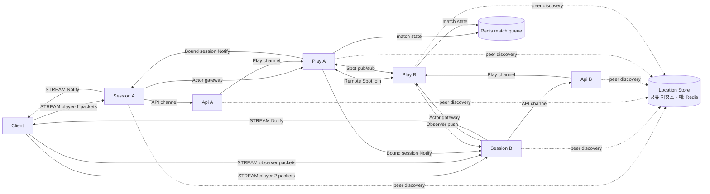
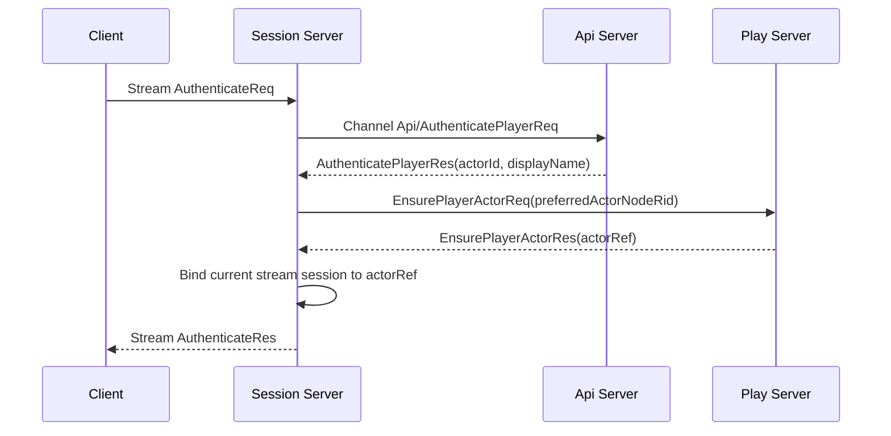
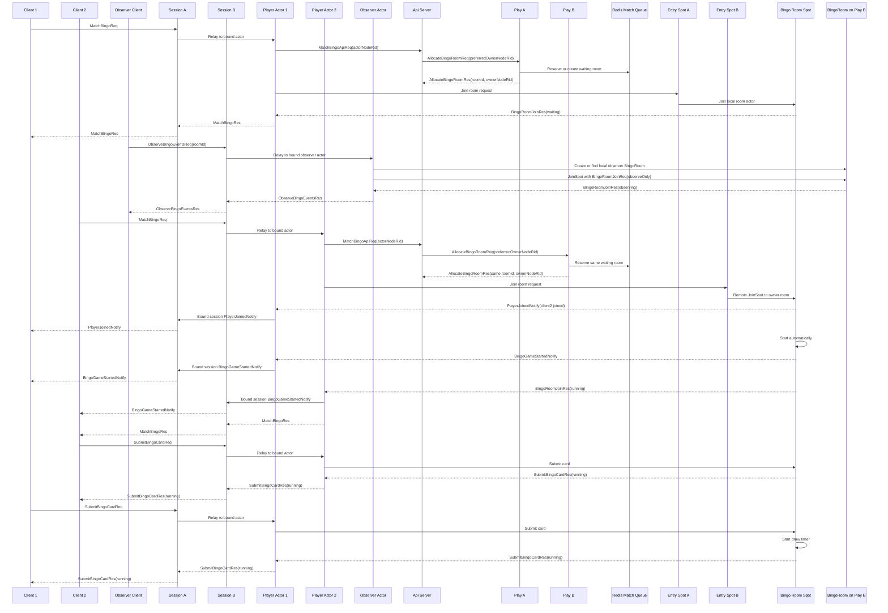
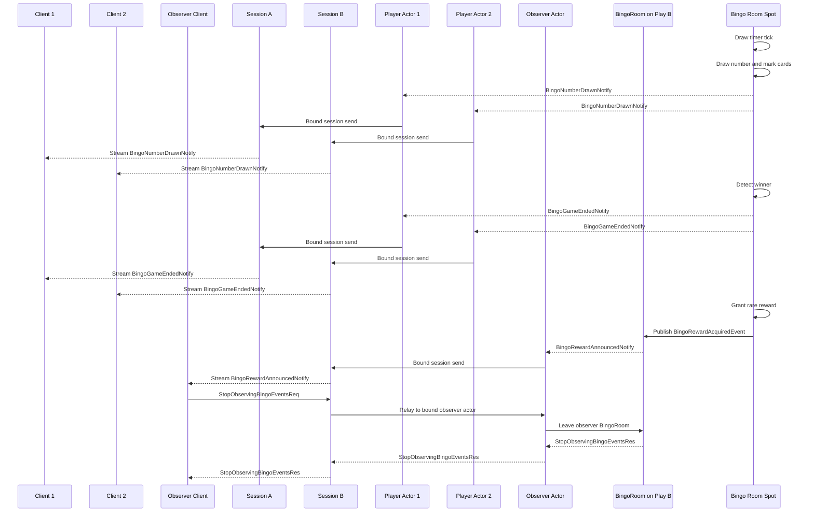
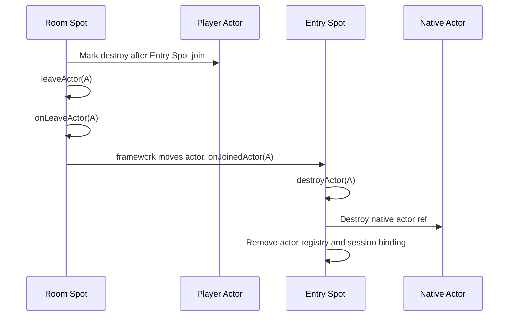

# Bingo Sample Scenario

[샘플 목록](../README.ko.md)

> 이 문서는 모든 framework 언어가 공유하는 Bingo 샘플 시나리오를 정의한다.
> 언어별 샘플은 이 문서를 기준으로 서버 역할, 메시지 흐름, smoke 검증 기준을 맞춘다.

## 1. 목적

Bingo 샘플은 client가 하나의 Session 서버 stream 연결만 유지해도 인증, 매칭,
게임 진행, server push를 모두 처리할 수 있음을 보여 준다. Session 서버는 client
연결과 actor binding을 맡고, Play 서버는 player actor와 room Spot을 소유한다.
API 서버는 인증과 매칭 요청을 처리하며, 서버 간 endpoint 발견은 공유 location store가
맡는다. 샘플은 `api-a`, `api-b`, `play-a`, `play-b`, `session-a`, `session-b`를 실행해
gateway 구조에서도 scale-out, remote Spot join, Spot pub/sub event fan-out이 함께
동작하는지 보여 준다.

이 샘플에서 확인해야 하는 핵심은 아래와 같다.

- client는 Session 서버 stream endpoint 하나만 알고 연결한다.
- Session, API, Play 역할은 각각 2개 이상 실행할 수 있다.
- Session 서버는 인증 후 현재 stream session을 Play 서버의 player actor에 bind한다.
- client packet은 bound actor로 relay된다.
- API 서버는 매칭 요청을 받고 Play 서버에 room 배정을 요청한다.
- Play 서버는 Redis-backed match queue를 사용해 waiting room state를 공유한다.
- match queue Redis는 matching state 공유에만 사용하고, room Spot owner lookup은
  location store가 맡는다.
- Play 서버는 Entry Spot에서 room Spot으로 actor를 join시킨다. player actor와 room Spot이
  서로 다른 Play 서버에 있으면 location store 기반 resolver를 통해 remote Spot join이
  실행된다.
- client는 자기 bingo card를 입력해 room Spot에 제출한다.
- room Spot은 제출된 카드, 번호 추첨, mark, 승리 판정을 소유한다.
- 두 player client의 card가 모두 제출되면 room Spot이 server timer로 번호를 뽑고,
  Play 서버는 번호와 state를 bound session으로 Notify한다.
- 승자가 나오고 결과 처리 중 희귀 보상이 지급되면 owner `BingoRoom`은 Spot pub/sub
  topic으로 `BingoRewardAcquiredEvent`를 publish하고, 다른 Play 서버의 `BingoRoom`은
  event를 받아 observer client로 push한다.
- 공유 location store를 사용해 서버 간 endpoint를 자동으로 발견하고 연결한다.
- handler는 interface 구현체를 framework에 명시 등록하는 방식을 사용한다.
- Bingo의 stream, channel, actor, room Spot payload는 Protobuf를 사용한다.

Client self-check도 샘플의 일부다. client는 `.NET` 샘플처럼 각 request 응답과 server
push payload를 즉시 검증해야 한다. 특히 `PlayerJoinedNotify`,
`BingoGameStartedNotify`, `BingoNumberDrawnNotify`, `BingoGameEndedNotify`,
`BingoRewardAnnouncedNotify` 대기는
stream connector의 public wait interface를 직접 사용한다. inbox를 두더라도 push 도착을
기다리는 로직을 sample-local polling 함수로 숨기면 안 된다.

Bingo가 Protobuf를 맡는 이유는 이 샘플이 여러 서버 역할과 많은 request/response/notify
계약을 가진 gateway형 게임이기 때문이다. Protobuf schema는 언어별 샘플이 같은 필드와
같은 wire 이름을 유지하도록 돕는다. JSON payload 가독성은 TicTacToe와 다른 JSON 기반
샘플이 맡는다.

## 2. 서버 구성



client가 직접 연결하는 서버는 Session 서버뿐이다. API 서버와 Play 서버는
client-facing stream endpoint를 열지 않는다. Session 서버는 인증과 session lifecycle을
소유하지만, 게임 규칙을 해석하지 않는다. 게임 packet은 현재 session에 bind된 actor로
전달되고, actor와 room Spot이 domain state를 처리한다.

다이어그램은 room owner가 `Play A`인 경우의 예시다. 실제 실행에서는 어떤 프로세스가
`Play A` 역할을 맡는지 달라질 수 있지만, 첫 player actor가 있는 Play SpotNode가 room
owner가 되어야 한다. client self-check는 특정 서버 이름이 아니라 응답에 담긴 actor node
rid와 room owner node rid를 비교해 cross-node join과 pub/sub 수신을 검증한다.
샘플 설정은 `SessionA -> PlayA`, `SessionB -> PlayB`처럼 actor 생성 preferred node를
정한다. 이 설정은 endpoint 직접 연결이 아니라 location store 위의 node rid 선택이다.

## 3. 자동 연결 방식

Bingo는 공유 location store 기반 자동 연결을 사용한다. 각 서버는 자신이 제공하는
channel, stream, Spot node endpoint를 location store에 등록하고, 다른 서버는 service
이름으로 상대 endpoint를 찾는다. 등록·조회·자동 연결 lifecycle은 framework가 처리한다.

| 연결 | 연결 방식 | 이유 |
|------|-----------|------|
| Session -> API channel | location store 기반 자동 연결 | Session 서버가 API 서버 주소를 직접 들고 있지 않게 한다. |
| API -> Play channel | location store 기반 자동 연결 | matching API가 현재 Play 서버 endpoint를 location store에서 찾는다. |
| Session -> Play session relay | location store 기반 actor locator | Session 서버가 Play 서버 actor의 위치를 직접 관리하지 않게 한다. |
| Play actor -> remote room Spot | location store 기반 Spot resolver | actor가 다른 Play 서버의 room Spot에 join할 수 있게 한다. |
| Play Spot pub/sub -> Play Spot pub/sub | location store 기반 자동 연결 | reward event를 다른 Play 서버의 `BingoRoom`으로 fan-out한다. |
| Play -> Session bound push | location store 기반 session route | Play 서버가 현재 client session 위치를 framework route로 찾는다. |
| Play -> Redis match queue | Redis endpoint 설정 | 여러 Play 서버가 waiting room state를 공유한다. |

이 샘플이 자동 연결을 쓰는 이유는 운영형 gateway 구조에서 서버 증설과 endpoint
변경을 application 코드 밖으로 밀어내는 흐름을 보여 주기 위해서다. 수동 endpoint
연결은 TicTacToe 샘플이 맡는다.

Spot pub/sub mesh에서 실제 transport 연결 방향은 `SUB -> peer PUB`이다. 다만 두 Play
SpotNode는 모두 publish와 subscribe를 할 수 있으므로 `PlayA.SUB -> PlayB.PUB`와
`PlayB.SUB -> PlayA.PUB`가 모두 성립해야 한다. 언어별 샘플은 이 연결을 수동 endpoint
코드로 만들지 말고 framework의 public Spot pub/sub 설정과 location store 기반 자동
연결에 맡긴다.

Bingo는 Redis를 두 가지 다른 용도로 쓴다. 하나는 framework의 location store 구현체로,
peer discovery·actor route·session route·Spot pub/sub peer 발견을 담당한다. 다른 하나는
§3.1의 match queue로, matching 중인 waiting room의 짧은 상태만 저장한다. 두 용도는
같은 Redis 인스턴스를 공유할 수 있지만 책임은 다르다 — room Spot owner 조회 같은
위치 정보는 location store가, waiting room state 공유는 match queue가 맡는다.

### 3.1 Redis match queue

Play 서버가 둘 이상이면 Play-local singleton allocator만으로는 같은 mode의 두 player를
같은 room으로 모을 수 없다. Bingo는 Redis-backed match queue를 사용해 waiting room
state를 공유한다.

Redis key는 mode 기준으로 잡는다.

```text
bingo:match:{Mode} {
  RoomId: string
  OwnerPlayNodeRid: string
  ReservedActorIds: string[]
  RequiredPlayers: int
  CreatedAtUnixMs: int64
}
```

첫 player가 matching을 요청하면 allocator는 Redis에 waiting room이 있는지 확인한다.
없으면 요청 actor가 있는 Play SpotNode를 preferred owner로 사용해 그 Play 서버에 room
Spot을 만들고 Redis에 waiting room record를 atomic하게 저장한다. 두 번째 player가 matching을
요청하면 allocator는 같은 record에 actor id를 reserve하고 같은 `RoomId`와
`OwnerPlayNodeRid`를 반환한다. actor가 어느 Play 서버에 있든 room join은 `RoomId`에서 만든
Spot routing id로 수행하며, owner가 다른 Play 서버이면 location store 기반 resolver가
remote room Spot 위치를 찾아 준다.

동시 matching 때문에 같은 mode의 waiting room이 둘 생기면 scale-out 검증이 깨진다.
언어별 구현은 Redis transaction, Lua script, 또는 같은 수준의 atomic operation으로
room 생성과 actor reservation을 하나의 결정으로 처리해야 한다. 샘플 전용 in-memory
fallback으로 성공시키면 안 된다.

### 3.2 Match queue Redis 실행 책임

샘플 애플리케이션은 Docker를 직접 호출하지 않는다. Docker container 준비는 runner의
책임이다.

- `run_sample`은 실행마다 pinned Redis image로 전용 container를 띄우고 ready 상태를 확인한 뒤
  Play 프로세스에 전달한다. 이미 떠 있는 Redis나 host Redis endpoint를 재사용하지 않는다.
- runner가 만든 Redis container는 실행마다 고유한 이름을 사용하고, Docker가 배정한
  loopback port를 Play 프로세스에 전달한다. 다른 테스트가 쓰는 Redis container나 호스트
  Redis와 섞이지 않게 하기 위해서다.
- runner는 Play 서버에 실행마다 고유한 Redis key prefix도 전달한다. prefix는 같은 전용
  container 안에서 sample 내부 key를 구분하기 위한 값이지, 여러 실행이 Redis를 공유하기 위한
  장치가 아니다.
- runner는 정상 종료와 실패 종료 모두에서 Redis container를 정리한다.
- Docker를 사용할 수 없으면 runner는 명확한 오류를 출력하고 중단한다.
- C++, .NET, Java, Kotlin, Node 샘플은 모두 같은 Redis endpoint 계약을 사용한다.

## 4. 프로세스와 책임

| 프로세스 | 구성 요소 | 책임 |
|----------|-----------|------|
| `Bingo.Api` | `Api` channel server | access token 인증과 matching API 요청을 처리한다. |
| `Bingo.Api` | `Play` channel client | Play 서버에 room 배정을 요청한다. |
| `Bingo.Session` | stream server | client 연결, 인증 packet, actor binding, actor relay를 처리한다. |
| `Bingo.Session` | session Spot node | session relay와 bound session push 수신을 담당한다. |
| `Bingo.Play` | actor runtime | player actor를 만들고 Entry Spot에 join시킨다. |
| `Bingo.Play` | `BingoEntrySpot` | actor가 특정 room에 들어가기 전의 admission 지점을 맡는다. |
| `Bingo.Play` | `BingoRoom` room Spot | game room에서는 room 참가자, 제출된 카드, draw deck, 승리 판정, player Notify 생성을 소유한다. observer용 local room에서는 reward topic 수신과 observer push 전달만 맡는다. |
| `Bingo.Play` | `Play` channel server | API 서버의 room 배정 요청을 받는다. |
| `Bingo.Play` | Redis match queue adapter | 여러 Play 서버가 같은 waiting room state를 공유하게 한다. |
| `Location Store` | framework location store 계약의 공유 저장소 구현체(예: Redis) | Session·API·Play peer discovery(자동 연결)와 actor/session/Spot 위치 조회를 담으며, 등록·조회·lifecycle 정책은 framework가 소유. |

## 5. 디렉토리와 파일 구성

Bingo 샘플은 Session, API, Play가 분리된 gateway형 게임 샘플이다. 규모가
TicTacToe보다 크기 때문에 DDD와 헥사고날 아키텍처의 경계를 더 분명히 유지해야 한다.
이 구조는 C++, Java, Kotlin, TypeScript, .NET 샘플을 작성할 때 함께 따라야 하는
공통 기준이다. 언어별 빌드 도구, 파일 확장자, package/module 표현은 달라질 수 있지만,
`Client`, `Shared`, `Server/Api`, `Server/Session`, `Server/Play/Domain`,
`Server/Play/Application`, `Server/Play/Infrastructure` 경계와 각 책임은 유지해야 한다.

```text
Bingo/
  README
  build files
  run sample script
  Client/
    Program
    BingoClientScenario
    client build/module files
  Shared/
    shared build/module files
    Configuration/
      SampleNames
      SampleTopology
    Contracts/
      bingo_messages.proto
  Server/
    Api/
      Program
      ApiServerHostFactory
      api build/module files
      Handlers/
        AuthenticatePlayerHandler
        MatchBingoHandler
    Session/
      Program
      SessionServerHostFactory
      session build/module files
      Sessions/
        BingoSession
        Handlers/
          AuthenticateSessionHandler
    Play/
      Program
      PlayServerHostFactory
      play build/module files
      Domain/
        Bingo/
          BingoCard
          BingoGame
          BingoRoomGame
          BingoRoomModels
      Application/
        RoomAllocation/
          BingoMatchQueue
          BingoRoomAllocator
      Infrastructure/
        Redis/
          RedisBingoMatchQueue
        ZLink/
          Actors/
            PlayerActor
            PlayerActorFactory
          Handlers/
            AllocateBingoRoomHandler
            EnsurePlayerActorHandler
          Spots/
            EntrySpot/
              BingoEntrySpot
              Handlers/
                ObserveBingoEventsHandler
                MatchBingoActorHandler
            BingoRoomSpot/
              BingoRoom
              Handlers/
                BingoRoomDrawTimerHandler
                StopObservingBingoEventsHandler
                BingoRewardAcquiredEventHandler
                SubmitBingoCardHandler
```

위 구조는 파일명 고정 규칙이 아니라 역할과 경계의 기준이다. 예를 들어 Java/Kotlin은
package와 class 이름으로, TypeScript는 module과 file 이름으로, C++은 header/source
쌍과 namespace로, .NET은 project와 class 이름으로 같은 구조를 표현할 수 있다. 중요한
점은 같은 책임의 코드가 같은 위치에 있고, 다른 레이어로 섞이지 않는 것이다.

각 영역의 역할은 아래와 같다.

| 위치 | 공통 아키텍처 역할 | 책임 |
|------|----------------------|------|
| `Client/Program` | 외부 driving adapter | Session stream 연결을 만들고 client self-check 시나리오를 실행한다. |
| `Client/BingoClientScenario` | sample scenario | 인증, matching, observer 등록, card 제출, draw push, rare reward publish 수신, final state 검증을 순서대로 수행한다. |
| `Shared/Configuration/*` | shared settings | sample service 이름, packet 이름, endpoint topology를 공유한다. |
| `Shared/Contracts/*` | shared contract | Protobuf schema처럼 언어 간 동일해야 하는 payload 계약을 둔다. |
| `Server/Api/*` | API channel adapter | 인증과 matching 요청을 처리하고 Play 서버 room allocation으로 연결한다. |
| `Server/Session/*` | stream gateway adapter | client stream, 인증, actor binding, bound session relay를 처리한다. |
| `Server/Play/Domain/Bingo/*` | domain model | card, draw deck, room status, winner 판정 같은 게임 규칙을 framework 타입 없이 표현한다. |
| `Server/Play/Application/RoomAllocation/*` | application use case | match queue 계약, waiting room 재사용 결정, room allocation 결과 생성을 조율한다. |
| `Server/Play/Infrastructure/ZLink/*` | ZLink adapter | channel, actor, Spot callback, bound session push, Spot pub/sub publish/subscribe를 application/domain 호출로 변환한다. |
| `Server/Play/Infrastructure/Redis/*` | external adapter | Redis를 사용해 mode별 waiting room record와 actor reservation을 atomic하게 저장한다. |

의존 방향은 `Infrastructure -> Application -> Domain`이다. Domain은 ZLink framework, location store,
stream session, session relay, logger를 알지 않는다. Application은 room 배정 같은 use
case 조율만 맡고, server endpoint 발견, session binding, push 전송 같은 외부 입출력은
adapter에 둔다. 이 규칙 덕분에 다른 언어로 옮겨도 gateway 구조와 게임 규칙의 위치가
같게 유지된다.

알림 전송을 위해 별도 notification Spot이나 별도 notification publisher 계층을 만들지 않는다.
player에게 가는 게임 진행 알림은 `PlayerActor`가 자기 bound session으로 보내고, 서버 간 보상
fan-out은 `BingoRoom`이 Spot pub/sub topic으로 publish/subscribe한다. Spot pub/sub event
수신도 `Spots/BingoRoomSpot/BingoRoom` 안에서 처리한다.

## 6. 언어별 구현 기준

Bingo 샘플은 현재 .NET 샘플에서 검증된 실행 형태와 같은 수준으로 C++, Java, Kotlin,
TypeScript에서도 작성되어야 한다. 언어 문법과 빌드 도구는 달라도 사용자가 샘플을 열었을
때 같은 서버 역할, 같은 gateway 흐름, 같은 검증 지점을 찾을 수 있어야 한다.

언어별 구현은 아래 기준을 만족해야 한다.

- 샘플 루트에는 client, shared contracts, api, session, play 역할이
  한 번만 보이게 구성한다. IDE나 build tool에서 같은 역할의 프로젝트나 module이 중복으로
  보이면 안 된다.
- 각 실행 역할은 명시적인 entry point를 가진다. 실행 시작 코드는 짧게 두고, host 구성과
  client self-check 시나리오는 역할별 구성 요소로 분리한다.
- `Shared/Contracts`에는 Protobuf schema를 둔다. 각 언어는 이 schema에서 생성한 message를
  사용해야 하며, Protobuf와 별도로 손으로 만든 parallel message 정의를 유지하면 안 된다.
  client와 server는 생성된 message 객체의 public interface만 사용해야 하며, 샘플 전용
  helper로 payload 계약을 감추면 안 된다.
- Bingo의 payload codec은 Protobuf다. stream, channel, actor, room Spot payload는 같은
  schema와 같은 packet 이름을 사용하고, JSON이나 MessagePack으로 바꾸지 않는다.
- client self-check는 별도 테스트 프로젝트가 아니라 샘플 client 실행 흐름 안에 둔다.
  샘플 실행은 API 2개, Session 2개, Play 2개 server를 띄우고 client가 Session
  stream에 접속해 `bingo=completed`와 server evidence에 해당하는 성공 결과를 만들 수 있어야
  한다.
- runner는 서버 프로세스를 띄운 뒤 필요한 TCP endpoint가 열린 것을 확인하고 곧바로
  client self-check를 시작한다. 고정 sleep을 준비 상태 확인으로 사용하지 않는다. 별도 readiness 프로젝트나 게임 시나리오
  안의 pub/sub 확인 message를 사용하지 않는다.
- 샘플 실행에는 match queue Redis가 필요하다. 애플리케이션 코드는 Redis endpoint만 설정으로
  받고, Docker container 생성이나 종료를 직접 맡지 않는다. `run_sample`은 실행마다 Docker로
  전용 Redis container를 준비하고, 샘플 종료 시 자신이 만든 container만 정리한다.
- Redis client dependency는 match queue adapter 안에만 둔다. handler, actor, Spot, Domain
  코드가 Redis client 타입을 직접 참조하면 안 된다.
- match queue Redis는 waiting room matching state 공유에만 사용한다. Spot owner lookup,
  actor route, session route, Spot pub/sub peer discovery를 match queue Redis로 우회하면
  Bingo 샘플의 location store 자동 연결 목적이 흐려진다.
- actor가 room에 join하는 흐름은 각 언어 framework의 public actor/Spot API와 location
  store 기반 `SpotRef` resolver 계약을 사용해야 한다. 샘플을 통과시키기
  위해 framework의 internal runtime 객체나 sample-local route helper로 remote join 경로를
  우회하면 안 된다.
- Spot pub/sub 흐름은 각 언어 framework의 public Spot pub/sub API를 사용해야 한다.
  `BingoRoom`은 public publish API로 reward event를 발행하고, 같은 `BingoRoom` 타입이
  public subscribe 등록 API로 reward topic을 구독한다. reward event를 받기 위해
  `BingoNotificationSpot` 같은 별도 Spot 타입을 만들면 안 된다.
  topic 이름은 `bingo.room.reward`처럼 모든 언어에서 같은 문자열 의미를 유지해야 한다.
- push 대기는 connector 객체의 public wait interface를 직접 사용한다. 필요한 push를 고를
  때는 connector wait API의 filter 기능을 사용하고, 받은 message 객체의 public interface로
  payload를 읽어 `Ensure(condition)`처럼 조건식이 직접 보이는 방식으로 검증한다.
- client는 stream connector를 만든 직후, `connect` 전에 inbound observer를 등록해
  `stream-inbound` marker가 포함된 수신 로그를 남긴다. 이 로그는 request 응답과
  server push 수신을 관찰하기 위한 것이며, payload 검증이나 push 대기를 대신하지 않는다.
  observer callback에서는 connector send/request/wait를 다시 호출하지 않는다.
- Java와 Kotlin client scenario의 `submit`과 `await` 의미는
  [framework 공통 비동기 정책](../../spec/04-async-execution-policy.ko.md)을 따른다.
  `submit`은 작업을 시작하고 future를 반환하는 이름으로, `await`는 완료를 기다려
  결과를 받는 이름으로 사용한다.
- sample-local inbox, sleep, 임시 polling 함수로 준비 상태나 push 도착을 숨기면 안 된다.
  대기와 검증은 connector와 message 객체 인터페이스를 사용하는 샘플 시나리오 코드에서
  드러나야 한다.
- Session 서버는 gateway 역할만 한다. 인증, actor binding, packet relay, bound session
  push 수신을 맡고, card 검증, draw, winner 판정 같은 게임 규칙을 해석하지 않는다.
- Domain에는 card, draw deck, room status, winner 판정만 둔다. location store, stream session,
  session relay, handler, logger, codec, endpoint 설정은 Domain으로 들어오면 안 된다.
- Application은 room allocation use case를 조율한다. framework callback을 직접 받거나
  transport 세부 구현을 다루지 않는다.
- Infrastructure는 location store 자동 연결, channel, stream session, actor, Spot, timer,
  bound session push, reward Spot pub/sub publish, codec 연결을 맡는다. handler나 Spot
  adapter가 card 판정, draw order, winner 판정을 직접 구현하면 안 된다.

이 기준은 샘플의 모양을 통일하려는 목적만이 아니다. 같은 시나리오를 여러 언어에서
나란히 읽었을 때 framework 기능 차이와 언어 차이만 보이고, 샘플 구조 차이 때문에
흐름을 다시 해석하지 않아도 되게 하기 위한 기준이다.

## 7. Play 서버 내부 레이어

Bingo Play 서버는 domain logic과 framework adapter를 분리해야 한다. 다른 언어
framework로 구현할 때도 아래 책임 분리를 유지한다.

```text
Server/Play/
  Domain/
    Bingo/
      BingoCard
      BingoGame
      BingoRoomGame
      BingoRoomModels
  Application/
    RoomAllocation/
      BingoMatchQueue
      BingoRoomAllocator
  Infrastructure/
    Redis/
      RedisBingoMatchQueue
    ZLink/
      Actors/
        PlayerActor
        PlayerActorFactory
      Handlers/
        AllocateBingoRoomHandler
        EnsurePlayerActorHandler
      Spots/
        EntrySpot/
          BingoEntrySpot
          Handlers/
            ObserveBingoEventsHandler
            MatchBingoActorHandler
        BingoRoomSpot/
          BingoRoom
          Handlers/
            BingoRoomDrawTimerHandler
            StopObservingBingoEventsHandler
            BingoRewardAcquiredEventHandler
            SubmitBingoCardHandler
```

역할은 아래처럼 나눈다.

| 위치 | 책임 |
|------|------|
| `Domain/Bingo/BingoCard` | 3 x 3 card 검증, free cell, mark, complete line 계산을 소유한다. |
| `Domain/Bingo/BingoGame` | 제출된 card, draw deck, drawn numbers, winners, draw 종료 조건을 소유한다. |
| `Domain/Bingo/BingoRoomGame` | player join, room status, card 제출 가능 여부, draw timer 시작/종료 신호, room event 생성을 소유한다. |
| `Application/RoomAllocation/BingoMatchQueue` | room allocation use case가 필요로 하는 waiting room reservation 계약을 정의한다. |
| `Application/RoomAllocation/BingoRoomAllocator` | matching 요청을 받아 match queue reservation과 room allocation 결과 생성을 조율한다. |
| `Infrastructure/Redis/RedisBingoMatchQueue` | mode별 waiting room record와 actor reservation을 Redis에 atomic하게 저장한다. |
| `Infrastructure/ZLink/Spots/BingoRoomSpot/BingoRoom` | ZLink Spot lifecycle, actor join callback, draw 진행, domain 호출, player actor push, reward pub/sub publish/subscribe를 맡는다. |
| `Infrastructure/ZLink/Spots/BingoRoomSpot/BingoRoom` | observer용 local room 인스턴스에서 reward topic subscribe callback을 받고 observer actor에게 push를 전달한다. |
| `Infrastructure/ZLink/Actors/PlayerActor` | player별 bound session push를 감싼다. room Spot은 actor의 public method만 호출하고 stream frame을 직접 만들지 않는다. |
| `Infrastructure/ZLink/Handlers/*` | channel request를 받아 application adapter로 연결한다. |
| `Infrastructure/ZLink/Spots/EntrySpot/Handlers/*` | Entry Spot actor request를 받아 matching과 room join을 연결한다. |
| `Infrastructure/ZLink/Spots/BingoRoomSpot/Handlers/*` | room Spot actor request와 timer/event callback을 받아 domain operation을 호출한다. |

Domain 객체는 ZLink framework 타입을 직접 참조하지 않는다. `BingoRoom` Spot은 framework
callback을 받아 domain method를 호출하고, domain이 반환한 change와 event를 adapter가
message로 바꾼다. card validation, draw order, winner 판정이 handler나 Spot handler에
흩어지면 안 된다.

## 8. Handler 등록 방식

Bingo 샘플은 typed handler 계약을 명시 등록하는 방식을 사용한다. 각 handler는
framework가 정의한 handler 계약을 구현하고, 서버 구성 코드에서 scan 또는 명시
등록으로 framework에 알려진다.

이 방식의 목적은 아래와 같다.

- handler가 어떤 request/response 계약을 처리하는지 타입 선언으로 드러난다.
- Session, channel, Entry Spot, room Spot handler가 같은 등록 원칙을 공유한다.
- attribute, annotation, decorator가 없는 언어에서도 같은 구조를 옮기기 쉽다.

언어별 framework가 선언형 등록 기능을 제공하더라도 Bingo에서는 handler 계약을
구성 코드에서 명시 등록하는 방식을 우선 사용한다. `.NET`이나 Java처럼 interface를
자연스럽게 쓸 수 있는 언어는 interface로 표현하고, TypeScript처럼 runtime interface가
사라지는 언어는 handler class와 명시 등록으로 같은 의미를 표현한다. 선언형 등록
방식은 TicTacToe 샘플이 맡는다.

## 9. 게임 규칙

Bingo는 샘플 흐름을 짧게 유지하기 위해 2인 자동 시작 규칙을 사용한다.

| 항목 | 규칙 |
|------|------|
| 플레이어 수 | 정확히 2명 |
| 보드 | 3 x 3 |
| 번호 범위 | 1부터 15까지 |
| 가운데 칸 | free cell로 시작부터 mark 처리 |
| 카드 입력 | 각 client가 3 x 3 bingo card를 제출한다. |
| 시작 조건 | 두 번째 player가 join하면 room이 자동으로 시작한다. |
| 번호 추첨 | 두 player client의 card가 모두 제출되면 room Spot timer가 일정 간격으로 번호를 하나씩 뽑는다. |
| mark 방식 | 서버 자동 mark. client는 card만 제출하고 mark나 bingo claim은 보내지 않는다. |
| 승리 조건 | complete line이 1개 이상 생기면 승리 |
| 종료 조건 | 첫 승리 draw sequence가 나오면 종료 |

방장, ready 버튼, 수동 mark, 여러 라운드, 랭킹은 공통 샘플 범위에서 제외한다.
이 기능들은 게임 샘플을 크게 만들지만 framework 흐름을 이해하는 데 꼭 필요하지 않다.

## 10. Client 검증 흐름

Bingo client는 아래 순서로 scenario를 실행하고 각 단계의 값을 확인한다.

1. `player-1`, `player-2`, `observer`로 stream 인증을 요청하고, 각
   `AuthenticateRes.ActorId`가 요청한 actor id와 같은지 확인한다. `player-1`은
   `SessionA`에 연결하고, `player-2`와 `observer`는 `SessionB`에 연결한다.
   self-check는 `player-1.ActorNodeRid`와 `player-2.ActorNodeRid`가 서로 다른지 확인한다.
2. `player-1`이 먼저 `MatchBingoReq`를 보내고 `WaitingForPlayers` 상태와 room id를
   확인한다. 이 시점에 `player-1`이 자기 join notify를 받지 않았는지도 확인한다.
   `MatchBingoRes.RoomOwnerNodeRid`는 `player-1.ActorNodeRid`와 같아야 한다.
3. `observer`가 `ObserveBingoEventsReq(RoomId)`를 보내고
   `ObserveBingoEventsRes.Subscribed = true`를 확인한다. 이 요청은 owner가 아닌 Play 서버에
   observer용 local `BingoRoom` 인스턴스를 만들거나 찾은 뒤, observer actor를
   `BingoRoomJoinReq.ObserveOnly = true` payload로 그 `BingoRoom`에 join시킨다. 이 응답을
   받은 뒤에 `player-2` matching과 card 제출을 진행해야 reward event를 놓치지 않는다.
4. `player-2`가 `MatchBingoReq`를 보내면 같은 room id와 `Running` 상태를 확인한다.
   self-check는 `player-2.ActorNodeRid != MatchBingoRes.RoomOwnerNodeRid`를 확인해
   `player-2` actor가 다른 Play 서버의 room Spot에 remote join했음을 검증한다.
5. `player-1`은 connector wait API로 `PlayerJoinedNotify`를 기다리고,
   payload의 `ActorId`가 `player-2`인지 확인한다. `player-2`는 자기 join notify를
   받지 않아야 한다.
6. 두 player client는 connector wait API로 `BingoGameStartedNotify`를 기다리고,
   push state가 `Running`인지 확인한다.
7. 두 player client가 deterministic card를 제출한 뒤 response state에 두 player card가 모두
   9칸으로 들어갔는지 확인한다.
8. 두 player client는 draw sequence별로 `BingoNumberDrawnNotify`를 기다리고, 양쪽 push의
   `DrawSeq`, `Number`, state가 서로 같은지 확인한다.
9. 두 player client는 `BingoGameEndedNotify`를 기다리고, final state의 `Finished`, drawn
   number sequence, winners, player list, center free-cell mark를 확인한다.
10. observer client는 connector wait API로 `BingoRewardAnnouncedNotify`를 기다리고,
   `RoomId`, `ActorId`, `DrawSeq`, `ItemId`, `ItemName`, `Rarity`,
   `ReceivingSpotNodeRid`를 확인한다.
   `ReceivingSpotNodeRid`는 `ObserveBingoEventsRes.ObserverNodeRid`와 같고,
   `MatchBingoRes.RoomOwnerNodeRid`와 달라야 한다.
11. observer client는 `StopObservingBingoEventsReq(RoomId)`를 보내 observer actor가
   observer용 local `BingoRoom`에서 나와 Entry Spot으로 돌아왔는지 확인한다. 이 흐름은
   reward event 수신을 위한 세 번째 actor가 game room cleanup과 섞이지 않게 한다.
12. 세 client는 inbound observer 로그에 `stream-inbound` marker가 남았는지 확인한다.
   로그에는 sample 이름, client 역할, message kind, packet name, request sequence,
   payload byte length가 포함되어야 한다. heartbeat control frame은 observer 기능
   검증에는 포함할 수 있지만 기본 sample output에서는 낮은 log level로 두거나 걸러낸다.

이 검증은 성공 시나리오를 눈으로 읽기 위한 로그가 아니라 sample release gate다. 언어별
client가 위 값을 확인하지 않으면 공통 sample 기준을 만족하지 못한다.

## 11. 메시지 계약

아래 계약은 언어 중립 schema다. 언어별 샘플은 같은 이름과 필드를 자기 언어의
record, class, struct, type alias 등으로 구현한다.

client stream 인증 메시지:

```text
AuthenticateReq {
  AccessToken: string
}

AuthenticateRes {
  ActorId: string
  DisplayName: string
  ActorNodeRid: string
}
```

API 인증과 actor 준비 메시지:

```text
AuthenticatePlayerReq {
  AccessToken: string
}

AuthenticatePlayerRes {
  Accepted: bool
  ActorId: string?
  DisplayName: string?
  Reason: string?
}

EnsurePlayerActorReq {
  ActorId: string
  DisplayName: string
  PreferredActorNodeRid: string
}

// protobuf 경계 전용 wire 메시지 — framework의 ActorRefSnapshot과의 변환은
// generated message 경계 한 곳에서만 수행한다.
ActorRefWire {
  NodeRid: string
  ActorId: string
  Generation: uint64
}

EnsurePlayerActorRes {
  ActorId: string
  ActorType: string
  Actor: ActorRefWire
}
```

matching과 room join 메시지:

```text
MatchBingoReq {
  Mode: string
}

MatchBingoRes {
  RoomId: string
  State: BingoRoomState
  RoomOwnerNodeRid: string
}

MatchBingoApiReq {
  ActorId: string
  DisplayName: string
  ActorNodeRid: string
  Mode: string
}

MatchBingoApiRes {
  RoomId: string
  RoomOwnerNodeRid: string
}

AllocateBingoRoomReq {
  Mode: string
  ActorId: string
  PreferredOwnerNodeRid: string
}

AllocateBingoRoomRes {
  RoomId: string
  RoomOwnerNodeRid: string
}

BingoRoomSettingsPayload {
  RoomName: string
  Mode: string
  RequiredPlayers: int
  MaxDrawNumber: int
  Purpose: string
  ObservedRoomId: string?
}

BingoRoomJoinReq {
  RoomId: string
  ActorId: string
  DisplayName: string
  ObserveOnly: bool
}

BingoRoomJoinRes {
  State: BingoRoomState
}

SubmitBingoCardReq {
  RoomId: string
  Card: int[]
}

SubmitBingoCardRes {
  State: BingoRoomState
}

ObserveBingoEventsReq {
  RoomId: string
}

ObserveBingoEventsRes {
  Subscribed: bool
  ObserverNodeRid: string
}

StopObservingBingoEventsReq {
  RoomId: string
}

StopObservingBingoEventsRes {
  Stopped: bool
  ObserverNodeRid: string
}

```

server push 메시지:

```text
PlayerJoinedNotify {
  RoomId: string
  ActorId: string
  DisplayName: string
  Seat: int
  IsHost: bool
  State: BingoRoomState
}

BingoGameStartedNotify {
  State: BingoRoomState
}

BingoNumberDrawnNotify {
  RoomId: string
  DrawSeq: int
  Number: int
  State: BingoRoomState
}

BingoGameEndedNotify {
  State: BingoRoomState
}

BingoRewardAnnouncedNotify {
  RoomId: string
  ActorId: string
  DrawSeq: int
  ItemId: string
  ItemName: string
  Rarity: string
  ReceivingSpotNodeRid: string
}
```

Spot pub/sub으로 전달하는 event:

```text
BingoRewardAcquiredEvent {
  RoomId: string
  ActorId: string
  DrawSeq: int
  ItemId: string
  ItemName: string
  Rarity: string
}
```

공통 state 모델:

```text
BingoRoomState {
  RoomId: string
  Status: string
  HostActorId: string
  CanStart: bool
  DrawSeq: int
  LastDrawnNumber: int?
  DrawnNumbers: int[]
  Players: BingoPlayerState[]
  Winners: string[]
}

BingoPlayerState {
  ActorId: string
  DisplayName: string
  Seat: int
  IsHost: bool
  Card: int[]
  Marks: bool[]
  CompletedLines: int
}
```

`HostActorId`, `CanStart`, `IsHost` 필드는 기존 언어별 구현과 호환을 위해 유지할 수
있다. 2인 자동 시작 공통 시나리오에서는 별도 시작 요청을 보내지 않으므로 client
검증 기준으로 사용하지 않는다.

## 12. 인증과 Actor Binding 흐름



Session 서버는 인증 성공 후 actor reference를 얻고 현재 stream session을 그 actor에
bind한다. 이후 client gameplay packet은 Session 서버가 직접 처리하지 않고 bound actor로
relay한다.
Session 서버는 자기 역할에 대응하는 preferred Play node rid를 `EnsurePlayerActorReq`에
담는다. `SessionA`는 `PlayA`를, `SessionB`는 `PlayB`를 preferred node로 사용한다.
언어별 framework에 public targeted actor creation 또는 targeted channel request 표면이
부족하면 샘플에서 우회하지 말고 framework public API를 먼저 보강해야 한다.

## 13. Matching과 카드 제출 흐름



첫 player가 들어오면 room은 대기 상태가 된다. 두 번째 player가 같은 room에 들어오면
room은 별도 `StartBingoGameReq` 없이 자동으로 `Running` 상태가 되고 양쪽 client에
`BingoGameStartedNotify`를 보낸다. client는 game start를 확인한 뒤 3 x 3 card를
제출한다. 두 player client의 card가 모두 제출되면 room Spot이 draw timer를 시작하고,
일정 간격으로 번호를 뽑아 양쪽 client에 `BingoNumberDrawnNotify`를 보낸다.
Redis match queue는 같은 mode의 waiting room을 두 Play 서버가 공유하기 위한 장치다.
room Spot owner 위치 조회와 remote `JoinSpot` route는 match queue Redis가 아니라
location store 기반 resolver가 처리해야 한다.

`BingoGameStartedNotify` 전달 책임은 join 상태에 따라 나눈다. owner `BingoRoom`은 이미
room 안에 있던 player에게 room event로 start notify를 보낸다. 방금 remote `JoinSpot`으로
이동한 actor는 대상 room의 `OnJoinedActorAsync`가 호출된 시점에 join lifecycle을 완료한
상태이므로, 이 callback에서 actor의 public bound session API로 start notify를 보낸다.
source entry handler는 `JoinSpot`이 끝난 뒤 이전 actor 객체를 다시 사용하지 않는다. remote
join으로 actor의 실행 위치가 달라질 수 있기 때문이다. 이 분리는 runner의 endpoint 준비 상태
확인과 별개의 책임 경계이며, 각 언어 샘플도 같은 구조를 따라야 한다.

observer용 `BingoRoom`은 같은 Spot 타입이지만 게임 참가 room이 아니다. routing id는
관찰 대상 `RoomId`와 현재 Play SpotNode rid에서 만든 local observer room id를 사용한다.
예를 들어 `observe:{RoomId}:{LocalNodeRid}`처럼 owner game room의 routing id와 충돌하지
않아야 한다. 이 Spot은 `BingoRoomJoinReq.ObserveOnly = true`로 join한 observer actor만 보관하고,
`PlayerJoinedNotify`, card 제출, draw timer, winner 판정에는 참여하지 않는다. 따라서
3번째 actor가 들어와도 2인 게임 규칙과 `RequiredPlayers = 2` 조건을 바꾸지 않는다.
`BingoRoomSettingsPayload.Purpose`는 game room이면 `"Game"`, observer용 local room이면
`"Observer"`로 설정한다. observer용 room은 `ObservedRoomId`에 관찰 대상 owner room id를
담고, `RequiredPlayers`와 `MaxDrawNumber`는 game rule에 사용하지 않는다.
`BingoRewardAcquiredEvent`를 수신한 `BingoRoom`은 `event.RoomId`가 자기 `ObservedRoomId`와 같을
때만 observer actor에게 push한다. owner game room이나 다른 room을 관찰하는 observer room이
같은 topic event를 받더라도, 등록된 observer와 `ObservedRoomId`가 맞지 않으면 drop한다.

## 14. Server Draw Timer와 Bound Push 흐름



room Spot은 제출된 card, draw deck, mark, winner 판정을 한 모듈 안에 숨긴다.
client는 자기 card를 제출한 뒤 번호 추첨을 요청하지 않는다. 어떤 번호가 나오는지,
card가 어떻게 mark되는지, 승자가 누구인지는 서버 timer가 보낸 Notify와 state로
확인한다.

`BingoRewardAcquiredEvent`는 game state를 바꾸는 경로가 아니다. 승자 판정과 player push는
owner `BingoRoom`이 먼저 결정한다. owner room은 두 player에게 `BingoGameEndedNotify`를
보낸 뒤, 승자에게 지급된 희귀 보상 정보를 reward event로 Spot pub/sub에 publish한다.
Spot pub/sub은 이미 결정된 보상 이벤트를 다른 Play 서버의 observer용 local `BingoRoom`에
알리고, observer client push를 검증하기 위해 사용한다.
observer용 `BingoRoom`은 event를 받으면 자기 observer actor에게
`BingoRewardAnnouncedNotify`를 보내고, observer actor는 자기 bound session으로 client에
push한다. observer용 room은 event의 `RoomId`가 자기 `ObservedRoomId`와 일치할 때만 push한다.
별도 notification 전용 Spot 타입을 만들지 않는다.

observer client가 reward notify를 확인한 뒤에는 `StopObservingBingoEventsReq`를 보낸다.
observer actor는 observer용 local `BingoRoom`에서 leave되고 Entry Spot으로 돌아온다. 이
정리는 observer 구독 수명만 끝내며, game room의 player cleanup이나 winner 판정 상태를
바꾸지 않는다.

## 15. Disconnect와 actor destroy 흐름

Bingo 샘플은 stream disconnect와 actor destroy를 서로 다른 lifecycle로 보여 주어야 한다.
disconnect는 client stream session과 bound session 정리이고, actor destroy는 Play 서버의
actor 객체와 native actor ref를 제거하는 종료 작업이다. Session 서버 연결이 끊겼다는
이유만으로 room Spot에서 actor를 제거하거나 actor를 destroy하면 안 된다.

### 15.1 Disconnect 흐름

client stream이 끊기면 Session 서버는 현재 stream session에 묶인 actor binding을 닫는다.
이때 Play 서버 actor는 즉시 destroy되지 않는다. actor가 room에 들어가 있었다면 room state는
그대로 유지되고, Play 서버는 actor가 다시 bound session을 얻을 수 있는 상태로 둔다.
disconnect callback은 logging, bound session cleanup, 재접속 가능 상태 표시처럼 stream
연결에 한정된 작업만 맡는다.

언어별 샘플은 disconnect hook을 비워 두지 말고, 적어도 현재 actor/session 정리가 실행되는
경로가 드러나게 해야 한다. disconnect hook 안에서 room leave와 actor destroy를 직접 호출하지
않는다. room leave와 actor destroy는 아래의 게임 종료 흐름에서만 실행한다.

### 15.2 게임 종료 후 actor destroy 흐름

room Spot이 `BingoGameEndedNotify`를 양쪽 client에 전송한 뒤에는 room에 남아 있는 player
actor를 정리한다. 정리 순서는 모든 언어 샘플에서 아래와 같아야 한다.

1. actor 객체 생성이 끝나면 framework는 create payload와 함께 `onCreateActor`를 한 번 호출한다.
2. room Spot은 종료 cleanup이 한 번만 시작되도록 guard를 둔다.
3. room Spot은 각 player actor에 “Entry Spot으로 돌아오면 destroy한다”는 표시를 남긴다.
4. room Spot은 `leaveActor`로 actor를 room에서 내보낸다.
5. framework는 room `onLeaveActor`를 호출한 뒤 actor를 Entry Spot으로 이동시키고 Entry
   Spot `onJoinedActor`를 호출한다.
6. Entry Spot `onJoinedActor` 또는 Entry Spot handler는 actor의 destroy 표시를 확인하고
   Entry Spot context의 `destroyActor`를 호출한다.
7. `destroyActor`는 `onLeaveActor`나 다른 lifecycle callback을 호출하지 않고 actor 객체,
   native actor ref, framework registry, bound session binding을 정리한다.
8. 같은 actor에 대한 중복 destroy나 destroy 중 재진입은 성공 no-op이어야 하며,
   lifecycle callback을 다시 호출하면 안 된다.



player actor destroy는 client가 직접 관찰하는 protocol 메시지가 아니므로 server-side
evidence로 확인한다. client self-check는 game 종료 notify와 observer 관찰 종료 response를
검증하고, 언어별 `run_sample` 또는 sample regression은 Play 서버 로그, fake backend call,
runtime event, 또는 framework 테스트 중 하나로 아래 사실을 확인해야 한다.

- room Spot `onLeaveActor`가 각 player actor마다 실행된다.
- Entry Spot destroy가 각 player actor마다 완료된다.
- Entry Spot destroy 과정에서 Entry Spot `onLeaveActor`나 다른 lifecycle callback이
  추가로 실행되지 않는다.
- disconnect cleanup만으로 actor destroy가 실행되지 않는다.

observer actor는 player actor cleanup 대상이 아니다. observer actor는
`StopObservingBingoEventsReq` 처리 중 observer용 local `BingoRoom`에서 leave되어 Entry Spot으로
돌아온다. 샘플은 observer actor가 reward event 수신 후 관찰 room을 떠났다는 server-side
evidence를 남겨야 한다.

## 16. 완료 기준

- client 세 개가 Session 서버에 하나의 stream 연결만 연다. player-1은 Session A에,
  player-2와 observer는 Session B에 연결한다.
- Session 2개, API 2개, Play 2개가 별도 실행 모드 또는 별도 프로세스로 구분되어 있다.
- Session, API, Play 서버는 공유 location store로 서로를 자동 발견한다.
- Redis match queue를 사용해 두 Play 서버가 waiting room state를 공유한다.
- match queue Redis는 matching state 공유에만 사용하고, Spot owner lookup과 pub/sub peer
  discovery를 대신하지 않는다.
- 두 player client와 observer client가 서로 다른 actor로 인증된다.
- player-1 actor와 player-2 actor는 서로 다른 Play SpotNode에 생성된다.
- Session 서버가 인증된 stream session을 Play 서버 actor에 bind한다.
- 첫 `MatchBingoReq`는 room을 만들고 waiting state를 반환한다.
- observer client는 `ObserveBingoEventsReq(RoomId)`를 보내 owner가 아닌 Play 서버의
  observer용 local `BingoRoom`에 join하고 `ObserveBingoEventsRes.Subscribed = true`를 확인한다.
- observer용 local `BingoRoom`은 observer actor를 보관하고 reward topic을 구독하지만,
  player membership, card 제출, draw timer, winner 판정에는 참여하지 않는다.
- 두 번째 `MatchBingoReq`는 같은 room에 remote Spot join하고 room을 자동 시작시킨다.
- `player-2.ActorNodeRid != MatchBingoRes.RoomOwnerNodeRid`를 확인해 remote join을 검증한다.
- 두 player client는 game start를 확인한 뒤 `SubmitBingoCardReq`로 card를 제출한다.
- 두 card가 모두 제출되면 room Spot timer가 번호를 뽑고 각 player card mark를
  서버에서 갱신한다.
- 승자가 나오면 room state가 `Finished`가 되고 `Winners`가 채워진다.
- `BingoNumberDrawnNotify`와 `BingoGameEndedNotify`가 bound session을 통해 두 player
  client에 전달된다.
- owner `BingoRoom`은 승자에게 지급된 희귀 보상 정보를 담은 `BingoRewardAcquiredEvent`를
  Spot pub/sub topic으로 publish한다.
- owner가 아닌 Play 서버의 `BingoRoom`은 `BingoRewardAcquiredEvent`를 수신하고 observer client에
  `BingoRewardAnnouncedNotify`를 push한다.
- reward event 수신을 위해 `BingoNotificationSpot` 같은 별도 Spot 타입을 만들지 않는다.
- `BingoRewardAnnouncedNotify.ItemId`, `ItemName`, `Rarity`는 owner가 publish한 보상 정보와
  같아야 한다.
- `BingoRewardAnnouncedNotify.ReceivingSpotNodeRid`는
  `ObserveBingoEventsRes.ObserverNodeRid`와 같고 `MatchBingoRes.RoomOwnerNodeRid`와 달라야 한다.
- observer client는 `StopObservingBingoEventsReq`를 보내 observer actor가 observer용
  local `BingoRoom`에서 leave되고 Entry Spot으로 돌아온 것을 확인한다.
- client inbound observer 로그에 request 응답과 server push 수신을 나타내는
  `stream-inbound` marker가 남는다.
- stream disconnect는 bound session을 정리하지만 actor를 즉시 destroy하지 않는다.
- 게임 종료 후 room Spot은 actor를 Entry Spot으로 leave시키고, Entry Spot은 actor를
  destroy한다.
- actor destroy는 `onLeaveActor`를 호출하지 않고 actor registry와 native actor ref를
  정리한다.
- client는 API 서버나 Play 서버 endpoint를 직접 사용하지 않는다.
- handler 등록은 typed handler 계약을 구성 코드에서 명시 등록하는 방식을 사용한다.
- 카드 제출 flow는 제출 dispatch까지 이어지고, 각 timer tick은 별도 `origin=timer` flow로
  room dispatch와 해당 bound push까지 이어진다.
- 언어 표준 meter/registry 연결 예제가 있고 Play는 `DrainNatural` 정책을 공개 API로 선언한다.

## 17. 관측·운영 켜기 (Observability & Ops)

Bingo는 이미 세션 게이트웨이(STREAM)·actor 이동·룸 타이머·bound push를 갖춰, 관측·운영 기능이
관측하는 사건을 그대로 만들어 낸다. 그래서 사용자가 **바로 따라 켜 보기** 좋은 샘플이다. 세
기능은 각각 [메시지 흐름 상관관계](../../spec/53-flow-correlation.ko.md), [런타임 메트릭](../../spec/51-runtime-metrics.ko.md),
[Graceful Drain & Handoff](../../spec/54-graceful-drain-handoff.ko.md)이 계약을 소유하고, 언어별 표면은
각 언어 monitoring 문서가 소유한다. **셋 다 공통 케이스는 무설정에 가깝다.**

### 17.1 메시지 흐름 추적 로그 (flow correlation)

세 노드(`Session`/`Api`/`Play`)에서 dispatch 추적을 켠다. flow id는 framework가 발원점에서
자동으로 만들고 모든 메시지 경계에 전파한다. 카드 제출 flow는 STREAM→actor→room-spot까지
이어진다. timer tick은 `origin=timer`인 새 flow를 시작하고 room dispatch→bound push까지 이어진다.

```csharp
// 각 노드 공통 (.NET). role = 그 노드의 역할 문자열("session"/"api"/"play", README §6)
options.ConfigureDispatch()
    .MessageFlow(ZLinkMessageFlowLogMode.KeyTransitions)
    .TraceLogFile($"log/flow-{role}.log")
    .TraceLabel(role); // 자동 생성된 flow id로 여러 노드의 로그를 조인
```

확인: 카드 제출 id는 `Session`→`Play` actor relay→`BingoRoomSpot` dispatch를 잇는다. 별도 timer id는
`BingoRoomSpot` timer dispatch→bound push를 잇는다. corr이 없는 spot 경계에서도 각 `flow=`가 유지된다.

### 17.2 런타임 메트릭

`Session`은 CCU, `Play`는 룸 큐·actor 이동을 방출한다. 언어 표준 meter/registry만 연결하면
된다. .NET 샘플은 별도 HTTP metrics 서버를 추가하지 않고 `MeterListener`로 framework meter를
구독해 runner 로그에서 실제 계기 값을 확인한다.

```csharp
// Session/Play 공통 (.NET) — framework meter의 계기만 구독
listener.InstrumentPublished = static (instrument, meterListener) =>
{
    if (instrument.Meter.Name == ZLinkMeters.Framework)
        meterListener.EnableMeasurementEvents(instrument);
};
listener.SetMeasurementEventCallback<long>(RecordMetric);
listener.SetMeasurementEventCallback<double>(RecordMetric);
listener.Start(); // runner는 "zlink metric" 로그에서 실제 값을 확인
```

Prometheus나 OpenTelemetry exporter가 필요한 애플리케이션은 같은 `ZLinkMeters.Framework` meter를
자기 metrics pipeline에 추가한다. exporter 선택과 metrics HTTP endpoint는 앱의 운영 정책이다.
관찰 포인트: `zlink.stream.connections.active`(=CCU, `Session`),
`zlink.spot.queue.depth`(`kind=user`, `Play`), player가 다른 `Play`로 옮겨질 때 `zlink.actor.transfers`.

### 17.3 Graceful Drain

`Play`를 무중단 배포하려면 룸 정책만 선언하고 나머지는 자동 drain에 맡긴다.

```csharp
// Play 노드 (.NET) — 짧은 매치룸은 자연 종료 정책
options.AddSpotMesh(SampleNames.RoomSpotDiscovery)
    .UseDrainPolicy(ZLinkSpotDrainPolicy.DrainNatural)
    .AddActorFactory<PlayerActorFactory>(SampleNames.PlayerActorType)
    .AddActorTransferAdapter<PlayerActor, PlayerActorTransferAdapter>(SampleNames.PlayerActorType);
```

확인: `play-a`에 drain을 걸면 신규 매칭 배정에서만 빠지고, 진행 중 룸은 자연 종료될 때까지
유지되며, bound actor는 `play-b`로 이동해 세션이 이어진다. `zlink.drain.actors.handed_off`로 확인.

> event-sourcing owner spot(ShoppingMall `OrderWorkflowSpot`)은 `ReleaseAndRecreate` 정책이
> 맞다 — drain 시 row를 해제하고 다음 요청이 타 노드에서 event replay로 재구성한다.

### 17.4 언어별 표면

같은 세 기능의 언어별 정식 표면은 각 언어 monitoring 문서를 본다:
[.NET](../../spec/languages/dotnet/01-system-structure.ko.md) §10~12 ·
[Java](../../spec/languages/java/01-system-structure.ko.md) §8~10 ·
[Node](../../spec/languages/node/01-system-structure.ko.md) §10~12 ·
[C++](../../spec/languages/cpp/02-framework-interfaces.ko.md) §8~10 ·
[Kotlin](../../spec/languages/kotlin/02-handler-interfaces.ko.md) §8. 배포 조건에서의 e2e 검증은
[Config 11 — 관측·운영 배포](../../e2e/config-11-observability-ops.ko.md)가 다룬다.
