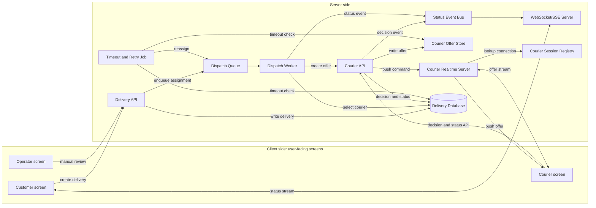
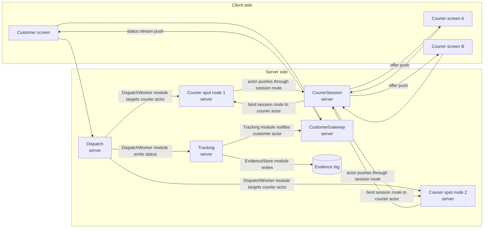
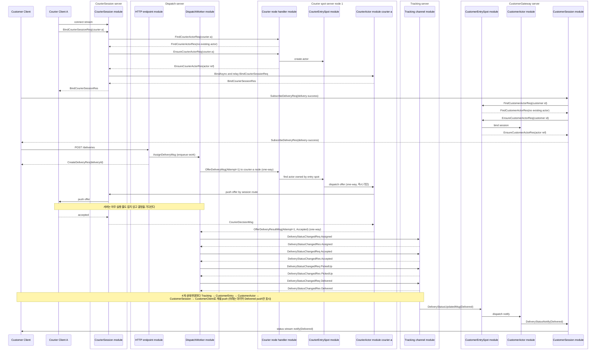
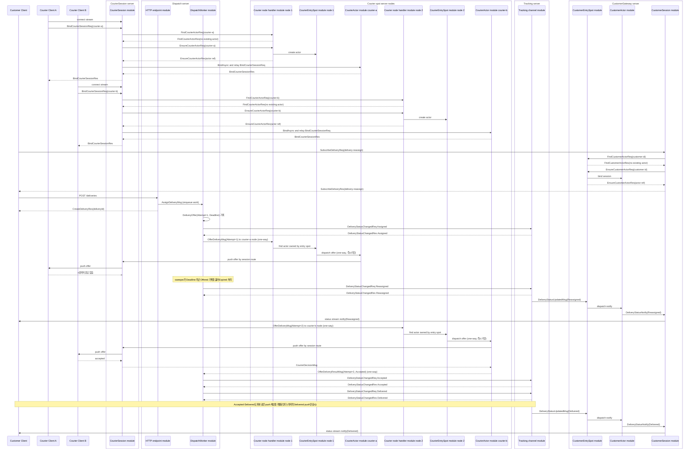

# DeliveryDispatch Sample Scenario

[샘플 목록](../README.ko.md)

> 이 문서는 모든 framework 언어가 공유하는 DeliveryDispatch 샘플 시나리오를 정의한다.
> 언어별 샘플은 이 문서를 기준으로 서버 역할, 메시지 흐름, message 계약,
> ZLink 요소, smoke 검증 기준을 맞춘다.

## 1. 목적

DeliveryDispatch는 배송 배차와 배송 상태 추적을 보여 주는 실시간 업무형 샘플이다.
고객 client는 HTTP로 배송을 만들고 WebSocket 또는 stream session으로 상태 변경을
기다린다. 내부 서버들은 ZLink channel, entry spot, actor, stream session을 사용해서
배차 요청, 배송원 제안, timeout 재배정, 고객별 상태 push를 처리한다.

이 샘플은 실제 배송 플랫폼을 그대로 구현하는 것을 목표로 하지 않는다. 실무에서 자주
만나는 "요청 생성, 수행자 선택, 특정 사용자 연결로 push, 응답 timeout 후 재시도" 같은
기능을 구현할 때 각 책임이 ZLink framework의 어떤 기능에 대응되는지 보여 주는 것이
목적이다. 따라서 배송 업무 규칙 자체보다 HTTP 경계, channel, entry spot, actor,
stream session binding이 하나의 업무 흐름 안에서 어떻게 연결되는지를 기준으로 읽어야
한다.

이 샘플의 직접 모델은 음식 배달, 퀵 배송, 택배 같은 배송 서비스다. 같은 구조는
택시 호출, 현장 출동, 방문 서비스처럼 "요청을 만들고 수행자를 배정한 뒤 상태를
실시간으로 고객에게 보여 주는" 도메인에도 적용할 수 있다.

샘플로 구현할 때 확인할 핵심은 아래와 같다.

- 고객 client는 배송 생성 HTTP API와 상태 수신 stream endpoint를 사용한다.
- Dispatch server는 외부 HTTP 요청을 내부 dispatch channel message로 바꾸고, 같은 server
  안의 worker가 배송원 선택, timeout, 재배정을 처리한다.
- CourierSession server는 배송원 client의 stream 연결을 받고, courier id에 맞는
  actor 위치를 먼저 찾는다. 이미 actor가 있으면 현재 session route만 다시 bind하고,
  없으면 Courier spot server node에 actor 생성을 요청한 뒤 session route를 bind한다.
- Courier spot server node는 배송원 actor와 entry spot을 가지며, 배송 제안을 actor로
  전달한다. 배송원 actor는 자기 courier id와 현재 session route를 기억한다.
- Tracking 서버는 배송 상태 event를 기록하고 고객 actor에 보낼 상태 알림을 만든다.
- CustomerGateway server는 고객 stream 연결을 받으면 customer id에 맞는 actor 위치를 먼저
  찾는다. 이미 actor가 있으면 현재 session만 다시 bind하고, 없으면 customer actor를 만든 뒤
  상태 알림을 client에 push한다.
- client scenario는 성공 배차와 timeout 재배차를 모두 검증한다.

DeliveryDispatch는 CRUD API 샘플이 아니다. 중요한 상태가 여러 역할 사이를 바로 이동하고
고객 session까지 도달하는지를 보여 주는 샘플이다.

## 2. 왜 실시간성이 중요한가

배송 배차에서 메시지 지연은 단순한 화면 갱신 지연이 아니다. 가까운 배송원이 다른 일을
잡기 전에 제안을 보내야 하고, 배송원이 응답하지 않으면 빠르게 다음 배송원에게 넘겨야 한다.
고객도 배정, 픽업, 배송 완료 상태가 늦게 보이면 문제가 생겼다고 느낀다.

| 늦게 전달된 메시지 | 생기는 문제 |
|--------------------|-------------|
| 배송 제안 | 가까운 배송원이 다른 일을 잡아 배차 기회를 놓친다. |
| 수락 또는 timeout | 재배정이 늦어져 고객 대기 시간이 늘어난다. |
| 픽업 완료 | 고객과 운영자가 아직 준비 중이라고 오해한다. |
| 배송 완료 | 정산, 리뷰 요청, 다음 작업 배정이 늦어진다. |

샘플은 위 지점을 보여 주기 위해 `delivery-success`와 `delivery-reassign` 두 흐름을
반드시 포함한다.

## 3. 기존 웹 방식

배송 시스템을 일반적인 웹 방식으로 만들면 client side와 server side를 나누어 구성한다.
client side는 사용자가 직접 보는 화면이고, server side는 HTTP API, WebSocket/SSE 서버,
worker, 저장소처럼 client 요청을 받아 처리하는 서버 역할이다.



이 그림에서 courier 관련 구성은 배송원 화면에 offer를 push하기 위한 일반적인 웹
구조를 뜻한다. `Courier Session Registry`는 courier id와 현재 연결을 매핑하고,
`Courier Realtime Server`는 그 매핑을 사용해 특정 배송원 화면에 offer를 보낸다.
배송원 응답과 상태 변경은 다시 `Courier API`를 통해 저장소와 event 흐름으로 들어간다.

이 방식은 익숙하고 운영 도구가 많다. 다만 배차 결정, 배송원 응답, timeout 재시도,
고객 push가 서로 다른 계층에 흩어지면 한 배송의 흐름을 여러 로그와 저장소 상태로
따라가야 한다. 고객 WebSocket만 빠르게 만들어도 배차 worker가 수락 실패를 늦게 알거나
상태 이벤트가 WebSocket 서버까지 늦게 도달하면 실시간성 문제는 남는다.

## 4. ZLink 샘플의 대체 지점

ZLink는 고객의 HTTP 요청이나 WebSocket 연결을 없애지 않는다. 외부 경계는 그대로 웹 기술을
사용한다. 대신 내부 배차 메시징, 배송원별 offer push, 고객별 상태 push를 ZLink 역할
메시지로 구성한다.

| 기존 웹 시스템 구성 | ZLink 샘플의 대응 | 설명 |
|--------------------|------------------|------|
| Delivery API + dispatch worker | `Dispatch server` | 고객 HTTP 요청을 받고, 같은 server 안의 worker가 후보 배송원을 고른 뒤 courier actor route로 제안을 보낸다. |
| Courier API 또는 worker | `CourierSession server` + `Courier spot server node` | CourierSession이 stream 연결을 받으면 기존 courier actor 위치를 먼저 찾고, 없을 때만 actor를 만든다. courier actor는 자기 session route를 기억한 뒤 제안을 push한다. |
| Delivery event table | `Tracking server` + evidence store | 상태 이벤트를 기록하고 고객에게 보낼 알림을 만든다. |
| Session map 또는 socket registry | `CustomerActor` + bound session | 고객 actor가 현재 stream session을 기억해 특정 고객에게만 status를 push한다. |
| WebSocket/SSE server | `CustomerGateway server` | 고객 stream 연결을 받고, 기존 customer actor를 찾은 뒤 현재 session을 bind한다. 없을 때만 actor를 만든다. |
| Actor entry point | `CustomerEntrySpot`, `CourierEntrySpot` | actor가 들어오는 입구이며, server side에서 actor를 찾는 기준점이다. |
| Courier placement/directory | courier placement policy + `CourierActor` | 배송원 id를 어느 SpotNode의 actor로 둘지 정하는 정책은 호출 지점에 두고, courier별 session route는 해당 courier actor가 기억한다. |



위 그림은 server 배치와 server 사이의 의존성 방향만 보여준다. 각 server 안의 module 구성은
아래 표와 도메인 흐름에서 설명한다. 각 요청의 시간 순서와 응답 흐름은 아래 도메인 흐름에서
따로 설명한다.

`CourierSession server`는 배송원 client의 stream 연결을 받는 server다. `Courier spot
server node 1/2`는 실제 actor와 entry spot을 가진 node다. 두 역할은 한 프로세스에 함께
배치할 수도 있지만, 아키텍처 설명에서는 논리적으로 분리한다. 그래야 client 연결을 받는
책임과 actor placement, actor 메시지 진입점 책임이 섞이지 않는다.

## 5. 서버 구성

| 프로세스 | 구성 요소 | 책임 |
|----------|-----------|------|
| `DeliveryDispatch.Dispatch` | HTTP API, dispatch channel server/client, dispatch worker | `POST /deliveries`를 받고 배차 요청 접수, 배송원 제안, timeout, 재배정, 상태 event 생성을 맡는다. |
| `DeliveryDispatch.CourierSession` | stream server, courier session | 배송원 client stream 연결을 받고, 기존 courier actor를 찾은 뒤 현재 session route를 bind한다. 없을 때만 actor 생성을 요청한다. |
| `DeliveryDispatch.CourierSpotNode1/2` | courier entry spot, courier actor | 선택된 node에서 배송원 actor를 만들고, actor가 courier id와 현재 session route를 기억한다. |
| `DeliveryDispatch.Tracking` | tracking channel server, evidence store | 상태 event 기록과 고객 알림 생성을 맡는다. |
| `DeliveryDispatch.CustomerGateway` | stream server, customer entry spot, customer actor | 고객 연결을 받고, 기존 customer actor를 찾은 뒤 현재 session을 bind한다. 없을 때만 actor를 만들고 status push를 맡는다. |
| `DeliveryDispatch.Client` | HTTP client, stream connector | 배송 생성, subscription, status notify 검증을 수행한다. |
| `Location Store` | framework location store 계약의 공유 저장소 구현체(예: Redis) | 서버 endpoint peer discovery(자동 연결)와 actor/session 위치 조회를 담으며, 등록·조회·lifecycle 정책은 framework가 소유. |

언어별 샘플은 프로세스 이름과 프로젝트 이름을 언어 관용에 맞게 바꿀 수 있다. 다만 위 역할
분리는 유지해야 한다. `Dispatch server`는 HTTP edge와 dispatch worker를 한 server에 둘 수
있지만, `CourierSession server`와 `Courier spot server node`는 논리 책임을 분리해서 설명해야
한다. 한 프로세스에 함께 배치하더라도 문서와 코드 책임은 client stream 연결, actor placement,
actor 실행 위치가 섞이지 않게 나눈다.

## 6. 사용하는 ZLink 요소

| 역할 | 사용하는 요소 |
|------|---------------|
| `Location Store` | 공유 저장소 기반 peer discovery와 readiness 확인 |
| `Dispatch server` | HTTP endpoint, client-server channel server/client, background dispatch worker |
| `CourierSession server` | stream node, courier session callback |
| `Courier spot server node 1/2` | Spot mesh, courier entry spot, courier actor |
| `Tracking server` | client-server channel server, evidence store |
| `CustomerGateway server` | stream node, customer entry spot, customer actor |
| Client | HTTP client와 stream connector wait API |

역할 간 channel은 다음 이름을 기준으로 둔다.

| 이름 | Framework 요소 | 연결 |
|------|----------------|------|
| `deliverydispatch.tracking` | client-server channel | `DispatchWorker module -> Tracking` |
| `delivery-customers` | Spot mesh | `CustomerEntrySpot`에서 customer actor 관리 |
| `delivery-couriers` | Spot mesh | `CourierSession/DispatchWorker module -> SpotHandle -> CourierEntrySpot -> CourierActor` |

`delivery-couriers`는 배송원마다 하나씩 늘어나는 channel이 아니다. 모든 배송원 actor가
같은 mesh 안에 있고, courier id가 어느 SpotNode의 actor에 들어갈지는 framework 배치가 정한다.
courier별 session route는 별도 gateway나 registry가 아니라 해당 courier actor가 기억한다.

`DispatchWorker module`은 두 단계로 offer를 보낸다. 먼저 **샘플의 배치 정책**이 courier id에서
그 배송원을 담당하는 CourierSpotNode를 정한다(샘플이 소유한 결정이며 framework 표면이 아니다).
그 다음 **spot handle resolver**로 그 노드의 `CourierEntrySpot` handle을 얻어 offer를 그 handle로
보낸다. 즉 전송 대상 인자는 **불투명한 `SpotHandle` 하나**이며, application이 route mesh channel에
node rid를 찍어 보내는 표면은 이 샘플에서 쓰지 않는다
([10 §3.1](../../../spec/server/10-channel-topology.ko.md), [24 §3](../../../spec/server/24-spot-address-messaging.ko.md)).
`CourierEntrySpot`은 SpotNode마다 하나인 actor 진입점이며, entry spot의 route handler가 그 노드
안에서 대상 actor를 찾는다.

stream client가 다시 연결될 때 두 역할의 경로가 다르다.

- **courier**는 다른 노드에 있을 수 있으므로 배치 정책으로 담당 CourierSpotNode를 정하고, 그
  노드의 entry spot `SpotHandle`로 "이 배송원 actor가 있는가"를 먼저 묻는다. 있으면 새 session만
  다시 bind하고, 없을 때만 entry spot을 통해 actor를 만든다(claim-then-activate).
- **customer**는 CustomerGateway가 자기 노드에서 직접 소유하므로 local `actor manager`의
  get-or-create 하나로 끝난다. 별도 위치 조회가 없다.

이렇게 해야 재연결해도 사용자가 보던 actor 상태가 유지되고, session route만 최신 연결로 바뀐다.

**전송 대상은 불투명한 `SpotHandle`이며, 샘플 코드가 주소를 보관하거나 재resolve하지 않는다.**
handle이 주소 snapshot과 갱신 시점을 소유하고, stale 실패 시 **framework가** handle을 갱신해
request를 한 번 재전송한다(one-way send는 중복 전달 위험이 있어 재전송하지 않는다).
실패 분류와 재시도 의미는
[spot 주소 메시징 스펙](../../../spec/server/24-spot-address-messaging.ko.md)을 따른다.

### 6.1 Entry Spot 대기 규칙

`CustomerEntrySpot`과 `CourierEntrySpot`은 **모든 actor가 처음 거쳐 가는 공용 입구**다. entry
spot도 하나의 실행 줄이므로, 여기서 handler가 `async`로 오래 기다리면 **그동안 뒤따르는 다른
actor의 생성·join·bind가 전부 막힌다.**

그래서 entry spot handler에는 규칙이 하나 있다 —
**그 대기가 이 spot의 공유 상태와 관련이 있는가**([04 §1.1](../../../spec/04-async-execution-policy.ko.md)).

| entry spot handler의 대기 | terminator |
|---|---|
| 이 entry spot이 소유한 actor 표를 읽고 → 만들고 → 등록한다 | **`async`** — turn을 유지해야 "없다"는 판정이 등록 시점까지 유효하다 |
| **다른 channel·spot·actor·session의 I/O**를 기다린다(그 결과가 이 spot의 상태 판단과 무관하다) | **`yield`** — 그 왕복 때문에 이 노드로 들어오려는 다른 actor의 입장이 막히면 안 된다 |
| DB 드라이버·외부 SDK처럼 자체 terminator가 없는 비동기 대기 | **`RunIoWorker(...).Yield()`** ([04 §1.2](../../../spec/04-async-execution-policy.ko.md)) |
| 외부 HTTP·레거시 API | **HTTP client의 `.Yield()`** — worker로 감싸지 않는다([12 §3.1](../../../spec/http-client/12-http-client.ko.md)) |

**`yield` 앞뒤로 같은 mutable state를 이어서 판단하지 않는다.** yield 중에 다른 메시지가 먼저
처리될 수 있다. **먼저 yield로 기다리고, 재개한 다음 그 turn 안에서 조회·생성·등록을 한 번에
끝낸다.** yield 전에 상태를 바꿔 두고 yield 후에 그 가정을 이어서 쓰지 않는다.

**이 샘플의 entry spot handler는 전부 첫 줄에 해당한다.** actor 표 조회·생성·등록이 전부 자기
상태에 대한 판단이므로 `async`로 기다린다. 배송 상태를 소유하는 `Tracking` actor handler도 같다.

**§6의 claim-then-activate probe는 entry spot의 대기가 아니다.** 그 probe를 보내는 쪽은
`CourierSession module`이고(§8.1), entry spot은 **받는 쪽**이다. 보내는 handler는 spot 실행 줄
위에 있지 않으므로 반납할 turn이 없다 — terminator 선택 문제가 아예 생기지 않는다. 이 구분을
흐리면 "왕복이 기니까 yield"라는 잘못된 규칙이 만들어진다. **기준은 왕복의 길이가 아니라 실행
줄의 소유다.**

`yield`를 실제로 쓰는 흐름은 [Bingo §7.1](../bingo/README.ko.md)이 보여 준다 — room Spot의 actor
join/leave가 Api 서버에서 player 전적을 조회·기록하는 자리다.

## 7. Message 계약

공통 message 계약은 언어 중립 schema로 읽는다. 언어별 구현은 record, class, struct,
interface, type alias처럼 자기 언어에 맞는 표현으로 같은 필드와 의미를 구현한다.
이 표의 message 이름과 필드는 .NET 샘플을 다른 framework 언어 샘플로 포팅할 때 맞춰야
하는 공통 샘플 계약이다. 언어별 타입 표현과 파일 배치는 달라도 message 의미, 필드,
성공/timeout 흐름에서의 역할은 유지한다.

### 7.1 고객 HTTP와 stream

| Message | 방향 | 필드 | 의미 |
|---------|------|------|------|
| `CreateDeliveryReq` | Client -> Dispatch server HTTP | `DeliveryId`, `CustomerId`, `PickupAddress`, `DropoffAddress` | 새 배송 생성을 요청한다. |
| `CreateDeliveryRes` | Dispatch server HTTP -> Client | `DeliveryId` | Dispatch server 접수 결과를 반환한다. |
| `SubscribeDeliveryReq` | Client -> CustomerGateway stream | `DeliveryId` | 현재 stream session이 특정 delivery 상태를 받겠다고 요청한다. |
| `SubscribeDeliveryRes` | CustomerGateway stream -> Client | `DeliveryId` | subscription이 등록됐음을 알린다. |
| `DeliveryStatusNotify` | CustomerGateway stream -> Client | `DeliveryId`, `Status`, `CourierId`, `OccurredAt` | delivery 상태 변경을 push한다. |

### 7.2 Dispatch와 Courier

| Message | 방향 | 필드 | 의미 |
|---------|------|------|------|
| `AssignDeliveryMsg` | Dispatch server HTTP API module -> dispatch channel module | `DeliveryId`, `CustomerId`, `PickupAddress`, `DropoffAddress` | 배차 대상 배송을 내부 dispatch 흐름에 넣는다(응답 없는 one-way send). |
| `BindCourierSessionReq` | Courier client -> CourierSession server stream, CourierSession server -> CourierActor | `CourierId`, `Actor`, `SessionRoute` | client는 `CourierId`만 보낸다. CourierSession server는 기존 actor 위치를 먼저 찾고, actor bind relay 때 actor 위치와 session route를 채워 actor node가 현재 session을 알 수 있게 한다. |
| `BindCourierSessionRes` | CourierActor -> CourierSession server, CourierSession server -> Courier client | `CourierId`, `Actor`, `SessionRoute` | 배송원 actor와 stream session binding이 끝났음을 반환한다. |
| `BindCourierReq` | CourierSession server -> CourierActor | `CourierId`, `SessionRoute` | 이미 존재하는 배송원 actor에 현재 stream session route를 연결한다. |
| `BindCourierRes` | CourierActor -> CourierSession server | `CourierId`, `Actor`, `SessionRoute` | 배송원 actor가 현재 session route를 기억했음을 반환한다. |
| `FindCourierActorReq` | CourierSession server 또는 DispatchWorker module -> actor directory/discovery | `CourierId` | courier id에 연결된 기존 배송원 actor 위치가 있는지 찾는다. |
| `FindCourierActorRes` | actor directory/discovery -> CourierSession server 또는 DispatchWorker module | `CourierId`, `Actor` | 기존 배송원 actor가 있으면 위치를 반환한다. 없으면 비어 있는 결과를 반환한다. |
| `EnsureCourierActorReq` | CourierSession server 또는 DispatchWorker module -> target SpotNode | `CourierId` | 기존 actor가 없을 때 선택된 SpotNode의 `CourierEntrySpot` 아래에 배송원 actor가 존재하도록 만든다. |
| `EnsureCourierActorRes` | target SpotNode -> CourierSession server 또는 DispatchWorker module | `CourierId`, `Actor` | 배송원 actor 위치를 반환한다. |
| `OfferDeliveryMsg` | DispatchWorker module -> target SpotNode -> CourierActor | `DeliveryId`, `CourierId`, `Attempt`, `PickupAddress`, `DropoffAddress` | 특정 배송원 actor에게 배송 제안을 보낸다(**응답 없는 one-way send**). `Attempt`는 이 배송의 몇 번째 제안인지다. |
| `OfferDeliveryResultMsg` | CourierActor -> DispatchWorker module | `DeliveryId`, `CourierId`, `Attempt`, `Accepted`, `Reason` | 배송원의 결정을 배차 쪽으로 돌려준다(**응답 없는 one-way send**). `Attempt`가 현재 제안과 다르면 늦게 도착한 결정이므로 버린다. |

### 7.3 Tracking과 actor/session bind

| Message | 방향 | 필드 | 의미 |
|---------|------|------|------|
| `DeliveryStatusChangedReq` | DispatchWorker module -> Tracking server | `DeliveryId`, `Status`, `CourierId`, `OccurredAt` | 상태 event를 Tracking 서버에 기록한다. |
| `DeliveryStatusChangedRes` | Tracking server -> DispatchWorker module | `DeliveryId`, `Status` | Tracking 서버가 상태 event를 처리했음을 반환한다. |
| `DeliveryStatusUpdatedMsg` | Tracking server -> CustomerEntrySpot module | `DeliveryId`, `CustomerId`, `Status`, `CourierId`, `OccurredAt` | Tracking 서버가 기록한 상태 변경을 고객 actor에게 전달한다(응답 없는 one-way send). |
| `FindCustomerActorReq` | CustomerGateway server -> actor directory/discovery | `CustomerId` | customer id에 연결된 기존 고객 actor 위치가 있는지 찾는다. |
| `FindCustomerActorRes` | actor directory/discovery -> CustomerGateway server | `CustomerId`, `ActorRef` | 기존 고객 actor가 있으면 위치를 반환한다. 없으면 비어 있는 결과를 반환한다. |
| `EnsureCustomerActorReq` | CustomerGateway server -> CustomerEntrySpot module | `CustomerId` | 기존 actor가 없을 때 고객 actor가 존재하도록 만든다. |
| `EnsureCustomerActorRes` | CustomerEntrySpot module -> CustomerGateway server | `CustomerId`, `ActorRef` | 고객 actor 참조를 반환한다. |

`Status` 값은 최소한 아래 값을 포함한다.

| 값 | 의미 |
|----|------|
| `Assigned` | 첫 배송원에게 제안이 전달됐다. |
| `Reassigned` | 이전 배송원이 timeout되어 다른 배송원에게 다시 제안됐다. |
| `Accepted` | 배송원이 제안을 수락했다. |
| `PickedUp` | 배송원이 물건을 픽업했다. |
| `Delivered` | 배송이 완료됐다. |

## 7.4 배송 제안은 왜 request/reply가 아닌가 (구현 지침)

**배송원의 결정을 request의 응답으로 받으면 안 된다.** 제안과 결정 사이에는 사람이 화면을 보고
버튼을 누르는 시간이 들어간다. 그 시간을 응답 시간에 묶으면 요청 하나가 그동안 **열린 채로 남고**,
그 요청을 처리하던 실행 줄(spot의 직렬 줄)이 결정이 올 때까지 잡힌다. 서버는 client에게 request를
걸 수 없고 push만 할 수 있으므로, 결정은 애초에 **client가 자기 타이밍에 보내는 별개의 in-bound
메시지**다. 인과가 이미 끊겨 있는 것을 하나의 RPC로 위장하는 셈이다.

그래서 제안(`OfferDeliveryMsg`)도, 결정 결과(`OfferDeliveryResultMsg`)도 **둘 다 one-way send**로
보낸다. 어느 쪽도 상대의 응답을 기다리지 않는다.

기다리지 않는 대신, 진행 중인 제안의 **상태를 store에 기록**하고 그 기록이 다음 단계를 정한다.
`DispatchWorker`가 소유하는 상태는 배송마다 아래 한 줄이다.

```text
DeliveryOffer {
  DeliveryId, CourierId, Attempt: int, Deadline: timestamp,
  Status: Offered | Accepted | Rejected | Expired
}
```

처리 루프는 이렇게 돈다.

```text
1. AssignDeliveryMsg 수신
     -> 선택 정책이 첫 배송원을 고른다
     -> DeliveryOffer{Attempt=1, Deadline=now+제안 시한, Offered} 기록
     -> Assigned 상태 event 기록
     -> OfferDeliveryMsg(Attempt=1) send  ── 여기서 이 턴은 끝난다

2. target SpotNode: OfferDeliveryMsg 수신
     -> courier actor에게 one-way로 넘기고 즉시 리턴 (직렬 줄을 잡지 않는다)
     -> actor: bound session으로 제안 push 하고 즉시 리턴

3. 배송원이 결정 -> CourierSession -> CourierActor
     -> actor가 OfferDeliveryResultMsg(Attempt) send

4. DispatchWorker: OfferDeliveryResultMsg 수신
     -> 기록된 Attempt와 다르면 늦게 온 결정이므로 버린다
     -> Accepted  -> Accepted/PickedUp/Delivered 상태 event
     -> Rejected  -> 다음 후보로 재제안(5와 같은 경로)

5. 제안 시한 경과(sweeper)
     -> DispatchWorker가 주기적으로 Deadline이 지난 Offered 기록을 훑는다
     -> Expired로 표시하고 다음 후보에게 재제안:
          Reassigned 상태 event 기록
          DeliveryOffer{Attempt+1, Deadline 갱신, Offered}
          OfferDeliveryMsg(Attempt+1) send
     -> 후보가 더 없으면 Failed 상태 event로 종료
```

**지켜야 할 것:**

- **어느 handler도 배송원의 결정을 기다리지 않는다.** 결정 대기를 위해 스레드를 재우거나
  (`condition_variable`, `Future.get()`) task를 붙잡고 있으면 안 된다. 그러면 그 실행 줄로 오는
  다른 제안·조회가 전부 그 배송원의 반응 시간만큼 밀린다.
- **제안 시한은 `DispatchWorker`가 소유한다.** SpotNode가 시한을 세고 "거절"을 만들어 돌려주면
  배차 정책이 노드에 숨는다. 노드는 제안을 전달하고 결정을 돌려줄 뿐이다.
- **`Attempt`로 늦은 결정을 막는다.** 시한이 지나 재제안한 뒤 이전 배송원의 결정이 도착할 수 있다.
  기록된 현재 `Attempt`와 다른 결정은 버린다.
- **상태 기록이 곧 재개 지점이다.** 노드가 죽었다 살아나도 `Offered` + 지난 `Deadline` 기록만 보면
  같은 sweeper 경로로 이어서 진행된다.

## 8. 도메인 흐름

### 8.1 성공 배차



### 8.2 Timeout 재배차



## 9. 구현 구조

DeliveryDispatch는 업무형 샘플이므로 domain 흐름과 framework adapter가 뒤섞이지 않게 한다.
언어별 문법과 build system은 달라도 아래 책임 분리를 기준으로 둔다.

```text
Server/Dispatch/
  Application/
    Dispatch/
      DispatchWorker
      DispatchWorkQueue
      CourierSelectionPolicy
  Infrastructure/
    Http/
      DeliveryEndpoint
    ZLink/
      Handlers/
        AssignDeliveryHandler
      Clients/
        CourierClient
        TrackingClient

Server/CourierSession/
  Infrastructure/
    ZLink/
      Sessions/
        CourierSession
      Handlers/
        BindCourierSessionHandler

Server/CourierSpotNode/
  Infrastructure/
    ZLink/
      Actors/
        CourierActor
      Handlers/
        FindCourierActorHandler
        EnsureCourierActorHandler
        OfferDeliveryHandler
      Spots/
        CourierEntrySpot

Server/Tracking/
  Domain/
    DeliveryTracking/
      DeliveryStatusHistory
      DeliveryTrackingState
  Infrastructure/
    ZLink/
      Handlers/
        DeliveryStatusChangedHandler
      Stores/
        EvidenceStore

Server/CustomerGateway/
  Infrastructure/
    ZLink/
      Actors/
        CustomerActor
      Spots/
        CustomerEntrySpot
      Sessions/
        CustomerSession
      Handlers/
        FindCustomerActorHandler
        EnsureCustomerActorHandler
        SubscribeDeliveryHandler
        DeliveryStatusUpdatedHandler
      Stores/
        CustomerSessionDirectory
```

작은 언어별 샘플은 디렉토리를 더 단순하게 둘 수 있다. 그래도 아래 기준은 유지한다.

- Dispatch server는 HTTP 변환, dispatch channel, worker를 한 server 안에 둘 수 있다.
- DispatchWorker module은 배차 흐름과 timeout 재시도를 소유한다.
- CourierSession server는 배송원 stream 연결을 받고, 기존 courier actor를 찾은 뒤 session
  route를 bind한다. 기존 actor가 없을 때만 새 actor 생성을 요청한다.
- Courier spot server node는 actor 생성, actor 메시지 진입점, courier별 session route를 맡는다.
- Tracking은 상태 event 기록과 고객 알림 생성을 맡는다.
- CustomerGateway server는 고객 stream 연결을 받고, 기존 customer actor를 찾은 뒤 session을
  bind한다. 기존 actor가 없을 때만 새 actor를 만든다.

## 10. Client self-check 기준

언어별 client scenario는 성공 로그만 출력하면 안 된다. request 응답과 push payload를
직접 검증해야 한다.

필수 검증은 아래와 같다.

- client가 stream endpoint에 연결한 뒤 `SubscribeDeliveryReq`를 보내고
  `SubscribeDeliveryRes`의 `DeliveryId`를 확인한다.
- `delivery-success` 생성 응답이 같은 `DeliveryId`를 반환하는지 확인한다.
- `courier-a` actor는 node-1에, `courier-b` actor는 node-2에 bind됐고 두 actor가
  `CourierSession server`의 session route로 client에 offer를 push하는지 확인한다.
- `delivery-success`에 대해 `Assigned`, `Accepted`, `PickedUp`, `Delivered`가 순서대로
  도착하는지 확인한다.
- `delivery-reassign` 생성 응답이 같은 `DeliveryId`를 반환하는지 확인한다.
- `delivery-reassign`에 대해 `Assigned`, `Reassigned`, `Accepted`, `Delivered`가 순서대로
  도착하는지 확인한다.
- `delivery-reassign`의 `Accepted`와 `Delivered` 상태는 `courier-b`가 처리했음을 확인한다.
- server evidence check가 두 delivery의 상태 순서를 누락 없이 기록했는지 확인한다.

push message 대기는 stream connector의 public wait interface를 사용한다. notification
수집용 inbox나 로그 queue는 결과 출력과 추가 검증을 위해 둘 수 있지만, push 도착을 기다리는
기준 경로가 되어서는 안 된다.

## 11. Smoke 실행 기준

언어별 runner는 아래 순서를 따른다.

1. 공유 location store(예: Redis)가 준비됐는지 확인한다.
2. Tracking 서버를 시작하고 tracking channel endpoint가 준비될 시간을 둔다.
3. CustomerGateway 서버를 시작한다.
4. CourierSession 서버를 시작한다.
5. Courier spot server node 1과 node 2를 시작한다.
6. Dispatch 서버를 시작한다.
7. Client scenario가 배송원 A/B stream 연결, 성공 배차, timeout 재배차를 실행한다.
8. Evidence check가 상태 순서를 검증한다.

샘플 성공 로그는 아래 의미를 포함해야 한다.

```text
topology=ready
deliverydispatch-reassignment=completed
deliverydispatch-server-evidence=completed
deliverydispatch=completed
```
