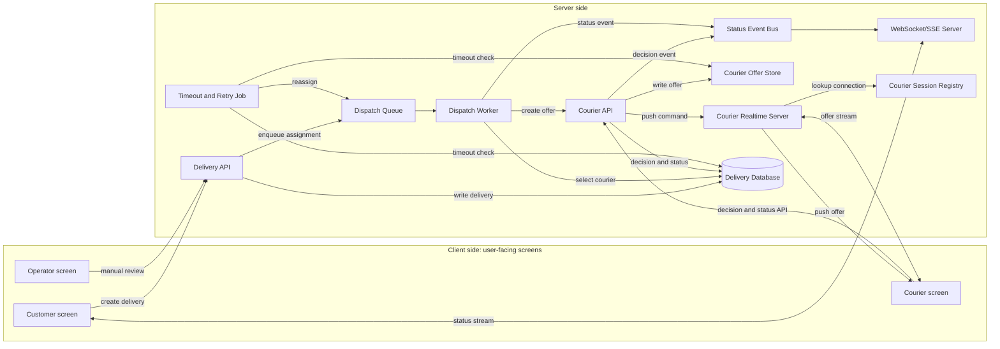
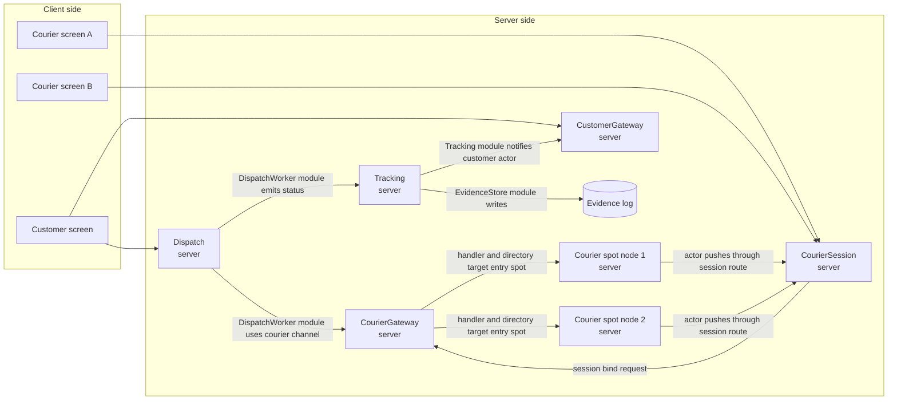
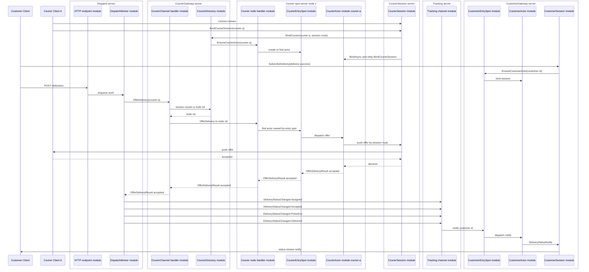
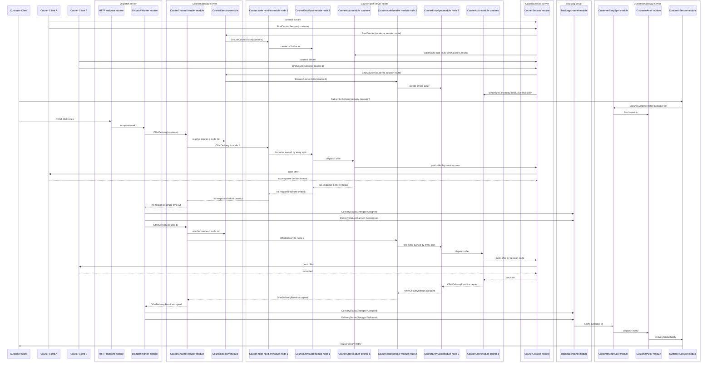

# DeliveryDispatch Sample Scenario

[샘플 목록](../README.ko.md)

> 이 문서는 모든 framework 언어가 공유하는 DeliveryDispatch 샘플 시나리오를 정의한다.
> 언어별 샘플은 이 문서를 기준으로 서버 역할, 메시지 흐름, message 계약,
> ZLink 요소, smoke 검증 기준을 맞춘다.

## 1. 목적

DeliveryDispatch는 배송 배차와 배송 상태 추적을 보여 주는 실시간 업무형 샘플이다.
고객 client는 HTTP로 배송을 만들고 WebSocket 또는 stream session으로 상태 변경을
기다린다. 내부 서버들은 ZLink channel, entry spot, actor, stream session을 사용해서
배차 요청, 배송원 제안, timeout 재배정, 고객별 상태 push를 처리한다.

이 샘플은 실제 배송 플랫폼을 그대로 구현하는 것을 목표로 하지 않는다. 실무에서 자주
만나는 "요청 생성, 수행자 선택, 특정 사용자 연결로 push, 응답 timeout 후 재시도" 같은
기능을 구현할 때 각 책임이 ZLink framework의 어떤 기능에 대응되는지 보여 주는 것이
목적이다. 따라서 배송 업무 규칙 자체보다 HTTP 경계, channel, entry spot, actor,
stream session binding이 하나의 업무 흐름 안에서 어떻게 연결되는지를 기준으로 읽어야
한다.

이 샘플의 직접 모델은 음식 배달, 퀵 배송, 택배 같은 배송 서비스다. 같은 구조는
택시 호출, 현장 출동, 방문 서비스처럼 "요청을 만들고 수행자를 배정한 뒤 상태를
실시간으로 고객에게 보여 주는" 도메인에도 적용할 수 있다.

샘플로 구현할 때 확인할 핵심은 아래와 같다.

- 고객 client는 배송 생성 HTTP API와 상태 수신 stream endpoint를 사용한다.
- Dispatch server는 외부 HTTP 요청을 내부 dispatch channel request로 바꾸고, 같은 server
  안의 worker가 배송원 선택, timeout, 재배정을 처리한다.
- CourierSession server는 배송원 client의 stream 연결을 받고, courier id와 session route를
  CourierGateway server에 bind 요청한다.
- CourierGateway server는 courier id를 어느 SpotNode의 actor에 둘지 정하고, courier id와
  actor node rid, session route를 함께 기억한다.
- Courier spot server node는 배송원 actor와 entry spot을 가지며, 배송 제안을 actor로
  전달한다.
- Tracking 서버는 배송 상태 event를 기록하고 고객 actor에 보낼 상태 알림을 만든다.
- CustomerGateway server는 고객 stream session과 customer actor를 bind하고 상태 알림을
  client에 push한다.
- client scenario는 성공 배차와 timeout 재배차를 모두 검증한다.

DeliveryDispatch는 CRUD API 샘플이 아니다. 중요한 상태가 여러 역할 사이를 바로 이동하고
고객 session까지 도달하는지를 보여 주는 샘플이다.

## 2. 왜 실시간성이 중요한가

배송 배차에서 메시지 지연은 단순한 화면 갱신 지연이 아니다. 가까운 배송원이 다른 일을
잡기 전에 제안을 보내야 하고, 배송원이 응답하지 않으면 빠르게 다음 배송원에게 넘겨야 한다.
고객도 배정, 픽업, 배송 완료 상태가 늦게 보이면 문제가 생겼다고 느낀다.

| 늦게 전달된 메시지 | 생기는 문제 |
|--------------------|-------------|
| 배송 제안 | 가까운 배송원이 다른 일을 잡아 배차 기회를 놓친다. |
| 수락 또는 timeout | 재배정이 늦어져 고객 대기 시간이 늘어난다. |
| 픽업 완료 | 고객과 운영자가 아직 준비 중이라고 오해한다. |
| 배송 완료 | 정산, 리뷰 요청, 다음 작업 배정이 늦어진다. |

샘플은 위 지점을 보여 주기 위해 `delivery-success`와 `delivery-reassign` 두 흐름을
반드시 포함한다.

## 3. 기존 웹 방식

배송 시스템을 일반적인 웹 방식으로 만들면 client side와 server side를 나누어 구성한다.
client side는 사용자가 직접 보는 화면이고, server side는 HTTP API, WebSocket/SSE 서버,
worker, 저장소처럼 client 요청을 받아 처리하는 서버 역할이다.



이 그림에서 courier 관련 구성은 배송원 화면에 offer를 push하기 위한 일반적인 웹
구조를 뜻한다. `Courier Session Registry`는 courier id와 현재 연결을 매핑하고,
`Courier Realtime Server`는 그 매핑을 사용해 특정 배송원 화면에 offer를 보낸다.
배송원 응답과 상태 변경은 다시 `Courier API`를 통해 저장소와 event 흐름으로 들어간다.

이 방식은 익숙하고 운영 도구가 많다. 다만 배차 결정, 배송원 응답, timeout 재시도,
고객 push가 서로 다른 계층에 흩어지면 한 배송의 흐름을 여러 로그와 저장소 상태로
따라가야 한다. 고객 WebSocket만 빠르게 만들어도 배차 worker가 수락 실패를 늦게 알거나
상태 이벤트가 WebSocket 서버까지 늦게 도달하면 실시간성 문제는 남는다.

## 4. ZLink 샘플의 대체 지점

ZLink는 고객의 HTTP 요청이나 WebSocket 연결을 없애지 않는다. 외부 경계는 그대로 웹 기술을
사용한다. 대신 내부 배차 메시징, 배송원별 offer push, 고객별 상태 push를 ZLink 역할
메시지로 구성한다.

| 기존 웹 시스템 구성 | ZLink 샘플의 대응 | 설명 |
|--------------------|------------------|------|
| Delivery API + dispatch worker | `Dispatch server` | 고객 HTTP 요청을 받고, 같은 server 안의 worker가 후보 배송원을 고른 뒤 단일 courier channel로 제안을 보낸다. |
| Courier API 또는 worker | `CourierGateway server` + `CourierSession server` + `Courier spot server node` | Gateway가 courier id를 actor 위치와 session route로 해석하고, spot server의 actor가 session route로 제안을 push한다. |
| Delivery event table | `Tracking server` + evidence store | 상태 이벤트를 기록하고 고객에게 보낼 알림을 만든다. |
| Session map 또는 socket registry | `CustomerActor` + bound session | 고객 actor와 현재 stream session을 연결해 특정 고객에게만 status를 push한다. |
| WebSocket/SSE server | `CustomerGateway server` | 고객 stream 연결을 받고, 고객 actor를 session과 bind한다. |
| Actor entry point | `CustomerEntrySpot`, `CourierEntrySpot` | actor가 들어오는 입구이며, server side에서 actor를 찾는 기준점이다. |
| Courier placement/directory | `CourierDirectory` | 배송원 id를 어느 SpotNode의 actor로 둘지 정하고, courier id, actor node rid, session route를 기억한다. |



위 그림은 server 배치와 server 사이의 의존성 방향만 보여준다. 각 server 안의 module 구성은
아래 표와 도메인 흐름에서 설명한다. 각 요청의 시간 순서와 응답 흐름은 아래 도메인 흐름에서
따로 설명한다.

`CourierSession server`는 배송원 client의 stream 연결을 받는 server다. `Courier spot
server node 1/2`는 실제 actor와 entry spot을 가진 node다. 두 역할은 한 프로세스에 함께
배치할 수도 있지만, 아키텍처 설명에서는 논리적으로 분리한다. 그래야 client 연결을 받는
책임과 actor placement, actor 메시지 진입점 책임이 섞이지 않는다.

## 5. 서버 구성

| 프로세스 | 구성 요소 | 책임 |
|----------|-----------|------|
| `DeliveryDispatch.Registry` | registry host | 서버 endpoint를 발견 가능하게 한다. |
| `DeliveryDispatch.Dispatch` | HTTP API, dispatch channel server/client, dispatch worker | `POST /deliveries`를 받고 배차 요청 접수, 배송원 제안, timeout, 재배정, 상태 event 생성을 맡는다. |
| `DeliveryDispatch.CourierGateway` | courier channel server, courier directory | courier id를 actor node rid와 session route로 해석한다. |
| `DeliveryDispatch.CourierSession` | stream server, courier session | 배송원 client stream 연결을 받고 courier id와 session route를 gateway에 bind 요청한다. |
| `DeliveryDispatch.CourierSpotNode1/2` | courier entry spot, courier actor | 선택된 node에서 배송원 actor를 만들고 actor 메시지 진입점을 제공한다. |
| `DeliveryDispatch.Tracking` | tracking channel server, evidence store | 상태 event 기록과 고객 알림 생성을 맡는다. |
| `DeliveryDispatch.CustomerGateway` | stream server, customer entry spot, customer actor | 고객 연결, customer actor/session bind, status push를 맡는다. |
| `DeliveryDispatch.Client` | HTTP client, stream connector | 배송 생성, subscription, status notify 검증을 수행한다. |

언어별 샘플은 프로세스 이름과 프로젝트 이름을 언어 관용에 맞게 바꿀 수 있다. 다만 위 역할
분리는 유지해야 한다. `Dispatch server`는 HTTP edge와 dispatch worker를 한 server에 둘 수
있지만, `CourierSession server`와 `Courier spot server node`는 논리 책임을 분리해서 설명해야
한다. 한 프로세스에 함께 배치하더라도 문서와 코드 책임은 client stream 연결, actor placement,
actor 실행 위치가 섞이지 않게 나눈다.

## 6. 사용하는 ZLink 요소

| 역할 | 사용하는 요소 |
|------|---------------|
| `Registry` | registry host와 discovery readiness 확인 |
| `Dispatch server` | HTTP endpoint, client-server channel server/client, background dispatch worker |
| `CourierGateway server` | client-server channel server, courier directory |
| `CourierSession server` | stream node, courier session callback |
| `Courier spot server node 1/2` | Spot mesh, courier entry spot, courier actor |
| `Tracking server` | client-server channel server, evidence store |
| `CustomerGateway server` | stream node, customer entry spot, customer actor |
| Client | HTTP client와 stream connector wait API |

역할 간 channel은 다음 이름을 기준으로 둔다.

| 이름 | Framework 요소 | 연결 |
|------|----------------|------|
| `deliverydispatch.courier` | client-server channel | `DispatchWorker module -> CourierChannel handler` |
| `deliverydispatch.tracking` | client-server channel | `CustomerSession/DispatchWorker module -> Tracking` |
| `delivery-customers` | Spot mesh | `CustomerEntrySpot`에서 customer actor 관리 |
| `delivery-couriers` | Spot mesh + route mesh | `CourierChannel handler -> target SpotNode rid -> CourierEntrySpot -> CourierActor` |

`delivery-couriers`는 배송원마다 하나씩 늘어나는 channel이 아니다. 모든 배송원 actor가
같은 mesh 안에 있고, `CourierDirectory`는 courier id가 어느 SpotNode의 actor에 있는지와
어떤 session route로 client에 push할지를 기억한다. `DispatchWorker module`은 courier id가
들어 있는 offer를 단일 courier channel에 보낼 뿐이고, actor 위치 조회와 target SpotNode
선택은 courier channel handler가 숨긴다. `CourierEntrySpot`은 SpotNode마다 하나인 actor
진입점이므로, handler는 조회한 SpotNode rid로 해당 node의 entry spot 쪽 actor를 찾는다.

## 7. Message 계약

공통 message 계약은 언어 중립 schema로 읽는다. 언어별 구현은 record, class, struct,
interface, type alias처럼 자기 언어에 맞는 표현으로 같은 필드와 의미를 구현한다.
이 표의 message 이름과 필드는 .NET 샘플을 다른 framework 언어 샘플로 포팅할 때 맞춰야
하는 공통 샘플 계약이다. 언어별 타입 표현과 파일 배치는 달라도 message 의미, 필드,
성공/timeout 흐름에서의 역할은 유지한다.

### 7.1 고객 HTTP와 stream

| Message | 방향 | 필드 | 의미 |
|---------|------|------|------|
| `CreateDeliveryRequest` | Client -> Dispatch server HTTP | `DeliveryId`, `CustomerId`, `PickupAddress`, `DropoffAddress` | 새 배송 생성을 요청한다. |
| `CreateDeliveryResponse` | Dispatch server HTTP -> Client | `DeliveryId`, `Status` | Dispatch server 접수 결과를 반환한다. |
| `SubscribeDelivery` | Client -> CustomerGateway stream | `DeliveryId` | 현재 stream session이 특정 delivery 상태를 받겠다고 요청한다. |
| `SubscribeDeliveryAccepted` | CustomerGateway stream -> Client | `DeliveryId` | subscription이 등록됐음을 알린다. |
| `DeliveryStatusNotify` | CustomerGateway stream -> Client | `DeliveryId`, `Status`, `CourierId`, `OccurredAt` | delivery 상태 변경을 push한다. |

### 7.2 Dispatch와 Courier

| Message | 방향 | 필드 | 의미 |
|---------|------|------|------|
| `AssignDelivery` | Dispatch server HTTP API module -> dispatch channel module | `DeliveryId`, `CustomerId`, `PickupAddress`, `DropoffAddress` | 배차 대상 배송을 내부 dispatch 흐름에 넣는다. |
| `BindCourierSession` | Courier client -> CourierSession server stream, CourierSession server -> CourierActor | `CourierId`, `Actor`, `SessionRoute` | client는 `CourierId`만 보내고, CourierSession server는 actor bind relay 때 actor 위치와 session route를 채워 actor node가 bound session을 알 수 있게 한다. |
| `BindCourier` | CourierSession server -> CourierGateway server | `CourierId`, `SessionRoute` | 배송원 stream session route를 courier id와 연결한다. |
| `CourierBound` | CourierGateway server -> CourierSession server | `CourierId`, `Actor`, `SessionRoute` | 배송원 actor 위치와 session route 연결이 끝났음을 알린다. |
| `EnsureCourierActor` | CourierGateway server -> target SpotNode | `CourierId` | 선택된 SpotNode의 `CourierEntrySpot` 아래에 배송원 actor가 존재하도록 만든다. |
| `CourierActorEnsured` | target SpotNode -> CourierGateway server | `CourierId`, `Actor` | 배송원 actor 위치를 반환한다. |
| `OfferDelivery` | DispatchWorker module -> CourierGateway server | `DeliveryId`, `CourierId`, `PickupAddress`, `DropoffAddress` | 특정 배송원에게 배송 제안을 보낸다. |
| `OfferDeliveryResult` | CourierGateway server -> DispatchWorker module | `DeliveryId`, `CourierId`, `Accepted` | 배송원이 제안을 수락했는지 반환한다. |

### 7.3 Tracking과 actor/session bind

| Message | 방향 | 필드 | 의미 |
|---------|------|------|------|
| `DeliveryStatusChanged` | DispatchWorker module -> Tracking server | `DeliveryId`, `Status`, `CourierId`, `OccurredAt` | 상태 event를 Tracking 서버에 기록한다. |
| `DeliveryStatusAck` | Tracking server -> DispatchWorker module | `DeliveryId`, `Status` | Tracking 서버가 상태 event를 처리했음을 반환한다. |
| `EnsureCustomerActor` | CustomerGateway server -> CustomerEntrySpot module | `CustomerId` | 고객 actor가 존재하도록 만든다. |
| `CustomerActorEnsured` | CustomerEntrySpot module -> CustomerGateway server | `CustomerId`, `ActorRef` | 고객 actor 참조를 반환한다. |

`Status` 값은 최소한 아래 값을 포함한다.

| 값 | 의미 |
|----|------|
| `Assigned` | 첫 배송원에게 제안이 전달됐다. |
| `Reassigned` | 이전 배송원이 timeout되어 다른 배송원에게 다시 제안됐다. |
| `Accepted` | 배송원이 제안을 수락했다. |
| `PickedUp` | 배송원이 물건을 픽업했다. |
| `Delivered` | 배송이 완료됐다. |

## 8. 도메인 흐름

### 8.1 성공 배차



### 8.2 Timeout 재배차



## 9. 구현 구조

DeliveryDispatch는 업무형 샘플이므로 domain 흐름과 framework adapter가 뒤섞이지 않게 한다.
언어별 문법과 build system은 달라도 아래 책임 분리를 기준으로 둔다.

```text
Server/Dispatch/
  Application/
    Dispatch/
      DispatchWorker
      DispatchWorkQueue
      CourierSelectionPolicy
  Infrastructure/
    Http/
      DeliveryEndpoint
    ZLink/
      Handlers/
        AssignDeliveryHandler
      Clients/
        CourierClient
        TrackingClient

Server/CourierGateway/
  Application/
    CourierDirectory
  Infrastructure/
    ZLink/
      Handlers/
        OfferDeliveryHandler

Server/CourierSession/
  Infrastructure/
    ZLink/
      Sessions/
        CourierSession
      Handlers/
        BindCourierSessionHandler

Server/CourierSpotNode/
  Infrastructure/
    ZLink/
      Actors/
        CourierActor
      Spots/
        CourierEntrySpot

Server/Tracking/
  Domain/
    DeliveryTracking/
      DeliveryStatusHistory
      DeliveryTrackingState
  Infrastructure/
    ZLink/
      Handlers/
        DeliveryStatusChangedHandler
      Stores/
        EvidenceStore

Server/CustomerGateway/
  Infrastructure/
    ZLink/
      Actors/
        CustomerActor
      Spots/
        CustomerEntrySpot
      Sessions/
        CustomerSession
      Handlers/
        SubscribeDeliveryHandler
      Stores/
        CustomerSessionDirectory
```

작은 언어별 샘플은 디렉토리를 더 단순하게 둘 수 있다. 그래도 아래 기준은 유지한다.

- Dispatch server는 HTTP 변환, dispatch channel, worker를 한 server 안에 둘 수 있다.
- DispatchWorker module은 배차 흐름과 timeout 재시도를 소유한다.
- CourierGateway server는 courier id를 actor node rid와 session route로 해석한다.
- CourierSession server는 배송원 stream 연결과 session route bind 요청만 맡는다.
- Courier spot server node는 actor 생성과 actor 메시지 진입점만 맡는다.
- Tracking은 상태 event 기록과 고객 알림 생성을 맡는다.
- CustomerGateway server는 고객 stream session, customer actor bind, client push를 맡는다.

## 10. Client self-check 기준

언어별 client scenario는 성공 로그만 출력하면 안 된다. request 응답과 push payload를
직접 검증해야 한다.

필수 검증은 아래와 같다.

- client가 stream endpoint에 연결한 뒤 `SubscribeDelivery`를 보내고
  `SubscribeDeliveryAccepted`의 `DeliveryId`를 확인한다.
- `delivery-success` 생성 응답이 같은 `DeliveryId`를 반환하는지 확인한다.
- `courier-a` actor는 node-1에, `courier-b` actor는 node-2에 bind됐고 두 actor가
  `CourierSession server`의 session route로 client에 offer를 push하는지 확인한다.
- `delivery-success`에 대해 `Assigned`, `Accepted`, `PickedUp`, `Delivered`가 순서대로
  도착하는지 확인한다.
- `delivery-reassign` 생성 응답이 같은 `DeliveryId`를 반환하는지 확인한다.
- `delivery-reassign`에 대해 `Assigned`, `Reassigned`, `Accepted`, `Delivered`가 순서대로
  도착하는지 확인한다.
- `delivery-reassign`의 `Accepted`와 `Delivered` 상태는 `courier-b`가 처리했음을 확인한다.
- server evidence check가 두 delivery의 상태 순서를 누락 없이 기록했는지 확인한다.

push message 대기는 stream connector의 public wait interface를 사용한다. notification
수집용 inbox나 로그 queue는 결과 출력과 추가 검증을 위해 둘 수 있지만, push 도착을 기다리는
기준 경로가 되어서는 안 된다.

## 11. Smoke 실행 기준

언어별 runner는 아래 순서를 따른다.

1. Registry를 시작한다.
2. Tracking 서버를 시작하고 tracking channel endpoint가 준비될 시간을 둔다.
3. CustomerGateway 서버를 시작한다.
4. CourierSession 서버를 시작한다.
5. Courier spot server node 1과 node 2를 시작한다.
6. CourierGateway 서버를 시작한다.
7. Dispatch 서버를 시작한다.
8. Client scenario가 배송원 A/B stream 연결, 성공 배차, timeout 재배차를 실행한다.
9. Evidence check가 상태 순서를 검증한다.

샘플 성공 로그는 아래 의미를 포함해야 한다.

```text
topology=ready
deliverydispatch-reassignment=completed
deliverydispatch-server-evidence=completed
deliverydispatch=completed
```
