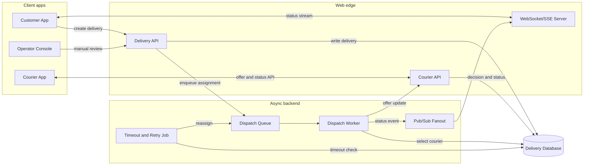
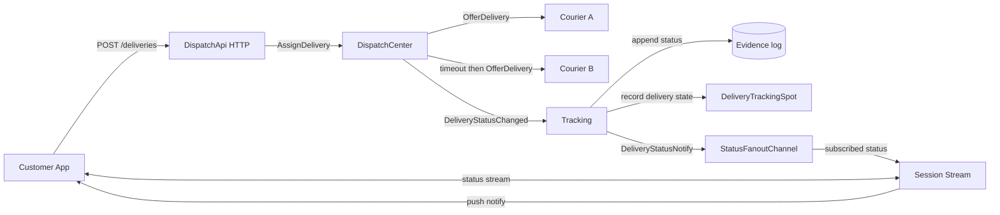
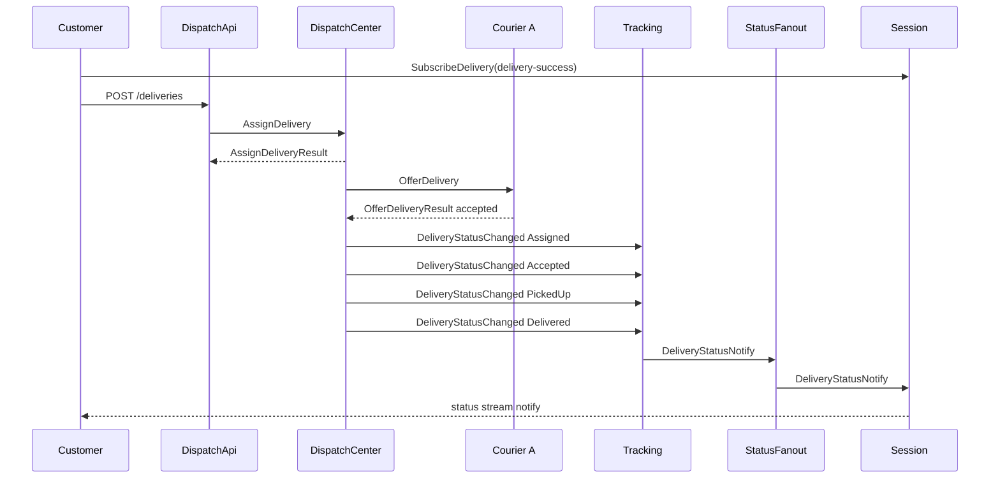
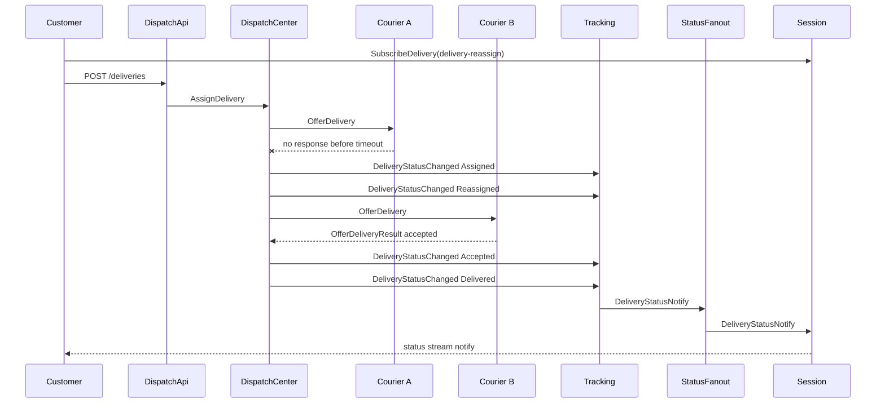

# DeliveryDispatch Sample Scenario

[샘플 목록](../README.ko.md)

> 이 문서는 모든 framework 언어가 공유하는 DeliveryDispatch 샘플 시나리오를 정의한다.
> 언어별 샘플은 이 문서를 기준으로 서버 역할, 메시지 흐름, message 계약,
> ZLink 요소, smoke 검증 기준을 맞춘다.

## 1. 목적

DeliveryDispatch는 배송 배차와 배송 상태 추적을 보여 주는 실시간 업무형 샘플이다.
고객 client는 HTTP로 배송을 만들고 WebSocket 또는 stream session으로 상태 변경을
기다린다. 내부 서버들은 ZLink channel, fanout, Spot, stream session을 사용해서
배차 요청, 배송원 제안, timeout 재배정, 상태 fanout을 처리한다.

이 샘플의 직접 모델은 음식 배달, 퀵 배송, 택배 같은 배송 서비스다. 같은 구조는
택시 호출, 현장 출동, 방문 서비스처럼 "요청을 만들고 수행자를 배정한 뒤 상태를
실시간으로 고객에게 보여 주는" 도메인에도 적용할 수 있다.

샘플로 구현할 때 확인할 핵심은 아래와 같다.

- 고객 client는 배송 생성 HTTP API와 상태 수신 stream endpoint를 사용한다.
- Dispatch API는 외부 HTTP 요청을 내부 ZLink channel request로 바꾼다.
- Dispatch Center는 배차 요청을 접수하고 배송원 선택, timeout, 재배정을 처리한다.
- Courier 서버는 배송 제안을 받고 수락하거나 의도적으로 응답하지 않아 timeout 흐름을 만든다.
- Tracking 서버는 배송 상태 event를 기록하고 고객에게 보낼 상태 알림을 fanout으로 publish한다.
- Session 서버는 고객 stream session과 delivery subscription을 유지하고 상태 알림을 client에 push한다.
- Delivery Tracking Spot은 고객 actor가 관심 delivery에 join한다는 도메인 구조를 보여 준다.
- client scenario는 성공 배차와 timeout 재배차를 모두 검증한다.

DeliveryDispatch는 CRUD API 샘플이 아니다. 중요한 상태가 여러 역할 사이를 바로 이동하고
고객 session까지 도달하는지를 보여 주는 샘플이다.

## 2. 왜 실시간성이 중요한가

배송 배차에서 메시지 지연은 단순한 화면 갱신 지연이 아니다. 가까운 배송원이 다른 일을
잡기 전에 제안을 보내야 하고, 배송원이 응답하지 않으면 빠르게 다음 배송원에게 넘겨야 한다.
고객도 배정, 픽업, 배송 완료 상태가 늦게 보이면 문제가 생겼다고 느낀다.

| 늦게 전달된 메시지 | 생기는 문제 |
|--------------------|-------------|
| 배송 제안 | 가까운 배송원이 다른 일을 잡아 배차 기회를 놓친다. |
| 수락 또는 timeout | 재배정이 늦어져 고객 대기 시간이 늘어난다. |
| 픽업 완료 | 고객과 운영자가 아직 준비 중이라고 오해한다. |
| 배송 완료 | 정산, 리뷰 요청, 다음 작업 배정이 늦어진다. |

샘플은 위 지점을 보여 주기 위해 `delivery-success`와 `delivery-reassign` 두 흐름을
반드시 포함한다.

## 3. 기존 웹 방식

배송 시스템을 일반적인 웹 방식으로 만들면 고객 앱, 배송원 앱, HTTP API, 데이터베이스,
배차 worker, WebSocket/SSE 서버, pub/sub fanout을 조합한다.



이 방식은 익숙하고 운영 도구가 많다. 다만 배차 결정, 배송원 응답, timeout 재시도,
고객 push가 서로 다른 계층에 흩어지면 한 배송의 흐름을 여러 로그와 저장소 상태로
따라가야 한다. 고객 WebSocket만 빠르게 만들어도 배차 worker가 수락 실패를 늦게 알거나
상태 이벤트가 fanout까지 늦게 도달하면 실시간성 문제는 남는다.

## 4. ZLink 샘플의 대체 지점

ZLink는 고객의 HTTP 요청이나 WebSocket 연결을 없애지 않는다. 외부 경계는 그대로 웹 기술을
사용한다. 대신 내부 배차 메시징, 상태 fanout, delivery별 상태 참여 구조를 ZLink 역할
메시지로 구성한다.

| 기존 웹 시스템 구성 | ZLink 샘플의 대응 | 설명 |
|--------------------|------------------|------|
| Delivery API | `DispatchApi` | 고객 HTTP 요청을 받고 `AssignDelivery`를 ZLink channel로 보낸다. |
| Dispatch queue + worker | `DispatchCenter` + dispatch worker | 요청을 접수한 뒤 worker가 배송원 선택, timeout, 재배정을 처리한다. |
| Courier API 또는 worker | `Courier` | 배송 제안을 받고 수락 또는 timeout을 만든다. |
| Delivery event table | `Tracking` + evidence store | 상태 이벤트를 기록하고 고객에게 보낼 알림을 만든다. |
| Pub/sub fanout | `StatusFanoutChannel` | Tracking에서 Session으로 `DeliveryStatusNotify`를 publish한다. |
| WebSocket/SSE server | `Session` | 고객 stream 연결과 delivery subscription을 유지하고 status를 push한다. |
| 상태별 delivery room | `DeliveryTrackingSpot` | 고객 actor가 관심 delivery에 join했다는 도메인 구조를 보여 준다. |



## 5. 서버 구성

| 프로세스 | 구성 요소 | 책임 |
|----------|-----------|------|
| `DeliveryDispatch.Registry` | registry host | 서버 endpoint를 발견 가능하게 한다. |
| `DeliveryDispatch.DispatchApi` | HTTP API, dispatch channel client | `POST /deliveries`를 받고 `AssignDelivery` 요청을 Dispatch Center로 보낸다. |
| `DeliveryDispatch.DispatchCenter` | dispatch channel server, courier channel client, tracking channel client | 배차 요청 접수, 배송원 제안, timeout, 재배정, 상태 event 생성을 맡는다. |
| `DeliveryDispatch.Courier` | courier channel server | 배송 제안을 받고 courier mode에 따라 수락하거나 timeout을 만든다. |
| `DeliveryDispatch.Tracking` | tracking channel server, fanout publisher, delivery Spot node | 상태 event 기록, Delivery Tracking Spot 생성, status fanout publish를 맡는다. |
| `DeliveryDispatch.Session` | stream server, fanout subscriber, session relay client | 고객 연결, delivery subscription, status push를 맡는다. |
| `DeliveryDispatch.Client` | HTTP client, stream connector | 배송 생성, subscription, status notify 검증을 수행한다. |
| `DeliveryDispatch.Probe` | readiness probe | registry topology와 Tracking channel active probe를 확인한다. |

언어별 샘플은 프로세스 이름과 프로젝트 이름을 언어 관용에 맞게 바꿀 수 있다. 다만 위 역할
분리는 유지해야 한다. 특히 Dispatch API가 배차 규칙을 직접 처리하거나 Session 서버가
배송원 선택을 처리하면 공통 시나리오 기준을 만족하지 못한다.

## 6. 사용하는 ZLink 요소

| 역할 | 사용하는 요소 |
|------|---------------|
| `Registry` | registry host와 discovery readiness 확인 |
| `DispatchApi` | HTTP endpoint, client-server channel client |
| `DispatchCenter` | client-server channel server/client, background dispatch worker |
| `Courier` | client-server channel server, `OfferDelivery` handler |
| `Tracking` | client-server channel server, fanout publisher, Spot mesh, customer actor factory |
| `Session` | stream node, session callback, fanout subscriber |
| Client | HTTP client와 stream connector wait API |

역할 간 channel은 다음 이름을 기준으로 둔다.

| 이름 | Framework 요소 | 연결 |
|------|----------------|------|
| `deliverydispatch.dispatch` | client-server channel | `DispatchApi -> DispatchCenter` |
| `deliverydispatch.courier.a` | client-server channel | `DispatchCenter -> Courier A` |
| `deliverydispatch.courier.b` | client-server channel | `DispatchCenter -> Courier B` |
| `deliverydispatch.tracking` | client-server channel | `Session/DispatchCenter -> Tracking` |
| `deliverydispatch.status` | fanout channel | `Tracking -> Session` |
| `delivery-spots` | Spot mesh | customer actor와 delivery Spot join |

## 7. Message 계약

공통 message 계약은 언어 중립 schema로 읽는다. 언어별 구현은 record, class, struct,
interface, type alias처럼 자기 언어에 맞는 표현으로 같은 필드와 의미를 구현한다.

### 7.1 고객 HTTP와 stream

| Message | 방향 | 필드 | 의미 |
|---------|------|------|------|
| `CreateDeliveryRequest` | Client -> Dispatch API HTTP | `DeliveryId`, `CustomerId`, `PickupAddress`, `DropoffAddress` | 새 배송 생성을 요청한다. |
| `CreateDeliveryResponse` | Dispatch API HTTP -> Client | `DeliveryId`, `Status` | Dispatch Center 접수 결과를 반환한다. |
| `SubscribeDelivery` | Client -> Session stream | `DeliveryId` | 현재 stream session이 특정 delivery 상태를 받겠다고 요청한다. |
| `SubscribeDeliveryAccepted` | Session stream -> Client | `DeliveryId` | subscription이 등록됐음을 알린다. |
| `DeliveryStatusNotify` | Session stream -> Client | `DeliveryId`, `Status`, `CourierId`, `OccurredAt` | delivery 상태 변경을 push한다. |

### 7.2 Dispatch와 Courier

| Message | 방향 | 필드 | 의미 |
|---------|------|------|------|
| `AssignDelivery` | Dispatch API -> Dispatch Center | `DeliveryId`, `CustomerId`, `PickupAddress`, `DropoffAddress` | 배차 대상 배송을 내부 dispatch 흐름에 넣는다. |
| `AssignDeliveryResult` | Dispatch Center -> Dispatch API | `DeliveryId`, `Accepted` | Dispatch Center가 요청을 접수했는지 반환한다. |
| `OfferDelivery` | Dispatch Center -> Courier | `DeliveryId`, `CourierId`, `PickupAddress`, `DropoffAddress` | 특정 배송원에게 배송 제안을 보낸다. |
| `OfferDeliveryResult` | Courier -> Dispatch Center | `DeliveryId`, `CourierId`, `Accepted` | 배송원이 제안을 수락했는지 반환한다. |

### 7.3 Tracking과 Spot

| Message | 방향 | 필드 | 의미 |
|---------|------|------|------|
| `DeliveryStatusChanged` | Dispatch Center -> Tracking | `DeliveryId`, `Status`, `CourierId`, `OccurredAt` | 상태 event를 Tracking 서버에 기록한다. |
| `DeliveryStatusAck` | Tracking -> Dispatch Center | `DeliveryId`, `Status` | Tracking 서버가 상태 event를 처리했음을 반환한다. |
| `EnsureCustomerActor` | Session -> Tracking | `CustomerId` | 고객 actor가 존재하도록 만든다. |
| `CustomerActorEnsured` | Tracking -> Session | `CustomerId`, `ActorRef` | 고객 actor 참조를 반환한다. |
| `SubscribeCustomerToDelivery` | Session -> Tracking | `CustomerId`, `DeliveryId` | 고객 actor를 delivery Spot에 join시킨다. |
| `CustomerDeliverySubscribed` | Tracking -> Session | `CustomerId`, `DeliveryId` | actor join 기반 subscription이 끝났음을 알린다. |
| `DeliverySpotCreate` | Tracking 내부 | `DeliveryId` | delivery Spot 생성 payload다. |
| `DeliverySpotCreated` | Tracking 내부 | `DeliveryId` | delivery Spot 생성 결과다. |
| `DeliverySpotJoin` | Tracking 내부 | `DeliveryId`, `CustomerId` | 고객 actor가 특정 delivery Spot에 join한다. |
| `DeliverySpotJoined` | Tracking 내부 | `DeliveryId`, `CustomerId` | delivery Spot join 결과다. |

`Status` 값은 최소한 아래 값을 포함한다.

| 값 | 의미 |
|----|------|
| `Assigned` | 첫 배송원에게 제안이 전달됐다. |
| `Reassigned` | 이전 배송원이 timeout되어 다른 배송원에게 다시 제안됐다. |
| `Accepted` | 배송원이 제안을 수락했다. |
| `PickedUp` | 배송원이 물건을 픽업했다. |
| `Delivered` | 배송이 완료됐다. |

## 8. 도메인 흐름

### 8.1 성공 배차



### 8.2 Timeout 재배차



## 9. 구현 구조

DeliveryDispatch는 업무형 샘플이므로 domain 흐름과 framework adapter가 뒤섞이지 않게 한다.
언어별 문법과 build system은 달라도 아래 책임 분리를 기준으로 둔다.

```text
Server/DispatchCenter/
  Application/
    Dispatch/
      DispatchWorker
      DispatchWorkQueue
      CourierSelectionPolicy
  Infrastructure/
    ZLink/
      Handlers/
        AssignDeliveryHandler
      Clients/
        CourierClient
        TrackingClient

Server/Tracking/
  Domain/
    DeliveryTracking/
      DeliveryStatusHistory
      DeliveryTrackingState
  Infrastructure/
    ZLink/
      Actors/
        CustomerActor
        CustomerActorFactory
      Spots/
        CustomerEntrySpot
        DeliveryTrackingSpot
      Handlers/
        EnsureCustomerActorHandler
        SubscribeCustomerToDeliveryHandler
        DeliveryStatusChangedHandler
      Notifications/
        DeliveryStatusPublisher

Server/Session/
  Infrastructure/
    ZLink/
      Sessions/
        CustomerSession
      Handlers/
        SubscribeDeliveryHandler
        DeliveryStatusFanoutHandler
      Stores/
        CustomerSessionDirectory
```

작은 언어별 샘플은 디렉토리를 더 단순하게 둘 수 있다. 그래도 아래 기준은 유지한다.

- Dispatch API는 HTTP 변환과 ZLink 요청 전송만 맡는다.
- Dispatch Center는 배차 흐름과 timeout 재시도를 소유한다.
- Courier handler는 제안을 수락하거나 timeout을 만드는 역할만 맡는다.
- Tracking은 상태 event 기록과 status fanout publish를 맡는다.
- Session은 stream session, subscription, client push를 맡는다.
- Delivery Tracking Spot은 delivery별 관심 고객 actor join 구조를 보여 준다.

## 10. Client self-check 기준

언어별 client scenario는 성공 로그만 출력하면 안 된다. request 응답과 push payload를
직접 검증해야 한다.

필수 검증은 아래와 같다.

- client가 stream endpoint에 연결한 뒤 `SubscribeDelivery`를 보내고
  `SubscribeDeliveryAccepted`의 `DeliveryId`를 확인한다.
- `delivery-success` 생성 응답이 같은 `DeliveryId`를 반환하는지 확인한다.
- `delivery-success`에 대해 `Assigned`, `Accepted`, `PickedUp`, `Delivered`가 순서대로
  도착하는지 확인한다.
- `delivery-reassign` 생성 응답이 같은 `DeliveryId`를 반환하는지 확인한다.
- `delivery-reassign`에 대해 `Assigned`, `Reassigned`, `Accepted`, `Delivered`가 순서대로
  도착하는지 확인한다.
- `delivery-reassign`의 `Accepted`와 `Delivered` 상태는 `courier-b`가 처리했음을 확인한다.
- server evidence check가 두 delivery의 상태 순서를 누락 없이 기록했는지 확인한다.

push message 대기는 stream connector의 public wait interface를 사용한다. notification
수집용 inbox나 로그 queue는 결과 출력과 추가 검증을 위해 둘 수 있지만, push 도착을 기다리는
기준 경로가 되어서는 안 된다.

## 11. Smoke 실행 기준

언어별 runner는 아래 순서를 따른다.

1. Registry를 시작한다.
2. Tracking 서버를 시작하고 tracking channel과 status fanout endpoint가 준비됐는지 확인한다.
3. Session 서버를 시작한다.
4. Courier A를 timeout mode로 시작한다.
5. Courier B를 accept mode로 시작한다.
6. Dispatch Center를 시작한다.
7. Dispatch API를 시작한다.
8. Probe가 registry topology와 Tracking active probe를 확인한다.
9. Client scenario가 성공 배차와 timeout 재배차를 실행한다.
10. Evidence check가 상태 순서를 검증한다.

샘플 성공 로그는 아래 의미를 포함해야 한다.

```text
topology=ready
deliverydispatch-reassignment=completed
deliverydispatch-server-evidence=completed
deliverydispatch=completed
```
