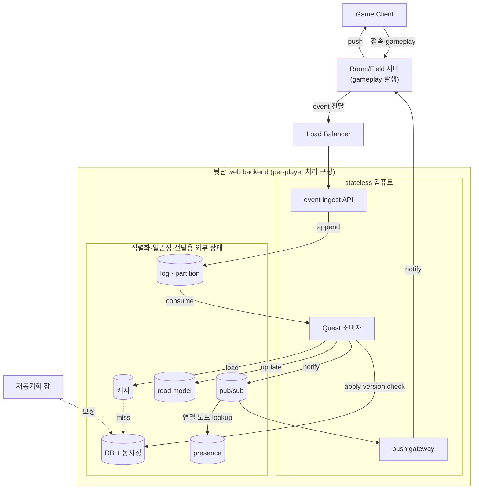
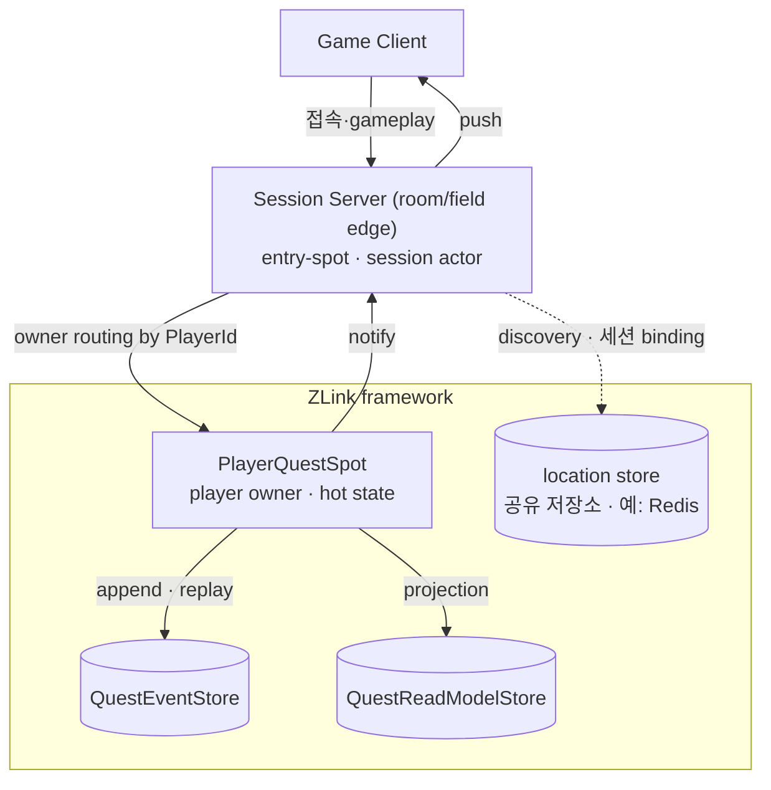
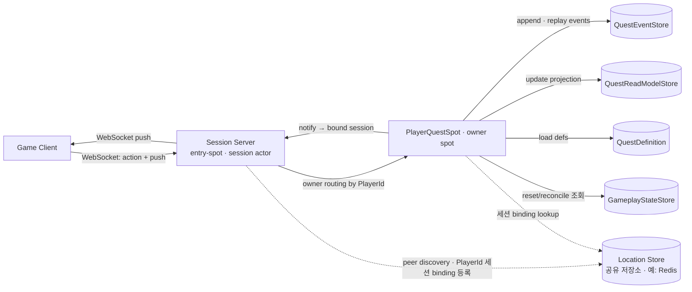
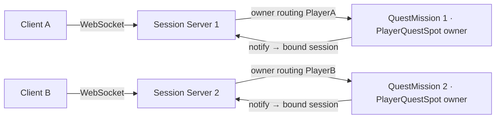
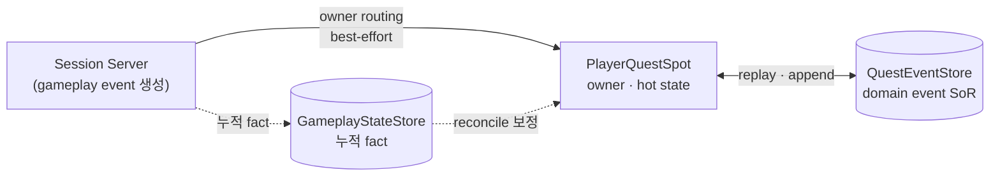
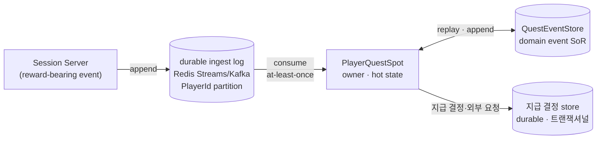
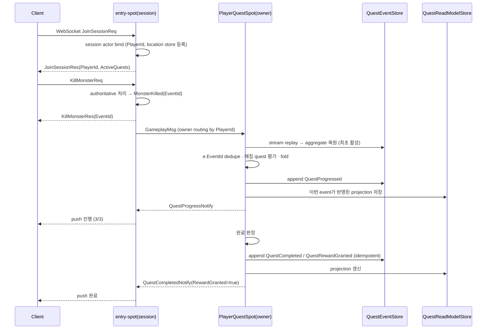

# GameQuest Sample Scenario

[Event 샘플 목록](README.ko.md)

> GameQuest는 player별 owner spot으로 gameplay event를 모아 quest 진행과 완료를
> 판정하는 ZLink framework 샘플이다.

## 1. 목적과 의도

GameQuest는 **게임에서 발생하는 per-player gameplay event로 mission/quest 진행과 완료를
server-authoritative하게 판정하는 시스템**을 ZLink의 owner-actor(spot) 모델로 구성하는 샘플이다.
client 연결은 `Session Server`가 맡고, player별 quest 판정은 `PlayerQuestSpot`이 맡는다.

이 샘플이 보여 주는 핵심 흐름은 아래와 같다.

- client는 하나의 WebSocket으로 session bind, gameplay action, progress push를 주고받는다.
- `Session Server`는 gameplay action을 검증하고 gameplay event를 만든다.
- `PlayerQuestSpot`은 `PlayerId` 기준 owner로 event를 직렬 처리하고 quest domain event를 append한다.
- `QuestReadModelStore`는 client 조회와 push에 쓰는 projection을 보관한다.
- `GameplayStateStore`는 누락 보정과 reset/reconcile의 원천이 되는 gameplay fact를 보관한다.

판정을 어디서 하느냐가 설계를 가른다. 싱글/신뢰된 co-op이면 client가 진행을 계산하고 서버는
결과만 저장해도 된다. 하지만 MMORPG처럼 client가 적대적 입력이고 world/경제가 공유되면 서버가
authoritative해야 한다.

- **신뢰(anti-cheat)**: "quest 깼으니 보상 달라"를 client가 말하게 두면 조작된다.
- **공유 world**: kill·world event·party 기여가 여러 곳에서 발생한다.
- **경제/중복 방지**: reward 중복 지급은 경제를 무너뜨린다.
- **진행 보존**: 진행이 꼬이면 게임이 막힐 수 있다.

다만 게임 도메인은 진행이 꼬여도 **force-reset/재동기화**라는 안전밸브가 있어, 금융처럼 절대
무손실일 필요는 없다. 이 샘플은 진행 tier를 best-effort owner messaging과 reset/reconcile로
다루고, 실제 재화 지급처럼 무손실이 필요한 tier는 production 확장으로 분리한다.

옆 [ShoppingMall](shoppingmall.ko.md)이 command-driven 순수 event sourcing을 담당한다면,
GameQuest는 **player owner spot이 대량 gameplay event를 어떻게 직렬 처리하고 projection으로
연결 push까지 이어 주는가**를 담당한다.

## 2. 요구사항

### 2.1 기능 요구사항

- 대량 per-player gameplay event(kill/collect/enter/mission/feature)를 서버가 수신·처리한다.
- 각 event가 어떤 quest 조건에 걸리는지 판정한다(카운터/임계값, 다중·순서 조건).
- **진행 상황(예: 3/10)을 client에 실시간으로 보여 준다.** reconnect 후에도 조회로 복원한다.
- 완료를 판정하고 reward 결정을 **idempotent하게** 기록한다.
- 완료/진행을 client WebSocket으로 push한다.

### 2.2 비기능 요구사항

| 축 | 요구 | 수단 |
|------|------|------|
| 확장성 | player 수·event rate에 수평 확장, 단일 병목 없음 | `PlayerId`별 owner spot을 노드에 분산(MeshNode) |
| 순서·일관성 | 같은 player event를 순서대로, 충돌 없이 | player당 single owner(직렬 처리) |
| 게임 수준 견고성 | 진행을 잃지 않되 절대 무손실은 아님 | `QuestEventStore`로 복원되는 owner state + reset/reconcile 보정 |
| server-authoritative | client 신뢰하지 않음 | 판정·reward 결정 전부 서버 owner spot에서 |
| reward idempotency | 중복 결정 0 | `EventId` dedupe + quest domain event 중복 방지 |
| 저지연 push | 진행을 실시간처럼 표시 | owner spot → bound session 직접 push |

## 3. 비교 배경: stateless web backend 구성

싱글 게임이라면 client가 quest 진행을 계산하고 서버는 결과만 저장해도 된다 — 공유도 경쟁도
없으니 그걸로 충분하고, 이 샘플의 비교 대상이 아니다.

MMORPG는 다르다. kill·item·area 같은 gameplay event는 **room/field 서버**에서 발생하는데, quest
판정을 room/field에서 직접 하기는 어렵다. player가 room을 넘나들고 room은 수명이 짧아서, 같은
player의 이벤트를 한 곳에 모아 순서대로 처리하려면 복잡도가 크게 올라간다. 그래서 전통적으로는
room/field가 이벤트를 **LB 뒤의 뒷단 web API로 넘기고**, 그 API가 처리를 위해 log에 append한다.
아래 구성은 같은 문제를 stateless web backend로 처리할 때 필요한 대표 조각을 보여 준다.



이 구성에서는 `PlayerId` 파티션 log가 순서와 소비자 분배를 담당한다. 소비자가 stateless이면
quest state가 DB에 있으므로 매 event마다 load-modify-store가 필요하고, at-least-once 재전달,
consumer rebalance, 재동기화 잡 같은 중복 입력을 고려해 version check나 dedupe 정책이 필요하다.
client push를 위해서는 read model, pub/sub, presence store도 연결해야 한다.

stateful stream processor(Kafka Streams/Flink 등)를 쓰면 state store를 소비자 곁에 둘 수 있다.
그 경우 DB 왕복과 cache 부담은 줄지만, partition 설계, rebalance, state store 복구·재배치,
push routing은 별도 운영 책임으로 남는다. GameQuest는 이 책임 중 player별 직렬 처리와 hot state
소유를 ZLink owner spot으로 표현한다.

## 4. ZLink 샘플 구조

ZLink 구성에서도 quest 처리는 room/field 밖의 player owner로 모은다. `Session Server`는 client
WebSocket을 종단하고 entry-spot/session actor를 만든다. session actor는 gameplay action을 검증한
뒤 gameplay event를 만들고, 그 event를 `PlayerId` 기준 `PlayerQuestSpot`으로 owner routing한다.
`PlayerQuestSpot`은 같은 player의 event를 직렬로 처리하면서 hot state, event append, projection
update, notify 발행을 한 owner 흐름에 모은다.

이 샘플은 room/field 시뮬레이션 티어를 따로 두지 않고 그 edge 역할을 `Session Server`의 gameplay
module로 축약한다. 실제 MMORPG라면 room/field 서버를 그대로 두고 그 서버가 gameplay event를 owner
routing으로 직접 메시징할 수 있다.



`Session Server`는 client WebSocket을 종단하고, 연결마다 **session actor를 만들어 entry-spot에
할당하고 `PlayerId`에 bind**한다. client 메시징은 session actor로 전달되고, session actor가
authoritative gameplay 처리 후 gameplay event를 만들어 **그 player에 할당된 `PlayerQuestSpot`으로
owner routing으로 메시징**한다. 그 spot이 조건 평가·상태 기록·notify를 전부 소유한다. notify는
bound session을 통해 연결을 소유한 `Session Server`로 전달된다.

GameQuest는 `QuestEventStore`, `QuestReadModelStore`, `GameplayStateStore`, `Location Store`를
명시적인 dependency로 둔다. framework와 owner spot이 맡는 것은 player별 직렬 실행, hot state 소유,
session binding lifecycle, bound session notify routing이다.

| 기존 구성요소 | 역할 | GameQuest에서의 대응 |
|------|------|------|
| Kafka/Redis Streams 로그 | 순서·소비자 분배 | 기본 진행 tier에서는 owner routing과 owner spot 직렬 실행을 사용한다. durable ingest가 필요한 tier는 §9 확장으로 둔다. |
| 이벤트마다 DB load-modify-store | 상태 조회와 갱신 | hot state는 owner spot 메모리에 두고, `QuestEventStore`는 append/replay 경계로 사용한다. |
| optimistic version / 분산 lock | 중복 입력과 경쟁 writer 방지 | 같은 player는 single owner에서 처리하고, `EventId` dedupe로 재전달을 막는다. |
| Redis cache | 반복 DB 읽기 회피 | owner spot이 player별 hot state를 가진다. |
| pub/sub + presence store | 연결 노드로 notify 전달 | location store session binding과 bound session notify를 사용한다. |

## 5. 운영 특성

GameQuest는 진행 tier와 reward/economy tier를 분리해서 설명한다. 기본 샘플은 quest 진행처럼 유실 후
보정 가능한 경로를 대상으로 한다. 실제 재화 지급처럼 무손실이 필요한 경로는 durable log나 outbox를
추가하는 production 확장으로 둔다.

GameQuest는 유실을 허용하는 대신 실시간성을 얻는 도메인이라 [ShoppingMall](shoppingmall.ko.md)과
반대 지점에 선다. 아래 특성을 ShoppingMall의 무손실 주문 처리와 나란히 보면 두 샘플의 역할
분담이 분명해진다(대비 표는 [ShoppingMall §5](shoppingmall.ko.md)에도 대칭으로 실려 있다).

| 축 | GameQuest (진행 tier) | ShoppingMall (무손실 주문 처리, 참고) |
|------|------|------|
| 전달 | gameplay event 전달은 best-effort다. 유실은 `GameplayStateStore` snapshot 기반 reconcile로 보정한다. | 명령을 owner에 유실 없이 기록(유실 불가) |
| 동시성 | owner 하나(차단 불필요, 유실 허용) | owner 하나 + 기대 버전으로 이전 owner 차단 |
| 이벤트당 비용 | owner spot 메모리 상태에 적용하고 domain event를 append한다. | 상태 = 이벤트 접기. 기록이 곧 상태 전이 |
| 노드 장애 | 다음 owner messaging 또는 reconcile에서 owner spot을 다시 활성화하고 `QuestEventStore` replay로 복원한다. 복구 전까지 짧은 공백이 있을 수 있다. | 다른 노드가 이어받아(re-home) 다시 재생으로 복원, 기대 버전이 두 owner가 겹치는 순간을 차단 |
| 멈춘 작업 | 유실은 reset/reconcile로 흡수 | 명시적 재개 명령으로 잇는다 — 재고가 묶이므로 필수 |
| 조회 | 실시간 전송(push). session binding이 없으면 상태만 기록하고 reconnect 후 조회로 복원한다. | 조회 모델 폴링(`GetOrderStateReq`) |

두 샘플 다 owner 하나로 순서를 잡지만, 여러 owner를 가로지르는 집계는 표에 없다 — GameQuest는
owner spot이 파생 event를 방출해 별도 aggregator가 cross-player 집계를 하고(13절), ShoppingMall은
같은 방식을 §14에서 다룬다. 두 경로 다 개별 owner의 처리 루프 밖에서 일어나는 확장이다.

핵심은 이렇다. **진행 tier는 유실돼도 reset/reconcile로 흡수할 수 있으므로, owner spot 하나로
순서만 잡으면 충분하고 기대 버전 차단이나 명시적 재개 같은 무손실 장치는 필요 없다.** 주문
처리처럼 무손실이 필요한 도메인은 해당 장치를 추가해야 하며, 구체적인 이유는
[ShoppingMall §5](shoppingmall.ko.md)에서 다룬다.

## 6. 서버 구성



`Session Server`가 client WebSocket을 종단한다. 연결마다 **session actor를 만들어 entry-spot에
할당하고 `PlayerId`에 bind**한다. client 메시징은 이 session actor로 전달되고, session actor는
authoritative gameplay 처리 후 gameplay event를 만들어 **그 player에 할당된 `PlayerQuestSpot`
(owner spot)으로 owner routing**한다. owner spot이 아직 없으면 첫 메시징에서 활성(생성)된다.
`PlayerQuestSpot`은 조건 평가·상태 기록·notify를 소유하며, notify는 bound session을 통해 연결을
소유한 session actor로 전달된다. session binding(`PlayerId` ↔ 연결 노드) 등록·조회는 framework의
location store 계약(route location)을 쓴다 — 공유 저장소 구현체(예: Redis)만 꽂으면 등록·조회·
lifecycle은 framework가 처리한다.

owner spot은 연결(session actor)과 분리돼 있어 어느 `Session Server`에 붙든 같은 `PlayerId`는
항상 같은 owner spot으로 간다. owner spot의 호스팅은 MeshNode에 맡기며 연결 노드와 같은 노드일
필요가 없다. 샘플은 session actor를 호스팅하는 `GameApi` 2개와 `PlayerQuestSpot`을 호스팅하는
`QuestMission` 2개를 분리한다. 두 역할 모두 공유 location store로 자동 연결되며, 고정된 상대
endpoint를 직접 연결하지 않는다.

| 구성 | 책임 |
|------|------|
| `Location Store` | framework location store 계약의 공유 저장소 구현체(예: Redis). peer discovery(자동 연결)와 `PlayerId` 세션 binding row를 담으며, 등록·조회·lifecycle 정책은 framework가 소유. |
| `Session Server` | WebSocket 종단, session actor 생성·entry-spot 할당·bind, authoritative gameplay 처리(event 생성), owner spot으로 메시징, notify push. |
| `PlayerQuestSpot` (owner spot) | player당 owner. event 적용, 조건 평가, 완료/보상 결정, 상태 기록. MeshNode에 호스팅. |

| 저장소 | 성격 | 책임 |
|------|------|------|
| `QuestEventStore` | SoR (event stream) | `(PlayerId, QuestId)`별 append-only quest domain event stream. owner spot의 replay·append 원천. |
| `QuestReadModelStore` | projection | 진행 표시·조회용. event stream replay로 재생성 가능. |
| `GameplayStateStore` | authoritative facts | kill/inventory/mission 누적 fact. `Session Server` gameplay module이 action 처리 시 기록한다(fact 기록은 웹 방식에도 동일하게 있는 비용). reset/reconcile 보정 원천. |
| `QuestDefinition` | config | quest 조건. trigger event type으로 인덱싱. |

샘플 실행은 `Session Server` 2개와 owner tier 2개를 시작해 session scale-out과 player owner
분산을 함께 본다. 저장소는 공유 dependency로 둔다.



`PlayerA`가 `Session Server 2`로 재접속해도 `PlayerQuestSpot A`는 그대로이며, owner routing이
`Session Server 2`에서 그 owner spot으로 이어 준다.

scale-out 검증:

- 어느 노드가 연결·action을 받아도 같은 `PlayerId`는 항상 같은 `PlayerQuestSpot` owner로 간다.
- 서로 다른 player는 다른 노드 owner에서 동시에 처리된다.
- notify는 현재 그 player의 연결을 가진 노드로 route된다.
- owner tier에 node를 추가해도 기존 player owner는 자동으로 이동하지 않는다. 새 player는 공개 배치
  입력과 정책에 따라 새 node owner를 사용할 수 있다.

샘플 self-check의 복구 시나리오는 owner를 비활성화한 뒤 같은 논리 owner를 다시 만들고
`QuestEventStore` replay로 aggregate를 복원한다. process kill/restart, replacement, failover는 정상
사용법을 보여 주는 샘플이 아니라 공통 E2E Config 2·5의 수명 시나리오에서 검증한다.

## 7. 책임 분리

| 구분 | 담당 | 책임 |
|------|------|------|
| 연결·세션 | entry-spot | WebSocket 종단, session bind, push 전달. |
| authoritative gameplay | Session Server gameplay module | action 검증, gameplay event 생성, `GameplayStateStore` 누적 fact 기록. |
| player 소유·판정 | `PlayerQuestSpot` (owner) | event 직렬 적용, 조건 평가, domain event append, aggregate 복원. |
| event stream (SoR) | `QuestEventStore` | quest domain event append-only 저장, replay 원천. |
| 진행 표시 | `PlayerQuestSpot` + `QuestReadModelStore` | 실시간 push와 projection 조회 응답. |
| 보정 | `GameplayStateStore` | reset/reconcile 시 누적 fact 재계산. |
| client push | entry-spot WebSocket | 진행/완료 notify 전달. |

`PlayerQuestSpot`이 한 player의 quest/mission 처리를 **전부 소유**한다. per-player achievement나
그 player의 analytics도 같은 spot 안에서 처리할 수 있다. spot이 혼자 할 수 없는 것은 여러
player를 가로지르는 집계뿐이다(13절).

## 8. Routing·소유권·세션

| 대상 | 기준 | 규칙 |
|------|------|------|
| session 연결 | connection | 어느 노드가 받아도 되며 entry-spot으로 `PlayerId`에 bind. |
| gameplay 처리 | connection | action 받은 노드가 authoritative하게 처리. |
| owner 메시징 | `PlayerId` | gameplay event를 owner routing으로 `PlayerQuestSpot`에 전달. |
| quest 판정·기록 | `PlayerId`, `QuestId` | `PlayerQuestSpot`만 상태·결정을 기록하며 idempotent. |
| notify | `PlayerId` | 현재 session binding을 가진 노드의 entry-spot으로 route. binding 없으면 생략. |

client가 하나의 WebSocket으로 연결하면 entry-spot이 세션 actor를 만들고 `PlayerId`↔connection↔
노드 binding을 location store에 등록한다(등록·갱신은 framework lifecycle이 수행). action은 같은
연결로 들어와 entry-spot을 거쳐
owner Spot으로 라우팅되고, notify는 binding을 통해 실제 연결을 소유한 노드로 전달된다. reconnect가
다른 노드에 다시 연결하면 binding이 갱신되고 이후 notify는 새 노드로 간다. binding이 없는 동안의
notify는 drop해도 되며, client는 재접속 후 `GetQuestProgressReq` 조회로 보정한다.

owner spot은 API 처리 순서에 기대지 않는다. 같은 player의 서로 다른 action이 다른 노드에서
처리돼도, owner routing으로 한 owner에 모여 도착 순서대로 직렬 처리된다. 도착 순서는 발생
순서와 다를 수 있다(예: reconnect 직후 두 노드에서 겹친 action). 카운터형 조건에는 영향이
없고, 순서 조건은 단일 연결 안의 순서에 기대하되, 어긋난 경우는 `OccurredAtUnixMs`와 reconcile
보정으로 흡수한다. 이 동작은 §5의 진행 tier 운영 특성에 포함된다.

## 9. 이벤트 소싱 (owner spot = event-sourced aggregate)

owner spot이 상태를 어떻게 처리·보존하는지가 이 샘플의 핵심이다. `PlayerQuestSpot`은 현재
상태를 그대로 저장하지 않고, **domain event를 append하고 replay로 복원하는 event-sourced
aggregate**다. 즉 event sourcing이 별도 서비스나 외부 log가 아니라 **owner spot 안에서** 일어난다.

domain spot의 처리 루프 — gameplay event 한 건이 도착하면:

```text
on GameplayMsg e:
  1. (최초 활성) QuestEventStore에서 이 player의 quest event stream을 replay
        → in-memory aggregate 복원  (snapshot이 있으면 snapshot + 꼬리만)
  2. e.EventId가 이미 반영됐으면 무시                       # idempotency
  3. QuestDefinition 인덱스로 e에 걸리는 quest만 선별         # 이벤트당 O(매칭)
  4. 각 매칭 quest에서 domain(QuestPolicy)이 결정 event 생성:
        진행     → QuestProgressed
        임계 도달 → QuestCompleted
        미지급    → QuestRewardGranted
  5. 생성한 domain event를 QuestEventStore에 append          # append-only = SoR
  6. 같은 event를 in-memory aggregate에 fold                  # 상태 = 이벤트의 fold
  7. QuestReadModelStore projection 갱신                      # 표시·조회용
  8. 변경된 진행과 완료 notify → bound session
```

핵심은 **상태 = 이벤트의 fold**라는 것이다. 진행·완료·보상 여부의 기준은 `QuestEventStore`의
event stream이고, `QuestReadModelStore`는 언제든 replay로 다시 만들 수 있는 projection이다.
`PlayerQuestSpot`이 owner이므로 append는 직렬화되고, 웹 방식의 optimistic version이나 분산 락이
필요 없다.

- **replay·snapshot**: 활성화 시 stream을 replay해 aggregate를 복원한다. stream이 길면 주기적
snapshot을 두어 `snapshot + 꼬리`만 replay한다. 노드가 비정상 종료되면 owner lease 만료 후 다음 owner
  routing 메시징(또는 reconcile)이 다른 노드에서 spot을 재활성(re-home)해 같은 방식으로
  복원한다. 운영자 개입은 필요 없지만 복구 전까지 짧은 공백이 있을 수 있다(§5의 "노드 장애").
- **idempotency**: 적용한 source `EventId`를 stream에 함께 기록해, 재전달·재시도를 중복 반영하지
  않는다. 같은 `IdempotencyKey`의 action은 같은 gameplay `EventId`를 낳는다.
- **reward idempotency**: 샘플 기본 경로에서는 `QuestCompleted`/`QuestRewardGranted`가 stream에 이미
  있으면 같은 quest에 다시 append하지 않는다. 이것은 중복 **결정**을 막는 기준이다. 실제 재화 지급처럼
  절대 중복이 없어야 하는 경로는 아래 production 확장의 durable tier로 올린다.
- **lossy 전달 + 보정**: owner로의 gameplay event 전달은 best-effort다(외부 durable log 없음).
  유실되면 `GameplayStateStore`의 누적 fact로 진행을 재계산해 `QuestReconciled` event를 append하고
  이후 replay 결과에도 반영한다. `SyncQuestProgressReq`(수동/주기)나 운영상 force-reset으로
  트리거한다. 게임 도메인이라 절대 무손실이 아니어도 되는 이유가 여기 있다.

### production 확장 — reliability tier를 데이터별로 나눈다

production 구성에서는 데이터 성격에 따라 reliability tier를 나눈다. spot 기반 event sourcing은
그대로 두고, 무손실이 필요한 경로에만 durable ingest와 outbox를 추가한다.

#### 헷갈리지 말 것 — DB가 관여하는 두 지점은 서로 다르다

"entry-spot이 log DB에 쓰고 spot이 읽어서 event sourcing 하면 되지 않나"라는 질문이 자주 나온다.
이 문장에는 성격이 다른 두 store가 섞여 있어 먼저 분리해야 한다.

| 지점 | 무엇인가 | 지금 상태 | 성격 |
|------|----------|-----------|------|
| `QuestEventStore` (spot ↔ store) | quest **domain event stream(SoR)**. spot이 replay로 읽고 append로 쓴다. | **이미 DB 기반 event sourcing이다.** in-memory aggregate는 매번 replay를 피하는 캐시일 뿐, 기준은 stream이다. | 항상 durable. 진행/reward tier 무관하게 동일 |
| gameplay event 전달 (entry-spot → spot) | source event를 owner로 나르는 **전달 경로**. | 지금은 **owner routing(직접 메시징, best-effort, 유실 가능)**. | tier에 따라 lossy(진행) 또는 durable(reward)로 나뉨 |

즉 "spot이 DB를 읽어 event sourcing 한다"는 첫 행에서 **이미 사실**이다. 질문이 실제로 바꾸는 것은
둘째 행 — entry-spot과 spot 사이의 **전달을 durable log로 바꿀지**다. 그것이 아래 두 tier의 차이다.

#### 진행 tier — owner routing (전달이 transient)



- **고빈도·유실 tolerant** 경로에 쓴다. 전달이 유실돼도 `GameplayStateStore` 누적 fact로 진행을
  재계산해 `QuestReconciled`로 보정한다. 그래서 durable log가 없어도 된다.
- 즉시 dispatch라 진행 push가 실시간에 가깝다. §2.1의 "3/10 실시간 표시" 요구에 맞는다.

#### reward 경로 — durable ingest (전달이 무손실)



- **저빈도·치명적**(재화·경제·거래) 경로에만 쓴다. entry-spot이 event를 durable log에 append하고
  spot이 소비하므로 전달 유실이 사라지고, ingest가 replay 가능해진다.
- 대가: §3에서 없앴던 **log·partition·consumer·offset** 인프라가 이 경로에 한해 되돌아오고,
  action 경로에 durable write 지연과 consume lag이 추가된다. PlayerId 파티션이면 순서 보장의 주체가
  파티션으로 옮겨간다. 그래서 진행 tier 전체에 이걸 쓰면 손해이고, reward 경로에만 국소 적용한다.

정리하면 질문의 답은 "된다. 그리고 그것이 reward tier의 durable ingest다. 단 진행 tier까지
확장하면 owner routing으로 줄인 복잡도가 다시 증가하므로 log는 유실이 치명적인 경로에만 추가한다".
샘플 기본 구현은 진행 tier와 중복 **결정** 방지를 검증하고, durable ingest log와 지급 결정 store가
필요한 reward tier는 production 확장으로 둔다.

## 10. DDD·Hexagonal 구조

```text
SessionServer/
  Session/
    EntrySpotSessionHandler      # WebSocket join, bind, push relay
  Gameplay/
    Combat / Inventory / Mission / Feature / World   # authoritative rules and gameplay events
  Quest/
    Domain/
      QuestDefinition            # conditions and trigger event type index
      QuestCondition
      PlayerQuestAggregate       # state restored by folding (PlayerId, QuestId) events
      QuestPolicy                # completion and reward decisions
      QuestEvents                # Progressed, Completed, RewardGranted, Reconciled
    Application/
      ApplyGameplayMsgUseCase    # evaluate message, append event, update projection
      GetQuestProgressUseCase
      ReconcileQuestUseCase      # reconciliation to Reconciled event
    Ports/
      QuestEventStorePort        # append and replay with optional snapshot
      QuestReadModelPort         # update and query projection
      GameplayFactsPort          # reset and reconciliation queries
      QuestNotificationPort      # bound session push
    Infrastructure/
      Spots/
        PlayerQuestSpot          # per-player owner Spot and event-sourced aggregate
        Handlers/
          ApplyGameplayMsgHandler
          GetQuestProgressHandler
          ReconcileQuestHandler
      Store/
        QuestEventStoreRepository
        QuestReadModelRepository
        GameplayStateRepository
      Notify/
        QuestNotificationPublisher
```

`Domain`은 ZLink 타입·DB client를 직접 참조하지 않는다. `PlayerQuestSpot`은 owner adapter로서
`QuestEventStore`로 stream을 replay해 aggregate를 복원하고, domain이 반환한 quest domain event를
다시 `QuestEventStore`에 append한 뒤 `QuestReadModelStore` projection을 갱신한다.

## 11. 메시지 계약

이 절은 client가 직접 주고받는 공개 메시지와 샘플 내부 메시지를 나눠서 적는다. 공개 메시지는
사용자가 따라 할 WebSocket 계약이고, 내부 메시지는 `Session Server`와 `PlayerQuestSpot` 사이의
샘플 구조를 설명하기 위한 계약이다.

### 11.1 client ⇄ Session Server (공개 WebSocket 계약)

```text
JoinSessionReq  { PlayerId }
JoinSessionRes  { PlayerId, ActiveQuests: QuestProgress[] } # bind 신원과 현재 진행

KillMonsterReq  { PlayerId, MonsterId, AreaId, IdempotencyKey }
KillMonsterRes  { EventId }                            # 같은 IdempotencyKey → 같은 EventId
CollectItemReq  { PlayerId, ItemId, Count, IdempotencyKey }
EnterAreaReq    { PlayerId, AreaId, IdempotencyKey }
# CompleteMission / UnlockFeature 동형

GetQuestProgressReq { PlayerId }
GetQuestProgressRes { ActiveQuests: QuestProgress[] }

SyncQuestProgressReq { PlayerId }                      # 보정 트리거
SyncQuestProgressRes { UpdatedQuests: QuestProgress[] }

# server push
QuestProgressNotify  { PlayerId, Progress: QuestProgress }
QuestCompletedNotify { PlayerId, Progress: QuestProgress, RewardGranted: bool }
```

### 11.2 entry-spot → owner spot (샘플 내부 메시징)

```text
GameplayMsg {
  EventId: string
  PlayerId: string          # owner routing key
  Type: string              # MonsterKilled | ItemCollected | ...
  Payload: bytes
  OccurredAtUnixMs: int64
}
```

### 11.3 quest domain event stream (`QuestEventStore`, append-only SoR)

```text
StoredQuestEvent {
  EventId: string
  PlayerId: string
  QuestId: string
  Type: string              # QuestProgressed | QuestCompleted | QuestRewardGranted | QuestReconciled
  Payload: bytes
  SourceEventId: string?    # 반영한 gameplay EventId (idempotency)
  Version: int64
  CreatedAtUnixMs: int64
}

QuestProgressed    { PlayerId, QuestId, Delta, CurrentCount, RequiredCount, SourceEventId }
QuestCompleted     { PlayerId, QuestId, SourceEventId, CompletedAtUnixMs }
QuestRewardGranted { PlayerId, QuestId, RewardId, GrantedAtUnixMs }
QuestReconciled    { PlayerId, QuestId, CurrentCount, Reason, ReconciledAtUnixMs }
```

### 11.4 projection (`QuestReadModelStore`, 표시·조회용, event stream replay로 재생성)

```text
QuestProgress {
  PlayerId, QuestId, Status,        # Active | Completed | RewardGranted
  CurrentCount, RequiredCount,
  LastSourceEventId: string?, Version: int64, UpdatedAtUnixMs: int64
}
```

세션 binding(`PlayerId` ↔ 연결 노드)은 framework location store 계약이 관리하므로 별도
메시지·스키마를 두지 않는다.

## 12. 메시지 흐름



reconnect·reset 흐름은 8·9절 규칙을 따른다: reconnect는 다른 노드 entry-spot에 rebind 후
`GetQuestProgressReq`로 복원하고, reset은 `GameplayStateStore` 조회로 진행을 재계산한다.

## 13. cross-player 확장

per-player 처리는 owner spot에서 끝난다. 여러 player를 가로지르는 관심사만 밖으로 나간다.

- 예: "오늘 quest X 완료 player 수", 리더보드, 월드-퍼스트 이벤트, 봇 링 탐지.
- 방식: 각 `PlayerQuestSpot`이 완료 같은 **파생 event를 방출** → 별도 집계 소비자가 수신한다.
  raw gameplay firehose를 그대로 뿌리는 게 아니다.
- 이 지점에서만 fanout/durable log 같은 분배·내구성 장치가 정당해진다. 기본 샘플 범위 밖이며,
  확장 노트로만 둔다.

## 14. Client 시나리오 (self-check)

game client는 하나의 WebSocket으로 join·action·progress push를 다룬다. self-check driver는 같은
연결로 gameplay command를 보내 event를 만든다. store 검증은 server-side assertion으로 한다.

- **성공/완료**: join → bind 검증 → KillMonster ×3 → 진행 push → 완료 push →
  `QuestEventStore`에 QuestProgressed/Completed/RewardGranted append 검증. 샘플은 reward 지급 요청
  자체가 아니라 reward 결정 event의 중복 방지를 검증한다.
- **projection 재생성**: `QuestReadModelStore`를 지워도 `QuestEventStore` replay만으로 동일 진행이
  복원되는지 검증.
- **중복(idempotency)**: 같은 IdempotencyKey 재전송 → 같은 EventId → 진행 중복 증가 없음.
- **reward idempotency**: 완료된 quest에 같은 SourceEventId 재적용 → reward 결정 event 중복 append 없음.
- **rehydrate 복원**: owner 비활성→재활성 → `QuestEventStore` replay로 aggregate 복원. process
  restart·replacement·failover는 E2E에서 검증한다.
- **reconnect**: 연결 끊고 binding 해제 → 다른 노드로 재접속 → 조회로 복원 → 이후 notify가 새
  노드로.
- **reset 보정**: owner 메시징 없이 `GameplayStateStore`만 kill count 증가시킨 뒤 SyncQuestProgress →
  진행 재계산 검증.
- **scale-out**: 2 노드에서 PlayerA/B가 다른 owner에서 동시 처리, notify가 각자 연결 노드로.

## 15. 구현 완료 기준

- client는 하나의 WebSocket으로 action과 push를 다룬다. HTTP action tier가 없다.
- Session Server는 entry-spot으로 session을 bind하고 gameplay event를 owner routing으로 전달한다.
- 같은 `PlayerId`는 항상 같은 `PlayerQuestSpot` owner로 route된다.
- `PlayerQuestSpot`이 quest 판정·event append·notify를 소유하며, 상태를 메모리에 두고 직렬 처리한다.
- `PlayerQuestSpot`은 event-sourced aggregate다: `QuestEventStore`에 domain event를 append하고
  replay로 상태를 복원하며, 진행 카운트는 event fold의 결과다.
- `QuestReadModelStore` projection은 event stream replay로 재생성된다.
- reward 결정 event는 중복 append되지 않는다. 실제 재화 지급의 durable/outbox 경로는 production
  확장 tier로 분리한다.
- 진행 push는 owner event 적용 뒤 bound session으로 전달되고, binding 없는 player의 push는
  생략되지만 상태는 기록된다.
- reset/reconcile은 `GameplayStateStore`로 어긋난 진행을 보정한다.
- scale-out self-check가 2 노드 구성을 검증한다.
- `PlayerId`·`QuestId`·`EventId`는 명시적 domain id이며 routing id hex를 client에 노출하지 않는다.
