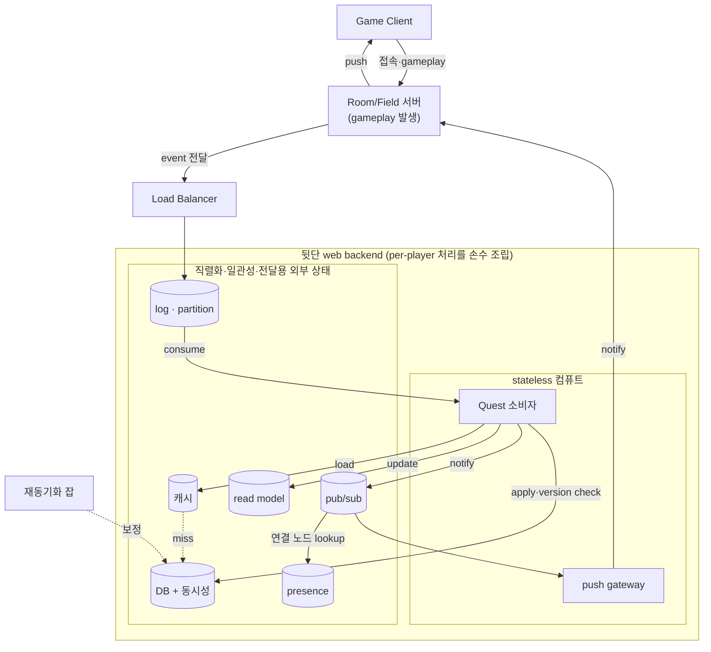
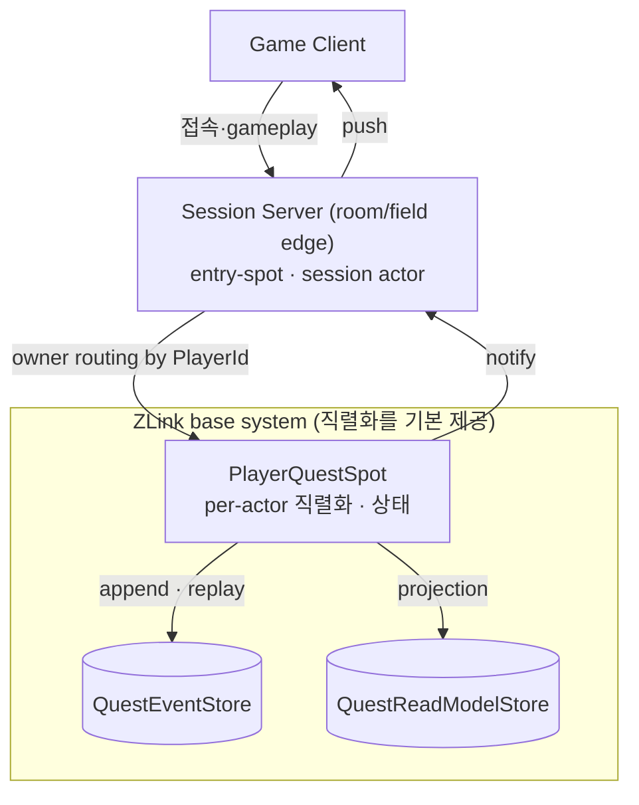
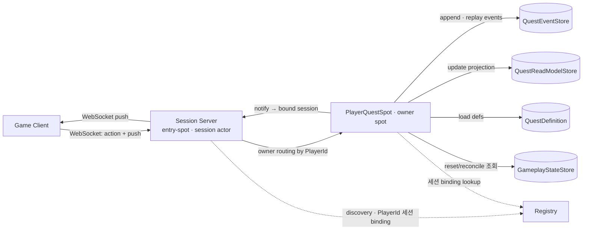
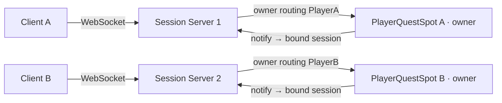
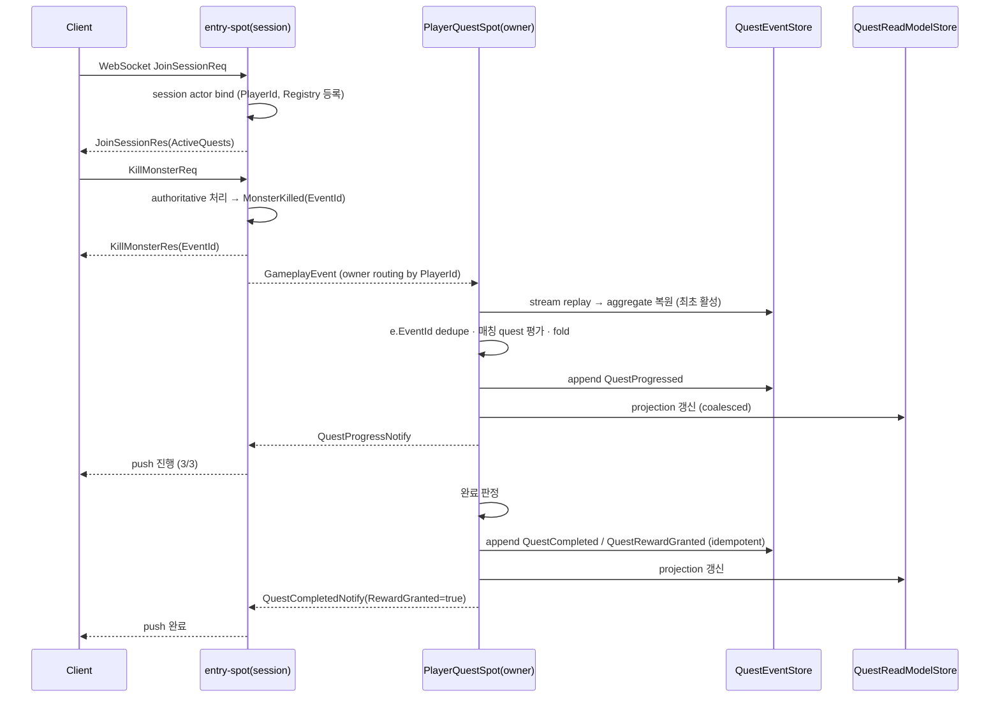

# GameQuest Sample Scenario

[Event 샘플 목록](README.ko.md)

> 재작성판. 이 샘플은 "대량 gameplay event로 quest를 판정하는 시스템"을 stateless 웹 방식과
> ZLink actor(spot) 방식으로 나란히 짜서, ZLink가 어떻게 더 단순한지를 보여 주는 것을
> backbone으로 삼는다. 이전 판(HTTP action + fanout + 외부 log)은 git 히스토리에 있다.

## 1. 목적과 의도

GameQuest는 **게임에서 쏟아지는 per-player gameplay event로 mission/quest 진행과 완료를
server-authoritative하게 판정하는 시스템을, ZLink의 owner-actor(spot) 모델로 얼마나 단순하게
지을 수 있는지**를 전형적인 stateless 웹 방식과 비교해 보여 주는 샘플이다.

핵심 질문은 하나다.

> "player가 몬스터를 잡고 아이템을 줍는 수많은 event로 quest 완료를 판정하고 진행을 실시간으로
> 보여 주는 시스템을 — **웹 방식으로 짜면 무엇이 필요하고, ZLink로 짜면 무엇이 사라지는가.**"

판정을 어디서 하느냐가 설계를 가른다. 싱글/신뢰된 co-op이면 client가 진행을 계산하고 서버는
결과만 저장해도 된다. 하지만 MMORPG처럼 client가 적대적 입력이고 world/경제가 공유되면 서버가
authoritative해야 한다.

- **신뢰(anti-cheat)**: "quest 깼으니 보상 달라"를 client가 말하게 두면 조작된다.
- **공유 world**: kill·world event·party 기여가 여러 곳에서 발생한다.
- **경제/중복 방지**: reward 중복 지급은 경제를 무너뜨린다.
- **진행 보존**: 진행이 꼬이면 게임이 막힐 수 있다.

다만 게임 도메인은 진행이 꼬여도 **force-reset/재동기화**라는 안전밸브가 있어, 금융처럼 절대
무손실일 필요는 없다. 이 점이 뒤(5·9절)의 신뢰성 트레이드오프를 가능하게 한다.

옆 [ShoppingMall](shoppingmall.ko.md)이 command-driven 순수 event sourcing을 담당한다면,
GameQuest는 **"stateful actor가 stateless 웹 대비 시스템을 어떻게 단순화하는가"** 축을 담당한다.

## 2. 요구사항

### 2.1 기능 요구사항

- 대량 per-player gameplay event(kill/collect/enter/mission/feature)를 서버가 수신·처리한다.
- 각 event가 어떤 quest 조건에 걸리는지 판정한다(카운터/임계값, 다중·순서 조건).
- **진행 상황(예: 3/10)을 client에 실시간으로 보여 준다.** reconnect 후에도 조회로 복원한다.
- 완료를 판정하고 reward를 **idempotent하게** 지급한다.
- 완료/진행을 client WebSocket으로 push한다.

### 2.2 비기능 요구사항

| 축 | 요구 | 수단 |
|------|------|------|
| 확장성 | player 수·event rate에 수평 확장, 단일 병목 없음 | `PlayerId`별 owner spot을 노드에 분산(spot-mesh) |
| 순서·일관성 | 같은 player event를 순서대로, 충돌 없이 | player당 single owner(직렬 처리) |
| 게임 수준 견고성 | 진행을 잃지 않되 절대 무손실은 아님 | DB-backed spot state + reset/reconcile 보정 |
| server-authoritative | client 신뢰하지 않음 | 판정·지급 전부 서버 owner spot에서 |
| reward idempotency | 중복 지급 0 | `EventId` dedupe + durable 결정 기록 |
| 저지연 push | 진행을 실시간처럼 표시 | owner spot → bound session 직접 push |

## 3. 웹 방식으로 짜면 (MMORPG 뒷단 처리)

싱글 게임이라면 client가 quest 진행을 계산하고 서버는 결과만 저장해도 된다 — 공유도 경쟁도
없으니 그걸로 충분하고, 이 샘플의 비교 대상이 아니다.

MMORPG는 다르다. kill·item·area 같은 gameplay event는 **room/field 서버**에서 발생하는데, quest
판정을 room/field에서 직접 하기는 어렵다. player가 room을 넘나들고 room은 수명이 짧아서, 같은
player의 이벤트를 한 곳에 모아 순서대로 처리하려면 복잡도가 크게 올라간다. 그래서 전통적으로는
room/field가 이벤트를 **LB를 거쳐 뒷단 web으로 넘겨** 중앙에서 처리한다. 그 web을 어떻게
짓느냐가 비교의 핵심이다.



핵심은 room/field가 **못 하는** "밖에서의 per-player 직렬화"를 web backend가 대신 떠맡는다는 것.
그 하나를 위해 log(순서·재생)+DB+동시성(충돌 방지)+캐시+read model+pub/sub+presence를 **손으로
조립**하고, 재동기화 잡까지 붙는다. 즉 복잡성은 게으름이 아니라 "per-actor 직렬화 인프라를 직접
지어야 함"에서 나온다.

복잡성의 뿌리는 **statelessness**다. 웹은 LB 뒤 수평 확장을 위해 서비스를 stateless로 두는데,
그러면 **상태가 전부 밖(DB)으로 나가고**, 그 결과 매 이벤트가 분산 load-modify-store가 되며,
동시성 제어·캐시·pub/sub 라우팅이 줄줄이 딸려온다.

## 4. ZLink로 짜면 (base system이 직렬화를 제공)

ZLink도 처리를 room/field 밖으로 뺀다 — 같은 이유(room 전이·transient)다. 차이는 **per-actor
직렬화가 base system(spot)으로 기본 제공**된다는 것. room/field 역할(client를 쥐고 event를
내보내는 edge)은 entry-spot을 가진 `Session Server`가 맡고, 이벤트를 그 player의 owner spot으로
**owner routing만** 하면 spot이 순서·일관성·상태를 인프라 차원에서 보장한다. 그래서 §3의
log+DB+동시성+캐시+pub/sub+presence를 손으로 조립할 필요가 없다.



`Session Server`는 client WebSocket을 종단하고, 연결마다 **session actor를 만들어 entry-spot에
할당하고 `PlayerId`에 bind**한다. client 메시징은 session actor로 전달되고, session actor가
authoritative gameplay 처리 후 gameplay event를 만들어 **그 player에 할당된 `PlayerQuestSpot`으로
owner routing으로 메시징**한다. 그 spot이 조건 평가·상태 기록·notify를 전부 소유한다. notify는
bound session을 통해 연결을 가진 `Session Server`로 돌아간다.

§3의 조각들이 왜 사라지는가 — room/field가 못 하던 per-actor 직렬화를 base system이 대신하므로.

| 웹 방식 구성요소 | 왜 필요했나 | ZLink에서 사라지는 이유 |
|------|------|------|
| Kafka/Redis Streams 로그 | stateless 소비자에 순서·분배 | owner routing이 player별 순서 보장, 전달은 라우팅 |
| 이벤트마다 DB load-modify-store | 상태가 DB에 있어 매번 왕복 | 상태가 owner spot 메모리에 있음 → in-memory 적용 |
| optimistic 버전 / 분산 락 | 여러 인스턴스가 같은 player 동시 수정 | single owner라 동시 수정 자체가 없음 |
| Redis 캐시 | 매 이벤트 DB 읽기 회피 | owner spot이 곧 hot state = 캐시 |
| Redis pub/sub + presence store | 알림을 연결 가진 노드로 라우팅 | Registry 세션 binding + owner routing이 연결로 직접 |

~9개 조각이 **Session Server(entry-spot) + PlayerQuestSpot(owner spot) + DB** 로 접힌다.

## 5. 트레이드오프 (정직한 비교)

이 단순화는 공짜가 아니다. owner spot이 상태를 품는 대가로 아래를 내준다. 이 정직함 자체가
샘플의 교육 포인트다.

| 축 | 웹 방식 | ZLink 방식 |
|------|------|------|
| 구성요소 수 | 많음 | 적음 |
| per-event 비용 | DB 왕복 + 동시성 제어 | 메모리 적용 |
| 내구성 | 강함(로그+동기 DB) | 약함(lossy 전달 + reset 보정) ← 게임이라 감당 |
| 노드 장애 | 단순(stateless, 즉시 대체) | owner spot rehydrate + re-home 필요 |
| cross-player 집계 | 로그에 소비자 추가로 쉬움 | spot이 파생 event 방출 → 별도 aggregator(13절) |

명제: **MMORPG는 어느 방식이든 per-player 처리를 room/field 밖으로 뺀다. 차이는 그 per-actor
직렬화·일관성 인프라를 web backend로 *손수 조립*하느냐, ZLink base system(spot)이 *기본 제공*
하느냐다.** ZLink는 그 조립을 없애는 대신 내구성과 장애 복구의 단순함을 일부 내주고, 그건 게임
도메인이 force-reset으로 감당한다. 무손실이 필요한 경로(reward·경제)는 spot 위에 durable 조각을
선택적으로 얹으면 되며, 데이터별 tier 구분은 §9 "production 확장"에서 다룬다.

## 6. 서버 구성



`Session Server`가 client WebSocket을 종단한다. 연결마다 **session actor를 만들어 entry-spot에
할당하고 `PlayerId`에 bind**한다. client 메시징은 이 session actor로 전달되고, session actor는
authoritative gameplay 처리 후 gameplay event를 만들어 **그 player에 할당된 `PlayerQuestSpot`
(owner spot)으로 owner routing**한다. owner spot이 아직 없으면 첫 메시징에서 활성(생성)된다.
`PlayerQuestSpot`은 조건 평가·상태 기록·notify를 소유하며, notify는 bound session을 통해 연결을
가진 session actor로 돌아간다. session binding(`PlayerId` ↔ 연결 노드) 등록·조회는 별도 store
없이 `Registry` 기능을 쓴다.

owner spot은 연결(session actor)과 분리돼 있어 어느 `Session Server`에 붙든 같은 `PlayerId`는
항상 같은 owner spot으로 간다. owner spot의 호스팅은 spot-mesh에 맡기며 연결 노드와 같은 노드일
필요가 없다 — 샘플에서는 `Session Server` 노드들이 entry-spot과 owner spot을 함께 호스팅하는 한
mesh로 두고, 규모가 커지면 owner tier를 분리할 수 있다.

| 구성 | 책임 |
|------|------|
| `Registry` | endpoint discovery + `PlayerId` 세션 binding 등록·조회. |
| `Session Server` | WebSocket 종단, session actor 생성·entry-spot 할당·bind, authoritative gameplay 처리(event 생성), owner spot으로 메시징, notify push. |
| `PlayerQuestSpot` (owner spot) | player당 owner. event 적용, 조건 평가, 완료/보상 결정, 상태 기록. spot-mesh에 호스팅. |

| 저장소 | 성격 | 책임 |
|------|------|------|
| `QuestEventStore` | SoR (event stream) | `(PlayerId, QuestId)`별 append-only quest domain event stream. owner spot의 replay·append 원천. |
| `QuestReadModelStore` | projection | 진행 표시·조회용. event stream replay로 재생성 가능. |
| `GameplayStateStore` | authoritative facts | kill/inventory/mission 누적 fact. reset/reconcile 보정 원천. |
| `QuestDefinition` | config | quest 조건. trigger event type으로 인덱싱. |

샘플 실행은 `Session Server`를 2 노드로 띄워 session scale-out과 player owner 분산을 함께 본다.
저장소는 공유 dependency로 둔다.



`PlayerA`가 `Session Server 2`로 재접속해도 `PlayerQuestSpot A`는 그대로이며, owner routing이
`Session Server 2`에서 그 owner spot으로 이어 준다.

scale-out 검증:

- 어느 노드가 연결·action을 받아도 같은 `PlayerId`는 항상 같은 `PlayerQuestSpot` owner로 간다.
- 서로 다른 player는 다른 노드 owner에서 동시에 처리된다.
- notify는 현재 그 player의 연결을 가진 노드로 route된다.
- 노드를 재시작해도 owner spot이 `QuestEventStore` replay로 aggregate를 rehydrate한다.

## 7. 책임 분리

| 구분 | 담당 | 책임 |
|------|------|------|
| 연결·세션 | entry-spot | WebSocket 종단, session bind, push 전달. |
| authoritative gameplay | Session Server gameplay module | action 검증, gameplay event 생성. |
| player 소유·판정 | `PlayerQuestSpot` (owner) | event 직렬 적용, 조건 평가, domain event append, aggregate 복원. |
| event stream (SoR) | `QuestEventStore` | quest domain event append-only 저장, replay 원천. |
| 진행 표시 | `PlayerQuestSpot` + `QuestReadModelStore` | 실시간 push와 projection 조회 응답. |
| 보정 | `GameplayStateStore` | reset/reconcile 시 누적 fact 재계산. |
| client push | entry-spot WebSocket | 진행/완료 notify 전달. |

`PlayerQuestSpot`이 한 player의 quest/mission 처리를 **전부 소유**한다. per-player achievement나
그 player의 analytics도 같은 spot 안에서 처리할 수 있다. spot이 혼자 할 수 없는 것은 여러
player를 가로지르는 집계뿐이다(13절).

## 8. Routing·소유권·세션

| 대상 | 기준 | 규칙 |
|------|------|------|
| session 연결 | connection | 어느 노드가 받아도 되며 entry-spot으로 `PlayerId`에 bind. |
| gameplay 처리 | `PlayerId` | action 받은 노드가 authoritative하게 처리. |
| owner 메시징 | `PlayerId` | gameplay event를 owner routing으로 `PlayerQuestSpot`에 전달. |
| quest 판정·기록 | `PlayerId`, `QuestId` | `PlayerQuestSpot`만 상태·결정을 기록하며 idempotent. |
| notify | `PlayerId` | 현재 session binding을 가진 노드의 entry-spot으로 route. binding 없으면 생략. |

client가 하나의 WebSocket으로 연결하면 entry-spot이 세션 actor를 만들고 `PlayerId`↔connection↔
노드 binding을 `Registry`에 등록한다(별도 store 없이). action은 같은 연결로 들어와 entry-spot을 거쳐
owner spot으로 라우팅되고, notify는 binding을 통해 실제 연결을 가진 노드로 돌아간다. reconnect가
다른 노드로 붙으면 binding이 갱신되고 이후 notify는 새 노드로 간다. binding이 없는 동안의
notify는 drop해도 되며, client는 재접속 후 `GetQuestProgressReq` 조회로 보정한다.

owner spot은 API 처리 순서에 기대지 않는다. 같은 player의 서로 다른 action이 다른 노드에서
처리돼도, owner routing으로 한 owner에 모여 도착 순서대로 직렬 처리된다.

## 9. 이벤트 소싱 (owner spot = event-sourced aggregate)

owner spot이 상태를 어떻게 처리·보존하는지가 이 샘플의 핵심이다. `PlayerQuestSpot`은 현재
상태를 그대로 저장하지 않고, **domain event를 append하고 replay로 복원하는 event-sourced
aggregate**다. 즉 event sourcing이 별도 서비스나 외부 log가 아니라 **owner spot 안에서** 일어난다.

domain spot의 처리 루프 — gameplay event 한 건이 도착하면:

```text
on GameplayEvent e:
  1. (최초 활성) QuestEventStore에서 이 player의 quest event stream을 replay
        → in-memory aggregate 복원  (snapshot이 있으면 snapshot + 꼬리만)
  2. e.EventId가 이미 반영됐으면 무시                       # idempotency
  3. QuestDefinition 인덱스로 e에 걸리는 quest만 선별         # 이벤트당 O(매칭)
  4. 각 매칭 quest에서 domain(QuestPolicy)이 결정 event 생성:
        진행     → QuestProgressed
        임계 도달 → QuestCompleted
        미지급    → QuestRewardGranted
  5. 생성한 domain event를 QuestEventStore에 append          # append-only = SoR
  6. 같은 event를 in-memory aggregate에 fold                  # 상태 = 이벤트의 fold
  7. QuestReadModelStore projection 갱신                      # 표시·조회용
  8. notify (coalesced) → bound session
```

핵심은 **상태 = 이벤트의 fold**라는 것이다. 진행·완료·보상 여부의 기준은 `QuestEventStore`의
event stream이고, `QuestReadModelStore`는 언제든 replay로 다시 만들 수 있는 projection이다.
`PlayerQuestSpot`이 owner이므로 append는 직렬화되고, 웹 방식의 optimistic version이나 분산 락이
필요 없다.

- **replay·snapshot**: 활성화 시 stream을 replay해 aggregate를 복원한다. stream이 길면 주기적
  snapshot을 두어 `snapshot + 꼬리`만 replay한다. 노드가 죽어도 다른 노드에서 re-home 후 같은
  방식으로 복원한다(§5 트레이드오프의 "rehydrate").
- **idempotency**: 적용한 source `EventId`를 stream에 함께 기록해, 재전달·재시도를 중복 반영하지
  않는다. 같은 `IdempotencyKey`의 action은 같은 gameplay `EventId`를 낳는다.
- **reward idempotency**: `QuestCompleted`/`QuestRewardGranted`가 stream에 이미 있으면 같은 quest에
  다시 append하지 않는다. 지급은 한 번만.
- **lossy 전달 + 보정**: owner로의 gameplay event 전달은 best-effort다(외부 durable log 없음).
  유실되면 `GameplayStateStore`의 누적 fact로 진행을 재계산해 `QuestReconciled` event를 append하고
  이후 replay 결과에도 반영한다. `SyncQuestProgressReq`(수동/주기)나 운영상 force-reset으로
  트리거한다. 게임 도메인이라 절대 무손실이 아니어도 되는 이유가 여기 있다.

### production 확장 — reliability tier를 데이터별로 나눈다

제대로 된 MMORPG라고 모든 데이터를 무손실로 처리하지는 않는다. spot 기반 직렬화는 그대로 두고,
경로별로 tier만 다르게 얹는다.

- **quest/mission 진행** (고빈도·tolerant): 샘플 기본대로 **lossy 전달 + event sourcing + reset
  보정**으로 충분하다. 유실돼도 reconcile로 복구되므로 durable log가 없어도 된다.
- **reward·경제·거래** (저빈도·치명적): owner로의 **ingest 경로에 durable log(Redis Streams/Kafka)
  나 outbox를 끼워 무손실**로 하고, 지급 결정은 **durable·트랜잭셔널 store**에 기록한다.

즉 "제대로"는 §3의 web backend로 갈아타는 게 아니라, **§4의 spot(직렬화·realtime) 위에 durable
조각을 reward-bearing 경로에만 선택적으로 얹는** 것이다. spot이 직렬화·동시성·캐시·pub/sub를
이미 대체하므로, §3에서 실제로 남겨 얹는 건 **durable log(ingest)와 결정 store뿐**이다. 샘플은
진행 tier만 구현하고 reward tier는 확장으로 둔다.

## 10. DDD·Hexagonal 구조

```text
SessionServer/
  Session/
    EntrySpotSessionHandler      # WebSocket join, bind, push relay
  Gameplay/
    Combat / Inventory / Mission / Feature / World   # authoritative 규칙, gameplay event 생성
  Quest/
    Domain/
      QuestDefinition            # 조건, trigger event type 인덱스
      QuestCondition
      PlayerQuestAggregate       # (PlayerId, QuestId) event fold로 복원되는 상태
      QuestPolicy                # 완료·보상 판정
      QuestEvents                # Progressed, Completed, RewardGranted, Reconciled
    Application/
      ApplyGameplayEventUseCase  # event → 평가 → domain event append → projection
      GetQuestProgressUseCase
      ReconcileQuestUseCase      # 보정 → Reconciled event
    Ports/
      QuestEventStorePort        # append, replay(+snapshot)
      QuestReadModelPort         # projection 갱신·조회
      GameplayFactsPort          # reset/reconcile 조회
      QuestNotificationPort      # bound session push
    Infrastructure/
      Spots/
        PlayerQuestSpot          # per-player owner actor (event-sourced aggregate)
        Handlers/
          ApplyGameplayEventHandler
          GetQuestProgressHandler
          ReconcileQuestHandler
      Store/
        QuestEventStoreRepository
        QuestReadModelRepository
        GameplayStateRepository
      Notify/
        QuestNotificationPublisher
```

`Domain`은 ZLink 타입·DB client를 직접 참조하지 않는다. `PlayerQuestSpot`은 owner adapter로서
`QuestEventStore`로 stream을 replay해 aggregate를 복원하고, domain이 반환한 quest domain event를
다시 `QuestEventStore`에 append한 뒤 `QuestReadModelStore` projection을 갱신한다.

## 11. 메시지 계약

client ⇄ Session Server (하나의 WebSocket):

```text
JoinSessionReq  { PlayerId }
JoinSessionRes  { ActiveQuests: QuestProgress[] }     # bind 후 현재 진행

KillMonsterReq  { PlayerId, MonsterId, AreaId, IdempotencyKey }
KillMonsterRes  { EventId }                            # 같은 IdempotencyKey → 같은 EventId
CollectItemReq  { PlayerId, ItemId, Count, IdempotencyKey }
EnterAreaReq    { PlayerId, AreaId, IdempotencyKey }
# CompleteMission / UnlockFeature 동형

GetQuestProgressReq { PlayerId }
GetQuestProgressRes { ActiveQuests: QuestProgress[] }

SyncQuestProgressReq { PlayerId }                      # 보정 트리거
SyncQuestProgressRes { UpdatedQuests: QuestProgress[] }

# server push (coalesced)
QuestProgressNotify  { PlayerId, Progress: QuestProgress }
QuestCompletedNotify { PlayerId, Progress: QuestProgress, RewardGranted: bool }
```

entry-spot → owner spot (내부 메시징):

```text
GameplayEvent {
  EventId: string
  PlayerId: string          # owner routing key
  Type: string              # MonsterKilled | ItemCollected | ...
  Payload: bytes
  OccurredAtUnixMs: int64
}
```

quest domain event stream (`QuestEventStore`, append-only SoR):

```text
StoredQuestEvent {
  EventId: string
  PlayerId: string
  QuestId: string
  Type: string              # QuestProgressed | QuestCompleted | QuestRewardGranted | QuestReconciled
  Payload: bytes
  SourceEventId: string?    # 반영한 gameplay EventId (idempotency)
  Version: int64
  CreatedAtUnixMs: int64
}

QuestProgressed    { PlayerId, QuestId, Delta, CurrentCount, RequiredCount, SourceEventId }
QuestCompleted     { PlayerId, QuestId, SourceEventId, CompletedAtUnixMs }
QuestRewardGranted { PlayerId, QuestId, RewardId, GrantedAtUnixMs }
QuestReconciled    { PlayerId, QuestId, CurrentCount, Reason, ReconciledAtUnixMs }
```

projection (`QuestReadModelStore`, 표시·조회용, event stream replay로 재생성):

```text
QuestProgress {
  PlayerId, QuestId, Status,        # Active | Completed | RewardGranted
  CurrentCount, RequiredCount,
  LastSourceEventId: string?, Version: int64, UpdatedAtUnixMs: int64
}
```

세션 binding(`PlayerId` ↔ 연결 노드)은 `Registry`가 관리하므로 별도 메시지·store를 두지 않는다.

## 12. 메시지 흐름



reconnect·reset 흐름은 8·9절 규칙을 따른다: reconnect는 다른 노드 entry-spot에 rebind 후
`GetQuestProgressReq`로 복원하고, reset은 `GameplayStateStore` 조회로 진행을 재계산한다.

## 13. cross-player 확장

per-player 처리는 owner spot에서 끝난다. 여러 player를 가로지르는 관심사만 밖으로 나간다.

- 예: "오늘 quest X 완료 player 수", 리더보드, 월드-퍼스트 이벤트, 봇 링 탐지.
- 방식: 각 `PlayerQuestSpot`이 완료 같은 **파생 event를 방출** → 별도 집계 소비자가 수신한다.
  raw gameplay firehose를 그대로 뿌리는 게 아니다.
- 이 지점에서만 fanout/durable log 같은 분배·내구성 장치가 정당해진다. 기본 샘플 범위 밖이며,
  확장 노트로만 둔다.

## 14. Client 시나리오 (self-check)

game client는 하나의 WebSocket으로 join·action·progress push를 다룬다. self-check driver는 같은
연결로 gameplay command를 보내 event를 만든다. store 검증은 server-side assertion으로 한다.

- **성공/완료**: join → bind 검증 → KillMonster ×3 → 진행 push(coalesced) → 완료·보상 push →
  `QuestEventStore`에 QuestProgressed/Completed/RewardGranted append 검증.
- **projection 재생성**: `QuestReadModelStore`를 지워도 `QuestEventStore` replay만으로 동일 진행이
  복원되는지 검증.
- **중복(idempotency)**: 같은 IdempotencyKey 재전송 → 같은 EventId → 진행 중복 증가 없음.
- **reward idempotency**: 완료된 quest에 같은 SourceEventId 재적용 → 결정 event 중복 append 없음.
- **rehydrate 복원**: 노드 재시작(또는 owner 비활성→재활성) → `QuestEventStore` replay로 aggregate 복원.
- **reconnect**: 연결 끊고 binding 해제 → 다른 노드로 재접속 → 조회로 복원 → 이후 notify가 새
  노드로.
- **reset 보정**: fanout 없이 `GameplayStateStore`만 kill count 증가시킨 뒤 SyncQuestProgress →
  진행 재계산 검증.
- **scale-out**: 2 노드에서 PlayerA/B가 다른 owner에서 동시 처리, notify가 각자 연결 노드로.

## 15. 구현 완료 기준

- client는 하나의 WebSocket으로 action과 push를 다룬다. HTTP action tier가 없다.
- Session Server는 entry-spot으로 session을 bind하고 gameplay event를 owner routing으로 전달한다.
- 같은 `PlayerId`는 항상 같은 `PlayerQuestSpot` owner로 route된다.
- `PlayerQuestSpot`이 quest 판정·event append·notify를 소유하며, 상태를 메모리에 두고 직렬 처리한다.
- `PlayerQuestSpot`은 event-sourced aggregate다: `QuestEventStore`에 domain event를 append하고
  replay로 상태를 복원하며, 진행 카운트는 event fold의 결과다.
- `QuestReadModelStore` projection은 event stream replay로 재생성된다.
- reward 지급은 중복 append되지 않는다.
- 진행 push는 coalesce되고, binding 없는 player의 push는 생략되지만 상태는 기록된다.
- reset/reconcile은 `GameplayStateStore`로 어긋난 진행을 보정한다.
- scale-out self-check가 2 노드 구성을 검증한다.
- `PlayerId`·`QuestId`·`EventId`는 명시적 domain id이며 routing id hex를 client에 노출하지 않는다.
