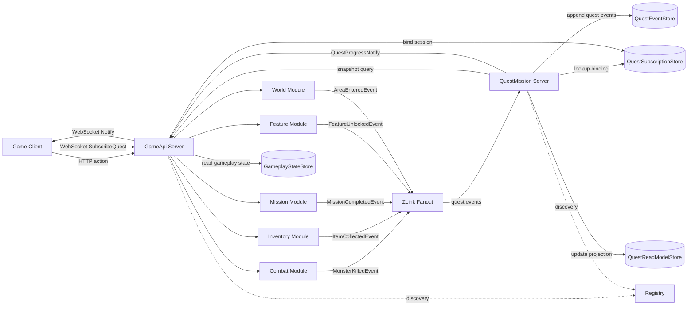
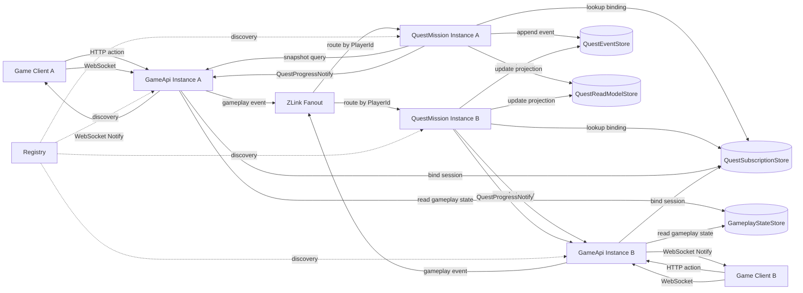
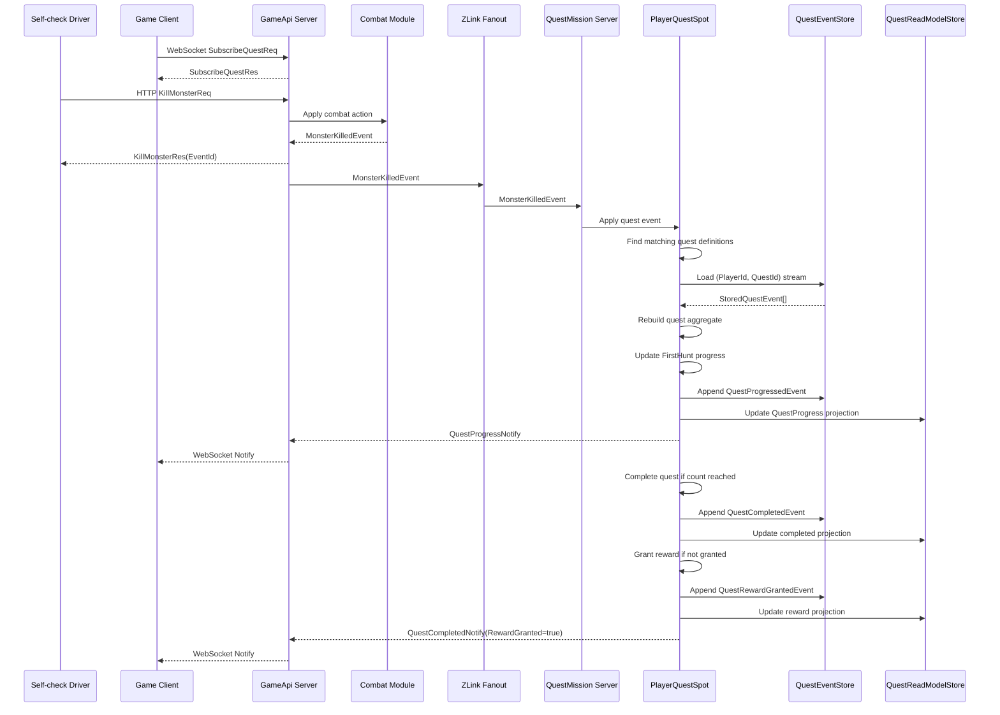
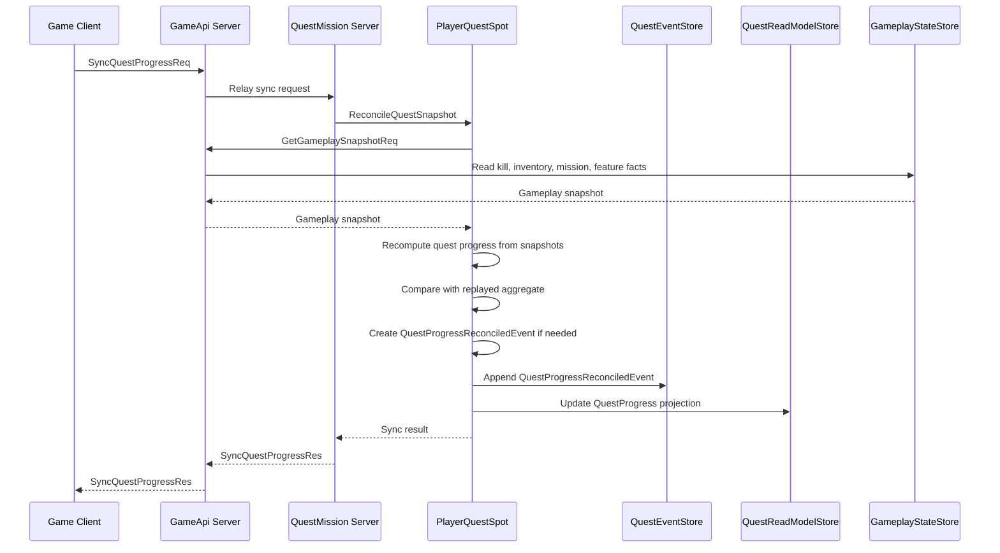

# GameQuest Sample Scenario

[Event 샘플 목록](README.ko.md)

## 1. 목적

GameQuest는 stateless Game API 서버와 stateful QuestMission 처리 서버를 분리하고,
ZLink fanout과 event sourcing으로 복잡한 quest와 mission 진행을 처리하는 gameplay 샘플이다.
client action은 여러 `GameApi` instance 중 어느 곳으로 들어와도 된다. `GameApi` 내부의
combat, inventory, mission, feature, world module은 gameplay event를 publish하고,
`QuestMission` 서버의 `PlayerQuestSpot`이 `PlayerId` 기준 owner로 route된 event를 처리한다.

퀘스트 도메인은 event sourcing을 보여 주기에 적합하다. quest 진행은 여러 gameplay 영역에서
생긴 과거 event의 누적으로 결정되고, 현재 projection이 없어져도 quest별 event stream을
replay하면 진행 상태와 reward 지급 여부를 다시 계산할 수 있어야 하기 때문이다.

외부 gameplay event는 ZLink fanout으로 `QuestMission` 서버에 들어온다. Quest 도메인이 받아들인
결과는 `QuestEventStore`에 `QuestProgressedEvent`, `QuestCompletedEvent`,
`QuestRewardGrantedEvent` 같은 quest domain event로 append된다. 현재 quest 조회와 client
notify는 `QuestReadModelStore` projection을 사용한다.

이 샘플에서 확인해야 하는 핵심은 아래와 같다.

- `GameApi` 서버는 stateless action API와 WebSocket session을 맡는다.
- `GameApi` 내부 combat, inventory, mission, feature, world module은 자기 domain event를 ZLink fanout으로 publish한다.
- `QuestMission` 서버는 여러 event type을 구독하고 player별 `PlayerQuestSpot`에 route한다.
- `PlayerQuestSpot`은 `QuestEventStore`에서 `(PlayerId, QuestId)` event stream을 replay해 quest aggregate를 복원한다.
- `PlayerQuestSpot`은 quest 조건 평가, progress event append, completion event append, reward event append를 소유한다.
- `QuestReadModelStore`는 client 조회와 notify를 위한 projection이다.
- 외부 fanout event 누락 가능성은 gameplay snapshot 재동기화로 보정하고, 보정 결과도 quest domain event로 append한다.
- client는 `GameApi` WebSocket으로 quest progress notify를 받는다.

## 2. 서버 구성



다이어그램의 module event 화살표는 `GameApi` 내부 gameplay module이 ZLink fanout으로
event를 publish한다는 뜻이다. `QuestMission` 서버는 event publisher instance의 물리 endpoint를
직접 알지 않는다. `QuestEventStore`는 event sourcing의 기준 저장소이고,
`QuestReadModelStore`는 client 조회와 notify를 위한 projection 저장소다.

서버 프로세스는 아래처럼 둔다.

| 서버 | 책임 |
|------|------|
| `GameQuest.Registry` | 서버 endpoint discovery를 제공한다. |
| `GameQuest.GameApi` | HTTP action API, WebSocket session, gameplay module 실행, gameplay event publish, quest notify 전달을 맡는다. |
| `GameQuest.QuestMission` | gameplay event 구독, `PlayerQuestSpot` owner routing, quest event append, projection 갱신, reward idempotency를 맡는다. |

저장소는 별도 ZLink 서버가 아니라 각 서버가 사용하는 dependency로 둔다.

| 저장소 | 책임 |
|--------|------|
| `QuestEventStore` | `(PlayerId, QuestId)`별 quest domain event stream을 저장한다. |
| `QuestReadModelStore` | client 조회와 notify에 사용할 quest progress projection을 저장한다. |
| `GameplayStateStore` | Combat, Inventory, Mission, Feature, World module이 snapshot 보정에 필요한 누적 fact를 저장한다. |
| `QuestSubscriptionStore` | player별 WebSocket binding과 notify target `GameApi` instance를 저장한다. |

샘플 실행은 stateless API scale-out과 player owner routing을 함께 보여 주기 위해
`GameApi`와 `QuestMission`을 각각 2 instance로 띄운다.

| 구성 요소 | 샘플 instance 수 | 이유 |
|-----------|------------------|------|
| `GameQuest.Registry` | 1 | 샘플 구성을 단순하게 유지한다. |
| `GameQuest.GameApi` | 2 | 같은 서버 종류를 여러 대 띄워 stateless action 처리와 WebSocket session scale-out을 보여 준다. |
| `GameQuest.QuestMission` | 2 | `PlayerId` 기준 `PlayerQuestSpot` owner routing과 projection update를 보여 준다. |
| stores | 1 logical set | 여러 service instance가 공유하는 dependency로 둔다. |

운영 구성에서도 `GameApi`와 `QuestMission`은 instance group으로 확장된다. 이때 가장 중요한
규칙은 같은 `PlayerId`의 gameplay event를 적용하는 `PlayerQuestSpot` owner가 하나로
정해져야 한다는 점이다. 같은 player의 event replay, domain event append, projection update는
같은 owner 흐름으로 모여야 한다.



scale-out 검증은 아래를 확인한다.

- 어느 `GameApi` instance가 action을 처리해도 같은 gameplay event 계약으로 publish한다.
- 같은 `PlayerId`의 gameplay event는 같은 `PlayerQuestSpot` owner 흐름에서 처리된다.
- 하나의 gameplay event가 여러 quest 조건에 맞으면 관련 `(PlayerId, QuestId)` stream 여러 개에 적용될 수 있다.
- 서로 다른 player의 quest 진행은 다른 `QuestMission` instance에서 동시에 처리될 수 있다.
- `QuestReadModelStore` projection은 여러 `QuestMission` instance가 갱신해도 event stream version 기준으로 일관성을 유지한다.
- quest notify는 client WebSocket을 소유한 `GameApi` instance로 route된다.
- 특정 `QuestMission` instance를 재시작해도 `QuestEventStore` replay로 quest aggregate를 복원한다.

## 3. 책임 분리

| 구분 | 담당 | 책임 |
|------|------|------|
| gameplay event 전파 | ZLink fanout | `GameApi`에서 발생한 gameplay event를 `QuestMission` 서버로 전파한다. |
| event source | `QuestEventStore` | `(PlayerId, QuestId)`별 quest domain event stream을 저장한다. |
| quest aggregate owner | `PlayerQuestSpot` | event stream replay, quest 조건 평가, domain event append를 소유한다. |
| read model | `QuestReadModelStore` | client 조회와 notify에 사용할 현재 quest progress projection을 저장한다. |
| 보정 조회 | gameplay snapshot query | kill count, inventory, mission state 같은 누적 fact를 `GameApi`에서 다시 조회한다. |
| client push | GameApi WebSocket | quest progress notify를 client에게 보낸다. |
| endpoint discovery | Registry/Discovery | `GameApi`와 `QuestMission` instance endpoint를 자동 발견한다. |

ZLink fanout은 "stateless API 서버에서 발생한 여러 gameplay event를 QuestMission 시스템으로
빠르게 모으는 경로"다.
Quest 진행의 최종 기준은 `QuestEventStore`에 저장된 quest domain event stream이다.
`QuestReadModelStore`는 projection이므로 언제든 event stream으로 다시 만들 수 있어야 한다.

## 4. Routing과 소유권 규칙

구현은 아래 routing 규칙을 따른다. 이 규칙이 없으면 scale-out 환경에서 같은 player의
quest 진행이 여러 `QuestMission` instance에서 동시에 갱신될 수 있다.

| 대상 | 기준 id | 규칙 |
|------|---------|------|
| gameplay action 처리 | HTTP/WebSocket endpoint | 어떤 `GameApi` instance가 받아도 된다. |
| gameplay event publish | `PlayerId` | action을 처리한 `GameApi` instance가 ZLink fanout으로 publish한다. |
| quest owner | `PlayerId` | 같은 `PlayerId`는 항상 같은 logical `PlayerQuestSpot` owner로 route한다. |
| quest event append | `PlayerId`, `QuestId`, stream `Version` | `PlayerQuestSpot`만 append하고 optimistic version check로 중복 append를 막는다. |
| projection update | `PlayerId`, `QuestId`, stream `Version` | append된 quest domain event만 projection에 반영한다. |
| WebSocket notify | `PlayerId` | 현재 player WebSocket binding을 가진 `GameApi` instance로 route한다. |
| snapshot query | `PlayerId` | `QuestMission`이 `GameApi` service group에 요청하고, `GameApi`가 `GameplayStateStore`에서 누적 fact를 읽는다. |

`GameApi`는 business state를 소유하지 않는 stateless action API로 본다. 다만 WebSocket 연결은
특정 instance에 붙어 있으므로, connection binding은 `QuestSubscriptionStore`나 framework의
bound session 기능으로 관리한다. `QuestMission`이 `QuestProgressNotify`를 publish하면
notify는 `PlayerId` 기준 binding을 통해 실제 WebSocket을 가진 `GameApi` instance로 전달된다.
binding이 없으면 notify는 drop해도 되며, reconnect client는 `GetQuestProgressReq`로
`QuestReadModelStore` projection을 다시 조회한다.

`PlayerQuestSpot`은 API 요청 처리 순서에 기대면 안 된다. 같은 player의 `KillMonsterReq`,
`CollectItemReq`, `CompleteMissionReq`가 서로 다른 `GameApi` instance에서 처리되어도
`QuestMission`에서는 `PlayerId` 기준 한 owner 흐름으로 합쳐져야 한다. owner는 적용 대상 quest를
찾은 뒤 각 quest의 `(PlayerId, QuestId)` stream을 별도로 replay하고 append한다. 예를 들어
하나의 `MonsterKilledEvent`가 `FirstHunt`와 `ExploreAndHunt`를 모두 진행시키면 source event
하나에서 두 quest stream에 각각 progress event가 생길 수 있다.

## 5. DDD와 Hexagonal 구조

이 샘플은 DDD 기반의 domain model과 hexagonal architecture를 기준으로 구현한다. Quest
진행 규칙, aggregate replay, 완료 판정, reward 지급 여부는 domain 안에 둔다. ZLink
fanout subscriber, Spot handler, WebSocket notify, event store repository, snapshot
query client는 모두 adapter로 둔다. `GameApi`도 combat, inventory, mission, feature, world action을
domain module로 나누되, quest progress를 직접 갱신하지 않고 gameplay event publish까지만
맡는다.

의존 방향은 아래 규칙을 따른다.

| 레이어 | 책임 | 의존 |
|--------|------|------|
| `Domain` | quest definition, 조건 평가, quest별 `PlayerQuestAggregate` replay, domain event 생성 | 외부 framework와 저장소 구현을 모른다. |
| `Application` | gameplay event 적용 use case, projection rebuild, snapshot 보정 조율 | domain과 port interface에 의존한다. |
| `Ports` | event store, read model, notify, gameplay snapshot 조회를 interface로 정의 | 구현체를 모른다. |
| `Infrastructure` | ZLink subscriber, Spot handler, repository, WebSocket publisher, snapshot client 구현 | application port를 호출하거나 구현한다. |

`GameApi` 서버는 아래 구조를 기준으로 둔다.

```text
Server/GameApi/
  Domain/
    Combat/
    Inventory/
    Mission/
    Feature/
    World/
  Application/
    GameplayActions/
      KillMonsterUseCase
      CollectItemUseCase
      CompleteMissionUseCase
      UnlockFeatureUseCase
      EnterAreaUseCase
      GameplaySnapshotUseCase
      GetQuestProgressUseCase
  Ports/
    Outbound/
      GameplayEventPublisherPort
      GameplayStateStorePort
      QuestReadModelPort
      QuestSubscriptionPort
  Infrastructure/
    Http/
      KillMonsterHandler
      CollectItemHandler
      CompleteMissionHandler
      UnlockFeatureHandler
      EnterAreaHandler
      GetQuestProgressHandler
    WebSocket/
      QuestSubscriptionHandler
      QuestNotificationSender
    ZLink/
      Events/
        GameplayEventPublisher
      Handlers/
        GameplaySnapshotQueryHandler
        QuestProgressNotifyHandler
    Store/
      GameplayStateStoreRepository
      QuestSubscriptionRepository
      QuestReadModelRepository
```

`QuestMission` 서버는 아래 구조를 기준으로 둔다.

```text
Server/QuestMission/
  Domain/
    GameQuest/
      QuestDefinition
      QuestCondition
      PlayerQuestAggregate
      QuestProgress
      QuestEvents
      QuestPolicy
  Application/
    QuestEventSourcing/
      ApplyGameplayEventUseCase
      RebuildQuestProjectionUseCase
      QuestSnapshotReconciler
  Ports/
    Inbound/
      ApplyGameplayEventPort
      GetQuestProgressPort
      SyncQuestProgressPort
    Outbound/
      QuestEventStorePort
      QuestReadModelPort
      QuestNotificationPort
      GameplaySnapshotPort
  Infrastructure/
    ZLink/
      Events/
        GameplayEventSubscriber
        QuestEventMapper
      Clients/
        GameplaySnapshotClient
        QuestNotificationClient
      Handlers/
        GetQuestProgressHandler
        SyncQuestProgressHandler
      Notifications/
        QuestNotificationPublisher
      Spots/
        PlayerQuestSpot
        Handlers/
          ApplyQuestEventHandler
          ReconcileQuestSnapshotHandler
          GetQuestProgressSpotHandler
    EventStore/
      QuestEventStoreRepository
      QuestReadModelRepository
      QuestProjectionUpdater
```

`Domain`은 ZLink framework 타입, event store client, DB client를 직접 참조하지 않는다.
`GameApi`의 action handler는 gameplay domain rule을 실행하고, 결과 event를
`GameplayEventPublisherPort`로 publish한다. `QuestMission`의 ZLink event subscriber는
gameplay event를 application port로 전달한다.
`PlayerQuestSpot`은 adapter에 속하며, `QuestEventStorePort`로 event stream을 읽어 domain
aggregate를 복원하고, domain method가 반환한 quest domain event를 다시
`QuestEventStorePort`에 append한다. `QuestReadModelRepository`와
`QuestProjectionUpdater`는 projection adapter이며, projection을 삭제해도 event stream
replay로 다시 만들 수 있어야 한다.

`PlayerQuestAggregate`는 하나의 player 전체 진행을 담는 큰 aggregate가 아니라
`(PlayerId, QuestId)` stream 하나에서 복원되는 quest별 aggregate다. `PlayerQuestSpot`은
player owner adapter로서 같은 gameplay event를 여러 quest definition에 대입할 수 있지만,
각 quest의 version check, completion, reward 지급 여부는 해당 quest stream 안에서 판단한다.

`QuestNotificationPort` 구현은 `PlayerId`로 현재 WebSocket binding을 조회하고, binding이
있을 때만 target `GameApi` instance와 `ConnectionId`를 채운 notify를 보낸다. binding이
없으면 notify 전송은 생략한다. 이 경우에도 event append와 projection update는 완료되어야 한다.

## 6. Quest 조건 예시

| Quest | 조건 | 입력 event |
|-------|------|------------|
| `FirstHunt` | monster 3마리 처치 | `MonsterKilledEvent` |
| `GatherHerbs` | herb item 5개 획득 | `ItemCollectedEvent` |
| `ClearTutorial` | tutorial mission 완료 | `MissionCompletedEvent` |
| `OpenAuction` | auction 기능 unlock | `FeatureUnlockedEvent` |
| `VisitRuins` | ruins area 진입 | `AreaEnteredEvent` |

quest 조건은 여러 gameplay module event를 동시에 사용할 수 있다. 예를 들어 `ExploreAndHunt`는
특정 area에 들어간 뒤 해당 area의 monster를 처치해야 완료될 수 있다.

## 7. 메시지 계약

fanout event 메시지:

```text
MonsterKilledEvent {
  EventId: string
  PlayerId: string
  MonsterId: string
  AreaId: string
  KilledAtUnixMs: int64
}

ItemCollectedEvent {
  EventId: string
  PlayerId: string
  ItemId: string
  Count: int
  CollectedAtUnixMs: int64
}

MissionCompletedEvent {
  EventId: string
  PlayerId: string
  MissionId: string
  CompletedAtUnixMs: int64
}

FeatureUnlockedEvent {
  EventId: string
  PlayerId: string
  FeatureId: string
  UnlockedAtUnixMs: int64
}

AreaEnteredEvent {
  EventId: string
  PlayerId: string
  AreaId: string
  EnteredAtUnixMs: int64
}
```

self-check gameplay command 메시지:

```text
KillMonsterReq {
  PlayerId: string
  MonsterId: string
  AreaId: string
  IdempotencyKey: string
}

KillMonsterRes {
  EventId: string
}

CollectItemReq {
  PlayerId: string
  ItemId: string
  Count: int
  IdempotencyKey: string
}

CollectItemRes {
  EventId: string
}

CompleteMissionReq {
  PlayerId: string
  MissionId: string
  IdempotencyKey: string
}

CompleteMissionRes {
  EventId: string
}

EnterAreaReq {
  PlayerId: string
  AreaId: string
  IdempotencyKey: string
}

EnterAreaRes {
  EventId: string
}

UnlockFeatureReq {
  PlayerId: string
  FeatureId: string
  IdempotencyKey: string
}

UnlockFeatureRes {
  EventId: string
}
```

이 command는 sample self-check가 gameplay event를 만들기 위해 `GameApi`에 보내는 입력이다.
`QuestMission` 서버를 직접 호출하지 않는다. `GameApi` 내부 combat, inventory, mission,
feature, world module이 command를 처리한 뒤 자기 domain event를 ZLink fanout으로 publish한다.
같은 `PlayerId`와 같은 `IdempotencyKey`로 같은 command가 재시도되면 같은 gameplay
`EventId`를 반환해야 한다. 이 규칙으로 self-check는 같은 `SourceEventId` 중복 처리를
검증할 수 있다.

client WebSocket 메시지:

```text
SubscribeQuestReq {
  PlayerId: string
}

SubscribeQuestRes {
  ActiveQuests: QuestProgress[]
}

GetQuestProgressReq {
  PlayerId: string
}

GetQuestProgressRes {
  ActiveQuests: QuestProgress[]
}

SyncQuestProgressReq {
  PlayerId: string
}

SyncQuestProgressRes {
  UpdatedQuests: QuestProgress[]
}
```

server push 메시지:

```text
QuestProgressNotify {
  PlayerId: string
  TargetConnectionId: string?
  Progress: QuestProgress
}

QuestCompletedNotify {
  PlayerId: string
  TargetConnectionId: string?
  Progress: QuestProgress
  RewardGranted: bool
}
```

`TargetConnectionId`는 현재 WebSocket binding이 있을 때만 채운다. binding이 없으면
`QuestMission`은 projection update까지만 수행하고, client reconnect 뒤 조회로 보정한다.

snapshot query 메시지:

```text
GetGameplaySnapshotReq {
  PlayerId: string
}

GetGameplaySnapshotRes {
  PlayerId: string
  KillCounts: KillCountSnapshot[]
  ItemCounts: ItemCountSnapshot[]
  CompletedMissionIds: string[]
  UnlockedFeatureIds: string[]
  EnteredAreaIds: string[]
  SnapshotVersion: int64
}

KillCountSnapshot {
  MonsterId: string
  AreaId: string?
  Count: int
}

ItemCountSnapshot {
  ItemId: string
  Count: int
}
```

subscription binding 메시지:

```text
BindQuestSessionReq {
  PlayerId: string
  ConnectionId: string
  GameApiInstanceId: string
}

BindQuestSessionRes {
  Bound: bool
}

UnbindQuestSessionReq {
  PlayerId: string
  ConnectionId: string
}

UnbindQuestSessionRes {
  Unbound: bool
}
```

`GameApi`는 WebSocket subscribe 시 binding을 저장하고 disconnect 시 해제한다. 같은
`PlayerId`가 여러 connection을 가질 수 있게 구현해도 되지만, 샘플 기본 흐름은 player당
하나의 active binding만 검증한다.

상태 모델:

```text
QuestProgress {
  PlayerId: string
  QuestId: string
  Status: string
  CurrentCount: int
  RequiredCount: int
  LastEventId: string?
  UpdatedAtUnixMs: int64
}
```

`Status` 값은 `Active`, `Completed`, `RewardGranted`를 사용한다.

quest event stream 메시지:

```text
StoredQuestEvent {
  EventId: string
  SourceEventId: string?
  PlayerId: string
  QuestId: string
  EventType: string
  Payload: bytes
  Version: int64
  CreatedAtUnixMs: int64
}

QuestProgressedEvent {
  EventId: string
  PlayerId: string
  QuestId: string
  Delta: int
  CurrentCount: int
  RequiredCount: int
  SourceEventId: string
}

QuestCompletedEvent {
  EventId: string
  PlayerId: string
  QuestId: string
  SourceEventId: string
  CompletedAtUnixMs: int64
}

QuestRewardGrantedEvent {
  EventId: string
  PlayerId: string
  QuestId: string
  RewardId: string
  GrantedAtUnixMs: int64
}

QuestProgressReconciledEvent {
  EventId: string
  PlayerId: string
  QuestId: string
  CurrentCount: int
  Reason: string
  ReconciledAtUnixMs: int64
}
```

## 8. Event Sourced Quest 흐름



`GameApi`는 `QuestMission` 서버를 직접 호출해 quest progress를 바꾸지 않는다. `GameApi`
내부 module은 domain event를 publish하고, `QuestMission` 서버는 관심 있는 event를 구독한다.
`PlayerQuestSpot`이 quest definition과 현재 event stream에서 복원한 quest별 aggregate를 기준으로
완료 여부를 판단한다. 완료가 처음 확인되면 `QuestCompletedEvent`를 append하고, reward가 아직
지급되지 않았으면 같은 stream에 `QuestRewardGrantedEvent`를 append한다. 진행 상태와 reward 지급
여부의 기준은 `QuestEventStore`이며, `QuestReadModelStore`는 notify와 조회에 사용할 projection이다.

## 9. Snapshot 보정 흐름



외부 fanout event가 누락되었거나 client가 오래 disconnect된 경우에도 quest 진행은 snapshot으로
보정할 수 있어야 한다. snapshot 조회는 event sourcing을 대체하지 않는다. 보정 결과는
`QuestProgressReconciledEvent`로 append되어 이후 replay 결과에도 반영된다.

## 10. 중복과 보정 규칙

- 모든 event는 `EventId`를 가진다.
- `PlayerQuestSpot`은 외부 `SourceEventId`와 quest domain `EventId`를 기록하고 중복 event를 무시한다.
- quest progress와 reward 지급 여부의 기준은 `QuestEventStore`의 event stream이다.
- `QuestReadModelStore`는 projection이며, event stream replay로 재생성할 수 있어야 한다.
- event가 누락되면 `SyncQuestProgressReq` 또는 주기적 reconcile로 gameplay snapshot을 조회한다.
- snapshot 결과가 replay aggregate보다 앞서 있으면 `QuestProgressReconciledEvent`를 append하고 notify를 보낸다.
- snapshot은 현재 inventory 같은 순간 상태만 뜻하지 않는다. monster kill count, mission completion,
  feature unlock history처럼 quest 조건을 재계산할 수 있는 누적 fact를 `GameApi`가 제공해야 한다.
- reward 지급은 idempotent해야 한다. 같은 quest completion이 두 번 처리되어도 reward는 한 번만 지급한다.

`QuestEventStore`는 샘플에서 아래 동작을 제공해야 한다.

- stream key는 `PlayerId`와 `QuestId` 조합으로 둔다.
- append는 expected `Version`을 받아 optimistic version check를 수행한다.
- 같은 `SourceEventId`와 같은 `QuestId`에서 만들어진 progress event는 한 번만 append한다.
- `QuestCompletedEvent`가 이미 있으면 같은 quest에 completion event를 다시 append하지 않는다.
- `QuestRewardGrantedEvent`가 이미 있으면 reward 지급 처리를 다시 실행하지 않는다.
- read는 stream event를 `Version` 오름차순으로 반환한다.
- projection rebuild는 `QuestEventStore`만 읽어서 `QuestReadModelStore`를 다시 만든다.

## 11. Client 시나리오 작성 기준

client 시나리오는 Bingo client처럼 시나리오 테스트로 읽혀야 한다. game client와
self-check driver의 역할은 구분하되, gameplay command를 helper 뒤에 숨기지 않는다.
game client는 `GameApi` WebSocket으로 quest를 구독하고 progress notify를 받는다.
self-check driver는 `GameApi`에 sample gameplay command를 보내 event를 발생시킨다.
각 command response는 요청 직후 검증하고, quest notify는 해당 단계에서 기다려 payload
의미 값을 바로 확인한다. `QuestMission` 서버를 직접 호출해서 progress를 바꾸면 안 된다.
`QuestEventStore`, `QuestReadModelStore`, `QuestSubscriptionStore` 검증은 game client가
storage endpoint를 호출하는 방식이 아니라 sample runner의 server-side assertion으로
수행한다.

성공 시나리오:

```text
1. GameApi instance A에 WebSocket connect
2. SubscribeQuestReq / SubscribeQuestRes 검증
3. server-side assertion으로 QuestSubscriptionStore에 PlayerId binding이 저장되었는지 검증
4. self-check driver가 GameApi instance A에 KillMonsterReq 전송
5. KillMonsterRes.EventId가 비어 있지 않은지 검증
6. waits QuestProgressNotify(CurrentCount = 1)
7. self-check driver가 KillMonsterReq를 두 번 더 전송
8. waits QuestCompletedNotify(FirstHunt, RewardGranted = true)
9. server-side assertion으로 QuestProgressedEvent, QuestCompletedEvent, QuestRewardGrantedEvent append를 검증
10. server-side assertion으로 QuestReadModelStore projection이 event stream replay 결과와 같은지 검증
```

feature unlock 시나리오:

```text
1. self-check driver가 GameApi instance A에 UnlockFeatureReq(FeatureId = auction) 전송
2. UnlockFeatureRes.EventId가 비어 있지 않은지 검증
3. waits QuestCompletedNotify(OpenAuction, RewardGranted = true)
4. GetGameplaySnapshotReq / GetGameplaySnapshotRes로 UnlockedFeatureIds에 auction이 포함되는지 검증
5. server-side assertion으로 OpenAuction stream에 QuestCompletedEvent와 QuestRewardGrantedEvent가 append되었는지 검증
```

중복 event 시나리오:

```text
1. 같은 PlayerId와 같은 IdempotencyKey로 KillMonsterReq를 다시 전송
2. KillMonsterRes.EventId가 이전 response와 같은지 검증
3. server-side assertion으로 QuestProgressedEvent가 중복 append되지 않았는지 검증
4. server-side assertion으로 QuestReadModelStore의 CurrentCount가 중복 증가하지 않았는지 검증
```

reward idempotency 시나리오:

```text
1. 이미 완료된 FirstHunt에 같은 SourceEventId를 다시 적용한다.
2. server-side assertion으로 QuestCompletedEvent가 중복 append되지 않았는지 검증한다.
3. server-side assertion으로 QuestRewardGrantedEvent가 중복 append되지 않았는지 검증한다.
4. QuestCompletedNotify.RewardGranted가 중복 지급 결과를 의미하지 않는지 검증한다.
```

projection rebuild 시나리오:

```text
1. QuestReadModelStore에서 대상 PlayerId projection을 삭제한다.
2. RebuildQuestProjectionUseCase를 실행한다.
3. server-side assertion으로 `(PlayerId, QuestId)` stream replay만으로 QuestReadModelStore가 다시 생성되는지 검증한다.
4. GetQuestProgressReq / GetQuestProgressRes가 rebuild된 projection을 반환하는지 검증한다.
```

reconnect 시나리오:

```text
1. WebSocket 연결을 끊고 server-side assertion으로 QuestSubscriptionStore binding이 해제되는지 검증한다.
2. 연결이 없는 상태에서 CollectItemReq를 전송한다.
3. server-side assertion으로 QuestEventStore와 QuestReadModelStore는 갱신되지만 WebSocket notify는 없어도 되는지 검증한다.
4. GameApi instance B로 WebSocket reconnect를 수행한다.
5. SubscribeQuestReq 또는 GetQuestProgressReq로 누락된 진행 상태를 조회할 수 있는지 검증한다.
6. 새 binding 이후 ItemCollectedEvent가 발생하면 instance B로 QuestProgressNotify가 전달되는지 검증한다.
```

snapshot 보정 시나리오:

```text
1. test hook으로 GameplayStateStore에는 kill count를 증가시키고 fanout event publish를 생략한다.
2. SyncQuestProgressReq / SyncQuestProgressRes를 실행한다.
3. server-side assertion으로 QuestMission이 GetGameplaySnapshotReq로 gameplay snapshot을 조회하는지 검증한다.
4. server-side assertion으로 QuestProgressReconciledEvent가 append되는지 검증한다.
5. QuestReadModelStore와 notify가 보정된 progress를 반영하는지 검증한다.
```

scale-out 시나리오:

```text
1. GameApi와 QuestMission을 각각 2 instance로 실행한다.
2. PlayerA action은 GameApi instance A로, PlayerB action은 GameApi instance B로 보낸다.
3. 같은 PlayerId의 event는 항상 같은 PlayerQuestSpot owner 흐름에서 처리되는지 검증한다.
4. PlayerA와 PlayerB가 서로 다른 QuestMission instance에서 동시에 처리될 수 있는지 검증한다.
5. PlayerA WebSocket이 붙은 GameApi instance로 PlayerA notify가 전달되는지 검증한다.
```

## 12. 구현 완료 기준

- `GameApi`는 HTTP action API와 WebSocket session을 소유하고, quest progress를 직접 변경하지 않는다.
- `GameApi` 내부 combat, inventory, mission, feature, world module은 `QuestMission` 서버를 직접 호출하지 않고 ZLink fanout으로 event를 publish한다.
- self-check driver는 `GameApi` command로 event를 발생시키며 `QuestMission` 서버를 직접 호출하지 않는다.
- `UnlockFeatureReq`는 `FeatureUnlockedEvent`를 만들고 `OpenAuction` quest를 완료할 수 있어야 한다.
- `QuestMission` 서버는 여러 event type을 구독하고 player별 `PlayerQuestSpot`에 route한다.
- `PlayerQuestSpot`만 quest domain event를 append한다.
- `QuestEventStore` append는 expected version check와 `SourceEventId` dedupe를 수행한다.
- quest progress와 reward 지급 여부는 event stream replay로 복원할 수 있어야 한다.
- reward 지급은 `QuestRewardGrantedEvent`로 기록하며 같은 quest에 중복 append되지 않아야 한다.
- read model은 projection이며, 삭제 후 재생성할 수 있어야 한다.
- duplicate event는 progress를 중복 증가시키지 않는다.
- WebSocket binding이 있는 player의 notify는 binding된 `GameApi` instance로 전달된다.
- WebSocket binding이 없는 player의 notify는 없어도 되지만 projection은 반드시 갱신된다.
- snapshot 보정은 누락된 progress를 복구한다.
- scale-out self-check는 `GameApi x2`, `QuestMission x2` 구성을 검증한다.
- client는 `GameApi` WebSocket notify로 progress와 completion을 받는다.
- `PlayerId`, `QuestId`, `EventId`는 명시적인 domain id이며 routing id hex 문자열을 client에 노출하지 않는다.
