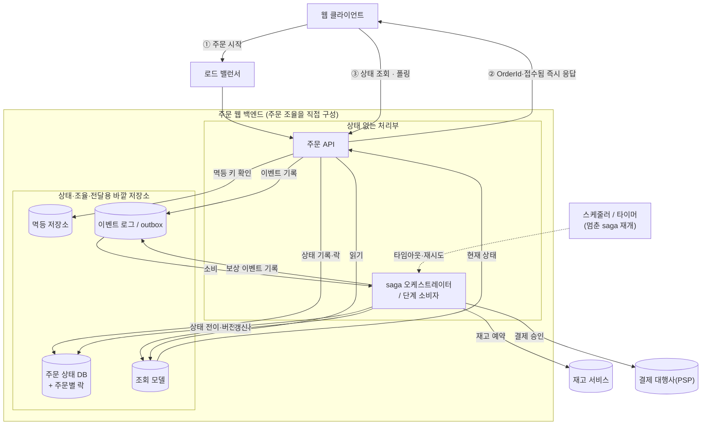
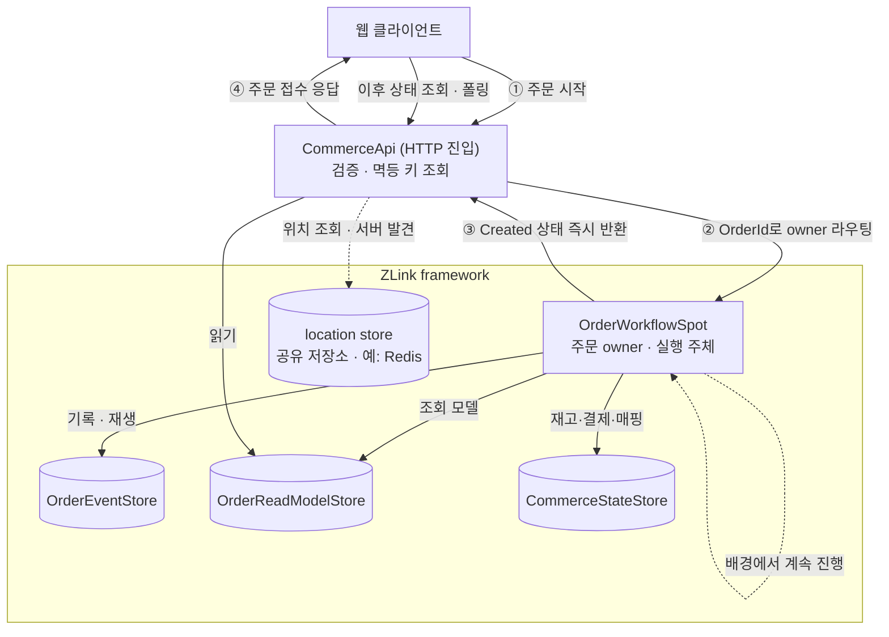
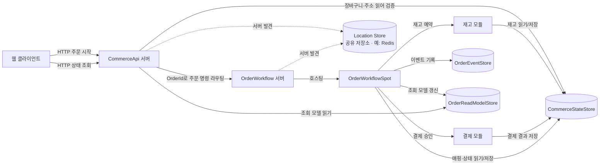
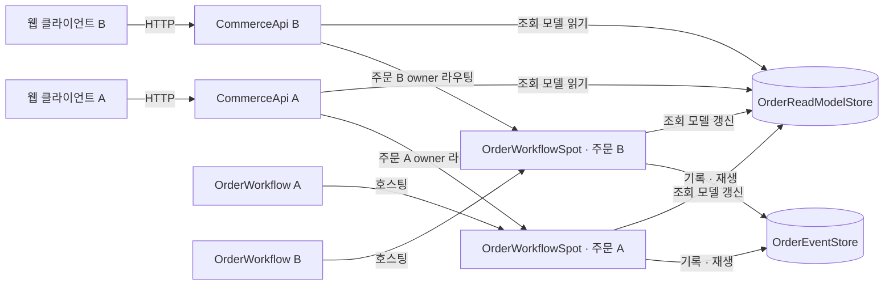
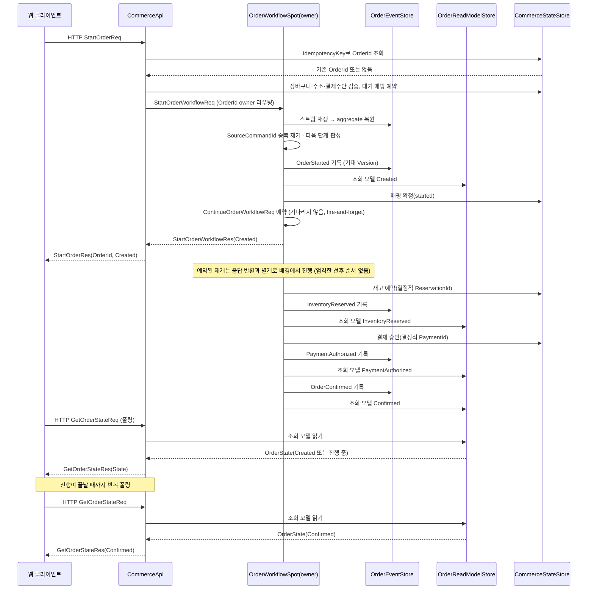

# ShoppingMall Sample Scenario

[Event 샘플 목록](README.ko.md)

> ShoppingMall은 주문 하나를 owner spot이 소유해서, 주문 처리 과정(재고 예약 → 결제 승인
> → 확정/보상)을 이벤트 소싱으로 진행하는 ZLink framework 샘플이다.

## 1. 목적과 의도

ShoppingMall이 보여 주려는 것은 하나다. **주문처럼 실패와 중복 요청이 잦은 도메인에서, 바깥
API 서버와 주문 처리 owner를 서로 다른 서버로 나눠도 상태 전이·복구·이력·조회를 명확하게 구성할
수 있다.** 이를 ZLink의 owner-actor(spot) 모델로 구현한다. 바깥 진입은 `CommerceApi`가 맡고,
주문별 상태 전이는 `OrderWorkflowSpot`이 소유한다.

핵심 흐름은 이렇다.

- 클라이언트는 `CommerceApi`에 HTTP로 주문 시작과 상태 조회를 요청한다.
- `CommerceApi`는 입력을 검증하고 멱등 키를 조회할 뿐, 주문 상태를 직접 바꾸지 않는다.
- `OrderWorkflowSpot`은 `OrderId`별 owner로 주문 처리를 진행하며 도메인 이벤트를 쌓는다.
- `OrderReadModelStore`는 조회에 쓰는 조회 모델(projection)을 담는다.
- `CommerceStateStore`는 장바구니 스냅샷, 재고 예약, 결제 결과, 멱등 키 매핑을 담는다.

**범위**: 이 샘플은 장바구니 구성이 끝나고 사용자가 **결제하기 버튼을 누른 시점**(`StartOrderReq`
전송)부터 시작한다. `CartId`가 가리키는 장바구니, 상품 조회, 담기/빼기 같은 장바구니 조작은 범위
밖이며 이미 존재한다고 전제한다. 어렵고 되돌리기 까다로운 문제(중복 클릭, 재고 경합, 결제 실패
보상, 서버 장애 뒤 재개)는 결제하기를 누른 이후에 생기고, 그 이전의 장바구니 관리는 되돌리기 쉬운
단순 CRUD라 이 정도 장치가 필요 없다.

주문 도메인이 이 목적에 잘 맞는 이유는 상태 전이가 뚜렷하고 보상이 자연스럽기 때문이다. 재고를
예약한 뒤 결제가 실패하면 예약을 되돌려야 하고, 사용자가 결제 버튼을 다시 누르거나 네트워크
재시도로 같은 요청이 여러 번 들어오는 일도 흔하다. 이벤트 소싱은 "시스템을 크게 키우려고"가
아니라 **왜 상태가 바뀌었는지 남기고, 조회 모델이 깨지면 다시 만들고, 실패 뒤 어디부터 다시
처리할지를 분명히 하려고** 쓴다.

ShoppingMall은 GameQuest와 달리 **유실이 허용되지 않는 도메인**이다. 재고·결제·확정은 잃거나
중복 지급되면 안 되므로, GameQuest의 진행 tier가 쓰는 "유실을 허용하는 전달 + reset 보정"을
쓰지 않는다. 대신 이벤트 스트림을 유실 없이 저장하고, 기대 버전으로 이전 owner를 막고(fencing),
멈춘 주문은 명시적으로 재개해서 무손실을 얻는다. 이 차이가 두 샘플의 설계를 가른다 — §5의 대비를
참고한다.

정리하면 [GameQuest](gamequest.ko.md)가 **대량 이벤트를 owner spot이 순서대로 처리해 실시간
전송까지 잇는(유실 허용)** 축이라면, ShoppingMall은 **요청 하나가 여러 단계의 상태 전이와
보상을 거치는(무손실) 이벤트 소싱 주문 처리** 축을 담당한다.

이 샘플을 읽는 렌즈 하나를 미리 준다. **여기서 owner spot의 이득은 처리량이 아니라, 재시도·중단에
안전한 다단계 트랜잭션(재고→결제→확정→보상)을 saga 오케스트레이터·조율 상태·스케줄러·outbox 없이
별도 조율 계층 없이 순차 코드로 쓴다는 것**이다. 웹 방식이 바깥 인프라로 조립하던 "진행 지점 저장·다음 단계 조율·
멈춘 작업 재개"가 여기서는 이벤트 스트림·이벤트 접기·스트림 재생 하나로 접힌다. 이 접힘을 §9.2에서
웹 saga와 코드로 나란히 대비한다.

## 2. 요구사항

### 2.1 기능 요구사항

- 주문 시작(장바구니·주소·결제수단)을 받아 주문 처리를 진행한다.
- 주문 처리는 재고 예약 → 결제 승인 → 확정의 여러 단계를 거치고, 실패하면 보상한다.
- 같은 주문 시작 요청이 여러 번 들어와도 **멱등하게** 하나의 주문으로 모은다.
- 현재 주문 상태를 조회로 보여 주고, 조회 모델이 깨지면 이벤트를 다시 재생(replay)해 복원한다.
- 성공/재고 실패/결제 실패 각 분기의 이벤트 순서와 종료 상태를 남긴다.

### 2.2 비기능 요구사항

| 축 | 요구 | 수단 |
|------|------|------|
| 확장성 | 주문 수에 맞춰 수평 확장, 단일 병목 없음 | `OrderId`별 owner spot을 노드에 분산(MeshNode) |
| 순서·일관성 | 같은 주문의 전이를 순서대로, 충돌 없이 | 주문당 owner 하나가 순서대로 처리 |
| 무손실 | 확정·재고·결제 상태를 잃지 않음 | `OrderEventStore`에 유실 없이 저장 + 기대 버전으로 이전 owner 차단 |
| 중복 방지 | 중복 시작·중복 지급 0 | `IdempotencyKey` 매핑 + 스트림 안 `SourceCommandId` 중복 제거 |
| 복구 | 처리 중 프로세스가 비정상 종료되어도 주문을 재개 | 이벤트 접기(fold)로 다음 단계 판정 + 명시적 재개 명령 |
| 이력·조회 | 왜 바뀌었는지 남기고 조회 | 이벤트 스트림(SoR) + 다시 재생 가능한 조회 모델 |

## 3. 비교 배경: 견고한 주문 workflow를 web backend로 지으면

작은 커머스라도 주문·재고·결제는 실패와 중복 요청을 견고하게 처리해야 한다. 같은 문제를 흔한
웹 백엔드로 지으면, 가장 어려운 부분은 **한 주문의 여러 단계 전이를 순서대로, 중복 없이, 중간에
프로세스가 비정상 종료되어도 이어서 진행하는 것**이다.

먼저 한계를 분리한다. 재고·결제가 이 샘플처럼 **한 저장소(RDB) 안의 로컬 연산**이라면, 가장 단순한
웹 형태는 아래 그림이 아니라 **트랜잭션 하나 + 상태 컬럼 + `IdempotencyKey` unique 제약**이다.
이 경우 outbox도 saga 오케스트레이터도 필요 없다. 따라서 이 비교는 "웹은 무조건 복잡하다"는
주장을 다루지 않는다.

비교가 실제로 시작되는 지점은 **트랜잭션 안에 넣을 수 없는 바깥 효과가 끼는 순간**이다. 결제
승인은 PSP(결제 대행사) 호출이라 DB 트랜잭션으로 못 감싸고, 재고가 별도 서비스/저장소로 나뉘면
여러 저장소에 걸친다. 그 순간 트랜잭션 하나로 묶던 방식이 깨지고, 아래 그림처럼 상태를 몰아가는
장치들을 서버 바깥에 구성해야 한다. 상태를 두지 않는 API 서버는 주문 상태를 소유하지 않으므로,
그 조율을 자기 밖에 둘 수밖에 없기 때문이다.



응답이 오가는 모양이 이 방식의 특징을 드러낸다. 주문 시작 요청의 HTTP 응답은 처리 완료가 아니라
**`OrderId`와 "접수됨"만 즉시** 돌려준다(②). 실제 결과(확정/실패)는 saga가 뒤에서 비동기로 진행해
조회 모델에 반영하고, 클라이언트는 **상태 조회를 반복(폴링)** 해서 확인한다(③). API 서버가 상태를
소유하지 않으므로 요청을 받은 시점에 결과를 반환할 수 없다. 조율은 saga가 담당하고 결과는 조회
모델로 확인하는 분리가 강제되는 것이다.

이 구성에서 주문 처리의 무손실과 순서를 보장하는 요소는 다음과 같다.

- **주문 상태 DB + 주문별 락/버전 검사**: 여러 API 서버가 같은 주문을 동시에 변경하지 못하게
  막는다.
- **saga 오케스트레이터(또는 이벤트 로그 + 단계 소비자)**: 예약 → 결제 → 확정을 순서대로 처리하고,
  실패하면 예약 해제 보상을 실행한다. 조율 상태를 유실 없이 저장해야 중단 후에도 재개할 수 있다.
- **outbox**: 상태 DB 쓰기와 이벤트 발행을 안전하게 묶는다. 이게 없으면 상태는 바뀌었는데 이벤트가
  안 나가거나, 그 반대가 된다(이중 쓰기 문제).
- **스케줄러/타이머**: 예약 후 다음 단계 전에 중단된 주문 처리를 재개하고, 바깥 호출에 timeout을
  건다. saga가 멈춘 채 방치되면 재고가 묶인다.
- **멱등 저장소**: `IdempotencyKey → OrderId` 매핑을 담아, 결제 버튼 재클릭·재시도를 같은 주문으로
  모은다. 별도 제품이 아니라 대개 RDB의 테이블 하나다(`IdempotencyKey`에 unique 제약을 걸면
  먼저 쓴 요청이 이기는 게 그 제약으로 보장된다) — 주문 상태 DB와 물리적으로 같은 DB인 경우도 많다.
- **조회 모델**: 주문 상태 조회를 상태 DB 경합 없이 받아 준다.

ShoppingMall은 이 조각들 중 **주문당 실행 주체 하나가 상태를 소유하고 이벤트 소싱으로
진행하는 부분**을 ZLink owner spot으로 표현하고, 단계 로직·재개 트리거·바깥 효과의 멱등성은
샘플이 직접 소유한다(§9).

이 샘플의 가장 강한 논거는 saga 스택 자체가 아니라 **바깥 효과를 재시도해도 안전하다는 점**이다.
트랜잭션으로 묶을 수 없는 결제 승인은, 프로세스 비정상 종료 후 재시도해도 같은 결제가 두 번
일어나면 안 된다. 그래서
`OrderId`와 단계에서 **결정적으로 만든 `PaymentId`로 승인을 요청**하고(§9.4), PSP는 같은 id로 다시
요청하면 최초 결과를 그대로 돌려준다. 이것이 실무에서 PSP 멱등 키로 하는 바로 그 방식이며,
"결제 호출은 트랜잭션에 못 넣는다"는 사실이야말로 트랜잭션 하나로는 닿지 못하는 지점이다. owner
spot은 이 결정적 id 발급과 재개를 한 주문 흐름 안에서 소유한다.

## 4. ZLink 샘플 구조

ZLink 구성에서도 주문 조율은 상태 없는 API 서버 바깥의 주문 owner로 모은다. `CommerceApi`는 HTTP를
받아 입력 검증과 멱등 키 조회만 한 뒤, 주문 처리 명령을 `OrderId` 기준으로 `OrderWorkflowSpot`에
라우팅한다. `OrderWorkflowSpot`은 같은 주문의 전이를 순서대로 처리하면서 상태 복원, 이벤트 기록,
재고/결제 모듈 호출, 조회 모델 갱신을 한 owner 흐름에 모은다.



응답이 오가는 모양이 웹 방식과 비슷해 보이지만 이유가 다르다는 게 차이다. 주문 시작 명령이 owner
spot으로 라우팅되면(②) 그 spot은 `Created`까지만 만들고 그 상태를 즉시 돌려주며(③),
`CommerceApi`는 그 결과를 그대로 응답한다(④). 결제 승인처럼 지연이 예측 안 되는 단계를 HTTP
응답 시간에 묶지 않기 위해서다. owner spot은 `Created`를 만든 뒤 재개 명령을 스스로, 응답을
기다리지 않고 예약한다(§9.3) — 그 재개가 예약 → 승인 → 확정을 배경에서 진행하는 시점은 응답
반환과 엄격한 순서가 없다. 클라이언트는 그 진행 결과를
`GetOrderStateReq` 폴링으로 확인한다. 웹 방식도 "접수됨"만 돌려주고 폴링을 강제했다는 점은
같지만(§3), 그 이유는 상태를 소유하지 않기 때문이었다. ZLink는 owner Spot이 상태를 소유하면서도
**의도적으로** 응답을 짧게 끊는다는 점이 다르다 — 필요하면 spot이 얼마든지 끝까지 진행하고 결과를
동기로 돌려줄 수도 있지만, 결제 지연을 클라이언트 요청에 묶지 않으려고 그렇게 하지 않는다.

`CommerceApi`는 HTTP 요청을 상태 없이 받아, `IdempotencyKey`로 기존 `OrderId`가 있는지 확인하고
`CommerceStateStore`에 대기(pending) 매핑을 예약한 뒤, 주문 처리 명령을 `OrderWorkflowSpot`으로
라우팅한다. owner spot이 아직 없으면 첫 명령에서 만들어진다. 그 spot이 상태 전이·이벤트 기록·모듈
호출·조회 모델 갱신을 전부 소유한다(구현 방식은 spot 자신의 handler가 직접 처리할 수도, spot
활성화를 보장한 뒤 같은 owner 보장 위에서 동작하는 서비스가 처리할 수도 있다 — 어느 쪽이든
per-order 직렬화는 owner routing이 보장한다). 서버 위치 발견(`CommerceApi`가 `OrderWorkflow`
mesh를 찾는 것)은 framework의 location store 계약을 쓴다 — 공유 저장소 구현체(예: Redis)만
꽂으면 등록·조회·자동 연결은 framework가 알아서 한다.

§3의 조각이 왜 사라지는가 — 주문당 순서 처리와 상태 소유를 base system이 대신하기 때문이다.

| 웹 방식 구성요소 | 왜 필요했나 | ShoppingMall에서의 대응 |
|------|------|------|
| 주문 상태 DB + 주문별 락 | 여러 서버가 같은 주문을 동시에 수정 | 같은 `OrderId`는 owner spot 하나가 순서대로 처리 |
| saga 오케스트레이터 / 단계 소비자 | 여러 단계 전이·보상을 순서대로 조율 | owner spot이 이벤트 접기로 다음 단계를 판정해 직접 진행(§9) |
| 이벤트 로그 + outbox | 상태와 이벤트 발행의 이중 쓰기 방지 | 상태 = `OrderEventStore` 이벤트의 접기라, 상태 변경과 이벤트가 한 번의 기록으로 끝난다. 조회 모델·바깥 효과(재고·결제)와의 이중 쓰기는 남지만, 다시 재생·결정적 id·재개로 그 틈을 닫는다(§9.4) |
| 버전 검사 / 분산 락 | 동시·재진입 수정 방지 | owner 하나 + 기록 시 기대 `Version` 검사로 이전 owner 차단(re-home 순간 방어) |
| 멱등 저장소 | 결제 재클릭·재시도 걸러내기 | `CommerceStateStore` 매핑 + 스트림 안 `SourceCommandId` 중복 제거 |
| 조회 모델 | 상태 조회 | `OrderReadModelStore` 조회 모델(그대로 유지 — 다시 재생으로 재생성 가능) |
| 스케줄러/타이머 | 멈춘 saga 재개 | 명시적 재개 명령 + 복구 훑기(§9) |

`OrderReadModelStore`와 멱등 처리는 웹 방식에도 있는 조각이라 그대로 남는다. 사라지는 것은
락·오케스트레이터·outbox·로그 같은 조율 인프라이고, 그 자리를 owner spot의 순서 실행과 이벤트
접기가 대신한다.

한눈에 보면:

| 그대로 유지 | 형태만 바뀜 | 완전히 사라짐 |
|---|---|---|
| CommerceApi(주문 API) | 주문 상태 DB → OrderEventStore + owner 메모리 | saga 오케스트레이터/조율 상태 |
| 멱등 저장소(매핑) | 로드 밸런서는 남되 owner 라우팅이 부작용 제거 | outbox |
| 조회 모델 | | 스케줄러/타이머 |
| 재고 서비스·PSP(외부 의존) | | 주문별 락·분산 락 |

진입부(API·멱등·조회 모델·외부 의존)는 웹과 ZLink가 거의 같다. ZLink에서 별도로 구성하지 않는
부분은 **진행 지점 저장, 다음 단계 전환, 중단 뒤 재개를 담당하는 조율 인프라 3종**이다. ZLink는
이 책임을 각각 이벤트 스트림·이벤트 접기·스트림 재생 하나로 처리한다(§9.2).

## 5. 운영 특성

ShoppingMall은 유실이 허용되지 않는 도메인이라 [GameQuest](gamequest.ko.md)와 반대 지점에 선다.
아래 특성을 GameQuest 진행 tier와 나란히 보면 두 샘플의 역할 분담이 분명해진다(같은 대비 표가
[GameQuest §5](gamequest.ko.md)에도 대칭으로 실려 있다).

| 축 | ShoppingMall (무손실 주문 처리) | GameQuest (진행 tier, 참고) |
|------|------|------|
| 전달 | 명령을 owner에 유실 없이 기록(유실 불가) | 유실을 허용하는 전달 |
| 동시성 | owner 하나 + 기대 버전으로 이전 owner 차단 | owner 하나(차단 불필요, 유실 허용) |
| 이벤트당 비용 | 상태 = 이벤트 접기. 기록이 곧 상태 전이 | 메모리에 반영 + 기록 |
| 노드 장애 | 다른 노드가 이어받아(re-home) 다시 재생으로 복원, 기대 버전이 두 owner가 겹치는 순간을 차단 | 이어받아 다시 재생, 유실은 reset으로 보정 |
| 멈춘 작업 | 명시적 재개 명령으로 잇는다(§9) — 재고가 묶이므로 필수 | 유실은 reset/reconcile로 흡수 |
| 조회 | 조회 모델 폴링(`GetOrderStateReq`) | 실시간 전송(push) |

핵심은 이렇다. **주문 처리는 무손실이 필요해서 GameQuest처럼 유실을 reset으로 흡수할 수 없다.
그래서 owner Spot의 순서 처리에 유실 없는 이벤트 스트림, 기대 버전 차단과 명시적 재개를 추가한다.**
GameQuest는 owner 하나로 순서를 잡는 것만으로 충분했지만, ShoppingMall은 여기에 차단과 재개를 더
추가한다. 그럼에도 웹 방식의 오케스트레이터·outbox·락 조율은 필요하지 않다. 해당 책임을 base
system의 owner 실행과 이벤트 접기가 대신하기 때문이다.

## 6. 서버 구성

클라이언트가 마주하는 창구는 `CommerceApi` 하나뿐이다. 클라이언트는 `OrderWorkflow`나 재고·결제
서버를 직접 알지 못한다. `CommerceApi`는 요청 검증·멱등 키 조회·상태 조회를 맡고, 주문 상태 전이는
`OrderWorkflow` 서버의 `OrderWorkflowSpot`이 소유한다.



`OrderEventStore`는 주문 상태의 기준이 되는 이벤트 스트림이고, `OrderReadModelStore`는 조회용
조회 모델이다. 서버 위치 발견은 별도 registry 프로세스 없이 공유 location store를 쓴다.

| 서버 | 책임 |
|------|------|
| `ShoppingMall.CommerceApi` | HTTP API, 장바구니·주소·결제수단 입력 검증, 멱등 키 조회, 조회 모델 조회. `OrderId` owner로 주문 명령 전달. |
| `ShoppingMall.OrderWorkflow` | `OrderWorkflowSpot` 호스팅, 주문 이벤트 기록, 조회 모델 갱신, 재고/결제 모듈 호출, 재개 처리. |

| 구성 | 책임 |
|------|------|
| `Location Store` | framework location store 계약의 공유 저장소 구현체(예: Redis). `CommerceApi`·`OrderWorkflow` 서버 발견(자동 연결)과 spot 위치 조회를 담으며, 등록·조회·수명 관리는 framework가 소유. |

저장소는 별도 ZLink 서버가 아니라 여러 서버가 공유하는 의존물로 둔다.

| 저장소 | 성격 | 책임 |
|------|------|------|
| `OrderEventStore` | 기준 저장소(SoR, 이벤트 스트림) | `OrderId`별로 주문 도메인 이벤트를 덧붙이기만 하는 스트림. owner spot이 재생·기록하는 원천. 기록 시 기대 버전 검사. |
| `OrderReadModelStore` | 조회 모델 | 조회용 현재 주문 상태. 이벤트 스트림을 다시 재생해 재생성 가능. |
| `CommerceStateStore` | 업무 상태·바깥 효과 | 장바구니 스냅샷, 재고 예약(`ReservationId`), 결제 결과(`PaymentId`), `IdempotencyKey→OrderId` 매핑. |

샘플 실행은 API 서버의 수평 확장과 주문 owner 분산을 함께 보려고 `CommerceApi`와 `OrderWorkflow`를
각각 2대씩 시작한다.



`주문 A`의 명령이 어느 `CommerceApi`로 들어와도, owner 라우팅이 항상 같은 `OrderWorkflowSpot`
owner로 이어 준다.

수평 확장 검증:

- 어느 `CommerceApi`가 `StartOrderReq`를 받아도 같은 계약으로 처리한다.
- 같은 `OrderId`의 이벤트는 항상 같은 `OrderWorkflowSpot` owner 흐름에서 기록·조회 모델 갱신된다.
- 서로 다른 주문은 서로 다른 `OrderWorkflow` 서버에서 동시에 처리된다.
- 특정 `OrderWorkflow`를 재시작해도 owner spot이 `OrderEventStore`를 다시 재생해 복원한다.

## 7. 책임 분리

| 구분 | 담당 | 책임 |
|------|------|------|
| 바깥 API 진입 | CommerceApi HTTP | 주문 시작·상태 조회·self-check 명령 수신. |
| 검증·멱등 | CommerceApi | 장바구니/주소/결제수단 검증, `IdempotencyKey→OrderId` 매핑 예약. |
| 주문 명령 전달 | `CommerceApi` → `OrderWorkflow` | 검증된 명령을 `OrderId` owner로 전달. |
| 주문 owner | `OrderWorkflowSpot` | 이벤트 스트림 재생, 상태 전이, 모듈 호출, 도메인 이벤트 기록, 재개. |
| 이벤트 스트림(SoR) | `OrderEventStore` | 주문별 도메인 이벤트를 덧붙이기만 하는 저장, 재생 원천. |
| 조회 모델 | `OrderReadModelStore` | 현재 주문 상태 조회 응답. |
| 업무·바깥 상태 | `CommerceStateStore` | 장바구니, 재고 예약, 결제 결과, 멱등 키 매핑. |
| 서버 발견 | location store | `CommerceApi`·`OrderWorkflow` 서버 자동 발견·연결. |

`OrderWorkflowSpot`이 한 주문의 처리 전이를 **전부 소유**한다. 여러 주문을 가로지르는 집계(매출
리포트, 재고 소진 대시보드 등)만 owner 밖으로 나가며, 그건 §14 확장으로 둔다.

## 8. 라우팅·소유권 규칙

| 대상 | 기준 id | 규칙 |
|------|---------|------|
| API 요청 처리 | HTTP 엔드포인트 | 어떤 `CommerceApi`가 받아도 된다. |
| 주문 명령 전달 | `OrderId` | `CommerceApi`가 `OrderWorkflow` mesh로 주문 명령을 owner 라우팅. |
| 주문 owner | `OrderId` | 같은 `OrderId`는 항상 같은 `OrderWorkflowSpot` owner로 라우팅. |
| 이벤트 기록 | `OrderId`, 스트림 `Version` | `OrderWorkflowSpot`만 기록하고, 기대 버전 검사로 충돌·재진입을 막는다. |
| 조회 모델 갱신 | `OrderId`, 스트림 `Version` | 기록된 도메인 이벤트만 조회 모델에 반영. |
| 멱등 시작 | `IdempotencyKey` | 같은 시작 요청은 같은 `OrderId`로 모이고, 확정된 매핑은 같은 조회 모델을 돌려준다. |

`CommerceApi`는 HTTP를 상태 없이 받는다. 시작 요청은 어느 서버가 받아도 `OrderId` owner로
전달되고, 상태 조회는 조회 모델을 읽어 응답한다. `OrderId`는 `StartOrderReq`를 처음 처리할 때
만든다. `CommerceStateStore`는 `IdempotencyKey→OrderId` 매핑과 그 처리 상태를 저장하며, 이
저장소는 `CommerceApi`와 `OrderWorkflow` 양쪽이 공유해서 쓴다. `CommerceApi`가 먼저 대기(pending)
매핑을 예약해서 같은 `IdempotencyKey` 재시도가 같은 `OrderId`로 가게 하고, owner spot이
`OrderStartedEvent` 기록과 `Created` 조회 모델 갱신을 끝낸 뒤(§9.1) 응답을 돌려주기 전에 그
매핑을 확정(started)한다 — `CommerceApi`가 응답을 받은 뒤 확정하는 게 아니다.
`OrderStartedEvent.SourceCommandId`에는 `IdempotencyKey` 값을 쓴다.

### 왜 UserId가 아니라 OrderId를 owner 키로 쓰나

owner spot을 무엇에 매칭할지는 "가장 자연스러운 엔티티"가 아니라 **어떤 불변식이 단일 소유자를
필요로 하는가**, 즉 도메인의 일관성 경계로 정한다. checkout이 지키려는 불변식(재고 예약 → 결제 →
확정 → 실패 시 보상, 중복 결제 금지, 버전 차단)은 전부 **주문 하나 안에서** 성립한다. DDD로 말하면
애그리거트 루트가 Order이지 User가 아니다. 그래서 `OrderId`가 owner 키다. 구체적으로:

- **스트림 경계와 일치**: `OrderEventStore` 스트림 키가 `OrderId`라, spot = 애그리거트 = 스트림 경계가
  일치한다. UserId로 묶으면 한 사용자의 여러 주문이 한 스트림에 섞이거나 한 spot이 여러
  주문 스트림을 들어야 해서 재생·스냅샷이 복잡해진다.
- **독립 주문의 병렬성**: 한 사용자의 서로 다른 주문은 순서를 지킬 이유가 없다. UserId owner면
  그 독립 주문들이 owner 하나에서 불필요하게 직렬화되고, 요청량이 많은 사용자의 spot이 병목이 된다.
  `OrderId`는 주문별로 부하를 분산한다.
- **수명**: 주문은 확정/실패로 종료되는 transient owner다. 사용자 owner는 장기간 유지되므로 별도
  정리 정책이 필요하다.

**실제 per-user 불변식이 있을 때만** 사용자 소유자가 정당해진다 — 여러 주문이 공유해 차감하는 적립금·
크레딧·지출 한도, 사용자당 순차 사기 판정 등. 이때도 `OrderId`를 `UserId`로 바꾸는 게 아니라
**소유자 계층을 둘로 나눈다**: 사용자 불변식을 소유하는 per-user 계정 spot과, 각 checkout을
소유하는 per-order spot을 두고, per-order spot이 크레딧이 필요하면 계정 spot을 재고·결제 모듈처럼
한 단계로 호출한다. 이러면 주문 병렬성은 유지하면서 사용자 단위 경합만 계정 spot에서 직렬화된다.

참고로 옆 [GameQuest](gamequest.ko.md)는 `PlayerId`를 owner 키로 쓴다. 모순이 아니라 같은 원칙의
다른 답이다 — 거기서는 한 플레이어의 모든 gameplay 이벤트가 per-player 진행으로 접히므로 일관성
경계가 플레이어다. **owner 키 = 도메인의 일관성 경계**라는 원칙이 두 샘플에서 다른 키를 낳는다.

### 반드시 지킬 경계

아래 경계를 어기면 `CommerceApi`와 `OrderWorkflowSpot`의 책임이 섞여 수평 확장 라우팅과 owner
검증이 의미를 잃는다.

- `CommerceApi`는 `OrderWorkflowSpot`을 호스팅하지 않는다.
- `CommerceApi`는 `OrderAggregate`나 `OrderEventStore` 기록, 조회 모델 재생성을 직접 호출하지 않는다.
- `CommerceApi`는 `StartOrderReq`를 검증한 뒤 `StartOrderWorkflowReq`를 `OrderWorkflow` mesh로 보낸다.
- 주문 시작·재개·조회 모델 재생성은 `OrderWorkflowSpot`으로 보내는 명시적 명령 메시지로 처리한다.
- `GetOrCreate`의 생성 payload를 주문 시작 명령처럼 쓰지 않는다. 생성 payload에는 spot 식별자나 초기화 정보만 담는다.
- `OrderWorkflowSpot.OnCreate`는 업무 상태 전이를 실행하지 않는다. 전이는 명령 handler에서 시작한다.
- `GetOrderStateReq`는 `OrderReadModelStore` 조회 모델만 읽는다. 조회가 주문을 진행시키거나 이벤트를 기록하면 안 된다.
- 조회 모델 재생성은 `CommerceApi`가 저장소를 직접 고치지 않고 `OrderWorkflow`로 넘기며, owner spot이 재생으로 처리한다.

## 9. 이벤트 소싱과 주문 처리 진행

아래에서 "owner spot이 진행한다/호출한다/기록한다"는 표현은 그 spot이 소유한 per-order
직렬화·상태를 가리킨다. 반드시 spot 자신의 메시지 handler가 그 코드를 실행한다는 뜻은 아니다.
§4에서 설명한 것처럼 spot handler가 직접 처리할 수도 있고, owner 활성화를 보장한
뒤 같은 직렬화 보장 위에서 별도 서비스 코드가 처리할 수도 있다.

이 샘플의 핵심은 owner spot이 **여러 단계의 주문 처리를 어떻게 유실 없이 진행하고 복구하는가**다.
`OrderWorkflowSpot`은 현재 상태를 그대로 저장하지 않는다. **도메인 이벤트를 덧붙이고, 그 이벤트를
다시 재생해 상태를 복원하는 이벤트 소싱 집계(aggregate)**이며, 다음 단계는 이벤트를 접은(fold)
결과가 결정한다.

### 9.1 처리 루프

owner spot이 주문 명령(`StartOrderWorkflowReq`, `ContinueOrderWorkflowReq`)을 받으면 공통으로
아래 루프를 실행한다. **`StartOrderWorkflowReq`는 이 루프의 한 단계((none)→Created)만 실행하고
응답한다. `ContinueOrderWorkflowReq`는 다음 단계가 없을 때까지 같은 루프를 실행한다.** 두 명령은
같은 코드를 사용하며 실행할 단계 수만 다르다. 자세한 시작/재개 관계는 §9.3에서 다룬다.

```text
주문 명령 c (OrderId) 처리:
  1. OrderEventStore에서 이 주문의 이벤트 스트림을 재생 → OrderAggregate 복원
        (처음 깨어난 경우 빈 aggregate)
  2. c.SourceCommandId가 이미 스트림에 있으면 조회 모델을 fold와 맞춘 뒤 반환      # 명령 중복 제거
  3. aggregate가 종료(Confirmed/Failed)면 조회 모델을 fold 결과와 맞춘 뒤 반환      # 재진입·조회 모델 치유
  4. (StartOrderWorkflowReq는 아래 한 단계만, ContinueOrderWorkflowReq는 다음 단계가
     없을 때까지) fold 결과로 다음 단계를 판정하며 진행:
        (none)                     → OrderStartedEvent → Created        # Start는 여기서 멈춤
        Created                    → 재고 예약(module 최초결과):
                                       성공 → InventoryReservedEvent
                                       실패 → InventoryReservationFailedEvent
        InventoryReserved          → 결제 승인(module 최초결과):
                                       성공 → PaymentAuthorizedEvent
                                       실패 → PaymentFailedEvent
        PaymentAuthorized          → OrderConfirmedEvent            # terminal
        PaymentFailed              → 재고 예약 해제(module) → InventoryReleasedEvent  # 보상
        InventoryReleased          → OrderFailedEvent               # terminal
        InventoryReservationFailed → OrderFailedEvent               # terminal
  5. 각 단계에서 도메인 이벤트를 기대 Version으로 기록한 뒤 fold·조회 모델 갱신
        (기록 = 상태 전이, 조회 모델은 기록 직후 반영)
  6. 이번 명령이 멈추기로 한 지점에 도달하면(Start는 Created, Continue는 종료) 그 시점의
     OrderState를 명령 응답으로 반환
```

step 3에서 종료 상태여도 조회 모델을 fold와 맞추는 이유가 있다. 종료 이벤트를 기록한 직후, 조회
모델 갱신 전에 프로세스가 비정상 종료되면 aggregate는 종료 상태지만 조회 모델은 이전 상태(예: PaymentAuthorized)로 남는다.
이때 재개가 종료 상태라는 이유로 현재 조회 모델만 반환하면 이전 조회 모델이 계속 불일치 상태로 남는다.
그래서 재진입도 fold 결과로 조회 모델을 먼저 맞춘다 — 이것이 §9.5의 "몇 번을 재개해도 결과가 같다"가
성립하는 조건이다. step 4 판정표가 보상 구간(`PaymentFailed`·`InventoryReleased`·
`InventoryReservationFailed`)까지 다음 단계를 갖는 이유도 같다. 결제 실패 분기는 기록이 세
번(`PaymentFailed → InventoryReleased → OrderFailed`)이라 그 사이에 프로세스가 비정상 종료될 수 있으므로,
어느 지점에서 재개해도 fold가 다음 단계를 알아야 한다.

핵심은 **상태 = 이벤트를 접은 결과**이고 **다음 단계 = 그 접은 결과**라는 것이다. 그래서 이 루프는
시작과 재개 모두 같은 코드를 실행한다. aggregate 진행 지점이 스트림에 기록되므로 재개 시
"이미 끝난 단계는 건너뛰고 다음부터"가 별도 분기 없이 이어진다. `OrderWorkflowSpot`이 owner라 기록은 한 줄로
순서가 잡히고, 웹 방식의 오케스트레이터 조율 상태나 outbox가 필요 없다.

### 9.2 무엇이 사라졌나 — saga 인프라가 순차 코드로 접힌다

이 샘플의 실제 이득은 처리량이 아니라 **위 루프가 별도 saga 인프라 없이 순차 코드라는 것**이다.
같은 checkout을 웹 방식으로 구현하면 다단계·재시도·crash 재개를 처리하기 위해 아래 요소가
필요하다. 표는 ShoppingMall에서 각 책임을 어떻게 처리하는지 비교한다.

| 웹 saga 구성 요소 | 웹 saga에서 담당하는 책임 | ShoppingMall의 책임 배치 |
|------|------|------|
| 오케스트레이터 / 단계 소비자 | 현재 단계와 다음 단계를 결정 | **다음 단계 = 이벤트 접기 결과.** 별도 조율 주체 없이 aggregate가 다음 단계를 결정한다 |
| durable 조율 상태(saga instance) | crash 뒤에도 "이 주문이 결제 대기였다"를 알아야 함 | **상태 = 이벤트 스트림.** 조율 상태를 따로 저장하지 않는다. 스트림 자체가 진행 지점이다 |
| 스케줄러 / 타이머 | 중단된 saga의 다음 단계를 재개 | **재개 = 스트림 재생.** 재개 명령 또는 재활성화가 같은 루프를 실행하면 fold가 중단된 지점부터 이어진다(§9.5) |
| outbox | 상태 DB 쓰기와 이벤트 발행의 이중 쓰기 방지 | **기록 = 상태 전이라 이중 쓰기가 없다.** 외부 발행이 필요한 경우만 §14 확장 |
| 주문별 락 / 낙관적 버전 재시도 | 여러 소비자의 같은 주문 동시 처리 방지 | **owner 하나가 소유** → 정상 경로엔 경쟁 writer가 없다. re-home 순간만 기대 버전으로 차단(§9.4) |

정리하면 웹 saga는 진행 지점 저장, 다음 단계 결정과 중단 뒤 재개를 모두 외부 인프라로 구성해야 한다.
ShoppingMall은 그 셋을 각각 **이벤트 스트림·이벤트 접기·스트림 재생**
하나로 흡수한다. 그래서 checkout이 상태 머신 인프라가 아니라 위 §9.1 같은 **한 덩어리 순차 코드**로
읽힌다. 이것이 이 샘플이 보여 주려는 큰 이득이다.

같은 로직을 두 방식으로 나란히 놓으면 대비가 분명하다.

```text
# 웹 saga — 진행 지점·조율·재개가 바깥 인프라에 흩어진다
on StartOrder(req):
  order = db.insert(state=CREATED, version=0)          # 상태 DB
  idem.reserve(req.key -> order.id)                     # 멱등 저장소
  log.append(OrderStarted)                              # 이벤트 로그
  outbox.enqueue(OrderStarted)                          # outbox(이중 쓰기 방지)
  return Accepted(order.id)                             # 결과는 아직 모름 → 클라이언트는 폴링

consumer on OrderStarted:                               # 오케스트레이터/소비자
  order = db.load(id); check(order.version)             # 락/버전 재시도
  if reserve(deterministicResId): db.update(RESERVED)   # 단계마다 상태 저장
  else: db.update(FAILED); return
  outbox.enqueue(InventoryReserved)

consumer on InventoryReserved:                          # 다음 단계도 별도 consumer
  ... 결제 승인 → db.update(AUTHORIZED) → outbox ...
  ... 확정 → db.update(CONFIRMED) → outbox ...

scheduler every N초:                                    # 멈춘 saga 재개
  for order in db.where(state not terminal, stuck):
    reissue(order)                                      # 어느 단계였는지 상태로 되짚어 재시도
```

```text
# ShoppingMall — 진행 지점·조율·재개가 owner 안 한 덩어리로 접힌다
on WorkflowCommand(orderId, stopAfterFirstStep):        # §9.1 그 루프 (Start=true, Continue=false)
  agg = replay(OrderEventStore[orderId])                # 진행 지점 = 스트림
  step = nextStep(agg)                                  # 조율 = 이벤트 접기
  while step:                                           # 시작이든 재개든 같은 코드
    ev = runStep(step, deterministicId(orderId, step))  # 재고/결제 모듈 호출
    append(OrderEventStore, ev, expectedVersion)        # 기록 = 상태 전이(이중 쓰기 없음)
    updateProjection(ev); agg.fold(ev)
    if stopAfterFirstStep: return agg.state             # Start는 Created 단계까지 실행
    step = nextStep(agg)
  return agg.state                                      # Continue는 종료 상태까지 실행하고 반환
# 재개: 같은 함수를 stopAfterFirstStep=false로 다시 호출하면 replay가 중단 지점을 복원 → nextStep이 계속 실행
```

### 9.3 시작·진행·응답

`StartOrderWorkflowReq` handler는 위 루프를 **`Created`까지만 돌리고 그 상태를 즉시 응답으로
돌려준다.** 결제 승인처럼 지연을 예측할 수 없는 단계를 HTTP 응답 시간에 묶지 않기 위해서다.
handler는 `Created`를 만든 뒤 같은 흐름 안에서 스스로 `ContinueOrderWorkflowReq` 호출을
**기다리지 않고 예약**한다. 그 재개 호출은 응답을 반환하는 것과 별개로(응답보다 먼저 시작될 수도,
동시에 진행될 수도 있다) 배경에서 나머지 단계(예약 → 승인 → 확정/보상)를 진행하며, 클라이언트가
그 결과를 실제로 보는 시점은 항상 응답 이후의 `GetOrderStateReq` 폴링이다.

이 "시작이 스스로 재개를 예약"하는 동작은 §9.5의 crash 뒤 재개와 **같은 메커니즘**이다. 다음
단계가 fold 결과로 정해지므로, 재개 호출이 시작 쪽에서 예약되든, 외부 훑기가 나중에 걸든
루프 코드는 다르지 않다 — 차이는 그 재개를 "누가, 언제" 부르느냐뿐이다. 그래서 이 설계는 동기/
비동기 두 갈래 코드를 갖는 게 아니라, "시작은 항상 `Created`까지 + 재개 호출 하나"로 통일된다.

응답까지 terminal 상태를 기다리는 완전 동기 변형도 만들 수는 있다 — handler가 자기 재개 호출을
기다렸다가 최종 `OrderState`를 돌려주면 된다. 다만 그러면 결제 지연이 그대로 HTTP 응답 지연이
되므로, 이 샘플은 그 변형을 기본으로 두지 않는다.

### 9.4 무손실을 떠받치는 규칙

- **기대 버전으로 이전 owner 차단**: 기록할 때 기대 `Version`을 함께 넣는다. 노드 장애로 owner가
  다른 노드로 넘어가는(re-home) 순간 이전 owner가 일시적으로 실행을 계속해도 두 owner의 기록 중 하나만
  성공하고 다른 하나는 버전 충돌로 거부된다. 거부당한 owner는 스트림을 다시 읽어 aggregate를
  재구성한 뒤 종료·중복 여부를 다시 판정한다. GameQuest는 유실을 허용해서 owner 하나로 순서만
  보장하면 충분했지만, 무손실 도메인인 ShoppingMall은 이 차단을 추가한다(§5).
- **명령 중복 제거**: 반영한 `SourceCommandId`를 스트림에 기록해, 같은 명령이 다시 와도 중복
  반영하지 않는다. 같은 `IdempotencyKey`의 시작 요청은 같은 `SourceCommandId`를 만든다.
- **결정적인 바깥 효과 id**: 재고 예약·결제 승인은 `CommerceStateStore`(바깥 상태)에 쓰고 그 결과
  이벤트를 기록한다. 이 둘 사이에서 프로세스가 비정상 종료된 뒤 재개해도 안전하도록,
  `ReservationId`·`PaymentId`는
  `OrderId`와 단계에서 **결정적으로 만든다**. 재고·결제 모듈은 같은 id로 다시 요청하면 **최초
  시도의 결과(성공/실패)를 그대로 돌려주는** 멱등 연산이어야 한다 — 아무것도 안 하는 게 아니라
  최초 결과를 돌려줘야 하는 이유는, 재개하는 owner가 그 결과를 받아야 다음 이벤트(승인 vs 실패)를
  정할 수 있기 때문이다. 따라서 "예약은 완료되었지만 이벤트 기록 전에 workflow가 중단된" 경우에도 재개가 같은
  id로 다시 요청해 최초 결과를 받고 그에 맞는 이벤트만 기록한다. 이것이 실무 PSP 멱등 키 동작과
  같으며, 이벤트 스트림과 바깥 상태의 이중 쓰기 틈을 닫는 방식이다.
- **조회 모델 재생성**: `OrderReadModelStore`를 지워도 `OrderEventStore`를 다시 재생해 같은 상태를
  복원한다. 조회 모델은 기준이 아니라 파생물이다.

### 9.5 비정상 종료 후 복구와 재개

owner spot이 checkout 도중에 멈추면 그 주문은 스트림상 아직 종료(Confirmed/Failed)가 아닌 채로
남는다. 결제 단계 주변에서 이런 중단이 실제로 생기는 경우는 다음과 같다.

- **owner 노드의 비정상 종료 또는 재시작**: `InventoryReserved` 기록 직후~결제 호출 사이, 또는 결제 호출
뒤 `PaymentAuthorized` 기록 전에 노드가 비정상 종료되면 주문이 `InventoryReserved` 상태에서 진행되지 않는다.
- **spot re-home**(배포·리밸런스·노드 드레인): 배포로 노드를 내리거나 MeshNode가 재배치되는
  순간 owner가 다른 노드로 넘어가면, 새 owner가 스트림을 재생해 이어야 한다.
- **PSP 호출 중 연결 종료**: 결제 승인을 PSP에 호출했는데 응답을 받기 전에 프로세스가 비정상
  종료되거나 timeout이 발생하면, owner는 **결제의 실제 완료 여부를 확인할 수 없는** 상태로 중단된다.

결제 단계의 "다시 시작"은 두 하위 경우로 갈린다. **PSP를 부르기 전에 멈췄으면** 쉽다 — 재개가
fold로 "아직 결제 안 함"을 보고 결제부터 부른다. **PSP를 불렀는데 결과를 모르면**(위 세 번째)
어렵고, 이것이 §9.4의 결정적 `PaymentId`가 존재하는 이유다. 재개한 owner가 같은 `PaymentId`로
PSP를 다시 호출하면 PSP가 최초 결과(승인/거절)를 그대로 돌려주므로, owner가 실제 결과를 알아내
그에 맞는 이벤트만 기록한다 — **이중 청구가 나지 않는다.**

이 중단들은 모두 "장애로 인한" 것이다. 장애가 없어도 본질적으로 재개가 필요한 결제(계좌이체, 3DS
인증, "pending"으로 응답하는 비동기 승인 등)는 PSP가 즉시 성패를 주지 않고 나중에 확정하므로 그
시점에 재개해 이어야 한다. 현재 샘플은 결제를 동기 성공/실패로 단순화해 이 비동기 경우를 다루지
않고 production 확장으로 둔다.

재개 경로는 하나의 메커니즘(`ContinueOrderWorkflowReq(OrderId)`가 §9.1 workflow loop를 다시 실행한다)을
"누가, 언제" 부르느냐로 나눠 쓴다.

- **정상 진행**: §9.3에서 본 것처럼, `Created`를 응답한 owner spot이 같은 흐름에서 스스로
  재개를 호출한다. 이게 이 샘플의 기본 경로이며, 대부분의 진행은 crash 없이 이 자기 호출만으로
  완료된다.
- **crash 뒤 복구 시작 조건**: 자기 호출을 처리하는 프로세스가 중간에 비정상 종료되면(위 세 가지 경우)
  해당 주문은 외부에서 재개 요청을 보내기 전까지 진행되지 않는다. 기본 샘플은 클라이언트 재시도(같은 `IdempotencyKey`의
  `StartOrderReq`, 또는 `GetOrderState` 뒤 사용자 재시도)가 이 복구 재개를 부른다.
  production에서는 아직 종료가 아닌 주문을 주기적으로 훑어 `ContinueOrderWorkflowReq`를 보내는
  **복구 훑기**를 둔다(재고가 묶이므로 방치할 수 없다). 샘플은 클라이언트가 부르는 복구 재개만
  검증하고, 훑기는 확장으로 둔다.

fold가 다음 단계를 "결제 승인 시도"처럼 정확히 판정하므로, 정상 진행이든 crash 복구든 예약이
끝난 주문은 예약 단계를 건너뛰고 다음부터 잇는다 — 코드 경로는 항상 하나다.

재개가 무손실인 근거는 9.4의 결정적 id와 명령 중복 제거다. 재개는 이미 기록된 이벤트를 다시 쓰지
않고(fold가 건너뛴다), 바깥 효과는 같은 id로 최초 결과를 돌려받으므로, 몇 번을 재개해도 결과가
같다.

## 10. DDD·Hexagonal 구조

주문 상태 전이, 결제 실패 보상, 종료 상태, 이벤트 생성은 domain에 둔다. HTTP handler, ZLink Spot
handler, repository는 adapter로 둔다.

| 레이어 | 책임 | 의존 |
|--------|------|------|
| `Domain` | 상태 전이, 재고/결제 결과 적용, 보상 규칙, 도메인 이벤트 생성 | framework·저장소 구현을 모른다. |
| `Application` | 주문 시작, 진행/재개, 조회 모델 재생성, 조회 유스케이스 | domain과 port에 의존. |
| `Ports` | 이벤트 저장소, 조회 모델, 업무 상태를 interface로 정의 | 구현체를 모른다. |
| `Infrastructure` | HTTP handler, ZLink Spot, repository 구현 | port를 호출하거나 구현. |

`CommerceApi` 서버 구조:

```text
Server/CommerceApi/
  Application/
    StartOrderUseCase
    GetOrderStateUseCase
  Ports/
    Outbound/
      OrderReadModelPort
      CommerceStateStorePort
      OrderWorkflowCommandPort
  Infrastructure/
    Http/
      StartOrderHandler
      GetOrderStateHandler
    ZLink/
      Clients/
        OrderWorkflowClient
    Store/
      OrderReadModelRepository
      CommerceStateStoreRepository
```

`OrderWorkflow` 서버 구조:

```text
Server/OrderWorkflow/
  Domain/
    ShoppingMall/
      OrderAggregate
      OrderState
      OrderEvents
      OrderPolicy
    Inventory/
    Payment/
  Application/
    CheckoutWorkflow/
      StartOrderWorkflowUseCase
      ContinueOrderWorkflowUseCase
      ApplyOrderEventUseCase
      RebuildOrderProjectionUseCase
      OrderCompensationUseCase
  Ports/
    Inbound/
      StartOrderWorkflowPort
      ContinueOrderWorkflowPort
      RebuildOrderProjectionPort
    Outbound/
      OrderEventStorePort
      OrderReadModelPort
      CommerceStateStorePort
  Infrastructure/
    ZLink/
      Spots/
        OrderWorkflowSpot
      Handlers/
        StartOrderWorkflowHandler
        ContinueOrderWorkflowHandler
        RebuildOrderProjectionHandler
    Store/
      OrderEventStoreRepository
      OrderReadModelRepository
      CommerceStateStoreRepository
```

`Domain`은 ZLink 타입·DB 클라이언트·Redis·Kafka를 직접 참조하지 않는다. `CommerceApi`는 도메인
이벤트를 기록하지 않고, 검증 후 `OrderWorkflowCommandPort`로 명령을 보낸 뒤 상태는 조회 모델에서
읽는다. `OrderWorkflowSpot`은 adapter로서 `OrderEventStorePort`로 스트림을 재생해 `OrderAggregate`를
복원하고, domain 메서드가 돌려준 이벤트를 다시 기록한다. `OrderReadModelRepository`는 조회 모델
adapter이며, 조회 모델을 지워도 재생으로 재생성할 수 있어야 한다.

## 11. 메시지 계약

클라이언트 HTTP 메시지:

```text
StartOrderReq  { CartId, ShippingAddressId, PaymentMethodId, IdempotencyKey }
StartOrderRes  { OrderId, Status }

GetOrderStateReq { OrderId }
GetOrderStateRes { State: OrderState }
```

주문 명령 메시지 (`CommerceApi` → `OrderWorkflow`, 내부 ZLink 계약):

```text
StartOrderWorkflowReq {
  OrderId, CartId, ShippingAddressId, PaymentMethodId, IdempotencyKey,
  Lines: OrderLineInput[], Amount: decimal, Currency: string
}
StartOrderWorkflowRes    { State: OrderState }

ContinueOrderWorkflowReq { OrderId }       # 재개(재시도·복구 훑기)
ContinueOrderWorkflowRes { State: OrderState }

RebuildOrderProjectionReq { OrderId }      # 조회 모델 삭제 후 재생 검증
RebuildOrderProjectionRes { State: OrderState }
```

`OrderWorkflow` 서버는 `OrderId`로 owner를 찾아 해당 spot handler에 전달한다.
`StartOrderWorkflowReq`는 spot 생성 payload가 아니라 명시적인 업무 명령이다.
`ContinueOrderWorkflowReq`는 대기 매핑 복구나 비정상 종료 후 재개처럼 기존 주문을 다시 진행할 때
쓴다. `RebuildOrderProjectionReq`는 조회 모델 재생성 검증용이다.

모듈 호출 메시지 (`OrderWorkflowSpot` → 재고/결제 모듈, 언어 중립 계약):

```text
ReserveInventoryCommand  { OrderId, ReservationId, Lines: OrderLineInput[] }
ReserveInventoryResult   { Accepted: bool, Reason: string? }

ReleaseInventoryCommand  { OrderId, ReservationId, Reason }
ReleaseInventoryResult   { Released: bool }

AuthorizePaymentCommand  { OrderId, PaymentId, PaymentMethodId, Amount: decimal, Currency }
AuthorizePaymentResult   { Accepted: bool, Reason: string? }
```

`ReservationId`·`PaymentId`는 owner spot이 `OrderId`와 단계에서 결정적으로 만들어 넘긴다(§9.4).
모듈은 같은 id로 다시 요청하면 최초 시도의 결과(성공/실패)를 그대로 돌려준다 — 재개가 그 결과로
다음 이벤트를 정한다. 샘플은 실제 결제 연동을 붙이지 않고 `CommerceStateStore`의 시드 데이터로
성공·재고 실패·결제 실패를 정한다.

주문 이벤트 스트림 메시지:

```text
StoredOrderEvent {
  EventId, SourceCommandId: string?, OrderId, EventType,
  Payload: bytes, Version: int64, CreatedAtUnixMs: int64
}

OrderStartedEvent            { EventId, OrderId, CartId, ShippingAddressId, Lines, Amount, Currency, SourceCommandId }
InventoryReservedEvent       { EventId, OrderId, ReservationId }
InventoryReservationFailedEvent { EventId, OrderId, Reason }
PaymentAuthorizedEvent       { EventId, OrderId, PaymentId }
PaymentFailedEvent           { EventId, OrderId, Reason }
InventoryReleasedEvent       { EventId, OrderId, ReservationId, Reason }
OrderConfirmedEvent          { EventId, OrderId, ConfirmedAtUnixMs }
OrderFailedEvent             { EventId, OrderId, Reason, FailedAtUnixMs }

OrderLineInput { Sku, Quantity: int }
```

조회 모델 (`OrderReadModelStore`, 조회용, 이벤트 재생으로 재생성):

```text
OrderState {
  OrderId, Status, ShippingAddressId: string?, ReservationId: string?, PaymentId: string?,
  Reason: string?, Amount: decimal?, Currency: string?, UpdatedAtUnixMs: int64
}
```

`Status`는 `Created`, `InventoryReserved`, `PaymentAuthorized`, `Confirmed`, `Failed`.

self-check 시드 데이터:

```text
CartSeed          { CartId, Lines: OrderLineInput[], Amount, Currency }
InventorySeed     { Sku, AvailableQuantity: int }
PaymentMethodSeed { PaymentMethodId, ShouldAuthorize: bool, FailureReason: string? }
```

runner가 시작한 `CommerceApi`는 self-check를 받기 전에 위 시드 데이터를
`CommerceStateStore`에 멱등하게 넣는다. 재고 실패는
`AvailableQuantity`가 부족한 장바구니를, 결제 실패는 `ShouldAuthorize=false`인 결제수단을 쓴다.

## 12. 메시지 흐름



`StartOrderRes`는 `Created`만 담아 즉시 반환된다. owner spot은 `Created`를 만든 시점에 재개
호출을 기다리지 않고 예약하며(§9.3), 예약부터 확정까지는 그 재개가 응답 반환과 별개로 배경에서
진행한다 — 재개가 응답보다 먼저 일부 진행되거나 나중에 진행될 수 있고, 이 순서는 보장하지 않는다.
클라이언트는 `GetOrderStateReq` 폴링으로 진행을 확인한다. 재고/결제 실패 분기는 §13의 이벤트
순서를 따른다. 배경 재개를 처리하는 프로세스가 중간에 비정상 종료되면 §9.5의 복구 재개가 같은 `ContinueOrderWorkflowReq`로
같은 workflow loop를 다시 실행한다.

## 13. 보정과 중복 처리

- `StartOrderReq.IdempotencyKey`는 중복 시작을 같은 `OrderId`로 모으고, 확정된 매핑은 같은 조회 모델을 돌려준다.
- owner spot은 스트림의 `SourceCommandId`를 확인해 중복 명령을 무시한다.
- `OrderEventStore` 기록은 기대 `Version` 검사를 한다.
- 시작·예약·승인·확정 이벤트는 같은 의미로 중복 기록되지 않는다.
- 멱등 매핑은 대기(pending) 상태일 수 있다. 대기는 성공으로 보지 않고 같은 `OrderId` owner에서 재개한다.
- 결제 실패가 재고 예약 이후면 `InventoryReleasedEvent` 뒤 `OrderFailedEvent`로 종료한다.
- `Confirmed`·`Failed`는 종료 상태이며 이후 이벤트가 상태를 되돌리지 않는다.
- 클라이언트가 중간 상태를 놓쳐도 `GetOrderStateReq`로 현재 조회 모델을 다시 조회한다.
- 조회 모델이 깨지면 `OrderEventStore`를 다시 재생해 재생성한다.

`OrderEventStore` 요구 동작:

- 스트림 키는 `OrderId`.
- 기록은 기대 `Version`으로 버전 검사.
- 같은 `SourceCommandId`의 `OrderStartedEvent`는 한 번만 기록.
- `OrderStartedEvent`는 검증된 `ShippingAddressId` 스냅샷을 담아 재생 가능.
- 같은 `ReservationId`·`PaymentId`의 결과 이벤트는 중복 기록하지 않음(재개는 최초 결과로 판정).
- 읽기는 `Version` 오름차순.
- 조회 모델 재생성은 `OrderEventStore`만 읽어 `OrderReadModelStore`를 다시 만든다.

`OrderReadModelStore` 조회 모델 전이:

- `OrderStartedEvent` → `Created`, `ShippingAddressId`·`Amount`·`Currency` 저장.
- `InventoryReservedEvent` → `InventoryReserved`, `ReservationId` 저장.
- `PaymentAuthorizedEvent` → `PaymentAuthorized`, `PaymentId` 저장.
- `OrderConfirmedEvent` → `Confirmed`.
- `InventoryReservationFailedEvent`·`PaymentFailedEvent`·`OrderFailedEvent` → `Failed`, `Reason` 저장.
- `InventoryReleasedEvent`는 보상 결과로 남기되 종료 상태를 되돌리지 않음.

분기별 이벤트 순서:

| 분기 | 이벤트 순서 |
|--------|----------------|
| 성공 | `OrderStarted → InventoryReserved → PaymentAuthorized → OrderConfirmed` |
| 재고 실패 | `OrderStarted → InventoryReservationFailed → OrderFailed` |
| 결제 실패 | `OrderStarted → InventoryReserved → PaymentFailed → InventoryReleased → OrderFailed` |

각 분기는 종료 이벤트(`OrderConfirmed`/`OrderFailed`)에서 끝난다. 종료 뒤 같은 `OrderId` 명령이
다시 오면 새 이벤트 없이 현재 조회 모델을 돌려준다. 기대 `Version` 충돌이 나면 owner는 스트림을
다시 읽고 aggregate를 재구성해 중복·종료 여부를 다시 판단한다.

`CommerceStateStore` 요구 동작:

- `IdempotencyKey`로 기존 `OrderId` 조회, 없으면 대기 매핑 예약.
- **매핑 예약은 먼저 쓴 쪽이 이긴다(원자적).** 같은 `IdempotencyKey`가 두 `CommerceApi`에 동시
  도착해도 예약에 성공하는 쪽은 하나뿐이고, 진 쪽은 자기가 만든 `OrderId`를 버리고 예약된
  `OrderId`를 채택한다. (unique 제약이나 조건부 쓰기로 보장한다.)
- `OrderStartedEvent` 기록과 `Created` 조회 모델 갱신이 성공한 뒤 매핑을 확정(started).
- 대기 매핑을 다시 조회하면 같은 `OrderId` owner로 보내 재개한다.
- `CartId`로 장바구니 항목·금액·통화 조회, `ShippingAddressId` 존재 검증.
- 재고 모듈이 `ReservationId`로 재고 예약. 같은 id로 다시 요청하면 최초 예약 결과를 그대로 반환.
- 결제 모듈이 `PaymentId`로 승인 성공/실패 판정. 같은 id로 다시 요청하면 최초 승인 결과를 그대로 반환.
- self-check 시드로 성공 장바구니, 재고 부족 장바구니, 결제 실패 결제수단을 제공.

## 14. Kafka/Redis Stream 확장 기준

기본 샘플은 `CommerceApi`, `OrderWorkflow`, owner 라우팅, `OrderEventStore`, 조회 모델만으로
견고한 주문 처리를 보여 준다. 아래 요구가 커지면 Kafka/Redis Stream을 확장 경로로 추가한다.

- 주문 이벤트를 메일·배송·분석·이상 거래 탐지처럼 여러 소비자가 따로 읽어야 한다.
- 소비자가 느려져도 밀린 물량을 안정적으로 흡수해야 한다.
- 여러 팀이 각자 소비자를 운영하고 지연·오프셋·파티션 같은 운영 지표가 필요하다.
- 장기 재생과 외부 연동이 주문 처리 자체보다 커진다.

이 경우에도 ZLink 역할은 남는다. `OrderWorkflowSpot`의 상태 소유·`OrderId` 라우팅·조회 모델은
`OrderWorkflow` 안에서 그대로 ZLink가 맡고, Kafka/Redis Stream은 바깥으로의 전파와 재생을 맡는다.
방식은 각 owner spot이 완료 같은 **파생 이벤트를 내보내고** 별도 집계/브로커가 받는 것이며, 원본
이벤트를 그대로 쏟아붓는 게 아니다.

## 15. 클라이언트 시나리오 (self-check)

클라이언트 시나리오는 실제 사용자가 주문을 시작하고 상태를 확인하는 흐름을 helper 뒤에 숨기지 않고
드러낸다. 저장소 검증은 sample runner의 서버 쪽 assertion으로 한다.

공통 전제:

- 클라이언트는 `CommerceApi` HTTP 엔드포인트만 쓴다.
- 재고·결제·주문 내부 모듈이나 저장소 엔드포인트를 직접 쓰지 않는다.
- 응답 검증은 요청 직후에 한다.
- **새 주문**(처음 보는 `IdempotencyKey`)의 `StartOrderRes`는 `Created`만 담아 즉시 반환된다.
  이후 진행은 `GetOrderStateReq`를 반복 조회해 종료 상태(`Confirmed`/`Failed`)를 확인한다.
  **이미 확정된 매핑의 `IdempotencyKey`로 다시 시작하면**(중복 시작) `StartOrderRes`는 그
  주문이 지금 도달한 상태(`Created`일 수도, 이미 `Confirmed`/`Failed`일 수도 있다)를 그대로
  담아 반환된다 — §13의 "확정된 매핑은 같은 조회 모델을 반환한다"와 같은 규칙이다. 종료 여부를
  확정적으로 확인할 때는 응답 상태를 믿지 말고 항상 `GetOrderStateReq`로 재확인한다.
- 저장소 검증은 서버 쪽 assertion으로 한다.

시나리오:

- **성공 주문**: `StartOrderReq` → `StartOrderRes`가 `Created`인지 즉시 검증 → `GetOrderStateReq`
  반복 조회로 `Confirmed` 도달 확인 → `ReservationId`·`PaymentId`·`Amount`·`Currency` 검증 →
  서버 쪽에서 `OrderStarted/InventoryReserved/PaymentAuthorized/OrderConfirmed` 기록 검증.
- **중복 시작(멱등)**: 같은 `IdempotencyKey` 재전송 → 같은 `OrderId` → `OrderStartedEvent` 중복
  기록 없음, 조회 모델 중복 변경 없음.
- **동시 시작 경쟁**: 같은 `IdempotencyKey`를 두 `CommerceApi`에 동시 전송 → 두 응답의 `OrderId`가
  같은지 검증(먼저 쓴 쪽이 이김) → `OrderStartedEvent` 한 번만 기록.
- **대기 복구**: test hook으로 대기 매핑만 만들고 `Created` 생성을 중단 → 같은 `IdempotencyKey`
  재전송 → 새 `OrderId` 없이 대기 owner로 보내 → `OrderStarted`·`Created` 완료 후 매핑 확정.
- **재고 실패**: 재고 부족 장바구니 → `GetOrderStateReq` 반복 조회로 `Failed` 도달 → `Reason`이
  재고 실패 → 결제 미실행 검증.
- **결제 실패·보상**: 결제 실패 결제수단 → `GetOrderStateReq` 반복 조회로 `Failed` 도달 →
  `InventoryReleased`·`OrderFailed` 기록 검증 → `Reason`이 결제 실패.
- **비정상 종료 뒤 재개**: test hook으로 배경 재개를 `InventoryReserved`까지만 진행하고 중단(중간 상태
  생성) → 복구용 `ContinueOrderWorkflowReq` → 예약 단계 건너뛰고 결제부터 재개해 `Confirmed`
  도달, 결정적 id로 중복 예약 없음 검증. 종료 이벤트 기록 후 조회 모델 갱신을 중단한 경우도
  재개가 조회 모델을 치유하는지 검증. 이 흐름은 중단 지점을 만드는 self-check hook과
  `ContinueOrderWorkflowReq`를 사용해 실제 runner에서 검증한다.
- **조회 모델 재생성**: 대상 `OrderId` 조회 모델 삭제 → `RebuildOrderProjectionReq` →
  `OrderEventStore` 재생만으로 조회 모델 복원 검증.
- **조회 지연**: 시작 후 즉시 조회하지 않고 종료까지 둔 뒤 조회 → 반복 조회해도 같은 최종 상태,
  조회 때문에 추가 이벤트가 생기지 않음.
- **수평 확장**: `CommerceApi x2`·`OrderWorkflow x2`에서 주문 A/주문 B가 다른 owner에서 동시
  처리, 어느 서버에서 조회해도 같은 조회 모델.

## 16. 구현 완료 기준

- 클라이언트는 `CommerceApi` HTTP 엔드포인트만 쓴다.
- `CommerceApi`는 HTTP API·검증·멱등 키 조회·조회 모델 조회를 맡고 도메인 이벤트를 기록하지 않는다.
- `OrderWorkflow`는 `OrderWorkflowSpot`을 호스팅하고 상태 전이를 소유한다.
- 업무 처리는 `StartOrderWorkflowReq`·`ContinueOrderWorkflowReq`·`RebuildOrderProjectionReq` 명시적 handler로 진입한다.
- `GetOrCreate` 생성 payload나 `OnCreate`에서 주문 처리를 실행하지 않는다.
- `GetOrderStateReq`는 조회 모델 조회만 하고 주문 진행·이벤트 기록을 일으키지 않는다.
- 같은 `OrderId`의 이벤트는 같은 owner 흐름에서 기록되고 기대 버전 차단을 받는다.
- `OrderEventStore` 기록은 기대 버전 검사와 `SourceCommandId` 중복 제거를 한다.
- `ReservationId`·`PaymentId`는 결정적으로 만들어져, 재개가 바깥 효과를 중복으로 일으키지 않는다.
- 주문 상태는 `OrderReadModelStore` 조회 모델로 조회하고, 조회 모델은 삭제 후 재생으로 재생성 가능하다.
- 멱등 매핑은 대기(pending)/확정(started)을 구분하고, 대기 재시도는 같은 `OrderId`에서 복구한다.
- 결제 실패 후 재고 예약 해제 보상 이벤트가 기록된다.
- 비정상 종료 뒤 재개는 이벤트 접기로 다음 단계를 판정해 중복 없이 이어진다.
- 서버 발견은 registry 프로세스 없이 공유 location store를 쓴다.
- 수평 확장 self-check가 `CommerceApi x2`·`OrderWorkflow x2`를 검증한다.
- `OrderId`·`EventId`·`SourceCommandId`는 명시적 도메인 id이며, 라우팅 id의 hex 값을 클라이언트에 노출하지 않는다.
