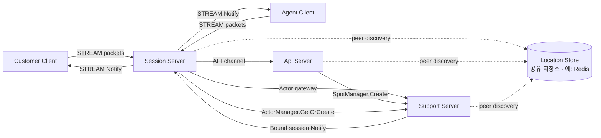
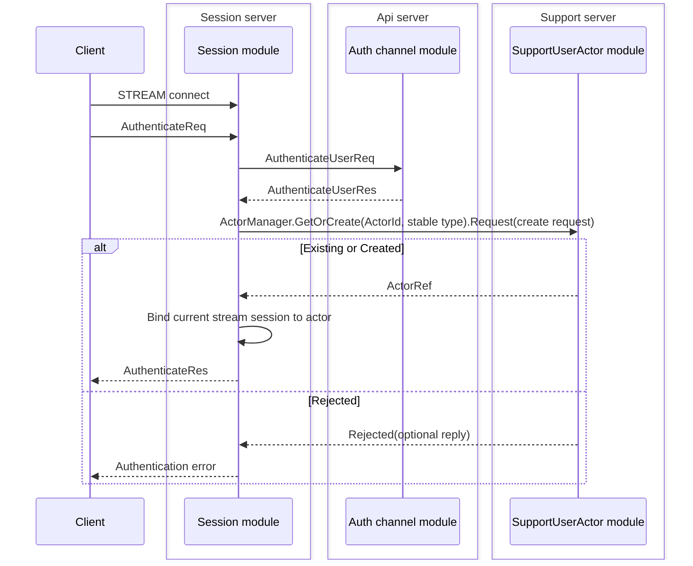
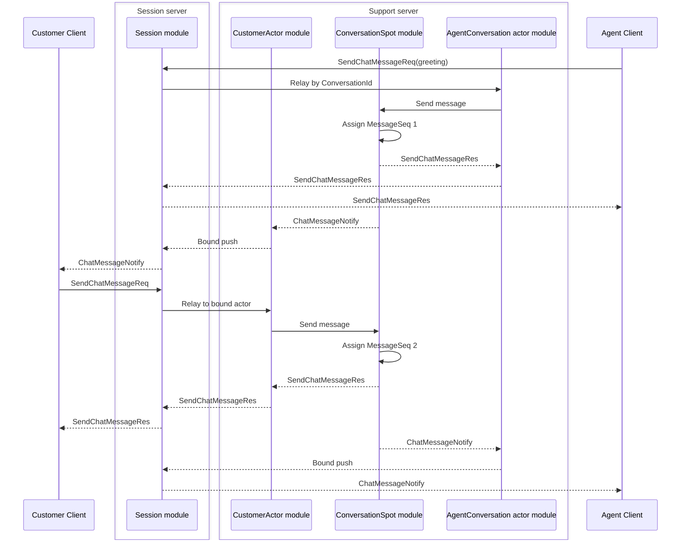
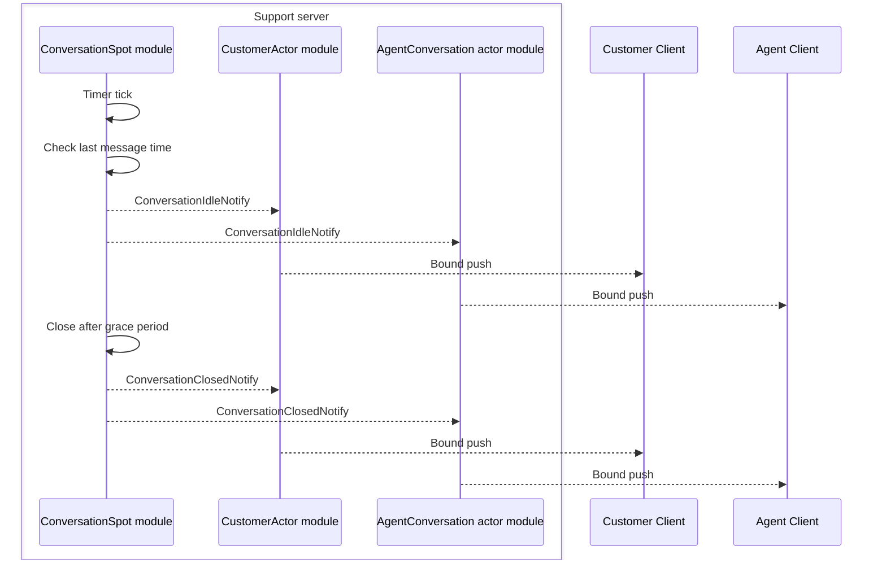
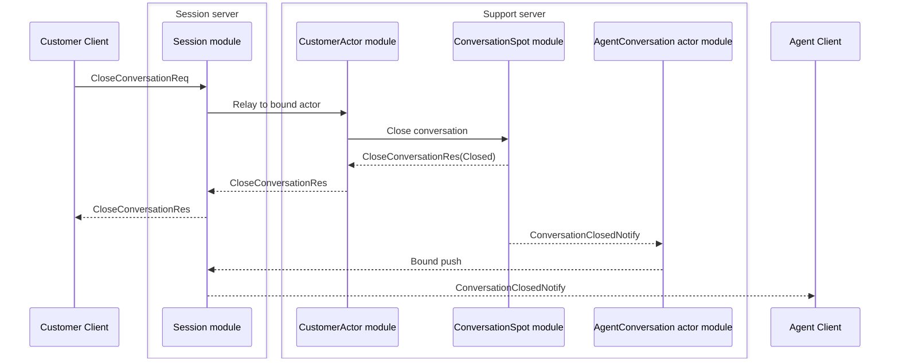
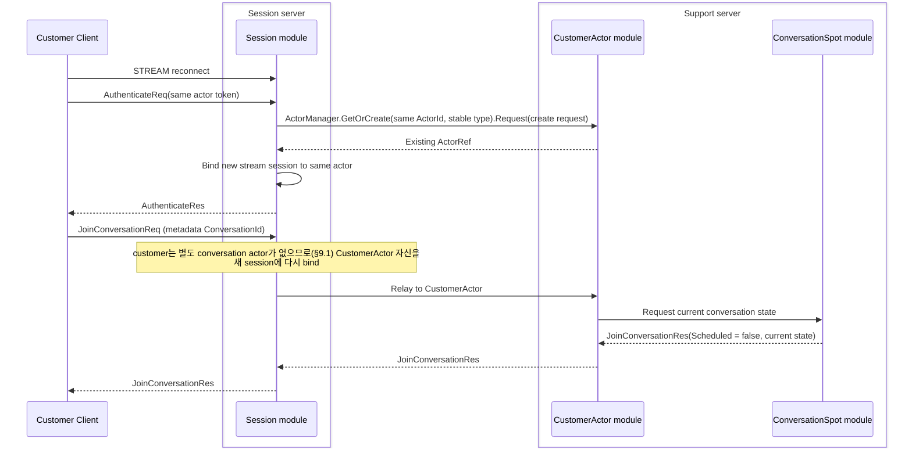
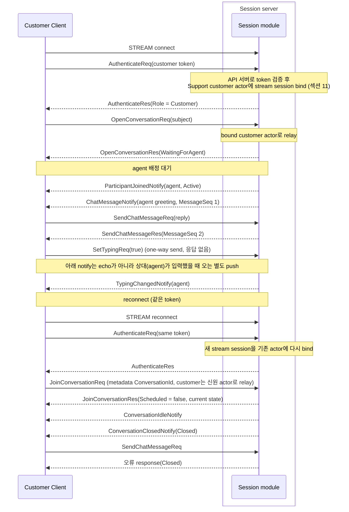
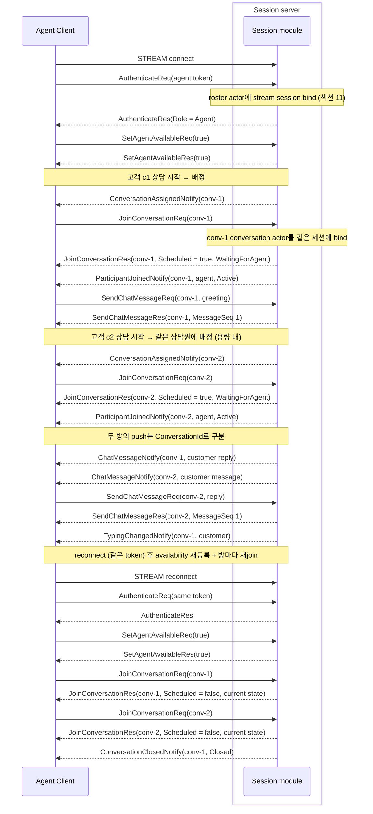

# SupportChat Sample Scenario

[샘플 목록](../README.ko.md)

> 이 문서는 모든 framework 언어가 공유하는 SupportChat 샘플 시나리오를 정의한다.
> 언어별 샘플은 이 문서를 기준으로 서버 역할, 메시지 흐름, domain 경계,
> smoke 검증 기준을 맞춘다.

## 1. 목적

SupportChat은 고객 상담 채팅 흐름으로 framework가 실제 서비스의 지속 연결과
상태 소유 문제를 어떻게 줄이는지 보여 주기 위한 샘플이다. 고객과 상담원은 모두
자기 client로 Session 서버 stream endpoint에 연결한다. 실제 상담처럼 **한 상담원은
동시에 여러 고객 대화를 처리하며**, 하나의 stream session 위에 방마다 conversation
actor를 두어 나눠 응대한다. Support 서버는 customer actor, 상담원 roster·conversation
actor, conversation Spot을 소유하고, API 서버는 상담 티켓 생성 orchestration을 맡고,
공유 location store는 서버 간 endpoint 발견을 맡는다.

샘플로 구현할 때 확인할 핵심은 아래와 같다.

- client는 Session 서버 stream endpoint 하나만 알고 연결한다.
- Session 서버는 인증 후 현재 stream session을 Support 서버의 user actor에 bind한다.
- 상담원 client도 인증해 roster(신원) actor에 bind하고, 배정된 conversation마다 같은 session에 conversation actor를 추가로 bind한다.
- 한 상담원은 용량 한도까지 여러 conversation에 동시에 배정될 수 있다.
- Session 서버는 conversation packet을 `ConversationId` 기준으로 해당 conversation actor에 relay한다.
- API 서버는 token 검증과 상담 생성 orchestration을 처리한다.
- API 서버는 `IZLinkSpotManager.Create`로 새 conversation Spot 생성을 Framework에 요청한다.
- Session 서버는 `IZLinkActorManager.GetOrCreate`로 customer·상담원 actor를 직접 준비한다.
- Support 서버는 생성된 conversation Spot에 customer actor와 상담원 conversation actor를 join시킨다.
- conversation Spot은 참여자, 메시지 순서, typing 상태, idle timeout, close 상태를 소유한다.
- customer와 agent가 보낸 채팅 메시지는 conversation Spot에서 순서를 부여받고 상대방에게 push된다.
- reconnect가 발생하면 같은 actor에 새 stream session이 bind되고 conversation 상태는 유지된다.
- idle timer가 일정 시간 동안 새 메시지가 없는 conversation을 `WaitingForClose` 또는 `Closed`로 전환한다.
- 공유 location store를 사용해 Session, API, Support 서버가 서로의 endpoint를 자동으로 찾는다.

SupportChat은 client가 Session 서버 하나에만 연결하는 session gateway 구조를 사용해,
업무형 대화 상태, 재접속, 상담 종료 흐름을 보여 주는 운영형 multi-server 샘플이다.

Client self-check도 샘플의 일부다. client는 각 request 응답과
server push payload를 즉시 검증해야 한다. 특히 `ParticipantJoinedNotify`,
`ConversationAssignedNotify`, `ChatMessageNotify`, `TypingChangedNotify`,
`ConversationIdleNotify`, `ConversationClosedNotify` 대기는 stream connector의 public
wait interface를 직접 사용한다. notification 수집용 inbox나 로그 queue는 결과 출력과
추가 검증을 위해 둘 수 있지만, push 도착을 기다리는 기준 경로가 되어서는 안 된다.

## 2. 서버 구성

SupportChat의 Channel 역할과 물리 연결은 [공통 topology 기준](../README.ko.md#channel-역할과-물리-topology-기준)을
따른다. Session·Api·Support는 `supportchat` RouteMesh 하나를 공유한다. Actor·Spot 생성과 메시징은
RouteMesh의 public manager와 logical object route를 사용한다. API 인증처럼 object route가 아닌
업무 request만 독립 ClientServer Channel을 사용한다. conversation 생성이나 actor 준비를 전달하기
위한 Channel wrapper는 두지 않는다.



customer client와 agent client가 직접 연결하는 서버는 Session 서버뿐이다. API 서버와
Support 서버는 client-facing stream endpoint를 열지 않는다. Session 서버는 인증과
session lifecycle을 소유하지만 상담 규칙을 해석하지 않는다. 상담 packet은 현재
session에 bind된 actor로 전달되고, customer actor와 상담원 conversation actor가 같은
conversation Spot에 join한 뒤 domain state를 처리한다.

## 3. 자동 연결 방식

SupportChat은 공유 location store 기반 자동 연결을 사용한다.

| 연결 | 연결 방식 | 이유 |
|------|-----------|------|
| Session -> `supportchat.api` | location store 기반 자동 연결 | Session 서버가 인증 요청을 처리할 때 API 서버 주소를 직접 보관하지 않게 한다. |
| Support -> `supportchat.api` | location store 기반 자동 연결 | Support actor가 상담 시작 orchestration을 API 서버에 요청한다. |
| API -> conversation Spot | location store 기반 Spot placement | API 서버가 새 conversation의 `SpotId`와 owner node를 직접 정하지 않게 한다. |
| Session -> Support actor | location store 기반 actor locator | Session 서버가 `ActorId`만 사용해 actor를 만들거나 기존 actor를 찾는다. |
| Support -> Session bound push | location store 기반 session route | Support 서버가 현재 client session 위치를 framework route로 찾는다. |

이 샘플은 자동 연결, actor binding, bound session push를 함께 보여 주는 역할을 맡는다.

## 4. 서버 책임 분담

SupportChat은 client 요청을 세 서버가 나눠 처리하는 session gateway 구조를 사용한다.

| 역할 | 책임 |
|------|------|
| Session 서버 | `AuthenticateReq`만 session lifecycle packet으로 처리하고, 인증 이후 conversation packet은 `ConversationId`로 대상 actor를 골라 relay한다(상담원은 conversation actor, 고객은 신원 actor — §9.1). |
| Support actor | `OpenConversationReq`를 처리해 API 서버에 `OpenConversationApiReq`로 상담 시작을 요청한다. |
| API 서버 | token 검증과 상담 시작 orchestration을 맡고, `IZLinkSpotManager.Create`로 새 conversation Spot 생성을 요청한다. 상담원 배정은 Support 서버가 in-process로 처리한다. |
| Support 서버 | `SupportEntrySpot`을 actor admission 지점으로 두고, `ConversationSpot`이 대화 상태·메시지 순서·typing·idle timer·close 상태를 소유한다. |
| Notification | conversation domain event를 notification publisher가 bound session push로 바꿔 customer와 상담원에게 보낸다. |

## 5. 프로세스와 책임

| 프로세스 | 구성 요소 | 책임 |
|----------|-----------|------|
| `SupportChat.Api` | `supportchat.api` ChannelName handler | Session 서버의 token 검증과 Support actor의 상담 시작 orchestration 요청을 처리한다. |
| `SupportChat.Session` | stream server | client 연결, 인증 packet, actor binding, actor relay를 처리한다. |
| `SupportChat.Session` | `supportchat.api` ChannelName client | token 검증을 ready API 서버에 요청한다. |
| `SupportChat.Session` | actor manager | 인증된 `ActorId`로 customer·상담원 actor를 만들거나 기존 actor를 찾는다. |
| `SupportChat.Session` | session gateway MeshNode | session relay와 bound session push 수신을 담당한다. |
| `SupportChat.Support` | actor runtime | customer actor와 상담원 actor(roster·conversation)를 만들어 해당 Spot에 join시킨다. |
| `SupportChat.Support` | `SupportEntrySpot` | actor가 conversation에 들어가기 전 admission 지점을 맡는다. |
| `SupportChat.Support` | `ConversationSpot` | 참여자, 메시지 순서, typing 상태, idle timer, close 상태를 소유한다. |
| `Location Store` | framework location store 계약의 공유 저장소 구현체(예: Redis) | Session·API·Support peer discovery(자동 연결)와 actor/session 위치 조회를 담으며, 등록·조회·lifecycle 정책은 framework가 소유. |

## 6. Support 서버 디렉토리 구조

Support 서버는 domain logic과 framework adapter를 분리한다. 샘플로 구현할 때는
아래 책임 분리를 유지한다.

```text
Server/Support/
  Domain/
    SupportChat/
      Conversation
      ConversationMessage
      ConversationParticipant
      ConversationPolicy
      ConversationEvents
  Application/
    ConversationAssignment/
      AgentAssignmentService
      AgentAvailabilityDirectory
  Infrastructure/
    ZLink/
      Actors/
        SupportUserActor
        SupportUserActorFactory
      Notifications/
        SupportNotificationPublisher
        ConversationEventMapper
      Spots/
        SupportEntrySpot
        ConversationSpot
        Handlers/
          OpenConversationActorHandler
          JoinConversationActorHandler
          SetAgentAvailableHandler
          SendChatMessageHandler
          SetTypingHandler
          CloseConversationHandler
          ConversationIdleTimerHandler
```

역할은 아래처럼 나눈다.

| 위치 | 책임 |
|------|------|
| `Domain/SupportChat/Conversation` | 참여자, 메시지 sequence, status, typing, close 상태 전이를 소유한다. |
| `Domain/SupportChat/ConversationPolicy` | 최대 참여자 수, idle timeout, close 가능 조건 같은 규칙을 소유한다. |
| `Domain/SupportChat/ConversationEvents` | message received, participant joined, typing changed, idle timeout, closed event를 정의한다. |
| `Application/ConversationAssignment/AgentAvailabilityDirectory` | 상담 가능 상태로 등록된 상담원 roster actor id와 용량을 관리한다. |
| `Application/ConversationAssignment/AgentAssignmentService` | 용량이 남은 상담원 roster actor를 선택해 conversation에 배정한다. |
| `Infrastructure/ZLink/Spots/ConversationSpot/ConversationSpot` | ZLink Spot lifecycle, actor join callback, timer 등록, domain 호출, notification publish 연결을 맡는다. |
| `Infrastructure/ZLink/Spots/ConversationSpot/Notifications/*` | domain event를 bound session push message로 바꾸고 전송한다. |
| `Infrastructure/ZLink/Spots/EntrySpot/Handlers/*` | Entry Spot에 처음 배치된 actor의 identity·agent availability 흐름을 연결한다. Conversation membership은 Actor handler의 deferred Join이 처리한다. |
| `Infrastructure/ZLink/Spots/ConversationSpot/Handlers/*` | conversation actor request와 timer callback을 domain operation으로 연결한다. |

Domain 객체는 ZLink framework 타입을 직접 참조하지 않는다.
`ConversationSpot`은 framework callback을 받아 domain method를 호출하고, domain이
반환한 event를 adapter가 message로 바꾼다. message sequence, typing 상태, idle
timeout, close 판정은 handler나 Spot handler에 흩어지지 않게 한다.

## 7. DDD와 Hexagonal Architecture 기준

SupportChat은 업무형 샘플이므로 domain model의 경계가 특히 분명해야 한다.
이 문서에서 DDD는 복잡한 enterprise framework를 도입하라는 뜻이 아니라,
상담 도메인에서 바뀌기 쉬운 규칙과 framework transport 세부 구현을 분리하라는 기준이다.
Hexagonal Architecture는 domain 중심에 inbound/outbound port를 두고 ZLink, stream,
location store, timer, logger 같은 외부 세부 사항을 adapter 밖으로 밀어내는 구조를 뜻한다.

### 7.1 Domain Model

`Conversation`은 aggregate root로 본다. 하나의 conversation 안에서 메시지 순서,
참여자 membership, typing 상태, idle 상태, close 상태가 일관되게 바뀌어야 하기 때문이다.
언어별 구현은 class, record, data class, struct 등 자기 언어에 맞는 표현을 쓸 수 있지만
아래 책임은 domain 안에 있어야 한다.

| Domain 요소 | 책임 |
|-------------|------|
| `Conversation` | status 전이, participant join, message sequence 증가, typing 변경, idle/close 판정을 한 곳에서 처리한다. |
| `ConversationParticipant` | actor id, role, display name, join 시각, 현재 typing 여부를 표현한다. |
| `ConversationMessage` | conversation id, message sequence, sender, text, sent time을 표현한다. |
| `ConversationPolicy` | conversation당 1:1 참여자 제한, text 길이, idle timeout, close grace timeout, close 가능 조건을 정의한다. |
| `ConversationEvent` | participant joined, assigned, message appended, typing changed, idle, closed 같은 domain event를 표현한다. |

Domain은 ZLink actor, Spot, session, stream connector, ChannelName client, location store endpoint,
timer handle, logger, DI container를 알면 안 된다. 예를 들어 `Conversation.SendMessage`
같은 method는 `BoundSession.Send(...)`를 직접 호출하지 않고 `ConversationEvent`를 반환한다.
adapter가 이 event를 `ChatMessageNotify` 같은 push message로 바꾼다.

### 7.2 Application Use Case

Application 계층은 domain 객체를 이용해 샘플 use case를 표현한다. transport request를
그대로 전달만 하는 얕은 wrapper가 아니라, 도메인 이름이 드러나는 작업 단위여야 한다.

| Application use case | 책임 |
|----------------------|------|
| `OpenConversation` | `Subject`와 customer identity를 생성 요청에 담고 Framework에 새 conversation Spot 생성을 요청한다. Framework가 전역 `SpotId`를 발급한다. |
| `AgentAvailabilityDirectory` | 상담 가능 상태인 상담원 roster actor id와 용량을 등록, 조회, 갱신한다. |
| `AgentAssignmentService` | 용량이 남은 상담원 roster를 선택하고 배정 결과를 반환한다. |
| `ConversationLookup` | reconnect나 explicit join에서 `ConversationId`로 현재 conversation state를 찾는다. |

Application 계층은 domain use case를 표현하지만 ZLink packet codec, stream frame,
handler decorator, socket endpoint 같은 transport 세부 구현에 기대면 안 된다. Spot 생성이나
actor join처럼 framework adapter가 필요한 작업은 port interface로 요청하고, 실제 구현은
Infrastructure 계층에 둔다.

### 7.3 Ports and Adapters

SupportChat의 port는 domain/application이 외부에 기대는 최소 계약이다. 샘플이 작아도
아래 경계를 이름으로 드러내면 각 언어 구현이 같은 구조를 유지하기 쉽다.

| Port | 방향 | Adapter 예 |
|------|------|------------|
| `ConversationSpotFactory` | outbound | ZLink Spot manager가 새 conversation Spot을 만들고 Framework가 발급한 `SpotId`를 반환한다. |
| `SupportActorDirectory` | outbound | ZLink actor runtime이 customer actor와 상담원 actor(roster·conversation)를 생성하거나 기존 actor를 반환한다. |
| `NotificationPort` | outbound | `ConversationEventMapper`와 `SupportNotificationPublisher`가 event를 bound session push로 보낸다. |
| `Clock` 또는 time provider | outbound | timer handler가 현재 시각을 domain에 전달한다. |
| `AuthenticationPort` | inbound API boundary | API handler가 token을 검증하고 actor identity를 반환한다. |

Infrastructure 계층은 framework 객체, codec, logging, handler/decorator 등록, location store
자동 연결 설정, Spot lifecycle, actor/session binding을 맡는다. Adapter가 domain 규칙을 직접
판정하면 안 된다. 예를 들어 `SendChatMessageHandler`는 text 길이, closed 상태, participant
여부를 직접 검사하지 않고 `Conversation`에 요청한다. `ConversationIdleTimerHandler`는
timer tick을 domain에 전달할 뿐 idle 전이와 close 전이를 직접 계산하지 않는다.

### 7.4 Dependency Direction

의존 방향은 아래 순서를 따른다.

```text
Infrastructure/ZLink  ->  Application  ->  Domain
```

`Domain`은 다른 계층을 참조하지 않는다. `Application`은 domain과 port 계약만 알고,
`Infrastructure/ZLink`는 framework와 port 구현을 소유한다. 이 방향이 깨지면 샘플이 framework
사용법보다 domain/application/framework 세부 구현이 뒤섞인 예제가 되므로 공통 sample
기준을 만족하지 못한다.

## 8. Handler 등록 방식

SupportChat은 typed handler와 domain event publisher를 함께 사용한다.

- Session packet handler는 `AuthenticateReq`처럼 session lifecycle에 속한 packet만
  처리한다. 인증 이후 conversation packet은 bound actor로 relay한다.
- channel handler는 API 서버와 Support 서버 사이의 request/response schema를 처리한다.
- Entry Spot actor handler는 `OpenConversationReq`처럼 actor가 아직 conversation
  Spot에 들어가기 전에 보내는 request를 처리한다.
- Spot actor handler는 conversation 안에서 actor가 보낸 request를 처리한다.
- `SetAgentAvailableHandler`는 상담원 roster actor의 상담 가능 상태를
  `AgentAvailabilityDirectory`에 반영한다. customer actor가 이 request를 보내면 오류를
  반환한다.
- notification publisher는 domain event를 server push message로 바꾸어 bound session으로 보낸다.

**SupportChat은 자동 등록 샘플이다.** 위 handler들은 typed 계약과 선언형 metadata로 선언하고,
서버는 스캔으로 자동 등록한다. 구성 코드에 handler 목록을 다시 나열하지 않는다. **C++만 예외**로
runtime 스캔이 없어 compile-time 명시 등록을 쓴다
([05 §8](../../spec/06-framework-api.ko.md#8-handler-등록과-dispatch)).
수동 등록을 시연하는 샘플은 TicTacToe 하나뿐이다([샘플 규약](../README.ko.md)).

notification은 handler 안에서 직접 여러 client에게 보내지 않고 domain event publisher 경로로
모은다.

## 9. 도메인 규칙

SupportChat은 한 conversation을 1:1(customer 1명 + agent 1명)로 유지하되, 실제 상담처럼
**한 상담원이 여러 고객 대화를 동시에 처리하는 1 상담원 : N 고객 모델**을 사용한다.

| 항목 | 규칙 |
|------|------|
| conversation 참여자 | 한 conversation은 customer 1명 + agent 1명이다. |
| 상담원 동시 처리 | 한 상담원은 용량(capacity) 한도까지 여러 conversation에 동시에 배정된다. 샘플 기본 용량은 3으로 둔다. |
| conversation 생성 | customer가 상담 시작을 요청하면 API 서버가 `IZLinkSpotManager.Create`로 새 conversation Spot 생성을 요청한다. Support 서버는 등록된 stable type factory로 Spot을 초기화한다. |
| conversation id | Framework가 새 User Spot에 발급한 전역 문자열 `SpotId`를 `ConversationId`로 사용한다. client와 server는 이 값만 논리 주소로 사용한다. |
| agent 대기 | agent client가 인증 후 상담 가능 상태를 등록한다. |
| agent 배정 | customer가 conversation에 join하면 Support 서버(`ConversationSpot`)가 in-process로 용량이 남은 상담원을 선택해 `ConversationAssignedNotify`로 통지한다. |
| agent join | 상담원 client가 `ConversationAssignedNotify`를 받으면 `JoinConversationReq`로 그 conversation에 join하고, 이때 conversation이 `Active`가 된다. |
| agent availability 유지 | 배정돼도 용량이 남으면 상담원은 배정 가능 목록에 남는다. 용량이 차면 목록에서 빠지고, conversation이 close되어 용량이 회복되면 다시 들어온다. stream disconnect 시에는 actor disconnect 생명주기(`SupportEntrySpot.OnDisconnectActorAsync`)로 목록에서 제거한다. |
| agent 없음 | 배정 가능한(용량 남은) 상담원이 없으면 conversation은 `WaitingForAgent`로 남고 오류가 아니라 대기 상태를 반환한다. |
| 메시지 순서 | conversation Spot이 conversation마다 단조 증가하는 `MessageSeq`를 부여한다. |
| typing | typing 상태는 마지막 변경 시각과 함께 저장하고 상대방에게 one-way notify한다. |
| reconnect | 같은 token으로 다시 인증하면 기존 actor에 새 session을 bind한다. 상담원은 reconnect 뒤 각 conversation에 다시 join한다. |
| idle timeout | conversation마다 마지막 메시지 이후 일정 시간이 지나면 idle event를 보낸다. |
| 종료 | customer 또는 agent가 close를 요청하거나 idle timeout 후 close된다. |

### 9.1 상담원 멀티룸 actor 모델

한 상담원이 여러 방을 동시에 처리하려면 방마다 별도의 conversation actor가 필요하다.
framework에서 **한 actor는 동시에 한 Spot에만 속하기** 때문이다(새 Spot에 join하면 이전
Spot에서 자동으로 leave된다). 그래서 상담원은 하나의 stream session 위에 아래 두 종류의
actor를 둔다.

| actor | 위치 | 책임 |
|-------|------|------|
| roster actor | `SupportEntrySpot` | 상담원 신원과 availability를 소유하고, 배정된 모든 conversation의 `ConversationAssignedNotify`를 받는다. 인증 시 한 개 bind된다. |
| conversation actor | 각 `ConversationSpot` | 배정된 conversation 하나의 참여자다. 상담원이 그 conversation에 join할 때 같은 session에 추가로 bind되고, conversation마다 한 개씩 생긴다. |

고객은 conversation을 하나만 가지므로 신원 actor가 곧 conversation 참여자다. 즉 멀티룸은
상담원 쪽에만 적용된다.

`ConversationState.AgentActorId`와 `ParticipantJoinedNotify.ActorId`에는 내부 conversation
actor id가 아니라 상담원 신원(roster) id를 담아 client가 사람 단위로 상대를 식별한다.

### 9.2 ConversationId 라우팅

conversation 범위 client packet은 `ConversationId`를 **stream message metadata(header)
필드**로 실어 보낸다. Session 서버는 이 metadata만 읽어 대상 actor(상담원은 conversation
actor, 고객은 신원 actor)를 고르므로 domain payload를 해석하지 않는다(세션이 domain schema에
결합되지 않는다). payload를
디코드해 라우팅하는 방식은 쓰지 않는다. 규칙은 아래와 같다.

- Session 서버는 session마다 `ConversationId -> bound conversation actor` 맵을 유지한다. 이
  맵에는 상담원의 per-conversation actor만 등록된다 — 고객은 conversation actor가 없다(§9.1).
- **상담원**의 `JoinConversationReq`(metadata `ConversationId`)는 맵에 없으면 그 상담원의
  conversation actor를 만들어 session에 bind하고 맵에 등록한 뒤 relay한다(부트스트랩). 이후
  `SendChatMessageReq`, `SetTypingReq`, `CloseConversationReq`도 metadata `ConversationId`로
  맵에서 방별 conversation actor를 찾아 relay한다.
- **고객**은 conversation actor를 따로 만들지 않고 신원 actor가 곧 참여자이므로(§9.1), 고객이
  보내는 `JoinConversationReq`를 포함한 모든 conversation packet은 맵에 등록된 적이 없어 맵
  조회가 항상 miss이고, 그때마다 새로 만들지 않고 신원(customer) actor로 relay된다.
- metadata `ConversationId`가 없는 packet(`SetAgentAvailableReq`, `OpenConversationReq`)은 신원 actor(고객 actor 또는 상담원 roster actor)로 relay한다.
- 정리하면 세션은 `ConversationId`가 맵에 있으면 그 conversation actor로, 없으면 신원 actor로
  보낸다 — 다만 맵에 새로 등록(부트스트랩)하는 것은 상담원 join뿐이고, 고객의 map-miss는 항상
  신원 actor로 끝난다.

metadata가 라우팅의 단일 출처이므로 inbound conversation packet의 payload에는
`ConversationId` 필드를 두지 않는다. 대상 conversation actor가 속한 Spot이 어느
conversation인지 이미 식별한다. server -> client push/response는 지금처럼 payload의
`ConversationId`(또는 `State`/`Message` 안의 값)로 client가 방을 구분한다.

상담 이관, 파일 첨부, 읽음 확인, 메시지 저장소, 검색, 봇 응답은 공통 샘플 범위에서
제외한다. 이 기능들은 실제 서비스에는 중요하지만 framework 핵심 흐름을 보여 주기에는
샘플을 크게 만든다.

## 10. 메시지 계약

아래 schema는 공통 샘플 계약이다. 각 언어 구현은 같은 필드와 같은 의미를 유지한다.

client stream 인증 메시지:

```text
AuthenticateReq {
  AccessToken: string
}

AuthenticateRes {
  ActorId: string
  DisplayName: string
  Role: string
}
```

API 인증 메시지:

```text
AuthenticateUserReq {
  AccessToken: string
}

AuthenticateUserRes {
  Accepted: bool
  ActorId: string?
  DisplayName: string?
  Role: string?
  Reason: string?
}
```

인증 성공 뒤 actor 준비는 샘플 wire message가 아니다. Session 서버가 actor manager의
`GetOrCreate`를 호출한다. customer와 상담원 roster처럼 application이 소유하는 stable
`ActorId`와 stable actor type을 지정하고 아래 생성 request를 `Request(...)`로 전달한다.
상담원 conversation actor도 같은 방식으로 준비한다.

```text
SupportActorCreateRequest {
  DisplayName: string
  Role: string
  ParticipantId: string
}
```

Framework는 Location Store에서 현재 owner를 확인한다. `Existing`이면 생성 request를
다시 실행하지 않고 기존 `ActorRef`를 반환한다. `Created`이면 새 `ActorRef`와 optional
creation reply를 반환한다. `Rejected`이면 Session 서버는 actor를 bind하지 않고 인증 또는
conversation join을 실패로 끝낸다.

상담원 stream session이 끊기면 별도 메시지 없이 framework의 actor disconnect 생명주기로
정리한다: Session 서버가 bound roster actor에 `NotifyDisconnectedAsync`를 보내면 Support
서버의 `SupportEntrySpot.OnDisconnectActorAsync`가 발화해 roster를 배정 가능 목록에서
제거한다(§9). 재접속 시 `SetAgentAvailableReq(true)`로 다시 등록한다.

API orchestration 메시지:

```text
OpenConversationApiReq {
  CustomerActorId: string
  CustomerDisplayName: string
  Subject: string
}

OpenConversationApiRes {
  ConversationId: string
  Status: string
}
```

API 서버는 이 요청을 받으면 새 User Spot의 임의 식별자를 만들지 않는다. Spot manager의
`Create("supportchat.conversation")`에 customer와 subject를 생성 요청으로 전달한다. Framework가
전역 `SpotId`를 발급하고, API 서버는 그 값을 `ConversationId`로 반환한다. 배정은 별도 channel
request가 아니라 customer가 conversation에 join할 때 `ConversationSpot`이 in-process로 처리한다(§12).

client stream request/response (conversation 범위 request는 `ConversationId`를 payload가
아니라 metadata로 실어 보낸다 — §9.2):

```text
OpenConversationReq {
  Subject: string
}

OpenConversationRes {
  ConversationId: string
  State: ConversationState
}

SetAgentAvailableReq {
  IsAvailable: bool
}

SetAgentAvailableRes {
  IsAvailable: bool
}

JoinConversationReq {
  // client 요청에서는 세 필드를 비워 둔다. 대상 ConversationId는 metadata로 전달한다(§9.2).
  // Support 서버가 conversation actor join을 요청할 때는 실제 참가자 정보를 채운다.
  ParticipantId: string
  Role: string
  DisplayName: string
}

JoinConversationRes {
  Scheduled: bool          // true면 handler 종료 뒤 deferred Join을 실행한다.
  State: ConversationState
}

JoinConversationFailedNotify {
  ConversationId: string
  Error: string
  IsRetriable: bool
}

SendChatMessageReq {
  Text: string
}

SendChatMessageRes {
  Message: ChatMessage
  State: ConversationState
}

CloseConversationReq {
  Reason: string?
}

CloseConversationRes {
  State: ConversationState
}
```

`Scheduled = true`는 membership commit 완료가 아니다. Client는
`ParticipantJoinedNotify(..., Active)`로 Join 완료를 확인한다. Reconnect처럼 actor가 이미
같은 conversation Spot에 속하면 새 Join을 예약하지 않고 `Scheduled = false`와 현재 state를
반환한다. 예약한 Join이 거절되거나 실행에 실패하면 actor는 bound session에
`JoinConversationFailedNotify`를 보낸다. Framework 오류로 실패한 경우에는 오류 종류와 retry 가능
여부를 그대로 전달한다.

client stream one-way send (결과 payload 없음. `ConversationId`는 metadata — §9.2):

```text
SetTypingReq {
  IsTyping: bool
}
```

typing은 순간 상태이므로 요청/응답이 아니라 one-way send로 보낸다. async terminal은
source runtime의 local outbound admission까지만 기다린다. terminal이 정상 완료되어도 target
queue 수락, handler 실행, 상대방 수신을 보장하지 않으며 결과 payload도 반환하지 않는다.
source-local admission 전에 timeout·cancellation·shutdown이 발생하면 typed exception으로
완료한다. 서버가 typing 상태를 처리하면 상대방에게만 `TypingChangedNotify`를 push한다.
닫힌 대화로 보낸 typing은 오류 응답 대신 서버에서 조용히 무시된다. 반대로 채팅은
서버 부여 순번과 접수·검증 ack가 필요해 request/response로 둔다(이유는 §13.1).

server push 메시지:

```text
ParticipantJoinedNotify {
  ConversationId: string
  ActorId: string
  Role: string
  State: ConversationState
}

ConversationAssignedNotify {
  ConversationId: string
  State: ConversationState
}

ChatMessageNotify {
  ConversationId: string
  Message: ChatMessage
  State: ConversationState
}

TypingChangedNotify {
  ConversationId: string
  ActorId: string
  IsTyping: bool
  State: ConversationState
}

ConversationIdleNotify {
  ConversationId: string
  State: ConversationState
}

ConversationClosedNotify {
  ConversationId: string
  State: ConversationState
}
```

상태 모델:

```text
ConversationState {
  ConversationId: string
  Subject: string
  Status: string
  CustomerActorId: string
  AgentActorId: string?
  LastMessageSeq: uint64
  LastMessageAtUnixMs: int64?
  IdleDeadlineUnixMs: int64?
}

ChatMessage {
  ConversationId: string
  MessageSeq: uint64
  SenderActorId: string
  Text: string
  SentAtUnixMs: int64
}
```

`Role` 값은 `Customer`, `Agent`를 사용한다. `Status` 값은 `WaitingForAgent`,
`Active`, `WaitingForClose`, `Closed`를 사용한다. 언어별 샘플에서 enum으로 표현할 수
있지만 wire field 값은 위 문자열을 유지한다.

`ConversationId`는 Framework가 User Spot에 발급한 전역 `SpotId`다. UTF-8 문자열을
대소문자 구분 그대로 비교한다. Node transport에 쓰는 `NodeRid`로 변환하거나 routing id
hex 문자열을 client DTO에 노출하지 않는다.

conversation 범위 packet(`JoinConversationReq`, `SendChatMessageReq`, `SetTypingReq`,
`CloseConversationReq`)은 `ConversationId`를 payload가 아니라 stream message metadata로
실어 보내고, Session 서버는 그 metadata만으로 한 session의 여러 bound actor 중 대상
actor를 골라 relay한다(상담원은 conversation actor, 고객은 신원 actor — §9.2).
`ConversationState.AgentActorId`와
`ParticipantJoinedNotify.ActorId`에는 내부 conversation actor id가 아니라 상담원
신원(roster) id를 담는다.

상태 전이는 아래처럼 고정한다.

| 현재 상태 | 입력 | 다음 상태 |
|-----------|------|-----------|
| 없음 | customer가 `OpenConversationReq` 전송 | `WaitingForAgent` |
| `WaitingForAgent` | 상담원 conversation actor join | `Active` |
| `Active` | idle timeout 도달 | `WaitingForClose` |
| `Active` | customer 또는 agent가 `CloseConversationReq` 전송 | `Closed` |
| `WaitingForClose` | 새 `SendChatMessageReq` 수신 | `Active` |
| `WaitingForClose` | close grace timeout 도달 | `Closed` |
| `Closed` | `SendChatMessageReq`, `CloseConversationReq` 수신 | 오류 response |
| `Closed` | `SetTypingReq` 수신 | 무시 (one-way send, 응답 없음) |

idle timeout 3초와 close grace timeout 2초는 운영 환경의 domain 기본값이 아니라 샘플 시나리오를
빠르게 진행하기 위한 domain policy 예시 값이다. 이 두 값은 smoke test의 대기 상한이 아니며, smoke
test는 둘을 합친 시간보다 긴 별도 상한을 둔다. 언어별 샘플이 더 짧은 policy 값을 쓰더라도 위 상태
전이의 의미는 같아야 한다.

잘못된 요청은 정상 response payload 대신 오류 response를 반환한다.
아래 경우는 반드시 오류로 검증한다.

- 인증 전에 `OpenConversationReq`, `SendChatMessageReq`를 보낸 경우
- customer가 아닌 actor가 `OpenConversationReq`를 보낸 경우
- customer actor가 `SetAgentAvailableReq`를 보낸 경우
- conversation participant가 아닌 actor가 `SendChatMessageReq`를 보낸 경우
- `Closed` 상태의 conversation에 메시지, close 요청을 보낸 경우

`SetTypingReq`는 one-way send이므로 오류 response를 반환하지 않는다. 인증 전, 비참여자,
`Closed` 대화 등 잘못된 typing send는 서버에서 조용히 무시되고 상대방에게 `TypingChangedNotify`가
가지 않는 것으로 검증한다.

## 11. 인증과 Actor Binding 흐름



인증 성공 후 Session 서버는 현재 stream session을 Support 서버 actor에 bind한다.
customer token은 customer actor에, agent token은 상담원 **roster actor**에 bind된다.
상담원은 이후 배정된 conversation마다 conversation actor를 같은 session에 추가로 bind하므로
한 session에 여러 actor가 bind될 수 있다(§9.1). 이후 client가 보낸 conversation packet은
Session 서버가 `ConversationId` 기준으로 해당 bound actor에 relay한다.

agent client는 인증 직후 `SetAgentAvailableReq(true)`를 보내 상담 가능 상태를 등록한다.
이 request는 `ConversationId`가 없으므로 roster actor로 relay되며, Support 서버는 상담원을
배정 가능한 목록에 넣는다.

## 12. 상담 시작과 Agent 배정 흐름

```mermaid
sequenceDiagram
    participant C as Customer Client

    box Session server
        participant S as Session module
    end

    box Api server
        participant API as Api channel module
    end

    box Support server
        participant R as ConversationSpot module
        participant CA as CustomerActor module
        participant AR as AgentRoster actor module
        participant AConv as AgentConversation actor module
    end

    participant A as Agent Client

    Note over A,AR: 인증·availability 등록은 섹션 11 (roster actor에 bind)
    A->>S: AuthenticateReq(agent token)
    S->>AR: Bind agent session to roster actor
    S-->>A: AuthenticateRes(Role = Agent)
    A->>S: SetAgentAvailableReq(true)
    S->>AR: Relay (ConversationId 없음 → roster)
    AR-->>S: SetAgentAvailableRes
    S-->>A: SetAgentAvailableRes

    C->>S: OpenConversationReq(subject)
    S->>CA: Relay OpenConversationReq
    CA->>API: OpenConversationApiReq
    API->>R: SpotManager.Create(conversation stable type, create request)
    R-->>API: SpotRef(Framework-issued SpotId)
    API-->>CA: OpenConversationApiRes(WaitingForAgent)
    CA->>CA: Context.JoinSpot(ConversationId, join request).Defer()
    CA-->>S: OpenConversationRes(WaitingForAgent)
    S-->>C: OpenConversationRes(WaitingForAgent)
    Note over CA,R: CustomerActor handler가 정상 종료된 뒤 deferred Join 실행
    CA->>R: Framework executes deferred Join
    R-->>CA: OnJoinCompleted(Accepted)
    R->>R: Pick available agent, 용량 예약 (in-process)
    R->>AR: ConversationAssignedNotify(convId)
    AR-->>S: Bound push (roster)
    S-->>A: ConversationAssignedNotify(convId)
    A->>S: JoinConversationReq(convId)
    S->>S: ActorManager.GetOrCreate(actorId, stable type).Request(create request)
    S->>S: Existing/Created ActorRef를 session에 bind; Rejected면 join 실패
    S->>AConv: Relay JoinConversationReq
    AConv->>AConv: Context.JoinSpot(convId, join request).Defer()
    AConv-->>S: JoinConversationRes(Scheduled = true, WaitingForAgent)
    S-->>A: JoinConversationRes(Scheduled = true, WaitingForAgent)
    Note over AConv,R: AgentConversationActor handler가 정상 종료된 뒤 deferred Join 실행
    AConv->>R: Framework executes deferred Join
    R-->>AConv: OnJoinCompleted(Accepted)
    R-->>CA: ParticipantJoinedNotify(agent, Active)
    R-->>AConv: ParticipantJoinedNotify(agent, Active)
    CA-->>S: Bound push
    S-->>C: ParticipantJoinedNotify(agent, Active)
    AConv-->>S: Bound push
    S-->>A: ParticipantJoinedNotify(agent, Active)
```

customer가 상담을 시작하면 conversation은 `WaitingForAgent`로 만들어진다. customer actor가
현재 handler에서 `Context.JoinSpot(...).Defer()`를 등록한다. Handler가 정상 종료된 뒤 Framework가
deferred Join을 실행해 customer actor를 `ConversationSpot`에 commit한다. 이 Spot은 in-process로 용량이 남은
상담원을 골라 그 상담원의 roster actor에 `ConversationAssignedNotify`를 보낸다. API 서버는
Spot manager의 생성 결과만 받고 Support 전용 생성 channel은 호출하지 않는다. 배정은 상담원을 availability에서 곧바로 빼지
않으며(용량이 찰 때만 뺀다), 이 시점에도
conversation은 아직 `WaitingForAgent`다. 상담원 client는 이 notify를 받고
`JoinConversationReq(ConversationId)`를 보낸다. Session 서버는 actor manager로 상담원 conversation
actor를 준비해 같은 session에 bind한다. Actor handler는 `Context.JoinSpot(...).Defer()`를
등록하고 join 예약 결과를 반환한다. Handler 종료 뒤 Join이 commit되면 conversation은 `Active`가
되고 customer와 상담원에게 `ParticipantJoinedNotify`가 전달된다. 한
상담원이 여러 conversation에 배정되면 이 conversation actor가 방마다 하나씩 생기고, 이후
상담원은 그 conversation actor를 통해, customer는 자기 신원 actor를 통해(§9.1) 메시지를
주고받는다.

Actor의 `OnJoinCompleted`는 `Accepted`, `Rejected`, `Failed`를 모두 처리한다. `Accepted`에서만
conversation 참여 완료 notification을 보낸다. `Rejected`와 `Failed`에서는 해당 actor를
conversation participant로 사용하지 않으며 retry 가능 여부를 client 오류에 반영한다. Callback
재실행이 notification을 중복 생성하지 않도록 join operation ID를 기록해 중복을 제거한다.

이 문서의 시퀀스·시나리오에서 conversation packet에 포함한 `(convId, …)`·`(conv-1, …)`
표기 중 `convId`/`conv-*`는 payload 필드가 아니라 metadata `ConversationId`를 뜻한다(§9.2).
괄호 안의 나머지 값만 payload다.

## 13. 메시지와 Typing 흐름



상담원이 conversation에 배정되면 먼저 인사 메시지를 보낸다. 상담원 client는
`SendChatMessageRes`로 `MessageSeq = 1`인 자기 메시지와 state를 받고, customer client는
`ChatMessageNotify`로 같은 메시지를 받는다. customer가 답변하면 같은 흐름으로
`MessageSeq = 2`가 부여되고 agent client가 `ChatMessageNotify`를 받는다.

상담원 쪽 relay는 `ConversationId`로 그 방의 conversation actor를 골라 전달한다. 한
상담원이 여러 방을 동시에 열고 있어도 각 방의 메시지는 자기 conversation actor로만
흐르고, 상담원 client는 push payload의 `ConversationId`로 어느 방인지 구분한다.

### 13.1 채팅 request/response와 typing one-way send의 이유

채팅 메시지를 request/response로 두는 것은 편의가 아니라 의도된 설계다.

- **전송 확인·재전송 UX**: 보낸 사람 client는 `SendChatMessageRes`를 받으면 그 메시지를 "전송됨"으로 표시하고, 응답을 받지 못하면(timeout·실패) "재전송" 버튼을 노출할 수 있다. 메시지가 서버에 도달했는지를 client가 확정적으로 알 수 있다는 것이 채팅에서 request/response를 쓰는 핵심 당위성이다. one-way send였다면 client는 도달 여부를 알 수 없어 이런 표시를 할 수 없다.
- **서버 부여 순번 반환**: conversation Spot이 매기는 단조 증가 `MessageSeq`를 보낸 사람이 `SendChatMessageRes`로 즉시 돌려받아 자기 메시지의 순번과 최신 state를 확인한다.
- **접수·검증 ack**: `Closed` 대화, 비참여자, 길이 초과 같은 잘못된 전송을 오류 response로 즉시 거부한다. 상담 도메인에서는 닫힌 대화로 보낸 메시지가 조용히 사라지지 않고 "안 갔다"가 바로 보이는 것이 고객 오해를 막는 데 특히 중요하다.

다만 request/response는 서버가 **접수·순번·검증**했다는 확인일 뿐, 상대방이 실제로 받거나
읽었다는 보장은 아니다. 상대 수신 여부(읽음 확인)는 §9.2에서 범위 밖으로 둔다.

반대로 `SetTypingReq`는 one-way send다. typing은 순간 상태라 유실돼도 무해하고 별도 ack가
필요 없다. submit 완료는 source-local admission만 뜻하며 상대방 수신을 뜻하지 않는다.
상대방은 실제 전달된 경우에만 `TypingChangedNotify`를 받는다. 이렇게
"확인이 필요한 상태 변경은 request/response, 순간 신호는 one-way send"로 나눠 각 전송
방식이 어디에 맞는지 대비해 보여 준다.

## 14. Idle Timer와 Close 흐름



conversation Spot은 마지막 메시지 시각과 idle deadline을 domain state로 유지한다.
timer handler는 시간 신호만 전달하고, idle/close 판정은 domain method가 수행한다.
idle timeout 뒤 close grace timeout까지 새 메시지가 없으면 `ConversationClosedNotify`가
customer와 agent 양쪽에 전달된다.

명시적 close 요청도 같은 `Closed` 상태와 notify 계약을 사용한다.



customer가 명시적으로 close하면 customer는 `CloseConversationRes`로 닫힌 state를 받고,
agent는 `ConversationClosedNotify`를 받는다. agent가 close한 경우에도 반대로 동작한다.
close가 끝난 conversation은 추가 `SendChatMessageReq`, `CloseConversationReq`를 오류
response로 거부하고, `SetTypingReq` send는 조용히 무시한다.

## 15. Reconnect 흐름



reconnect는 conversation state와 actor를 새로 만들지 않는다. Session 서버는 actor manager의
`GetOrCreate`를 같은 `ActorId`·stable type과 생성 request로 호출한다. Framework는 Location Store의
Ready actor를 `Existing`으로 반환하고, 없을 때만 생성 callback을 실행한다. `Rejected`이면 새
session을 bind하지 않는다. customer는 reconnect 뒤 `JoinConversationReq`로 자기
conversation state를 다시 확인한다. 상담원은 roster actor를 다시 bind한 뒤
`SetAgentAvailableReq(true)`로 상담 가능 상태를 다시 등록하고(이때 roster의 bound session
경로가 새 session으로 갱신된다), 열려 있던 conversation마다 `JoinConversationReq`로 그
conversation actor를 새 session에 다시 bind하고 재join한다. 이때 각
`ConversationState.Subject`는 처음 `OpenConversationReq`로 보낸 값과 같아야 한다.

## 16. 역할별 전체 시퀀스

섹션 11~15는 서버 간 상세 흐름을 단계별로 나눠 보여 준다. 아래 두 다이어그램은
같은 흐름을 customer와 agent 각 역할의 관점에서 처음 연결부터 종료까지 하나로 이어
보여 준다. client는 Session 서버 stream endpoint하고만 대화하므로, 이 뷰는 각 역할이
실제로 주고받는 request/response와 server push만 담는다. API·Support 서버 내부 동작은
Session 서버 뒤에 감춰진다는 점을 함께 드러낸다. 다이어그램의 `(conv-*)`는 payload가
아니라 metadata `ConversationId`다(§9.2).

### 16.1 고객(Customer) 시퀀스



customer는 Session 서버에 인증한 뒤 상담을 시작하고, agent 배정은 request response가
아니라 `ParticipantJoinedNotify` push로 확인한다. agent 인사 메시지는 `ChatMessageNotify`로
받고, 자기 답변은 `SendChatMessageRes`로 확인한다. reconnect 후에는 `JoinConversationReq`로
현재 상태를 다시 확인하며, close된 뒤에는 메시지 요청이 오류 response로 거부된다.

### 16.2 상담사(Agent) 시퀀스

한 상담원이 두 고객(conv-1, conv-2)을 동시에 응대하는 흐름이다.



상담원은 인증 직후 `SetAgentAvailableReq(true)`로 상담 가능 상태를 등록하고, 배정된
conversation마다 `ConversationAssignedNotify`를 받아 `JoinConversationReq`로 그 방에
join한다. 각 방의 요청은 `ConversationId`(metadata)를 실어 보내 서버가 해당 방의
conversation actor로 relay하고, 수신 push도 `ConversationId`로 어느 방인지 구분한다.
reconnect 뒤에는 roster actor를 다시 bind하고 `SetAgentAvailableReq(true)`로 상담 가능
상태를 다시 등록한 뒤, 열려 있던 방마다 `JoinConversationReq`로 재join한다. 한 상담원이
여러 방을 열고 있어도 각 방은 독립된 `MessageSeq`·idle·close 상태를 갖는다.

## 17. Client 시나리오 작성 기준

client 샘플은 시나리오 테스트로 읽혀야 한다. 서버 기능을 샘플 전용
helper 뒤에 숨기지 않고, connector와 message 객체의 public interface를 직접 사용하는
흐름으로 작성한다. 실행 진입부에서 customer client와 agent client를 만든 뒤 시나리오
함수에서는 아래 순서가 그대로 읽히는 구조를 따른다. 각 request 직후 response를 검증하고,
server push는 해당 단계에서 기다려 payload 의미 값을 바로 확인한다. 아래 시나리오의
`(conv-1)`·`(conv-2)`는 metadata `ConversationId`이며 payload 필드가 아니다(§9.2).

```text
1. agent client connect
2. agent AuthenticateReq / AuthenticateRes 검증
3. agent SetAgentAvailableReq(true) / SetAgentAvailableRes 검증
4. customer c1 client connect, AuthenticateReq / AuthenticateRes 검증
5. c1 OpenConversationReq / OpenConversationRes(Status = WaitingForAgent) 검증
6. agent waits ConversationAssignedNotify(conv-1)
7. agent JoinConversationReq(conv-1) / JoinConversationRes(Scheduled = true) 검증
8. agent와 c1이 ParticipantJoinedNotify(agent, Active)를 기다려 membership commit 검증
9. agent SendChatMessageReq(conv-1, greeting) / SendChatMessageRes(MessageSeq = 1) 검증
10. c1 waits ChatMessageNotify(conv-1, MessageSeq = 1)
11. c1 SendChatMessageReq(conv-1, reply) / SendChatMessageRes(MessageSeq = 2) 검증
12. agent waits ChatMessageNotify(conv-1, MessageSeq = 2)
13. customer c2 client connect, 인증, OpenConversationReq / OpenConversationRes 검증
14. agent waits ConversationAssignedNotify(conv-2)  # 같은 상담원, 용량 내 두 번째 방
15. agent JoinConversationReq(conv-2) / JoinConversationRes(Scheduled = true) 검증
16. agent와 c2가 ParticipantJoinedNotify를 기다린 뒤 agent SendChatMessageReq(conv-2) → c2 waits ChatMessageNotify(conv-2)
17. conv-1과 conv-2의 MessageSeq·push가 ConversationId로 구분되어 서로 독립인지 검증
18. c1 or agent SetTypingReq(conv-1)를 one-way send로 전송 → 상대가 TypingChangedNotify(conv-1) 수신
19. reconnect agent with the same token, SetAgentAvailableReq(true) 재등록 후 열려 있던 각 conversation에 JoinConversationReq로 재join
20. JoinConversationReq / JoinConversationRes(Scheduled = false)로 각 방 current state 검증
21. idle/close notify를 해당 방의 양쪽 client가 수신하는지 검증
22. closed conversation에 SendChatMessageReq를 보내 오류 response 검증
```

명시적 close 시나리오:

```text
1. 새 conversation을 열고 customer와 agent가 Active 상태가 될 때까지 검증
2. customer CloseConversationReq / CloseConversationRes(Closed) 검증
3. agent waits ConversationClosedNotify
4. closed conversation에 CloseConversationReq를 다시 보내 오류 response 검증
```

agent 미배정 시나리오:

```text
1. agent availability를 등록하지 않은 상태로 customer OpenConversationReq 전송
2. OpenConversationRes.State.Status = WaitingForAgent 검증
3. ConversationState.Subject가 요청한 subject와 같은지 검증
4. 오류 response가 반환되지 않았고 ConversationClosedNotify도 발생하지 않았는지 검증
```

응답 검증은 마지막에 모아서 하지 않고 request 직후에 수행한다. notify는 순서가 명확한
경우 바로 기다리고, 순서가 불확실한 경우에는 각 client가 받아야 하는 notify waiter를
먼저 걸어 둔 뒤 함께 기다린다.

customer와 agent client는 모두 Session 서버 stream endpoint에만 연결한다.
API 서버와 Support 서버 endpoint를 client 코드에서 직접 사용하면 이 샘플의 핵심인
session gateway 구조가 흐려진다.

## 18. 구현 완료 기준

아래 항목은 언어별 샘플 구현과 smoke test로 확인해야 하는 기준이다.

- runner는 실행할 때마다 SupportChat 전용 Docker Redis 컨테이너를 직접 시작하고, 그 컨테이너에서 얻은
  endpoint와 실행별 key prefix를 Session, API, Support 서버에 전달한다. 외부 Redis endpoint 재사용
  mode는 제공하지 않는다.
- runner가 사용하는 Redis container 이름, host port, key prefix, log directory는 실행별로 고유해야
  한다. cleanup은 그 실행이 만든 container만 대상으로 삼고, 다른 테스트나 다른 샘플의 Redis container나
  log 파일을 지우지 않는다.
- client 두 종류(customer, agent)가 각각 Session 서버에 하나의 stream 연결만 연다.
- Session, API, Support 서버는 공유 location store로 서로를 자동 발견한다.
- 인증 후 Session 서버는 current stream session을 Support 서버 actor에 bind한다. 상담원은 roster actor에 bind된다.
- agent client는 인증 후 `SetAgentAvailableReq(true)`로 상담 가능 상태를 등록한다.
- customer가 `OpenConversationReq`를 보내면 conversation이 생성되고 customer actor가 join한다.
- `ConversationState.Subject`는 conversation 생성 후 조회, join, reconnect response에서 유지된다.
- 배정되면 agent는 `ConversationAssignedNotify`를 받고 `JoinConversationReq`로 deferred Join을
  등록한다. `JoinConversationRes(Scheduled = true)`는 예약만 뜻하며, membership commit 뒤
  conversation이 `Active`가 되면 customer와 agent가 `ParticipantJoinedNotify`를 받는다.
- 배정 가능한(용량 남은) agent가 없으면 conversation은 오류가 아니라 `WaitingForAgent` 상태로 남는다.
- customer actor와 상담원 conversation actor는 같은 `ConversationSpot`에 join되어 있어야 한다.
- 한 상담원이 용량 한도까지 여러 conversation에 동시에 배정되고, 각 방은 독립된 `MessageSeq`·idle·close 상태를 갖는다.
- Session 서버는 한 session의 여러 bound actor 중 `ConversationId`로 대상 actor를 골라 relay한다.
  agent는 그 conversation의 conversation actor로, 별도 conversation actor가 없는 customer는
  자기 신원(customer) actor로 간다(§9.1).
- agent가 먼저 greeting 메시지를 보내고, customer는 `ChatMessageNotify`로 `MessageSeq = 1`을 받는다.
- customer가 답변 메시지를 보내고, agent는 `ChatMessageNotify`로 `MessageSeq = 2`를 받는다.
- typing 변경은 one-way send로 보내고 상대방 `TypingChangedNotify`로만 검증한다(요청자 응답 없음).
- customer actor의 `SetAgentAvailableReq`는 오류 response를 반환한다.
- idle timer는 conversation state를 변경하고 양쪽 client에 idle/close notify를 보낸다.
- 명시적 `CloseConversationReq`는 요청자에게 close response를 반환하고 상대방에게 `ConversationClosedNotify`를 보낸다.
- reconnect 시 같은 actor와 conversation state가 유지되고, 상담원은 열려 있던 각 conversation에 다시 join한다.
- close된 conversation에 대한 메시지·close 요청은 오류 response를 반환하고, typing send는 무시된다.
- Domain / Application / Infrastructure 책임 분리가 유지된다.
- smoke test는 customer 인증, agent 인증, 상담 시작, agent 배정·join, 멀티룸 동시 응대, agent greeting,
  customer reply, typing, reconnect 재join, idle close, 명시적 close, agent 미배정 대기, 오류 response까지 검증한다.
