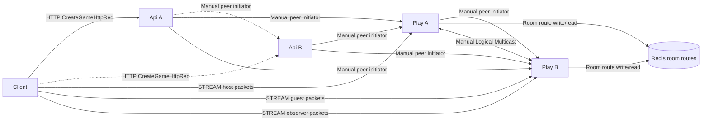
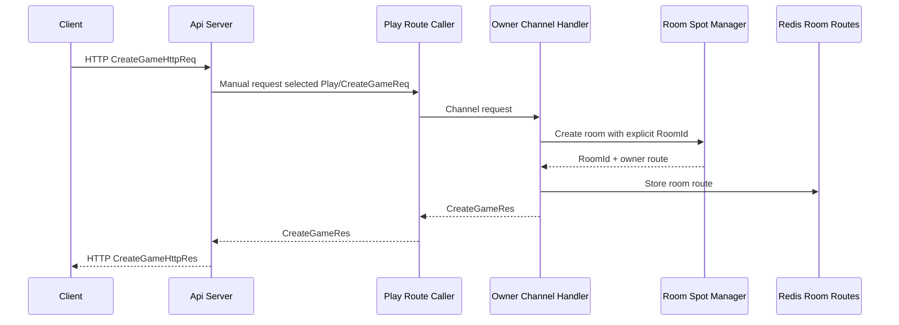
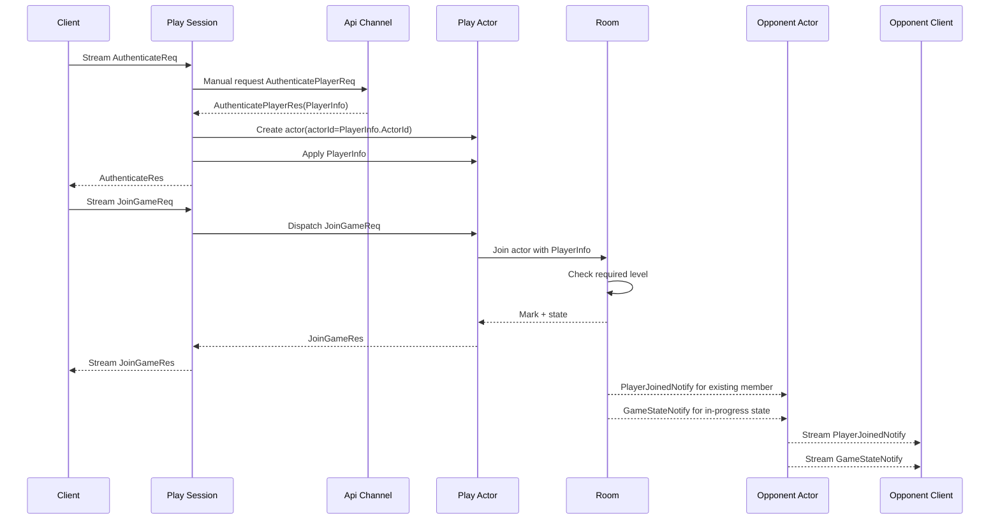
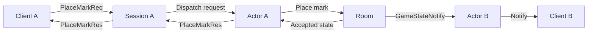
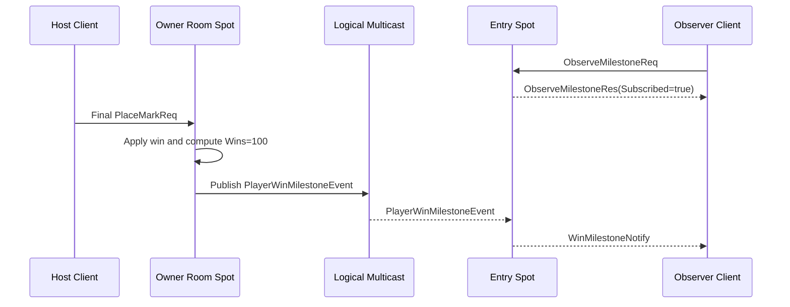
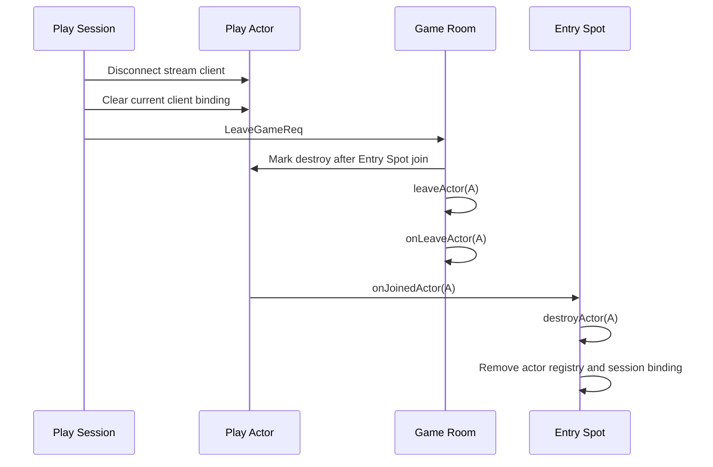

# TicTacToe Sample Scenario

[샘플 목록](../README.ko.md)

> 이 문서는 모든 framework 언어가 공유하는 TicTacToe 샘플 시나리오를 정의한다.
> TicTacToe는 2개 API와 2개 Play 역할로 수동 endpoint 기반 scale-out 실시간 게임
> 흐름을 보여 준다.

## 1. 목적

TicTacToe는 location store 기반 자동 연결 없이 직접 endpoint를 설정해 scale-out을 구성하는
기본 샘플이다. API 역할은 room 생성과 인증 발급을 맡고, Play 역할은 client stream
session, actor, room Spot을 함께 호스팅한다. 샘플은 `api-a`, `api-b`, `play-a`,
`play-b`를 실행해 API와 Play가 모두 2개 이상일 때도 같은 게임 흐름이 유지되는지
보여 준다.

별도 Session 서버는 없다. 대신 각 Play 서버가 자기 stream session과 session relay를
소유하고, room Spot은 Redis에 기록된 room route를 통해 owner Play의 MeshNode로
찾아간다. 이 구조는 framework가 stream, actor, Spot 경계를 어떻게 연결하는지 보여 주면서,
운영 환경에서 흔히 쓰는 Redis 기반 위치 저장소를 각 언어 framework의 public spot remote
address resolver 계약 뒤에 숨긴다.

이 샘플에서 확인해야 하는 핵심은 아래와 같다.

- 2개 API 서버가 같은 client-facing HTTP API를 제공한다.
- 각 API 서버가 2개 Play MeshNode의 ROUTER peer endpoint에 수동으로 연결한다. ChannelName별 endpoint를
  추가하지 않는다.
- 2개 Play 서버가 각각 stream session, actor runtime, MeshNode, room Spot factory를
  호스팅한다.
- Play 서버끼리는 MeshNode router endpoint를 수동으로 연결한다.
- Play 서버는 room 생성 시 Redis room route store에 `roomId`와 owner MeshNode 위치를
  기록한다.
- Play 서버는 stream 인증 시 API 서버에서 user 정보를 받아 actor에 설정한다.
- actor가 `JoinSpot(roomId)` 같은 public actor API를 사용할 때 Redis-backed resolver가
  room owner MeshNode route를 반환한다.
- actor는 room join payload에 user 정보를 함께 보내고, room Spot은 level 조건을 확인한 뒤
  join을 허용한다.
- 승리로 player win count가 100이 되면 room Spot이 Logical Multicast topic으로 milestone
  event를 publish하고, 다른 Play 서버의 `PlayEntrySpot` 안에 등록된 observer handler가
  같은 event를 받아 observer client로 push한다. 이 handler는 `PlayEntrySpot`의 내부 책임이지
  별도 Spot 타입이 아니다.
- client는 API 서버에서 받은 Play endpoint 목록으로 직접 stream 연결을 만든다.
- Play session은 인증 후 actor를 만들고 현재 stream session에 bind한다.
- room Spot은 board, turn, 승패 판정을 소유한다.
- 연결은 location store 기반 자동 연결 없이 수동 endpoint 설정과 Redis room route store로 구성한다.
- handler는 annotation·attribute·decorator로 선언하되, **자동 스캔 없이 구성 코드에서 직접 등록**한다.
- TicTacToe의 stream, channel, actor, room Spot payload는 JSON을 사용한다.

Client self-check도 샘플의 일부다. client는 `.NET` 샘플처럼 request에 넣은 값과 response,
server push payload가 맞는지 확인한다. `PlayerJoinedNotify`, `GameStateNotify`,
`WinMilestoneNotify` 대기는 stream connector의 public wait interface를 직접 사용한다.
sample-local queue polling은 결과 출력이나 추가 검증에는 사용할 수 있지만 push 대기의 기준
경로가 되면 안 된다.

TicTacToe는 scale-out 연결 흐름을 보여 주는 샘플이지만 payload codec은 읽기 쉬운 JSON으로
둔다. room 생성, 인증, join, move, notify 흐름을 여러 언어에서 바로 비교할 수 있어야
한다. schema 중심의 binary 계약은 Bingo의 Protobuf 샘플이 맡는다.

## 2. 서버 구성

TicTacToe의 Channel 역할과 수동 peer 방향은 [공통 topology 기준](../README.ko.md#channel-역할과-물리-topology-기준)을
따른다. Api와 Play는 `tictactoe` RouteMesh 하나를 공유하고 peer 쌍마다 pipe 하나만 사용한다. Play→Api
request는 `tictactoe.api` Channel을 사용하며 별도 connect와 ClientServer Channel을 추가하지 않는다.
두 Api는 `play-0`과 `play-1`의 Client다. PlayA는 `play-0`, PlayB는 `play-1`의 Server이므로 Api는
room을 생성할 ChannelName을 선택하며 업무 호출에서 peer endpoint를 선택하지 않는다.



다이어그램의 흐름은 아래와 같다.

- 위 다이어그램은 room owner가 `Play A`인 경우의 예시다. 실제 실행에서는 API의 owner 선택
  결과에 맞춰 host는 owner Play에, guest와 observer는 owner가 아닌 Play에 연결해야 한다.
- client는 `CreateGameHttpReq`를 API 서버 HTTP endpoint 중 하나로 보낸다.
- API 서버는 `play-0` 또는 `play-1` ChannelName으로 `CreateGameReq`를 보낸다. 수동 endpoint 목록은
  MeshNode peer 연결에만 사용하고 업무 요청 대상을 고르는 인자로 사용하지 않는다.
- 요청을 받은 Play 서버는 room을 만들고 Redis에 room route를 기록한다.
- API 응답은 room id, Play stream endpoint 목록, 각 Play endpoint에 대응하는 MeshNode rid를
  반환한다.
- client는 응답에 들어 있는 Play stream endpoint만 사용한다. client 설정에 Play endpoint를
  미리 넣지 않는다.
- host client는 room owner Play에 연결하고, guest client와 observer client는 다른 Play에
  연결한다.
- guest actor가 같은 `RoomId`로 join하면 Redis-backed resolver가 owner MeshNode 위치를
  찾아 remote room Spot으로 라우팅한다.
- observer actor는 owner가 아닌 Play 서버의 well-known local `PlayEntrySpot`에 observer로
  등록되고, `PlayEntrySpot`이 milestone topic을 구독한다. 별도 Spot 타입을 새로 만들라는
  뜻이 아니다.
- 게임에서 host가 승리해 누적 승수가 100이 되면 owner room Spot이 milestone event를
  publish하고, observer actor가 존재하는 Play 서버의 `PlayEntrySpot` observer handler가 이
  event를 받아 observer client로 push한다.
- Play 서버는 stream 인증 시 API가 시작해 둔 MeshNode peer pipe를 반대 방향으로 사용해 API Channel에
  인증을 요청한다. Play→API 전용 endpoint 연결은 추가하지 않는다.

## 3. 프로세스와 책임

| 프로세스 | 구성 요소 | 책임 |
|----------|-----------|------|
| `TicTacToe.ApiA` / `TicTacToe.ApiB` | HTTP endpoint | room 생성 요청을 받고 client에 접속 정보를 반환한다. |
| `TicTacToe.ApiA` / `TicTacToe.ApiB` | `tictactoe.api` ChannelName handler | Play 서버의 인증 요청을 처리하고 user 정보를 반환한다. |
| `TicTacToe.ApiA` / `TicTacToe.ApiB` | `play-0`·`play-1` ChannelName client | 선택한 ChannelName의 ready Play 서버에 room 생성을 요청한다. |
| `TicTacToe.PlayA` | `play-0` ChannelName handler | room을 만들고 stream endpoint 목록과 MeshNode rid 목록을 반환한다. |
| `TicTacToe.PlayB` | `play-1` ChannelName handler | room을 만들고 stream endpoint 목록과 MeshNode rid 목록을 반환한다. |
| `TicTacToe.PlayA` / `TicTacToe.PlayB` | `tictactoe.api` ChannelName client | API→Play로 이미 설정된 peer pipe의 반대 방향에서 ready API member에 인증을 요청한다. Client 역할은 송신 대상을 선언하며 별도 connect를 뜻하지 않는다. |
| `TicTacToe.PlayA` / `TicTacToe.PlayB` | stream server | client 연결과 session dispatch를 처리한다. |
| `TicTacToe.PlayA` / `TicTacToe.PlayB` | actor runtime | 인증된 actor를 user 정보로 설정하고 room에 join한다. |
| `TicTacToe.PlayA` / `TicTacToe.PlayB` | MeshNode | API·Play ChannelName membership, Spot·Actor와 Logical Multicast를 하나의 ROUTER endpoint로 제공한다. |
| `TicTacToe.PlayA` / `TicTacToe.PlayB` | Redis location store | room Spot 위치와 actor 위치를 저장하고 읽는다. |
| `TicTacToe.PlayA` / `TicTacToe.PlayB` | spot/room | 입장 level 조건, board, turn, 승패 판정을 소유한다. |

Play 서버 안에서 stream session과 actor, room이 함께 움직인다. 두 Play 서버는 같은 역할을
수행하지만, room Spot은 한 owner MeshNode에만 존재한다. 다른 Play 서버에 존재하는 actor가 같은
room에 join할 때는 Redis-backed location store에서 얻은 `SpotHandle`이 대상 room Spot을 가리킨다.

## 4. 디렉토리와 파일 구성

TicTacToe 샘플은 작은 게임이지만 DDD와 헥사고날 아키텍처의 경계를 드러내도록 구성한다.
이 구조는 C++, Java, Kotlin, TypeScript, .NET 샘플을 작성할 때 함께 따라야 하는
공통 기준이다. 언어별 빌드 도구, 파일 확장자, package/module 표현은 달라질 수 있지만,
`Client`, `Shared`, `Server/Api`, `Server/Play/Domain`, `Server/Play/Application`,
`Server/Play/Infrastructure` 경계와 각 책임은 유지해야 한다.

`Client`는 외부 사용자가 수행하는 self-check 시나리오이고, `Shared`는 client와 server가
공유하는 메시지 계약이다. `Server` 안에서는 HTTP API adapter와 Play runtime adapter가
같은 프로세스에 있어도 코드 경계는 분리한다.

```text
TicTacToe/
  README
  build files
  Client/
    Program
    TicTacToeClientScenario
    client build/module files
    README
  Shared/
    shared build/module files
    Contracts/
      Messages
  Server/
    server build/module files
    Program
      Configuration/
      SampleNames
      SampleSettings
      RedisRoomRouteStore
      RedisLocationStore
    Api/
      ApiServer
      Handlers/
        AuthenticatePlayerHandler
        CreateGameHttpHandler
    Play/
      PlayServer
      Domain/
        TicTacToe/
          TicTacToeBoard
          TicTacToeMatch
      Application/
        GameCreation/
          TicTacToeGameCreator
      Infrastructure/
        ZLink/
          Actors/
            PlayActor
            PlayActorFactory
          Handlers/
            CreateGameHandler
          Sessions/
            PlaySession
          Spots/
            EntrySpot/
              PlayEntrySpot
              Handlers/
                PlayActorObserveMilestoneHandler
                PlayActorJoinGameHandler
                PlayerWinMilestoneEventHandler
            TicTacToeGameSpot/
              TicTacToeGame
              Handlers/
                PlayActorLeaveGameHandler
                PlayActorPlaceMarkHandler
                TicTacToeGameTimerHandler
```

위 구조는 파일명 고정 규칙이 아니라 역할과 경계의 기준이다. 예를 들어 Java/Kotlin은
package와 class 이름으로, TypeScript는 module과 file 이름으로, C++은 header/source
쌍과 namespace로, .NET은 project와 class 이름으로 같은 구조를 표현할 수 있다. 중요한
점은 같은 책임의 코드가 같은 위치에 있고, 다른 레이어로 섞이지 않는 것이다.

각 영역의 역할은 아래와 같다.

| 위치 | 공통 아키텍처 역할 | 책임 |
|------|----------------------|------|
| `Client/Program` | 외부 driving adapter | client 설정을 읽고 self-check 시나리오를 실행한다. 서버 실행이나 Play stream 연결 생성은 맡지 않는다. |
| `Client/TicTacToeClientScenario` | sample scenario | HTTP `POST /games`로 room을 만들고, 응답의 Play stream endpoint 목록으로 host, guest, observer connector를 만든 뒤 인증, join, move, push 검증을 순서대로 수행한다. |
| `Shared/Contracts/*` | shared contract | HTTP, channel, stream, actor, Spot payload 계약을 정의한다. |
| `Server/Configuration/*` | composition settings | 샘플 endpoint, Redis endpoint, instance 이름, routing id, timeout, logging 설정을 한 곳에 모은다. |
| `Server/Api/*` | inbound HTTP adapter, API channel adapter | client의 room 생성 요청과 Play 서버의 인증 요청을 처리한다. |
| `Server/Play/Domain/TicTacToe/*` | domain model | board, player, turn, 승패 판정 같은 게임 규칙을 framework 타입 없이 표현한다. |
| `Server/Play/Application/GameCreation/*` | application use case | room id 생성, Spot 생성 요청, Redis room route 기록을 조율한다. |
| `Server/Play/Infrastructure/ZLink/*` | ZLink adapter | channel, stream session, actor, Spot callback을 application/domain 호출로 변환한다. |

observer milestone 알림 처리는 `PlayEntrySpot` 안의 observer handler와 private registry
책임으로 둔다. 언어별 framework 제약 때문에 helper class나 private registry 객체를 둘 수는
있지만, `PlayerNotificationSpot` 같은 별도 public sample Spot 타입을 만들어 room Spot과
나란히 노출하지 않는다. 이 규칙은 C++, Node, Kotlin, Java 샘플을 같은 구조로 읽게 하기
위한 것이다.

의존 방향은 `Infrastructure -> Application -> Domain`이다. Domain은 ZLink framework, HTTP,
stream connector, logger를 알지 않는다. Application은 use case 조율을 맡고, 외부 입출력
세부 사항은 adapter에 둔다. 이 규칙 덕분에 샘플은 작아도 게임 규칙과 framework 배선이
섞이지 않는다.

## 5. 언어별 구현 기준

TicTacToe 샘플은 모든 framework 언어에서 같은 public framework 모델로 작성되어야 한다.
언어 문법과 빌드 도구는 달라도 사용자가 샘플을 열었을 때 같은 역할, 같은 흐름, 같은
검증 지점을 찾을 수 있어야 한다.

언어별 구현은 아래 기준을 만족해야 한다.

- 샘플 루트에는 client, shared contracts, server 역할이 한 번만 보이게 구성한다. IDE나
  build tool에서 같은 역할의 프로젝트나 module이 중복으로 보이면 안 된다.
- client와 server는 각각 명시적인 entry point를 가진다. 실행 시작 코드는 짧게 두고,
  실제 시나리오 검증은 `TicTacToeClientScenario` 같은 client scenario 구성 요소에 둔다.
- client scenario는 API HTTP endpoint만 입력으로 받아야 한다. Play stream endpoint 목록은
  `CreateGameHttpRes`에서 받은 값을 사용해 connector를 만든다. client 설정 파일이나
  entry point가 Play stream endpoint를 미리 주입하면 실제 사용자 흐름과 달라진다.
- `Shared/Contracts`에는 HTTP, channel, stream, actor, Spot payload 계약을 모은다.
  packet name 문자열이나 동적 payload 구조를 handler와 client 코드에 흩어 놓지 않는다.
  client와 server는 message 객체의 public interface만 사용해야 하며, 샘플 전용 helper로
  payload 계약을 감추면 안 된다.
- TicTacToe의 payload codec은 JSON이다. 각 언어는 같은 field 이름을 가진 typed message
  정의를 사용하고, MessagePack이나 Protobuf로 바꾸지 않는다.
- client self-check는 별도 테스트 프로젝트가 아니라 샘플 client 실행 흐름 안에 둔다.
  샘플 실행은 실제 server를 시작하고 client가 접속해 `tictactoe=completed`에 해당하는
  성공 결과를 만들 수 있어야 한다.
- 샘플 실행에는 Redis가 필요하다. 애플리케이션 코드는 Redis endpoint만 설정으로 받고,
  Docker container 생성이나 종료를 직접 맡지 않는다. `run_sample`은 실행마다 자기 실행에만
  쓰는 전용 Docker Redis container를 준비하고, 샘플 종료 시 자신이 만든 container만 정리한다.
- `run_sample`이 Redis container를 직접 준비할 때는 실행마다 고유한 container 이름, Docker가
  배정한 localhost port, 실행별 key prefix를 사용해야 한다. 외부 Redis endpoint 재사용 mode는
  제공하지 않는다. 이렇게 해야 동시에 실행되는 다른 테스트나 다른 샘플의 room route와 섞이지 않는다.
- Redis client dependency는 room route store adapter 안에만 둔다. handler, actor, Spot,
  Domain 코드가 Redis client 타입을 직접 참조하면 안 된다.
- actor가 room에 join하는 흐름은 각 언어 framework의 public actor/Spot API와 public spot
  handle resolver 계약을 사용해야 한다. 샘플을 통과시키기 위해 framework의
  internal runtime 객체나 sample-local route helper로 remote join 경로를 우회하면 안 된다.
- Logical Multicast 흐름은 각 언어 framework의 public Logical Multicast API를 사용해야 한다. Spot은
  public subscribe 등록 API로 milestone topic을 구독하고, room Spot은 public publish API로
  milestone event를 발행한다. 샘플 전용 fan-out helper나 channel publish 우회로 대체하면
  안 된다.
- push 대기는 connector 객체의 public wait interface를 직접 사용한다. 필요한 push를 고를
  때는 connector wait API의 filter 기능을 사용하고, 받은 message 객체의 public interface로
  payload를 읽어 `Ensure(condition)`처럼 조건식이 직접 보이는 방식으로 검증한다.
- client는 API 응답으로 받은 Play stream endpoint 목록에서 host, guest, observer connector를
  만든 직후, `connect` 전에 inbound observer를 등록해 `stream-inbound` marker가 포함된 수신
  로그를 남긴다.
  이 로그는 request 응답과 server push 수신을 관찰하기 위한 것이며, payload 검증이나
  push 대기를 대신하지 않는다. observer callback에서는 connector send/request/wait를
  다시 호출하지 않는다.
- Java와 Kotlin client scenario의 `submit`과 `await` 의미는
  [framework 공통 비동기 정책](../../spec/04-async-execution-policy.ko.md)을 따른다.
  `submit`은 작업을 시작하고 future를 반환하는 이름으로, `await`는 완료를 기다려
  결과를 받는 이름으로 사용한다.
- sample-local inbox, sleep, 임시 polling 함수로 준비 상태나 push 도착을 숨기면 안 된다.
  대기와 검증은 connector와 message 객체 인터페이스를 사용하는 샘플 시나리오 코드에서
  드러나야 한다.
- Domain에는 board, turn, win/draw 판정만 둔다. stream session, actor context,
  handler, logger, codec, endpoint 설정은 Domain으로 들어오면 안 된다.
- Application은 room 생성 use case를 조율한다. framework callback을 직접 받거나
  transport 세부 구현을 다루지 않는다.
- Infrastructure는 HTTP, channel, stream session, actor, Spot, timer, codec 연결을 맡는다.
  handler나 Spot adapter가 board 판정, turn 판정, winner 판정을 직접 구현하면 안 된다.

이 기준은 샘플의 모양을 통일하려는 목적만이 아니다. 같은 시나리오를 여러 언어에서
나란히 읽었을 때 framework 기능 차이와 언어 차이만 보이고, 샘플 구조 차이 때문에
흐름을 다시 해석하지 않아도 되게 하기 위한 기준이다.

## 6. 수동 연결 방식

TicTacToe는 location store 기반 자동 연결을 사용하지 않는다. API 서버와 Play 서버는 샘플
설정에 적힌 endpoint를 직접 사용하고, room Spot 위치는 Redis room route store에서 찾는다.

| 연결 | 설정 주체 | 예시 의미 |
|------|-----------|-----------|
| client -> API HTTP | client 설정 | room 생성 API endpoint |
| API MeshNode -> API MeshNode | API-A 설정 | API-A가 API-B에 시작하는 canonical full-mesh peer 연결 |
| API -> Play ChannelName | `play-0` 또는 `play-1` 선택 | API MeshNode에 설정된 수동 peer 연결 위에서 해당 Channel의 ready server를 선택한다. |
| Play -> API ChannelName | 추가 연결 없음 | `tictactoe.api` Client 역할은 API→Play로 이미 설정된 양방향 peer pipe를 사용한다. |
| Play MeshNode -> Play MeshNode | Play 서버 설정 | RID direct·Spot direct·Logical Multicast가 공유하는 ROUTER endpoint의 수동 연결 |
| Play -> Redis | Play 서버 설정 | room id에서 owner MeshNode 위치를 저장하고 조회하는 Redis endpoint |
| client -> Play stream | API 응답 | 생성된 room이 사용할 Play stream endpoint 목록 |

이 샘플이 수동 연결을 쓰는 이유는 자동 발견이 없는 기본 배선도 framework로 표현할 수
있음을 보여 주기 위해서다. 공유 location store 기반 자동 연결은 Bingo 샘플이 맡는다.

Redis는 location store 기반 자동 연결을 대신하는 장치가 아니다. 여기 쓰는 Redis에는 room Spot의
위치만 저장한다. endpoint 목록, process 실행 순서, channel 연결은 여전히 샘플 설정과
runner가 명시적으로 제공한다.

네 MeshNode의 수동 full mesh는 각 unordered peer 쌍마다 initiator를 하나만 둔다. API-A→API-B,
API-A→Play-A/Play-B, API-B→Play-A/Play-B, Play-A→Play-B가 canonical initiator다. 반대 방향
업무 호출은 이미 설정된 양방향 peer pipe를 사용하며 reciprocal connect를 추가하지 않는다.

### 6.1 Room owner 선택

API 서버는 room 생성 요청을 받을 때 `play-0` 또는 `play-1` ChannelName을 선택해
`CreateGameReq`를 보낸다. 선택된 Channel의 Play 서버가 그 room의 owner가 되고, room Spot은 owner
Play의 MeshNode에 생성된다. 수동 설정된 endpoint는 peer 연결을 구성할 때만 사용한다.

owner 선택은 테스트 실행마다 달라질 수 있다. 이 샘플은 특정 room이 항상 `play-a`나
`play-b`에 만들어진다고 보장하지 않는다. 다만 sample self-check와 log 비교가 흔들리지
않도록 완전 random이 아니라 deterministic round-robin을 사용한다. 예를 들어 한 API
프로세스 안에서 첫 room은 `play-a`, 다음 room은 `play-b`처럼 선택한다.

검증 기준은 특정 Play 이름이 아니다. API 응답의 `OwnerPlayEndpoint`가 실제 room을 만든
Play endpoint와 같고, Redis room route store의 owner node rid가 그 owner Play의 MeshNode
rid와 같아야 한다. client self-check는 host를 `OwnerPlayEndpoint`에 연결하고, guest와
observer를 owner가 아닌 Play endpoint에 연결해 remote join 경로와 cross-node Logical Multicast 경로를
검증한다. client는 API 응답의 `PlayNodes`에서 endpoint와 MeshNode rid의 매핑을 확인하므로,
`ReceivingMeshNodeRid` 검증을 위해 샘플 설정의 내부 naming convention을 알 필요가 없다.

### 6.2 room 위치 조회

**샘플이 자체 Redis 스키마를 만들지 않는다.** Play 서버는 공식 Redis location store를
`AddLocationStore(new ZLinkRedisLocationStore(...))`로 등록하고, room Spot을 만들면 framework
lifecycle이 **spot location row**를 자동으로 기록한다. row schema, key 규약, owner lease와
generation은 [41 Redis location store](../../spec/41-location-store-redis.ko.md)가 소유하며
샘플이 다시 정의하지 않는다.

room Spot의 routing id는 `RoomId`에서 파생한다. 다른 노드가 그 room으로 보낼 때는 **spot handle
resolver**로 spot rid에 해당하는 `SpotHandle`을 얻고, 전송 API는 그 handle을 받는다. handle은
불투명하며 owner node rid와 전송 mesh는 framework가 소유한다 — 샘플 코드가 owner node rid를 읽거나
보관하지 않는다([24 spot 주소 메시징](../../spec/24-spot-address-messaging.ko.md)).

모든 언어 샘플은 같은 resolver와 `SpotHandle` 전송 의미를 사용해야 하며, 한 언어만 internal runtime
객체나 별도 route helper로 이 경로를 우회하면 안 된다.

Redis에 없는 room id는 재시도 가능한 route-not-found 오류로 처리한다. 없는 room을 샘플
전용 fallback으로 새로 만들면 scale-out routing 오류가 숨겨지므로 금지한다.

### 6.3 Logical Multicast 연결

Play 서버끼리 연결하는 MeshNode ROUTER는 ChannelName, RID direct, remote room Spot request, actor join과
Logical Multicast가 함께 사용한다. milestone 알림을 위해 별도 endpoint를 만들지 않는다. 두 Play
서버는 설정에 적힌 peer MeshNode endpoint로 한 번만 연결한다.

Logical Multicast에는 Redis room route store를 사용하지 않는다. publish 대상은 특정 room Spot
위치가 아니라 topic이다. 이 샘플의 topic은 `tictactoe.player.milestone`처럼 모든 언어에서
같은 문자열 의미를 유지해야 한다. 각 Play 서버는 시작할 때 자기 MeshNode의 local
`PlayEntrySpot`에 milestone topic subscribe handler를 등록한다. observer actor는
`ObserveMilestoneReq`를 보내 현재 연결된 Play 서버의 `PlayEntrySpot`에 observer로
등록된다. `PlayEntrySpot`은 publish event를 받으면 자기 `Context.NodeRid`를 담아
`WinMilestoneNotify` client push로 바꾼다.

여기서 observer handler는 별도 Spot lifecycle을 뜻하지 않는다. C++, Node, Kotlin, Java처럼
파일 구조와 framework callback 표현이 다른 언어도 observer 목록 관리와 `WinMilestoneNotify`
전송 책임을 `PlayEntrySpot` 또는 그 안의 private helper에 둔다.
room 상태를 소유하는 `TicTacToeGame`에 observer를 등록하면 owner가 아닌 Play 서버에서
milestone을 받는 흐름을 설명하기 어렵고, 별도 public Spot 타입을 만들면 샘플의 Spot 구조가
언어마다 달라지므로 피한다.

room Spot은 승리 처리 중 player win count가 100이 되는 순간 `PlayerWinMilestoneEvent`를
publish한다. 샘플에서는 API fake user store가 host player를 `Wins = 99`로 인증하고,
room Spot은 이번 판의 승리 결과로 event payload의 `Wins`만 100으로 계산한다. 이 샘플은
영속 user profile 갱신을 구현하지 않는다. profile 갱신까지 보여 주면 Logical Multicast 검증보다
외부 저장소 흐름이 더 커지기 때문이다.

언어별 public API 이름은 다를 수 있지만 의미는 같아야 한다. MeshNode는 하나의 ROUTER endpoint와
room ChannelName membership을 등록한다. local `PlayEntrySpot`은 topic subscription을 등록하고 room
Spot은 public Logical Multicast API로 event를 제출한다.

이 흐름은 알림과 projection에 사용하는 event fan-out 예시다. turn 처리, board mutation,
join admission처럼 반드시 한 owner room Spot에서 결정해야 하는 상태 변경을 Logical Multicast로
처리하면 안 된다.

### 6.4 언어별 Redis client

각 언어 샘플은 널리 쓰이고 dependency 관리가 쉬운 Redis client를 사용한다. Redis client는
샘플의 공개 흐름이 아니라 저장소 adapter의 구현 세부 사항이므로, client 선택이 handler,
actor, Spot, Domain 코드에 드러나면 안 된다.

| 언어 | Redis client 기준 | 적용 위치 |
|------|-------------------|-----------|
| .NET | `StackExchange.Redis` | `RedisRoomRouteStore` adapter |
| Java/Kotlin | Lettuce 또는 같은 수준의 비동기 Redis client | `RedisRoomRouteStore` adapter |
| Node.js | `ioredis` 또는 `redis` package | `RedisRoomRouteStore` adapter |
| C++ | `redis-plus-plus` | `redis_room_route_store` adapter |

C++ 샘플은 `redis-plus-plus`를 사용한다. C++ framework는 이미 C++20과 vcpkg manifest를
기준으로 빌드하므로, C++ TicTacToe 샘플은 `framework/languages/cpp/vcpkg.json`에
`redis-plus-plus` dependency를 추가하고 sample target에만 link한다. Redis protocol을
직접 구현하거나 raw TCP command helper를 샘플에 넣지 않는다. 샘플 코드가 Redis 사용법을
보여 주는 예제로 바뀌면 framework resolver 흐름이 흐려지기 때문이다.

### 6.5 Redis 실행 책임

샘플 애플리케이션은 Docker를 직접 호출하지 않는다. Docker container 준비는 runner의
책임이다.

- `run_sample`은 실행마다 전용 Redis container를 시작하고 ready 상태를 확인한 뒤 endpoint를
  API/Play 프로세스에 전달한다.
- runner는 정상 종료와 실패 종료 모두에서 자신이 만든 Redis container를 정리한다.
- Docker를 사용할 수 없으면 runner는 명확한 오류를 출력하고 중단한다.
- 외부 Redis endpoint 재사용 mode는 제공하지 않는다. Redis endpoint는 runner가 만든 container에서
  파생한 값을 사용한다.
- C++, .NET, Java, Kotlin, Node 샘플은 모두 같은 runner-owned Redis container 계약을 사용한다.

## 7. Handler 등록 방식

**TicTacToe는 수동 등록 샘플이다.** 두 축을 분리해서 본다.

| 축 | TicTacToe |
|----|-----------|
| **handler 선언** | 다른 샘플과 **같다** — attribute(.NET) / annotation(Java·Kotlin) / decorator(Node)로 packet kind와 이름을 선언한다 |
| **handler 등록** | 다른 샘플과 **다르다** — assembly·module **스캔에 의한 자동 등록을 쓰지 않고**, 구성 코드에서 그 handler 타입을 직접 등록한다 |

즉 "선언은 선언형, 등록은 수동"이다. 자동 등록을 기본으로 켠 언어라도 이 샘플에서는 스캔을 끄거나
쓰지 않고, channel builder·session `Configure()`·spot `Configure()`에서 handler를 명시적으로
등록한다. subscription은 등록 호출에 topic을 인자로 넘긴다.

**이것이 수동 축을 보여 주는 샘플이라는 뜻이다.** TicTacToe는 연결도 수동(endpoint 직접 지정),
등록도 수동이다. 자동 연결과 자동 등록은 나머지 정본 샘플이 맡는다
([샘플 규약](../README.ko.md)). 이 대비 자체가 TicTacToe의 목적 중 하나다.

**C++ 샘플은 예외다.** runtime 스캔도 annotation 기반 선언도 쓰지 않고 compile-time 타입과 명시
builder 호출로 등록하므로, TicTacToe에서 특별히 달라지는 것이 없다.

등록 방식이 달라도 handler 역할은 같아야 한다. room 생성, 인증, join, leave, move 처리 handler는
같은 메시지 이름과 같은 책임을 유지한다.

## 8. Play 서버 내부 레이어

TicTacToe Play 서버는 작은 샘플이지만 domain logic과 framework adapter를 분리해야
한다. 다른 언어 framework로 구현할 때도 아래 구조와 책임 분리를 유지한다.

```text
Server/Play/
  Domain/
    TicTacToe/
      TicTacToeBoard
      TicTacToeMatch
  Application/
    GameCreation/
      TicTacToeGameCreator
  Infrastructure/
    ZLink/
      Actors/
        PlayActor
        PlayActorFactory
      Handlers/
        CreateGameHandler
      Sessions/
        PlaySession
      Spots/
        EntrySpot/
          PlayEntrySpot
          Handlers/
            PlayActorObserveMilestoneHandler
            PlayActorJoinGameHandler
            PlayerWinMilestoneEventHandler
        TicTacToeGameSpot/
          TicTacToeGame
          Handlers/
            PlayActorLeaveGameHandler
            PlayActorPlaceMarkHandler
            TicTacToeGameTimerHandler
```

역할은 아래처럼 나눈다.

| 위치 | 책임 |
|------|------|
| `Domain/TicTacToe/TicTacToeBoard` | 9칸 board, cell 범위 검증, 이미 사용한 cell 검증, 승리 라인 판정을 소유한다. |
| `Domain/TicTacToe/TicTacToeMatch` | player join, X/O 배정, turn, timeout, win/draw 상태 전이, snapshot 생성을 소유한다. |
| `Application/GameCreation/TicTacToeGameCreator` | 명시적인 `RoomId`를 만들고, 그 `RoomId` 문자열에서 room Spot routing id를 만든 뒤 room을 생성한다. |
| `Infrastructure/ZLink/Sessions/PlaySession` | stream 연결, 첫 packet 인증, actor 생성, session binding, client packet dispatch를 맡는다. |
| `Infrastructure/ZLink/Spots/EntrySpot/PlayEntrySpot` | actor entry lifecycle, room join request dispatch, observer milestone subscription, actor destroy 진입점을 맡는다. |
| `Infrastructure/ZLink/Spots/TicTacToeGameSpot/TicTacToeGame` | ZLink Spot lifecycle, actor join callback, timer 등록, domain 호출, room member push 전송을 맡는다. |
| `Infrastructure/ZLink/Spots/EntrySpot/Handlers/*` | actor request를 받아 entry Spot에서 room Spot으로 join시킨다. |
| `Infrastructure/ZLink/Spots/TicTacToeGameSpot/Handlers/*` | actor request와 timer callback을 받아 room domain operation을 호출한다. |
| `Infrastructure/ZLink/Handlers/CreateGameHandler` | Play channel의 room 생성 request를 application use case로 연결한다. |

observer milestone 처리는 `PlayEntrySpot`의 local notification responsibility다. 언어별로
private helper, nested class, closure, actor map 같은 구현 세부 표현은 달라도 외부에서 볼 수
있는 sample Spot은 `PlayEntrySpot`과 `TicTacToeGame` 두 종류로 유지한다.

Domain 객체는 ZLink framework 타입, stream session, actor context, logger를 알면 안 된다.
`TicTacToeGame` Spot은 actor와 session을 알고 있어도 board cell 검증, turn 검증,
승리 판정을 직접 구현하지 않는다. 이 규칙들이 handler나 Spot adapter에 들어가면
다른 언어 샘플에서 구조가 쉽게 달라지므로 공통 샘플 기준을 만족하지 못한다.

## 9. 게임 규칙

TicTacToe는 같은 규칙을 모든 언어 샘플에서 사용한다.

- 한 room에는 두 actor가 참가한다.
- 첫 actor는 `X`, 두 번째 actor는 `O`를 받는다.
- board는 0부터 8까지의 cell index로 표현한다.
- 같은 cell에는 두 번 둘 수 없다.
- 현재 turn의 actor만 `PlaceMarkReq`를 보낼 수 있다.
- 가로, 세로, 대각선 중 한 줄을 먼저 완성한 actor가 이긴다.
- 모든 cell이 찼고 승자가 없으면 draw다.

## 10. Client 검증 흐름

TicTacToe client는 아래 순서로 scenario를 실행하고 각 단계의 값을 확인한다.

1. HTTP `CreateGameHttpReq`에 넣은 `GameName`이 `CreateGameHttpRes.GameName`으로
   돌아오는지 확인한다. `RoomId`, `OwnerPlayEndpoint`, `PlayEndpoints`, `PlayNodes`가 비어
   있지 않고 `PlayEndpoints`에 서로 다른 Play endpoint가 2개 이상 있는지도 확인한다.
   `PlayNodes`에는 각 Play stream endpoint와 해당 Play MeshNode rid가 함께 들어 있어야 한다.
2. host는 `OwnerPlayEndpoint`로, guest는 `PlayEndpoints` 중 owner가 아닌 endpoint로
   connector를 만든다. observer도 owner가 아닌 endpoint로 connector를 만든다. 이 조건이
   깨지면 scale-out 검증이 되지 않으므로 실패로 처리한다.
3. host, guest, observer가 각각 stream 인증을 요청하고,
   `AuthenticateRes.Player.ActorId`가 요청한 actor id와 같은지 확인한다. 응답에는 display
   name, level, wins가 함께 들어 있어야 하며, host와 guest의 level은 room 입장 조건
   이상이어야 한다.
4. observer가 `ObserveMilestoneReq`를 보내고 `ObserveMilestoneRes.Subscribed = true`를
   확인한다. 이 응답을 받은 뒤에 게임 join과 move를 진행해야 milestone event를 놓치지 않는다.
5. host가 `JoinGameReq(RoomId)`를 보내고 response state의 `RoomId`, `WaitingForPlayers`,
   `X` 배정을 확인한다. host는 자기 join notify를 받지 않아야 한다.
6. guest가 다른 Play 서버에서 같은 `RoomId`로 join하고 response state의 `InProgress`,
   `O` 배정을 확인한다. 이 join은 Redis-backed resolver가 owner MeshNode 위치를 찾는
   경로를 통과해야 한다. join payload에는 actor id뿐 아니라 인증 때 받은 user 정보가
   들어가며, owner room Spot은 level 조건을 만족하는지 확인한다.
7. host는 connector wait API로 `PlayerJoinedNotify`를 기다리고, payload의 `ActorId`,
   `DisplayName`, `Level`, `Mark`, `RoomId`, state status가 guest join을 뜻하는지 확인한다.
   guest는 자기 join notify를 받지 않아야 한다.
8. host는 connector wait API로 game start `GameStateNotify`를 기다리고 첫 turn이 `X`인지
   확인한다.
9. 각 `PlaceMarkReq` response는 board, next turn, last move actor, last move cell을
   확인한다. 상대 client는 connector wait API로 같은 state를 담은 `GameStateNotify`를
   기다려 확인한다.
10. 마지막 host move는 `Won`, winner가 host actor id, board가 deterministic final board인지
   확인한다. guest는 같은 winner를 담은 final `GameStateNotify`를 받아야 한다.
11. host의 인증 정보는 `Wins = 99`에서 시작한다. 마지막 승리로 host의 누적 승수가 100이
   되면 owner room Spot은 `PlayerWinMilestoneEvent`를 publish해야 한다. owner가 아닌 Play
   서버에 연결된 observer client는 connector wait API로 `WinMilestoneNotify`를 기다리고,
   `ActorId`, `DisplayName`, `Wins = 100`, `RoomId`, `ReceivingMeshNodeRid`를 확인한다.
   `ReceivingMeshNodeRid`는 `PlayNodes`에서 observer가 연결한 endpoint에 대응하는 MeshNode
   rid와 같아야 한다.
12. host, guest, observer는 inbound observer 로그에 `stream-inbound` marker가 남았는지
   확인한다. 로그에는 sample 이름, client 역할, message kind, packet name, request sequence,
   payload byte length가 포함되어야 한다. heartbeat control frame은 observer 기능
   검증에는 포함할 수 있지만 기본 sample output에서는 낮은 log level로 두거나 걸러낸다.

이 검증은 성공 로그가 아니라 sample release gate다. 언어별 client가 위 값을 확인하지
않으면 공통 sample 기준을 만족하지 못한다.

## 11. 메시지 계약

아래 계약은 언어 중립 schema다. 언어별 샘플은 같은 이름과 필드를 자기 언어의
record, class, struct, type alias 등으로 구현한다.

공통 user 모델:

```text
PlayerInfo {
  ActorId: string
  DisplayName: string
  Level: int
  Wins: int
}

PlayNodeInfo {
  StreamEndpoint: string
  MeshNodeRid: string
}
```

HTTP와 server channel에서 사용하는 메시지:

```text
CreateGameHttpReq {
  GameName: string?
}

CreateGameHttpRes {
  RoomId: string
  OwnerPlayEndpoint: string
  PlayEndpoints: string[]
  PlayNodes: PlayNodeInfo[]
  GameName: string
  RequiredLevel: int
}

CreateGameReq {
  GameName: string
}

CreateGameRes {
  RoomId: string
  OwnerPlayEndpoint: string
  PlayEndpoints: string[]
  PlayNodes: PlayNodeInfo[]
  GameName: string
  RequiredLevel: int
}

AuthenticatePlayerReq {
  AccessToken: string
}

AuthenticatePlayerRes {
  Player: PlayerInfo
}
```

client stream에서 사용하는 request/response:

```text
AuthenticateReq {
  AccessToken: string
}

AuthenticateRes {
  Player: PlayerInfo
}

JoinGameReq {
  RoomId: string
}

JoinGameRes {
  State: GameState
}

ObserveMilestoneReq {
}

ObserveMilestoneRes {
  Subscribed: bool
}

PlaceMarkReq {
  Cell: int
}

PlaceMarkRes {
  State: GameState
}

LeaveGameReq {
  RoomId: string
}
```

Play actor가 room Spot에 join할 때 사용하는 내부 request/response:

```text
TicTacToeGameJoinReq {
  RoomId: string
  Player: PlayerInfo
}

TicTacToeGameJoinRes {
  State: GameState
}
```

server push 메시지:

```text
PlayerJoinedNotify {
  RoomId: string
  ActorId: string
  DisplayName: string
  Level: int
  Mark: string
  State: GameState
}

GameStateNotify {
  State: GameState
}

WinMilestoneNotify {
  RoomId: string
  ActorId: string
  DisplayName: string
  Wins: int
  ReceivingMeshNodeRid: string
}
```

Logical Multicast으로 전달하는 event:

```text
PlayerWinMilestoneEvent {
  RoomId: string
  ActorId: string
  DisplayName: string
  Wins: int
}
```

공통 state 모델:

```text
GameState {
  RoomId: string
  Board: string
  Status: string
  Winner: string?
  NextTurn: string
  XActorId: string?
  OActorId: string?
  LastMoveActorId: string?
  LastMoveCell: int?
}
```

`Board`는 9글자 문자열이다. 빈 칸은 `.`, `X` actor의 mark는 `X`, `O` actor의
mark는 `O`로 표현한다. 예를 들어 `"X.O...X.."`는 0번과 6번 cell에 `X`, 2번 cell에
`O`가 놓인 상태다.

## 12. Room 생성 흐름



API 서버는 HTTP 요청을 받아 수동 설정된 Play 서버 중 하나에 room 생성을 요청한다. 선택은
deterministic round-robin으로 수행한다. Play 서버는 room을 만들고 owner route를 Redis에
기록한 뒤 owner endpoint, 전체 Play stream endpoint 목록, 각 Play endpoint에 대응하는
MeshNode rid, 최소 입장 level을 반환한다. API 서버는 이 값을 client가 사용할 HTTP 응답으로
바꾼다.
`RoomId`는 client와 server가 함께 쓰는 명시적인 room 식별자다. Spot routing id는
`RoomId` 문자열에서 만든다. 예를 들어 .NET 구현은 `RoutingId.From(roomId)`로 room
Spot을 만들고, `JoinGameReq.RoomId`를 같은 방식으로 routing id로 바꾸어 join한다.
`RoomId`를 core routing id의 hex 문자열로 노출하지 않는다.

TicTacToe 샘플의 기본 room은 `RequiredLevel = 3`을 사용한다. 이 값은 복잡한 매칭 규칙을
보여 주려는 목적이 아니라, room Spot이 actor/user snapshot을 보고 join admission을
판단한다는 점을 드러내기 위한 최소 정책이다.

## 13. 인증과 입장 흐름



첫 packet은 반드시 `AuthenticateReq`여야 한다. 인증이 끝나기 전에 `JoinGameReq`나
`PlaceMarkReq`를 받으면 session은 오류 response를 반환하고 actor를 생성하지 않는다.

Play session은 인증 요청을 API 서버 channel로 보내고, API 서버는 `PlayerInfo`를 반환한다.
`PlayerInfo`에는 actor id, 화면에 보여 줄 이름, level, wins가 들어 있다. Play session은
actor를 만든 뒤 이 user 정보를 actor에 설정하고 현재 stream session에 bind한다.

room 생성 응답에는 `RequiredLevel`이 들어 있다. actor가 `JoinSpot(RoomId)`를 호출할 때는
인증 때 받은 `PlayerInfo`를 `TicTacToeGameJoinReq`에 함께 넣는다. room owner가 다른 Play
서버에 있으면 이 join payload가 MeshNode router 경로를 통해 owner room Spot으로 전달된다.
owner room Spot은 `PlayerInfo.Level`이 `RequiredLevel` 이상인지 확인한 뒤 join을 허용한다.
조건을 만족하지 못하면 join을 거부하거나 오류 response를 반환해야 하며, 샘플 기본
self-check는 level 조건을 만족하는 host와 guest로 성공 경로를 검증한다.

첫 actor가 join할 때는 self-join notify를 보내지 않는다. 두 번째 actor가 join하면 기존
room member에게 새 actor의 user 정보를 담은 `PlayerJoinedNotify`와 `InProgress` state를
담은 `GameStateNotify`를 보낸다. 두 번째 actor는 자기 join 결과를 `JoinGameRes`로 확인한다.

## 14. 수 두기와 Notify 흐름



승리 또는 draw가 만들어지면 `GameState.Status`와 `GameState.Winner`에 결과를 담은
최종 state가 양쪽 client에게 전달되어야 한다. 요청을 보낸 client는 `PlaceMarkRes`에서
최종 state를 받고, 상대 client는 `GameStateNotify`에서 같은 최종 state를 받는다.
잘못된 turn, 이미 사용한 cell, 끝난 room에
대한 요청은 `PlaceMarkRes` 대신 오류 response를 반환한다.

## 15. 승리 milestone Logical Multicast 흐름

TicTacToe 샘플은 Logical Multicast를 단순한 별도 예제가 아니라 게임 흐름 안의 알림 기능으로
사용한다. API의 fake user store는 host player를 `Wins = 99`로 인증한다. host가 이번 판에서
승리하면 room Spot은 새 승수를 100으로 계산하고 milestone event를 publish한다.



observer client는 게임 참가자가 아니다. observer는 owner가 아닌 Play 서버 stream endpoint에
연결해 인증한 뒤 `ObserveMilestoneReq`를 보낸다. Play actor는 현재 연결된 Play 서버의
local `PlayEntrySpot`에 observer로 등록되고, `ObserveMilestoneRes`를 받은 뒤 observer
client는 milestone push를 기다린다. 이 Entry Spot은 `tictactoe.player.milestone` topic을
구독하고, publish event를 받으면 현재 MeshNode routing id를 함께 담아 `WinMilestoneNotify`를
client로 보낸다. self-check는 observer client가 owner가 아닌 Play 서버에 연결되어 있었다는
사실과 `ReceivingMeshNodeRid`가 API 응답의 `PlayNodes`에서 observer endpoint에 대응하는
MeshNode rid라는 사실을 확인한다.

이 시나리오는 remote join과 다른 기능을 검증한다. guest join은 Redis-backed resolver와
MeshNode router request/reply 경로를 검증하고, milestone 알림은 Logical Multicast fan-out 경로를
검증한다. multicast event는 알림 전달용이므로 event 수신을 게임 승패 확정 조건으로 삼으면
안 된다. 게임 결과와 누적 승수 계산은 owner room Spot 또는 그 뒤의 application service가
결정하고, Logical Multicast는 이미 결정된 milestone을 다른 Spot에 알리는 데만 사용한다.

## 16. Disconnect와 actor destroy 흐름

TicTacToe 샘플은 Play 서버가 stream session, actor, room Spot을 함께 호스팅한다. 따라서
disconnect와 actor destroy 흐름도 Play 서버 안에서 짧게 드러나야 한다. disconnect는
stream 연결 정리이고, actor destroy는 room lifecycle이 끝난 뒤 Entry Spot에서 actor를
제거하는 작업이다. 두 동작을 같은 callback에서 섞으면 재접속 가능 상태와 actor lifetime을
구분하기 어렵다.

### 16.1 Disconnect 흐름

client stream이 끊기면 Play session은 현재 session과 연결된 actor client reference나
bound session을 정리한다. disconnect callback은 actor가 더 이상 이 stream으로 push를 받을
수 없다는 사실만 actor에 반영한다. disconnect callback이 room leave나 actor destroy를 직접
실행하면 안 된다.

이 샘플은 disconnect cleanup을 눈에 보이게 구현해야 한다. 언어별 표현은 달라도 아래 동작은
같아야 한다.

- Play session은 disconnect callback에서 현재 session의 actor binding 또는 client reference를
  제거한다.
- actor 객체는 actor runtime에 남아 있고, room에 들어가 있었다면 room membership도 유지된다.
- 이후 같은 actor id로 다시 인증하면 기존 actor를 재사용하거나 같은 의미의 actor 상태로
  복구할 수 있어야 한다.

### 16.2 게임 종료 후 actor destroy 흐름

room Spot이 승리 또는 draw를 감지해 최종 `GameStateNotify`를 전송한 뒤 client는
`LeaveGameReq`를 보낸다. room Spot은 이 명시적인 나가기 요청을 받아 actor를 Entry Spot으로
돌려보내고, Entry Spot은 actor를 정리한다. 정리 순서는 모든 언어 샘플에서 아래와 같아야
한다.

1. actor 객체 생성이 끝나면 framework는 create payload와 함께 `onCreateActor`를 한 번 호출한다.
2. client는 최종 `GameState`를 확인한 뒤 `LeaveGameReq`를 보낸다.
3. room Spot은 요청한 actor에 “Entry Spot으로 돌아오면 destroy한다”는 표시를 남긴다.
4. room Spot은 `leaveActor`로 actor를 room에서 내보낸다.
5. framework는 room `onLeaveActor`를 호출한 뒤 actor를 Entry Spot으로 이동시키고 Entry
   Spot `onJoinedActor`를 호출한다.
6. Entry Spot `onJoinedActor` 또는 Entry Spot handler는 actor의 destroy 표시를 확인하고
   Entry Spot context의 `destroyActor`를 호출한다.
7. `destroyActor`는 `onLeaveActor`나 다른 lifecycle callback을 호출하지 않고 actor 객체,
   native actor ref, framework registry, bound session binding을 정리한다.
8. 같은 actor에 대한 중복 destroy나 destroy 중 재진입은 성공 no-op이어야 하며,
   lifecycle callback을 다시 호출하면 안 된다.



client self-check는 최종 `GameStateNotify`를 검증한 뒤 양쪽 client가 `LeaveGameReq`를
보낸다. `LeaveGameReq`는 actor를 Entry Spot으로 돌려보내는 send command라서 별도 reply를
기다리지 않는다. actor destroy 완료는 client protocol 메시지가 아니므로 server-side
evidence로 확인한다. 언어별 `run_sample` 또는 sample regression은 Play 서버 로그, fake
backend call, runtime event, 또는 framework 테스트 중 하나로 아래 사실을 확인해야 한다.

- disconnect callback이 actor의 current stream binding을 정리한다.
- disconnect cleanup만으로 actor destroy가 실행되지 않는다.
- 게임 종료 후 client가 `LeaveGameReq`를 보낼 때 room Spot `onLeaveActor`가 각 actor마다
  실행된다.
- Entry Spot destroy가 각 actor마다 완료된다.
- Entry Spot destroy 과정에서 Entry Spot `onLeaveActor`나 다른 lifecycle callback이
  추가로 실행되지 않는다.

## 17. Bingo와의 차이

| 항목 | TicTacToe | Bingo |
|------|-----------|-------|
| 연결 방식 | 수동 endpoint 설정 + Redis room route store | 공유 location store 기반 자동 연결 |
| client API 요청 | API 서버로 직접 보낸다. | Session stream 하나로 보낸다. |
| 게임 stream 연결 | API 응답의 Play endpoint 목록으로 서로 다른 Play 서버에 직접 연결한다. | Session 서버 연결 하나만 유지한다. |
| Session 서버 | 별도 프로세스 없음. Play 서버가 session과 room을 함께 소유한다. | 별도 Session 서버가 client stream과 actor binding을 소유한다. |
| Play 서버 | 2개 Play가 stream session, actor, Entry Spot, room Spot, MeshNode route, Logical Multicast를 함께 호스팅한다. | actor, Entry Spot, room Spot을 호스팅한다. |
| 주요 목적 | 수동 endpoint scale-out, room Spot route 조회, Logical Multicast fan-out | 분리된 session gateway 구조 |
| Handler 등록 | **수동 등록** — annotation 기반 handler를 직접 등록(스캔 없음) | 자동 등록(스캔) |

## 18. 완료 기준

- API 역할 2개와 Play 역할 2개가 별도 실행 모드 또는 별도 프로세스로 구분되어 있다.
- 별도 Session 서버 프로세스는 없다.
- location store 기반 자동 연결을 사용하지 않는다. 수동 endpoint로 MeshNode peer pipe를 구성하며,
  ChannelName 호출은 이 peer pipe를 사용한다.
- Play 서버끼리는 하나의 MeshNode ROUTER endpoint를 수동으로 연결하고 remote room Spot request와
  Logical Multicast를 모두 이 peer 연결로 검증한다.
- 공식 Redis location store를 `AddLocationStore(...)`로 등록한다. room Spot의 위치는 framework가
  spot location row로 자동 기록하며, 샘플이 자체 Redis 스키마를 만들지 않는다.
- 모든 언어 샘플은 actor room join에 public actor/Spot API와 public **spot handle resolver**
  계약을 사용한다(반환 값은 불투명한 `SpotHandle`). internal runtime 객체나 샘플 전용 route
  helper로 remote join을 우회하지 않는다.
- 모든 언어 샘플은 milestone 알림에 public Logical Multicast API를 사용한다. internal socket,
  channel publish 우회, 샘플 전용 fan-out helper로 대체하지 않는다.
- `run_sample`은 실행마다 전용 Docker Redis container를 준비하고 종료 시 자신이 만든 container만
  정리한다.
- client는 room 생성 같은 API 요청만 API 서버로 보낸다.
- client는 API 응답으로 받은 Play 서버 stream endpoint 목록에만 직접 연결한다.
- API 응답은 각 Play stream endpoint와 MeshNode rid의 매핑을 `PlayNodes`로 제공한다.
- host는 owner Play 서버 stream endpoint에 연결하고, guest와 observer는 owner가 아닌 Play
  서버 stream endpoint에 연결한다.
- Play session은 `AuthenticateReq`에서 API 서버로 인증 request를 보낸다.
- 인증 응답의 `PlayerInfo.ActorId`를 actor의 `ActorId`로 사용하고, display name과 level을
  actor에 설정한다.
- `JoinGameReq` 이후 actor가 room에 join한다. guest가 owner가 아닌 Play 서버에 연결되어 있어도
  Redis-backed resolver를 통해 owner room Spot에 join해야 한다.
- `JoinSpot` payload에는 `PlayerInfo`가 들어가고, owner room Spot은
  `PlayerInfo.Level >= RequiredLevel` 조건을 확인한 뒤 join을 허용한다.
- host player는 `Wins = 99`로 인증되고, host 승리 후 room Spot은 `Wins = 100` milestone
  event를 publish한다.
- observer client는 owner가 아닌 Play 서버에 존재하는 actor로 `ObserveMilestoneReq`를 보내
  well-known local `PlayEntrySpot`에 observer로 등록되고, `PlayEntrySpot`이 milestone topic을
  구독한다.
- observer client는 `ObserveMilestoneRes.Subscribed = true`를 확인한 뒤 game move를
  진행한다.
- observer client는 milestone publish 후
  `WinMilestoneNotify`를 받아 actor id, display name, wins, room id, receiving MeshNode rid를
  검증한다. receiving MeshNode rid는 `PlayNodes`의 observer endpoint 매핑과 같아야 한다.
- 두 번째 actor가 join하면 기존 room member에게 `PlayerJoinedNotify`가 전달된다.
- `PlayerJoinedNotify`에는 join한 actor의 display name과 level이 들어간다.
- join한 actor 자신에게 self-join notify를 보내지 않는다.
- 정상 move마다 요청한 client에는 `PlaceMarkRes`가, 상대 client에는 `GameStateNotify`가 전달된다.
- 게임 종료 시 `GameState.Status`와 `GameState.Winner`가 양쪽 client에 전달된다.
- 게임 종료 후 양쪽 client는 `LeaveGameReq`를 보낸다.
- host, guest, observer inbound observer 로그에 request 응답과 server push 수신을 나타내는
  `stream-inbound` marker가 남는다.
- stream disconnect는 current client binding을 정리하지만 actor를 즉시 destroy하지 않는다.
- `LeaveGameReq` 후 room Spot은 actor를 Entry Spot으로 leave시키고, Entry Spot은 actor를
  destroy한다.
- actor destroy는 `onLeaveActor`를 호출하지 않고 actor registry와 native actor ref를
  정리한다.
- request/reply는 message name이 아니라 stream request sequence로 매칭된다.
- handler는 annotation·attribute·decorator로 선언하고, 구성 코드에서 직접 등록한다. 자동 스캔을 켜지 않는다(C++ 제외).
- smoke test는 room 생성, 세 client 인증, join, milestone 구독, 최소 한 판 종료까지
  검증한다.
