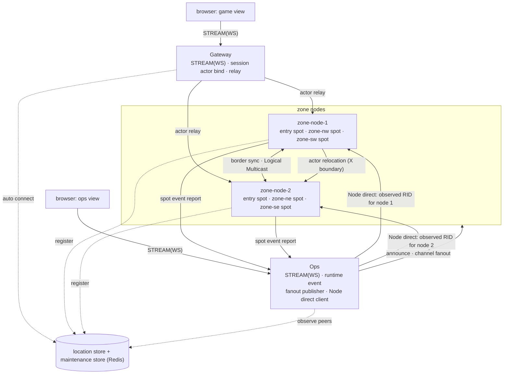
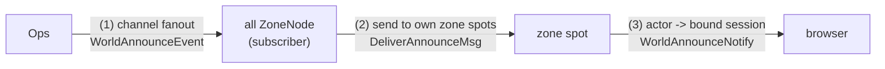
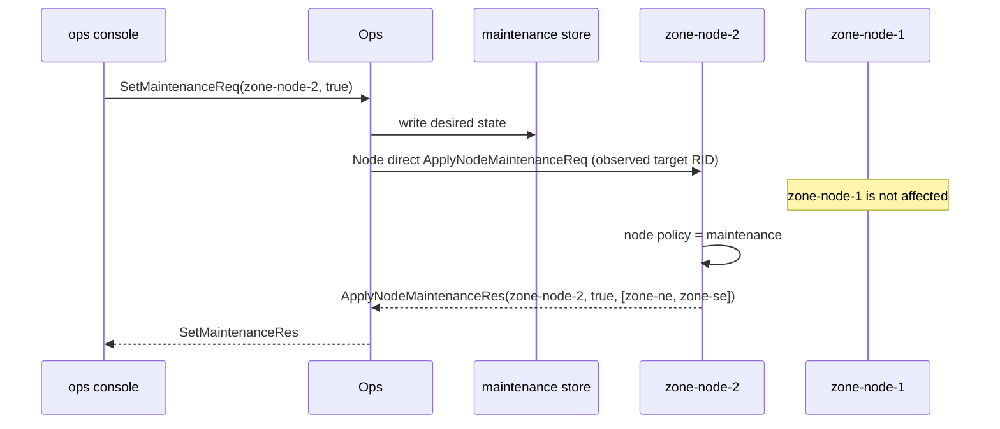

# ZoneWorld Sample Scenario

[샘플 목록](../README.ko.md)

이 문서는 ZoneWorld의 언어 중립 시나리오와 검증 기준을 정의한다. ZoneWorld는 .NET과 Node.js
framework sample로 제공하며, 두 server 구현은 같은 message 계약과 self-check를 사용한다. 브라우저
UI는 TypeScript client 하나를 공유한다. Wire 계약이 언어 중립이므로 같은 client가 두 server에
연결한다. 현재 두 언어 디렉터리는 server, headless scenario client와 `run_sample`
스크립트를 포함하며, 각 runner가 해당 언어 server의 전체 self-check를 실행한다.

ZoneNode는 §3.2의 allocation group에서 transport RID를 받아야 한다. 고정 `NodeRid`나
`SetRoutingId(...)`로 대체하면 시작 순서와 교체 과정의 fencing 계약을 검증할 수 없다.

Server와 headless 시나리오 client는 지원 언어의 sample 디렉터리에 함께 둔다. 여러 언어가 공유하는
브라우저 client만 `shared_sample`에 둔다.

```text
framework/languages/dotnet/samples/ZoneWorld/
  Shared/     Language-neutral message contracts
  Server/     Gateway, ZoneNode, and Ops roles
  Client/     Headless ZW-* scenarios
  run_sample.sh

framework/languages/node/samples/ZoneWorld/
  Shared/     Language-neutral message contracts
  Server/     Gateway, ZoneNode, and Ops roles
  Client/     Headless ZW-* scenarios
  run_sample.sh

framework/languages/shared_sample/zoneworld/
  client/     Shared TypeScript browser client
```

Headless 시나리오 client는 자기 언어의 server 동작을 검증하므로 언어별 디렉터리에 둔다. 브라우저
client는 .NET과 Node.js server가 공유하므로 `shared_sample`에 둔다. 이 구분으로 언어별 검증 코드와
공유 UI의 책임이 섞이지 않는다.

두 `Client`는 서로 다른 계약이다. `<lang>/samples/ZoneWorld/Client/`는 브라우저 없이 §11의 `ZW-*`
시나리오를 실행한다. `shared_sample`의 브라우저 client는 §10의 화면과 실제 browser transport를
검증한다. §6은 언어별 `Server/` 구조를, §9.3은 공유 browser client 구조를 정의한다.

## 1. 목적

ZoneWorld는 **zone 분할 MMORPG**와 그것을 **운영·관제하는 콘솔**을 한 샘플에 담는다.
[01-overview](../../../dotnet/guide/01-overview.ko.md) §2가 게임 서버 4갈래 중 ①로
소개하는 **zoning**(월드를 지리 구역으로 나눠 구역마다 노드가 담당하고, 경계를 넘으면
인접 노드로 이동)을 보여 주는 첫 샘플이다.

ZoneWorld는 multi-node 게임에서 노드 등록 상태 관찰, 전 노드 공지와 특정 노드 점검을 각각 어떤
공개 표면으로 표현하는지 함께 보여 준다.

이 샘플이 보여 주는 것:

- 플레이어가 **경계를 넘으면 actor가 인접 zone 노드로 relocation** 된다. client 연결은
  유지된다.
- 경계 근처 상태를 **인접 zone에 Logical Multicast으로 동기화**한다.
- 관제 콘솔이 **runtime event로 노드 등록·연결 상태를 관찰**한다.
- 관제 콘솔이 **channel fanout으로 전 노드에 공지**한다. 발행자는 노드 목록을 갖지 않는다.
- 관제 콘솔이 **Node direct로 특정 노드를 지정**해 점검 모드로 전환한다.
- **브라우저에서 확인한다.** 게임 화면에서 경계 이동을, 관제 화면에서 노드 상태와
  점검 모드 전환을 확인한다.

### 1.1 표면 선택 기준

이 샘플의 교육 목표다. "여러 노드에 무언가를 한다"가 상황마다 다른 표면을 요구한다.
선택 기준은 [channel topology spec §2·5](../../../spec/server/10-channel-topology.ko.md)을 따른다.

| 하려는 일 | 쓰는 것 | 다른 것으로 안 되는 이유 |
|---|---|---|
| 어느 노드가 등록·연결됐는지 확인한다 | **runtime event** | 요청이 아니라 **변화 알림**이다. 노드가 종료되면 요청할 대상이 없다 |
| **전 노드**에 공지를 전달한다 | **channel fanout** | 발행자가 노드 목록을 갖지 않는다. `SendToChannel`이면 발행자가 노드 목록을 관리해야 한다 |
| **특정 노드**를 점검 모드로 전환한다 | **Node direct** | Ops가 관측한 target RID 하나를 지정하므로 다른 member가 선택되지 않는다. |
| **한 zone의 모든 플레이어**에게 전달한다 | zone spot → 그 spot의 actor들 → 각 bound session | zone spot이 lifecycle에서 받은 immutable `ActorRef`를 보관하므로, 발행자가 명단을 관리하지 않는다 |
| **특정 플레이어 한 명**에게 전달한다 | 그 player actor → 자기 bound session | actor binding이 연결 위치를 이미 해결하므로, 발행자가 노드·연결을 지정하지 않는다 |

> ZoneWorld의 ChannelName, Node direct, Spot·Actor와 Logical Multicast는 하나의 MeshNode ROUTER를
> 사용한다. Node direct는 관제 대상 RID 하나를 지정할 때 사용하고, ChannelName은 ready member 하나를
> 선택할 때 사용한다. classic fanout 공지는 별도 PUB/SUB channel로 유지한다.

## 2. 월드 규격

지원 언어가 같은 결과를 내려면 규칙이 고정되어야 한다.

| 항목 | 값 |
|------|-----|
| 좌표 | `0 <= X < 100`, `0 <= Y < 100` (정수) |
| zone 분할 | 4개 사분면 |
| `zone-nw` | `X < 50`, `Y < 50` |
| `zone-ne` | `X >= 50`, `Y < 50` |
| `zone-sw` | `X < 50`, `Y >= 50` |
| `zone-se` | `X >= 50`, `Y >= 50` |
| 노드 배치 | `zone-node-1` = `zone-nw` + `zone-sw` (서) / `zone-node-2` = `zone-ne` + `zone-se` (동) |
| 인접 | **변을 공유하는 zone만 인접**이다. 대각선(`zone-nw`↔`zone-se`)은 인접이 아니다 |
| 경계 밴드 | 경계에서 **10 이내**. 이 안의 플레이어는 그 경계를 공유하는 인접 zone에도 보인다 |
| tick | **100ms**. zone spot 생성 시 `Tick = 0`이고 tick마다 1씩 증가한다 |
| 이동 제한 | 한 `MoveMsg`의 이동 거리는 각 축 **최대 5** |
| 입장 좌표 | 서버가 정한다. 항상 `(25, 25)` = `zone-nw` |

### 2.1 좌표의 소유자

**player actor가 좌표의 권위 소유자다.** zone spot은 렌더·경계 동기화를 위해 그 값의
사본을 보관한다. 이 방향을 고정해야 지원 언어가 같은 결과를 낸다.

| 주체 | 소유하는 것 |
|---|---|
| player actor | `X`, `Y`, 현재 `ZoneId` — **권위** |
| zone spot | `PlayerId → (X, Y, IsBot, ActorRef)` map — player actor가 보낸 값과 lifecycle에서 받은 immutable actor handle의 사본(§8.3) |

이동 처리 순서:

1. player actor가 `MoveMsg`를 받아 §2.2로 검증한다.
2. 거부면 `MoveRejectedNotify`를 push하고 끝낸다(좌표 불변).
3. 승인이면 좌표를 갱신하고, zone 변경 여부에 따라 갈린다.
   - **zone 불변**: actor가 현재 zone의 `SpotHandle`로 `UpdatePositionMsg`를 보내 좌표 사본을 갱신한다.
     actor handler와 Spot은 서로 다른 application turn이므로 mutable 상태를 함께 받지 않는다.
   - **zone 변경**: 새 zone spot에 **join**한다(`EnterZoneMsg`가 그 admission payload다). join이
     zone 이동이고, 노드가 바뀌면 그 join이 곧 Actor relocation이다(§2.6). 이전 spot의 퇴장은 framework의
     `OnLeaveActor`가 알려 주므로 앱이 따로 보낼 메시지는 없다(§7.3).
4. zone spot은 받은 값으로 map을 갱신한다. `ZoneStateNotify`는 tick에서 이 map으로 만든다.

> **사본은 한 턴 늦다.** zone spot이 보관하는 좌표는 **사본**이므로(§2.1) actor의 상태 변화보다
> 늦게 반영된다. 특히 relocation 직후에는 출발 zone에 해당 플레이어의 사본이 잠시 남을 수 있다.
> 이 창은 정상이며, 정본은 어떤 tick의 목록이 원자적이라고 약속하지 않는다.

### 2.2 이동 검증 순서

여러 조건을 동시에 위반할 수 있으므로 **순서를 고정**한다. 먼저 걸린 사유 하나만 반환한다.

1. `OutOfRange` — 목표 좌표가 `0..99` 밖
2. `TooFar` — 각 축 이동 거리가 5 초과
3. `DiagonalCrossing` — **X 경계와 Y 경계를 한 번에 통과**한다(예: `(49,49) → (50,50)`).
   비인접 zone으로 직행하게 되므로 거부한다. 인접 zone으로만 이동할 수 있다.
4. `ZoneMaintenance` — **다른 노드로 진입**하는 이동인데 그 노드가 점검 모드다(§2.3)

거부되면 좌표를 바꾸지 않고 `MoveRejectedNotify`로 현재 좌표를 반환한다.

### 2.3 점검 모드가 이동에 적용되는 범위

점검 모드는 **그 노드로 새로 들어오는 것만** 막는다. 이미 그 노드에 있는 플레이어의
이동은 막지 않는다.

| 이동 | 점검 모드인 노드로 | 판정 |
|---|---|---|
| 같은 zone 안 이동 | (같은 노드) | **허용** |
| 노드 내부 zone 이동 | (같은 노드) | **허용** |
| 다른 노드로 진입 | 목표 노드가 점검 중 | **거부** (`ZoneMaintenance`) |
| 점검 중인 노드에서 다른 노드로 이탈 | 목표 노드가 정상 | **허용** |
| `JoinWorldReq` 신규 입장 | 입장 zone의 노드가 점검 중 | **거부** |

**다른 노드의 점검 상태를 어떻게 아는가.** 이동을 판정하는 것은 **출발 노드**이므로, 그
노드가 목표 노드의 점검 상태를 알아야 한다. 매 이동마다 store를 조회하면 비용이 크므로
**각 `ZoneNode`가 전 노드의 점검 상태를 캐시로 보관**한다.

| 시점 | 경로 |
|---|---|
| 노드 시작 시 | maintenance store에서 **전 노드의** desired state를 읽어 캐시를 채운다 |
| 상태 변경 시 | `Ops`가 **fanout** Channel `zoneworld.broadcast`로 `NodeMaintenanceChangedEvent`를 발행한다. 전 노드가 구독해 packet name으로 handler를 선택하고 캐시를 갱신한다. |

fanout이 여기서 두 번째로 쓰인다 — `Ops`는 노드 목록을 갖지 않은 채 상태 변경을 전파하고,
노드가 늘어도 발행 코드가 바뀌지 않는다.

> **캐시 유실 시.** fanout은 best-effort이므로 캐시가 최신이 아닐 수 있다. 그 경우 출발
> 노드의 cache가 stale이면 application join proposal이 target에 도달할 수 있다. Target
> `OnActorJoin`은 자신의 현재 점검 상태로 admission을 판정하며, 거부하면 relocation capture와 owner commit을
> 시작하지 않는다. Source는 Actor state와 membership을 유지하고
> `MoveRejectedNotify(ZoneMaintenance)`를 push한다. Cache는 조기 거부 최적화이고 target join admission이
> application 정책의 최종 판정 지점이다.

### 2.4 플레이어 목록 규칙

`ZoneStateNotify.Players`는 자기 zone 플레이어와 경계 밴드를 통해 받은 인접 zone
플레이어를 합친 것이다.

- **중복 제거**: 같은 `PlayerId`가 둘 다 있으면 **자기 zone 값을 사용**한다.
- **정렬**: `PlayerId` **UTF-8 byte 오름차순**(ordinal). 언어 기본 문자열 비교(로캘 의존)를
  쓰지 않는다. `PlayerId`는 `[a-z0-9-]{1,32}` ASCII로 제한한다.
- **인접 zone snapshot 교체**: `ZoneBorderEvent`는 `FromZoneId`별 **최신 snapshot으로 통째
  교체**한다(누적하지 않는다). `Tick`이 보관 중인 값보다 **작거나 같으면 무시**한다.
  플레이어가 없으면 빈 목록을 보내며, 이것도 유효한 snapshot이다(전부 제거).
- **만료**: 어떤 `FromZoneId`의 snapshot을 **3 tick(300ms) 동안 받지 못하면 제거**한다.
  발행 zone의 노드가 종료된 경우에 화면에 남지 않게 한다.
- **동일 `PlayerId` 재입장**: 같은 `PlayerId`로 다시 `JoinWorldReq`를 보내면 **같은
  player actor에 새 session이 bind**되고 이전 session의 binding은 해제된다. 좌표와 zone은
  유지된다.

### 2.5 tick 규칙

zone spot 생성 시 `Tick = 0`이다. timer callback은 다음 순서로 동작한다.

1. `Tick`을 1 증가시킨다(**첫 발행은 `Tick = 1`**).
2. 보관 중인 map과 인접 zone snapshot으로 `ZoneStateNotify`를 만들어 push한다.
3. 인접 zone별 `ZoneBorderEvent`를 publish한다(§4.1의 경계 밴드 조건).
4. 만료된 인접 zone snapshot을 제거한다(§2.4).

### 2.6 두 종류의 zone 이동

노드 배치가 두 경우를 만든다.

| 이동 | 예 | Actor relocation |
|------|-----|----------------|
| **노드 내부** | `zone-nw` → `zone-sw` (Y 경계) | **없음** — 같은 노드에서 spot만 바뀐다 |
| **노드 간** | `zone-nw` → `zone-ne` (X 경계) | **있음** — actor가 `zone-node-2`에서 materialize된다 |

이 대비가 Actor relocation의 필요성을 보인다. 둘 다 client 연결은 유지된다.

Player Actor factory에는 `Snapshot<PlayerActorRelocationAdapter>()` policy를 등록한다. Player Actor는
좌표·zone의 권위이므로(§2.1) `Recreate`로 application state를 생략하면 relocation 뒤 좌표를 유지할 수 없다.
Adapter는 state format을 application이 관리하는 opaque bytes로 반환하며 Framework message나 state contract
ID를 사용하지 않는다.

| 단계 | application이 처리하는 값 |
|---|---|
| `Capture` | `PlayerId`, `X`, `Y`, `ZoneId`, `IsBot`, (봇이면) `DirX`, `DirY`를 byte 배열로 encode한다 |
| `Restore` | Target factory가 만든 Actor에 같은 값을 decode해 적용한다 |

Framework는 target factory와 `Restore`를 owner·membership commit 전에 끝낸다. Target의 application version,
maintenance wave, type·adapter capability와 capacity 적합성은 target reservation 전에 Framework가 판정한다.
Application adapter가 target 점검 상태를 별도 relocation protocol로 해석하지 않는다.

### 2.7 봇 — bound session 없는 actor

월드에는 사람이 조종하지 않는 **봇 8마리**가 상시 이동한다. 봇은 브라우저 client 없이도
월드가 동작하는 것을 보이고, actor relocation을 계속 발생시킨다.

**봇은 사람 플레이어와 같은 `PlayerActor` 타입이다.** 차이는 하나뿐이다 — **bound session이
없다.** 그래서 `MoveRejectedNotify`·`ZoneStateNotify` 같은 client push 대상이 아니다.
[07-actor-spot](../../../dotnet/guide/07-actor-spot.ko.md)이 설명하는 "client 없이 존재하는
actor — 서버 로직이 `actorId`로 구동하는 봇/NPC"가 이 모양이다.

| 항목 | 값 |
|------|-----|
| 마리 수 | **8** (zone당 2) |
| 생성 | 각 `ZoneNode`가 시작 시 자기가 호스팅하는 zone의 봇을 만든다 |
| 구동 | zone spot의 **봇 timer(500ms)** 가 자기 zone의 봇 actor에게 `BotTickMsg`를 보낸다 |
| 이동 | 봇 actor가 사람과 **같은 이동 경로**(§2.1·§2.2)를 탄다. 검증·zone 변경·relocation이 모두 동일하다 |
| 걸음 | 봇 tick마다 진행 방향으로 **3칸** |
| 반전 | 이동이 거부되면(`OutOfRange`·`ZoneMaintenance` 등) **방향을 반대로 바꾼다**. 다음 tick에 반대로 진행한다 |
| session | **없다.** 봇에게는 어떤 push도 보내지 않는다 |

**경로는 결정적이다.** 무작위 이동을 쓰면 언어별 결과가 달라져 self-check가 불안정해진다.
초기 좌표와 방향을 고정한다.

| `PlayerId` | 초기 `X` | 초기 `Y` | `DirX` | `DirY` | 초기 zone | 넘는 경계 |
|---|---:|---:|---:|---:|---|---|
| `bot-nw-x` | 10 | 15 | `+1` | 0 | `zone-nw` | X → **노드 간 relocation** |
| `bot-nw-y` | 15 | 10 | 0 | `+1` | `zone-nw` | Y → 노드 내부 |
| `bot-ne-x` | 90 | 15 | `-1` | 0 | `zone-ne` | X → **노드 간 relocation** |
| `bot-ne-y` | 85 | 10 | 0 | `+1` | `zone-ne` | Y → 노드 내부 |
| `bot-sw-x` | 10 | 85 | `+1` | 0 | `zone-sw` | X → **노드 간 relocation** |
| `bot-sw-y` | 15 | 90 | 0 | `-1` | `zone-sw` | Y → 노드 내부 |
| `bot-se-x` | 90 | 85 | `-1` | 0 | `zone-se` | X → **노드 간 relocation** |
| `bot-se-y` | 85 | 90 | 0 | `-1` | `zone-se` | Y → 노드 내부 |

한 축으로만 이동하므로 `DiagonalCrossing`(§2.2)에 걸리지 않는다. X 순찰 봇 4마리가 X 경계를
반복해서 넘으므로 **노드 간 actor relocation이 상시 발생**한다.

마리 수와 경로는 설정 값이다. 데모 밀도를 바꾸려면 이 표만 늘린다.

## 3. 서버 구성

ZoneWorld의 Channel 역할과 물리 연결은 [공통 topology 기준](../README.ko.md#channel-역할과-물리-topology-기준)을
따른다. Gateway·ZoneNode·Ops는 `zoneworld.mesh` 하나를 공유하고, 특정 ZoneNode 운영 명령은 Channel이
아니라 Node direct로 보낸다. `zoneworld.broadcast` classic fanout과 두 STREAM listener만 별도 연결이다.

| 서버 | 수 | 책임 |
|------|:--:|------|
| `Gateway` | 1 | 브라우저 STREAM(WS) 종단, 인증, session actor bind, actor relay, client push |
| `ZoneNode` | 2 | **entry spot**, zone spot 호스팅(노드당 2개), player actor 호스팅, 경계 동기화, 노드 점검 정책 |
| `Ops` | 1 | 관제 콘솔 STREAM(WS) 종단, runtime event 수집, 공지 fanout 발행, 노드 지정 호출 |
| location store | 1 | 공유 dependency(Redis). peer 자동 연결 |
| maintenance store | 1 | 공유 dependency(같은 Redis). 점검 모드 **desired state** 보관(§8.4) |

`ZoneNode`는 같은 실행 파일을 `NodeId`와 담당 zone 목록만 바꿔 2개 실행한다.

| 인스턴스 | `NodeId` | 담당 zone | Node direct target |
|---|---|---|---|
| 1 | `zone-node-1` | `zone-nw`, `zone-sw` | status report에서 관측한 현재 `NodeRid` |
| 2 | `zone-node-2` | `zone-ne`, `zone-se` | status report에서 관측한 현재 `NodeRid` |

**`NodeId`와 `ZoneId`는 다른 식별자다.** `NodeId`는 프로세스 식별자이고 `ZoneId`는 zone
spot의 `spotRid`다. 노드 점검 정책은 그 노드의 **모든 zone**에 적용되므로 `NodeId` 단위다.

### 3.1 entry spot은 `ZoneNode`가 소유한다

player actor는 `ZoneNode`에 존재한다. actor는 생성된 entry Spot에서 zone Spot으로 join하며,
**join이 곧 zone 이동이고 노드를 넘으면 그것이 relocation이다**(§2.6). 그래서 actor를 만드는 자리는
actor를 유지할 노드와 같아야 한다.

`Gateway`는 entry spot을 두지 않는다. MeshNode에 **참여만** 하면 원격 노드의 actor에 session을
bind하고 relay할 수 있다. Gateway에 entry spot을 두면 actor가 Gateway에서 태어나 첫 zone 진입부터
relocation이 되고, Gateway가 player를 잠시 호스팅하는 노드가 된다 — 어느 쪽도 이 샘플이 보이려는
것이 아니다.



client에는 `Gateway`와 `Ops` 주소만 설정한다. zone 노드 주소는 client에 노출하지 않는다.

### 3.2 ZoneNode routing id 자동 할당

ZoneNode의 transport routing id는 location store에서 자동 할당한다. 두 ZoneNode는
`zoneworld.zone-node` allocation group에서 MeshNode slot 하나를 받는다. ChannelName membership과
Spot·Actor는 같은 MeshNode RID를 사용하며 별도 transport identity를 만들지 않는다.

| 항목 | 값 |
|------|----|
| allocation group | `zoneworld.zone-node` |
| slot count | `2` |
| routing id prefix | `zn` |
| 할당 결과 | `zn1`, `zn2` |
| group member | `zoneworld.mesh` MeshNode 하나 |
| entry spot RID | `zoneworld.zones` MeshNode에 할당된 RID와 동일 |

한 runtime은 MeshNode RID `zn1` 또는 `zn2` 하나를 사용한다. `zoneworld.zones`와 `zoneworld.report`는
descriptor의 immutable membership이며 별도 socket이나 allocation member가 아니다. 노드 지정 호출은
Channel membership을 추가하지 않고 현재 관측한 RID를 Node direct 대상에 사용한다.

Gateway도 같은 MeshNode에 고정 RID를 설정하지 않는다. 별도 `zoneworld.gateway` group에서 slot 하나를
자동 할당하고 prefix `gw0`을 사용하므로 현재 결과는 `gw01`이다. 이 group은 ZoneNode의 slot pool과
수명에 참여하지 않으며 Gateway 교체 시 같은 하나의 slot을 lease handoff한다.

```csharp
var gatewayMesh = options.AddRouteMesh(ZoneWorldNames.Mesh)
    // Gateway transport identity도 설정 파일이 아니라 location store에서 받는다.
    .UseAllocatedRoutingId(slotCount: 1, routingIdPrefix: "gw0")
    .SetRoutingIdAllocationGroup("zoneworld.gateway")
    .Listen(); // automatic discovery가 실제 bound port를 descriptor에 기록한다.

gatewayMesh.Channel(ZoneWorldNames.ActorsChannel)
    .Client(); // actor 생성을 담당할 ZoneNode를 호출하고 membership은 게시하지 않는다.
```

필수 구성은 다음과 같다. 언어별 API 표현은 달라도 같은 allocation group과 member 구성을 사용한다.

```csharp
const string zoneNodeAllocationGroup = "zoneworld.zone-node";

var mesh = options.AddRouteMesh(ZoneWorldNames.Mesh)
    // 두 ZoneNode 중 하나의 slot을 받고 Entry Spot도 같은 RID를 사용한다.
    .UseAllocatedRoutingId(slotCount: 2, routingIdPrefix: "zn")
    .SetRoutingIdAllocationGroup(zoneNodeAllocationGroup)
    .Listen() // runner나 orchestrator가 RouteMesh port를 미리 할당하지 않는다.
    .AddEntrySpot<ZoneEntrySpot>();

mesh.Channel(ZoneWorldNames.ZoneChannel)
    .Server(); // zone Logical Multicast의 처리 대상 membership이다.
mesh.Channel(ZoneWorldNames.ReportChannel)
    .Client(); // runtime report를 Ops로 보낸다.
```

ZoneNode는 세 member에서 `SetRoutingId(node.NodeRid)`를 호출하지 않고 entry spot에도
`SetEntrySpotRoutingId(node.NodeRid)`를 호출하지 않는다. 자동 RID와 명시적 entry spot RID를 함께
설정하면 안 된다.

자동 RID 시나리오는 heartbeat 10초, TTL 30초, fencing
margin 5초와 renew timeout 3초의 기본값을 사용한다. crash 검증 timeout도 TTL 30초와 location
reconcile 시간을 포함하도록 조정하고, 고정된 짧은 대기로 통과시키지 않는다.

#### `NodeId`, 담당 zone과 자동 slot의 관계

`NodeId`와 자동 slot은 같은 값이 아니다. `NodeId`는 점검 정책과 담당 zone을 정하고 관제 화면이
사용하는 application topology 식별자다. 자동 slot은 location runtime이 socket과 MeshNode에 적용하는
transport identity다.

따라서 `slot 1`을 항상 `zone-node-1`이나 서쪽 zone으로 해석하지 않는다. 두 process의 시작 순서가
바뀌면 `zone-node-2`가 `zn1`을 받을 수 있다. 특정 NodeId가 특정 slot을 받도록 예약하는 affinity는
사용하지 않는다. 담당 zone은 기존 `ZoneTopology`가 결정하고 자동 slot은 그 결정을 바꾸지 않는다.

framework가 ready 상태에 도달한 뒤 `ZoneNodeBootstrap`과 상태 보고기는 할당 결과 provider에서
`zoneworld.zone-node` 결과를 읽는다. provider는 slot과 member별 RID를 반환하며 선택·반환·갱신 API를
제공하지 않는다. application은 이 값을 로그와 운영 보고에만 사용한다.

```csharp
var allocation = await allocatedRoutingIds.WaitForReadyAllocationAsync(
    "zoneworld.zone-node",
    cancellationToken);

var nodeRid = allocation.MeshNodeRoutingIds[ZoneWorldNames.Mesh];
// NodeId와 실제 transport RID를 함께 보고해 시작 순서와 무관하게 노드를 식별한다.
logger.LogInformation(
    "zone node allocation ready. node={NodeId} slot={Slot} rid={RoutingId}",
    node.NodeId,
    allocation.Slot,
    nodeRid);
```

`ReportNodeStatusMsg`는 실제 `NodeRid`를 포함한다. Ops는 status report의
`NodeId ↔ NodeRid` 관계를 현재 연결 정보와 함께 보관한다. `ZoneTopology.RidOf(...)`와
`NodeOfRid(...)`처럼 시작 순서를 고정한 정적 RID 변환에는 의존하지 않는다.

#### 배포와 교체

운영 환경에서는 두 ZoneNode가 같은 실행 이미지와 같은 RID 할당 설정을 사용한다. `NodeId`와 담당
zone은 application topology 설정으로 유지한다. bind endpoint는 서로 다른 pod나 머신에서 같은 값을
사용할 수 있지만, 한 머신에서 여러 process를 실행하는 sample runner는 port 충돌을 피하기 위해
서로 다른 endpoint를 계속 생성한다. runner의 endpoint 차이는 RID를 수동으로 지정하는 배포 정책이
아니다.

한 ZoneNode가 종료되면 새 process는 이전 lease가 유효한 동안 그 slot을 받을 수 없다. socket 종료와
slot release가 끝났거나 lease가 만료된 뒤, 남아 있는 가장 작은 빈 slot을 받는다. 다른 빈 slot이
있으면 그 번호를 먼저 받을 수 있으므로 NodeId와 slot의 영구 결합을 가정하지 않는다. location row는
새 endpoint와 generation으로 갱신되고 caller는 기존 location reconcile 경로로 새 process에
연결한다.

`ZW-D2`의 subscriber-only `zone-node-3`은 이 allocation group에 참여하지 않는다. 이 process는
zone과 MeshNode를 호스팅하지 않으며 classic fanout의 동적 참여만 검증한다. group
member 구성이 다른 probe를 같은 group에 넣으면 configuration mismatch가 되므로 두 목적을 섞지
않는다.

## 4. 사용하는 ZLink 요소

| 역할 | 사용하는 요소 |
|------|---------------|
| `location store` | 공유 저장소 기반 peer discovery, 자동 연결 |
| `Gateway` | stream node(WS), MeshNode membership, 원격 actor에 session bind, actor owner route와 bound session push |
| `ZoneNode` | MeshNode(Entry Spot + zone Spot + player actor + 운영 ChannelName), Logical Multicast, actor cross-node relocation, fanout subscriber, local Spot runtime event |
| `Ops` | stream node(WS), fanout publisher, Node direct client, report ChannelName handler, runtime event(location·socket) |
| client | 브라우저 stream connector(WS) |

> ZoneWorld는 location store descriptor로 같은 MeshName의 peer를 자동 연결한다. manual peer와 자동
> discovery를 같은 MeshNode에서 함께 구성하지 않는다. runner는 role별 MeshNode endpoint 하나만
> 준비하고 Spot·ChannelName·Logical Multicast용 endpoint를 추가하지 않는다.

이름을 다음으로 고정한다.

| 이름 | Framework 요소 | 연결 |
|------|----------------|------|
| `zoneworld.mesh` | RouteMesh | ZoneNode의 RID, ChannelName membership, zone Spot과 player actor를 소유한다. |
| `zoneworld.zones` | ChannelName | zone Logical Multicast의 target membership |
| target MeshNode RID | Node direct | `Ops` → 특정 `ZoneNode` 점검·진단 |
| `zoneworld.broadcast` | **fanout channel** | `Ops`(publisher) → 전 `ZoneNode`(subscriber) |
| `zoneworld.report` | ChannelName | `ZoneNode` → ready `Ops` member. local Spot 이벤트 보고 |
| `WorldAnnounceEvent` | fanout packet (`zoneworld.broadcast`) | 공지 발행 |
| `NodeMaintenanceChangedEvent` | fanout packet (`zoneworld.broadcast`) | 점검 상태 전파(§2.3) |
| `zoneworld.actors` | ChannelName | `Gateway` → 입장 zone을 호스팅하는 ready member. player actor를 보장하고 `ActorRefWire`를 받는다. |
| `zone.border.<from>.<to>` | Logical Multicast topic (`zoneworld.zones`) | zone spot이 **인접 zone별로 따로** publish |

### 4.1 경계 동기화 topic

**보내는 zone과 받는 zone을 topic 이름에 모두 넣는다.** 하나의 topic을 여러 인접 zone이
구독하면 그 경계와 무관한 플레이어까지 전달되기 때문이다.

| topic | 발행 zone | 구독 zone | 담는 플레이어 |
|---|---|---|---|
| `zone.border.zone-nw.zone-ne` | `zone-nw` | `zone-ne` | `X`가 `40..49` |
| `zone.border.zone-nw.zone-sw` | `zone-nw` | `zone-sw` | `Y`가 `40..49` |
| `zone.border.zone-ne.zone-nw` | `zone-ne` | `zone-nw` | `X`가 `50..59` |
| `zone.border.zone-ne.zone-se` | `zone-ne` | `zone-se` | `Y`가 `40..49` |
| `zone.border.zone-sw.zone-nw` | `zone-sw` | `zone-nw` | `Y`가 `50..59` |
| `zone.border.zone-sw.zone-se` | `zone-sw` | `zone-se` | `X`가 `40..49` |
| `zone.border.zone-se.zone-ne` | `zone-se` | `zone-ne` | `Y`가 `50..59` |
| `zone.border.zone-se.zone-sw` | `zone-se` | `zone-sw` | `X`가 `50..59` |

대각선 zone은 인접이 아니므로 topic이 없다.

## 5. 책임 분리

| 구분 | 담당 | 책임 |
|------|------|------|
| 연결·세션 | `Gateway` session | WS 종단, 인증, 원격 player actor에 session bind, relay, push 전달 |
| actor 생성 | `ZoneNode` entry spot | player actor를 만들고 zone spot으로 join시킨다(§3.1) |
| 좌표 **권위** | player actor | `X`, `Y`, 현재 `ZoneId`의 소유자. 이동 검증(§2.2)과 zone 변경 판정 |
| 구역 상태 | zone spot | `PlayerId → (X, Y, IsBot, ActorRef)` map **사본** 보관(§2.1), 직렬 처리, tick timer, 경계 동기화 |
| 경계 동기화 | zone spot | 경계 밴드 상태를 인접 zone별 topic으로 publish / 구독 |
| 노드 정책 | `ZoneNode` | 점검 모드 — 그 노드의 **모든 zone**에 적용 |
| 관제 | `Ops` | runtime event 관찰, 공지 발행, 노드 지정 호출, desired state 보관 |

레이어 책임과 의존 방향은 다른 정본 샘플과 같다.

| 레이어 | 내용 | 의존 |
|---|---|---|
| `Domain` | `World`(좌표·zone 판정·경계 밴드), `ZoneState`, `MovePolicy` | ZLink 타입을 참조하지 않는다 |
| `Application` | use case, `NodeMaintenancePolicy` | `Domain` + port interface만 참조 |
| `Infrastructure` | ZLink adapter(spot·actor·session·handler), store repository | `Application` port를 구현 |

## 6. 서버 디렉토리 구조

domain logic과 framework adapter를 분리한다. 언어별 문법과 build system은 달라도 아래
책임 분리를 유지한다. 아래 경로는 언어별 샘플 디렉터리
(`framework/languages/<lang>/samples/ZoneWorld/`, §0.2) 아래를 가리킨다.

```text
Server/Gateway/
  Infrastructure/
    ZLink/
      Sessions/
        PlayerSession          WebSocket endpoint and actor packet relay
        PlayerSessionBinder    Resolve ActorRef and bind session

Server/ZoneNode/
  Domain/
    ZoneWorld/
      World                    Coordinates, zone lookup, adjacency, border band
      ZoneState                Player snapshot and adjacent-zone snapshot
      PlayerPosition
      MovePolicy
  Application/
    Zone/
      MoveUseCase
      ZoneTickUseCase
      BotPatrolPolicy
      NodePlayerCensus
    Node/
      NodeMaintenancePolicy
  Ports/
    MaintenanceStorePort
    OpsReportPort
  Infrastructure/
    ZLink/
      Spots/
        ZoneEntrySpot          Actor creation owner
        Handlers/
          PlayerEnterWorldHandler   EnterWorldReq to zone Spot join
          PlayerJoinWorldHandler    JoinWorldReq to JoinWorldRes
          ZoneSpot
          PlayerMoveHandler         MoveMsg
          PlayerBotTickHandler      BotTickMsg
          ZoneTickHandler
          BotTickHandler
          ZoneBorderSubscriptionHandler
          DeliverAnnounceHandler
      Actors/
        PlayerActor
        PlayerActorFactory
        PlayerActorRelocationAdapter   Capture and restore coordinates and zone state
        ZoneNodeBootstrap            Restore maintenance and create zones and bots
      Handlers/
        EnsurePlayerActorHandler
        WorldAnnounceSubscriber
        BroadcastProbeSubscriber     Probe for nodes without hosted zones
        NodeMaintenanceChangedSubscriber
        ApplyNodeMaintenanceHandler
        GetNodeDiagnosticsHandler
      Monitoring/
        LocalSpotEventHandler
        NodeStatusReporter
    Store/
      MaintenanceStoreRepository

Server/Ops/
  Application/
    Ops/
      NodeRegistry
      AnnouncementService
      MaintenanceService
  Ports/
    MaintenanceStorePort
  Infrastructure/
    ZLink/
      Sessions/
        OpsConsoleSession
      Handlers/
        WatchNodesHandler
        AnnounceWorldHandler
        SetMaintenanceHandler
        NodeDiagnosticsHandler
        ReportSpotEventHandler
        ReportNodeStatusHandler
      Monitoring/
        LocationEventHandler
        SocketEventHandler
    Store/
      MaintenanceStoreRepository
```

각 요소의 책임은 다음과 같다.

| 요소 | 책임 |
|---|---|
| `PlayerSession` | WS 종단, 인증, **모든 packet을 actor로 relay**. join도 relay한다 — 첫 relay가 actor의 노드에 push 경로를 알려 주므로, join을 relay하지 않으면 한 번도 움직이지 않은 플레이어는 아무것도 받지 못한다 |
| `PlayerSessionBinder` | `zoneworld.actors`로 actor를 보장받고 그 `ActorRef`에 session bind |
| `ZoneEntrySpot` | player actor 생성. 새 actor를 자기 zone spot으로 join시킨다(§3.1) |
| `World` · `MovePolicy` | 좌표계·zone 판정·인접·경계 밴드, 이동 검증(§2.2) |
| `NodeMaintenancePolicy` | 점검 모드 판정(§2.3)과 전 노드 상태 캐시 |
| `ZoneSpot` · `ZoneState` | `PlayerId → (X, Y, IsBot, ActorRef)` **사본** 보관, tick, 경계 동기화. mutable actor instance를 보관하지 않는다(§8.3) |
| `PlayerActor` | 좌표 권위(§2.1), zone 변경·relocation 판정. 봇도 같은 타입이며 bound session만 없다(§2.7) |
| `PlayerActorRelocationAdapter` | 노드 간 relocation에서 좌표·zone·봇 방향을 opaque bytes로 capture·restore한다(§2.6) |
| `BotPatrolPolicy` · `ZoneNodeBootstrap` | 봇 순찰 규칙(§2.7)과 시작 시 생성 |
| `WorldAnnounceSubscriber` | fanout subscriber → **자기 노드의** zone spot으로 send |
| `LocalSpotEventHandler` | local spot runtime event → `Ops` 보고 |
| `MaintenanceStoreRepository` | desired state — `Ops`는 읽고 쓰고, `ZoneNode`는 **읽기만** 한다(쓰는 것은 관제의 권한이다) |
| `NodeRegistry` | runtime event와 노드 보고를 합쳐 노드 상태 집계 |
| `MaintenanceService` | desired state 기록 + `NodeRegistry`에서 확인한 현재 RID로 Node direct 호출 |

## 7. Message 계약

공통 message 계약은 언어 중립 schema로 읽는다. 언어별 구현은 record, class, struct처럼
자기 언어에 맞는 표현으로 같은 필드와 의미를 구현한다.

### 7.1 게임 — 브라우저 ⇄ Gateway (STREAM)

| Message | 방향 | 필드 | 의미 |
|---------|------|------|------|
| `JoinWorldReq` | Client -> Gateway stream | `PlayerId` | 월드 입장을 요청한다. |
| `JoinWorldRes` | Gateway stream -> Client | `PlayerId`, `ZoneId`, `NodeId`, `X`, `Y` | 입장한 zone, 그 zone을 호스팅하는 노드, 시작 좌표를 반환한다. |
| `MoveMsg` | Client -> Gateway stream -> player actor | `X`, `Y` | 목표 좌표로 이동을 요청한다(응답 없는 one-way send). |
| `ZoneStateNotify` | zone spot -> actor -> bound session -> Client | `ZoneId`, `Tick`, `Players` | tick마다 현재 zone과 경계 밴드의 인접 zone 플레이어를 push한다. `Players`는 `PlayerId`, `X`, `Y`, `ZoneId`, `IsBot`을 가지며 §2.4 규칙으로 병합·정렬한다. 봇도 목록에 포함된다(§2.7). **bound session이 없는 actor(봇)에게는 push하지 않는다.** |
| `ZoneChangedNotify` | player actor -> bound session -> Client | `PlayerId`, `ZoneId`, `NodeId`, `Relocated` | zone이 바뀌었음을 push한다. `Relocated`가 `true`면 actor가 다른 노드로 이동했다. |
| `WorldAnnounceNotify` | zone spot -> actor -> bound session -> Client | `AnnouncementId`, `Text` | 관제 공지를 push한다. client는 `AnnouncementId`로 중복을 제거한다(§8.2). |
| `MoveRejectedNotify` | player actor -> bound session -> Client | `Reason`, `X`, `Y` | 이동 거부와 현재 좌표를 push한다. `Reason`은 `OutOfRange`, `TooFar`, `DiagonalCrossing`, `ZoneMaintenance` 중 하나다(§2.2). |

### 7.2 관제 — 브라우저 ⇄ Ops (STREAM)

| Message | 방향 | 필드 | 의미 |
|---------|------|------|------|
| `WatchNodesReq` | Client -> Ops stream | (없음) | 노드 상태 관찰을 시작한다. |
| `WatchNodesRes` | Ops stream -> Client | `Nodes` | 현재 노드 목록을 반환한다. `Nodes`는 `NodeId`, `Registered`, `Connected`, `Maintenance`, `Zones`, `PlayerCount`를 가진다. |
| `NodeStatusNotify` | Ops stream -> Client | `NodeId`, `Registered`, `Connected`, `Maintenance`, `Zones`, `PlayerCount` | 노드 상태 변화를 push한다(runtime event 기반). |
| `NodeAlertNotify` | Ops stream -> Client | `NodeId`, `Kind`, `Detail`, `OccurredAt` | 노드가 보고한 이상을 push한다. `Kind`는 `TimerHandlerFailed`, `PeersChanged` 중 하나다. |
| `AnnounceWorldReq` | Client -> Ops stream | `Text` | 전 노드 공지를 요청한다. |
| `AnnounceWorldRes` | Ops stream -> Client | `AnnouncementId` | 발행한 공지 id를 반환한다. |
| `SetMaintenanceReq` | Client -> Ops stream | `NodeId`, `Enabled` | 특정 노드의 점검 모드 전환을 요청한다. |
| `SetMaintenanceRes` | Ops stream -> Client | `NodeId`, `Enabled`, `Zones`, `Error` | 전환 결과와 그 노드의 zone 목록을 반환한다. **대상 노드가 미연결이면** `Error=NodeUnavailable`을 반환하고 desired state만 기록한다(노드가 시작할 때 복원된다, §8.4). |
| `NodeDiagnosticsReq` | Client -> Ops stream | `NodeId` | 특정 노드의 진단 정보를 요청한다. |
| `NodeDiagnosticsRes` | Ops stream -> Client | `NodeId`, `Zones`, `PlayerCount`, `Maintenance`, `Error` | 그 노드가 호스팅 중인 zone 목록과 플레이어 수를 반환한다. **대상 노드가 미연결이면** `Error=NodeUnavailable`을 반환한다. |

### 7.3 서버 내부

| Message | 방향 | 필드 | 의미 |
|---------|------|------|------|
| `WorldAnnounceEvent` | `Ops` -> 전 `ZoneNode` (**fanout** `zoneworld.broadcast`) | `AnnouncementId`, `Text` | 노드 목록이나 transport topic 없이 typed event를 전 노드에 발행한다. |
| `NodeMaintenanceChangedEvent` | `Ops` -> 전 `ZoneNode` (**fanout** `zoneworld.broadcast`) | `NodeId`, `Enabled` | 점검 상태 변경을 전 노드에 전파한다. 각 노드가 packet name으로 handler를 선택하고 캐시를 갱신해 cross-node 이동을 판정한다(§2.3). |
| `DeliverAnnounceMsg` | fanout subscriber -> **자기 node-local** zone Spot | `AnnouncementId`, `Text` | 공지를 받은 node가 local Spot handle로 자기가 호스팅하는 `ZoneId`들에만 send한다(§8.2). |
| `BotTickMsg` | zone spot -> 봇 actor (actor send) | (없음) | 봇을 구동한다. 봇 actor가 순찰 규칙(§2.7)으로 다음 좌표를 계산해 이동 경로(§2.1)를 탄다. |
| `EnsurePlayerActorReq` | `Gateway` -> 입장 zone 호스팅 노드 (channel `zoneworld.actors`) | `PlayerId` | player actor를 보장한다. 받는 노드가 자기 점검 상태를 **권위로** 판정한다(§2.3). |
| `EnsurePlayerActorRes` | 그 `ZoneNode` -> `Gateway` | `PlayerId`, `Actor` | `ActorRefWire`를 반환한다. `Gateway`는 이 `ActorRef`로 session을 bind하고, 입장 좌표·zone은 relay된 `JoinWorldReq`의 응답(`JoinWorldRes`)으로 client에 간다. |
| `EnterWorldReq` | ensure handler -> 갓 만들어진 player actor (actor request) | `X`, `Y`, `IsBot`, `DirX`, `DirY` | actor가 자기 zone spot에 join해 월드에 들어간다. **join이 유일한 zone 진입 경로**이므로(§2.6) 이것은 send가 아니라 request다 — 부르는 쪽이 join 완료를 기다려야 session을 bind할 수 있다. |
| `EnterWorldRes` | player actor -> ensure handler | `ZoneId`, `NodeId`, `X`, `Y`, `Error` | 어디에 들어갔는지 반환한다. 점검 중이면 `Error`가 채워진다. |
| `ApplyNodeMaintenanceReq` | `Ops` -> 특정 `ZoneNode` (**Node direct**, `zoneworld.mesh` + 관측한 target RID) | `NodeId`, `Enabled` | 노드 전체의 점검 모드를 전환한다. |
| `ApplyNodeMaintenanceRes` | 특정 `ZoneNode` -> `Ops` | `NodeId`, `Enabled`, `Zones` | 전환 결과와 그 노드의 zone 목록을 반환한다. |
| `GetNodeDiagnosticsReq` | `Ops` -> 특정 `ZoneNode` (**Node direct**) | `NodeId` | 노드 진단 정보를 요청한다. |
| `GetNodeDiagnosticsRes` | 특정 `ZoneNode` -> `Ops` | `NodeId`, `Zones`, `PlayerCount`, `Maintenance` | 노드 레벨 정보를 반환한다. |
| `ReportSpotEventMsg` | `ZoneNode` -> `Ops` (channel `zoneworld.report`) | `NodeId`, `Kind`, `Detail`, `OccurredAt` | **local** spot runtime event를 보고한다(§8.1). 이벤트 발생 시에만 보낸다. |
| `ReportNodeStatusMsg` | `ZoneNode` -> `Ops` (channel `zoneworld.report`) | `NodeId`, `Zones`, `PlayerCount`, `Maintenance` | 노드 상태를 **1초마다** 보고한다. `Ops`는 이 값으로 `PlayerCount`를 채운다(§8.1). `PlayerCount`는 그 노드의 모든 zone spot이 보관 중인 플레이어 수의 합이다. |
| `ZoneBorderEvent` | zone spot -> 인접 zone spot (**Logical Multicast**, topic `zone.border.<from>.<to>`) | `FromZoneId`, `ToZoneId`, `Tick`, `Players` | 그 경계의 밴드 안 플레이어 목록을 publish한다. 유실을 허용하며 수신측은 §2.4의 교체·만료 규칙을 따른다. |
| `EnterZoneMsg` | player actor -> zone spot (**`JoinSpot` admission payload**) | `PlayerId`, `X`, `Y`, `IsBot`, `FromNodeId` | zone spot에 입장한다. zone 이동은 **반드시 join**이다 — join이 relocation을 일으키는 유일한 메커니즘이므로(§2.6) 이동을 평범한 send로 만들 수 없다. `ActorRef`는 싣지 않는다(§8.3). |
| `EnterZoneRes` | zone spot -> player actor | `ZoneId`, `NodeId`, `Error` | admission 결과. 목표 노드가 점검 중이면 거부하고 `Error`를 채운다(§2.3). |
| `UpdatePositionMsg` | player actor -> 현재 zone spot (**Spot direct**) | `PlayerId`, `X`, `Y`, `IsBot` | zone이 바뀌지 않은 이동에서 Spot 소유 좌표 사본을 갱신한다. actor와 Spot의 mutable 상태를 같은 handler에 노출하지 않는다. |
| `DeliverZoneStateMsg` | zone spot -> player actor (**Actor direct**) | `ZoneId`, `Tick`, `Players` | actor가 자기 bound session으로 `ZoneStateNotify`를 push하도록 요청한다. |
| `DeliverWorldAnnounceMsg` | zone spot -> player actor (**Actor direct**) | `AnnouncementId`, `Text` | actor가 자기 bound session으로 `WorldAnnounceNotify`를 push하도록 요청한다. |

**`FromNodeId`를 왜 싣는가.** §2.3의 "노드 내부 이동은 허용, 진입만 차단"을 판정하는 것은 목표
spot의 admission 콜백인데, framework는 **source node를 admission 콜백에 넘기지 않는다**
([spot-actor spec §3](../../../spec/server/23-spot-actor.ko.md)). 그래서 payload가 그것을 나른다. 새 입장이면
`null`이다.

**lifecycle callback으로 처리하는 동작.** zone 퇴장은 별도 application message를 정의하지 않는다.

| 동작 | 이유 |
|---|---|
| `LeaveZoneMsg` | zone 이동이 `JoinSpot`이므로 이전 spot의 퇴장은 framework의 `OnLeaveActor`가 알려 준다. 앱이 다시 알릴 필요가 없다. |

### 7.4 `ActorRefWire`

`ActorRef`는 언어마다 런타임 객체 표현이 다르므로(C++의 `actor_ref_t`는 내부 상태를 가진
런타임 타입이다) **wire에는 언어 중립 DTO로 싣는다.** 기존 샘플(Bingo)이 `ActorRefWire`를 쓰는 방식과 같다.

| 필드 | 의미 |
|---|---|
| `NodeRid` | actor를 호스팅하는 노드의 routing id를 **문자열로 인코딩한 것** |
| `ActorId` | actor 식별자 |
| `Generation` | actor generation |

**`NodeRid`는 `RoutingId.ToString()`으로 싣고 `RoutingId.From(string)`으로 되돌린다** — Bingo와 같은
방식이다. 이 샘플의 노드 rid는 인쇄 가능한 문자열(`zn1`·`zn2`)이라 이 왕복이 성립한다. `ToHex()`가
아니다. 노드 RID를 직접 문자열로 지정하면 이 샘플의 자동 할당 계약과 어긋나기 때문이다.

수신측(`Gateway`)은 이 세 값으로 자기 언어의 public `ActorRef`를 복원하고, 원격 player actor에
session을 bind한다(§7.1 `JoinWorldRes` 흐름). zone spot은 wire DTO를 소비하지 않고 lifecycle callback이
전달한 immutable membership snapshot의 `ActorRef`를 보관한다(§8.3).

## 8. 관제

### 8.1 노드 상태 관찰 (runtime event)

`Ops`는 **자기 프로세스에서 관찰 가능한 source만** 직접 구독한다. 원격 노드의 spot
runtime event는 구독할 수 없다(spot event source는 같은 프로세스의 `MeshNode`만 대상으로
한다). 그래서 spot 이벤트는 각 `ZoneNode`가 **local로 받아 명시적으로 보고**한다.

| 관찰 대상 | 방법 | `Ops`가 아는 것 |
|---|---|---|
| 노드 등록·해제 | `Ops`의 **location runtime event** | `Registered` |
| 노드 연결 | `Ops`의 **socket runtime event** | `Connected` |
| zone spot 이상 | `ZoneNode`의 **local spot runtime event** → `ReportSpotEventMsg`(이벤트 시) | `TimerHandlerFailed`, `PeersChanged` |
| 노드 상태·플레이어 수 | `ZoneNode`의 `ReportNodeStatusMsg`(1초 주기) | `Zones`, `PlayerCount`, `Maintenance` |

### 8.2 전 노드 공지 (channel fanout) → 플레이어까지



- **(1) channel fanout** — **발행 경로는 노드를 하나도 열거하지 않는다.** 노드가 늘어도 발행
  코드는 그대로다. `SendToChannel`이면 `Ops`가 노드 목록을 관리해야 한다.

  > **정확히 말하면.** `Ops`가 아는 유일한 노드 집합은 §2가 고정한 **zone 배치**(어느 노드가 어느
  > zone을 맡는가)이고, 그것은 관제 화면이 노드를 **지정**해 부를 때만 쓴다(§8.4). 공지는 그것을
  > 보지 않는다. 그래서 zone 배치 **밖**의 노드 — zone을 하나도 호스팅하지 않는 §11.1의
  > `zone-node-3` — 는 `Ops`의 설정·코드 어디에도 없는데도 공지를 받는다. 그것이 `ZW-D2`가
  > 증명한다. `Ops`가 발행 대상 노드 목록을 보관하면 이 조건을 충족할 수 없다.
- **(2) 자기 노드의 zone spot에만 send (publish 아님)** — spot publish는 mesh 전체가
  대상이므로 모든 노드가 실행하면 각 zone spot이 노드 수만큼 중복 수신한다. 자기 노드의
  `ZoneId`는 설정으로 알고 있으므로 node-local Spot handle로 그 Spot들에만 send한다.
- **(3) actor → bound session** — zone spot이 보관 중인 `ActorRef`들로 send하고, 각 actor가
  자기 bound session으로 push한다(§8.3).

> **전달 보장 — best-effort다.** 이 경로는 전 구간이 one-way send다. framework는 one-way
> dispatch 실패 시 메시지를 drop할 수 있고, publish 완료가 subscriber 처리 완료를 뜻하지
> 않는다. 그래서 **"정확히 한 번"은 계약하지 않는다.** 대신:
> - **중복은 client가 제거한다.** `AnnouncementId`가 같으면 무시한다.
> - **유실은 허용한다.** 공지는 재전달하지 않는다.
> - actor relocation 중이거나 session이 bind되지 않은 플레이어는 그 공지를 받지 못할 수 있다.
>
> 유실이 치명적인 신호라면 fanout이 아니라 다른 수단(요청/응답, durable store)을 써야 한다.

> **slow joiner.** fanout은 **발행 시점에 구독 중인 노드**에만 전달된다. 공지 후에 시작한
> 노드는 그 공지를 받지 못한다. 공지는 일회성 통지이므로 재전달하지 않는다. **점검 모드는
> 다르다** — 재시작 후에도 유지되어야 하므로 §8.4의 desired state로 복원한다.

### 8.3 zone spot이 actor에게 전달하는 방법

spot 공개 표면은 join된 actor 목록을 열거하지 않는다. zone spot은 lifecycle callback으로 받은 immutable
membership snapshot을 사용해 `PlayerId → ActorRef` 사본을 직접 관리한다.

**`ActorRef`를 join payload에 싣지 않는다.** payload는 출발 노드에서 만들어지므로 노드를 넘는 join에서는
도착 시점의 target route를 나타낼 수 없다(§2.6). target `OnJoinedActor`는 commit된 membership의 ActorRef를
제공하므로 다음과 같이 처리한다.

- `OnActorJoin`은 `EnterZoneMsg`를 검증하고 accept 여부만 결정한다. accept한 payload는 actor identity로
  찾을 수 있는 pending admission value로 보관하되 mutable Actor instance를 받거나 보관하지 않는다.
- `OnJoinedActor`는 pending admission value를 active 좌표 사본으로 옮기고 immutable membership snapshot의
  `ActorRef`를 함께 보관하며,
  `OnLeaveActor`는 같은 actor identity의 항목을 제거한다.
- tick과 공지 callback은 보관한 `ActorRef`로 `DeliverZoneStateMsg` 또는
  `DeliverWorldAnnounceMsg`를 보낸다. player actor가 자기 Actor turn에서 bound session push를 실행한다.
  봇은 bound session이 없으므로 push 대상이 아니다(§2.7, `ZW-F3`).
- `BotTickMsg`도 같은 `ActorRef`로 보낸다. ActorRef를 얻기 위해 mutable Actor registry를 별도로 두지 않는다.

zone spot의 callback은 직렬 실행되므로 이 map에 lock이 필요 없다. Actor 상태는 Actor turn에서만 바꾸고,
Spot 상태는 Spot turn에서만 바꾼다.

### 8.4 특정 노드 점검 모드 (Node direct)



`Ops`는 `NodeRegistry`가 `ReportNodeStatusMsg`와 현재 연결 정보에서 확인한 `NodeId → NodeRid` snapshot을
읽고, `zoneworld.mesh`와 target RID로 public Node direct request를 제출한다. 따라서 **그 RID의 노드만**
받으며 ChannelName select-one을 거치지 않는다. 대상 RID가 현재 연결되어 있지 않으면
`NodeUnavailable`을 반환하고 다른 ZoneNode로 대체 선택하지 않는다.

점검 모드의 의미:

- 그 노드의 **모든 zone**이 신규 입장을 거부한다(`MoveRejectedNotify(ZoneMaintenance)`).
- **이미 그 노드에 있던 플레이어는 유지된다.** 이동·조회가 계속 동작한다.
- 그 노드에서 다른 노드로 나가는 이동은 허용한다.
- 다른 노드는 영향받지 않는다.

**재시작 복원.** `Ops`가 desired state를 **maintenance store(Redis)에 기록**한다.
`ZoneNode`는 시작할 때 자기 `NodeId`의 desired state를 읽어 점검 모드를 복원한다. 노드가
종료된 동안 전환된 상태도 이 경로로 반영된다.

## 9. Client 아키텍처

두 가지를 각각 고정한다. **런타임 패턴**은 단방향 데이터 흐름(§9.1)이고, **폴더 구조**는
Feature-Sliced Design(§9.3)이다. 서버가 헥사고날(§6)인 것과 층위가 다른 결정이며 서로
독립적이다.

### 9.1 런타임 패턴 — 단방향 데이터 흐름 (server-authoritative)

```text
   server push ---> update state ---> render
                         ^               |
                         |               v
                    (no direct write)  input
                         |               |
                         +--- command ---+---> server
```

- **서버가 상태의 유일한 원천이다.** client의 `state`는 서버 push의 투영이다.
- **입력은 `state`를 직접 바꾸지 않는다.** 서버로 명령(`MoveMsg` 등)만 보내고, 서버가
  push한 결과로만 `state`가 바뀐다.
- 이 규칙이 server-authoritative 게임의 전제다. client가 자기 좌표를 임의로 바꾸면
  서버 상태와 어긋난다.

MVU(Model-View-Update)·Flux 계열과 같은 구조이며, 게임 화면과 관제 화면에 같이 적용한다.

### 9.2 기술 스택

| 구분 | 선택 | 이유 |
|---|---|---|
| 언어 | **TypeScript** | connector가 TypeScript다 |
| 빌드 | **Vite** | 설정이 거의 필요 없다 |
| UI·상태 | **Preact + @preact/signals** | 선언형 렌더. signal에 값을 대입하면 화면이 갱신되므로 수동 DOM 갱신 코드가 사라진다 |
| 월드 렌더 | **Canvas 2D** (API 직접) | 격자·플레이어 렌더에는 프레임워크가 코드를 줄여 주지 않는다 |
| 연결 | `@zlink-systems/stream-connector` (브라우저 entrypoint) | §14의 browser 연결 계약 |
| codec | JSON | 샘플 공통 기본값 |
| 테스트 | **Vitest**(domain) + **Playwright**(headless E2E) | `domain`이 브라우저에 의존하지 않으므로 단위 테스트가 가능하다 |

Redux 같은 별도 상태 관리 라이브러리는 두지 않는다. signal이 그 역할을 하며 보일러플레이트가
없다.

### 9.3 client 디렉토리 구조 — Feature-Sliced Design (FSD)

client는 **FSD**로 조직한다. 서버의 헥사고날이 "도메인을 프레임워크에서 분리"하는 규약이라면,
FSD는 "기능 단위로 자르고 계층 간 의존 방향을 고정"하는 프론트엔드 규약이다. 지원 server가
둘이어도 client는 하나이므로, 구조가 흔들리지 않게 규약을 고정한다.

아래 경로는 공통 client 디렉터리(`framework/languages/shared_sample/zoneworld/client/`, §0.2)
아래를 가리킨다.

```text
client/src/
  app/
    game.tsx
    ops.tsx
  pages/
    game/
    ops/
  widgets/
    world-canvas/
    game-hud/
    node-table/
    alert-list/
  features/
    join-world/
    move-player/
    announce-world/
    set-maintenance/
    node-diagnostics/
    watch-nodes/
  entities/
    player/
    zone/
    node/
    announcement/
  shared/
    api/
    config/
    lib/
    ui/
```

| 계층 | 내용 |
|---|---|
| `app` | 진입점(게임·관제), provider, connector 초기화 |
| `pages` | 화면 조립 |
| `widgets` | `world-canvas`(Canvas 2D 월드), `game-hud`(zone·node 표시·공지·연결 상태), `node-table`, `alert-list` |
| `features` | **사용자 상호작용 use case** 하나 = 폴더 하나 |
| `entities` | `player`(내 상태·플레이어 목록), `zone`(zone 판정·경계 밴드), `node`(노드 상태), `announcement`(`AnnouncementId` 중복 제거) |
| `shared` | `api`(ZLink STREAM connector 어댑터), `config`(월드 상수 100×100·band 10·tick 100ms), `lib`, `ui` |

**의존성은 위 계층에서 아래 계층만 참조한다** — `app` → `pages` → `widgets` → `features` →
`entities` → `shared`. 같은 계층의 slice끼리는 직접 import하지 않는다.

`entities/zone`은 서버와 **같은 월드 규칙(§2)** 을 구현한다. 브라우저·WS·ZLink를 참조하지
않으므로 브라우저 없이 단위 테스트할 수 있고, 서버 판정과 client 표시가 어긋나지 않는지
검증한다.

**`features`는 사용자 상호작용 use case에 대응한다** — §7의 메시지 계약과 1:1이 아니다.
서버가 밀어 주는 push 전용 메시지(`ZoneStateNotify`, `ZoneChangedNotify`,
`WorldAnnounceNotify`, `MoveRejectedNotify`, `NodeStatusNotify`, `NodeAlertNotify`)는 feature가
아니라 **해당 `entities`의 model이 적용**한다. 서버 내부 메시지(§7.3)는 client에 나타나지
않는다.

## 10. Client 화면 규격

### 10.0 UI 품질 요구

이 샘플은 **사람이 보고 판단하는 것이 검증 수단**이다(경계 이동, 노드 상태, 점검 격리).
그래서 화면이 읽히지 않으면 샘플의 목적이 성립하지 않는다. 아래를 요구한다.

| 항목 | 요구 |
|------|------|
| **깔끔함** | 화면에 그 순간 판단에 필요한 정보만 둔다. 장식용 요소를 넣지 않는다 |
| **정보 위계** | 가장 중요한 값(현재 zone·node, 노드 이상)이 가장 먼저 눈에 들어와야 한다 |
| **상태를 색으로 구분** | 정상·점검·미연결·경고를 색과 형태로 즉시 구분한다. 색만으로 구분하지 않고 형태·라벨을 함께 쓴다(색각 이상 고려) |
| **변화를 인지 가능하게** | zone 전환·노드 상태 변화·공지 도착은 **짧은 전이(150~250ms)** 로 표시한다. 깜빡임이나 과한 애니메이션은 쓰지 않는다 |
| **일관된 시각 언어** | 게임 화면과 관제 화면이 같은 색·간격·타이포 규칙을 쓴다. 두 화면이 한 제품으로 보여야 한다 |
| **여백과 정렬** | 격자 간격을 일정하게 두고 숫자는 우측 정렬한다. 표는 열 폭을 고정해 값이 바뀌어도 흔들리지 않게 한다 |
| **가독성** | 어두운 배경 + 충분한 명암비(WCAG AA 이상). 좌표·수치는 고정폭 글꼴 |
| **반응성** | tick(100ms) 갱신에도 화면이 끊기지 않아야 한다. Canvas는 `requestAnimationFrame`으로 렌더한다 |

**과하지 않게.** 이 샘플의 주제는 ZLink이지 UI가 아니다. 프레임워크·디자인 시스템을
추가로 들이지 않고, 위 요구를 CSS와 Canvas 렌더링만으로 만족시킨다(§9.2).

아래 §10.1·§10.2의 ASCII 그림은 **정보 배치와 항목**을 정하는 것이고, 실제 화면은 위
품질 요구를 따라 렌더한다.

### 10.1 게임 화면 (`Gateway`에 STREAM 연결)

```text
+----------------------------------------------------+
| ZoneWorld  player-1   zone-nw   zone-node-1  [conn]|
+----------------------------------------------------+
|                        |                           |
|      zone-nw           |        zone-ne            |
|         @ me           |                           |
|            o           |    x  (from adjacent zone)|
|         : band         :                           |
|- - - - - - - - - - - - + - - - - - - - - - - - - - |
|      zone-sw           |        zone-se            |
|                        |                           |
+----------------------------------------------------+
| announce: server maintenance starts in 10 minutes  |
+----------------------------------------------------+
```

범례: `@` = 내 플레이어, `o` = 같은 zone 플레이어, `b` = 봇, `x` = 경계 밴드를 통해 보이는
인접 zone 플레이어, `: band` = 경계 밴드, `[conn]` = 연결 상태.

| 요소 | 요구 | 검증하는 것 |
|------|------|-------------|
| 격자 | 100×100 좌표를 2차원으로 렌더하고 zone 경계선(X=50, Y=50)을 표시한다 | — |
| 경계 밴드 | 경계에서 10 이내 영역을 시각적으로 구분한다 | §7.3 |
| 인접 zone 플레이어 | 같은 zone 플레이어와 **다른 표시**로 구분한다 | 경계 동기화(`ZW-B1`) |
| **봇** | `IsBot=true`인 플레이어를 사람과 **다른 표시**로 구분한다. 8마리가 상시 이동한다 | 봇 actor(`ZW-F1`) |
| 이동 | 방향키로 `MoveMsg`를 보낸다. **좌표를 client가 먼저 바꾸지 않는다** | 단방향 흐름(§9.1) |
| zone·node 표시 | 현재 `ZoneId`와 `NodeId`를 항상 표시하고 `ZoneChangedNotify`로 갱신한다 | — |
| relocation 표시 | `Relocated=true`면 노드 이동을 시각적으로 알린다 | actor relocation(`ZW-B2`) |
| 연결 상태 | WebSocket 연결 상태를 표시한다. **zone 이동 중에도 끊기지 않음**을 확인할 수 있어야 한다 | actor relocation(`ZW-B2`) |
| 공지 | `WorldAnnounceNotify`를 표시한다. **같은 `AnnouncementId`는 무시한다** | fanout(`ZW-D1`) |
| 거부 | `MoveRejectedNotify`의 `Reason`을 표시한다 | 점검 모드(`ZW-E1`) |

### 10.2 관제 화면 (`Ops`에 STREAM 연결)

```text
+--------------------------------------------------------------+
| ZoneWorld Ops Console                                        |
+--------------------------------------------------------------+
| node          reg  conn  maint  zones                players |
| zone-node-1    o    o     -     zone-nw, zone-sw         3   |
|                                 [maint on] [diagnostics]     |
| zone-node-2    o    o     ON    zone-ne, zone-se         1   |
|                                 [maint off] [diagnostics]    |
+--------------------------------------------------------------+
| announce: [__________________________]  [publish to all]     |
+--------------------------------------------------------------+
| alerts                                                       |
| 09:31  zone-node-1  TimerHandlerFailed  zone-nw tick handler |
+--------------------------------------------------------------+
```

| 요소 | 요구 | 검증하는 것 |
|------|------|-------------|
| 노드 목록 | `Registered`·`Connected`·`Maintenance`·`Zones`·`PlayerCount` | runtime event(§8.1) |
| 등록 상태 | `ZoneNode`를 종료하면 `Registered=false`로 표시된다 | location runtime event(`ZW-C2`) |
| 연결 상태 | 연결이 끊기면 `Connected=false`로 표시된다 | socket runtime event(`ZW-C3`) |
| 경고 | `NodeAlertNotify`를 시간순으로 표시한다 | `ReportSpotEventMsg`(`ZW-C4`) |
| 공지 발행 | 텍스트 입력 + 버튼 → `AnnounceWorldReq` | channel fanout(`ZW-D1`) |
| 점검 전환 | **노드별** 버튼 → `SetMaintenanceReq(NodeId)` | Node direct(`ZW-E1`) |
| 진단 | **노드별** 버튼 → `NodeDiagnosticsReq(NodeId)` | Node direct(`ZW-E4`) |
| 격리 확인 | 한 노드만 점검 모드로 전환했을 때 다른 노드는 변화가 없어야 한다 | 지정 정확성(`ZW-E1`) |

**관제 화면은 polling하지 않는다.** 노드 상태는 `NodeStatusNotify` push로만 갱신한다.

## 11. Client self-check 기준

| ID | 시나리오 | 성공 기준 |
|----|----------|-----------|
| `ZW-A1` | 입장·이동 | `JoinWorldRes(zone-nw, zone-node-1, 25, 25)` 수신 → `MoveMsg` → `ZoneStateNotify`로 좌표 갱신 |
| `ZW-A2` | 이동 검증 순서 | 범위 밖 + 5칸 초과를 동시에 위반 → `Reason=OutOfRange`(§2.2 순서) |
| `ZW-A3` | 같은 zone 플레이어 | 두 client가 같은 zone에 있으면 서로의 `PlayerId`가 `Players`에 있다. 정렬은 `PlayerId` UTF-8 byte 오름차순 |
| `ZW-A4` | **대각선 경계 거부** | `(49,49) → (50,50)` → `Reason=DiagonalCrossing`, 좌표 불변 |
| `ZW-A5` | **같은 zone 좌표 갱신** | zone이 바뀌지 않는 이동 → zone spot의 좌표 사본이 갱신되고 다음 `ZoneStateNotify`에 반영된다 |
| `ZW-B1` | **경계 동기화** | 경계 밴드의 플레이어가 **그 경계를 공유하는 인접 zone**에만 나타난다. **대각선 zone에는 나타나지 않는다** |
| `ZW-B4` | **경계 snapshot 만료** | 인접 zone의 노드를 종료 → 3 tick 뒤 그 zone 플레이어가 `Players`에서 제거된다(§2.4) |
| `ZW-B2` | **노드 간 relocation** | X 경계 통과 → `ZoneChangedNotify(Relocated=true, NodeId=zone-node-2)` + **WebSocket 연결 유지** + 이후 이동 동작 |
| `ZW-B3` | **노드 내부 zone 이동** | Y 경계 통과 → `ZoneChangedNotify(Relocated=false, NodeId 불변)` |
| `ZW-C1` | 노드 관찰 | 관제 콘솔이 두 노드를 `Registered=true`, `Connected=true`로 표시. **두 플래그를 모두 확인한다** — 각각 location event와 socket event라는 다른 출처에서 오므로, 하나만 보면 다른 하나의 배선이 동작하지 않아도 통과한다 |
| `ZW-C2` | **노드 종료** | `zone-node-2` 종료 → `NodeStatusNotify(Registered=false)`(location event). **먼저 `Registered=true`를 확인한 뒤** 전이를 본다 — `false`는 콘솔이 그 노드를 모를 때의 값이기도 해서, 그냥 기다리면 아무 일도 하지 않고 통과한다 |
| `ZW-C3` | **연결 단절** | `Ops`↔노드 연결 단절 → `NodeStatusNotify(Connected=false)`(socket event). `ZW-C2`와 같은 이유로 **먼저 `Connected=true`를 확인한 뒤** 전이를 본다 |
| `ZW-C4` | **spot 이벤트 보고** | zone spot tick handler에 예외 주입 → `NodeAlertNotify(TimerHandlerFailed)` |
| `ZW-D1` | **전 노드 공지** | 공지 발행 → **두 노드의 fanout subscriber가 모두 수신**하고, 각 zone spot이 `DeliverAnnounceMsg`를 받는다. client가 받은 `AnnouncementId`에 **중복이 없다**. **`Ops`의 발행 경로가 노드를 열거하지 않음**을 확인한다(§8.2). 전달은 best-effort이므로(§8.2) 개별 플레이어의 수신 누락은 실패로 보지 않는다 |
| `ZW-D2` | **노드 추가 시 공지** | 세 번째 `ZoneNode`를 추가 실행(§11.1) → `Ops` 코드·설정 변경 없이 **그 노드의 fanout subscriber handler가 공지를 수신**한다(로그 evidence). 이 노드는 zone 배치 밖이므로 **`Ops`의 코드·설정 어디에도 존재하지 않는다** — 그것이 이 시나리오의 전부다 |
| `ZW-E1` | **노드 지정 점검** | `zone-node-2`만 점검 모드로 → 그 노드의 **두 zone 모두** 신규 입장 거부, **`zone-node-1`은 정상** |
| `ZW-E2` | 점검 중 기존 플레이어 | 점검 모드인 노드의 플레이어가 **같은 zone 이동**과 **노드 내부 zone 이동**을 계속 수행한다(§2.3) |
| `ZW-E3` | 점검 중 이탈 | 점검 모드인 노드에서 정상 노드로 나가는 이동은 허용된다 |
| `ZW-E6` | 점검 중 신규 입장 | 점검 모드인 노드의 zone으로 `JoinWorldReq` → 거부된다(§2.3) |
| `ZW-F1` | **봇 존재** | client 접속 직후 `Players`에 `IsBot=true`인 봇이 있고 좌표가 tick마다 변한다. **월드 전체의 봇 8마리는 서버 로그로 확인한다** — client는 자기 zone과 인접 zone 밴드만 보므로 8마리를 한 번에 볼 수 없다(§2.7, §4.1) |
| `ZW-F2` | **봇 노드 간 relocation** | **client를 하나도 연결하지 않은 상태**에서 X 순찰 봇이 X 경계를 넘어 actor relocation이 발생한다(서버 로그). bound session 없이도 relocation이 동작한다 |
| `ZW-F3` | **봇에 push하지 않음** | 봇에게 `ZoneStateNotify`·`MoveRejectedNotify`를 보내지 않는다(session 미bind actor 대상 push 시도가 없다). **부재이므로 서버 로그로 판정한다** — client는 다른 actor에게 push가 가지 않았음을 관측할 수 없다 |
| `ZW-F4` | **봇 방향 반전** | 점검 모드인 노드로 향하던 봇의 이동이 거부되면 다음 이동부터 반대 방향을 사용한다(§2.7) |
| `ZW-E4` | **노드 진단** | `NodeDiagnosticsReq(zone-node-1)` → `Zones=[zone-nw, zone-sw]`, `PlayerCount` 반환 |
| `ZW-E5` | **재시작 복원** | 점검 모드 전환 후 `zone-node-2` 재시작 → 시작 시 maintenance store에서 복원(§8.4) |

### 11.1 세 번째 노드 (`ZW-D2` 전용)

`ZW-D2`는 "발행자가 노드 목록을 갖지 않는다"를 검증한다. 임시로 추가하는 노드다.

| 항목 | 값 |
|---|---|
| `NodeId` | `zone-node-3` |
| 담당 zone | 없음(zone spot을 만들지 않는다) |
| 역할 | `zoneworld.broadcast` **subscriber만** 등록한다 |
| 검증 | `Ops`의 코드·설정을 바꾸지 않고 **이 노드의 subscriber handler가 `WorldAnnounceEvent`를 수신**한다 |

플레이어를 호스팅하지 않으므로 성공 기준은 **subscriber handler의 수신 로그**다. `Ops`가
노드 목록을 관리하지 않으므로 노드를 추가해도 발행 코드가 바뀌지 않는다는 것이 확인된다.

### 11.2 시나리오 client가 갖춰야 할 연산

**§11.3의 흐름은 아래 연산들로만 쓴다.** 이 어휘가 언어마다 같으면 흐름도 같아진다 — 각 언어는
자기 stream connector 위에 이 얇은 층을 만들고, 시나리오는 connector API가 아니라 이 어휘로 읽힌다.
언어별 `GameClient`와 `OpsClient`는 다음 연산을 같은 의미로 제공한다.

**게임 client** (`Gateway`에 STREAM 연결)

| 연산 | 하는 일 |
|---|---|
| `Connect(gateway, playerId)` | STREAM 연결을 연다. `playerId`는 **매 시나리오 고유**로 만든다(재입장 충돌 방지, §2.4) |
| `JoinWorld() → JoinWorldRes` | `JoinWorldReq`를 request로 보내고 응답을 받는다. 시작 좌표를 client의 현재 위치로 기억한다 |
| `Move(x, y)` | `MoveMsg`를 **one-way send**한다(응답 없음) |
| `WalkTo(x, y) → ZoneStateNotify` | 목표까지 **한 번에 한 합법 걸음씩**(축당 최대 5, §2.2) 이동한다. 각 걸음마다 `Move` 후 그 좌표가 반영된 `ZoneStateNotify`를 기다린 뒤 다음 걸음을 뗀다 |
| `WaitFor<T>(predicate, timeout) → T` | 들어오는 stream 메시지 중 타입 `T`이면서 `predicate`를 만족하는 첫 메시지를 기다린다 |
| `WaitForPosition(x, y)` | `Players`에서 자기 좌표가 `(x,y)`인 `ZoneStateNotify`를 기다린다 |
| `NextTick()` | 자기가 `Players`에 있는 다음 `ZoneStateNotify`를 기다린다 |
| `Collect<T>(window) → [T]` | `window` 동안 도착한 타입 `T` 메시지를 **전부** 모은다. 하나도 없어도 유효한 관측이다(best-effort, §8.2) |
| `Me(state)` | `ZoneStateNotify.Players`에서 자기 `PlayerView`를 꺼낸다 |

**관제 client** (`Ops`에 STREAM 연결)

| 연산 | 하는 일 |
|---|---|
| `Connect(ops)` | STREAM 연결을 연다 |
| `WatchNodes() → WatchNodesRes` | `WatchNodesReq`를 보내 현재 노드 목록을 받는다 |
| `Announce(text) → AnnounceWorldRes` | `AnnounceWorldReq`를 보내고 발행 id를 받는다 |
| `SetMaintenance(nodeId, enabled) → SetMaintenanceRes` | 점검 모드를 바꾼다. 대상 노드가 명령을 적용한 뒤 같은 상태가 `NodeStatusNotify`로 관측될 때까지 기다린다. 대상 노드가 미연결이면 desired state만 기록하고 즉시 반환한다. |
| `ResetMaintenance()` | 두 노드를 모두 점검 해제하고 확인한다. 시나리오가 토폴로지를 공유하므로, 점검을 읽는 시나리오는 **아는 상태에서 시작**해야 한다 |
| `Diagnose(nodeId) → NodeDiagnosticsRes` | `NodeDiagnosticsReq`를 보낸다 |
| `WaitFor<T>(predicate) → T` | 게임 client와 같되 **더 긴 timeout**을 쓴다 — 노드 상태 전이는 러너가 노드를 없애야 일어난다 |

**반드시 그대로 옮길 것.**

- **`WalkTo`는 대각선을 피한다.** 한 걸음이 X·Y 경계를 동시에 넘게 되면(§2.2 `DiagonalCrossing`)
  한 축을 먼저 정리하고 다음 축을 건드린다. 지도를 한 메시지로 건너뛰지 않는다.
- **`SetMaintenance`/`ResetMaintenance`는 고정 시간만큼 기다리지 않는다.** 대상 노드가 연결되어
  있으면 `NodeStatusNotify`에서 요청한 상태를 관측한 뒤 다음 단계로 진행한다. 다른 노드의 캐시가
  아직 이전 값을 가지고 있어도 목표 노드가 자기 상태를 권위로 다시 판정하므로 결과는 달라지지 않는다(§2.3).
- **`playerId`는 시나리오마다 고유.** 재실행이 겹치지 않게 한다.
- **판정 단언**은 세 가지면 충분하다: `True(조건)`, `Equal(기대, 실제)`, `Sequence(기대목록, 실제목록)`
  (순서까지 정확히 일치 — 정본이 "정확한 목록"을 요구하는 곳에 쓴다).

### 11.3 시나리오별 client 흐름

성공 기준은 §11 표가 정본이다. 여기서는 **client가 그 판정에 이르기까지 밟는 단계**를 적는다. 5개
언어가 같은 단계를 밟아야 같은 것을 검증한다. 좌표·zone 이름은 §2, 메시지는 §7을 따른다.

**러너 주도(◆)** 표시가 붙은 것은 client 혼자 끝낼 수 없다 — 러너가 그 사이에 노드를 없애거나
재시작해야 한다(§12). 표시 없는 것은 client가 끝까지 몬다. 서버 로그로만 판정하는 것(`ZW-D2`·`ZW-F2`와
`ZW-D1`·`ZW-F1`·`ZW-F3`의 로그 절반)은 client 흐름이 아니라 러너의 몫이므로 여기 없다(§11·§11.1).

**Track A — 입장과 이동**

- **`ZW-A1`** — `Connect`+`JoinWorld` → 응답이 `(zone-nw, zone-node-1, 25, 25)`인지 확인. `Move(28,27)`
  후 `WaitForPosition(28,27)` → 그 `ZoneStateNotify.ZoneId`가 `zone-nw`.
- **`ZW-A2`** — `JoinWorld` 후 `Move(-40, y)`(범위 밖이면서 5칸 초과). `WaitFor<MoveRejectedNotify>` →
  `Reason=OutOfRange`(§2.2 순서), 좌표는 입장 좌표 그대로.
- **`ZW-A3`** — client 둘을 서로 다른 고유 id로 `Connect`+`JoinWorld`(둘 다 `zone-nw`). **양쪽 각각**
  에서 두 id가 모두 있는 `ZoneStateNotify`를 기다리고, 상대가 자기 `Players`에 있는지 확인. 그
  `Players`의 id 목록이 **UTF-8 byte 오름차순으로 정렬**돼 있는지 `Sequence`로 확인(봇 포함 전체).
- **`ZW-A4`** — `JoinWorld` 후 `WalkTo(49,49)`. `Move(50,50)`(두 경계 동시 통과) →
  `WaitFor<MoveRejectedNotify>` → `Reason=DiagonalCrossing`, 좌표는 `(49,49)` 불변.
- **`ZW-A5`** — `JoinWorld` 후 `Move(x+4, y)`(같은 zone). `WaitForPosition` → `Me(state)`의 좌표가
  갱신됐고 `ZoneId`는 여전히 `zone-nw`(zone spot의 사본이 actor 좌표를 따라옴).

**Track B — 경계와 relocation**

- **`ZW-B1`** — client 셋(west·east·diagonal)을 `JoinWorld`. `east.WalkTo(55,25)`(zone-ne로),
  `diagonal.WalkTo(55,55)`(zone-se로), `west.WalkTo(45,45)`(zone-nw 밴드). **east 관점**에서
  `zone-ne` 상태에 west가 보이는지 기다리고, 그 `PlayerView`의 `ZoneId`가 `zone-nw`(자기 zone으로
  표기)이며 `X>=40`인지 확인. **음성 대조**: `diagonal` 관점에서 `zone-se` 상태를 **만료의 2배 tick**
  동안 반복 관측하며 west가 **한 번도** 나타나지 않는지 확인(대각선 zone은 경계를 공유하지 않음).
- **`ZW-B2`** — `JoinWorld` 후 `WalkTo(48,25)`. `Move(52,25)` → `WaitFor<ZoneChangedNotify>` →
  `(zone-ne, zone-node-2, Relocated=true)`. 이어서 `Move(55,25)`+`WaitForPosition(55,25)`이
  **같은 연결로** 동작 → bound session이 actor를 따라갔다.
- **`ZW-B3`** — `JoinWorld` 후 `WalkTo(25,48)`. `Move(25,52)` → `WaitFor<ZoneChangedNotify>` →
  `(zone-sw, zone-node-1, Relocated=false)`(같은 노드라 relocation 없음).
- **`ZW-B4` ◆** — client 둘(west·east). `east.WalkTo(52,25)`(zone-ne), `west.WalkTo(45,25)`.
  **east가 `zone-ne` 소속으로** west에 보일 때까지 기다린다(단순히 "보이면"이 아니다 — relocation
  직후 잠깐 출발 zone 사본에 남는 창을 피한다). **[러너가 `zone-node-2`를 없앤다]**. 그 뒤 west의
  `zone-nw` 상태에서 **east가 없고 `zone-ne` 소속 플레이어도 전부 없는** 상태를 최대 60초 기다린다
  → 비정상 종료된 노드의 플레이어가 만료됐다. `zone-sw`(계속 실행 중인 node-1) 밴드 플레이어는
  유지되어야 한다.

**Track C — 노드 관찰**(관제 client)

- **`ZW-C1`** — `Connect`. `NodeStatusNotify(zone-node-1, Registered)`를 기다려 그 `Zones`에
  `zone-nw`가 있는지 확인. `WatchNodes` → 두 노드 모두 `Registered` **그리고** `Connected`인지
  확인(두 플래그는 출처가 다르다, §8.1).
- **`ZW-C4`** — `Connect`. `WatchNodes`를 **부르기 전에** `WaitFor<NodeAlertNotify>(TimerHandlerFailed)`
  대기를 걸어 둔다(경고가 이미 났을 수 있고 `WatchNodesReq` 응답이 그것을 재생한다). `WatchNodes`
  호출 후 그 경고를 받아 `NodeId`가 결함을 주입한 노드(`zone-node-1`)인지 확인.
- **`ZW-C2` ◆** — `Connect`. `WatchNodes`로 `zone-node-2`가 **`Registered=true`인지 먼저 확인**.
  **[러너가 `zone-node-2`를 없앤다]**. `NodeStatusNotify(zone-node-2, Registered=false)`를 기다린다.
- **`ZW-C3` ◆** — `ZW-C2`와 같되 플래그가 `Connected`다. **먼저 `Connected=true`를 확인**한 뒤
  **[러너가 노드를 없애면]** `Connected=false` 전이를 기다린다.

**Track D — 전 노드 공지**(게임+관제 client)

- **`ZW-D1`** — 게임 client `JoinWorld` + 관제 client `Connect`. `Announce("...")` → 발행 id를
  받는다. 게임 client가 `Collect<WorldAnnounceNotify>(3초)`로 도착분을 모아 **`AnnouncementId`에
  중복이 없는지** `Sequence`로 확인(한 발행 = 한 플레이어에 최대 한 번). subscriber·zone spot 수신은
  러너가 서버 로그로 판정한다(§8.2).

**Track E — 점검과 진단**(관제 client, 필요 시 게임 client)

- **`ZW-E1`** — `ResetMaintenance`. 게임 client `JoinWorld`+`WalkTo(48,25)`. `SetMaintenance(east,true)`
  → 응답의 `NodeId`·`Zones`(두 zone 모두) 확인. `Move(52,25)`→`ZoneMaintenance`, 좌표 불변.
  `WalkTo(48,55)`+`Move(52,55)`→`ZoneMaintenance`(그 노드의 **다른 zone도** 거부). `Move(45,55)`는
  node-1 안이라 동작. **finally**: `SetMaintenance(east,false)`.
- **`ZW-E2`** — `ResetMaintenance`. `JoinWorld`. `SetMaintenance(west,true)`. `Move(30,30)`+
  `WaitForPosition` 동작(같은 zone 이동). `WalkTo(30,48)`+`Move(30,52)`→`ZoneChangedNotify(zone-sw,
  Relocated=false)`(노드 내부 zone 이동 허용). **finally**: 해제.
- **`ZW-E3`** — `ResetMaintenance`. `JoinWorld`+`WalkTo(48,25)`. `SetMaintenance(west,true)`.
  `Move(52,25)`→`ZoneChangedNotify(zone-node-2, Relocated=true)`(점검 노드에서 정상 노드로 이탈
  허용). **finally**: 해제.
- **`ZW-E4`** — `Diagnose(zone-node-1)` → `Zones`가 정렬 시 정확히 `[zone-nw, zone-sw]`, `PlayerCount>=0`.
- **`ZW-E6`** — `ResetMaintenance` 후 `SetMaintenance(west,true)`. 새 게임 client `Connect`+`JoinWorld`
  → `JoinWorldRes.Error == ZoneMaintenance`(입장 자체 거부). **finally**: 해제.
- **`ZW-E5-arm` ◆** — `SetMaintenance(east,true)` → 응답에 `Error` 없음. **[러너가 `zone-node-2`를
  재시작한다]**.
- **`ZW-E5` ◆** — 재시작 후 `Diagnose(east)` → `Maintenance==true`(store에서 복원, §8.4).
  **finally**: 해제.

**Track F — 봇**

- **`ZW-F1`** — `JoinWorld`. `IsBot=true`가 **zone당 봇 수 이상**인 `ZoneStateNotify`를 기다려 봇들을
  기록. 그 뒤 tick을 돌며(`NextTick`) 기록한 봇들이 **전부 한 번씩 움직였는지** 확인(자기 zone 봇의
  이동). 월드 전체 8마리는 러너가 로그로 센다.
- **`ZW-F3`** — `JoinWorld` + 관제 `Connect`. `Announce(...)`(공지 전달 경로를 밟게 한다).
  `Move(-40, y)`→`WaitFor<MoveRejectedNotify>`(거부 push 경로도 밟게 한다). `NextTick`으로 봇이
  월드에 있는지 확인. **부재(봇에 push 없음)는 러너가 서버 로그로** 판정한다.
- **`ZW-F4`** — `ResetMaintenance` 후 `JoinWorld`. `SetMaintenance(east,true)`. **경계 직전의 X 순찰
  봇**(id가 `-x`로 끝나고 `zone-nw`이며 다음 걸음이 경계를 넘는)이 보일 때까지 기다려 그 봇 id와
  현재 X(peak)를 잡는다. 이후 그 봇의 X가 **peak보다 작아질 때까지**(반전) 기다린다. **finally**: 해제.
  — 봇 이름을 미리 박지 않는다: 봇은 zone을 넘나들어 어느 것이 지금 여기 있는지는 실행마다 다르다.

### 11.4 자동 routing id 검증

이 절은 모든 언어의 ZoneWorld self-check가 충족해야 하는 필수 검증이다.

| ID | 검증 | 성공 기준 |
|----|------|-----------|
| `ZW-G1` | MeshNode allocation | 한 ZoneNode의 MeshNode가 `znN` 하나를 받고 모든 ChannelName·Spot·Actor가 그 RID를 사용한다. |
| `ZW-G2` | 시작 순서 독립 | `zone-node-2`를 먼저 시작해 `zn1`을 받아도 NodeId, 담당 zone, 점검과 진단 호출이 올바르게 동작한다 |
| `ZW-G3` | bounded pool handoff | 두 slot이 사용 중일 때 replacement를 먼저 시작하면 socket을 bind하지 않고 `WaitingForSlot`에 머문다. 이전 runtime 종료 뒤 빈 slot과 증가한 generation을 받는다 |
| `ZW-G4` | crash 뒤 재할당 | ZoneNode를 강제 종료하면 lease 만료 전에는 해당 slot을 다른 runtime이 받지 않고, 만료 뒤 새 endpoint로 같은 빈 slot을 할당받는다 |
| `ZW-G5` | 고정 RID 설정 제거 | ZoneNode 설정과 topology에 `zn1`·`zn2` 고정값이 없고 `SetRoutingId(...)`·`SetEntrySpotRoutingId(...)`를 호출하지 않는다 |

`ZW-G2`는 slot이 application `NodeId`가 아님을 검증한다. `ZW-G3`과 `ZW-G4`는 정상 release와 crash
lease 만료를 각각 검증하므로 하나로 합치지 않는다. runner는 할당 결과 로그뿐 아니라 Ops가 받은
`NodeId`와 `NodeRid`, location snapshot의 endpoint와 generation을 함께 확인한다.

## 12. Smoke 실행 기준

언어별 runner는 아래 순서를 따른다.

1. 공유 store(Redis)가 준비됐는지 확인한다.
2. `Ops` 서버를 시작한다.
3. `zone-node-1`, `zone-node-2`를 시작한다.
4. `Gateway` 서버를 시작한다.
5. client(Playwright headless)가 게임 시나리오(`ZW-A*`, `ZW-B*`)를 실행한다.
6. 관제 시나리오(`ZW-C*`, `ZW-D*`, `ZW-E*`)를 실행한다.

3단계의 첫 실행 순서를 `zone-node-2`, `zone-node-1`로 바꿔
`ZW-G2`를 검증한다. 이어서 같은 `zone-node-2` 설정의 replacement를 먼저 시작해
`WaitingForSlot`을 확인하고 기존 process를 종료하여 `ZW-G3` handoff를 검증한다. crash 경로는
별도 실행에서 `ZW-G4`로 검증한다.

샘플 성공 로그는 아래 의미를 포함해야 한다.

```text
topology=ready
zoneworld-relocation=completed
zoneworld-border-sync=completed
zoneworld-ops-observe=completed
zoneworld-ops-announce=completed
zoneworld-ops-maintenance=completed
zoneworld=completed
```

## 13. 검증 기준

- TypeScript 브라우저 client 하나가 .NET과 Node.js server에 같은 wire 계약으로 연결된다.
- client에는 `Gateway`와 `Ops` 주소만 설정한다. zone 노드 주소가 노출되지 않는다.
- client의 `state`는 서버 push로만 바뀐다. 입력이 `state`를 직접 바꾸지 않는다.
- 게임 화면과 관제 화면이 §10.0의 UI 품질 요구를 만족한다. 두 화면이 같은 시각 언어를
  쓰고, 상태(정상·점검·미연결·경고)를 색과 형태로 즉시 구분할 수 있다.
- 노드 간 zone 이동에서 **client의 WebSocket 연결이 끊기지 않는다.**
- 노드 내부 zone 이동에서는 actor relocation이 일어나지 않는다.
- 경계 동기화는 인접 zone별 topic으로 publish하며 대각선 zone에는 전달되지 않는다.
- 전 노드 공지는 channel fanout이며 **발행 경로가 노드를 열거하지 않는다**. zone 배치 밖의 노드는
  `Ops`가 알지 못하는데도 공지를 받는다(§8.2, `ZW-D2`). 전달은 **best-effort**이고 중복은 client가
  `AnnouncementId`로 제거한다.
- peer는 location store descriptor를 사용해 자동으로 연결한다(§3).
- 노드 지정(점검·진단)은 **Node direct**이며 그 노드에만 도달한다. 점검 모드는 그
  노드의 모든 zone에 적용된다.
- 점검 모드는 노드 재시작 후에도 maintenance store에서 복원된다.
- 관제 화면의 노드 상태는 runtime event에서 온다(polling 아님). 원격 spot event는
  `ZoneNode`가 명시적으로 보고한다.
- Node direct는 관측한 target RID를 지정하는 점검·진단에만 사용하고, 일반 service call은
  ChannelName select-one을 사용한다.
- `PlayerId`·`ZoneId`·`NodeId`는 명시적 domain id이며 routing id hex를 client에 노출하지
  않는다.

§3.2의 자동 routing ID도 필수 검증 대상이다. ZoneNode의 group member가 slot 하나를 공유하고,
시작 순서·정상 handoff·crash 재할당을 §11.4대로 통과해야 한다. 고정 `NodeRid`는 같은 동작으로
간주하지 않는다.

## 14. TypeScript browser connector 의존

이 샘플의 client는 browser-only TypeScript connector package root를 사용한다. 외부 STREAM
endpoint는 `ws://` 또는 `wss://`여야 하며 HTTP 호출은 runner의 same-origin reverse proxy를
통과한다.

Inbound handler가 시작한 관련 outbound는 `flowFrom(message)`로 표시한다. 표시하지 않은 UI나
timer callback은 새 application flow를 시작하므로 동시에 실행되어도 inbound flow가 이어지지
않는다. Runner는 실제 Chromium에서 WS/WSS, request/reply, push, reconnect와 종료를 검증한다.

```ts
const ws = new WebSocket(endpoint);
ws.binaryType = 'arraybuffer';
ws.send(bytes);            // 프레이밍을 브라우저가 수행한다
ws.onmessage = e => ...;   // 디프레이밍을 브라우저가 수행한다
```

브라우저가 WebSocket handshake와 frame codec을 제공하므로 application code가 이를 다시 구현하지
않는다.

### 14.1 transport 책임 분리

| 계층 | 책임 | 브라우저에서 |
|---|---|---|
| `stream-wire`(ZLink 프레이밍·헤더 codec) | `Uint8Array` 기반 wire 처리 | browser와 공통으로 사용 |
| Runtime(dispatcher, pending request, observer) | transport와 독립적인 메시지 실행 | browser와 공통으로 사용 |
| Transport | 플랫폼 `WebSocket`을 `ZlinkStreamConnection`으로 연결 | browser 구현이 담당 |

Transport 경계는 다음 세 규칙을 따른다.

1. Browser package는 `node:net`·`node:tls`와 Node 전용 flow context에 의존하지 않는다.
2. Native `WebSocket`은 `ZlinkStreamConnection` 구현으로 연결한다.
3. 별도 browser subpath를 만들지 않고 ESM browser runtime을 package root에서 제공한다.

공개 계약은
[TypeScript Stream Connector](../../../spec/stream-connector/languages/typescript/03-stream-connector.ko.md)가
소유한다. ZoneWorld runner는 실제 Chromium에서 request/reply, push, reconnect와 명시적 flow 전달을
검증한다.

## 15. 기능 범위

| 기능 | ZoneWorld에서의 사용 |
|---|---|
| channel fanout (`AddFanoutChannel`) | 전 노드 공지와 점검 상태 전파 |
| runtime monitoring event | 관제 노드 상태 |
| actor cross-node relocation | 사람과 봇의 노드 간 경계 이동 |
| bound session 없는 actor | Spot timer로 이동하는 봇 8마리(§2.7) |
| Node direct | 특정 노드 점검과 진단 |
| Logical Multicast | 인접 zone별 경계 동기화 |
| 자동 routing ID allocation group | MeshNode RID와 ChannelName membership의 교체 handoff(§3.2·§11.4) |
| 브라우저 client | 게임과 관제 UI(§14) |

RouteMesh는 ZoneWorld의 Node direct, ChannelName, Spot·Actor와 Logical Multicast를 함께 운반한다.
classic fanout만 별도 PUB/SUB channel을 사용한다.
