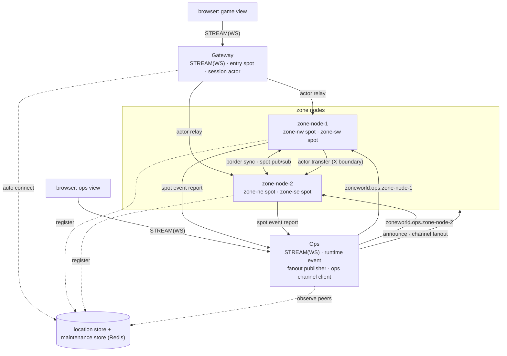
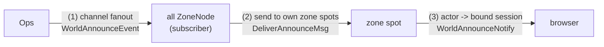

# ZoneWorld Sample Scenario

[샘플 목록](../README.ko.md)

> # 설계 초안 — browser connector 선행 조건 충족
>
> TypeScript connector는 명시적 flow 전달 계약과 실제 Chromium의 `ws`·`wss`, request/reply,
> push, reconnect 검증을 통과했다. 이 문서는 구현 전 sample 설계이며, ZoneWorld 구현 자체는 별도
> 작업 범위다.

> **이 문서는 구현 전 시나리오 초안이다.** 아직 어느 언어에서도 구현되지 않았다.
> 다른 정본 샘플과 달리 **브라우저 UI를 제공**하며, server는 언어별로 구현하되
> **client는 TypeScript 하나만 구현**해 모든 언어 server에 연결한다(wire가 언어
> 중립이므로).

## 0. 작업 위치와 진행 권한

구현 계획과 언어별 진행 순서는
[ZoneWorld 샘플 구현 계획](../../../../plan/zoneworld-sample-implementation-plan.ko.md)이 소유한다.
이 문서는 시나리오 정본이고, 그 문서는 실행 계획이다.

### 0.1 진행 권한

**이 샘플 작업은 승인된 에이전트만 진행한다.** 승인은 사용자가 ZoneWorld 작업을 명시적으로
지시할 때 성립한다. 승인받지 않은 에이전트는 이 문서를 읽고 참조할 수 있으나, ZoneWorld의
구현·수정·삭제를 진행하지 않는다. 승인 없이 착수한 변경은 되돌린다.

다른 작업 중에 이 샘플의 디렉터리나 문서가 눈에 띄더라도, 별도 지시가 없으면 손대지 않는다.

### 0.2 작업 위치

**ZoneWorld는 다른 정본 샘플과 배치가 다르다.** 정본 6종은 언어별 디렉터리
(`framework/languages/<lang>/samples/`) 안에 그 언어의 client와 server를 함께 둔다. ZoneWorld는
client 하나를 모든 언어 server가 공유하므로, 공통 client와 언어별 server를 한곳에 모은다.

```text
framework/languages/shared_sample/zoneworld/
  client/     TypeScript 브라우저 client — 모든 언어 server가 공유한다(§9·§10)
  dotnet/     Shared/ · Server/(§3·§6) · Client/(그 언어의 시나리오 client) · run_sample.sh
  java/
  kotlin/
  node/
  cpp/
```

**브라우저 client는 하나만 둔다.** 언어별 디렉터리에 복제하지 않는다. §6의 server 디렉터리 구조는
`<lang>/Server/` 아래를, §9.3의 브라우저 client 구조는 최상위 `client/` 아래를 가리킨다.

**언어별 디렉터리의 `Client/`는 다른 것이다** — 기존 정본 6종과 같은 형태의 **headless 시나리오
client**이며, 브라우저 없이 stream connector로 붙어 §11의 `ZW-*`를 실행해 그 언어 server의 동작을
검증한다. 브라우저 client는 5개 언어 server가 이 검증을 통과한 뒤에 만들고, 그때 브라우저가 새로
검증하는 것은 **화면**(§10)이다. 진행 순서는
[구현 계획](../../../../plan/zoneworld-sample-implementation-plan.ko.md) §6이 소유한다.

## 1. 목적

ZoneWorld는 **zone 분할 MMORPG**와 그것을 **운영·관제하는 콘솔**을 한 샘플에 담는다.
[01-overview](../../../dotnet/guide/01-overview.ko.md) §2가 게임 서버 4갈래 중 ①로
소개하는 **zoning**(월드를 지리 구역으로 나눠 구역마다 노드가 담당하고, 경계를 넘으면
인접 노드로 이동)을 보여 주는 첫 샘플이다.

기존 정본 6종은 업무 흐름만 다룬다. 그래서 multi-node 시스템을 운영할 때 필요한 축 —
어느 노드가 등록되어 있는지, 전 노드에 공지를 전달하려면, 특정 노드 하나만 점검하려면 —
이 비어 있다. ZoneWorld는 그 축을 채운다.

이 샘플이 보여 주는 것:

- 플레이어가 **경계를 넘으면 actor가 인접 zone 노드로 transfer** 된다. client 연결은
  유지된다.
- 경계 근처 상태를 **인접 zone에 spot pub/sub으로 동기화**한다.
- 관제 콘솔이 **runtime event로 노드 등록·연결 상태를 관찰**한다.
- 관제 콘솔이 **channel fanout으로 전 노드에 공지**한다. 발행자는 노드 목록을 갖지 않는다.
- 관제 콘솔이 **owner 일관 channel로 특정 노드를 지정**해 점검 모드로 전환한다.
- **브라우저에서 확인한다.** 게임 화면에서 경계 이동을, 관제 화면에서 노드 상태와
  점검 모드 전환을 확인한다.

### 1.1 표면 선택 기준

이 샘플의 교육 목표다. "여러 노드에 무언가를 한다"가 상황마다 다른 표면을 요구한다.
선택 기준은 [channel topology spec §3.1](../../spec/10-channel-topology.ko.md)을 따른다.

| 하려는 일 | 쓰는 것 | 다른 것으로 안 되는 이유 |
|---|---|---|
| 어느 노드가 등록·연결됐는지 확인한다 | **runtime event** | 요청이 아니라 **변화 알림**이다. 노드가 종료되면 요청할 대상이 없다 |
| **전 노드**에 공지를 전달한다 | **channel fanout** | 발행자가 노드 목록을 갖지 않는다. `SendToChannel`이면 발행자가 노드 목록을 관리해야 한다 |
| **특정 노드**를 점검 모드로 전환한다 | **owner 일관 channel**(`zoneworld.ops.<NodeId>`) | 일반 client-server channel은 peer 중 하나로 **분산**된다. 노드별 channel 이름을 서빙해 소유자를 고정한다(spec §3.1 항목 2) |
| **한 zone의 모든 플레이어**에게 전달한다 | zone spot → 그 spot의 actor들 → 각 bound session | zone spot이 참여자의 `ActorRef`를 보관하므로, 발행자가 명단을 관리하지 않는다 |
| **특정 플레이어 한 명**에게 전달한다 | 그 player actor → 자기 bound session | actor binding이 연결 위치를 이미 해결하므로, 발행자가 노드·연결을 지정하지 않는다 |

> **RouteMesh channel은 애플리케이션 요청에 쓰지 않는다.** node rid 직접 지정은
> framework 내부(spot bridge)와 특수 인프라 계층의 표면이다([channel topology
> spec §3.1 항목 3](../../spec/10-channel-topology.ko.md)). 이 샘플도 route mesh를
> **spot bridge 용도로만** 등록한다(§4) — 노드 지정 관제 호출에는 쓰지 않는다.

## 2. 월드 규격

5개 언어가 같은 결과를 내려면 규칙이 고정되어야 한다.

| 항목 | 값 |
|------|-----|
| 좌표 | `0 <= X < 100`, `0 <= Y < 100` (정수) |
| zone 분할 | 4개 사분면 |
| `zone-nw` | `X < 50`, `Y < 50` |
| `zone-ne` | `X >= 50`, `Y < 50` |
| `zone-sw` | `X < 50`, `Y >= 50` |
| `zone-se` | `X >= 50`, `Y >= 50` |
| 노드 배치 | `zone-node-1` = `zone-nw` + `zone-sw` (서) / `zone-node-2` = `zone-ne` + `zone-se` (동) |
| 인접 | **변을 공유하는 zone만 인접**이다. 대각선(`zone-nw`↔`zone-se`)은 인접이 아니다 |
| 경계 밴드 | 경계에서 **10 이내**. 이 안의 플레이어는 그 경계를 공유하는 인접 zone에도 보인다 |
| tick | **100ms**. zone spot 생성 시 `Tick = 0`이고 tick마다 1씩 증가한다 |
| 이동 제한 | 한 `MoveMsg`의 이동 거리는 각 축 **최대 5** |
| 입장 좌표 | 서버가 정한다. 항상 `(25, 25)` = `zone-nw` |

### 2.1 좌표의 소유자

**player actor가 좌표의 권위 소유자다.** zone spot은 렌더·경계 동기화를 위해 그 값의
사본을 보관한다. 이 방향을 고정해야 5개 언어가 같은 결과를 낸다.

| 주체 | 소유하는 것 |
|---|---|
| player actor | `X`, `Y`, 현재 `ZoneId` — **권위** |
| zone spot | `PlayerId → (ActorRef, X, Y)` map — player actor가 보낸 값의 사본 |

이동 처리 순서:

1. player actor가 `MoveMsg`를 받아 §2.2로 검증한다.
2. 거부면 `MoveRejectedNotify`를 push하고 끝낸다(좌표 불변).
3. 승인이면 좌표를 갱신하고, zone 변경 여부에 따라 갈린다.
   - **zone 불변**: 현재 zone spot의 좌표 사본을 그 자리에서 갱신한다. actor의 이동 handler는 actor와 그 zone spot을 함께 받으므로 보낼 메시지가 없다.
   - **zone 변경**: 이전 zone spot에 `LeaveZoneMsg`, 새 zone spot에 `EnterZoneMsg`를 보낸다.
     노드가 바뀌면 actor transfer가 먼저 일어난다(§2.6).
4. zone spot은 받은 값으로 map을 갱신한다. `ZoneStateNotify`는 tick에서 이 map으로 만든다.

### 2.2 이동 검증 순서

여러 조건을 동시에 위반할 수 있으므로 **순서를 고정**한다. 먼저 걸린 사유 하나만 반환한다.

1. `OutOfRange` — 목표 좌표가 `0..99` 밖
2. `TooFar` — 각 축 이동 거리가 5 초과
3. `DiagonalCrossing` — **X 경계와 Y 경계를 한 번에 통과**한다(예: `(49,49) → (50,50)`).
   비인접 zone으로 직행하게 되므로 거부한다. 인접 zone으로만 이동할 수 있다.
4. `ZoneMaintenance` — **다른 노드로 진입**하는 이동인데 그 노드가 점검 모드다(§2.3)

거부되면 좌표를 바꾸지 않고 `MoveRejectedNotify`로 현재 좌표를 반환한다.

### 2.3 점검 모드가 이동에 적용되는 범위

점검 모드는 **그 노드로 새로 들어오는 것만** 막는다. 이미 그 노드에 있는 플레이어의
이동은 막지 않는다.

| 이동 | 점검 모드인 노드로 | 판정 |
|---|---|---|
| 같은 zone 안 이동 | (같은 노드) | **허용** |
| 노드 내부 zone 이동 | (같은 노드) | **허용** |
| 다른 노드로 진입 | 목표 노드가 점검 중 | **거부** (`ZoneMaintenance`) |
| 점검 중인 노드에서 다른 노드로 이탈 | 목표 노드가 정상 | **허용** |
| `JoinWorldReq` 신규 입장 | 입장 zone의 노드가 점검 중 | **거부** |

**다른 노드의 점검 상태를 어떻게 아는가.** 이동을 판정하는 것은 **출발 노드**이므로, 그
노드가 목표 노드의 점검 상태를 알아야 한다. 매 이동마다 store를 조회하면 비용이 크므로
**각 `ZoneNode`가 전 노드의 점검 상태를 캐시로 보관**한다.

| 시점 | 경로 |
|---|---|
| 노드 시작 시 | maintenance store에서 **전 노드의** desired state를 읽어 캐시를 채운다 |
| 상태 변경 시 | `Ops`가 **fanout**(`zoneworld.broadcast`, topic `world.maintenance`)으로 `NodeMaintenanceChangedEvent`를 발행한다. 전 노드가 구독해 캐시를 갱신한다 |

fanout이 여기서 두 번째로 쓰인다 — `Ops`는 노드 목록을 갖지 않은 채 상태 변경을 전파하고,
노드가 늘어도 발행 코드가 바뀌지 않는다.

> **캐시 유실 시.** fanout은 best-effort이므로 캐시가 최신이 아닐 수 있다. 그 경우 출발
> 노드가 이동을 허용하고 목표 노드가 actor transfer를 받는다. **목표 노드는 자기 점검
> 상태를 권위로 다시 판정**하고, 점검 중이면 transfer를 거부한다. 출발 노드는 거부를 받아
> 좌표를 되돌리고 `MoveRejectedNotify(ZoneMaintenance)`를 push한다. 즉 캐시는 최적화이고
> **권위는 목표 노드에 있다.**

### 2.4 플레이어 목록 규칙

`ZoneStateNotify.Players`는 자기 zone 플레이어와 경계 밴드를 통해 받은 인접 zone
플레이어를 합친 것이다.

- **중복 제거**: 같은 `PlayerId`가 둘 다 있으면 **자기 zone 값을 사용**한다.
- **정렬**: `PlayerId` **UTF-8 byte 오름차순**(ordinal). 언어 기본 문자열 비교(로캘 의존)를
  쓰지 않는다. `PlayerId`는 `[a-z0-9-]{1,32}` ASCII로 제한한다.
- **인접 zone snapshot 교체**: `ZoneBorderEvent`는 `FromZoneId`별 **최신 snapshot으로 통째
  교체**한다(누적하지 않는다). `Tick`이 보관 중인 값보다 **작거나 같으면 무시**한다.
  플레이어가 없으면 빈 목록을 보내며, 이것도 유효한 snapshot이다(전부 제거).
- **만료**: 어떤 `FromZoneId`의 snapshot을 **3 tick(300ms) 동안 받지 못하면 제거**한다.
  발행 zone의 노드가 종료된 경우에 화면에 남지 않게 한다.
- **동일 `PlayerId` 재입장**: 같은 `PlayerId`로 다시 `JoinWorldReq`를 보내면 **같은
  player actor에 새 session이 bind**되고 이전 session의 binding은 해제된다. 좌표와 zone은
  유지된다.

### 2.5 tick 규칙

zone spot 생성 시 `Tick = 0`이다. timer callback은 다음 순서로 동작한다.

1. `Tick`을 1 증가시킨다(**첫 발행은 `Tick = 1`**).
2. 보관 중인 map과 인접 zone snapshot으로 `ZoneStateNotify`를 만들어 push한다.
3. 인접 zone별 `ZoneBorderEvent`를 publish한다(§4.1의 경계 밴드 조건).
4. 만료된 인접 zone snapshot을 제거한다(§2.4).

### 2.6 두 종류의 zone 이동

노드 배치가 두 경우를 만든다.

| 이동 | 예 | actor transfer |
|------|-----|----------------|
| **노드 내부** | `zone-nw` → `zone-sw` (Y 경계) | **없음** — 같은 노드에서 spot만 바뀐다 |
| **노드 간** | `zone-nw` → `zone-ne` (X 경계) | **있음** — actor가 `zone-node-2`로 transfer |

이 대비가 actor transfer의 값어치를 보인다. 둘 다 client 연결은 유지된다.

**transfer adapter를 반드시 등록한다.** [spot-actor spec](../../spec/23-spot-actor.ko.md) §6에
따르면 **adapter를 등록하지 않으면 target actor가 factory로 처음부터 재생성되고 이전 state가
유실된다.** player actor는 좌표·zone의 권위이므로(§2.1) adapter 없이는 transfer 직후 좌표가
초기화되어 이 샘플이 성립하지 않는다.

| 방향 | 싣는 값 |
|---|---|
| `TransferOut` | `PlayerId`, `X`, `Y`, `ZoneId`, `IsBot`, (봇이면) `DirX`, `DirY` |
| `TransferIn` | 같은 값으로 actor state를 복원한 뒤, 목표 zone spot에 `EnterZoneMsg`를 보낸다 |

목표 노드는 `TransferIn` 시점에 **자기 점검 상태를 권위로 재판정**하고(§2.3), 점검 중이면
transfer를 거부한다.

### 2.7 봇 — bound session 없는 actor

월드에는 사람이 조종하지 않는 **봇 8마리**가 상시 이동한다. 봇은 브라우저 client 없이도
월드가 동작하는 것을 보이고, actor transfer를 계속 발생시킨다.

**봇은 사람 플레이어와 같은 `PlayerActor` 타입이다.** 차이는 하나뿐이다 — **bound session이
없다.** 그래서 `MoveRejectedNotify`·`ZoneStateNotify` 같은 client push 대상이 아니다.
[07-actor-spot](../../../dotnet/guide/07-actor-spot.ko.md)이 설명하는 "client 없이 존재하는
actor — 서버 로직이 `actorId`로 구동하는 봇/NPC"가 이 모양이다.

| 항목 | 값 |
|------|-----|
| 마리 수 | **8** (zone당 2) |
| 생성 | 각 `ZoneNode`가 시작 시 자기가 호스팅하는 zone의 봇을 만든다 |
| 구동 | zone spot의 **봇 timer(500ms)** 가 자기 zone의 봇 actor에게 `BotTickMsg`를 보낸다 |
| 이동 | 봇 actor가 사람과 **같은 이동 경로**(§2.1·§2.2)를 탄다. 검증·zone 변경·transfer가 모두 동일하다 |
| 걸음 | 봇 tick마다 진행 방향으로 **3칸** |
| 반전 | 이동이 거부되면(`OutOfRange`·`ZoneMaintenance` 등) **방향을 반대로 바꾼다**. 다음 tick에 반대로 진행한다 |
| session | **없다.** 봇에게는 어떤 push도 보내지 않는다 |

**경로는 결정적이다.** 무작위 이동을 쓰면 5개 언어의 결과가 달라져 self-check가 불안정해진다.
초기 좌표와 방향을 고정한다.

| `PlayerId` | 초기 `X` | 초기 `Y` | `DirX` | `DirY` | 초기 zone | 넘는 경계 |
|---|---:|---:|---:|---:|---|---|
| `bot-nw-x` | 10 | 15 | `+1` | 0 | `zone-nw` | X → **노드 간 transfer** |
| `bot-nw-y` | 15 | 10 | 0 | `+1` | `zone-nw` | Y → 노드 내부 |
| `bot-ne-x` | 90 | 15 | `-1` | 0 | `zone-ne` | X → **노드 간 transfer** |
| `bot-ne-y` | 85 | 10 | 0 | `+1` | `zone-ne` | Y → 노드 내부 |
| `bot-sw-x` | 10 | 85 | `+1` | 0 | `zone-sw` | X → **노드 간 transfer** |
| `bot-sw-y` | 15 | 90 | 0 | `-1` | `zone-sw` | Y → 노드 내부 |
| `bot-se-x` | 90 | 85 | `-1` | 0 | `zone-se` | X → **노드 간 transfer** |
| `bot-se-y` | 85 | 90 | 0 | `-1` | `zone-se` | Y → 노드 내부 |

한 축으로만 이동하므로 `DiagonalCrossing`(§2.2)에 걸리지 않는다. X 순찰 봇 4마리가 X 경계를
반복해서 넘으므로 **노드 간 actor transfer가 상시 발생**한다.

마리 수와 경로는 설정 값이다. 데모 밀도를 바꾸려면 이 표만 늘린다.

## 3. 서버 구성

| 서버 | 수 | 책임 |
|------|:--:|------|
| `Gateway` | 1 | 브라우저 STREAM(WS) 종단, 인증, session actor bind, actor relay, client push |
| `ZoneNode` | 2 | zone spot 호스팅(노드당 2개), player actor 호스팅, 경계 동기화, 노드 점검 정책 |
| `Ops` | 1 | 관제 콘솔 STREAM(WS) 종단, runtime event 수집, 공지 fanout 발행, 노드 지정 호출 |
| location store | 1 | 공유 dependency(Redis). peer 자동 연결 |
| maintenance store | 1 | 공유 dependency(같은 Redis). 점검 모드 **desired state** 보관(§8.4) |

`ZoneNode`는 같은 실행 파일을 `NodeId`와 담당 zone 목록만 바꿔 2개 실행한다.

| 인스턴스 | `NodeId` | 담당 zone | ops channel |
|---|---|---|---|
| 1 | `zone-node-1` | `zone-nw`, `zone-sw` | `zoneworld.ops.zone-node-1` |
| 2 | `zone-node-2` | `zone-ne`, `zone-se` | `zoneworld.ops.zone-node-2` |

**`NodeId`와 `ZoneId`는 다른 식별자다.** `NodeId`는 프로세스 식별자이고 `ZoneId`는 zone
spot의 `spotRid`다. 노드 점검 정책은 그 노드의 **모든 zone**에 적용되므로 `NodeId` 단위다.



client에는 `Gateway`와 `Ops` 주소만 설정한다. zone 노드 주소는 client에 노출하지 않는다.

## 4. 사용하는 ZLink 요소

| 역할 | 사용하는 요소 |
|------|---------------|
| `location store` | 공유 저장소 기반 peer discovery, 자동 연결 |
| `Gateway` | stream node(WS), entry spot, session actor, actor relay, bound session push |
| `ZoneNode` | Spot mesh(zone spot + player actor), spot pub/sub, actor cross-node transfer, fanout subscriber, owner 일관 channel server, spot bridge(route mesh), local spot runtime event |
| `Ops` | stream node(WS), fanout publisher, owner 일관 channel client, runtime event(location·socket), client-server channel server |
| client | 브라우저 stream connector(WS) |

이름을 다음으로 고정한다.

| 이름 | Framework 요소 | 연결 |
|------|----------------|------|
| `zoneworld.zones` | Spot mesh | zone spot(`spotRid` = `ZoneId`)과 player actor 호스팅 |
| `zoneworld.bridge` | **route mesh (spot bridge 전용)** | `ZoneNode` 안의 channel handler → **같은 프로세스의** zone spot. SpotNode와 같은 프로세스에 등록하면 runtime이 bridge를 구성한다([06-spot](../../../dotnet/guide/06-spot.ko.md) 외부→spot 절). **애플리케이션 노드 지정에는 쓰지 않는다** |
| `zoneworld.ops.<NodeId>` | **owner 일관 client-server channel** | `Ops`(client) → 특정 `ZoneNode`(server). 노드마다 자기 이름의 channel을 서빙한다 |
| `zoneworld.broadcast` | **fanout channel** | `Ops`(publisher) → 전 `ZoneNode`(subscriber) |
| `zoneworld.report` | client-server channel | `ZoneNode`(client) → `Ops`(server). local spot 이벤트 보고 |
| `world.announce` | fanout topic (`zoneworld.broadcast`) | 공지 발행 |
| `world.maintenance` | fanout topic (`zoneworld.broadcast`) | 점검 상태 전파(§2.3) |
| `zoneworld.actors` | client-server channel | `Gateway`(client) → `ZoneNode`(server). player actor ensure — 입장 시 actor를 보장하고 `ActorRefWire`를 받는다(§7.1 `JoinWorldReq`). **입장 zone을 호스팅하는 노드만 이 channel을 서빙한다** — 그 노드가 입장 admission(§2.3)의 권위이기 때문이다. 입장 좌표가 항상 `(25,25)`=`zone-nw`이므로 서빙 노드는 `zone-node-1` 하나이고, 따라서 peer 분산이 일어나지 않는다 |
| `zone.border.<from>.<to>` | spot pub/sub topic (`zoneworld.zones`) | zone spot이 **인접 zone별로 따로** publish |

### 4.1 경계 동기화 topic

**보내는 zone과 받는 zone을 topic 이름에 모두 넣는다.** 하나의 topic을 여러 인접 zone이
구독하면 그 경계와 무관한 플레이어까지 전달되기 때문이다.

| topic | 발행 zone | 구독 zone | 담는 플레이어 |
|---|---|---|---|
| `zone.border.zone-nw.zone-ne` | `zone-nw` | `zone-ne` | `X`가 `40..49` |
| `zone.border.zone-nw.zone-sw` | `zone-nw` | `zone-sw` | `Y`가 `40..49` |
| `zone.border.zone-ne.zone-nw` | `zone-ne` | `zone-nw` | `X`가 `50..59` |
| `zone.border.zone-ne.zone-se` | `zone-ne` | `zone-se` | `Y`가 `40..49` |
| `zone.border.zone-sw.zone-nw` | `zone-sw` | `zone-nw` | `Y`가 `50..59` |
| `zone.border.zone-sw.zone-se` | `zone-sw` | `zone-se` | `X`가 `40..49` |
| `zone.border.zone-se.zone-ne` | `zone-se` | `zone-ne` | `Y`가 `50..59` |
| `zone.border.zone-se.zone-sw` | `zone-se` | `zone-sw` | `X`가 `50..59` |

대각선 zone은 인접이 아니므로 topic이 없다.

## 5. 책임 분리

| 구분 | 담당 | 책임 |
|------|------|------|
| 연결·세션 | `Gateway` entry spot | WS 종단, 인증, session actor bind, push 전달 |
| 좌표 **권위** | player actor | `X`, `Y`, 현재 `ZoneId`의 소유자. 이동 검증(§2.2)과 zone 변경 판정 |
| 구역 상태 | zone spot | `PlayerId → (ActorRef, X, Y)` map **사본** 보관(§2.1), 직렬 처리, tick timer, 경계 동기화 |
| 경계 동기화 | zone spot | 경계 밴드 상태를 인접 zone별 topic으로 publish / 구독 |
| 노드 정책 | `ZoneNode` | 점검 모드 — 그 노드의 **모든 zone**에 적용 |
| 관제 | `Ops` | runtime event 관찰, 공지 발행, 노드 지정 호출, desired state 보관 |

레이어 책임과 의존 방향은 다른 정본 샘플과 같다.

| 레이어 | 내용 | 의존 |
|---|---|---|
| `Domain` | `World`(좌표·zone 판정·경계 밴드), `ZoneState`, `MovePolicy` | ZLink 타입을 참조하지 않는다 |
| `Application` | use case, `NodeMaintenancePolicy` | `Domain` + port interface만 참조 |
| `Infrastructure` | ZLink adapter(spot·actor·session·handler), store repository | `Application` port를 구현 |

## 6. 서버 디렉토리 구조

domain logic과 framework adapter를 분리한다. 언어별 문법과 build system은 달라도 아래
책임 분리를 유지한다. 아래 경로는 언어별 server 디렉터리
(`framework/languages/shared_sample/zoneworld/<lang>/`, §0.2) 아래를 가리킨다.

```text
Server/Gateway/
  Infrastructure/
    ZLink/
      Sessions/
        PlayerSession
      Spots/
        GatewayEntrySpot
      Handlers/
        JoinWorldHandler

Server/ZoneNode/
  Domain/
    ZoneWorld/
      World
      ZoneId
      ZoneState
      PlayerPosition
      MovePolicy
      BorderView
  Application/
    Zone/
      MoveUseCase
      ZoneTickUseCase
      BotPatrolPolicy
    Node/
      NodeMaintenancePolicy
  Ports/
    MaintenanceStorePort
    OpsReportPort
  Infrastructure/
    ZLink/
      Spots/
        ZoneSpot
        Handlers/
          EnterZoneHandler
          UpdatePositionHandler
          LeaveZoneHandler
          ZoneTickHandler
          BotTickHandler
          ZoneBorderSubscriptionHandler
          DeliverAnnounceHandler
      Actors/
        PlayerActor
        PlayerActorFactory
        BotSpawner
      Handlers/
        WorldAnnounceSubscriber
        NodeMaintenanceChangedSubscriber
        ApplyNodeMaintenanceHandler
        GetNodeDiagnosticsHandler
      Monitoring/
        LocalSpotEventHandler
    Store/
      MaintenanceStoreRepository

Server/Ops/
  Application/
    Ops/
      NodeRegistry
      AnnouncementService
      MaintenanceService
  Ports/
    MaintenanceStorePort
  Infrastructure/
    ZLink/
      Sessions/
        OpsConsoleSession
      Handlers/
        WatchNodesHandler
        AnnounceWorldHandler
        SetMaintenanceHandler
        NodeDiagnosticsHandler
        ReportSpotEventHandler
        ReportNodeStatusHandler
      Monitoring/
        LocationEventHandler
        SocketEventHandler
    Store/
      MaintenanceStoreRepository
```

각 요소의 책임은 다음과 같다.

| 요소 | 책임 |
|---|---|
| `PlayerSession` | WS 종단, 인증, actor bind, relay |
| `JoinWorldHandler` | `JoinWorldReq` → player actor ensure + bind |
| `World` · `MovePolicy` · `BorderView` | 좌표계·zone 판정·경계 밴드, 이동 검증(§2.2), 인접 zone별 밴드 추출 |
| `NodeMaintenancePolicy` | 점검 모드 판정(§2.3) |
| `ZoneSpot` | `PlayerId → (ActorRef, X, Y)` map 보관, tick, 경계 동기화 |
| `PlayerActor` | 좌표 권위(§2.1), 이동 검증, zone 변경·transfer 판정. 봇도 같은 타입이며 bound session만 없다(§2.7) |
| `BotPatrolPolicy` · `BotSpawner` | 봇 순찰 규칙(§2.7)과 시작 시 생성 |
| `WorldAnnounceSubscriber` | fanout subscriber → 자기 노드의 zone spot으로 send |
| `LocalSpotEventHandler` | local spot runtime event → `Ops` 보고 |
| `MaintenanceStoreRepository` | desired state 읽기/쓰기(Redis) |
| `NodeRegistry` | runtime event와 노드 보고를 합쳐 노드 상태 집계 |
| `MaintenanceService` | desired state 기록 + `zoneworld.ops.<NodeId>` 호출 |

## 7. Message 계약

공통 message 계약은 언어 중립 schema로 읽는다. 언어별 구현은 record, class, struct처럼
자기 언어에 맞는 표현으로 같은 필드와 의미를 구현한다.

### 7.1 게임 — 브라우저 ⇄ Gateway (STREAM)

| Message | 방향 | 필드 | 의미 |
|---------|------|------|------|
| `JoinWorldReq` | Client -> Gateway stream | `PlayerId` | 월드 입장을 요청한다. |
| `JoinWorldRes` | Gateway stream -> Client | `PlayerId`, `ZoneId`, `NodeId`, `X`, `Y` | 입장한 zone, 그 zone을 호스팅하는 노드, 시작 좌표를 반환한다. |
| `MoveMsg` | Client -> Gateway stream -> player actor | `X`, `Y` | 목표 좌표로 이동을 요청한다(응답 없는 one-way send). |
| `ZoneStateNotify` | zone spot -> actor -> bound session -> Client | `ZoneId`, `Tick`, `Players` | tick마다 현재 zone과 경계 밴드의 인접 zone 플레이어를 push한다. `Players`는 `PlayerId`, `X`, `Y`, `ZoneId`, `IsBot`을 가지며 §2.4 규칙으로 병합·정렬한다. 봇도 목록에 포함된다(§2.7). **bound session이 없는 actor(봇)에게는 push하지 않는다.** |
| `ZoneChangedNotify` | player actor -> bound session -> Client | `PlayerId`, `ZoneId`, `NodeId`, `Transferred` | zone이 바뀌었음을 push한다. `Transferred`가 `true`면 actor가 다른 노드로 이동했다. |
| `WorldAnnounceNotify` | zone spot -> actor -> bound session -> Client | `AnnouncementId`, `Text` | 관제 공지를 push한다. client는 `AnnouncementId`로 중복을 제거한다(§8.2). |
| `MoveRejectedNotify` | player actor -> bound session -> Client | `Reason`, `X`, `Y` | 이동 거부와 현재 좌표를 push한다. `Reason`은 `OutOfRange`, `TooFar`, `DiagonalCrossing`, `ZoneMaintenance` 중 하나다(§2.2). |

### 7.2 관제 — 브라우저 ⇄ Ops (STREAM)

| Message | 방향 | 필드 | 의미 |
|---------|------|------|------|
| `WatchNodesReq` | Client -> Ops stream | (없음) | 노드 상태 관찰을 시작한다. |
| `WatchNodesRes` | Ops stream -> Client | `Nodes` | 현재 노드 목록을 반환한다. `Nodes`는 `NodeId`, `Registered`, `Connected`, `Maintenance`, `Zones`, `PlayerCount`를 가진다. |
| `NodeStatusNotify` | Ops stream -> Client | `NodeId`, `Registered`, `Connected`, `Maintenance`, `Zones`, `PlayerCount` | 노드 상태 변화를 push한다(runtime event 기반). |
| `NodeAlertNotify` | Ops stream -> Client | `NodeId`, `Kind`, `Detail`, `OccurredAt` | 노드가 보고한 이상을 push한다. `Kind`는 `TimerHandlerFailed`, `PeersChanged` 중 하나다. |
| `AnnounceWorldReq` | Client -> Ops stream | `Text` | 전 노드 공지를 요청한다. |
| `AnnounceWorldRes` | Ops stream -> Client | `AnnouncementId` | 발행한 공지 id를 반환한다. |
| `SetMaintenanceReq` | Client -> Ops stream | `NodeId`, `Enabled` | 특정 노드의 점검 모드 전환을 요청한다. |
| `SetMaintenanceRes` | Ops stream -> Client | `NodeId`, `Enabled`, `Zones`, `Error` | 전환 결과와 그 노드의 zone 목록을 반환한다. **대상 노드가 미연결이면** `Error=NodeUnavailable`을 반환하고 desired state만 기록한다(노드가 시작할 때 복원된다, §8.4). |
| `NodeDiagnosticsReq` | Client -> Ops stream | `NodeId` | 특정 노드의 진단 정보를 요청한다. |
| `NodeDiagnosticsRes` | Ops stream -> Client | `NodeId`, `Zones`, `PlayerCount`, `Maintenance`, `Error` | 그 노드가 호스팅 중인 zone 목록과 플레이어 수를 반환한다. **대상 노드가 미연결이면** `Error=NodeUnavailable`을 반환한다. |

### 7.3 서버 내부

| Message | 방향 | 필드 | 의미 |
|---------|------|------|------|
| `WorldAnnounceEvent` | `Ops` -> 전 `ZoneNode` (**fanout** `zoneworld.broadcast`, topic `world.announce`) | `AnnouncementId`, `Text` | 노드 목록 없이 전 노드에 공지를 발행한다. |
| `NodeMaintenanceChangedEvent` | `Ops` -> 전 `ZoneNode` (**fanout** `zoneworld.broadcast`, topic `world.maintenance`) | `NodeId`, `Enabled` | 점검 상태 변경을 전 노드에 전파한다. 각 노드가 캐시를 갱신해 cross-node 이동을 판정한다(§2.3). |
| `DeliverAnnounceMsg` | fanout subscriber -> **자기 노드의** zone spot (spot bridge `zoneworld.bridge` 경유) | `AnnouncementId`, `Text` | 공지를 받은 노드가 자기가 호스팅하는 `ZoneId`들에만 send한다(§8.2). |
| `BotTickMsg` | zone spot -> 봇 actor (actor send) | `Tick` | 봇을 구동한다. 봇 actor가 순찰 규칙(§2.7)으로 다음 좌표를 계산해 이동 경로(§2.1)를 탄다. |
| `EnsurePlayerActorReq` | `Gateway` -> 입장 zone 호스팅 노드 (channel `zoneworld.actors`) | `PlayerId` | player actor를 보장한다. 받는 노드가 자기 점검 상태를 **권위로** 판정한다(§2.3). |
| `EnsurePlayerActorRes` | 그 `ZoneNode` -> `Gateway` | `PlayerId`, `Actor`, `ZoneId`, `NodeId`, `X`, `Y`, `Error` | `ActorRefWire`와 입장 zone·노드·좌표를 반환한다. 점검 중이면 `Actor`가 비고 `Error`가 채워진다. `Gateway`는 이 `ActorRef`로 session을 bind한다(§7.1 `JoinWorldRes`). |
| `ApplyNodeMaintenanceReq` | `Ops` -> 특정 `ZoneNode` (**owner 일관 channel** `zoneworld.ops.<NodeId>`) | `NodeId`, `Enabled` | 노드 전체의 점검 모드를 전환한다. |
| `ApplyNodeMaintenanceRes` | 특정 `ZoneNode` -> `Ops` | `NodeId`, `Enabled`, `Zones` | 전환 결과와 그 노드의 zone 목록을 반환한다. |
| `GetNodeDiagnosticsReq` | `Ops` -> 특정 `ZoneNode` (**owner 일관 channel**) | `NodeId` | 노드 진단 정보를 요청한다. |
| `GetNodeDiagnosticsRes` | 특정 `ZoneNode` -> `Ops` | `NodeId`, `Zones`, `PlayerCount`, `Maintenance` | 노드 레벨 정보를 반환한다. |
| `ReportSpotEventMsg` | `ZoneNode` -> `Ops` (channel `zoneworld.report`) | `NodeId`, `Kind`, `Detail`, `OccurredAt` | **local** spot runtime event를 보고한다(§8.1). 이벤트 발생 시에만 보낸다. |
| `ReportNodeStatusMsg` | `ZoneNode` -> `Ops` (channel `zoneworld.report`) | `NodeId`, `Zones`, `PlayerCount`, `Maintenance` | 노드 상태를 **1초마다** 보고한다. `Ops`는 이 값으로 `PlayerCount`를 채운다(§8.1). `PlayerCount`는 그 노드의 모든 zone spot이 보관 중인 플레이어 수의 합이다. |
| `ZoneBorderEvent` | zone spot -> 인접 zone spot (**spot pub/sub**, topic `zone.border.<from>.<to>`) | `FromZoneId`, `ToZoneId`, `Tick`, `Players` | 그 경계의 밴드 안 플레이어 목록을 publish한다. 유실을 허용하며 수신측은 §2.4의 교체·만료 규칙을 따른다. |
| `EnterZoneMsg` | player actor -> zone spot | `PlayerId`, `ActorRef`, `X`, `Y` | zone spot에 입장한다. **`ActorRef`를 함께 전달**해 zone spot이 보관한다(§8.3). |
| `LeaveZoneMsg` | player actor -> zone spot | `PlayerId` | zone spot에서 퇴장한다. zone spot이 보관 중인 항목을 제거한다. |

### 7.4 `ActorRefWire`

`ActorRef`는 언어마다 런타임 객체 표현이 다르므로(C++의 `actor_ref_t`는 내부 상태를 가진
런타임 타입이다) **wire에는 언어 중립 DTO로 싣는다.** 기존 샘플(Bingo)이 `ActorRefWire`를 쓰는 방식과 같다.

| 필드 | 의미 |
|---|---|
| `NodeRid` | actor를 호스팅하는 노드의 routing id (hex 문자열) |
| `ActorId` | actor 식별자 |
| `Generation` | actor generation |

수신측(zone spot)은 이 세 값으로 자기 언어의 public `ActorRef`를 복원해 보관하고,
`SendToActor`에 사용한다.

## 8. 관제

### 8.1 노드 상태 관찰 (runtime event)

`Ops`는 **자기 프로세스에서 관찰 가능한 source만** 직접 구독한다. 원격 노드의 spot
runtime event는 구독할 수 없다(spot event source는 같은 프로세스의 `SpotNode`만 대상으로
한다). 그래서 spot 이벤트는 각 `ZoneNode`가 **local로 받아 명시적으로 보고**한다.

| 관찰 대상 | 방법 | `Ops`가 아는 것 |
|---|---|---|
| 노드 등록·해제 | `Ops`의 **location runtime event** | `Registered` |
| 노드 연결 | `Ops`의 **socket runtime event** | `Connected` |
| zone spot 이상 | `ZoneNode`의 **local spot runtime event** → `ReportSpotEventMsg`(이벤트 시) | `TimerHandlerFailed`, `PeersChanged` |
| 노드 상태·플레이어 수 | `ZoneNode`의 `ReportNodeStatusMsg`(1초 주기) | `Zones`, `PlayerCount`, `Maintenance` |

### 8.2 전 노드 공지 (channel fanout) → 플레이어까지



- **(1) channel fanout** — `Ops`의 설정에는 `ZoneNode` 목록이 없다. 노드가 늘어도
  발행 코드는 그대로다. `SendToChannel`이면 `Ops`가 노드 목록을 관리해야 한다.
- **(2) 자기 노드의 zone spot에만 send (publish 아님)** — spot publish는 mesh 전체가
  대상이므로 모든 노드가 실행하면 각 zone spot이 노드 수만큼 중복 수신한다. 자기 노드의
  `ZoneId`는 설정으로 알고 있으므로 그 spot들에만 send한다. spot bridge(`zoneworld.bridge`)를
  경유한다.
- **(3) actor → bound session** — zone spot이 보관 중인 `ActorRef`들로 send하고, 각 actor가
  자기 bound session으로 push한다(§8.3).

> **전달 보장 — best-effort다.** 이 경로는 전 구간이 one-way send다. framework는 one-way
> dispatch 실패 시 메시지를 drop할 수 있고, publish 완료가 subscriber 처리 완료를 뜻하지
> 않는다. 그래서 **"정확히 한 번"은 계약하지 않는다.** 대신:
> - **중복은 client가 제거한다.** `AnnouncementId`가 같으면 무시한다.
> - **유실은 허용한다.** 공지는 재전달하지 않는다.
> - actor transfer 중이거나 session이 bind되지 않은 플레이어는 그 공지를 받지 못할 수 있다.
>
> 유실이 치명적인 신호라면 fanout이 아니라 다른 수단(요청/응답, durable store)을 써야 한다.

> **slow joiner.** fanout은 **발행 시점에 구독 중인 노드**에만 전달된다. 공지 후에 시작한
> 노드는 그 공지를 받지 못한다. 공지는 일회성 통지이므로 재전달하지 않는다. **점검 모드는
> 다르다** — 재시작 후에도 유지되어야 하므로 §8.4의 desired state로 복원한다.

### 8.3 zone spot이 actor에게 전달하는 방법

server-to-actor send는 `ActorRef`가 필요하고 actor id만으로 보내는 표면은 없다. 그리고
spot 공개 표면은 join된 actor 목록을 열거하지 않는다. 그래서 **zone spot이 직접 보관**한다.

- player actor가 `EnterZoneMsg`에 **자기 `ActorRef`를 실어** 보낸다.
- zone spot은 `PlayerId → ActorRef` map을 상태로 보관한다.
- `LeaveZoneMsg`에서 제거한다.
- 공지 전달과 `ZoneStateNotify` push는 이 map의 `ActorRef`로 send한다.

zone spot의 콜백은 직렬 실행되므로 이 map에 lock이 필요 없다.

### 8.4 특정 노드 점검 모드 (owner 일관 channel)


`Ops`는 노드별 channel 이름(`zoneworld.ops.zone-node-2`)으로 호출하므로 **그 노드만**
받는다. 일반 client-server channel처럼 peer 사이에 분산되지 않는다.

점검 모드의 의미:

- 그 노드의 **모든 zone**이 신규 입장을 거부한다(`MoveRejectedNotify(ZoneMaintenance)`).
- **이미 그 노드에 있던 플레이어는 유지된다.** 이동·조회가 계속 동작한다.
- 그 노드에서 다른 노드로 나가는 이동은 허용한다.
- 다른 노드는 영향받지 않는다.

**재시작 복원.** `Ops`가 desired state를 **maintenance store(Redis)에 기록**한다.
`ZoneNode`는 시작할 때 자기 `NodeId`의 desired state를 읽어 점검 모드를 복원한다. 노드가
종료된 동안 전환된 상태도 이 경로로 반영된다.

## 9. Client 아키텍처

두 가지를 각각 고정한다. **런타임 패턴**은 단방향 데이터 흐름(§9.1)이고, **폴더 구조**는
Feature-Sliced Design(§9.3)이다. 서버가 헥사고날(§6)인 것과 층위가 다른 결정이며 서로
독립적이다.

### 9.1 런타임 패턴 — 단방향 데이터 흐름 (server-authoritative)

```text
   server push ---> update state ---> render
                         ^               |
                         |               v
                    (no direct write)  input
                         |               |
                         +--- command ---+---> server
```

- **서버가 상태의 유일한 원천이다.** client의 `state`는 서버 push의 투영이다.
- **입력은 `state`를 직접 바꾸지 않는다.** 서버로 명령(`MoveMsg` 등)만 보내고, 서버가
  push한 결과로만 `state`가 바뀐다.
- 이 규칙이 server-authoritative 게임의 전제다. client가 자기 좌표를 임의로 바꾸면
  서버 상태와 어긋난다.

MVU(Model-View-Update)·Flux 계열과 같은 구조이며, 게임 화면과 관제 화면에 같이 적용한다.

### 9.2 기술 스택

| 구분 | 선택 | 이유 |
|---|---|---|
| 언어 | **TypeScript** | connector가 TypeScript다 |
| 빌드 | **Vite** | 설정이 거의 필요 없다 |
| UI·상태 | **Preact + @preact/signals** | 선언형 렌더. signal에 값을 대입하면 화면이 갱신되므로 수동 DOM 갱신 코드가 사라진다 |
| 월드 렌더 | **Canvas 2D** (API 직접) | 격자·플레이어 렌더에는 프레임워크가 코드를 줄여 주지 않는다 |
| 연결 | `@zlink-systems/stream-connector` (브라우저 entrypoint) | §14 선행 과제 |
| codec | JSON | 샘플 공통 기본값 |
| 테스트 | **Vitest**(domain) + **Playwright**(headless E2E) | `domain`이 브라우저에 의존하지 않으므로 단위 테스트가 가능하다 |

Redux 같은 별도 상태 관리 라이브러리는 두지 않는다. signal이 그 역할을 하며 보일러플레이트가
없다.

### 9.3 client 디렉토리 구조 — Feature-Sliced Design (FSD)

client는 **FSD**로 조직한다. 서버의 헥사고날이 "도메인을 프레임워크에서 분리"하는 규약이라면,
FSD는 "기능 단위로 자르고 계층 간 의존 방향을 고정"하는 프론트엔드 규약이다. 언어별 서버
구현이 5개여도 client는 하나이므로, 구조가 흔들리지 않게 규약을 못 박는다.

아래 경로는 공통 client 디렉터리(`framework/languages/shared_sample/zoneworld/client/`, §0.2)
아래를 가리킨다.

```text
client/src/
  app/
    game.tsx
    ops.tsx
  pages/
    game/
    ops/
  widgets/
    world-canvas/
    game-hud/
    node-table/
    alert-list/
  features/
    join-world/
    move-player/
    announce-world/
    set-maintenance/
    node-diagnostics/
    watch-nodes/
  entities/
    player/
    zone/
    node/
    announcement/
  shared/
    api/
    config/
    lib/
    ui/
```

| 계층 | 내용 |
|---|---|
| `app` | 진입점(게임·관제), provider, connector 초기화 |
| `pages` | 화면 조립 |
| `widgets` | `world-canvas`(Canvas 2D 월드), `game-hud`(zone·node 표시·공지·연결 상태), `node-table`, `alert-list` |
| `features` | **사용자 상호작용 use case** 하나 = 폴더 하나 |
| `entities` | `player`(내 상태·플레이어 목록), `zone`(zone 판정·경계 밴드), `node`(노드 상태), `announcement`(`AnnouncementId` 중복 제거) |
| `shared` | `api`(ZLink STREAM connector 어댑터), `config`(월드 상수 100×100·band 10·tick 100ms), `lib`, `ui` |

**의존 방향은 위에서 아래로만 흐른다** — `app` → `pages` → `widgets` → `features` →
`entities` → `shared`. 같은 계층의 slice끼리는 직접 import하지 않는다.

`entities/zone`은 서버와 **같은 월드 규칙(§2)** 을 구현한다. 브라우저·WS·ZLink를 참조하지
않으므로 브라우저 없이 단위 테스트할 수 있고, 서버 판정과 client 표시가 어긋나지 않는지
검증한다.

**`features`는 사용자 상호작용 use case에 대응한다** — §7의 메시지 계약과 1:1이 아니다.
서버가 밀어 주는 push 전용 메시지(`ZoneStateNotify`, `ZoneChangedNotify`,
`WorldAnnounceNotify`, `MoveRejectedNotify`, `NodeStatusNotify`, `NodeAlertNotify`)는 feature가
아니라 **해당 `entities`의 model이 적용**한다. 서버 내부 메시지(§7.3)는 client에 나타나지
않는다.

## 10. Client 화면 규격

### 10.0 UI 품질 요구

이 샘플은 **사람이 보고 판단하는 것이 검증 수단**이다(경계 이동, 노드 상태, 점검 격리).
그래서 화면이 읽히지 않으면 샘플의 목적이 성립하지 않는다. 아래를 요구한다.

| 항목 | 요구 |
|------|------|
| **깔끔함** | 화면에 그 순간 판단에 필요한 정보만 둔다. 장식용 요소를 넣지 않는다 |
| **정보 위계** | 가장 중요한 값(현재 zone·node, 노드 이상)이 가장 먼저 눈에 들어와야 한다 |
| **상태를 색으로 구분** | 정상·점검·미연결·경고를 색과 형태로 즉시 구분한다. 색만으로 구분하지 않고 형태·라벨을 함께 쓴다(색각 이상 고려) |
| **변화를 인지 가능하게** | zone 전환·노드 상태 변화·공지 도착은 **짧은 전이(150~250ms)** 로 표시한다. 깜빡임이나 과한 애니메이션은 쓰지 않는다 |
| **일관된 시각 언어** | 게임 화면과 관제 화면이 같은 색·간격·타이포 규칙을 쓴다. 두 화면이 한 제품으로 보여야 한다 |
| **여백과 정렬** | 격자 간격을 일정하게 두고 숫자는 우측 정렬한다. 표는 열 폭을 고정해 값이 바뀌어도 흔들리지 않게 한다 |
| **가독성** | 어두운 배경 + 충분한 명암비(WCAG AA 이상). 좌표·수치는 고정폭 글꼴 |
| **반응성** | tick(100ms) 갱신에도 화면이 끊기지 않아야 한다. Canvas는 `requestAnimationFrame`으로 렌더한다 |

**과하지 않게.** 이 샘플의 주제는 ZLink이지 UI가 아니다. 프레임워크·디자인 시스템을
추가로 들이지 않고, 위 요구를 CSS와 Canvas 렌더링만으로 만족시킨다(§9.2).

아래 §10.1·§10.2의 ASCII 그림은 **정보 배치와 항목**을 정하는 것이고, 실제 화면은 위
품질 요구를 따라 렌더한다.

### 10.1 게임 화면 (`Gateway`에 STREAM 연결)

```text
+----------------------------------------------------+
| ZoneWorld  player-1   zone-nw   zone-node-1  [conn]|
+----------------------------------------------------+
|                        |                           |
|      zone-nw           |        zone-ne            |
|         @ me           |                           |
|            o           |    x  (from adjacent zone)|
|         : band         :                           |
|- - - - - - - - - - - - + - - - - - - - - - - - - - |
|      zone-sw           |        zone-se            |
|                        |                           |
+----------------------------------------------------+
| announce: server maintenance starts in 10 minutes  |
+----------------------------------------------------+
```

범례: `@` = 내 플레이어, `o` = 같은 zone 플레이어, `b` = 봇, `x` = 경계 밴드를 통해 보이는
인접 zone 플레이어, `: band` = 경계 밴드, `[conn]` = 연결 상태.

| 요소 | 요구 | 검증하는 것 |
|------|------|-------------|
| 격자 | 100×100 좌표를 2차원으로 렌더하고 zone 경계선(X=50, Y=50)을 표시한다 | — |
| 경계 밴드 | 경계에서 10 이내 영역을 시각적으로 구분한다 | §7.3 |
| 인접 zone 플레이어 | 같은 zone 플레이어와 **다른 표시**로 구분한다 | 경계 동기화(`ZW-B1`) |
| **봇** | `IsBot=true`인 플레이어를 사람과 **다른 표시**로 구분한다. 8마리가 상시 이동한다 | 봇 actor(`ZW-F1`) |
| 이동 | 방향키로 `MoveMsg`를 보낸다. **좌표를 client가 먼저 바꾸지 않는다** | 단방향 흐름(§9.1) |
| zone·node 표시 | 현재 `ZoneId`와 `NodeId`를 항상 표시하고 `ZoneChangedNotify`로 갱신한다 | — |
| transfer 표시 | `Transferred=true`면 노드 이동을 시각적으로 알린다 | actor transfer(`ZW-B2`) |
| 연결 상태 | WebSocket 연결 상태를 표시한다. **zone 이동 중에도 끊기지 않음**을 확인할 수 있어야 한다 | actor transfer(`ZW-B2`) |
| 공지 | `WorldAnnounceNotify`를 표시한다. **같은 `AnnouncementId`는 무시한다** | fanout(`ZW-D1`) |
| 거부 | `MoveRejectedNotify`의 `Reason`을 표시한다 | 점검 모드(`ZW-E1`) |

### 10.2 관제 화면 (`Ops`에 STREAM 연결)

```text
+--------------------------------------------------------------+
| ZoneWorld Ops Console                                        |
+--------------------------------------------------------------+
| node          reg  conn  maint  zones                players |
| zone-node-1    o    o     -     zone-nw, zone-sw         3   |
|                                 [maint on] [diagnostics]     |
| zone-node-2    o    o     ON    zone-ne, zone-se         1   |
|                                 [maint off] [diagnostics]    |
+--------------------------------------------------------------+
| announce: [__________________________]  [publish to all]     |
+--------------------------------------------------------------+
| alerts                                                       |
| 09:31  zone-node-1  TimerHandlerFailed  zone-nw tick handler |
+--------------------------------------------------------------+
```

| 요소 | 요구 | 검증하는 것 |
|------|------|-------------|
| 노드 목록 | `Registered`·`Connected`·`Maintenance`·`Zones`·`PlayerCount` | runtime event(§8.1) |
| 등록 상태 | `ZoneNode`를 종료하면 `Registered=false`로 표시된다 | location runtime event(`ZW-C2`) |
| 연결 상태 | 연결이 끊기면 `Connected=false`로 표시된다 | socket runtime event(`ZW-C3`) |
| 경고 | `NodeAlertNotify`를 시간순으로 표시한다 | `ReportSpotEventMsg`(`ZW-C4`) |
| 공지 발행 | 텍스트 입력 + 버튼 → `AnnounceWorldReq` | channel fanout(`ZW-D1`) |
| 점검 전환 | **노드별** 버튼 → `SetMaintenanceReq(NodeId)` | owner 일관 channel(`ZW-E1`) |
| 진단 | **노드별** 버튼 → `NodeDiagnosticsReq(NodeId)` | owner 일관 channel(`ZW-E4`) |
| 격리 확인 | 한 노드만 점검 모드로 전환했을 때 다른 노드는 변화가 없어야 한다 | 지정 정확성(`ZW-E1`) |

**관제 화면은 polling하지 않는다.** 노드 상태는 `NodeStatusNotify` push로만 갱신한다.

## 11. Client self-check 기준

| ID | 시나리오 | 성공 기준 |
|----|----------|-----------|
| `ZW-A1` | 입장·이동 | `JoinWorldRes(zone-nw, zone-node-1, 25, 25)` 수신 → `MoveMsg` → `ZoneStateNotify`로 좌표 갱신 |
| `ZW-A2` | 이동 검증 순서 | 범위 밖 + 5칸 초과를 동시에 위반 → `Reason=OutOfRange`(§2.2 순서) |
| `ZW-A3` | 같은 zone 플레이어 | 두 client가 같은 zone에 있으면 서로의 `PlayerId`가 `Players`에 있다. 정렬은 `PlayerId` UTF-8 byte 오름차순 |
| `ZW-A4` | **대각선 경계 거부** | `(49,49) → (50,50)` → `Reason=DiagonalCrossing`, 좌표 불변 |
| `ZW-A5` | **같은 zone 좌표 갱신** | zone이 바뀌지 않는 이동 → zone spot의 좌표 사본이 갱신되고 다음 `ZoneStateNotify`에 반영된다 |
| `ZW-B1` | **경계 동기화** | 경계 밴드의 플레이어가 **그 경계를 공유하는 인접 zone**에만 나타난다. **대각선 zone에는 나타나지 않는다** |
| `ZW-B4` | **경계 snapshot 만료** | 인접 zone의 노드를 종료 → 3 tick 뒤 그 zone 플레이어가 `Players`에서 제거된다(§2.4) |
| `ZW-B2` | **노드 간 transfer** | X 경계 통과 → `ZoneChangedNotify(Transferred=true, NodeId=zone-node-2)` + **WebSocket 연결 유지** + 이후 이동 동작 |
| `ZW-B3` | **노드 내부 zone 이동** | Y 경계 통과 → `ZoneChangedNotify(Transferred=false, NodeId 불변)` |
| `ZW-C1` | 노드 관찰 | 관제 콘솔이 두 노드를 `Registered=true`, `Connected=true`로 표시. **두 플래그를 모두 확인한다** — 각각 location event와 socket event라는 다른 출처에서 오므로, 하나만 보면 다른 하나의 배선이 죽어 있어도 통과한다 |
| `ZW-C2` | **노드 종료** | `zone-node-2` 종료 → `NodeStatusNotify(Registered=false)`(location event). **먼저 `Registered=true`를 확인한 뒤** 전이를 본다 — `false`는 콘솔이 그 노드를 모를 때의 값이기도 해서, 그냥 기다리면 아무 일도 하지 않고 통과한다 |
| `ZW-C3` | **연결 단절** | `Ops`↔노드 연결 단절 → `NodeStatusNotify(Connected=false)`(socket event). `ZW-C2`와 같은 이유로 **먼저 `Connected=true`를 확인한 뒤** 전이를 본다 |
| `ZW-C4` | **spot 이벤트 보고** | zone spot tick handler에 예외 주입 → `NodeAlertNotify(TimerHandlerFailed)` |
| `ZW-D1` | **전 노드 공지** | 공지 발행 → **두 노드의 fanout subscriber가 모두 수신**하고, 각 zone spot이 `DeliverAnnounceMsg`를 받는다. client가 받은 `AnnouncementId`에 **중복이 없다**. **`Ops` 설정·코드에 노드 목록이 없음**을 확인한다. 전달은 best-effort이므로(§8.2) 개별 플레이어의 수신 누락은 실패로 보지 않는다 |
| `ZW-D2` | **노드 추가 시 공지** | 세 번째 `ZoneNode`를 추가 실행(§11.1) → `Ops` 코드·설정 변경 없이 **그 노드의 fanout subscriber handler가 공지를 수신**한다(로그 evidence) |
| `ZW-E1` | **노드 지정 점검** | `zone-node-2`만 점검 모드로 → 그 노드의 **두 zone 모두** 신규 입장 거부, **`zone-node-1`은 정상** |
| `ZW-E2` | 점검 중 기존 플레이어 | 점검 모드인 노드의 플레이어가 **같은 zone 이동**과 **노드 내부 zone 이동**을 계속 수행한다(§2.3) |
| `ZW-E3` | 점검 중 이탈 | 점검 모드인 노드에서 정상 노드로 나가는 이동은 허용된다 |
| `ZW-E6` | 점검 중 신규 입장 | 점검 모드인 노드의 zone으로 `JoinWorldReq` → 거부된다(§2.3) |
| `ZW-F1` | **봇 존재** | client 접속 직후 `Players`에 `IsBot=true`인 봇이 있고 좌표가 tick마다 변한다. **월드 전체의 봇 8마리는 서버 로그로 확인한다** — client는 자기 zone과 인접 zone 밴드만 보므로 8마리를 한 번에 볼 수 없다(§2.7, §4.1) |
| `ZW-F2` | **봇 노드 간 transfer** | **client를 하나도 연결하지 않은 상태**에서 X 순찰 봇이 X 경계를 넘어 actor transfer가 발생한다(서버 로그). bound session 없이도 transfer가 동작한다 |
| `ZW-F3` | **봇에 push하지 않음** | 봇에게 `ZoneStateNotify`·`MoveRejectedNotify`를 보내지 않는다(session 미bind actor 대상 push 시도가 없다). **부재이므로 서버 로그로 판정한다** — client는 다른 actor에게 push가 가지 않았음을 관측할 수 없다 |
| `ZW-F4` | **봇 방향 반전** | 점검 모드인 노드로 향하던 봇이 거부되면 방향을 반대로 바꿔 되돌아간다(§2.7) |
| `ZW-E4` | **노드 진단** | `NodeDiagnosticsReq(zone-node-1)` → `Zones=[zone-nw, zone-sw]`, `PlayerCount` 반환 |
| `ZW-E5` | **재시작 복원** | 점검 모드 전환 후 `zone-node-2` 재시작 → 시작 시 maintenance store에서 복원(§8.4) |

### 11.1 세 번째 노드 (`ZW-D2` 전용)

`ZW-D2`는 "발행자가 노드 목록을 갖지 않는다"를 검증한다. 임시로 추가하는 노드다.

| 항목 | 값 |
|---|---|
| `NodeId` | `zone-node-3` |
| 담당 zone | 없음(zone spot을 만들지 않는다) |
| 역할 | `zoneworld.broadcast` **subscriber만** 등록한다 |
| 검증 | `Ops`의 코드·설정을 바꾸지 않고 **이 노드의 subscriber handler가 `WorldAnnounceEvent`를 수신**한다 |

플레이어를 호스팅하지 않으므로 성공 기준은 **subscriber handler의 수신 로그**다. `Ops`가
노드 목록을 관리하지 않으므로 노드를 추가해도 발행 코드가 바뀌지 않는다는 것이 확인된다.

## 12. Smoke 실행 기준

언어별 runner는 아래 순서를 따른다.

1. 공유 store(Redis)가 준비됐는지 확인한다.
2. `Ops` 서버를 시작한다.
3. `zone-node-1`, `zone-node-2`를 시작한다.
4. `Gateway` 서버를 시작한다.
5. client(Playwright headless)가 게임 시나리오(`ZW-A*`, `ZW-B*`)를 실행한다.
6. 관제 시나리오(`ZW-C*`, `ZW-D*`, `ZW-E*`)를 실행한다.

샘플 성공 로그는 아래 의미를 포함해야 한다.

```text
topology=ready
zoneworld-transfer=completed
zoneworld-border-sync=completed
zoneworld-ops-observe=completed
zoneworld-ops-announce=completed
zoneworld-ops-maintenance=completed
zoneworld=completed
```

## 13. 구현 완료 기준

- 브라우저 client **하나**(TypeScript)가 5개 언어 server 구현 **전부**에 연결된다.
- client에는 `Gateway`와 `Ops` 주소만 설정한다. zone 노드 주소가 노출되지 않는다.
- client의 `state`는 서버 push로만 바뀐다. 입력이 `state`를 직접 바꾸지 않는다.
- 게임 화면과 관제 화면이 §10.0의 UI 품질 요구를 만족한다. 두 화면이 같은 시각 언어를
  쓰고, 상태(정상·점검·미연결·경고)를 색과 형태로 즉시 구분할 수 있다.
- 노드 간 zone 이동에서 **client의 WebSocket 연결이 끊기지 않는다.**
- 노드 내부 zone 이동에서는 actor transfer가 일어나지 않는다.
- 경계 동기화는 인접 zone별 topic으로 publish하며 대각선 zone에는 전달되지 않는다.
- 전 노드 공지는 channel fanout이며 `Ops`의 설정에 노드 목록이 없다. 전달은 **best-effort**이고
  중복은 client가 `AnnouncementId`로 제거한다.
- 노드 지정(점검·진단)은 **owner 일관 channel**이며 그 노드에만 도달한다. 점검 모드는 그
  노드의 모든 zone에 적용된다.
- 점검 모드는 노드 재시작 후에도 maintenance store에서 복원된다.
- 관제 화면의 노드 상태는 runtime event에서 온다(polling 아님). 원격 spot event는
  `ZoneNode`가 명시적으로 보고한다.
- RouteMesh channel은 **spot bridge 용도로만** 등록하고 애플리케이션 노드 지정에 쓰지
  않는다.
- `PlayerId`·`ZoneId`·`NodeId`는 명시적 domain id이며 routing id hex를 client에 노출하지
  않는다.

## 14. TypeScript browser connector 의존

이 샘플의 client는 browser-only TypeScript connector package root를 사용한다. 외부 STREAM
endpoint는 `ws://` 또는 `wss://`여야 하며 HTTP 호출은 runner의 same-origin reverse proxy를
통과한다.

inbound handler가 시작한 관련 outbound는 `flowFrom(message)`로 표시한다. 표시하지 않은 UI나
timer callback은 새 application flow를 시작하므로 동시에 실행되어도 inbound flow가 누출되지
않는다. 실제 Chromium의 WS/WSS, reconnect와 종료 검증 결과는
[implementation gap §4.10](../../spec/90-implementation-gap.ko.md)과 browser-only 구현 계획에서
추적한다.

```ts
const ws = new WebSocket(endpoint);
ws.binaryType = 'arraybuffer';
ws.send(bytes);            // 프레이밍을 브라우저가 수행한다
ws.onmessage = e => ...;   // 디프레이밍을 브라우저가 수행한다
```

`WebSocketHandshake`와 `WebSocketFrameCodec`이 통째로 불필요하다. **브라우저 transport
구현이 Node 구현보다 짧다.**

### 14.3 완료한 transport 분리

| 계층 | 현재 상태 | 브라우저에서 |
|---|---|---|
| `stream-wire`(ZLink 프레이밍·헤더 codec) | `Uint8Array` 기반이며 `Buffer`를 쓰지 않는다 | ✅ **그대로 재사용** |
| Runtime(dispatcher, pending request, observer) | transport에 의존하지 않는다 | ✅ **그대로 재사용** |
| Transport | 플랫폼 `WebSocket`을 사용하는 browser 구현 하나를 제공한다 | ✅ **전환 완료** |

완료한 transport 작업은 셋이다.

1. **Node transport 제거** — `node:net`·`node:tls` import와 Node 전용 flow context를 package에서
   제거했다.
2. **브라우저 transport 추가** — 네이티브 `WebSocket`을 `ZlinkStreamConnection`으로 감싸는
   어댑터를 만든다.
3. **package root 단일화** — 별도 browser subpath 없이 ESM browser runtime 하나를 내보낸다.

현재 public 계약은 [TypeScript Stream Connector](../../spec/languages/typescript/03-stream-connector.ko.md)가
소유한다. 실제 Chromium에서 request/reply, push, reconnect와 명시적 flow 전달을 검증했다.

## 15. 이 샘플이 채우는 커버리지 공백

| 기능 | 기존 6개 샘플 | ZoneWorld |
|---|:---:|:---:|
| channel fanout (`AddFanoutChannel`) | 없음 | **전 노드 공지 + 점검 상태 전파** |
| runtime event (`AddZLinkMonitoring`) | 없음 | **관제 노드 상태** |
| actor cross-node transfer | 핵심 메커닉으로 시연한 샘플 없음(Bingo는 `zlink.actor.transfers` 메트릭으로만 노출) | **노드 간 경계 이동 — 사람·봇 모두** |
| **bound session 없는 actor**(봇/NPC) | 없음 | **봇 8마리** — spot timer가 구동(§2.7) |
| owner 일관 channel | 없음 | **노드 지정 점검·진단** |
| spot pub/sub | 있음(ShoppingMall·Bingo) | 경계 동기화(인접 zone별 topic) |
| 브라우저 client | 없음 | **게임·관제 UI**(§14 선행 과제) |

**RouteMesh channel은 이 표에 없다.** [channel topology spec §3.1](../../spec/10-channel-topology.ko.md)이
애플리케이션 요청에 쓰지 않는다고 정했으므로, 샘플이 시연할 표면이 아니다. 이 샘플은 route
mesh를 spot bridge 용도로만 등록한다.
