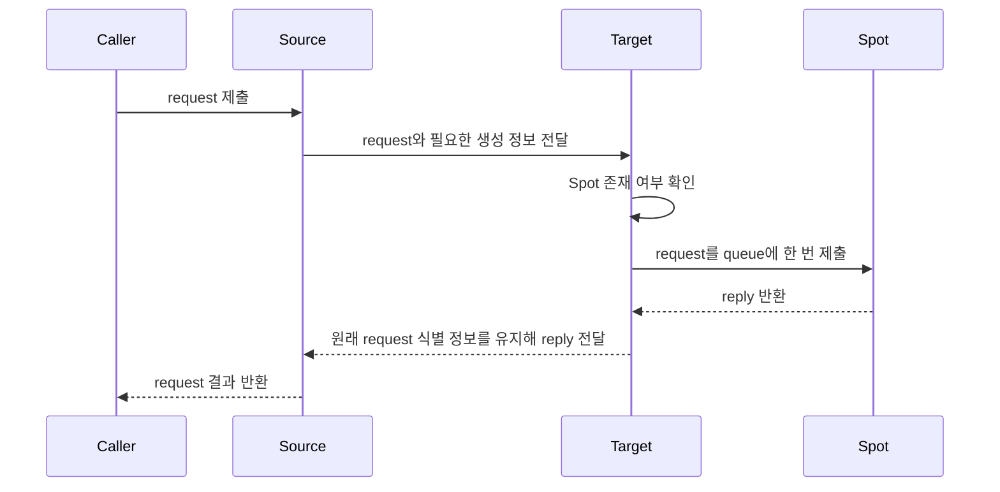

# 이해하기 쉬운 Framework 스펙 작성 가이드

> 이 문서는 `framework/doc/framework/common/spec/` 아래에서 공개 계약을 이해하기
> 쉽게 설명하면서도 구현과 contract test의 기준으로 사용할 수 있는 스펙을 작성하는
> 방법을 정의한다.
>
> 이 디렉터리의 스펙은 이전 문서를 대체할 독립적인 공개 계약이다. 작성 과정에서는
> 이전 문서를 누락 검사에 사용할 수 있지만, 완성된 스펙은 이전 문서에 의미나
> 판단을 위임하지 않고 필요한 계약을 자체적으로 모두 설명해야 한다.

[Framework 공개 계약 관리](00-public-contract-governance.ko.md) ·
[문서 설명 원칙](../../../../../doc/principal/documentation/documentation-principles.ko.md) ·
[작성 예시: Spot 메시징](20-spot-messaging.ko.md) ·
[용어집](01-glossary.ko.md)

## 1. 이 문서 형식을 사용하는 목적

스펙은 정확한 계약을 유지하면서 다음 독자가 처음 읽어도 이해할 수 있도록 충분히
풀어서 설명한다.

- Framework를 구현하는 개발자
- 언어별 binding과 public interface를 검토하는 개발자
- Contract test를 작성하는 개발자
- 설계 의도를 확인하는 application 개발자

이전 문서의 계약을 옮기는 동안 새로운 동작을 임의로 추가하거나 제약을 줄이지
않는다. 이전이 끝난 문서는 외부 자료를 다시 읽지 않아도 입력, 상태, 정상 흐름,
실패와 완료 조건을 판단할 수 있어야 한다.

현재 이 형식을 적용한 예시는 다음과 같다.

- [10 Channel topology](10-channel-topology.ko.md)
- [11 Channel 메시징](11-channel-messaging.ko.md)
- [12 ClientServer Channel](12-client-server-channel.ko.md)
- [13 Network listener identity](13-network-listener-identity.ko.md)
- [20 Spot 메시징](20-spot-messaging.ko.md)

## 2. 가장 먼저 지킬 원칙

### 2.1 동작을 먼저 설명하고 용어는 나중에 붙인다

독자가 영어 용어를 이미 안다고 가정하지 않는다. 먼저 무엇을 확인하고 어떤 결과가
생기는지 설명한 뒤 필요한 경우에만 정식 용어를 붙인다.

나쁜 예:

> Target runtime은 local exact instance가 없으면 generic placement reservation을
> 획득하며 CAS winner만 owner claim을 만든다.

좋은 예:

> Target node에 현재 Spot이 없으면 Location Store에 이 Spot을 생성해도 되는지
> 요청한다. 여러 target이 동시에 요청해도 생성 권한을 먼저 확보한 target만 자신을
> owner로 기록하고 Spot을 만든다.

공개 계약을 확인하는 데 필요하지 않은 내부 용어는 좋은 예에 다시 넣지 않는다.

### 2.2 처음 설명하고 두 번째 등장에 용어집을 연결한다

한 페이지에서 영어 용어가 처음 나오면 쉬운 설명을 한 번 붙인다. 같은 페이지에서
두 번째로 등장할 때는 별도 용어집의 해당 항목에 링크한다. 그 뒤에는 용어만
사용한다. 목차, interface signature와 code block 안의 식별자는 등장 횟수에서
제외하고 독자가 의미를 읽는 본문과 표를 기준으로 판단한다.

페이지에서 한 번만 사용하는 용어는 첫 등장에 용어집을 연결할 수 있다. 링크를
넣기 위해 같은 설명을 반복하지 않는다.

다른 페이지는 독립적으로 읽을 수 있어야 하므로 같은 용어가 처음 나오면 다시
설명한다.

예:

> 실행 중인 Instance Spot이 없을 때 새 Spot을 만들고 초기화하여 사용할 수 있게
> 준비하는 과정을 `cold activation`이라 한다.

두 번째 `cold activation`에는 다음과 같이 용어집 링크를 붙인다.

```markdown
[cold activation](01-glossary.ko.md#cold-activation)
```

세 번째부터는 `cold activation`만 사용한다.

용어집에는 public API 이름을 모두 복사하지 않는다. 여러 스펙에서 반복되거나 계약을
이해하는 데 필요한 domain term, 상태와 결과 이름을 정리한다.

완료 리뷰에서는 용어집의 각 항목을 기준으로 페이지별 사용 위치를 검사한다.
본문이나 표에서 같은 domain term이 두 번 이상 등장하면 해당 페이지에 용어집
링크가 정확히 하나 있어야 한다. 이미 링크가 하나 있으면 이후 등장마다 링크를
반복하지 않는다.

다음 위치는 등장 횟수와 자동 링크 검사에서 제외한다.

- 제목과 목차
- Interface signature와 code block
- Inline code로 표시한 public identifier와 닫힌 상태·오류 값
- 이미 다른 문서나 용어집으로 연결된 link label
- 같은 철자이지만 용어집의 domain 의미가 아니라 일반적인 뜻으로 사용한 단어

자동 검사는 누락 후보를 찾는 단계다. 실제 링크를 추가하기 전에는 첫 등장이 쉬운
설명을 제공하는지, 두 번째 등장이 같은 domain 의미인지 확인한다.

### 2.3 정식 식별자와 상태 이름은 바꾸지 않는다

다음 값은 코드와 contract test에서 사용하는 이름이므로 그대로 쓴다.

- Public type, method와 property 이름
- Error와 status 이름
- Wire field나 public result field
- Lifecycle state
- 수치 제한과 단위

이름은 유지하되 바로 옆에서 의미를 쉬운 문장으로 설명한다.

```text
`Backpressured`: 기다리는 작업을 보관할 공간까지 가득 차서 대기를 시작하지 못했다.
```

### 2.4 Domain에 따라 의미가 좁아지는 용어는 구체적인 이름으로 쓴다

`descriptor`, `target`, `owner`, `member`처럼 여러 기능에서 다른 뜻으로 사용하는
단어를 단독으로 쓰지 않는다. 해당 문맥에서 어떤 종류인지 이름에 포함한다.

나쁜 예:

> Endpoint를 확정하고 descriptor를 게시한다.

좋은 예:

> RouteMesh listener의 endpoint를 확정하고 `MeshNode descriptor`를 게시한다.

`Descriptor`처럼 여러 등록 정보를 통칭하는 상위 개념은 용어집에 남길 수 있다.
하지만 실제 흐름에서는 `MeshNode descriptor`, `ClientServer Server descriptor`,
`fanout publisher descriptor`처럼 구체적인 계약 이름을 사용한다. Domain에 따라
포함 field, 게시 위치나 검증 절차가 달라지면 용어집에도 별도 항목을 만든다.

### 2.5 값을 나타내는 용어는 공개된 구성을 함께 설명한다

Identifier, descriptor, envelope, token과 snapshot처럼 실제 값을 나타내는 용어는
무엇을 하는지만 설명해서는 부족하다. 원문 계약이 정의한 범위 안에서 다음 내용을
용어집에 함께 적는다.

- 단일 값인지 여러 field로 이루어진 값인지
- 공개된 field와 형식, 길이 또는 값의 범위
- 값을 만드는 주체와 uniqueness 범위
- 어떤 message나 상태에 포함되어 전달되는지
- 값이 유효한 기간과 더 이상 사용할 수 없게 되는 조건
- Application이 값을 해석·생성·변경할 수 있는지

여러 field로 이루어진 값에 실제 .NET public type이 있으면 정식 C# 선언을 그대로
보여주고, 계약을 이해하는 데 필요한 member 옆에 짧은 한국어 주석을 붙인다. 이렇게
하면 field가 어느 record나 class에 속하는지, nullable인지, collection의 key와
value type이 무엇인지 한 번에 확인할 수 있다. 실제 public type이 없는 공통 구조나
wire 형식은 표로 구성 요소를 설명한다.

내부 구조를 공개하지 않는 opaque 값이라면 구성 field를 추측하지 않고, 단일 opaque
값이라는 사실과 공개된 형식 제약만 명시한다. 원문 계약에 없는 field나 encoding을
이해를 돕는다는 이유로 추가하지 않는다.

공통 용어집에서는 실제 사용 모습을 이해하는 데 도움이 되면 .NET public type을
계약의 예시 표기로 함께 적을 수 있다. 이때 공통 동작을 .NET 전용 계약으로 바꾸지
않으며, 언어별 exact interface에 선언된 type과 member 이름을 그대로 사용한다.
독립된 public type이 없는 값은 **public type 없음**이라고 표시한다. 구조 설명을
위해 C# 모양을 제시해야 하면 **contract pseudocode이며 실제 API가 아니다**라고
같은 위치에 명시한다.

## 3. 권장 문서 구조

문서 성격에 맞지 않는 절은 생략할 수 있지만 다음 순서를 기본으로 사용한다.

1. 범위와 독자
2. 전체 동작 요약
3. Public interface 발췌
4. Identity와 역할
5. 정상 흐름
6. 동시 실행과 경쟁 처리
7. 완료 결과와 실패
8. 수명과 shutdown
9. Metadata와 관측
10. 구현 및 contract test 검증 요구

독자가 문서 앞부분만 읽어도 다음 질문에 답할 수 있어야 한다.

- Application은 어떤 값만 지정하는가?
- Framework는 어떤 값을 대신 결정하는가?
- 대상이 있거나 없을 때 각각 무엇을 하는가?
- 호출은 언제 완료되는가?
- 실패하면 어떤 결과를 반환하는가?

## 4. 범위와 전체 동작 요약 작성법

### 4.1 결과와 책임 경계를 먼저 쓴다

첫 단락에서 문서가 답하는 질문을 명시한다. 내부 구성 요소를 먼저 나열하지 않는다.

예:

> 이 문서는 logical Spot 하나 또는 같은 Channel의 여러 Spot에 message를 보낼 때
> Framework가 대상을 정하고 callback을 실행하는 방법을 설명한다.

### 4.2 요약 표도 완전한 문장으로 쓴다

표의 칸이 짧아야 한다는 이유로 조건과 순서를 생략하지 않는다.

나쁜 예:

| 방식 | Framework가 결정하는 대상 |
|---|---|
| Spot direct | Ready owner 또는 cold activation target |
| Logical Multicast | Positive-weight ready remote와 local match |

좋은 예:

| 방식 | Framework가 실제 전달 대상을 정하는 방법 |
|---|---|
| Spot direct | 먼저 현재 사용할 수 있는 Spot을 찾는다. Spot이 있으면 그 Spot을 소유한 node로 보낸다. Spot이 없고 application이 생성을 허용했다면 새 Spot을 만들 node를 선택한다. |
| Logical Multicast | 해당 Channel에 참여하고 ready 상태인 remote node를 먼저 선택한다. 각 수신 node는 자신의 local Spot 중에서 ChannelName과 topic이 일치하는 Spot에 message를 전달한다. |

표 아래에는 표만으로 드러나지 않는 예외를 문장으로 보충한다. 예를 들어 Spot이
없고 생성도 허용하지 않은 경우의 결과를 함께 설명한다.

### 4.3 다른 계약이 소유한 세부 동작을 복제하지 않는다

현재 문서가 보장할 결과와 다른 문서가 소유한 세부 동작을 구분한다. 구현 코드에서
동작을 확인했더라도 원본 계약이 현재 문서의 공개 규칙으로 정의하지 않았다면 설명을
추가하여 계약 범위를 넓히지 않는다.

관련 세부 동작을 정의하는 정식 문서가 있으면 현재 문서에는 독자가 경계를 이해하는 데
필요한 결과만 적고 해당 문서를 링크한다. 아직 정식 문서가 없다면 폐기할 이전 문서,
구현 코드나 임시 문서를 대신 링크하지 않는다. 정식 문서가 만들어진 뒤 링크를
추가한다.

예를 들어 Channel topology 문서는 같은 peer의 중복 연결이 하나로 정리된다는 결과만
정의한다. ROUTER socket이 duplicate RID를 처리하는 option과 physical connection 선택
알고리즘은 해당 transport 계약이 소유한다. Channel topology 문서에 그 알고리즘을
복제하지 않고, transport 정식 문서가 준비되면 링크만 연결한다.

## 5. 역할과 흐름을 설명하는 방법

### 5.1 Source, Framework와 target의 책임을 나눈다

한 문장에서 여러 구성 요소의 동작을 섞지 않는다. 다음 순서로 나누어 쓴다.

1. Caller가 지정하는 값
2. Source runtime이 조회하거나 선택하는 값
3. Transport가 수락하는 시점
4. Target runtime이 확인하는 상태
5. Queue와 handler가 처리하는 작업
6. Caller에게 결과가 돌아오는 시점

각 단계에서 주어를 생략하지 않는다.

나쁜 예:

> Resolve 후 reservation과 Ready를 거쳐 dispatch한다.

좋은 예:

> Source runtime은 Location Store에서 현재 Spot을 찾는다. Spot이 없으면 target
> node를 선택해 최초 request와 생성 정보를 함께 보낸다. Target node는 Spot을
> 생성하고 초기화한 뒤 request를 Spot queue에 한 번 넣는다.

### 5.2 존재 여부를 언제 어디서 확인하는지 명시한다

생성과 메시징 흐름에서는 다음 차이가 계약을 바꿀 수 있다.

- Source가 Location Store에서 확인하는가?
- Target node가 자신의 Spot 목록에서 확인하는가?
- Spot이 없을 때 source와 target 중 누가 생성 권한을 요청하는가?
- 최초 message를 source가 다시 보내는가, 처음 전달한 message를 target이 보관하는가?

이 질문에 답하지 않는 문장은 흐름 설명으로 충분하지 않다.

### 5.3 Framework가 자동으로 하지 않는 동작과 application이 할 수 없는 동작을 구분한다

“중계하지 않는다”, “재전송하지 않는다”, “다른 경로를 사용하지 않는다”는 문장만
쓰면 해당 동작 자체가 금지되는 것처럼 읽힐 수 있다. 다음 세 가지를 함께 설명한다.

1. Framework가 현재 operation에서 자동으로 하지 않는 동작
2. 실패했을 때 자동 fallback이나 retry가 있는지
3. Application이 별도 API 호출로 명시적으로 시작할 수 있는 동작

나쁜 예:

> Framework는 mesh 사이를 중계하지 않는다.

좋은 예:

> Framework는 한 RouteMesh에서 받은 message를 다른 RouteMesh로 자동 전달하지
> 않으며, target을 찾지 못했을 때 다른 RouteMesh로 fallback하지 않는다. 같은
> process의 application은 MeshName이나 등록된 ChannelName을 지정하여 다른
> RouteMesh에서 별도의 호출을 시작할 수 있다. 이 호출은 기존 message의 자동
> 중계가 아니라 application이 시작한 새 operation이다.

별도 호출이 중복 실행 위험을 만들 수 있다면 그 책임과 결과도 설명한다. 예를 들어
Framework가 request를 자동 재전송하지 않더라도 application이 새 request를 시작할
수는 있다. 이때 application은 이전 request가 이미 실행되었을 가능성을 처리해야 한다.

### 5.4 Role 부재와 기능 부재를 같은 뜻으로 쓰지 않는다

Role을 설명할 때는 “Server가 없다”처럼 범위를 생략하지 않는다. 다음 위치와 조건을
구분한다.

- 현재 process 또는 local MeshNode에 어떤 role이 등록되어 있는가?
- 호출을 시작하려면 caller 쪽에 어떤 role이나 송신 경로가 필요한가?
- Message를 처리하려면 remote target에 어떤 role이 필요한가?
- 각 role 가운데 무엇을 descriptor에 게시하는가?
- 아무 role도 등록하지 않은 경우에도 가능한 작업은 무엇인가?

예를 들어 “local Server role이 없어도 Channel 호출을 시작할 수 있다”고 썼다면,
호출할 ChannelName의 `Client` role은 local MeshNode에 등록해야 하고 같은 MeshName의
remote MeshNode에는 `Server` role이 있어야 한다는 조건을 바로 이어서 쓴다.
Client role은 local 송신 경로만 만들며 Server membership으로 게시하지 않는다는
차이도 설명한다.

Role에 따라 허용 동작이 달라지면 표로 비교한다. 표 바로 아래에는 서로 다른
process의 caller와 target을 보여주는 최소 interface 발췌와 설정 예제를 둔다.

한 component에 서로 다른 role 축이 있으면 각 축을 분리해서 설명한다. 예를 들어
Channel Client·Server role은 Channel target membership을 결정하고, Object
Client·Server role은 Spot·Actor factory와 object placement 자격을 결정한다.
Channel Client라는 이유만으로 Object placement target에서 제외된다고 추론하지
않는다. 두 role 축을 함께 설정할 수 있다면 허용되는 조합과 각 조합의 결과를 표와
예제로 보여준다.

### 5.5 서로 다른 target API의 공통 차이를 먼저 설명한다

Node direct, Spot direct와 Actor direct처럼 비슷해 보이는 API의 경계를 설명할 때
“A의 payload를 B의 handler에 전달하지 않는다”는 제한부터 쓰지 않는다. 독자가 먼저
이해해야 하는 공통 차이를 첫 문장에 제시한다.

나쁜 예:

> Node direct payload를 Spot callback이나 Actor handler로 전달하지 않는다.

좋은 예:

> Node direct, Spot direct와 Actor direct는 서로 다른 주소 지정 방식이며, handler도
> 서로 섞이지 않는다.

그다음 각 방식이 지정하는 target과 실행하는 handler를 설명한다. Payload type이나
내용이 같더라도 Framework가 다른 target 방식으로 자동 변환하지 않는다면 그 제한을
마지막에 덧붙인다.

이 순서는 다음과 같이 독자가 비교해야 하는 대상이 둘 이상인 설명에도 적용한다.

1. 가장 큰 공통 차이
2. 각 방식이 지정하는 identity 또는 target
3. 각 방식에서 실행하는 queue, callback 또는 handler
4. Framework가 자동으로 변환하거나 대신 선택하지 않는 경계

### 5.6 내부 제어 신호는 application에서 보이는 결과부터 설명한다

Liveness beacon, relocation control message와 lifecycle notification처럼 Framework가
내부에서만 사용하는 입력을 설명할 때 내부 처리 이름부터 쓰지 않는다. 독자가 먼저
알아야 하는 것은 application event와 어떻게 구분되고 어떤 callback이나 관측 결과가
발생하지 않는지다.

나쁜 예:

> Exact beacon은 handler와 message-flow publish에 전달하지 않는다.

좋은 예:

> Subscriber는 이 topic의 신호를 application event로 처리하지 않는다. Framework가
> 연결 상태를 확인하는 데만 사용하므로 fanout handler를 실행하지 않으며,
> application message의 전달 흐름을 기록하는 관측 event에도 게시하지 않는다.

다음 순서로 설명한다.

1. Framework가 이 신호를 사용하는 목적
2. Application payload나 event와 구분하는 기준
3. 실행하지 않는 application handler 또는 callback
4. 일반 message 관측에 포함하는지 여부
5. Byte 형식이나 timeout처럼 다른 계약이 소유한 세부 규칙의 링크

`message-flow publish`, `control claim`처럼 내부 구현자에게만 바로 이해되는 표현은
그대로 두지 않는다. 공개 계약에 필요한 경우 “application message의 전달 흐름을
기록하는 관측 event”, “lifecycle 작업을 처리하는 Framework 전용 queue”처럼
application에서 관찰하는 의미를 먼저 설명한다.

### 5.7 자동 선택에서 제외하는 규칙과 직접 지정 호출을 분리한다

Drain, weight 0과 readiness처럼 target 후보 자격을 설명할 때 모든 호출에 같은 효과가
있는 것처럼 쓰지 않는다. 먼저 누가 target을 선택하는 호출인지 밝히고, 직접 identity를
지정하는 호출과 나누어 설명한다.

나쁜 예:

> Drain 중인 member는 새 선택에서 제외하지만 RID direct의 의미를 바꾸지 않는다.

좋은 예:

> ChannelName 호출에서는 Framework가 Server member 하나를 선택한다. Drain 상태의
> member는 이 후보에서 제외하므로 새로운 ChannelName message를 보내지 않는다.
>
> Node direct에서는 caller가 target RID를 직접 지정한다. Framework는 drain 상태라는
> 이유로 다른 RID를 대신 선택하지 않는다. 이 설명은 target을 바꾸지 않는다는
> 뜻이며, 지정한 node가 message를 반드시 수락한다는 보장은 아니다.

상태 하나가 호출 방식마다 다르게 작용하면 다음 네 가지를 명시한다.

1. 영향을 받는 호출 방식
2. 후보에서 제외하거나 새 수락을 막는 주체와 시점
3. 영향을 받지 않는 직접 지정 방식
4. “target을 바꾸지 않는다”와 “호출이 성공한다”의 차이

## 6. Sequence diagram 작성법

### 6.1 설명하려는 계약에 맞는 call 형태를 선택한다

Sequence diagram을 항상 request/reply로 그릴 필요는 없다. 송신 경로 수락이나
one-way 전달이 핵심이면 send 흐름이 더 정확하다. Reply correlation, request
timeout이나 caller에게 결과가 돌아오는 과정까지 설명해야 하면 request/reply
흐름을 사용할 수 있다.

아래 다이어그램은 request 완료 과정을 설명할 때 사용할 수 있는 예시다.



### 6.2 화살표 설명은 한국어로 쓴다

Participant 이름에는 정식 component 이름을 사용할 수 있다. 화살표, `alt`, `else`,
`Note`의 설명은 한국어 문장으로 쓴다.

### 6.3 Diagram이 보여주지 않는 경로를 명시한다

Diagram이 정상 경로, 생성 권한을 얻은 경로 또는 특정 API만 보여준다면 바로 아래에
범위를 적는다.

예:

> 이 다이어그램은 Missing Spot에서 선택된 target이 생성 권한을 얻는 정상 경로를
> 보여준다. 다른 target이 먼저 생성 권한을 얻은 경우에는 현재 target이 Spot을
> 만들지 않는다.

### 6.4 물리 연결과 논리 target 선택은 별도 diagram으로 그린다

두 API가 같은 socket이나 connection을 사용하더라도 물리 topology와 논리 target
선택을 한 그림에 모두 넣으면 계층이 섞여 보일 수 있다. 다음 두 diagram으로 나눈다.

첫 번째 diagram은 물리 연결만 보여준다.

- 어떤 MeshName의 MeshNode가 서로 연결되는가?
- MeshNode마다 어떤 socket과 RID가 있는가?
- Full mesh 또는 다른 물리 topology가 어떻게 구성되는가?
- 서로 다른 MeshName 사이에 자동 연결이나 relay가 있는가?

같은 RouteMesh의 node를 `MeshNode A`, `MeshNode B`처럼 서로 다른 이름으로 표시하지
않는다. 모든 node에 같은 MeshName을 반복해서 적고, 서로 다른 RID로 node를
구분한다. MeshName은 물리 연결망을 구분하고 RID는 그 연결망 안의 node를
식별한다는 차이가 그림만 보아도 드러나야 한다.

두 번째 diagram은 이미 만들어진 물리 연결 위의 논리 관계만 보여준다.

- Caller가 target RID를 직접 지정하는지, ChannelName을 지정하는지
- Client와 Server membership 가운데 어느 쪽이 target 후보가 되는지
- Ready와 weight로 어떤 후보를 선택하는지
- 선택한 target에서 어느 queue와 handler namespace를 사용하는지

한 diagram에 후보 snapshot, selector, transport와 queue를 모두 넣지 않는다.
`Client role만 등록한 caller가 여러 remote Server 중 하나를 선택하는 경우`와
`Server role의 caller가 자기 node를 포함한 후보 중 하나를 선택하는 경우`처럼
application이 구분해야 하는 사례를 별도 diagram으로 단순하게 보여준다.

Client-only 그림에서는 Client를 하나의 원으로, Server 후보를 각각의 node box로
배치한다. Select-one 예시에서 실제로 선택된 Server 하나에만 화살표를 연결하고,
나머지는 이번 호출에서 선택되지 않은 후보라고 본문에서 설명한다.

Server role이 송신 기능을 포함하는 그림도 같은 구도를 사용한다. 왼쪽 원에는
`server A에 포함된 송신 capability`라고 쓰고, 오른쪽 Server 후보에는 자기 node인
server A를 함께 배치한다. 자기 node가 선택된 예시라면 server A에만 화살표를
연결한다. 왼쪽 원은 별도로 등록한 Client role이 아니며 Server role에 포함된
capability라는 점을 그림 아래에서 설명한다.

두 번째 diagram 아래에는 실제 message가 첫 번째 diagram의 기존 peer 연결을
사용하며 논리 Channel 등록이 socket을 추가하지 않는다고 명시한다.

화살표 설명에는 “전송”만 쓰지 않고 `지정한 RID 유지`, `Server 후보로 등록`,
`weight를 반영해 하나 선택`처럼 해당 단계의 계약을 적는다.

## 7. 표 작성법

표는 조건이나 역할을 비교할 때만 사용한다. 한 가지 흐름을 순서대로 설명할 때는
번호 목록이나 sequence diagram을 사용한다.

각 표는 다음 조건을 만족해야 한다.

- 각 열의 비교 기준이 제목만으로 분명하다.
- 셀 안에서도 주어와 동작을 생략하지 않는다.
- `ready remote`, `local match`, `admission`처럼 용어만 나열하지 않는다.
- Status나 field 이름 옆에 application이 관찰하는 의미를 쓴다.
- 표에 담기 어려운 예외는 표 아래 산문으로 보충한다.

결과 수를 설명할 때는 field 이름만 나열하지 않는다.

| Field | 쉬운 설명 |
|---|---|
| `snapshot` | 작업을 시작할 때 선택한 target 수 |
| `admitted` | Message를 수락한 target 수 |
| `dropped` | Queue 용량 부족으로 message를 수락하지 못한 target 수 |
| `unreachable` | 송신 경로가 없어 연결할 수 없는 remote target 수 |

## 8. 코드 예제 작성법

### 8.1 링크만 두지 않고 필요한 interface를 문서에 보여준다

독자가 흐름을 이해하려고 다른 문서를 오가게 만들지 않는다. 설명에 필요한 public
interface와 result type은 정식 interface 문서에서 정확히 발췌한다.

발췌하지 않은 overload나 세부 계약은 정식 interface 문서 링크로 연결한다.

### 8.2 공통 계약을 특정 언어 계약으로 바꾸지 않는다

언어 중립 스펙에서도 .NET 코드를 비규범적 pseudo code처럼 사용할 수 있다. 이때
다음 내용을 코드 앞에 명시한다.

- 공통 동작을 이해하기 위한 예시다.
- 다른 언어에 같은 signature를 요구하지 않는다.
- 정확한 언어별 signature는 언어별 interface 문서가 정의한다.

### 8.3 핵심 호출 옆에 이유를 주석으로 쓴다

코드만 읽어도 해당 절의 핵심을 이해할 수 있어야 한다.

```csharp
return client
    .RequestToSpot(spotId, request)
    .InstanceSpot("ShoppingCartSpot") // Spot이 없으면 이 type으로 새로 준비한다.
    .InMesh("object-mesh")             // 처음 배치할 Mesh에만 적용한다.
    .Async<TReply>(cancellationToken); // Spot 준비 뒤 handler의 reply를 기다린다.
```

모든 줄을 설명하지 않는다. 코드만으로 알 수 없는 목적, 완료 시점과 제약이 있는
줄에만 주석을 붙인다.

### 8.4 Interface와 예제는 설명하는 절에 함께 둔다

문서 앞부분에 public interface를 한꺼번에 보여주고 뒤의 role이나 lifecycle 절에는
링크만 남기지 않는다. 특정 절의 의미가 API 선택에 따라 달라진다면 그 절에서 필요한
interface만 다시 발췌하거나 앞의 발췌를 해당 절로 옮긴다.

예를 들어 Client와 Server role의 차이를 설명하는 절에는 `Client()`와 `Server()`,
Server에서만 제공하는 handler와 weight 설정을 함께 보여준다. 이어지는 최소 예제는
caller process와 server process가 서로 다르다는 점과 각 process에 필요한 role을
코드 주석으로 명시한다.

같은 interface와 예제를 여러 절에 그대로 복사하지 않는다. 가장 관련 있는 절에
배치하고 다른 절에서는 해당 절을 링크한다.

### 8.5 송신 설정과 수신 결과를 한 흐름으로 보여준다

Metadata, timeout, filter와 correlation처럼 caller가 설정하고 target handler가 읽는
기능은 한쪽 interface만 보여주지 않는다. 다음 세 부분을 같은 절에서 연결한다.

1. Caller가 값을 설정하는 call builder interface
2. Target handler가 값을 읽는 context interface
3. 설정한 값이 선택된 target에서 보이는 최소 예제

Metadata를 “message와 함께 전달한다”고만 쓰거나 interface 문서 링크만 남기면
application이 실제로 어디에서 설정하고 읽는지 알 수 없다. Setter, receiver와
ownership·크기·자동 복사 여부를 함께 설명한다. Packet 안의 frame 배치처럼 공개
계약이 아닌 구현 상세는 추가하지 않는다.

### 8.6 Handler 선택 규칙과 메시징 방식의 경계를 interface로 확인시킨다

Handler를 설명하는 절에는 다음 정보를 함께 둔다.

- Handler를 찾는 key와 namespace
- 어느 builder에 handler를 등록하는지
- 선택된 target에서 어떤 queue나 turn이 handler를 실행하는지
- 같은 packet name을 다른 namespace에서 사용할 수 있는지

Node direct와 ChannelName, ChannelName과 Classic fanout처럼 비슷해 보이는 방식은 각
handler interface와 최소 등록 예제를 나란히 보여준다. 이때 “A의 payload를 B에
전달하지 않는다”는 제한만 쓰지 않고, 각 방식이 선택하는 대상과 완료 시점을 먼저
설명한다.

## 9. 완료와 실패를 설명하는 방법

`SubmitAsync` 반환과 handler 실행 완료를 구분한다. Request라면 transport 수락과
reply 완료도 구분한다.

다음 질문에 각각 답한다.

- 송신 경로가 message를 수락하면 call이 완료되는가?
- Target queue 수락까지 기다리는가?
- Handler 실행이나 reply까지 기다리는가?
- Timeout은 어느 단계부터 어느 단계까지 적용하는가?
- Cancellation 뒤 remote handler가 이미 시작한 작업을 취소하는가?
- 일부 target만 수락한 경우 이미 성공한 제출을 유지하는가?

Status는 이름만 나열하지 않고 caller가 관찰하는 조건을 표로 설명한다.

## 10. 이전 계약을 옮기고 대조하는 방법

이전 문서를 대체하는 스펙을 작성할 때는 이전 문서와 항목별로 대조한다. 이전 문서는
누락을 찾는 입력 자료일 뿐, 완성된 스펙이 독자에게 다시 확인하도록 요구하는
외부 기준이 아니다.

| 확인 항목 | 대조할 내용 |
|---|---|
| 입력 | Required 값, optional 값, 크기와 범위 |
| 대상 선택 | 조회 순서, 자동 선택 조건과 application이 지정할 수 없는 값 |
| 정상 흐름 | 생성, 초기화, Ready와 최초 message 처리 순서 |
| 경쟁 처리 | 여러 node나 중복 message가 동시에 도착했을 때 하나로 수렴하는 조건 |
| 완료 | Send 수락 시점, request reply와 handler 실행의 관계 |
| 실패 | Status, error, timeout, cancellation과 shutdown |
| 수명 | 신규 message 차단, 이미 수락한 작업과 종료 시간 |
| 결과 | Result field와 각 count의 의미 |
| 검증 | 구현과 contract test가 확인해야 하는 조건 |

이전 계약에 없는 동작을 이해를 돕는다는 이유로 보장처럼 추가하지 않는다. 설명을
위해 추론한 내용이 필요하면 비규범적 예시라고 표시하고, 공개 계약으로 채택해야
한다면 먼저 설계 검토를 거친다.

완성된 대체 스펙에는 다음 내용을 남기지 않는다.

- 폐기할 이전 문서의 링크
- “두 문서가 다르면 이전 문서를 따른다”는 우선순위 문구
- 계약의 일부를 이전 문서에서 확인하라는 안내
- 이전 문서와 달라진 작성 이력이나 비교표

대조가 끝나면 이전 문서 없이도 모든 checklist 항목을 판단할 수 있는지 다시 읽는다.

## 11. 작성 완료 점검표

### 내용

- [ ] 첫 단락만 읽어도 문서의 질문과 책임 경계를 알 수 있다.
- [ ] Application이 지정하는 값과 Framework가 결정하는 값을 구분했다.
- [ ] 대상이 있을 때와 없을 때의 동작을 모두 설명했다.
- [ ] Source와 target이 각각 확인하는 상태를 구분했다.
- [ ] Local과 remote role, caller와 target에 필요한 등록을 각각 명시했다.
- [ ] “자동으로 하지 않는다”와 “application도 할 수 없다”를 구분했다.
- [ ] 자동 fallback·retry가 없을 때 application이 별도 호출을 시작할 수 있는지 설명했다.
- [ ] 자동 target 선택의 제외 조건과 caller가 identity를 직접 지정하는 호출을 구분했다.
- [ ] Target을 바꾸지 않는다는 규칙을 호출 성공 보장처럼 쓰지 않았다.
- [ ] 최초 message가 언제 몇 번 queue에 들어가는지 설명했다.
- [ ] Send, request와 handler의 완료 시점을 구분했다.
- [ ] 내부 제어 신호가 application handler와 일반 message 관측에 나타나는지 설명했다.
- [ ] Status와 result field를 쉬운 문장으로 설명했다.
- [ ] 이전 계약의 수치, 상태, 실패와 검증 요구를 빠뜨리지 않고 현재 문서에 옮겼다.
- [ ] 폐기할 이전 문서의 링크나 우선순위 문구가 남아 있지 않다.

### 표현

- [ ] 페이지에서 처음 나오는 용어는 쉬운 설명을 먼저 붙였다.
- [ ] 두 번째로 등장하는 domain term에 용어집 항목을 연결했다.
- [ ] 새 domain term을 용어집에 추가하거나 기존 정의와 일치하는지 확인했다.
- [ ] `descriptor` 같은 상위 용어를 실제 흐름에서 구체적인 domain 이름으로 썼다.
- [ ] 불필요한 내부 용어와 영어 명사 나열을 제거했다.
- [ ] 객체나 연결을 의인화하지 않았다.
- [ ] 표의 각 셀을 축약어가 아닌 완전한 문장으로 작성했다.
- [ ] Diagram의 화살표, 조건과 note를 한국어로 작성했다.
- [ ] 물리 연결과 논리 target 선택을 서로 다른 diagram으로 분리했다.
- [ ] 코드 주석이 호출을 반복하지 않고 목적과 계약을 설명한다.
- [ ] Role이나 lifecycle을 설명하는 절에 필요한 interface와 최소 예제를 함께 두었다.
- [ ] Caller가 설정하고 handler가 읽는 기능은 송신 interface와 수신 context를 한 흐름으로 보여 주었다.
- [ ] Handler를 찾는 key, 등록 위치와 실행 범위를 같은 절에서 설명했다.

### 형식

- [ ] Markdown code fence가 모두 닫혀 있다.
- [ ] 상대 링크가 실제 문서를 가리킨다.
- [ ] Mermaid 문법을 확인했다.
- [ ] 표의 열 수가 모든 행에서 같다.
- [ ] Trailing whitespace와 금지 표현이 없다.
