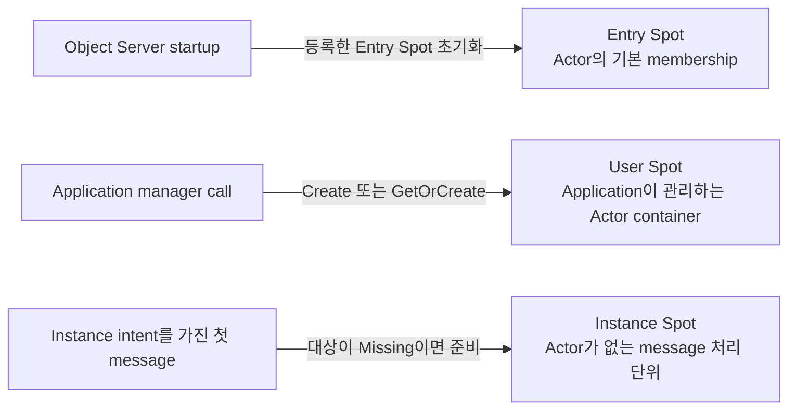

# Spot 모델 — Entry, User, Instance

[스펙 목차](README.ko.md) · [Spot 메시징](20-spot-messaging.ko.md) ·
[MeshNode](21-mesh-node.ko.md) · [Spot과 Actor membership](23-spot-actor.ko.md) ·
[Spot 주소 메시징](24-spot-address-messaging.ko.md)

## 1. 범위

이 문서는 Framework가 제공하는 Entry Spot, User Spot과 Instance Spot의 공통점과
차이점을 정의한다. 세 종류 모두 주소와 상태를 가지고 순서대로 callback을 실행하는
[Spot](01-glossary.ko.md#spot)이지만 생성 목적, [Actor membership](01-glossary.ko.md#membership),
종료와 relocation 계약은 서로 다르다.

이 문서는 “어떤 Spot 종류를 사용해야 하는가?”와 “Entry Spot이 어떤 역할을
하는가?”에 답한다. Message 전달 방법은 [20 Spot 메시징](20-spot-messaging.ko.md),
Actor callback의 정확한 순서는 [23 Spot과 Actor membership](23-spot-actor.ko.md),
User·Instance Spot의 생성과 주소 계약은
[24 Spot 주소 메시징](24-spot-address-messaging.ko.md)이 소유한다.

## 2. 세 Spot은 준비되는 시점과 목적이 다르다



Entry Spot은 Object Server와 함께 준비된다. User Spot은 application이 manager로
명시적으로 만들며, Instance Spot은 별도 create operation 없이 첫 direct message가
필요할 때 준비된다.

## 3. 공통점과 차이점

| 구분 | Entry Spot | User Spot | Instance Spot |
|---|---|---|---|
| 주된 목적 | 해당 Object Server에 배치된 Actor의 초기·기본 membership을 관리한다. | Application이 명시적으로 만드는 Spot이며 Actor membership을 관리할 수 있다. | Actor 없이 direct message와 timer를 처리한다. |
| 등록·생성 | Object Server builder에 Spot 구현 type을 등록하고 startup에서 초기화한다. | Stable type의 factory를 등록하고 manager `Create`·`GetOrCreate`로 만든다. | Stable type의 factory를 등록하고 Instance intent를 가진 첫 direct call로 준비한다. |
| Spot ID | Framework가 발급한다. Caller가 fixed Spot ID를 지정하지 않는다. | `Create`는 Framework가 발급하고 `GetOrCreate`는 caller가 지정한다. | Caller가 direct message의 target Spot ID를 지정한다. |
| Stable type 입력 | 별도 stable-type 문자열을 등록하지 않는다. | UTF-8 1..255 byte stable type이 필수다. | UTF-8 1..255 byte stable type을 사용한다. Missing activation에서는 명시하거나 유일한 등록 type을 선택한다. |
| Actor membership | 지원한다. Actor 생성의 initial membership이며 `JoinEntrySpot`의 대상이다. | 지원한다. Actor가 `JoinSpot`과 leave로 membership을 변경할 수 있다. | 지원하지 않는다. |
| Direct packet | 지원한다. | 지원한다. | 지원한다. |
| Timer와 outbound call | 지원한다. | 지원한다. | 지원한다. |
| 기본 application 실행 | Spot handler와 timer는 Spot turn에서 직렬화하고 Actor는 Actor별로 실행한다. | `SpotWide`: Spot·member Actor·timer·lifecycle callback 전체를 직렬화한다. | Direct handler와 timer를 Spot 전체에서 직렬화한다. |
| Optional 실행 방식 | 제공하지 않는다. | `PerActor`: Actor별, Spot lane별, timer별로 직렬화하며 서로 다른 lane은 동시에 실행할 수 있다. | 제공하지 않는다. |
| `Yield` | 지원하지 않는다. | `SpotWide`에서만 지원한다. `PerActor`에서는 지원하지 않는다. | 지원한다. |
| Logical Multicast subscription | 지원한다. | 지원한다. | 지원하지 않는다. |
| Application의 명시적 close | Entry Spot context와 manager에 close operation을 제공하지 않는다. | Exact `SpotRef`를 manager `Close`에 전달하거나 local context에서 close한다. | 자신의 handler나 timer context에서 close한다. |
| Relocation | Entry Spot 자체는 relocation unit이 아니다. Target node startup에서 새 identity로 준비한다. | Spot과 현재 member Actor를 하나의 aggregate로 이동한다. | Actor가 없는 Spot 하나를 relocation unit으로 이동한다. |
| Host shutdown | Accepted turn을 정리한 뒤 `HostShutdown` reason으로 `OnClosing`을 호출한다. | 같은 shutdown closing 계약을 적용한다. | 같은 shutdown closing 계약을 적용한다. |
| .NET 구현 type | `IZLinkEntrySpot`, Actor type을 지정하면 `IZLinkEntrySpot<TActor>` | `IZLinkSpot`, Actor type을 지정하면 `IZLinkSpot<TActor>` | `IZLinkInstanceSpot` |

Framework는 작업의 대상에 따라 실행을 기다릴 queue를 정한다. 세 종류의 Spot에
전달된 direct packet과 timer callback은
[Spot application queue](01-glossary.ko.md#spot-application-queue)에 넣는다.
Actor에 전달된 업무 payload는 Spot queue를 거치지 않고 해당 Actor의 queue에
바로 넣는다.

Queue는 작업이 기다리는 위치를 정한다. Execution mode는 서로 다른 queue의 작업을
동시에 실행할 수 있는지 정한다. User Spot의 기본 `SpotWide` mode에서는 queue를
다음과 같이 사용한다.

```text
+----------------------------------------------------------------------+
| User Spot (SpotWide)                                                 |
|                                                                      |
| Direct packet ---+                                                   |
| Timer callback --+--> [Spot queue] -----------+                      |
|                                                |                     |
| Actor A payload -----> [Actor A queue] --------+                     |
|                                                +--> [SpotWide gate]  |
| Actor B payload -----> [Actor B queue] --------+          |          |
|                                                           v          |
|                                                    [One callback]    |
+----------------------------------------------------------------------+
```

이 그림에서 Spot queue와 Actor queue는 서로 분리되어 있다. Actor payload가
Spot queue를 경유하거나 여러 queue가 하나로 합쳐지는 것은 아니다. 다만 모든
queue가 하나의 공통 execution gate를 사용하므로, 같은 User Spot에서는 Spot
handler, timer callback과 member Actor handler 가운데 하나만 실행한다.

이 그림은 User Spot의 기본 `SpotWide` mode만 보여준다. Entry Spot은 Spot 작업과
Actor별 작업의 실행 범위를 분리한다. Instance Spot은 Actor membership을 지원하지
않으므로 Actor queue가 없다.

### 3.1 Spot 종류별 lifecycle callback

다음 표의 callback 이름은 .NET 표기를 사용한다. 다른 언어는 이름과 비동기 표현이
다를 수 있지만 호출 조건과 순서는 같다. `Configure`는 비동기 lifecycle callback이
아니라 handler를 등록하는 구성 단계이지만, Spot instance가 준비되는 순서를
함께 이해할 수 있도록 표에 포함했다.

| Callback | Entry Spot | User Spot | Instance Spot | 호출 목적 |
|---|---:|---:|---:|---|
| `Configure` | O | O | O | 해당 Spot instance가 사용할 handler를 등록한다. |
| `OnCreateAsync` | X | O | X | Manager가 새 User Spot을 만들 때 creation request를 확인하고 생성 수락 여부와 optional reply를 반환한다. 기존 User Spot을 찾은 `Existing` 결과에서는 호출하지 않는다. |
| `OnInitializeAsync` | O | O | O | 생성된 Spot instance의 application 초기화를 완료한다. Instance Spot은 `OnCreateAsync` 없이 이 callback을 사용한다. |
| `OnClosingAsync` | O | O | O | 아직 유효한 local Spot instance가 종료되기 전에 application resource를 정리한다. 호출 조건은 §3.3에서 구분한다. |
| `OnActorJoinAsync` | X | O¹ | X | 이미 존재하는 Actor가 User Spot으로 이동하려 할 때 target User Spot이 요청을 승인하거나 거부한다. Entry Spot 복귀는 기본 membership이므로 admission callback을 사용하지 않는다. |
| `OnJoinedActorAsync` | O¹ | O¹ | X | 일반 join의 membership commit이 끝났음을 target Spot에 알린다. Actor 최초 생성과 maintenance 복원에서는 호출하지 않는다. |
| `OnLeaveActorAsync` | O¹ | O¹ | X | Membership commit 뒤 Actor가 빠져나간 source Spot에 알린다. Actor 소멸을 뜻하지 않는다. |
| `OnDisconnectActorAsync` | O¹ | O¹ | X | 해당 Spot에 속한 Actor의 연결 단절을 알린다. |
| `OnCreateActorAsync` | O¹ | X | X | 새 Actor의 initial Entry Spot membership을 승인하거나 거절하고 optional reply를 반환한다. 일반 join callback과 구분한다. |
| `OnActorRelocatedAsync` | O¹ | X | X | Host maintenance가 Actor를 다른 node의 Entry Spot에 복원했음을 target Entry Spot에 알린다. |

¹ Actor type을 지정해 Actor membership을 지원하는 Entry Spot 또는 User Spot에만
적용한다.

### 3.2 Actor membership callback은 source와 target에서 나누어 실행한다

Entry Spot과 User Spot은 서로 다른 Spot instance다. 두 종류가 같은 Actor membership
interface를 구현하더라도 callback은 이동 전 Spot과 이동 후 Spot에서 각각 실행한다.

Application이 User Spot으로 보내는 join에서는 target User Spot이
`OnActorJoinAsync`로 이동을 승인한다. Entry Spot 복귀는 별도 admission 없이
membership을 commit한다. 두 경우 모두 commit 뒤 target의 `OnJoinedActorAsync`와
source의 `OnLeaveActorAsync`를 실행한다. 따라서 User Spot에 있던 Actor가 Entry
Spot으로 돌아가더라도 Entry Spot의 `OnCreateActorAsync`와 `OnActorJoinAsync`를
호출하지 않는다. Entry Spot과 User Spot 사이의 양방향 callback 비교와 정확한
commit 순서는
[23 Spot과 Actor membership §4](23-spot-actor.ko.md#4-actor-join과-commit-순서)가
정의한다.

### 3.3 Spot instance가 종료될 때 호출하는 callback

`OnClosingAsync`는 Actor별 callback이 아니라 Entry·User·Instance Spot instance의
terminal lifecycle callback이다. Framework는 callback을 실행할 때 종료 이유와
absolute deadline을 전달한다.

| 종료 이유 | Entry Spot | User Spot | Instance Spot | 호출 조건 |
|---|---:|---:|---:|---|
| `ExplicitClose` | X | O | O | Application이 User·Instance Spot close를 시작하고 해당 local instance를 정상적으로 정리할 때 호출한다. |
| `HostShutdown` | O | O | O | Relocation 없이 host가 local Spot을 정리할 때 호출한다. |
| `RelocationOut` | X | O | O | User·Instance Spot owner를 target으로 commit한 뒤 source local instance를 정리할 때 호출한다. |

User Spot에 Actor membership이 남아 있어 explicit close가 `false`로 끝나면
`OnClosingAsync`를 호출하지 않는다. Standalone Actor만 다른 Entry Spot으로 이동하는
작업도 Entry Spot instance를 닫지 않으므로 Entry Spot의 `OnClosingAsync`를 호출하지
않는다. Host shutdown에서는 Actor membership과 local Spot instance가 아직 유효한
상태에서 callback을 실행하고, callback이 끝난 뒤 scope와 authority를 정리한다.

## 4. Entry Spot

### 4.1 Object Server의 Actor 진입점

Entry Spot은 Object Server role을 가진 MeshNode에 등록한다. Framework는 startup에서
Entry Spot ID를 발급하고 instance를 초기화한다. Initialization이 끝나기 전에는
descriptor와 resolver에 Entry Spot을 게시하지 않는다.

Entry Spot ID는 MeshNode의 diagnostic prefix와 Entry Spot 전용 marker를 사용한
`<prefix>-entry-<lowercase-canonical-uuid-v4>` 형식이다. MeshNode와 Entry Spot은 각각 별도의 UUID v4를
생성하지만 두 UUID의 값 비교로 관계를 판정하지 않는다. 같은 MeshNode lifecycle에서는 RID를 유지하고
replacement lifecycle에서는 endpoint가 같아도 새 RID를 발급한다.

Location Store가 global Spot ID active conflict를 보고하면 새 UUID나 reservation을 만들지 않고 startup을
즉시 `SpotIdConflict`로 끝낸다. MeshNode descriptor는 lifecycle generation과 exact Entry Spot ID의
mapping을 게시한다. Actor placement와 Entry Spot join은 이 mapping을 사용하며 Spot ID 문자열을 parsing하지
않는다.

Actor를 새로 만들면 Framework가 선택한 owner MeshNode의 Entry Spot이 initial
membership을 처리한다. Actor 생성과 initial Entry Spot membership은 같은
[Ready](01-glossary.ko.md#ready) barrier 안에서 완료한다. Actor가 Entry Spot에
속하더라도 업무 message는 Entry Spot callback을 경유하지 않고 Actor queue로
전달한다.

### 4.2 Entry Spot의 Actor lifecycle

Actor type을 지정한 Entry Spot은 다음 세 상황을 구분한다.

| 상황 | Target Entry Spot | Source Spot |
|---|---|---|
| 새 Actor의 initial membership | `OnCreateActorAsync`로 승인·거절 → 승인 시 membership·Ready commit | 없음 |
| Application이 요청한 일반 `JoinEntrySpot` | Admission callback 없이 membership commit → `OnJoinedActorAsync` | Commit 뒤 source Entry Spot 또는 User Spot의 `OnLeaveActorAsync` |
| Host maintenance의 standalone Actor relocation | Owner·membership commit 뒤 `OnActorRelocatedAsync` | Source Entry Spot의 `OnLeaveActorAsync` |

`OnCreateActorAsync`는 새 Actor를 처음 Entry Spot에 배치할 때만 사용하며 생성 승인
여부와 optional reply를 반환한다. 거절하면 staging Actor와 reservation을 정리하고
Ready로 공개하지 않는다. 이미 존재하는 Actor가 User Spot에서 돌아오거나 다른 Entry
Spot에서 application join으로 이동하는 경우에는 `OnCreateActorAsync`와
`OnActorJoinAsync`를 호출하지 않는다.

Host `Retire`가 standalone Actor를 다른 node의 Entry Spot으로 옮기는 경우에는
application join callback을 사용하지 않는다. Framework는 target에서 Actor state를
복원하고 Actor owner와 target Entry Spot membership을 commit한 뒤 target Entry
Spot의 `OnActorRelocatedAsync`와 source Entry Spot의 `OnLeaveActorAsync`를 실행한다.
두 callback과 기존 Entry membership의 durable cleanup이 끝나기 전에는 accepted
journal을 replay하거나 target Actor dispatch를 열지 않는다.
Journal replay, 남은 source resource의 durable cleanup과 `Completed`까지 마친 뒤,
이 Actor가 Session에 bind되어 있으면 Framework는 Session owner가 보관한 해당
Actor의 현재 전달 경로인 binding route를 target owner로 갱신한다. 같은 Session에 bind된 다른 Actor의
route와 physical STREAM connection은 바꾸지 않는다. Session owner가 route 갱신을
확인하고 target authority를 steady 상태로 정리하기 전에는 target Actor의 session
packet·push admission을 열지 않는다. Route
갱신은 같은 `ObjectGeneration`에만 적용하며, 새 incarnation은 application이
명시적으로 다시 bind해야 한다.

Callback 실패는 이미 완료한 owner와 membership commit을 되돌리지 않는다.
Framework는 target을 sealed 상태로 유지하고 current relocation fence에서 callback을
재시도한다. 따라서 두 callback은 at-least-once로 호출될 수 있으며 retry-safe해야
한다.

### 4.3 Entry Spot 자체는 이동하지 않는다

Entry Spot은 해당 Object Server lifecycle에 속하므로 relocation participant가
아니다. Host `Retire`에서는 Entry Spot에 속한 Actor를 target node의 Entry Spot으로
옮기지만 source Entry Spot instance 자체를 옮기지는 않는다. Target Entry Spot은
target Object Server startup에서 Framework가 새 RID와 lifecycle로 준비한다.

Standalone Actor 이동은 Entry Spot을 닫는 작업이 아니므로 Entry Spot의
`OnClosing`을 호출하지 않는다. Host가 relocation 없이 shutdown될 때는 accepted
handler와 timer turn을 정리한 뒤 local Entry Spot에 `HostShutdown` closing
context를 전달한다.

## 5. User Spot

User Spot은 application이 stable type의 factory를 등록하고 manager를 사용해
명시적으로 만든다.

- `Create`는 caller가 stable type을 지정하고 Framework가 global Spot ID를 만든다.
- `GetOrCreate`는 caller가 global Spot ID와 stable type을 모두 지정한다.
- Actor membership을 지원하는 User Spot은 join·joined·leave·disconnect control을
  자신의 Spot queue에서 다른 callback과 직렬화한다.
- Current Actor membership이 하나라도 남아 있으면 public close는 `false`로 끝나며
  Framework가 member Actor를 숨겨서 이동하거나 제거하지 않는다.
- Relocation할 때는 User Spot과 seal 시점의 member Actor를 하나의 aggregate로
  preflight하고 commit한다.

User Spot의 기본 execution mode는 `SpotWide`다. 같은 User Spot의 Spot handler,
member Actor handler, timer와 lifecycle callback을 전체에서 한 번에 하나만 실행한다.
Factory 등록에서 `PerActor`를 선택하면 같은 Actor, 같은 Spot lane과 같은 timer만
각각 직렬화하고 서로 다른 lane은 동시에 실행할 수 있다. Execution mode는
MeshNode lifecycle을 시작하기 전에 고정하며 실행 중에는 바꾸지 않는다.

`Yield`는 `SpotWide`에서만 사용할 수 있다. Shared User Spot turn을 반납한 뒤
continuation은 같은 공통 gate를 다시 얻어 새 turn에서 재개한다. `PerActor`에는
shared Spot turn이 없으므로 `Yield`를 제공하지 않는다.

Creation request, placement, `SpotRef`와 close의 exact generation 검사는
[24 Spot 주소 메시징](24-spot-address-messaging.ko.md)이 정의한다.

### 5.1 User Spot lifecycle

새 User Spot은 factory가 instance를 만든 뒤 `Configure`, `OnCreateAsync`와
`OnInitializeAsync`를 거쳐 Ready 상태가 된다. `OnCreateAsync`는 creation request를
검사하고 생성 수락 여부와 optional reply를 반환한다. 같은 stable type의 Ready User
Spot을 찾아 `Existing`으로 끝난 `GetOrCreate`에서는 factory와 `OnCreateAsync`를
실행하지 않는다.

Actor membership을 지원하는 User Spot은 일반 join에서 target이면
`OnActorJoinAsync`와 `OnJoinedActorAsync`를 실행하고, source이면 commit 뒤
`OnLeaveActorAsync`를 실행한다. Actor 연결 단절은 `OnDisconnectActorAsync`로
알린다. 이 callback들은 User Spot의 선택한 execution mode에 따라 Spot lifecycle
lane에서 실행한다.

User Spot 전체를 다른 node로 relocation할 때는 Spot과 member Actor의 logical
membership을 그대로 유지한다. 따라서 member Actor에 대해 Entry Spot 또는 User
Spot의 `OnActorJoinAsync`, `OnJoinedActorAsync`, `OnLeaveActorAsync`,
`OnActorRelocatedAsync`를 호출하지 않는다. Source User Spot instance를 정리할
때는 `RelocationOut` 이유로 `OnClosingAsync`를 호출한다.

Member Actor가 Session에 bind되어 있으면 callback과 accepted journal replay, durable
source cleanup 및 `Completed` 뒤 aggregate에 포함된 각 Actor의 [binding route](01-glossary.ko.md#binding-route)를 target
owner로 갱신한다. 같은 Session에 bind되어 있지만 이 aggregate에 포함되지 않은
Actor의 route와 physical STREAM connection은 바꾸지 않는다. 모든 [Binding route 갱신
ACK](01-glossary.ko.md#binding-route-ack) 전에는 target User Spot과 member Actor의
session packet·push admission을 열지 않는다. 모든 route 갱신 확인과 steady
normalization 뒤에만 admission을 연다. Route 갱신은 같은 `ObjectGeneration`에만
적용하며, 새 incarnation은 application이 명시적으로 다시 bind해야 한다.

## 6. Instance Spot

Instance Spot은 Actor membership이 없는 Spot이다. Direct packet handler, timer와
outbound call은 사용할 수 있지만 다음 기능은 사용할 수 없다.

- Actor create·join·leave·relocation
- Logical Multicast subscription
- Manager `Create`·`GetOrCreate`

Spot direct call은 기본적으로 실행 중인 Spot만 찾는다. Missing RID에서 Instance
Spot을 준비하려면 같은 call에 Instance intent를 명시해야 한다. 일반 message와
`Find`는 hidden create를 시작하지 않는다. 최초 message를 보존하는 cold activation,
factory 실행과 Ready barrier는
[24 Spot 주소 메시징 §4](24-spot-address-messaging.ko.md#4-direct-message로-instance-spot-생성을-허용하는-방법)이
정의한다.

Instance Spot은 application handler나 timer가 자신의 context에서 close할 수 있다.
Host `Retire`에서는 Actor가 없는 Spot 하나를 relocation unit으로 처리한다.
Instance Spot의 direct handler와 timer는 하나의 Spot execution gate를 사용한다.
`Yield`로 이 turn을 반납하면 다음 Instance Spot record를 실행할 수 있고,
continuation은 같은 gate에서 새 turn으로 재개한다.

### 6.1 Instance Spot lifecycle

Instance Spot은 Actor membership을 지원하지 않으므로 Actor
create·join·joined·leave·disconnect callback을 제공하지 않는다. Missing Instance
Spot의 cold activation에서는 factory가 instance를 만든 뒤 `Configure`와
`OnInitializeAsync`를 실행한다. User Spot 생성에 사용하는 `OnCreateAsync`나 빈
creation request를 사용하지 않으며, activation을 시작한 첫 업무 message를 Ready
전에 durable inbox의 첫 record로 보존한다.

Application이 자신의 context에서 정상적으로 닫으면 `ExplicitClose`, Host가
relocation 없이 종료하면 `HostShutdown`, relocation commit 뒤 source instance를
정리하면 `RelocationOut` 이유로 `OnClosingAsync`를 호출한다.

## 7. .NET에서 보이는 차이

다음 코드는 Object Server builder에 선언된 세 registration method의 발췌다.
Entry Spot은 구현 type만 등록하지만 User·Instance Spot은 stable type, object 종류별
factory option과 relocation policy를 함께 등록한다.

```csharp
IZLinkMeshObjectServerBuilder AddEntrySpot<TEntrySpot>()
    where TEntrySpot : class, IZLinkEntrySpot;

IZLinkMeshObjectServerBuilder AddSpotFactory<TSpot>(
    string spotType,
    ZLinkUserSpotFactoryOptions? options,
    ZLinkRelocationPolicy<TSpot> relocation)
    where TSpot : class, IZLinkSpot;

IZLinkMeshObjectServerBuilder AddInstanceSpotFactory<TSpot>(
    string instanceSpotType,
    ZLinkInstanceSpotFactoryOptions? options,
    ZLinkRelocationPolicy<TSpot> relocation)
    where TSpot : class, IZLinkInstanceSpot;
```

세 Context는 공통 identity, outbound call, timer와 worker 기능을 공유한다. Framework는 factory를 호출하기
전에 `MeshName`, `SpotId`, `ObjectGeneration`, `NodeRid`와 owner fence가 결합된 exact Context를 만든다.
Factory가 반환한 User·Entry·Instance Spot은 전달받은 Context를 read-only member로 그대로 노출해야 하며,
다른 Context를 반환하면 staging Spot을 Ready로 공개하지 않는다. Same-node operation은 Spot instance와
Context를 유지한다. Cross-node relocation은 SpotId와 ObjectGeneration을 유지하고 target owner generation에
결합한 새 Context를 target factory에 전달하며 commit 뒤 source Context의 새 operation을 fence한다.
User Spot에는 Actor leave와 close가 있고 Instance Spot에는 close만 있다.

```csharp
public interface IZLinkSpotCommonContext
{
    string MeshName { get; }
    string SpotId { get; }
    ulong ObjectGeneration { get; }
    RoutingId NodeRid { get; }
    IZLinkSpotOutbound Outbound { get; }

    ValueTask<IZLinkTimer> AddTimer<THandler>(
        string name,
        TimeSpan period,
        ZLinkTimerOptions? options = null,
        CancellationToken cancellationToken = default)
        where THandler : class;

    IZLinkWorkerCall<TResult> RunCpuWorker<TResult>(
        Func<CancellationToken, TResult> work);
    IZLinkWorkerCall<TResult> RunIoWorker<TResult>(
        Func<CancellationToken, ValueTask<TResult>> work);
}

public interface IZLinkSpotContext : IZLinkSpotCommonContext
{
    IZLinkSpotHandlerRegistry Handlers { get; } // Direct와 subscription handler

    ValueTask LeaveActorAsync(
        IZLinkActor actor,
        CancellationToken cancellationToken = default);

    ValueTask<bool> CloseAsync(
        CancellationToken cancellationToken = default);
}

public interface IZLinkInstanceSpotContext : IZLinkSpotCommonContext
{
    IZLinkInstanceSpotHandlerRegistry Handlers { get; } // Direct handler만 등록

    ValueTask<bool> CloseAsync(
        CancellationToken cancellationToken = default);
}
```

Entry Spot은 close operation 대신 Actor destroy와 full Spot handler registry를
제공한다.

```csharp
public interface IZLinkEntrySpotContext : IZLinkSpotCommonContext
{
    IZLinkSpotHandlerRegistry Handlers { get; } // Direct와 subscription handler

    ValueTask DestroyActorAsync(
        IZLinkActor actor,
        CancellationToken cancellationToken = default);
}
```

정확한 전체 interface와 lifecycle callback은
[.NET Spot interface](server/languages/dotnet/interfaces/05-spots.ko.md)가 소유한다.

## 8. 문서 경계

| 문서 | 소유하는 상세 계약 |
|---|---|
| [20 Spot 메시징](20-spot-messaging.ko.md) | Spot direct, Logical Multicast, queue admission과 dispatch |
| [21 MeshNode](21-mesh-node.ko.md) | Object role, Entry Spot과 factory 등록, placement capability |
| [23 Spot과 Actor membership](23-spot-actor.ko.md) | Actor 생성, Entry·User Spot membership과 callback·commit 순서 |
| [24 Spot 주소 메시징](24-spot-address-messaging.ko.md) | User·Instance Spot의 ID, 생성, cold activation, route와 close |
| [54 Host Retire, Shutdown과 handoff](54-graceful-drain-handoff.ko.md) | 세 Spot 종류의 shutdown, relocation과 recovery 순서 |

## 9. 검증 요구

- Entry Spot은 Object Server startup에서 Framework가 Spot ID를 발급하고 initialization
  뒤에만 공개한다.
- Entry Spot ID가 MeshNode와 같은 diagnostic prefix, 별도로 생성한 UUID v4를 사용하고 descriptor가
  lifecycle generation과 exact RID의 mapping을 게시한다.
- Replacement lifecycle은 새 Entry Spot ID를 발급하고 active authority 충돌에서 즉시 실패한다.
- Caller가 예약된 Entry Spot 형식으로 User·Instance Spot ID를 지정하면 Store와 factory 실행 전에
  거부한다.
- User Spot manager만 명시적인 `Create`·`GetOrCreate`를 제공한다.
- Instance intent가 없는 일반 direct message와 `Find`는 Missing Instance Spot을
  만들지 않는다.
- Entry·User Spot은 Actor membership과 Logical Multicast subscription을 지원하고
  Instance Spot은 둘 다 거부한다.
- Actor 업무 payload는 Entry·User Spot callback을 경유하지 않고 Actor queue에
  직접 제출한다.
- Entry Spot 자체는 relocation하지 않으며 target Object Server startup에서 새
  identity로 준비한다.
- User Spot은 member Actor와 aggregate로 이동하고 Instance Spot은 Actor가 없는
  단일 relocation unit으로 이동한다.
