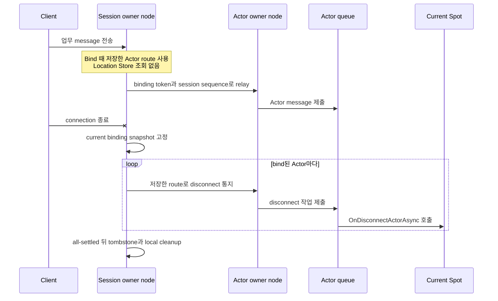
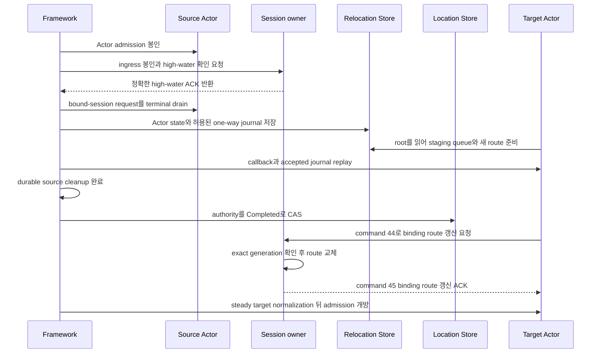

# Session Actor dispatch

[스펙 목차](README.ko.md) · [이전: STREAM 서버 session](19-stream-session.ko.md) · [다음: Location runtime](21-location-runtime.ko.md)


## 1. 이 문서가 정의하는 범위

이 문서는 ZLink Framework 11.0.0에서 STREAM session(연결 하나의 packet 처리와
request correlation을 유지하는 실행 단위)과 Actor runtime을 연결하는
typed dispatch, binding, owner handoff와 실행 순서를 정의한다.

Core raw transport는 Actor identity, 이전 session 작업을 구분하는 binding token,
같은 object incarnation에서 [owner](01-glossary.ko.md#owner)가 바뀐 순서를 나타내는 `AuthorityOwnerGeneration`,
sequence barrier와 Actor route를 해석하지 않는다.

`EnableActorDispatch()`는 `MeshName`을 받지 않고 global object dispatch capability를
활성화한다. Startup은 같은 process에 Object `Client` 또는 `Server` role과 Location
Store가 하나 이상 구성되어 있는지 확인한다.

여러 Mesh가 구성되어 있어도 오류가 아니다. Global ActorId authority가 current
Mesh와 owner를 찾는다. STREAM-only node가 Actor dispatch를 사용하지 않는다면
MeshNode는 필요하지 않다.

Object role이 `None`이거나 Location Store가 없으면 Actor dispatch enablement를 startup에서 거부한다. Hidden
same-process Actor [authority](01-glossary.ko.md#authority)나 local-only binding 의미를 제공하지 않는다.

## 2. Application에 보이는 전체 흐름

Application은 session object, `ActorRef`, typed payload·reply와 bound-session API만
사용한다. Node RID, STREAM transport handle, raw relay envelope, request sequence,
[AuthorityOwnerGeneration](01-glossary.ko.md#authorityownergeneration)과 endpoint를 직접 조립하거나 보관하지 않는다.

1. Session callback이 client를 인증하고 domain Actor identity와 type을 정한다.
2. Global ActorId로 Ready ActorRef를 lookup하거나 application 정책에 따라 Actor를 명시적으로 생성한다.
3. Session과 Actor를 [binding token](01-glossary.ko.md#binding-token)으로 bind한다.
4. Session handler가 typed payload를 current Actor route로 제출한다.
5. Actor handler는 typed reply를 반환하거나 current bound session으로 one-way push를 보낸다.

한 session은 여러 Actor를 동시에 bind할 수 있다. 예를 들어 한 connection이 player
Actor와 party Actor를 함께 사용해도 된다. 반대 방향에는 제한이 있다. Actor 하나는
동시에 session 하나에만 bind할 수 있다. 따라서 session은 Actor별 binding과 route를
각각 보관한다.

| 확인할 질문 | 계약 |
|---|---|
| Session 하나가 bind할 수 있는 Actor 수 | 여러 Actor를 bind할 수 있다. |
| Actor 하나가 동시에 bind할 수 있는 session 수 | 하나다. 새 binding이 확정되면 이전 binding은 무효화한다. |
| Message마다 Actor 위치를 찾는 방법 | Bind 때 확인한 route를 사용한다. Relay할 때 Location Store를 다시 조회하지 않는다. |
| Actor가 다른 node로 이동한 뒤의 route | Relocation commit 뒤 Framework가 session에 보관한 해당 Actor route를 갱신한다. |
| Connection이 끊겼을 때 Actor가 알 수 있는 방법 | Framework가 current binding snapshot의 각 Actor에 자동 통지한다. |

## 3. Inbound dispatch와 reply

STREAM packet은 먼저 session의 typed handler registry로 dispatch된다. Handler가
Actor dispatch를 선택하면 Framework는 다음 값을 internal envelope에 보존한다.

- 원본 request correlation
- Binding token
- Actor `ObjectGeneration`
- `AuthorityOwnerGeneration`
- `OwnerLeaseGeneration`: current owner host process lifecycle을 구분한다.
- Session sequence: 현재 session에서 수락한 message의 순서를 나타낸다.

Payload는 local·remote 여부와 관계없이 target Actor application queue에 직접 추가한다. Current Spot은 authority
검증에 사용하지만 callback 실행 문맥이 아니다. Session callback thread에서 Actor handler를 실행하지 않으며 서로
다른 Actor를 session 또는 [Spot](01-glossary.ko.md#spot) global queue로 직렬화하지 않는다.

Request reply·error는 original STREAM correlation을 terminal-once로 완료한다. Request를
target Actor route에 제출한 뒤 timeout, cancellation 또는 route failure가 발생하면 target이 이미 업무를 실행했는지
확정하지 못할 수 있다. Framework는 이런 실패 뒤 다른 Actor, 새 owner 또는 다른
[MeshNode](01-glossary.ko.md#meshnode)를 선택해 같은 request를 자동으로 다시 보내지 않는다.

Session이 닫힌 뒤 늦게 도착한 reply도 새 session이나 새 binding의 reply로 사용하지
않는다. 서로 다른 session의 request가 같은 업무 결과를 공유하는 것을 막기 위한
경계다.

<a id="4-binding-authority"></a>
## 4. Session이 Actor route를 보관하는 방법

Binding은 다음 값을 연결하는 runtime 관계다.

- Exact `ActorRef`의 `ActorId`와 `ObjectGeneration`
- Current `AuthorityOwnerGeneration`과
  [OwnerLeaseGeneration](01-glossary.ko.md#ownerleasegeneration)
- [STREAM session](01-glossary.ko.md#stream-session) identity
- Binding generation과 token. Binding generation은 같은 session owner lifecycle에서
  binding이 교체된 순서를 구분한다.

한 Actor는 동시에 session binding 하나만 가진다. Session 하나에는 여러 Actor를
bind할 수 있다.

Session owner는 Actor마다 다음 정보를 하나의 binding으로 보관한다.

| 정보 | 사용하는 이유 |
|---|---|
| `ActorId`, `ObjectGeneration` | 같은 ID로 다시 만들어진 다른 Actor에게 보내지 않기 위해 사용한다. |
| `MeshName`, owner `NodeRid` | Bind 이후 relay와 disconnect 통지를 보낼 주소로 사용한다. |
| `NodeGeneration`, `AuthorityOwnerGeneration`, `OwnerLeaseGeneration` | 재시작 전 node나 이전 owner에게 보내지 않기 위해 검증한다. |
| Session owner RID와 lifecycle generation, binding generation과 token | 이전 connection이나 교체된 binding의 늦은 message를 거부한다. |
| Session sequence | 같은 session에서 수락한 message의 순서를 보존한다. |

Bind는 caller가 제출한 `ActorRef`의 위치를 최초 route로 사용해 control request를 한 번 보낸다. Actor와
STREAM session이 서로 다른 MeshNode에 있으면 session owner가
`boundSessionBind(38)` control request를 Actor owner에 보낸다. Actor owner는
Actor `ObjectGeneration`, target `NodeGeneration`(target node process lifecycle을
식별하는 generation)과
`AuthorityOwnerGeneration`을 모두 확인한 뒤
[binding generation](01-glossary.ko.md#binding-generation)을 등록하고 terminal
reply를 한 번만 반환한다.

Session에서 Actor로 들어가는 payload는 등록된 binding generation과
[session sequence](01-glossary.ko.md#session-sequence)를 포함한 `actorSend(24)` record로 Actor owner에 전달한다. Actor가 session에
보내는 push는 `boundSessionSend(36)` record로 session owner에 전달한다. Session
owner는 source Actor `ObjectGeneration`, source `NodeGeneration`,
`AuthorityOwnerGeneration`과 expected binding generation이 모두 current일 때만
실제 STREAM connection에 제출한다.

Source는 bind 전에 Store에서 current route를 미리 조회하지 않는다. Local Actor
instance를 받는 overload도 제공하지 않는다.

Bind가 성공하면 session owner는 검증된 Actor route를 binding에 저장한다. 이후
`RelayAsync(...)`, disconnect 통지와 Actor에서 session으로 보내는 push는 이 binding
정보를 사용한다. Message를 보낼 때마다 Location Store에서 Actor 위치를 조회하지
않는다. 저장한 route가 더 이상 유효하지 않으면 active Message Follow route로 정확히
한 번 전달하거나 typed stale error로 끝낸다. Location Store에서 새 `ActorRef`를 찾아
같은 message를 다른 owner에게 자동으로 다시 보내지 않는다.

저장한 route는 current owner lease와 local admission deadline 안에서만 유효하다.
Location Store가 일시적으로 사용할 수 없더라도 이 lease나 deadline을 연장하지
않는다. 따라서 Store 장애가 난 뒤에도 Framework가 새 route를 추측하거나 이전
binding을 무기한 사용하는 동작은 하지 않는다.

Binding identity는 session owner Node RID, 그 node의 lifecycle generation과
owner-local binding generation을 함께 사용한다. Binding generation의 대소 비교는
같은 session owner lifecycle 안에서만 유효하다. 다른 MeshNode가 bind하거나 session
owner가 재시작하면 owner-local counter가 이전 값보다 작더라도 새로운 lifecycle
identity로 등록할 수 있다.

Rebind는 새 identity를 Actor owner와 session owner 양쪽에 등록한 뒤 이전 identity를
무효화한다. Unbind와 disconnect는 `boundSessionBind(38)`의 tombstone transition으로
정확히 해당하는 이전 identity만 제거한다. 이전 owner lifecycle에서 늦게 도착한
push·ingress·close, 이전 Actor `ObjectGeneration`, 이전 authority owner와 재시작 전
`NodeGeneration`은 current binding이나 connection에 적용하지 않는다. 형식이 잘못된
control 및 one-way record는 application queue에 넣지 않으며 one-way record에는 별도
terminal route를 만들지 않는다.

다른 owner나 다른 Actor generation으로 rebind할 때 새 Actor owner는 새 identity를
등록한 뒤 이전 exact binding route에 tombstone을 제출한다. 이전 owner가 tombstone을
확인한 뒤에만 새 owner가 bind terminal reply를 반환한다. Session owner는 이 reply를
받기 전까지 기존 binding route를 유지하고, reply를 받은 뒤 새 route로 atomic하게
교체한다. Tombstone 제출이 실패하거나 취소되면 새 bind는 terminal 성공이 아니며
Session owner의 기존 binding도 바뀌지 않는다. 같은 owner에서 새 identity가 이전
identity를 이미 atomic하게 대체한 경우에는 이전 identity tombstone이 새 identity를
제거하지 않는다.

Target에 exact Actor가 없고 active committed Message Follow route가 있으면 original bind control request와 reply
route를 해당 route의 target으로 relay한다. Message Follow route가 없거나 만료됐으면 `Unavailable`, 같은 ActorId의
ObjectGeneration이 다르면 `InvalidOperation`, relocation pre-commit seal 중이면 `Unavailable`로 끝난다.
Source는 Store에서 새 route를 찾아 같은 bind를 hidden retry하지 않는다. `BindOrGet`의 Get은 같은 session의
exact ActorId·[ObjectGeneration](01-glossary.ko.md#objectgeneration) binding만 반환하며 다른 generation이나 directory Actor를 반환하지 않는다.

Binding route는 Framework가 관리한다. Application은 별도 Location row, proxy,
session RID나 endpoint를 만들지 않는다.

Bound-session API는 current binding으로 one-way push를 보내거나 connection close를
요청한다. 임의의 session을 지정하는 global proxy는 제공하지 않는다. Disconnect는
binding을 해제하지만 Actor를 destroy하거나 Spot membership을 바꾸지 않는다.

다음 .NET 발췌는 session이 exact `ActorRef`를 bind하고 payload를 Actor queue로
relay하는 공개 표면을 보여준다. 다른 언어에 같은 signature를 요구하지 않으며,
정확한 .NET 계약은
[.NET STREAM session interface](server/languages/dotnet/interfaces/07-stream-session.ko.md)가
정의한다.

```csharp
public interface IZLinkSessionActors
{
    // 이 session에 현재 bind된 Actor를 모두 제공한다.
    IReadOnlyCollection<IZLinkSessionActor> Bound { get; }

    ValueTask<IZLinkSessionActor> BindAsync(
        ActorRef actor,
        CancellationToken cancellationToken = default);
    ValueTask<IZLinkSessionActor> BindOrGetAsync(
        ActorRef actor,
        CancellationToken cancellationToken = default);

    // Global Actor directory가 아니라 현재 session의 binding만 찾는다.
    IZLinkSessionActor? Find(string actorId);
}

public interface IZLinkSessionActor
{
    ActorRef Ref { get; }
    ValueTask RelayAsync(
        ZLinkSessionMessageContext dispatch,
        ZLinkMessage payload,
        CancellationToken cancellationToken = default);
    ValueTask NotifyDisconnectedAsync(
        CancellationToken cancellationToken = default);
}
```

```csharp
var boundActor = await session.Actors
    .BindAsync(actorRef, cancellationToken); // 이 incarnation과 session을 고정한다.

await boundActor.RelayAsync(
    dispatch,
    payload,
    cancellationToken); // 원래 request 정보와 session sequence를 보존해 제출한다.
```

### 4.1 Connection disconnect를 Actor에 알리는 방법

Framework는 physical connection disconnect를 관찰하면 current binding snapshot을
고정하고 각 exact binding identity에 disconnect를 자동 제출한다. Application의
Session disconnect callback은 bound Actor를 순회하지 않는다. Framework는 binding에
보관한 route와 generation을 검증해 통지를 Actor queue로 전달하며 이 과정에서도
Location Store를 조회하지 않는다.

한 Actor의 제출이나 callback이 실패해도 나머지 Actor 통지와 Session cleanup을
계속하는 all-settled 규칙을 사용한다. Automatic 통지와 public
`NotifyDisconnectedAsync(...)` 논리 통지가 경쟁하면 exact binding identity로
dedupe하고 current Spot의 callback은 최대 한 번 실행한다. Automatic 통지는 lifecycle
deadline 안에서 callback terminal을 기다린 뒤 tombstone과 local cleanup을 진행한다.
Deadline 또는 callback failure가 발생해도 나머지 binding cleanup을 계속한다.

Actor가 속한 현재 Entry Spot 또는 User Spot은 이 통지를
`OnDisconnectActorAsync(...)`로 받는다. Public `NotifyDisconnectedAsync(...)`는
physical connection이 유지된 상태에서 application이 선택한 Actor 하나에 같은 logical
notification을 명시적으로 보내는 operation이다. 이 언어 중립 operation을
`NotifyDisconnected`라 하며 `.NET` exact interface에서는
`NotifyDisconnectedAsync(...)`로 표현한다. 두 통지는 connection 종료 사실만 알리며
Actor를 destroy하거나 Spot membership을 변경하지 않는다.



## 5. Actor relocation route barrier

Actor가 다른 MeshNode로 이동해도 physical STREAM connection과 session scope는 session owner process에 유지된다.
Socket, transport handle과 session callback state를 target Actor process로 이동하거나 복제하지 않는다.

Relocation 중에도 session은 Location Store를 조회해 route를 추측하지 않는다. Source와
target이 owner 변경을 commit한 뒤 target이 session owner에 새 route를 전달한다.
Session owner는 exact generation과 high-water를 검증한 뒤 해당 Actor binding의
route만 atomic하게 바꾼다. 같은 Session에 bind된 다른 Actor의 route와 physical
STREAM connection은 바꾸지 않는다. 이 갱신이 relocation에서 수행하는 마지막 binding
route 변경이며, ACK가 끝나기 전에는 target Actor의 session packet·push admission을
열지 않는다.

1. Source Actor seal과 함께 current AuthorityOwnerGeneration, binding generation과 마지막 accepted session sequence를
   barrier에 기록한다.
2. Session owner는 ingress를 reversible하게 seal하고 exact high-water를 ACK한다.
3. Bound-session request는 Captured CAS 전에 terminal drain하며 durable journal에 넣지 않는다.
4. Lease-backed one-way packet만 negotiated boundary 안에서 relocation envelope에 포함할 수 있다.
5. Target은 Relocation Store root를 restore하고 accepted journal을 실행하지 않은 staging queue로 준비한다. 새 route를
   stage하지만 switch·unseal하지 않는다.
6. Owner·membership commit 뒤 lifecycle callback과 accepted journal replay를 완료하고, durable source cleanup과
   Completed authority CAS를 차례로 끝낸다.
7. Target이 command 44로 session route commit을 보내면 Session owner는 exact Actor ObjectGeneration,
   이전·target AuthorityOwnerGeneration, binding generation, session owner lease와 high-water를 검증해 해당
   Actor route만 atomic switch하고 command 45 routed ACK를 보낸다.
8. Maintenance authority를 steady target으로 normalize한 뒤에만 target Actor packet·push admission을 연다.

Route 갱신은 binding이 가리키는 `ObjectGeneration`과 같은 Actor relocation에만
허용한다. 같은 ActorId라도 새 incarnation이 만들어졌다면 Framework가 기존 binding을
그 새 Actor로 바꾸지 않으며, application이 새 `ActorRef`로 명시적인 bind를 시작해야
한다. 같은 Session에 bind된 다른 Actor는 route·token·generation을 유지한다.



이 다이어그램은 relocation commit 뒤 session route를 target Actor로 전환하는 정상
경로다. Physical STREAM connection은 Session owner에 남아 있으며, route 전환 ACK와
steady normalization 전에는 target admission을 열지 않는다.

Activated, Cleaning과 Completed만으로 route나 admission을 열 수 없다. 이전 owner, stale authority owner generation,
binding token과 sequence의 packet·reply·push·close는 current connection에 적용하지 않는다.

## 6. Failure와 recovery

Commit 전 failure는 durable Aborted CAS 뒤 session abort route와 ACK, cleanup, steady source normalization 순서로
source route를 복원한다. Aborted CAS 전 route를 바꾸거나 ingress를 다시 열지 않는다.

Commit 뒤에는 source route로 rollback하지 않는다. Current target 또는 recovery coordinator가 activation,
Completed, route switch ACK와 steady normalization을 이어간다. Session owner process가 종료되면 connection을 다른
process로 복구하지 않고 닫으며 client reconnect가 새 session을 만든다.

Physical disconnect는 accepted participant high-water, request terminal completion 또는 relocation cleanup의 증거가
아니다. Connection-bound work와 bound-session request가 pre-Captured deadline 안에 terminal drain되지 않으면
relocation을 abort하고 `Blocked/DeadlineExceeded`로 admission을 복원한다.

## 7. Execution과 lifecycle

같은 session의 handler turn, binding mutation, close와 relocation barrier는 session owner가 직렬화한다. Actor에
제출한 뒤에는 Actor queue가 순서를 소유한다. Session turn과 Actor turn을 shared lock이나 callback stack으로 합치지
않는다.

Request completion, send-ready, binding update, relocation barrier와 disconnect cleanup은 infrastructure task에서
진행한다. Session 또는 Actor application callback이 비동기 작업을 기다리는 동안에도 진행해야 한다.

Actor owner host의 Relocate는 §5 barrier를 사용한다. Session owner host의 Relocate와 Shutdown은 신규 session·binding을
거부하고 accepted callback·reply·cleanup을 [deadline](01-glossary.ko.md#deadline)까지 처리한 뒤 connection을 닫는다. Physical connection을
다른 process로 이동하지 않는다.

## 8. Startup과 operation error

| Condition | Result |
|---|---|
| Object `Client`·`Server` role이 없다. | Configuration error로 startup에 실패한다. |
| [Location Store](01-glossary.ko.md#location-store)가 없다. | Configuration error로 startup에 실패한다. |
| `ActorRef` 위치가 stale하고 Message Follow route도 없다. | `Unavailable`로 끝난다. |
| `ObjectGeneration`이 다르다. | `InvalidOperation`으로 끝난다. |
| Actor가 relocation pre-commit seal 상태다. | `Unavailable`로 끝난다. |
| 같은 packet key의 handler를 중복 등록했다. | Configuration error로 startup에 실패한다. |
| Actor factory가 없다. | Explicit create error로 끝난다. |
| Current binding 없이 push 또는 close를 요청했다. | Session-not-bound 오류로 끝난다. |
| Actor·owner·binding fence가 stale하다. | Typed stale error로 끝나며 다른 대상으로 fallback하지 않는다. |

## 9. 구현 및 contract test 검증 요구

- Actor dispatch enablement가 MeshName을 받지 않고 global Actor authority를 사용한다.
- Object role 또는 Store가 없으면 startup에서 거부하고 local-only binding을 만들지 않는다.
- Session 하나에 여러 Actor를 bind하고 Actor마다 독립된 route와 binding token을 유지한다.
- Local·remote payload가 Actor queue로 직접 전달되고 Spot callback을 거치지 않는다.
- Bind가 exact ActorRef를 한 번 제출하고 stale route를 hidden Store retry하지 않는다.
- Bind 뒤 relay와 disconnect 통지가 저장한 route를 사용하며 message마다 Location Store를
  조회하지 않는다.
- Physical disconnect 때 Framework가 current binding snapshot 전체에 자동 all-settled 통지하고 current
  Spot의 `OnDisconnectActorAsync(...)`를 exact binding identity마다 최대 한 번 호출한다.
- Rebind 뒤 이전 token과 authority fence가 current binding을 바꾸지 않는다.
- 두 node 사이의 bind, session ingress와 Actor push가 각각 command 38,
  bound-session tail을 포함한 command 24, command 36의 raw ROUTER 경로를
  사용한다.
- Request reply가 original STREAM correlation으로 한 번 완료된다.
- Physical STREAM connection과 session object를 Actor target process로 이동하지 않는다.
- Relocation commit 뒤 session owner의 해당 Actor route가 갱신되며 route 갱신 ACK 전에는
  target session admission을 열지 않는다.
- Bound-session request가 Captured 전에 terminal drain되고 durable journal에 들어가지 않는다.
- Completed route switch ACK와 steady normalization 전 target admission이 닫혀 있다.
- Commit 전 failure는 source route, commit 뒤 failure는 target recovery로 수렴한다.
