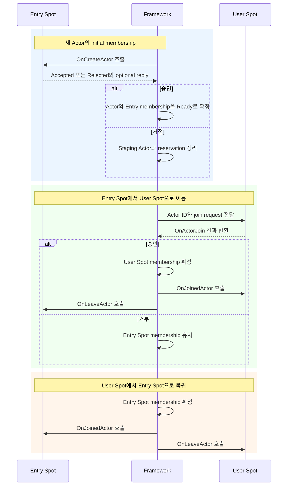
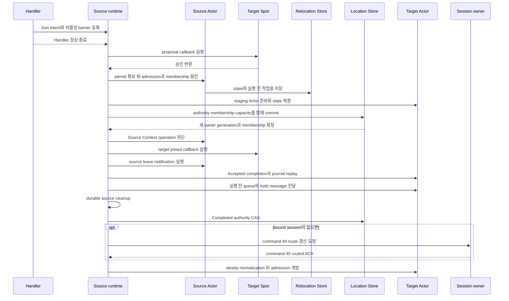

# Spot과 Actor membership

[공통 스펙 목차](README.ko.md) · [Spot 모델](19-spot-model.ko.md) ·
[Actor 모델](22-actor-model.ko.md) ·
[Spot 주소 메시징](24-spot-address-messaging.ko.md) ·
[Session Actor Dispatch](31-session-actor-dispatch.ko.md) ·
[Location runtime](40-location-runtime.ko.md)

이 문서는 ZLink Framework 11.0.0에서 Actor 생성, Spot membership, relocation,
여러 object를 함께 이동하는 aggregate relocation과 recovery를 정의한다.

Core는 raw socket과 transport만 제공한다. Object의 [membership](01-glossary.ko.md#membership), relocation 상태와
lifecycle은 각 언어의 Framework runtime이 관리한다.

## 1. Identity와 authority

ActorId와 Entry·User·Instance Spot ID는 Location Store namespace 전체에서 전역인
logical key다. `MeshName`은 object를 처음 배치할 곳을 정할 때 사용하는 속성이며
authority key에는 포함되지 않는다.

[Location Store](01-glossary.ko.md#location-store)는 각 logical key마다 현재 object를 어느 node가 처리하는지와 Actor가
어느 [Spot](01-glossary.ko.md#spot)에 속하는지를 기록한다. 이 현재 처리 권한과 위치 기록을 authority라
한다. Object가 다른 node로 이동하면 logical key는 그대로 유지하면서 현재 owner
정보만 새 값으로 바꾼다.

`ActorRef`와 `SpotRef`의 `ObjectGeneration`은 0이 아닌 unsigned 63-bit conceptual
value다. 같은 incarnation에서 membership이나 [owner](01-glossary.ko.md#owner) MeshNode가 바뀌어도
`ObjectGeneration`은 유지한다. 대신 provider가 더 큰
`AuthorityOwnerGeneration`을 발급하여 새 owner를 구분한다.

Location Store에 기록하는 authority에는 다음 정보가 들어간다.

| 항목 | 의미 |
|---|---|
| Current owner | 현재 Actor·Spot을 처리하는 owner를 가리킨다. |
| Spot membership | Actor가 현재 속한 Entry Spot 또는 User Spot을 가리킨다. |
| `ObjectGeneration` | 같은 logical identity로 다시 만들어진 incarnation을 구분한다. |
| `AuthorityOwnerGeneration` | 같은 incarnation에서 owner가 바뀔 때 이전 owner의 작업을 구분한다. |
| `StoreVersion` | 읽은 authority와 같은 상태일 때만 CAS를 적용하도록 검증한다. |
| Exact owner lease | Authority에 기록된 owner lifecycle이 아직 유효한지 검증한다. |

Runtime route cache는 [authority](01-glossary.ko.md#authority) row의 snapshot일
뿐이며 cache만으로 current authority를
결정하지 않는다. Join, leave, relocation, destroy와 close는 expected
`StoreVersion`, generation과 [owner lease](01-glossary.ko.md#owner-lease)를 검증하는 transaction만 사용한다.

Object Client 또는 Server role은 Location Store가 필수다. Store가 없으면 startup에서 거부하며 hidden local
Store, runtime-local object manager와 같은 이름의 축소된 의미를 만들지 않는다. Object role이 `None`인 manual
topology는 Node direct와 Channel operation만 사용할 수 있다.

## 2. Object를 하나만 생성하도록 확정하는 과정

여러 node가 같은 Actor나 Spot을 동시에 만들려고 해도 factory는 생성 권한을 얻은
한 곳에서만 시작해야 한다. Framework는 Location Store에 생성할 object와 target
node의 capacity를 함께 예약하여 이 권한을 하나로 확정한다. 이 기록을 placement
reservation이라 한다.

Actor와 User Spot을 manager로 만들 때와 [Instance Spot](01-glossary.ko.md#entry-spot-user-spot과-instance-spot)의 첫 message로 생성할 때는
reservation을 요청하는 위치가 다르다.

| 생성 방식 | Reservation을 요청하는 주체와 시점 |
|---|---|
| Actor·User Spot manager create | Coordinator가 target transport로 요청을 보내기 전에 reservation을 요청한다. |
| Instance Spot direct [cold activation](01-glossary.ko.md#cold-activation) | Source가 최초 message와 생성 정보를 target에 먼저 보낸다. Target에 현재 사용할 수 있는 Spot이 없으면 target이 자신에게 이 Spot을 만들어도 되는지 Location Store에 요청한다. |

두 방식의 공통 결과는 같다. Location Store가 한 target에만 생성 권한을 주고, 다른
target은 별도 [factory](01-glossary.ko.md#factory)를 시작하지 않는다.

Object factory를 등록하고 같은 type인지 비교할 때 사용하는 변경되지 않는 이름을
stable type이라 한다.

Remote User Spot manager create는 reservation 뒤 exact target에 별도 terminal service operation을 보낸다.
이 operation은 source와 target node lifecycle, global Spot key·[stable type](01-glossary.ko.md#stable-type),
provider가 발급한 reservation,
`StoreVersion`과 deadline을 고정한다. Target은 `Reserved` allocation의 `pendingCreation`을 Location Store에서
exact read한 뒤 factory·initialize·Commit을 실행한다. Location row polling이나 application control packet은
terminal result가 아니다.

Remote User Spot close도 exact `SpotRef`, owner generation·`StoreVersion`과 target lifecycle을 가진 별도
terminal service operation이다. Target은 active Actor membership과 relocation 상태를 admission 전에
확인한다.

1. Runtime이 global key, stable type, optional Mesh·placement와 durable creation input을 고정하고 role, type
   capability와 typed population capacity를 만족하는 positive node-wide weight 후보를 선택한다.
2. Actor·User Spot manager create는 coordinator가 `Reserve`를 호출한다. Instance Spot은 source가 first-message
   activation envelope를 후보 target에 먼저 제출하고 target activation registry가 `Reserve`를 호출한다.
3. Store `Reserve`는 object 상태를 `Missing`에서 `Creating`으로 바꾸고 target에서
   해당 object를 만드는 데 필요한 allocation과 typed capacity bundle을 같은
   transaction에서 `Reserved`로 고정한다. Authority의 상태 변경을
   `Missing → Creating` transition이라 한다.
4. 이 예약에 성공한 target만 factory와 initialize를 실행한다. 동시에 요청했지만
   예약에 실패한 target은 같은 object를 별도로 만들지 않는다.
5. 생성 callback이 승인하면 Store terminal `Commit`이 같은 fence를 `Ready`로
   바꾸고 allocation과 typed capacity bundle을 `Reserved → Active`로 전환하면서
   `Created` result를 publish한다.
   Instance Spot은 별도 application 생성 승인이 없으며 envelope에 포함된 first
   message를 activation barrier 뒤 local queue에 한 번 제출한다.
6. 생성 callback이 거절하면 같은 terminal `Commit`이 Ready와 active capacity를
   만들지 않고 Creating authority와 reserved allocation·typed capacity bundle을 정리하면서 `Rejected`
   result를 publish한다.
7. Node 종료, timeout 또는 callback exception에서는 `Abort`가 exact Creating
   authority와 `Reserved` allocation·typed capacity bundle을 정리하고 `Aborted`
   failure를 publish한다.

Reservation에는 어떤 object를 어느 target에 만들 것인지, 필요한 capacity와 현재
owner를 검증할 정보가 들어간다. 정확히는 object kind, global key, stable type,
target descriptor, typed capacity bundle, exact owner lease와 `StoreVersion`을
고정한다. 고정 만료 시간인 TTL로 생성 권한을 판단하지 않는다. Store에 기록한
`Creating` 상태와 target owner lease를 함께 확인하여 생성 복구, 다른 target의
인계와 취소 여부를 결정한다. Actor와 Spot은 이 공통 reservation operation을 함께
사용한다.

Encoded creation request는 최대 1 MiB다. Framework는 reservation 전에 변경할 수
없는 content reference와 hash를 creation intent에 기록하고, object가 Ready가 되거나
실패한 생성을 정리할 때까지 유지한다. 생성 권한을 얻은 target만 이 request를
factory에 전달한다. Factory와 initialize는 `(logical key, ObjectGeneration,
attempt)` 기준으로 한 번 이상 실행될 수 있으므로 같은 입력의 재실행을 안전하게
처리해야 한다.

Actor factory가 만든 staging instance는 Entry Spot의 `OnCreateActor`에 전달한다. Callback은 승인 여부와
optional reply를 반환한다. 승인하면 initial Entry membership·Ready authority·active capacity와
`Created` terminal record를 함께 공개한다. 거절하면 Ready와 message admission을 열지 않고 Creating
authority·pending capacity를 정리하면서 `Rejected` terminal record를 공개한다. Callback exception은
application rejection이 아니라 기존 typed creation failure다.

동시에 요청했지만 생성 권한을 얻지 못한 caller는 다른 factory를 시작하지 않는다.
서로 다른 operation은 authority 변경을 기다린다. Authority가 Ready가 되면 `Existing`을
받고, callback rejection·failure cleanup으로 Missing이 되면 새 reservation을 경쟁하여
자신의 creation request를 처리한다. 앞선 operation의 `Rejected` state나 application
reply는 공유하지 않는다.
Terminal call의 deadline 하나가 resolve, 대기, reservation, factory와
[Ready](01-glossary.ko.md#ready) 준비 전체에 적용된다. [Deadline](01-glossary.ko.md#deadline)이 끝나면
`DeadlineExceeded`다. 다음 call은 Store의 현재 authority를 다시 확인하여 중단된
attempt를 정리하거나 이어간다. `Missing`, `Creating`과 Store failure는 negative
cache에 저장하지 않는다.

동일한 ActorId에 여러 process가 동시에 `GetOrCreate`를 호출하면 Location Store의
reservation CAS winner만 factory와 `OnCreateActor`를 실행한다. 같은 Actor가
Creating이면 다른 caller는 새 reservation을 만들지 않고 authority 변경을 기다린다.

```text
Missing
  → Reserved(R1)
      ├─ Created(R1, ActorRef, ReplyRef?)
      ├─ Rejected(R1, ReplyRef?)
      └─ Aborted(R1, Failure)
```

`Created`와 `Rejected`는 reservation winner operation의 정상
[terminal result](01-glossary.ko.md#creation-terminal-result)다. Callback exception은
`Failed`, recovery cleanup은 terminal record를 만들지 않는 `Abort`다. `Existing`은
Ready Actor를 찾은 다른 operation의 조회 결과이며 새 reservation이나 callback을 만들지 않는다.

Created terminal publish는 Ready authority와 active capacity 전환을 함께 수행한다.
Rejected terminal publish는 Ready authority와 active capacity를 만들지 않고 Creating
authority와 reserved capacity를 정리한다. Terminal record는 exact source Node
RID·lifecycle generation·`OperationId`로 식별하며 같은 operation의 재전송에만 사용한다.
Request correlation과 reply route가 없는 `creation-operation-terminal-v1` semantic
envelope와 SHA-256을 original deadline 뒤 5분까지 보존한다. Framework는 재전송 시
현재 request의 correlation과 reply route로 새 command reply를 encode한다.

Entry Spot은 startup initialization을 마치기 전 descriptor와 resolver에 publish하지 않는다. Actor creation은
initial Entry Spot membership과 Ready barrier를 같은 lifecycle에서 완료하며 `OnActorJoin`과
`OnJoinedActor`를 호출하지 않는다.

## 3. Entry Spot과 User Spot의 Actor membership

세 Spot 종류의 생성 방식과 기능 차이, Entry Spot의 전체 역할은
[19 Spot 모델](19-spot-model.ko.md)이 정의한다. 이 절은 Entry·User Spot이 Actor
membership을 처리하는 순서만 정의한다.

Entry Spot의 Actor는 Actor별 execution gate를 사용한다. User Spot의 기본
`SpotWide` mode에서는 Spot handler, member Actor handler, timer와 lifecycle
callback이 User Spot 공통 execution gate를 사용한다. Factory 등록에서
`PerActor`를 선택하면 Actor별 gate, Spot lane과 timer별 gate를 구분하며 서로
다른 gate는 동시에 실행할 수 있다.

Actor를 만들면 selected owner [MeshNode](01-glossary.ko.md#meshnode)의 Entry Spot이 initial membership을 처리한다. Actor 업무 message는
Actor queue로 직접 전달하며 Entry Spot이나 User Spot callback을 경유하지 않는다.

Actor payload를 Actor queue에 넣는 위치와 handler 실행 권한을 결정하는 gate는
서로 다른 계약이다. `Yield`는 shared gate를 사용하는 `SpotWide` User Spot에서만
허용한다. Entry Spot Actor와 `PerActor` User Spot에서는 현재 turn을 유지하는
`Async`만 사용한다.

Actor Join call은 execution mode와 관계없이 동기 `Defer()`만 제공한다. 현재 handler에서는 intent와
barrier registration만 완료하고 handler의 마지막 continuation이 정상적으로 끝난 뒤 Join을 실행한다.
Join에는 `Async`·`await`·`submit`과 `Yield`를 제공하지 않는다. Request나 worker의 `Yield`와 달리
`Defer()`는 Spot gate와 Actor queue claim을 반납하지 않는다.

한 handler는 Join을 최대 64개까지 등록할 수 있다. Join request 하나는 encoded
최대 1 MiB이고, 같은 handler가 등록한 모든 Join request의 합계는 최대 8 MiB다.
제한을 넘긴 현재 registration은 일부 record를 남기지 않고 동기
`InvalidConfiguration`으로 실패한다.

Timeout을 생략하면 5초를 사용한다. 명시 값은 millisecond로 올림한
`1..INT_MAX` 범위의 유한한 값이어야 한다. Framework는 `Defer()`를 호출한 시점에
monotonic clock으로 absolute deadline을 한 번 계산한다. 따라서 handler가
`Defer()` 뒤에 계속 실행한 시간도 Join timeout에 포함된다.

User Spot은 join proposal, joined, leave와 disconnected lifecycle control을 해당 Spot control queue에서
직렬화한다. 같은 Spot의 packet·timer turn과 callback 순서는 Spot turn이 정한다. Instance Spot은 Actor
membership target이 아니다.

Actor disconnected callback은 physical Session disconnect의 current binding snapshot 또는 public
`NotifyDisconnected`의 명시적 logical notification에서 실행된다. Framework는 exact binding identity마다
최대 한 번 실행하며 Actor destroy, leave 또는 membership 변경으로 해석하지 않는다. 한 Actor callback
failure는 다른 binding 통지와 Session cleanup을 막지 않는다.

일반 User Spot Close는 current Actor membership이 하나라도 있으면 public `false`로 끝나고 admission과
authority를 유지한다. Caller가 명시적 leave 또는 destroy를 끝낸 뒤에만 close할 수 있다. Framework는 Actor를
숨겨서 이동하거나 파괴하지 않는다.

## 4. Actor join과 commit 순서

`JoinSpot`은 global Spot ID를 받는다. `JoinEntrySpot`은 target node RID를 받지
않는다. Framework가 target Spot 또는 조건을 만족하는 Entry Spot을 찾는다. Actor와
target Spot의 owner node가 다르면 같은 join operation 안에서 Actor relocation까지
수행한다.

Application은 relocation phase, target node, state adapter나 owner token을 별도로
지정하지 않는다.

다음 C# 발췌는 공통 join 동작을 이해하기 위한 .NET 표현이다. 다른 언어에 같은
signature를 요구하지 않으며, 정확한 전체 계약은
[.NET Actor interface](server/languages/dotnet/interfaces/06-actors.ko.md)가
정의한다.

```csharp
public interface IZLinkActorContext
{
    IZLinkActorJoinSpotCall JoinSpot(
        string spotId,
        ZLinkMessage request);

    IZLinkActorJoinEntrySpotCall JoinEntrySpot(
        ZLinkMessage request);
}

public interface IZLinkActorJoinSpotCall : IZLinkActorJoinCall
{
    IZLinkActorJoinSpotCall Timeout(TimeSpan timeout);
}

public interface IZLinkActorJoinCall
{
    void Defer();
}
```

Actor handler에서 특정 User Spot에 join하는 최소 예시는 다음과 같다. Application은
[Spot ID](01-glossary.ko.md#spot-id)와 join 판단에 필요한 request만 지정한다. Framework가 current owner를
찾고, 다른 node에 있으면 같은 operation 안에서 relocation을 수행한다.

```csharp
Context
    .JoinSpot(targetSpotId, ZLinkMessage.From(joinRequest))
    .Timeout(TimeSpan.FromSeconds(5)) // Join과 필요한 relocation 전체에 적용한다.
    .Defer(); // 현재 handler가 정상 종료한 뒤 실행할 Join을 등록한다.
```

Join request는 선택 사항이다. 생략하면 target proposal callback에 empty request를
전달한다. `Defer()`는 request의 immutable snapshot과 absolute deadline을 고정한다. 이 request는 join을 승인할지 판단할 때만 사용하며 relocation state
payload로 재사용하지 않는다.

`Defer()`는 현재 handler의 registration scope가 열려 있을 때만 호출할 수 있다.
Framework가 추적하는 awaited continuation은 같은 scope를 사용한다. Handler가
종료되어 scope가 닫힌 뒤 호출하면 `InvalidConfiguration`이다. Handler에서 시작한
작업을 기다리지 않고 background에서 계속 실행하는 detached task의 호출은
application contract 위반이다. Framework는 모든 언어에서 detached task를 scope가
닫히기 전에 식별한다고 보장하지 않는다.

Handler가 정상적으로 끝나면 등록한 barrier를 모두 활성화한다. Handler가 exception,
cancellation 또는 request reply encoding 실패로 끝나면 모두 폐기한다. Reply
encoding이 끝난 뒤 caller가 연결을 종료했거나 transport가 reply를 수락하지 못한
경우에는 Join을 취소하지 않는다.

Join 결과는 0이 아닌 128-bit `OperationId`와 함께 Actor completion callback으로 전달한다. `Accepted`는
target Actor, `Rejected`와 commit 전 `Failed`는 source Actor가 받는다. Commit 뒤 recovery는 source로
rollback하지 않고 target을 복구한 뒤 같은 `OperationId`의 `Accepted`를 전달한다. Target joined callback,
source leave notification과 durable cleanup이 끝나기 전에 completion과 뒤 application payload를 실행하지
않는다.

Same-node Join은 membership commit만 durable하며 completion, `OperationId`, optional reply와 retry cursor는
current process lifetime까지만 유지한다. Cross-node Join은 Location authority가 published Relocation manifest
reference를 가리킨 Accepted에만 durable at-least-once completion을 보장하고 manifest가 `OperationId`,
optional reply와 completion cursor를 보존한다. Rejected와 commit 전 Failed는 source process lifetime을 넘는
completion replay를 보장하지 않는다.

`OperationId`는 application completion callback이 재시도된 결과인지 구분하는
idempotency ID다. Relocation 전체를 식별하는 `RelocationId`, placement reservation
ID나 여러 Store 항목을 함께 확정하는 aggregate commit ID와 같은 값으로 사용하지
않는다. Cross-node Accepted의 Relocation manifest에는 별도 field로 저장한다.

| Completion outcome | Callback을 실행하는 Actor | Application이 받는 정보 |
|---|---|---|
| `Accepted` | 위치 변경을 commit한 target Actor가 받는다. Same-target no-op에서는 현재 Actor가 받는다. | Current `ActorRef`와 target admission callback이 반환한 optional reply를 받는다. |
| `Rejected` | 기존 source Actor가 받는다. | Target admission callback이 반환한 optional reply를 받는다. |
| `Failed` | Commit 전에는 source Actor가 받는다. Commit 뒤 recovery에서는 target Actor가 받지만 확정된 `Accepted`를 `Failed`로 바꾸지 않는다. | Typed Framework error kind와 다시 시도할 수 있는지 여부를 받는다. |

`Failed`가 전달하는 error kind는 실패 지점을 다음과 같이 구분한다. Target
`OnActorJoin`이 정상적으로 거절한 결과는 `Failed`가 아니라 `Rejected`다.

| 실패한 지점 | `Failed.Kind` |
|---|---|
| 요청한 User Spot을 찾을 수 없다. | `SpotRouteNotFound` |
| 이동할 수 있는 Entry Spot이나 호환 target node가 없다. | `RelocationTargetUnavailable` |
| Target node의 수용 가능량이 부족하다. | `PlacementCapacityExhausted` |
| Actor의 relocation policy가 cross-node 이동을 금지한다. | `RelocationDisabled` |
| Deadline까지 위치 변경을 commit하지 못한다. | `DeadlineExceeded` |
| Admission callback이 exception으로 끝나거나 capture·factory·restore·staging이 실패한다. | `RelocationFailed` |
| Durable relocation payload가 없거나 검증에 실패한다. | `RelocationDataLost` |
| Actor generation, owner 또는 membership fence가 현재 값과 다르다. | `ActorGenerationStale`, `ActorLocationStale` 또는 `ActorMoving` |
| Runtime shutdown이 먼저 시작되어 commit 전에 중단한다. | `RuntimeShutdown` |

`Accepted`는 위치와 membership 변경이 commit되었다는 뜻이며 completion callback
실행까지 끝났다는 뜻은 아니다. Framework는 lifecycle callback과 source membership
cleanup 뒤 completion callback을 먼저 실행한다. Completion이 계속 실패하면 Actor를
sealed 상태로 유지하고 barrier 뒤의 일반 message를 실행하지 않는다.

Same-node join은 relocation이 아니므로 relocation policy가 `Disabled`여도 허용한다.

Actor가 이미 요청한 User Spot에 속해 있거나 Entry Spot Actor가 다시
`JoinEntrySpot`을 호출하면 Framework는 실제 이동 없이 `Accepted` completion을
제출한다. Location Store, membership과 capacity를 변경하지 않으며
`OnActorJoin`, `OnJoinedActor`와 `OnLeaveActor`도 호출하지 않는다.

Join과 host maintenance가 동시에 시작되면 먼저 seal하거나 claim한 작업을 따른다.
Join claim이 `Retire`보다 먼저면 maintenance는 Join이 terminal 상태가 될 때까지
기다린다. `Retire` seal이 먼저면 Join은 `ActorMoving`, shutdown admission seal이
먼저면 `RuntimeShutdown`으로 끝난다.

같은 handler가 barrier를 등록한 Actor에 request를 보내고 reply를 기다리면
request와 handler가 서로 기다릴 수 있다. Framework는 이 request를 queue에
제출하기 전에 `InvalidConfiguration`으로 거부한다.

### 4.1 Entry Spot과 User Spot의 callback 비교

Entry Spot과 User Spot은 서로 다른 Spot instance다. 두 Spot은 commit 뒤 membership notification을
공유하지만 admission callback은 User Spot만 제공한다. Callback은 Actor가 들어가는 target Spot과
Actor가 빠져나가는 source Spot에서 각각 실행한다.

새 Actor를 처음 Entry Spot에 배치할 때는 Entry Spot의 `OnCreateActor`를 사용한다.
Entry Spot에서 User Spot으로 이동할 때는 target User Spot의 `OnActorJoin`으로 admission을 결정한다.
User Spot에서 Entry Spot으로 복귀할 때는 admission 없이 membership을 commit한다. 두 일반 이동은 commit 뒤
target의 `OnJoinedActor`와 source의 `OnLeaveActor`를 사용한다.



따라서 User Spot에서 Entry Spot으로 돌아가는 Actor는 새 Actor가 아니다. Target
Entry Spot에서 `OnCreateActor`와 `OnActorJoin`을 호출하지 않고 `OnJoinedActor`만 실행하며,
source User Spot에서 `OnLeaveActor`를 실행한다.

### 4.2 Cross-node join 상세 흐름

Cross-node join은 다음 순서를 지킨다.

1. Target이 User Spot이면 proposal callback이 Actor identity와 join request를 검증해 accept 또는 reject를
   반환한다. Target이 Entry Spot이면 기본 membership 복귀이므로 proposal callback을 호출하지 않는다.
2. Actor factory에 고정한 shared relocation policy와 target capability·capacity를 preflight한다.
3. Source는 relocation을 시작할 실행 권한과 예상 저장 공간을 기다리지 않고 한 번
   확인한다. 모두 확보한 경우에만 새 Actor message 수락과 기존 membership 변경을
   임시로 막는다. 확보하지 못하면 기존 Actor 처리를 계속한다.
4. `Snapshot`이면 Actor relocation adapter의 `Capture`로 application state를 얻는다. Seal 시점에 실행하지 않은
   message queue, accepted journal, timer logical registration·pending tick과 Framework metadata를 함께
   Relocation Store에 고정한다. `Recreate`이면 adapter를 호출하지 않고 application state 없이 boundary를
   고정한다. `Disabled`이면 `Capture` 전에 거부한다.
5. Target에 필요한 capacity를 예약하고 아직 application message를 받지 않는 새
   Actor를 준비한다. `Snapshot`이면 target factory가 만든 Actor에 같은 adapter의
   `Restore`를 호출한다. 이미 수락했지만 실행하지 않은 작업은 handler를 실행하지
   않은 채 검증하여 target queue에 준비한다.
6. Actor authority, source·target membership, capacity와 aggregate generation을
   제한된 하나의 transaction으로 함께 전환한다. 이 전환을 bounded aggregate
   commit이라 한다.
7. Target joined callback과 source leave notification을 실행한다. 그다음 target
   Actor에서 `Accepted` completion callback과 accepted journal을 barrier 뒤 일반
   message보다 먼저 replay한다. Framework는 logical timer를 복원하지만 target
   application admission은 계속 닫아 둔다.
8. 실행 전 queue와 source ingress hold를 target으로 옮기고 old Entry membership과
   남은 source resource의 durable cleanup을 끝낸 뒤 Completed authority CAS를 수행한다.
9. 이동한 Actor가 Session에 bind되어 있으면 Session owner가 보관한 해당 Actor의 현재
   전달 경로인 binding route만 target owner로 갱신해 달라고 요청하고 확인을 받는다(`command 44·45`). 같은
   Session의 다른 Actor route와 physical STREAM connection은 유지한다. Steady target
   normalization 뒤 target packet·push admission을 연다. 후처리 완료를 표시하기 위해
   Location Store의 같은 aggregate를 두 번째로 commit하지 않는다.



이 다이어그램은 cross-node join이 commit까지 성공하는 정상 경로만 보여준다. Proposal
reject나 commit 전 failure가 발생하면 target staging을 폐기하고 source 상태를
복원하며, commit 뒤 failure에서는 source로 rollback하지 않는다.

Commit 전 reject, timeout, `Capture`·`Restore` failure와 aggregate commit conflict는
target staging을 폐기하고 source owner, state와 membership을 유지한다. Commit
뒤에는 source로 rollback하지 않고 확정된 위치정보와 durable capture에서 target
recovery를 계속한다. [ObjectGeneration](01-glossary.ko.md#objectgeneration)은 유지하고
cross-node에서 owner가 바뀌므로 `AuthorityOwnerGeneration`만 증가한다. Target
Context는 유지한 `ObjectGeneration`과 새 owner generation에 결합한다. Source
Context는 bounded aggregate commit이 성공한 뒤 operation을 수행할 수 없도록
fence한다.

`Defer()` 뒤 source seal 전에 도착한 message는 barrier 뒤 Actor queue에 둔다.
Cross-node 이동에서는 이 queue를 실행 전 queue와 함께 target으로 옮긴다. Source
seal 뒤 도착한 message만 크기가 제한된 ingress hold에 보관한다. Commit 전
abort에서는 hold를 source queue에 arrival order로 되돌리고, commit 뒤에는 original
operation identity와 `ObjectGeneration`을 보존해 target으로 전달한다.

Application이 요청한 User Spot join은 target admission callback, commit 뒤 target joined와 source leave
notification을 사용한다. User Spot에서 Entry Spot으로 복귀하면 target admission callback 없이 commit하고
target Entry Spot의 joined와 source User Spot의 leave notification을 호출한다. 두 일반 join 모두 물리적으로
Actor를 복원했다는 이유로 maintenance 전용 `OnActorRelocated` callback을 추가로 호출하지 않는다.

Entry Spot 자체는 relocation participant가 아니다. Host `Retire`로 source Entry Spot의 Actor가 target node의
Entry Spot으로 이동하면 Framework는 target Actor의 `Restore`를 끝내고 owner·membership을 commit한 뒤
target Entry Spot의 `OnActorRelocated` callback과 source Entry Spot의 `OnLeaveActor` callback을 호출한다. 두 callback이
완료될 때까지 target Actor dispatch를 열지 않는다. 어느 callback이 실패해도 commit을 되돌리지 않고 current
relocation fence에서 재시도한다. Source process가 종료되면 durable source cleanup이 source callback 완료를 대신해
target recovery가 계속된다. 정확한 callback 이름과 비동기 표현은 언어별 exact interface가 정한다.

Spot의 terminal lifecycle callback은 `OnClosing(ClosingContext)`이다. Actor는 항상 Entry
또는 User Spot에 속하므로 Actor별 closing callback을 제공하지 않는다. `ClosingContext`는 다음 닫힌 reason과
operation의 absolute deadline을 제공한다.

| 값 | Reason | 호출 조건 |
|---:|---|---|
| 0 | `ExplicitClose` | Application이 User·Instance Spot의 close를 시작하여 해당 local instance를 정상적으로 정리한다. |
| 1 | `HostShutdown` | Relocation 없이 host `Shutdown`이 local Entry·User·Instance Spot을 정리한다. |
| 2 | `RelocationOut` | User·Instance Spot owner commit 뒤 source local instance를 정리한다. |

Standalone Actor 이동은 Entry Spot 자체를 닫지 않으므로 Entry Spot의 `OnClosing`을 호출하지 않는다. 기존 target
`OnActorRelocated`와 source `OnLeaveActor`만 사용한다. User Spot에 Actor membership이 남아 explicit close가 거부되면
`OnClosing`을 호출하지 않는다. Host `Shutdown`에서는 accepted handler와 timer turn을 terminal 상태로 만든 뒤,
Actor membership과 local instance가 아직 유효한 상태에서 Spot `OnClosing`을 호출한다. Callback 완료 뒤 Actor·Spot
scope를 dispose하고 Location authority와 resource를 정리한다.

언어 runtime에 표준 cooperative cancellation 표현이 있으면 callback에 남은 cleanup budget을 함께 전달할 수
있다. Spot closing만을 위한 별도 Framework cancellation 타입을 만들지는 않는다. 표준 표현이 없는 언어에서는 `ClosingContext`의
deadline만 전달하고 Framework가 deadline에 callback completion 대기를 끝낸다. Application은 callback 이후
context와 cancellation signal을 보관하지 않는다. `HostShutdown`은 callback failure로 relocation나 rollback을
시작하지 않는다. Callback exception은 `ForceStopped/TeardownFailed`, deadline 만료는
`ForceStopped/DeadlineExceeded`로 끝난다. Process crash와 `SIGKILL`에서는 callback 실행을 보장하지 않는다.
정확한 enum, context와 표준 cancellation 표현은 언어별 exact interface가 정한다.

## 5. 모든 이동 경로가 공유하는 relocation policy

Actor·User Spot·Instance Spot의 [Object Server](01-glossary.ko.md#object-role) factory는 다음 policy 중 하나를 반드시 등록한다.

| Policy | 의미 |
|---|---|
| `Disabled` | Cross-node relocation을 capture 전에 거부하고 source owner와 admission을 유지한다. |
| `Recreate` | Target factory를 실행하고 Framework queue·timer 정보는 유지하지만 application state payload는 전달하지 않는다. 새 application 객체를 만들더라도 같은 logical incarnation이므로 `ObjectGeneration`을 유지한다. |
| `Snapshot` | Handler가 정상적으로 끝난 경계의 application state를 object 종류에 맞는 relocation adapter로 opaque byte sequence에 capture하고 target에 복원한다. Framework queue·timer 정보도 함께 유지한다. |

Actor는 `ActorRelocationAdapter`, User·Instance Spot은 `SpotRelocationAdapter`를 사용한다. 두 adapter의
operation 이름은 `Capture`와 `Restore`다. `Capture`는 source instance를 받아 byte sequence를 반환하고,
`Restore`는 target factory가 만든 instance와 byte sequence를 받아 상태를 적용한다. Instance를
반환하지 않는다.

Application은 byte format, version, compatibility와 migration을 관리한다. Framework는 state contract ID,
generic state type, serialization profile과 message codec을 relocation adapter 계약에 추가하지 않는다. Relocation
Store에는 application bytes를 그대로 opaque payload로 저장하고 Framework root manifest·chunk·checksum만
Framework가 검증한다.

`Capture`가 한 participant에 대해 반환하는 byte sequence는 최대 64 MiB다. 빈 byte sequence는 유효한
application state이고 null result는 adapter contract 위반이다. Callback이 성공하면 Framework가 결과를 즉시
복사하거나 소유권을 넘겨받으므로 application은 그 뒤 결과를 바꾸지 않는다. `Restore`에 전달한 bytes는 callback이
완료될 때까지만 유효하고 callback이 보관하려면 직접 복사해야 한다.

Join과 host maintenance는 같은 factory policy와 adapter registration을 사용한다. `Snapshot` Actor가 다른
node의 User Spot·Entry Spot으로 join하거나 maintenance로 이동할 때 Actor adapter를 호출한다.
User Spot aggregate relocation에서는 `Snapshot`으로 등록한 Spot과 각 member Actor의 adapter를 각각
호출한다. Same-node join, `Disabled` 거부와 `Recreate` relocation에서는 adapter를 호출하지
않는다. Operation별 policy, 생략 overload와 별도 adapter registry를 제공하지 않는다.
Policy와 adapter registration은 startup 뒤 바뀌지 않는다.

## 6. User Spot과 member Actor를 함께 이동하는 maintenance aggregate

Host `Retire`가 User Spot을 이전할 때는 해당 Spot과 seal 시점의 current member
Actor 전체를 하나의 aggregate로 처리한다. Application은 aggregate에 포함할
participant나 relocation phase를 선택하지 않는다.

Host가 `Retiring`으로 전환되면 Framework는 aggregate의 Spot control queue에 infrastructure intent notification을
예약한다. 이 notification은 application callback이 아니다. Notification을 처리한 turn 경계에서 permit을 얻지 못하면
seal하지 않고 다음 notification을 예약하므로 Spot과 member Actor는 application message와 timer를 계속 처리한다.

Aggregate ID는 non-zero 128-bit value다. Aggregate record는 최대 1024 participants와 encoded 최대 1 MiB이며
각 participant의 object kind, global key, ObjectGeneration, owner fence와 policy를 보존한다.

1. Spot queue turn 경계에서 aggregate의 active unit, callback과 예상 payload byte permit을 모두 얻은 뒤 source
   User Spot의 join·leave와 모든 participant admission을 reversible하게 seal한다.
2. Exact participant inventory를 aggregate record에 고정한다.
3. 모든 policy, target type·[Snapshot](01-glossary.ko.md#relocation-policy) adapter capability와 active·pending capacity를 preflight한다.
4. `Snapshot` participant의 모든 state, 실행하지 않은 message queue, accepted journal과 timer logical
   registration·pending tick을 capture하고 target reservation·factory·restore를 admission이 닫힌 상태로 준비한다.
5. Generic Store transaction이 Spot owner, 모든 Actor owner와 membership visibility를 하나의 commit generation으로
   전환한다.
6. Authority commit 뒤 target lifecycle callback, accepted message·journal replay와 Framework timer 자동
   복원을 끝낸다. Durable source cleanup과 Completed authority CAS 뒤 aggregate에 포함된 bound Actor마다
   Session owner에 해당 route를 target으로 바꿔 달라고 요청하고 확인을 받는다(`command 44·45`). 같은 Session의 aggregate 밖 Actor
   route와 physical STREAM connection은 유지한다. 모든 routed ACK와 steady normalization 뒤 전체
   packet·push admission을 연다.

4번의 restore는 5번 aggregate commit 전에 끝나야 한다. User Spot aggregate는 logical membership을 그대로
이동하므로 target에서 `OnJoinedActor`·`OnActorRelocated`를 호출하거나 source에서 `OnLeaveActor`를 호출하지
않는다. Spot·Actor adapter의 restore와 Spot lifecycle callback만 target admission 전에 끝낸다.

Commit 전 individual owner update는 resolver에 보이지 않는다. Participant 하나라도 commit 전에 실패하면
target staging을 폐기하고 aggregate 전체 source 상태를 유지한다. Commit 뒤에는 일부 participant만 source로
되돌리지 않고 같은 aggregate identity와 relocation root로 전체 target recovery를 계속한다.

## 7. 실패와 recovery

Commit 전 failure는 durable abort, route abort ACK, relocation root·reservation cleanup과 source normalization 뒤
source admission을 연다. Commit 뒤에는 source route로 rollback하지 않는다. Recovery coordinator가 durable
authority와 Relocation Store root에서 target activation을 이어가며 failed target replacement는 새 attempt와 reservation만
발급한다.

Factory, `Capture`, `Restore`와 lifecycle callback은 attempt 사이에서 at-least-once로 실행될 수 있다. Stale attempt는
completion, admission과 cleanup을 commit할 수 없다. Process pause 뒤 재개한 이전 owner도 stale
[AuthorityOwnerGeneration](01-glossary.ko.md#authorityownergeneration), owner lease와 local admission deadline 때문에 message, timer, phase update와 cleanup을
수행하지 못한다.

`Capture`가 예외나 rejected task로 끝나면 Framework는 relocation root를 publish하지 않는다. Durable `Aborted` CAS,
route abort ACK, cleanup과 steady source normalization을 완료한 뒤에만 source seal을 해제한다. `Restore`가 실패하면
해당 staging instance를 폐기한다. 같은 immutable payload를 다시 적용할 때도 factory가 새 instance를 만들며,
부분적으로 변경된 instance를 재사용하지 않는다. Deadline과 policy가 허용하면 다른 target attempt를 시작한다.
Final owner·membership commit 전에 모든 target이 실패하면 source를 유지하고 `StateIncompatible`로 끝낸다.
Framework가 operation deadline 때문에 callback을 취소하면 `DeadlineExceeded`를 사용하며 cancellation 자체를
state format 오류로 바꾸지 않는다.

Final commit 뒤 lifecycle callback failure는 source rollback 조건이 아니다. Target admission을 닫은 상태로
current authority fence에서 callback을 재시도한다. Adapter와 lifecycle callback은 같은 object generation에
대해 두 번 이상 호출되어도 수렴해야 하며 exactly-once external side effect를 가정하면 안 된다.

## 8. Route forwarding

Commit 뒤 source는 `RelocationForwardingWindow` 안에서 committed source→target mapping만 사용해 stale route를
relay한다. Relay는 Store를 읽거나 application handler를 실행하지 않으며 original operation ID, generation,
payload와 reply route를 보존한다.

Mapping은 global key, ObjectGeneration, source·target AuthorityOwnerGeneration과 [owner fence](01-glossary.ko.md#owner-fence)를 exact 검증한다.
Owner generation은 hop마다 증가하며 최대 8 hops다. Mapping 하나의 queue는 1024 messages와 16 MiB 이하이고
negotiated message bound도 지킨다. Window 만료, mapping 없음, generation mismatch, loop 또는 bound 초과는
stale-route error다. Framework는 failed operation을 fresh owner에게 hidden retry하지 않는다.

User Spot aggregate의 Spot과 member Actor forwarding mapping은 같은 commit generation에서 설치한다.

## 9. Bound session

Actor가 이동해도 physical STREAM connection, session identity와 ObjectGeneration은
유지된다. Owner·membership commit 뒤 callback·journal replay와 durable source
cleanup을 끝내고 Completed authority CAS를 수행한다. 그 뒤 Session owner는
[binding token](01-glossary.ko.md#binding-token), AuthorityOwnerGeneration과 sequence
barrier를 검증해 해당 Actor의 [binding route](01-glossary.ko.md#binding-route)만 target owner로
바꿔 달라고 요청하고 확인을 받는다(`command 44·45`). 한 Session에 Actor가 여러 개 bind되어 있어도 이동하지 않은
Actor의 route는 바꾸지 않는다.

Target은 steady normalization 전에는 session packet·push admission을 열지 않는다.
이전 owner generation, binding token과 sequence의 packet, reply, push와 close는
current binding에 적용하지 않는다. Route update는 bound ObjectGeneration이 같은
relocation에만 허용하며 같은 ActorId의 새 incarnation은 explicit bind가 필요하다.

## 10. 구현 및 contract test 검증 요구

- Object role이 Store 없이 startup하지 않고 hidden local manager를 만들지 않는다.
- Creation reservation이 global key authority와 pending capacity를 atomic하게 고정한다.
- 동시에 같은 Actor 생성을 요청해도 reservation CAS winner만 factory와 creation
  callback을 실행하며 loser는 authority 변경을 기다린다.
- 서로 다른 operation은 Ready 뒤 `Existing`을 받고 cleanup 뒤 새 reservation을
  경쟁하며, 같은 source lifecycle·`OperationId`의 재전송만 terminal을 replay한다.
- `Rejected`와 `Aborted`가 Ready authority와 active capacity를 만들지 않고 pending
  capacity를 반환한다.
- Terminal record가 original deadline 뒤 5분 동안 같은 operation의 replay를 허용하고,
  TTL 뒤 Ready authority가 없으면 새 reservation으로 다시 생성할 수 있다.
- Join proposal이 capture보다 먼저 실행되고 commit 전 failure가 source 전체를 유지한다.
- Actor join은 execution mode와 관계없이 `Yield`를 제공하지 않는다.
- `Defer()`가 target 조회나 Store I/O 없이 현재 handler에 intent와 비활성
  barrier만 등록하고, handler의 마지막 continuation이 정상 종료한 뒤 실행한다.
- Handler가 실패하면 해당 handler가 등록한 barrier를 모두 폐기한다.
- Handler당 Join 64개, request 하나당 1 MiB, request 합계 8 MiB 제한을 적용하고
  초과한 registration이 partial record 없이 동기 실패한다.
- Timeout 생략 시 5초를 사용하고 `Defer()` 시점에 monotonic absolute deadline을
  고정한다.
- Registration scope가 닫힌 뒤 `Defer()`를 거부하며 detached task의 호출을
  application contract 위반으로 처리한다.
- `SpotWide` member Actor의 request·worker `Yield`가 Actor queue claim을 유지하여 같은 Actor의 다음
  job보다 continuation을 먼저 완료한다.
- Barrier가 걸린 Actor를 같은 handler에서 awaited request하면
  `InvalidConfiguration`으로 거부한다.
- Join과 Retire·Shutdown 경합에서 먼저 확정한 claim·seal에 따라 wait,
  `ActorMoving` 또는 `RuntimeShutdown`으로 끝난다.
- Same-target User Spot Join과 Entry Spot Actor의 `JoinEntrySpot`을 Store mutation과
  lifecycle callback이 없는 `Accepted`로 완료한다.
- Reply encoding 실패는 barrier를 폐기하지만 encoding 뒤 caller disconnect나
  transport admission 실패는 Join을 취소하지 않는다.
- Cross-node join이 shared factory policy를 사용하며 same-node join은 `Disabled`로 차단하지 않는다.
- Same-node Join, cross-node Join과 `Recreate`에서 Actor `ObjectGeneration`을
  유지하고 cross-node owner 변경에서만 `AuthorityOwnerGeneration`을 증가시킨다.
- Actor authority, source·target membership, capacity와 aggregate generation을
  bounded aggregate commit 하나로 확정하며 후처리를 위해 같은 aggregate를 다시
  commit하지 않는다.
- Same-node outcome, `Rejected`와 commit 전 `Failed` completion은 process 재시작
  뒤 replay를 보장하지 않고, published Relocation manifest가 있는 cross-node
  `Accepted`만 durable at-least-once completion을 보장한다.
- Public [Actor Join `OperationId`](01-glossary.ko.md#actor-join-operation-id)를
  completion idempotency에만 사용하고 `RelocationId`,
  reservation ID와 aggregate commit ID를 재사용하지 않는다.
- `Defer()` 뒤 source seal 전 message는 barrier 뒤 Actor queue에 두고, seal 뒤
  message만 [bounded ingress hold](01-glossary.ko.md#relocation-ingress-hold)에 보관한다.
- Completion callback을 barrier 뒤 일반 message보다 먼저 실행한다.
- `Snapshot`은 handler 종료 경계의 application state와 Framework queue·timer를
  복원하고, `Recreate`는 application state 없이 Framework queue·timer만 복원한다.
- User Spot과 member Actor가
  [bounded aggregate commit](01-glossary.ko.md#bounded-aggregate-commit)의
  generation 하나로 함께 전환된다.
- Commit 뒤 failure가 participant 일부를 source로 rollback하지 않는다.
- Forwarding이 bounded committed mapping만 사용하고 [operation identity](01-glossary.ko.md#operation-identity)를 보존한다.
- Bound STREAM connection은 이동하지 않으며 authority generation과 sequence barrier로 route만 바뀐다.
