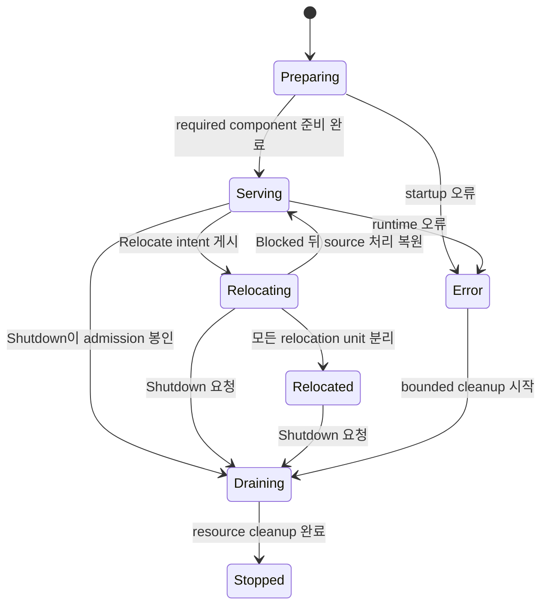
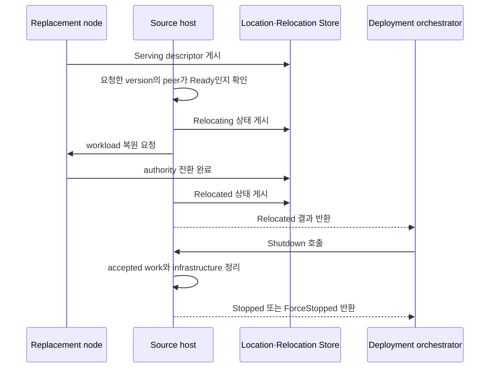

# Host Relocate와 Shutdown

[스펙 목차](README.ko.md) · [이전: Request 연결과 업무 흐름 식별](27-flow-correlation.ko.md) · [다음: Transport 연결 상태 확인](29-transport-liveness.ko.md)


## 1. 이 문서가 답하는 질문

이 문서는 application이 host의 stateful workload를 다른 node로 이전하거나 host를
종료할 때 어떤 operation을 호출하고, Framework가 어떤 순서로 처리하며, 호출이 어떤
결과로 끝나는지를 정의한다.

Message handler와 Actor를 실행하는 단위를
[Spot](01-glossary.ko.md#spot)이라고 한다. 이 문서에서 stateful workload는 host가
처리 중인 Actor·Spot, 아직 끝나지 않은 message와 timer를 뜻한다.

Application version을 유지한 채 node를 점검하거나 재부팅하려면
`PlannedMaintenance`로 `Relocate`를 호출한다. 준비한 새 application version으로
교체하려면 `RollingUpdate`로 호출한다. Target version 선택 방식을
[relocation mode](01-glossary.ko.md#relocation-mode)라고 한다.

두 mode 모두 성공하면 stateful workload만 source host에서 분리된다. Host와
infrastructure connection은 유지된다. Application 또는 deployment orchestrator는
이 결과를 확인한 뒤 [Shutdown](01-glossary.ko.md#shutdown)을 별도로 호출한다.

Stateful workload의 연속성을 보장하지 않고 host를 종료하려면 `Relocate` 없이
`Shutdown`만 호출한다.

같은 이름으로 연결된 node의 RouteMesh 그룹을 구분하는 이름을
[MeshName](01-glossary.ko.md#meshname)이라고 한다. 같은 Channel에 참여한 target을
고르는 이름은 [ChannelName](01-glossary.ko.md#channelname)이다. Application은
MeshName, ChannelName 또는 node RID로 일부 component만 골라 종료 순서를 직접
조립하지 않는다.

여러 node가 message를 주고받는 연결 그룹인
[RouteMesh](01-glossary.ko.md#routemesh), 그 그룹에 참여하는 runtime node인
[MeshNode](01-glossary.ko.md#meshnode), ClientServer server와
[Classic fanout](01-glossary.ko.md#classic-fanout) publisher를 host 단위로 함께
조정한다.

이 문서는 application이 관찰하는 host lifecycle과 handoff 결과를 소유한다.
Actor·Spot을 현재 처리하는 node를 [owner](01-glossary.ko.md#owner)라고 한다.
Actor·Spot의 owner와 위치를 여러 node가 함께 판단하는 record를
[authority](01-glossary.ko.md#authority)라고 한다. Framework가 authority와 두
Store를 사용하는 순서는 [40 Location runtime](21-location-runtime.ko.md)이
정의한다. 현재 owner와 위치를 저장하는
[Location Store](01-glossary.ko.md#location-store) provider 계약은
[41 Location Store provider](22-location-store-redis.ko.md)가 정의한다. 복원할
payload를 저장하는 provider 계약은
[42 Relocation Store provider](23-relocation-store-redis.ko.md)가 정의한다. 이
문서는 저장 형식을 반복하지 않고 host operation의 공개 순서만 정의한다.

## 2. Application이 선택하는 operation

### 2.1 Relocate mode 선택

Caller는 `Relocate`를 호출할 때 mode를 반드시 지정한다. 두 mode의 차이는 target
application version뿐이다. 이후의 queue seal, state 복원, authority 전환과 session
handoff 규칙은 같다.

| 값 | Mode | Caller가 지정하는 값 | Framework가 선택하는 target |
|---:|---|---|---|
| 0 | `PlannedMaintenance` | `TargetApplicationVersion`을 지정하지 않는다. | Source와 application version이 정확히 같은 node만 선택한다. |
| 1 | `RollingUpdate` | Source보다 큰 `TargetApplicationVersion`을 지정한다. | Caller가 지정한 application version과 정확히 같은 node만 선택한다. |

`PlannedMaintenance`의 effective target version은 source의 `ApplicationVersion`이다.
Target version을 함께 지정하면 argument error다. `RollingUpdate`는 target version이
없거나 source version 이하이면 argument error다. Framework는 이런 잘못된 조합을
runtime state와 admission을 변경하기 전에 거부한다.

Operation이 끝나야 하는 마지막 시각을
[deadline](01-glossary.ko.md#deadline)이라고 한다. 두 mode 모두 `Deadline`을
생략하면 30초를 사용한다. 명시한 값은 0보다 커야 한다.

### 2.2 Public operation

다음 .NET 선언은 공통 계약의 한 표현이다. 다른 언어의 정확한 이름과 signature는
각 언어의 exact interface 문서가 정의한다.

```csharp
public enum ZLinkFrameworkRelocationMode
{
    PlannedMaintenance = 0,
    RollingUpdate = 1
}

public sealed record ZLinkFrameworkRelocationOptions
{
    // 같은 version 점검인지 새 version 배포인지 선택한다.
    public required ZLinkFrameworkRelocationMode Mode { get; init; }

    // RollingUpdate에서만 source보다 큰 exact version을 지정한다.
    public long? TargetApplicationVersion { get; init; }

    // 생략하면 30초를 사용한다.
    public TimeSpan? Deadline { get; init; }
}

public readonly record struct ZLinkFrameworkRelocationResult(
    ZLinkFrameworkRelocationMode Mode,
    long TargetApplicationVersion,
    ZLinkFrameworkRelocationOutcome Outcome,
    ZLinkFrameworkRelocationReason Reason);

public interface IZLinkFrameworkRuntime
{
    // 현재 host lifecycle state와 마지막 결과를 제공한다.
    ZLinkFrameworkRuntimeStatus Status { get; }

    // Host state와 terminal result 변화를 순서대로 관찰한다.
    IAsyncEnumerable<ZLinkFrameworkRuntimeStatus> ObserveAsync(
        CancellationToken cancellationToken = default);

    // Stateful workload를 이전하고 성공하면 Relocated 상태로 남는다.
    ValueTask<ZLinkFrameworkRelocationResult> RelocateAsync(
        ZLinkFrameworkRelocationOptions options,
        CancellationToken cancellationToken = default);

    // 새 relocation 없이 accepted work와 host resource를 정리한다.
    ValueTask<ZLinkFrameworkTerminationResult> ShutdownAsync(
        TimeSpan? deadline = null,
        CancellationToken cancellationToken = default);
}
```

Rolling update의 일반적인 호출 순서는 다음과 같다.

```csharp
var relocation = await runtime.RelocateAsync(
    new ZLinkFrameworkRelocationOptions
    {
        // N+1로 준비한 node만 target 후보로 사용한다.
        Mode = ZLinkFrameworkRelocationMode.RollingUpdate,
        TargetApplicationVersion = currentVersion + 1,
        Deadline = TimeSpan.FromSeconds(30)
    },
    cancellationToken);

if (relocation.Outcome == ZLinkFrameworkRelocationOutcome.Relocated)
{
    // Relocation 성공을 확인한 뒤 host resource를 별도로 정리한다.
    await runtime.ShutdownAsync(cancellationToken: cancellationToken);
}
```

`Relocate` 결과에는 mode와 effective target version이 항상 포함된다. Target을 찾지
못한 경우에도 caller가 어떤 조건으로 기다렸는지 확인할 수 있도록 같은 값을
보존한다. `Relocate`가 `Blocked`로 끝나면 caller는 다시 시도하거나 continuity 없이
`Shutdown`할 수 있다.

## 3. Host state와 완료 결과

Host lifecycle은 `FrameworkRuntimeState` 하나가 소유한다.

Host의 endpoint, 실행 세대와 제공 기능을 Store에 게시한 정보를
[descriptor](01-glossary.ko.md#descriptor)라고 한다. 새 application 작업을 받을
준비가 끝난 상태를 [ready](01-glossary.ko.md#ready)라고 한다.

| 값 | State | 의미 |
|---:|---|---|
| 0 | `Preparing` | Registration, bind, descriptor 검증과 recovery를 진행하며 application message를 받지 않는다. |
| 1 | `Serving` | Host가 ready 상태이며 새로운 application work를 받는다. |
| 2 | `Relocating` | 새 placement와 selection에서는 제외됐지만 아직 seal하지 않은 local unit은 message와 timer를 계속 처리한다. |
| 3 | `Relocated` | 모든 stateful object가 source dispatch에서 분리됐다. Host와 infrastructure 연결은 유지한다. |
| 4 | `Draining` | `Shutdown`이 새 admission을 닫고 이미 수락한 work와 resource를 정리한다. |
| 5 | `Stopped` | Application resource, infrastructure resource와 listener 정리가 끝났다. |
| 6 | `Error` | Startup 또는 runtime 오류 때문에 service를 제공할 수 없다. |

`IsReady`는 `Serving`에서만 true다.
Component lifecycle snapshot은 각 component의
상태를 관찰하는 정보이며 host state를 대신하지 않는다. Component별 `Drain`,
`AwaitDrained`, `Stop` 또는 일부 Mesh만 대상으로 하는 public operation은 제공하지
않는다.



첫 relocation commit 전에 실패하면 tentative 작업을 정리하고 `Serving`으로
돌아간다. Commit 뒤 실패에서도 아직 commit하지 않은 source workload의 처리를
복원할 수 있으므로 host는 `Serving`으로 돌아갈 수 있다. 이때 이미 commit한 unit은
target owner에 남는다. `Serving` 복귀가 모든 unit의 source rollback을 뜻하지 않는다.

Relocation outcome은 다음 값으로 고정한다.

| 값 | Outcome | 허용 reason | 의미 |
|---:|---|---|---|
| 0 | `Relocated` | `None` | 모든 stateful object가 source dispatch에서 분리됐다. |
| 1 | `Blocked` | `TargetUnavailable`, `StoreUnavailable`, `RelocationDisabled`, `StateIncompatible`, `DeadlineExceeded`, `RelocationFailed`, `RuntimeNotReady`, `ManualTopologyUnsupported`, `ShutdownRequested`, `OperationInProgress` | Relocation을 시작할 수 없거나 전체 workload 이전을 끝내지 못했다. |

Wire 값은 `Relocated=0`, `Blocked=1`이다. Reason은 `None=0`,
`TargetUnavailable=1`, `StoreUnavailable=2`, `RelocationDisabled=3`,
`StateIncompatible=4`, `DeadlineExceeded=5`, `RelocationFailed=6`,
`RuntimeNotReady=7`, `ManualTopologyUnsupported=8`, `ShutdownRequested=9`,
`OperationInProgress=10`이다. 정의하지 않은 outcome과 reason 조합은 protocol
오류다.

Shutdown outcome은 `Stopped=0`, `ForceStopped=1`이고 reason은 `None=0`,
`DeadlineExceeded=1`, `TeardownFailed=2`다. `ForceStopped`는 별도 host state가
아니다. Bounded teardown으로 정리를 끝낸 결과이며 host state는 `Stopped`다.
Relocation 실패는 relocation result가 소유하고 termination reason에 섞지 않는다.

## 4. Target을 선택하기 전에 확인하는 조건

`Serving`에서 시작한 `Relocate`는 host state와 application admission을 바꾸기 전에
host 전체를 한 번에 검사한다. 이때 이동 대상의 새 작업을 막거나 target 수용
공간을 미리 확보하지 않는다.

Application state를 bytes로 저장해 target에서 복원하는 방식은
[Snapshot relocation policy](01-glossary.ko.md#snapshot-relocation-policy)다.
Host가 현재 owner 자격을 유지하는 기간을
[owner lease](01-glossary.ko.md#owner-lease)라고 한다.

| 검사 항목 | 통과 조건 |
|---|---|
| 동시에 진행 중인 작업 | 새 object 생성, join, Instance placement, session binding과 inbound relocation이 있으면 먼저 끝낼 작업을 확정한다. |
| Local workload | 모든 MeshNode의 Actor, Spot, timer, session과 진행 중인 infrastructure operation을 확인한다. |
| 두 Store | Location Store의 현재 위치 record, 필요한 Relocation Store와 target descriptor의 owner lease를 사용할 수 있다. |
| Unit 호환성 | Application이 명시적으로 만드는 [User Spot](01-glossary.ko.md#entry-spot-user-spot과-instance-spot), 최초 message로 필요할 때 만드는 [Instance Spot](01-glossary.ko.md#entry-spot-user-spot과-instance-spot), 그 안의 Actor가 사용하는 relocation policy와 Snapshot adapter, target [factory](01-glossary.ko.md#factory), 수용 공간이 모두 호환된다. |
| Topology | Host가 사용하는 모든 service topology가 Store의 descriptor로 remote endpoint를 찾는다. 이 방식을 [automatic discovery](01-glossary.ko.md#automatic-discovery)라고 한다. |

Manual RouteMesh peer, ClientServer client endpoint, fanout subscriber endpoint 또는
descriptor를 게시하지 않는 manual fanout publisher가 하나라도 등록돼 있으면
`Blocked/ManualTopologyUnsupported`다. 현재 연결 여부가 아니라 registration을
검사한다. Automatic component가 listener 주소를 명시적으로 bind하는 설정은 manual
topology가 아니다.

Runtime이 확인하는 범위는 local registration이다. 다른 process가 Framework 밖에서
만든 connection까지 확인하지 않으므로, 참여 process 전체가 automatic discovery만
사용한다는 조건은 deployment가 보장한다.

## 5. Mode에 맞는 target을 선택한다

Framework는 다음 순서로 target을 좁힌다.

| 순서 | 조건 |
|---:|---|
| 1 | `PlannedMaintenance`는 source와 같은 application version만 남긴다. `RollingUpdate`는 caller가 지정한 version만 남기며 더 낮거나 높은 다른 version도 제외한다. |
| 2 | Source가 아니며 `Serving` 상태인 Object Server만 남긴다. |
| 3 | Application이 object를 만들도록 등록한 함수인 [factory](01-glossary.ko.md#factory), 언어 독립 object type 이름인 [stable type](01-glossary.ko.md#stable-type), relocation policy와 Snapshot adapter가 호환되는 node만 남긴다. |
| 4 | 필요한 수용 공간이 남아 있고, source에 [maintenance wave](01-glossary.ko.md#maintenance-wave)가 설정되어 있으면 값이 다른 node만 남긴다. Maintenance wave는 같은 점검 작업의 host를 구분하는 application 설정값이다. |
| 5 | 같은 시점의 descriptor 목록과 Core peer table에서 RID와 [lifecycle generation](01-glossary.ko.md#lifecycle-generation)이 모두 같은 node만 남긴다. Lifecycle generation은 같은 RID를 사용한 서로 다른 process 실행을 구분한다. 해당 peer는 `Admitted`와 `Ready`여야 한다. |

Version은 수용 공간과 placement weight보다 먼저 확인한다. 따라서 다른 version
node의 남은 공간이나 높은 weight는 선택 결과에 영향을 주지 않는다. 여러 후보에
새 작업을 배정할 상대 비중을 [weight](01-glossary.ko.md#weight)라고 한다. 조건을
만족한 target이 여러 개일 때만 이 값을 적용한다.

Descriptor가 게시됐거나 connect intent가 만들어진 것만으로 target이 ready라고
판단하지 않는다. 특정 시점의 상태를 읽기 전용으로 복사한 결과를
[snapshot](01-glossary.ko.md#snapshot)이라고 한다. Descriptor snapshot이 비어
있거나 source 자신만 포함하거나 모든 remote peer가 draining이면 target이 없는
상태다.

### 5.1 Target이 아직 없을 때

요청한 version의 target이 없으면 source state와 admission을 유지한 채
deadline까지 descriptor와 Core peer table의 수렴을 기다린다. 여러 Mesh를 가진
process는 모든 Mesh에서 조건을 만족해야 한다. Deadline까지 target을 확보하지 못하면
tentative coordination을 정리하고 `Blocked/TargetUnavailable`을 반환한다.



`Relocated`에서는 descriptor, connection, listener와 infrastructure resource를 유지한다.
이 다이어그램은 target이 준비된 정상 흐름이다. Target이 없으면 앞 절의 deadline 규칙으로
`Blocked/TargetUnavailable`을 반환한다.

Automatic ClientServer client와 fanout subscriber는 replacement descriptor로 새
connection을 만들고 source 상태를 selection에 반영한다. Accepted work와 barrier가
남은 기존 connection은 descriptor 변화만으로 즉시 닫지 않는다.

## 6. Concurrent 호출과 cancellation

| 상황 | 결과 |
|---|---|
| Mode와 effective target version이 같은 concurrent `Relocate` | 최초 operation과 deadline을 공유한다. 뒤의 호출은 deadline을 바꾸지 않는다. |
| Mode 또는 effective target version이 다른 concurrent `Relocate` | 기다리지 않고 `Blocked/OperationInProgress`다. |
| `Blocked` 뒤 다시 `Relocate` | `Blocked`는 저장하지 않으므로 host 조건을 처음부터 다시 검사한다. |
| `Relocated`에서 다시 `Relocate` | 최초 `Relocated/None`의 mode와 effective target version을 반환한다. |
| Concurrent `Shutdown` | 같은 operation을 공유하고 terminal result를 저장한다. |
| `Stopped`에서 다시 `Shutdown` | 저장한 결과를 반환한다. 없으면 새 작업 없이 `Stopped/None`이다. |
| `Preparing`, `Error` 또는 `Stopped`에서 `Relocate` | Admission을 바꾸지 않고 `Blocked/RuntimeNotReady`다. |

Caller cancellation은 해당 waiter만 끝내며 shared operation은 취소하지 않는다.
`Shutdown`은 `Preparing`에서 startup을 중단하고 `Error`에서는 bounded cleanup을
시작한다.

## 7. Relocation unit과 실행량 제한

Framework가 서로 독립적으로 옮길 수 있는 Actor 또는 Spot 묶음을 relocation unit이라고
한다. Actor가 현재 어느 Entry Spot 또는 User Spot에 속하는 관계는
[Actor membership](01-glossary.ko.md#actor-membership)이다.

| Relocation unit | 경계 |
|---|---|
| `SpotWide` User Spot aggregate | User Spot과 새 작업을 막는 시점의 member Actor 전체 |
| Actor | Entry Spot 또는 `PerActor` User Spot에 속한 Actor 하나 |
| `PerActor` Spot authority 전환 | Target의 stateless Spot shell과 Spot-level queue authority |
| Instance Spot | Actor membership이 없는 Spot 하나 |

Entry Spot 자체는 이전하지 않는다. Source Entry Spot의 Actor는 Actor unit으로
target node의 Entry Spot에 이전한다. `PerActor` User Spot도 Spot application state를
이전하지 않고 Actor를 같은 단위로 이전한다.

Framework는 각 unit의 queue에 이동 준비 작업을 넣는다. 현재 application turn이
끝나면 동시 실행 수와 memory 제한을 모두 확보한 unit부터 이동한다. 제한 중 하나라도
확보하지 못하면 이미 확보한 제한을 반환하고 나중에 다시 시도한다. 아직 이동을
시작하지 않은 unit은 message와 timer를 계속 처리한다.

User Spot 전체가 하나의 실행 gate를 사용하는
[`SpotWide`](01-glossary.ko.md#user-spot-execution-mode)는 현재 turn이 끝나면 준비된다.
Actor마다 실행 lane을 나누는 `PerActor`와 Entry Spot은 Actor별 current turn이 끝난
unit부터 준비한다. 서로 다른 Actor는 동시에 이전할 수 있지만 Actor 하나의 queue
순서는 유지한다. `PerActor` Spot lane은 authority 전환 때만 잠시 막고 member Actor
전체가 같은 시점에 준비될 때까지 기다리지 않는다.

`SpotWide` factory의
[`Spot relocation readiness mode`](01-glossary.ko.md#spot-relocation-readiness-mode)가
`AnyTurnBoundary`이면 위의 일반 turn 경계를 사용한다. 기본값도 이 mode다.
`ApplicationSignaled`이면 preflight, target과 permit 준비를 끝낸 relocation만
application이 `RelocationReady().Defer()`로 등록한 경계를 소비한다. 준비된
relocation이 없으면 source에서 `Continued` completion callback을 다음 application
turn으로 실행한다.

경계를 소비한 relocation이 commit 전에 취소되면 source queue를 복원한 뒤
`Continued` callback을 실행한다. Commit 뒤에는 target recovery를 계속하고 target
admission을 준비한 뒤 `Relocated` callback을 첫 application turn으로 실행한다.
Callback이 완료되기 전에는 이전 queue, source relay, 새 target direct queue의
application handler를 실행하지 않는다. Callback 자체는 Spot interface의 기본
no-op 구현이며 override는 retry-safe해야 한다.

Application은 Location 설정에서 다음 다섯 상한을 양수로 지정할 수 있다. 설정을
바꾸면 새 relocation admission부터 적용한다. 아래 표는 공통 의미, .NET public
member와 기본값을 함께 보여 준다. 다른 언어의 이름은 해당 언어 exact interface가
정한다. [.NET Location 설정](server/languages/dotnet/interfaces/08-location-maintenance.ko.md#2-location-option)에서
`ConfigureLocations()` 등록 위치와 정확한 선언을 확인할 수 있다.

| 제한하는 항목 | .NET public member | 기본 상한 |
|---|---|---:|
| Source에서 동시에 이전하는 unit | `MaxActiveOutboundRelocations` | 64 |
| Target에서 동시에 복원하는 unit | `MaxActiveInboundRelocations` | 64 |
| Process가 relocation을 위해 보관하는 encoded payload | `MaxRelocationPayloadInFlightBytes` | 256 MiB |
| 동시에 실행하는 `Capture` callback | `MaxConcurrentRelocationCaptures` | 8 |
| 동시에 실행하는 `Restore` callback | `MaxConcurrentRelocationRestores` | 8 |

Callback 동시 실행 수는 unit 수와 payload byte 제한에서 따로 계산한다. 이동을
시작하기 전에 Snapshot object
하나의 최대 64 MiB와 queue, journal, timer, 목록 정보와 framing의 최대 저장 크기를
합산해 memory를 확보한다. Application에서 예상 크기를 받지 않는다. `Capture` 뒤
실제 크기가 작으면 확보량을 줄일 수 있지만 늘릴 수 없다. Adapter가 64 MiB를
넘으면 `Blocked/StateIncompatible`다.

256 MiB보다 큰 `SpotWide` User Spot 전체는 다른 payload 이동이 없을 때 하나만 진행한다. 실제
크기가 작아져도 해당 이동이 memory 사용을 끝낼 때까지 다른 payload 이동을
시작하지 않는다. Actor 하나와 Instance Spot은 256 MiB 제한 안에서만 진행한다.

### 7.1 Actor별 서비스 중단 시간 목표

Entry Spot과 `PerActor` User Spot의 Actor relocation은 Actor queue가 다음 작업을
시작하지 못하게 막은 시점부터 target Actor admission을 연 시점까지 기본 1초
이내를 목표로 한다. 현재 실행 중인 turn이 끝나기를 기다리는 시간과 host 전체
relocation 시간은 이 측정에 포함하지 않는다.

1초는 timeout이나 correctness 조건이 아니다. 초과해도 현재 Actor relocation을
취소하거나 source로 rollback하지 않는다. Framework는 같은 operation을 계속하여
target restore, owner CAS, source relay와 target admission을 완료한다. 느린 Actor
하나가 다른 Actor의 처리와 relocation, target의 `ToSpot`, Create와 Join을 막지
않도록 Actor unit과 callback 동시 실행 제한만 소비한다.

Host operation deadline이 끝나면 새 Actor relocation을 시작하지 않는다. 이미
시작한 Actor는 owner 변경 전 안전한 abort 또는 owner 변경 뒤 target recovery까지
진행한다. 아직 source에 남은 Actor가 있으면 host는 `Relocated`가 되지 않는다.

## 8. Unit 하나를 이전하는 순서

Framework는 현재 실행 중인 turn까지만 완료하고 다음 turn 전에 unit의 새 작업을
막는다.

1. Source에서 내보낼 unit 수, target에서 복원할 unit 수, `Capture`와 `Restore`
   callback 수, payload memory 제한을 모두 확보한다.
2. Framework는 새 application message, timer 실행과 아직 시작하지 않은
   continuation이 같은 이동 세대 이후에 시작되지 않게 막는다.
3. Framework는 아직 실행하지 않은 message, accepted journal, timer registration과
   실행 대기 중인 tick을 저장한다. `Snapshot` policy이면 adapter의 `Capture`가 반환한
   application state도 포함한다.
4. Target은 factory와 `Restore`를 실행한다. 이 과정에서는 새 application 작업을
   받지 않는다.
5. Framework는 저장한 payload를 다시 확인한다. 그 뒤 Location Store에서 owner와
   Actor membership을 한 번에 바꾼다. 저장 순서와 실패 복구는
   [40 Location runtime](21-location-runtime.ko.md), payload 저장 방식은
   [42 Relocation Store](23-relocation-store-redis.ko.md)가 정의한다.
6. Framework는 source 정리 완료를 Store에 기록하고 session route와 timer가 target을
   가리키게 바꾼다.
7. Target이 복원 완료를 확인한 뒤 새 application 작업을 받고 사용하던 동시 실행
   수와 memory를 반환한다.

| Policy | 처리 |
|---|---|
| `Disabled` | 해당 object가 남아 있으면 `Blocked/RelocationDisabled`다. |
| `Recreate` | 같은 object ID로 target factory를 실행한다. Application state는 옮기지 않지만 아직 끝나지 않은 Framework 작업은 옮긴다. |
| `Snapshot` | Adapter가 반환한 bytes를 저장하고 target factory instance에 `Restore`한다. Application이 bytes의 format, version과 migration을 관리한다. |

Framework는 별도 state contract ID나 generic state type을 추가하지 않는다.

`PerActor` User Spot은 다음 순서로 진행한다.

1. Target에 `Recreate` policy로 runtime-private Spot shell을 준비한다. Public SpotId와
   ObjectGeneration은 source와 같지만 아직 resolver에 공개하지 않는다.
2. Source Spot lane의 current turn과 진행 중인 Actor Create·Join을 끝내고 새
   Spot-level admission을 잠시 보관한다.
3. Location Store에서 Spot authority를 target으로 CAS한다.
4. 보관한 Spot message를 target으로 relay하고 새 `ToSpot`, Create와 Join을 target에서
   받는다.
5. Source member Actor는 각자 현재 turn을 끝낸 뒤 Actor unit으로 target에 이전한다.
   이전되지 않은 Actor의 `ToActor`는 source, 이전된 Actor의 `ToActor`는 target으로
   보낸다.
6. 마지막 Actor와 source relay가 끝나면 source Spot shell을 `RelocationOut`으로
   닫는다.

Framework는 임시 public SpotId를 만들거나 target shell 생성 뒤 SpotId를 바꾸지
않는다. Source shell은 Spot authority commit 뒤 public `ToSpot`, Create와 Join을
처리하지 않고 source에 남은 Actor와 relocation control만 처리한다.

`SpotWide` User Spot은 Spot과 새 작업을 막은 시점의 member Actor 전체를 한 번에 옮긴다.
Actor 하나라도 policy, adapter 또는 target 조건을 만족하지 못하면 Store 변경 전에
User Spot 전체 이동을 중단한다. 전체 이동 ID는 0이 아닌 128-bit 값이다.

User Spot에 속한 Actor 총수에는 1,024개 상한을 두지 않는다. Framework는 이동 대상
목록을 Location Store의 여러 페이지로 나눈다. 한 페이지에는 최대 1,024개를
기록하며 저장 크기는 최대 1 MiB다. 전체 항목 수와 내용 확인값이 모두 맞는지
확인한 뒤 User Spot과 모든 Actor의 owner, generation과 목록 시작 위치를 한 번에
바꾼다. 처음 읽은 Store version이 그대로일 때만 변경하는 방식을
[CAS](01-glossary.ko.md#compare-and-set)라고 한다. 이 CAS가 성공한 뒤부터 전체가
새 owner를 따른다. 일부 Actor membership만 먼저 바꾸지 않는다.

Entry Spot과 `PerActor` User Spot의 Actor relocation은 application membership
callback을 호출하지 않는다. Framework가 Actor adapter, journal, queue, timer,
owner route와 session binding을 이전한다. `SpotWide` User Spot 전체 이동도 logical
membership을 유지하므로 join·leave callback을 호출하지 않는다.

Cross-node Actor join도 같은 policy와 adapter를 사용하지만 정확한 lifecycle은
[23 Spot Actor](15-spot-actor.ko.md)가 소유한다. Same-node join은 adapter를 호출하지
않는다. Instance Spot maintenance relocation은 hidden create를 시작하지 않는다.

## 9. 대기 중인 message, timer와 session을 옮긴다

같은 ID로 object를 삭제한 뒤 다시 만들었는지 구분하는 번호를
[ObjectGeneration](01-glossary.ko.md#objectgeneration)이라고 한다. Message나
request를 중복 처리하지 않도록 operation 하나를 구분하는 값은
[operation identity](01-glossary.ko.md#operation-identity)다.
이전하는 동안 source가 새 message를 임시 보관하는 구간을
[relocation ingress hold](01-glossary.ko.md#relocation-ingress-hold)라고 한다.

| Resource | 이동 규칙 |
|---|---|
| 새 작업 차단 뒤 도착한 message | Source는 최대 1,024 record와 저장 크기 16 MiB까지 임시 보관한다. Owner 변경이 성공하면 operation identity와 ObjectGeneration을 유지해 target에 전달한다. 변경을 취소하면 도착 순서대로 source queue에 되돌린다. |
| 임시 보관 한도 초과 | Request는 다시 시도할 수 있는 `SpotMoving`, one-way operation은 moving drop으로 끝난다. Framework는 새 operation identity를 만들어 자동 재제출하지 않는다. |
| `SpotWide`·Instance Spot timer | Runtime handle과 continuation은 이전하지 않는다. Logical registration, 다음 실행 시각과 pending tick을 이전하며 target이 queue 순서에 맞춰 자동 복원한다. Application은 timer를 중복 capture하거나 restore에서 다시 등록하지 않는다. |
| Entry·`PerActor` Actor timer | Actor queue와 함께 Actor owner로 이전한다. Spot-level application timer는 이전하지 않으며 유지해야 하는 schedule은 application의 외부 state에서 관리한다. |
| Actor에 연결된 session | Request·reply와 push를 같은 연결에서 교환하는 [STREAM session](01-glossary.ko.md#stream-session)의 physical connection은 유지한다. 같은 ObjectGeneration에서 해당 Actor의 [binding route](01-glossary.ko.md#binding-route), 전달 권한과 generation만 target을 가리키게 바꾸고 ACK를 기다린다. 다른 Actor route는 바꾸지 않는다. |

이전 owner로 늦게 도착한 message를 target에 전달할 때도 operation identity와
authority generation을 유지한다. Session route가 target을 가리킨다는 ACK를 받기
전에는 target이 새 packet과 push를 받지 않는다. 이전 generation의 packet과 reply는
거부한다. 같은 ActorId로 새로 만든 Actor는 application이 다시 bind해야 한다. 자세한
route 변경 순서는
[31 Session Actor dispatch](20-session-actor-dispatch.ko.md#5-actor-relocation-route-barrier)가 정의한다.

Instance Spot의 `Close`와 relocation은 같은 authority commit에서 순서를 정한다.
`Closing`이 먼저면 close를 완료하고 이전하지 않는다. Relocation이 먼저면 늦은
`Close`는 moving 결과이며 자동 재제출하지 않는다.

## 10. Relocate 완료와 실패

모든 unit이 source dispatch에서 분리되고 relocation ingress hold가 commit 또는 abort로
정리되면 host는 `Relocated`로 전환하고 `Relocated/None`을 반환한다. Descriptor lease,
listener, peer connection과 raw transport resource는 이때 정리하지 않는다.

Operation이 deadline까지 완료 조건을 만족하지 못한 결과를
[`DeadlineExceeded`](01-glossary.ko.md#deadlineexceeded)라고 한다.

| 발생 시점과 원인 | 결과 |
|---|---|
| 요청한 application version의 target이 deadline까지 준비되지 않는다. | `Blocked/TargetUnavailable` |
| Store 읽기, 쓰기 또는 owner lease 확인이 첫 owner 변경 전에 실패한다. | Owner를 바꾸지 않은 임시 record를 정리하고 `Blocked/StoreUnavailable` |
| `Disabled` policy가 남아 있다. | `Blocked/RelocationDisabled` |
| Version, type 또는 Snapshot adapter가 호환되지 않거나 허용한 재시도에서 `Capture`와 `Restore`가 모두 실패한다. | `Blocked/StateIncompatible` |
| Framework가 deadline 때문에 callback을 취소하거나 owner 변경 전 작업이 deadline을 넘는다. | `Blocked/DeadlineExceeded` |
| 첫 owner 변경 뒤 authority 또는 relocation payload 처리가 실패한다. | 현재 unit의 복구를 끝내고 `Blocked/RelocationFailed` |

첫 owner 변경 전 실패는 임시 record를 정리하고 source authority와 queue가 새
작업을 다시 받게 한다. 첫 owner 변경 뒤 실패는 Location Store에 기록된 현재
owner를 기준으로 복구를 끝낸다. 이미 바꾼 owner와 Actor membership을 source로
되돌리지 않는다. 아직 옮기지 않은 source workload만 다시 처리한 뒤 host를
`Serving`으로 전환한다.

Location Store가 가리키는 payload가 영구적으로 없거나 checksum 또는 이동 대상
목록의 내용 확인값이 다르면 다시 시도해도 복구할 수 없는
`RelocationDataLost`다. 이전 payload를 추측하거나 source로 되돌리지 않는다.
판정과 복구는
[42 Relocation Store](23-relocation-store-redis.ko.md)가 정의한다.

일부 MeshNode의 `Relocating` descriptor 기록 결과를 확인하지 못하면 시도한 모든
descriptor를 `Serving`으로 되돌린다. 모든 변경 취소를 확인해야
`Blocked/StoreUnavailable`이다. 하나라도 확인할 수 없으면 새 작업을 받지 않고
정해진 최대 시간 동안 정리한 뒤 `ForceStopped/TeardownFailed`로 끝낸다.

## 11. Shutdown과 Relocate의 경쟁

`Shutdown`은 target, policy, capacity 또는 Relocation Store 부재로 차단되지 않는다.
새 application 작업을 받지 않도록 바꾸는 동작을
[admission seal](01-glossary.ko.md#admission-seal)이라고 한다. Shutdown은 먼저 host
전체에 admission seal을 적용한다. Stateful workload의 연속성을 보장하지 않으며
다음 순서로 정해진 시간 안에 완료한다.

1. Host를 `Draining`으로 바꾸고 신규 application admission과 relocation reservation을
   닫는다.
2. `Draining` descriptor를 게시해 새 selection과 placement에서 제외한다.
3. 이미 수락한 handler, request completion, relocation unit과 session barrier를
   deadline까지 처리한다.
4. 새 object relocation은 시작하지 않는다. Actor membership과 local instance가
   유효한 상태에서 모든 Entry, User, Instance Spot에 `HostShutdown` closing context를
   전달한다. Actor별 closing callback은 호출하지 않는다.
5. Spot callback 뒤 local Actor와 Spot scope, owner record, descriptor, listener와
   transport를 순서대로 정리한다.
6. Deadline 안에 끝나면 `Stopped/None`, 끝나지 않으면 bounded teardown 뒤
   `ForceStopped/DeadlineExceeded` 또는 `ForceStopped/TeardownFailed`로 끝난다.

| 먼저 확정된 operation | 처리 |
|---|---|
| `Shutdown`의 admission seal | Target에 확보한 수용 공간을 반환하고 기다리던 Relocate 호출을 `Blocked/ShutdownRequested`로 끝낸다. |
| `Relocating` publication | 현재 unit만 terminal 상태까지 확정하고 나머지는 시작하지 않는다. Published authority를 보존하며 waiter는 `Blocked/ShutdownRequested`다. |

`Relocated`의 `Shutdown`은 accepted work와 infrastructure만 정리한다. `Serving`에서
바로 호출하면 object를 이전하지 않는다.

`Draining` 동안 descriptor와 owner lease를 계속 갱신한다. 이미 수락한 request,
relocation과 session route 변경이 끝나기 전에 owner 권한을 잃지 않도록 모든 작업이
끝난 뒤 lease 사용을 종료한다. 정리 순서는 다음과 같다.

Fanout publisher의 endpoint, identity와 실행 세대를 Store에 게시한 정보를
[fanout publisher descriptor](01-glossary.ko.md#fanout-publisher-descriptor)라고
한다.

1. Actor membership과 local instance를 유지한 채 Spot closing callback을 끝내고 local
   scope를 정리한다.
2. Current authority를 가진 source만 owner와 이동 대상 record를 다음 상태로
   바꾸거나 제거한다.
3. MeshNode, ClientServer server와 fanout publisher descriptor와 owner lease를
   release한다.
4. Peer connection, listener, executor와 binding transport를 닫는다.

표준 cooperative cancellation을 지원하는 언어는 Spot closing callback에 남은
deadline을 나타내는 정리용 cancellation signal을 전달한다. 이미 수락한 handler의
token은 재사용하지 않는다.
Callback exception은 `ForceStopped/TeardownFailed`, deadline 만료는
`ForceStopped/DeadlineExceeded`다. Hardware failure와 `SIGKILL`에서는 callback을
보장하지 않으며 owner recovery는 [40 Location runtime](21-location-runtime.ko.md)을
따른다.

## 12. State별 admission

Framework가 같은 ChannelName의 Server 후보 중 하나를 고르는 방식을
[select-one](01-glossary.ko.md#select-one)이라고 한다. Caller가 node RID를 직접
지정하는 호출은 [Node direct](01-glossary.ko.md#node-direct)다. 같은 Channel에
참여한 여러 Spot에 message를 보내는 기능은
[Logical Multicast](01-glossary.ko.md#logical-multicast)다.

Source runtime에서 현재 owner까지 message를 보내는 경로를
[owner route](01-glossary.ko.md#owner-route)라고 한다.

| 공개 기능 | `Relocating` | `Relocated` | `Draining` |
|---|---|---|---|
| ChannelName select-one | 새 selection에서 제외하지만 기존 direct owner route는 유지한다. | 새 selection에서 제외하고 infrastructure 연결은 유지한다. | 새 admission을 닫고 이미 제출한 operation만 terminal 상태까지 처리한다. |
| Logical Multicast | 새 target snapshot에서 제외하고 이미 수락한 제출은 유지한다. | 새 target snapshot에서 제외한다. | 새 admission을 닫고 이미 수락한 제출만 처리한다. |
| Node direct application request | 기존 owner request는 unit seal 전까지 수락한다. | Local stateful owner가 없으므로 새 request를 받지 않는다. | 새 request를 shutdown 결과로 끝낸다. |
| Node direct infrastructure control | Relocation, completion, binding과 recovery control을 계속 수락한다. | Monitoring과 shutdown control을 계속 수락한다. | Termination barrier에 필요한 control만 deadline까지 수락한다. |
| Spot·Actor direct | Unit seal 전까지 payload와 timer를 계속 처리한다. | Local stateful owner가 없으므로 새 payload를 받지 않는다. | 새 payload를 거부하고 이미 수락한 turn만 처리한다. |
| Spot·Actor create와 join | 새 owner와 membership admission을 거부한다. | 같은 거부를 유지한다. | 같은 거부를 유지한다. |
| Instance Spot placement | 새 target claim에서 제외하고 기존 direct route는 seal 전까지 유지한다. | 새 target claim에서 제외한다. | Seal 전에 수락한 activation만 terminal 상태까지 처리한다. |
| STREAM | 새 binding에서 제외하고 기존 session은 unit barrier로 처리한다. | 새 binding에서 제외하고 infrastructure connection은 유지한다. | 새 session을 받지 않고 pending reply와 binding barrier만 처리한다. |
| ClientServer server | 새 selection에서 제외하고 accepted handler와 reply route를 유지한다. | Service connection은 유지하지만 새 selection에서 제외한다. | Handler admission을 닫고 accepted request의 reply route만 유지한다. |
| Classic fanout publisher | 새 automatic subscriber connection을 만들지 않고 accepted event를 처리한다. | Infrastructure는 유지하지만 새 publish admission을 받지 않는다. | Publish admission을 닫고 accepted event만 처리한다. |

이미 수락한 request는 reply, error, timeout 또는 shutdown 중 하나로 한 번만 끝난다.
Application callback이 대기해도 infrastructure execution은 request completion, peer
lifecycle, recovery와 session binding을 계속 진행한다. Observer와 monitoring
callback은 maintenance를 막는 claim을 소유하지 않는다.

## 13. 관측 정보

State와 relocation result 변화는 `zlink.runtime.host.relocation_changed`, shutdown
result 변화는 `zlink.runtime.host.termination_changed`로 관찰한다. Terminal event는
observer overflow로 잃지 않는다. Relocation event와 제한된 개수의 진단 상태에는
mode와 effective target version을 포함한다. Version을 metric label로 추가하지 않는다.

Host state와 terminal 결과는 host status와 structured log에서 확인한다. 집계가 필요하면
host state, relocation mode·outcome·reason과 shutdown outcome·reason을
[51 Runtime metrics](25-runtime-metrics.ko.md#5-host-relocation과-shutdown)가 정의한
계기로 기록한다. Object relocation 계기와 host-wide operation 계기는 서로 다른 이름을 사용한다.

Spot을 system 전체에서 찾는 전역 문자열 주소를
[Spot ID](01-glossary.ko.md#spot-id)라고 한다. Metric label에는 Actor ID, Spot ID,
node RID, endpoint, session ID와 relocation ID를
넣지 않는다. 개별 blocker와 relocation 상태는 개수를 제한한 진단 조회와 trace에서
확인한다. Telemetry provider failure는 operation 진행을 막지 않는다. 전체 관측
계약은 [50 Runtime monitoring](24-runtime-monitoring.ko.md)과
[51 Runtime metrics](25-runtime-metrics.ko.md)가 소유한다.

## 14. Contract test 검증 요구

| 범위 | 반드시 검증할 항목 |
|---|---|
| Mode와 target | Planned maintenance는 같은 version만, rolling update는 요청한 더 높은 exact version만 선택하는지 검증한다. Version을 capacity와 weight보다 먼저 적용하고, 같은 wave를 제외하며, 모든 Mesh에서 exact Core peer가 ready일 때만 진행해야 한다. Target이 없으면 기다리고 manual topology이면 차단해야 한다. |
| Lifecycle | Preflight가 막히면 `Serving`을 유지하고, 성공하면 infrastructure를 유지한 `Relocated`가 되는지 검증한다. `Shutdown`은 별도로 호출하며 기본 deadline은 30초다. Caller cancellation은 waiter만 끝내고 잘못된 runtime state에서는 admission을 바꾸지 않아야 한다. |
| Concurrency | 같은 option의 relocation과 concurrent shutdown은 각각 하나의 operation을 공유하는지 검증한다. 다른 relocation option은 `OperationInProgress`, relocation 중 shutdown은 `ShutdownRequested`로 끝나며 terminal result를 반복 호출해도 같은 값을 반환해야 한다. |
| Unit gate | Outbound 64, inbound 64, payload 256 MiB, `Capture`와 `Restore` 각각 8, participant별 64 MiB를 검증한다. Permit은 한 번에 모두 얻어야 하며 oversized aggregate는 다른 payload가 없을 때 하나만 실행해야 한다. |
| Handoff | `SpotWide` User Spot aggregate를 한 번에 commit하고 queue, journal, timer와 pending tick을 함께 이전하는지 검증한다. Hold는 1,024 record와 16 MiB를 넘지 않으며 timer를 자동 복원하고 session route ACK 뒤 admission을 열어야 한다. Instance Spot을 숨겨서 새로 만들면 안 된다. |
| PerActor handoff | Entry Spot과 `PerActor` User Spot이 Actor만 독립적으로 이전하고 Spot adapter나 membership callback을 호출하지 않는지 검증한다. Spot authority 전환 뒤 `ToSpot`·Create·Join은 target, `ToActor`는 Actor별 current owner를 사용해야 한다. 이전 owner relay가 operation identity, ObjectGeneration, deadline, correlation과 reply route를 유지하고 relay 완료 뒤 target direct queue를 열어야 한다. |
| Interruption 목표 | Actor queue seal부터 target admission까지 1초를 측정하되 초과를 failure, rollback 또는 retry 조건으로 사용하지 않는지 검증한다. Host deadline 뒤에는 새 unit을 시작하지 않고 이미 시작한 unit을 안전한 terminal 상태까지 처리해야 한다. |
| Failure | Commit 전에는 source를 복원하고 commit 뒤에는 published authority를 기준으로 복구하는지 검증한다. 정확한 `Blocked` reason을 반환하고 terminal result를 한 번만 완료하며 descriptor rollback을 확인할 수 없으면 bounded teardown을 수행해야 한다. |
| Cleanup과 관측 | Barrier가 끝날 때까지 lease를 갱신하고 accepted request를 한 번만 완료하는지 검증한다. Callback failure를 정해진 reason으로 분류하며 state, outcome, reason, event와 metric이 wire 값과 일치해야 한다. Topology cleanup은 다른 authority를 변경하면 안 된다. |
