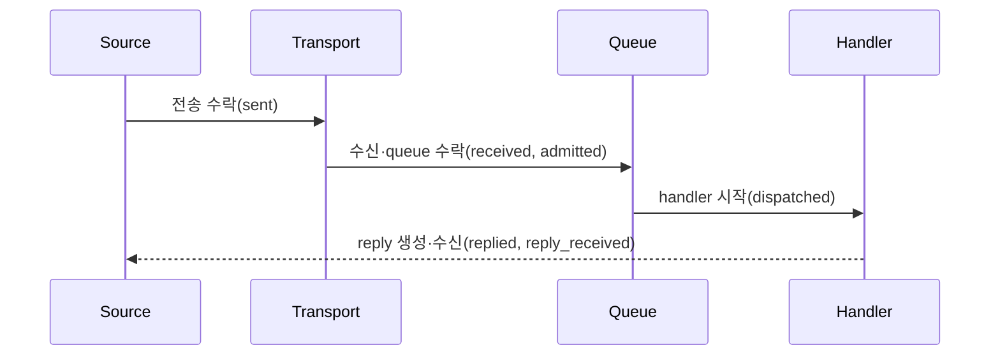

# Message flow tracing

[공통 스펙 목차](README.ko.md) · [Runtime 상태와 운영 진단](50-runtime-monitoring.ko.md) ·
[Runtime metrics](51-runtime-metrics.ko.md) · [Flow correlation](53-flow-correlation.ko.md)

## 1. 범위와 독자

이 문서는 message 한 건의 진행 단계와 실패 지점을 trace로 확인하는 계약을 정의한다.
Node, Channel, Spot, Actor와 STREAM은 같은 phase, outcome과 attribute를 사용한다.

Runtime 전체의 health와 lifecycle은 [Runtime 상태와 운영 진단](50-runtime-monitoring.ko.md),
집계 수치는 [Runtime metrics](51-runtime-metrics.ko.md), correlation 값의 생성과 전파는
[Flow correlation](53-flow-correlation.ko.md)이 소유한다. 이 문서는 correlation 형식을
다시 정의하지 않는다.

Framework는 언어 표준 tracing과 structured logging을 사용한다. Application은 level, sampling과
message size 기록 여부만 선택한다. Exporter, 저장소, observer와 event DTO는 노출하지 않는다.

## 2. Message가 기록되는 과정

`zlink.message_flow`는 message가 Framework 경계를 통과한 단계를 기록한다.
`zlink.dispatch_error`는 decode, handler, reply route 또는 protocol dispatch 실패를 기록한다.
두 identifier는 모든 언어에서 같은 문자열을 사용한다.

| Phase | Message가 도달한 경계 |
|---|---|
| `received` | Framework의 dispatch 경계에 도착했다. |
| `admitted` | Target application queue가 message를 수락했다. |
| `dispatched` | Typed application handler 실행을 시작했다. |
| `completed` | One-way handler가 terminal 상태로 끝났다. |
| `replied` | Request handler가 response 또는 error reply를 만들었다. |
| `sent` | Source의 local transport가 outbound submit을 수락했다. |
| `reply_received` | Outbound request가 terminal reply를 받았다. |
| `backpressured` | 수락할 공간을 확보하지 못했거나 제한 시간까지 기다렸다. |
| `dropped` | 정책에 따라 message를 전달 대상에서 제외했다. |



`sent`는 remote handler가 message를 받았다는 뜻이 아니다. `admitted`도 handler 완료를
보장하지 않는다. Trace는 기존 message delivery guarantee를 확대하지 않는다.

Logical Multicast와 classic fanout publish는 subscriber별 결과를 확인하지 않으므로
message-flow trace를 만들지 않는다.

## 3. 공통 attribute

### 3.1 닫힌 분류

| Attribute | 값 |
|---|---|
| `surface` | `node`, `channel`, `spot`, `instance_spot`, `actor`, `stream`, `actor_relocation` |
| `message_kind` | `send`, `request`, `response`, `error`, `control` |
| `outcome` | `succeeded`, `failed`, `backpressured`, `dropped`, `cancelled`, `shutdown` |
| `channel_route_kind` | `route_mesh`, `client_server` |
| `activation_state` | `activating`, `ready`, `closing` |

`zlink.message_flow`의 failure, backpressure와 drop reason은 다음 값으로 닫혀 있다.

`backpressure`, `stale_target`, `target_closed`, `shutdown`, `location_unavailable`,
`activation_rejected`, `activation_timeout`.

마지막 세 값은 Instance Spot의 location 실패, activation 거부와 timeout을 나타낸다.
Instance Spot close와 lease fencing은 `target_closed`다.

`zlink.dispatch_error`의 `outcome`은 `failed`다. `reason`은 다음 값으로 닫혀 있다.

`no_handler`, `decode_error`, `handler_exception`, `invalid_frame`, `reply_path_missing`,
`unexpected_reply`, `backpressure`, `stale_target`, `shutdown`.

| `action` | 적용 대상 |
|---|---|
| `reply_error` | Reply route가 있는 request |
| `fail_caller` | Local call의 terminal 실패 |
| `drop` | One-way operation |

### 3.2 Attribute 이름과 포함 조건

| Attribute | 포함 조건과 의미 |
|---|---|
| `event_id` | 모든 기록에 포함하며 `zlink.message_flow` 또는 `zlink.dispatch_error`를 사용한다. |
| `timestamp` | Framework가 이 경계를 관찰한 시각이다. |
| `phase` | `zlink.message_flow`에 포함한다. |
| `surface`, `message_kind`, `outcome` | 모든 message-flow 기록에 포함한다. |
| `reason` | Failure, backpressure 또는 drop 원인이 있을 때 포함한다. |
| `action` | `zlink.dispatch_error`에 포함한다. |
| `channel_name` | Channel 논리 주소가 있을 때 포함한다. |
| `channel_route_kind` | Channel surface에 포함한다. |
| `mesh_name` | Node direct 또는 RouteMesh scope가 있을 때 포함한다. |
| `server_rid` | ClientServer target을 선택했을 때 포함한다. |
| `source_rid`, `target_rid` | Routed hop에 해당 identity가 있을 때 포함한다. |
| `packet_name` | Typed handler key가 있을 때 포함한다. |
| `topic`, `spot_id`, `actor_id` | 해당 surface가 논리 target을 사용할 때 포함한다. |
| `instance_spot_type`, `activation_state` | Instance Spot 처리에 해당 값이 있을 때 포함한다. |
| `correlation_id` | Request와 terminal reply를 연결할 때 포함한다. |
| `flow_id`, `flow_origin` | Causal flow를 기록할 때 두 값을 함께 포함한다. |
| `message_size_bytes` | Detailed level에서 message size 기록을 켰을 때만 포함한다. |
| `duration_seconds` | Operation 또는 handler의 terminal 기록에서 경과 시간을 제공할 때 포함한다. |

`channel_route_kind`, `mesh_name`과 `server_rid`는 dispatch key나 target 선택 인자가 아니다.
Trace에는 payload, metadata value, native handle, raw frame와 exception object를 넣지 않는다.
Error 설명은 bounded 문자열이며 secret과 stack trace를 넣지 않는다.

Structured log fallback을 제공하는 구현은 prefix로 `zlink flow:`를 사용하고 다음 key를
그대로 사용한다.

`event`, `phase`, `surface`, `kind`, `mesh`, `channel`, `channel_route`, `source_rid`,
`target_rid`, `server_rid`, `packet`, `topic`, `spot`, `instance_type`,
`activation_state`, `actor`, `corr`, `flow`, `origin`, `outcome`, `reason`, `size`.

## 4. Application 설정

Application이 선택하는 diagnostics level은 다음 네 값이다.

| Level | 기록 범위 |
|---|---|
| `off` | Message flow와 dispatch error를 기록하지 않는다. |
| `errors` | Dispatch error, backpressure와 drop만 기록한다. |
| `normal` | Error와 §2의 주요 phase를 기록한다. |
| `detailed` | Normal 기록에 message size와 terminal duration을 추가할 수 있다. |

다음 C#은 공통 동작을 보여 주는 비규범적 발췌다. 정확한 type과 signature는
[.NET topology monitoring](server/languages/dotnet/interfaces/10-topology-monitoring.ko.md)이 정한다.

```csharp
public interface IZLinkDiagnosticsOptions
{
    IZLinkDiagnosticsOptions SetLevel(ZLinkDiagnosticsLevel level);
    IZLinkDiagnosticsOptions SetSampleRate(double rate);
    IZLinkDiagnosticsOptions IncludeMessageSizes(bool include);
}
```

```csharp
options.ConfigureDispatch().Diagnostics
    .SetLevel(ZLinkDiagnosticsLevel.Normal) // 주요 message phase 기록
    .SetSampleRate(0.1)                     // 정상 flow의 10%를 일관되게 선택
    .IncludeMessageSizes(false);            // Payload 내용과 크기를 기록하지 않음
```

기본값은 `errors`다. Message size 기록은 payload 내용이 아니라 byte 크기만 추가한다.
Level은 metric 기록을 끄지 않는다.

Sampling rate는 `0.0..1.0`이다. 범위를 벗어나면 startup 또는 public 인자 오류다.
정상 flow는 `flow_id` hash로 sampling한다. 같은 flow의 hop은 함께 기록되거나 제외된다.
`zlink.dispatch_error`, `backpressured`와 `dropped`는 sampling하지 않는다. Flow ID가 없는
기록은 source MeshNode generation과 local sequence로 결정한다.

Public configuration은 level, sampling과 message size 포함 여부만 제공한다. Standard telemetry
configuration이 exporter, logger provider와 backend를 소유한다.

## 5. 기록하는 경계

Framework는 다음 public 동작 경계에 trace를 기록한다.

- Node direct와 RouteMesh·ClientServer Channel의 submit, receive, dispatch와 reply
- Spot direct의 application queue admission과 handler completion
- Instance Spot의 source resolve, activation-envelope submit, target claim, activation barrier,
  application admission과 one-way drop
- Actor queue admission, handler completion과 relocation terminal result
- STREAM session receive, Actor dispatch, reply와 bound-session send
- Request timeout, cancellation, shutdown과 dispatch error

Wrapper와 transport는 같은 terminal trace를 중복 생성하지 않는다. Request에는 surface별 terminal
기록이 하나만 존재한다. Actor payload는 Spot dispatch phase로 기록하지 않는다.

## 6. 격리와 실패

Tracing은 routing, dispatch와 lifecycle 결정을 바꾸지 않는다. Worker는 느리거나 실패한
telemetry provider를 기다리지 않는다.

크기가 제한된 telemetry queue가 가득 차면 정상 trace를 버리고
`zlink.observability.events.overflow`를 증가시킬 수 있다. Telemetry failure는 message
operation failure가 아니다.

Provider failure는 기록 횟수를 제한하여 log로 남길 수 있다. 같은 provider로 재귀 trace를 만들지 않는다.
Provider가 없으면 trace 전용 allocation을 피한다.

## 7. Privacy와 수명

Trace attribute는 진단에 필요한 식별자만 포함한다. Payload와 application metadata value를
기록하지 않으며 message가 끝난 뒤 caller buffer나 runtime object를 참조하지 않는다.

Correlation ID, flow ID와 flow origin의 소유권, 형식, 전파와 종료 규칙은
[Flow correlation](53-flow-correlation.ko.md)이 정의한다. 이 값은 metric label로 사용하지 않는다.

## 8. 구현 및 contract test 검증 요구

- Identifier, phase, surface, message kind, outcome, reason, action과 attribute key가 모든
  언어에서 같다.
- Level과 sampling을 끈 경로가 payload를 복사하거나 raw event DTO를 만들지 않는다.
- Telemetry provider failure가 dispatch, reply와 lifecycle 결과를 바꾸지 않는다.
- Payload와 application metadata value가 trace나 fallback log에 나타나지 않는다.
- Logical Multicast와 classic fanout publish가 message-flow trace를 만들지 않는다.
- 각 request surface가 terminal trace를 정확히 한 번 기록한다.
- Instance one-way activation 실패를 `surface=instance_spot`, `phase=dropped`로 한 번 기록하며
  숨은 request나 replay를 만들지 않는다.
- 같은 ChannelName의 RouteMesh와 ClientServer 경로를 `channel_route_kind`로 구분하되
  application handler에는 이 값을 dispatch key로 요구하지 않는다.
- Public interface에 exporter, storage, observer callback, runtime error sink와 raw event DTO가
  나타나지 않는다.
