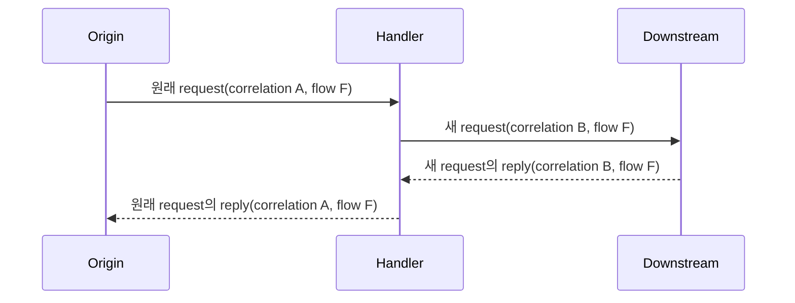

# Request correlation과 causal flow

[공통 스펙 목차](README.ko.md) · [Message model](03-message-model.ko.md) ·
[Message flow tracing](52-message-flow-tracing.ko.md) ·
[Session Actor dispatch](31-session-actor-dispatch.ko.md)

## 1. 범위와 독자

이 문서는 request·reply 연결과 causal message 식별을 정의한다. Application은 식별자를
생성하거나 reply matching에 사용하지 않는다.

`correlation_id`는 request의 terminal reply를 찾는다. `flow_id`는 여러 hop과 fan-out
branch의 공통 원인을 나타낸다. 이 문서는 두 값의 생성, 전파, 소유권과 수명만 소유한다.

Application metadata의 소유권과 크기는 [Message model](03-message-model.ko.md), trace attribute와
sampling은 [Message flow tracing](52-message-flow-tracing.ko.md)이 소유한다. Correlation 값은
Framework reserved context이며 application metadata key가 아니다.

## 2. 두 식별자의 역할

| 식별자 | 범위 | 만드는 주체 | 수명이 끝나는 시점 |
|---|---|---|---|
| `correlation_id` | Request와 그 response 또는 error 한 쌍 | Request origin의 Framework runtime | Request가 terminal 완료될 때 |
| `flow_id` | 한 원인에서 파생된 여러 message와 fan-out branch | Causal root를 처리하는 Framework runtime | 관련 branch의 전파가 끝날 때 |

Framework는 reply matching에 `correlation_id`만 사용한다. `flow_id`는 관측 값이며 중복 제거,
idempotency와 owner 검증에 사용하지 않는다.

Downstream request마다 새 correlation ID를 만든다. 같은 causal flow의 flow ID는 유지한다.
One-way message는 correlation ID가 없어도 된다.

## 3. 형식과 소유권

| 값 | 형식과 범위 |
|---|---|
| `correlation_id` | Framework가 만드는 `1..64 byte` opaque ASCII다. 같은 origin lifecycle의 pending request끼리 unique하다. |
| `flow_id` | Lowercase hyphenated UUIDv7이며 정확히 `36 ASCII byte`다. |
| `flow_origin` | `inbound`, `timer`, `application`, `lifecycle` 중 하나다. Root에서 정한 값을 유지한다. |

Application은 값을 해석하거나 조립하지 않는다.

`flow_id`와 `flow_origin`은 함께 존재하거나 함께 없다. Invalid flow ID, 빈 correlation ID와
불완전한 flow field는 protocol error다.

| 입력 위치 | 실패 |
|---|---|
| Framework message envelope | `RequestProtocolError`로 완료한다. |
| STREAM frame | `ProtocolError`로 연결을 종료한다. |

## 4. Flow를 만드는 시점

Valid inbound flow ID는 그대로 사용한다. Tracking이 활성화되어 있고 ID가 없으면 다음
causal root에서 새 flow ID를 만든다.

- STREAM, Node direct, Channel, Spot direct, Instance Spot direct와 Actor inbound
- Timer callback과 lifecycle callback
- Framework callback 밖의 application code가 시작한 첫 outbound operation

Diagnostics level이 `off`이면 새 flow ID를 만들지 않는다. Inbound ID는 level과 관계없이
보존한다. Client connector의 outbound request는 flow ID를 만든다.

Framework는 callback 시작에 flow context를 설정한다. Terminal completion에는 이전 context를
복원한다.

## 5. 전파 규칙

Framework는 인과 관계가 이어지는 operation에 flow ID와 root origin을 함께 전달한다.

| 경계 | 보존 범위 |
|---|---|
| Node direct와 Channel | 선택한 RouteMesh 또는 ClientServer target의 handler context까지 보존한다. |
| Spot direct | Target Spot의 application turn까지 보존한다. |
| Instance Spot direct | Source resolve, activation envelope, target claim과 activation barrier를 지나 첫 application turn까지 보존한다. |
| Actor direct와 STREAM Actor dispatch | Target Actor queue와 request reply까지 보존한다. |
| Actor relocation | Relocation control과 target Actor의 관련 lifecycle 작업까지 보존한다. |
| Bound-session push | 현재 Actor operation에서 파생된 push까지 보존한다. |
| Logical Multicast와 classic fanout | 모든 remote와 local branch가 같은 flow ID를 사용한다. |

Fan-out branch는 root flow ID를 유지한다. Target identity나 local sequence로 branch를 구분한다.

Relay는 원래 correlation ID를 terminal reply까지 보존한다. 새 downstream request는 새
correlation ID와 current flow ID를 사용한다.

Instance Spot의 첫 target이 생성 권한을 얻지 못하면 Ready owner로 한 번 전달할 수 있다.
원래 두 ID를 유지한다. Target queue가 수락한 뒤에는 자동 재전송하지 않는다.

## 6. Async 작업과 execution context

Framework가 await하는 continuation은 flow context를 보존한다. Detached task, 별도 executor와
외부 callback은 암묵적 전파 대상이 아니다. 명시적 context가 없으면 새 application flow다.

Async-local context가 안전하지 않은 언어는 context capture 표면을 제공한다. Process-global
변수, thread ID와 mutable connector field로 flow를 추정하지 않는다.

Downstream terminal completion은 원래 activation에 한 번만 전달한다. Generation이 바뀌거나
owner가 종료되면 stale 결과로 끝낸다. Timeout, cancellation과 늦은 reply는 재dispatch나 route
재선택을 일으키지 않는다.

## 7. Reply와 실패

- Response와 error는 request의 correlation ID와 flow ID를 보존한다.
- Timeout이나 cancellation 뒤 도착한 reply를 다른 pending request에 연결하지 않는다.
- Stale session binding의 STREAM reply와 push를 새 session flow에 연결하지 않는다.
- Dispatch failure를 기록할 수 있으면 실패한 message의 correlation ID와 flow ID를 보존한다.
- Invalid frame에서 ID를 읽지 못하면 새 ID를 만들어 원래 request처럼 표시하지 않는다.

Flow ID는 retry 허가가 아니다. Retry 여부와 새 correlation ID 발급은 해당 messaging surface의
계약을 따른다.

## 8. 관측과 privacy

Tracing은 `correlation_id`, `flow_id`, `flow_origin`을 기록한다. 정확한 포함 조건과 structured
log key는 [Message flow tracing](52-message-flow-tracing.ko.md)이 정의한다. Metric label에는 세 값을
모두 사용하지 않는다.

두 ID에는 user ID, Actor ID, Spot ID, endpoint, payload와 metadata를 encode하지 않는다.
외부 trace adapter도 Framework ID의 형식과 소유권을 바꾸지 않는다.

## 9. 구현 및 contract test 검증 요구

- Request와 terminal reply가 같은 correlation ID를 사용하고 한 번만 완료된다.
- 같은 causal flow의 Node, Channel, Spot, Actor와 STREAM hop이 같은 flow ID를 사용한다.
- Instance Spot의 resolve, activation envelope, target claim, activation barrier와 첫 handler가
  같은 flow와 correlation을 유지한다.
- 생성 권한을 얻지 못한 target이 Ready owner로 message를 전달해도 새 ID를 만들지 않는다.
- Logical Multicast와 classic fanout의 모든 branch가 root flow ID를 보존한다.
- Tracing을 끈 node도 inbound flow ID를 다음 관련 hop에 전달한다.
- Callback 종료 뒤 관련 없는 callback에 flow context가 남지 않는다.
- Stale session binding과 늦은 reply가 새 correlation에 연결되지 않는다.
- Downstream request는 새 correlation ID를 사용하며 원래 Spot·Actor activation에는 terminal
  completion이 한 번만 전달된다.
- Correlation ID와 flow ID가 metric label이나 application metadata value로 사용되지 않는다.
