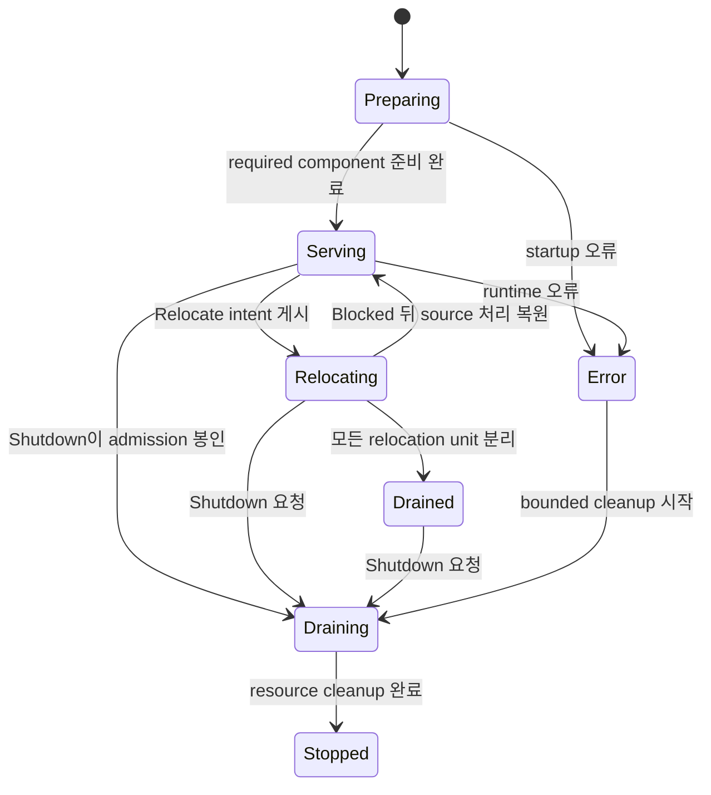
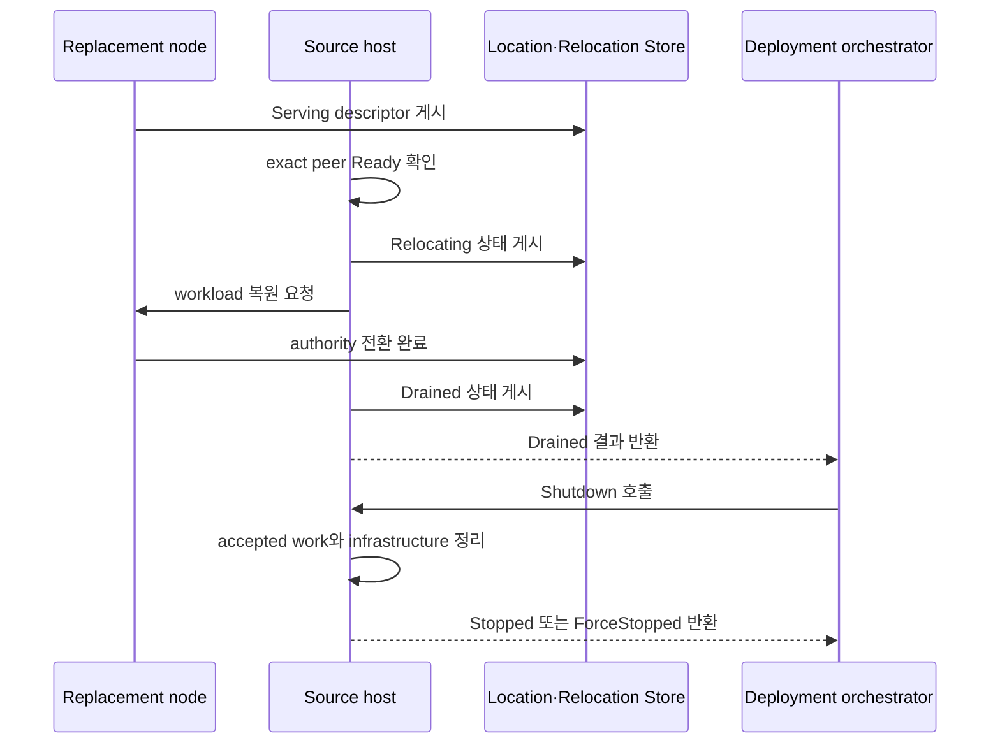

# Host Relocate와 Shutdown

[공통 스펙 목차](README.ko.md) · [Async policy](04-async-execution-policy.ko.md) ·
[Spot과 Actor](23-spot-actor.ko.md) · [Location runtime](40-location-runtime.ko.md) ·
[Relocation Store](42-relocation-store-redis.ko.md) ·
[Runtime monitoring](50-runtime-monitoring.ko.md)

## 1. 이 문서가 답하는 질문

이 문서는 application이 host의 stateful workload를 다른 node로 이전하거나 host를
종료할 때 어떤 operation을 호출하고, Framework가 어떤 순서로 처리하며, 호출이 어떤
결과로 끝나는지를 정의한다.

Application version을 유지한 채 node를 점검하거나 재부팅하려면
`PlannedMaintenance` mode로 `Relocate`를 호출한다. 준비한 새 application version으로
교체하려면 `RollingUpdate` mode로 `Relocate`를 호출한다. 두 mode 모두 성공하면
stateful workload만 source host에서 분리되고 host와 infrastructure 연결은 유지된다.
Application 또는 deployment orchestrator는 이 결과를 확인한 뒤 `Shutdown`을 별도로
호출한다.

Stateful workload의 연속성을 보장하지 않고 host를 종료하려면 `Relocate` 없이
`Shutdown`만 호출한다. Application은 `MeshName`, `ChannelName` 또는 node RID를
지정해 일부 component의 순서를 직접 조립하지 않는다. 두 operation은 host가 소유한
모든 RouteMesh MeshNode, ClientServer server와 fanout publisher를 함께 조정한다.

이 문서는 application이 관찰하는 host lifecycle과 handoff 결과를 소유한다.
Framework가 Location authority와 두 Store를 사용하는 순서는
[40 Location runtime](40-location-runtime.ko.md), generic key/value와 atomic batch를 제공하는
Location Store provider 계약은 [41 Location Store provider](41-location-store-redis.ko.md),
immutable payload를 저장하는 Relocation Store provider 계약은
[42 Relocation Store provider](42-relocation-store-redis.ko.md)가 소유한다. 이 문서는
그 저장 형식을 반복하지 않고, operation의 정확성을 위해 필요한 공개 순서만 정의한다.

## 2. Application이 선택하는 operation

### 2.1 Relocate mode 선택

Caller는 `Relocate`를 호출할 때 mode를 반드시 지정한다. 두 mode의 차이는 target
application version뿐이다. 이후의 queue seal, state 복원, authority 전환과 session
handoff 규칙은 같다.

| 값 | Mode | Caller가 지정하는 값 | Framework가 선택하는 target |
|---:|---|---|---|
| 0 | `PlannedMaintenance` | `TargetApplicationVersion`을 지정하지 않는다. | Source와 application version이 정확히 같은 node만 선택한다. |
| 1 | `RollingUpdate` | Source보다 큰 `TargetApplicationVersion`을 지정한다. | Caller가 지정한 application version과 정확히 같은 node만 선택한다. |

`PlannedMaintenance`의 effective target version은 source의 `ApplicationVersion`이다.
Target version을 함께 지정하면 argument error다. `RollingUpdate`는 target version이
없거나 source version 이하이면 argument error다. Framework는 이런 잘못된 조합을
runtime state와 admission을 변경하기 전에 거부한다.

두 mode 모두 `Deadline`을 생략하면 30초를 사용한다. 명시한 deadline은 0보다 커야
한다.

### 2.2 Public operation

다음 .NET 선언은 공통 계약의 한 표현이다. 다른 언어의 정확한 이름과 signature는
각 언어의 exact interface 문서가 정의한다.

```csharp
public enum ZLinkFrameworkRelocationMode
{
    PlannedMaintenance = 0,
    RollingUpdate = 1
}

public sealed record ZLinkFrameworkRelocationOptions
{
    // 같은 version 점검인지 새 version 배포인지 선택한다.
    public required ZLinkFrameworkRelocationMode Mode { get; init; }

    // RollingUpdate에서만 source보다 큰 exact version을 지정한다.
    public long? TargetApplicationVersion { get; init; }

    // 생략하면 30초를 사용한다.
    public TimeSpan? Deadline { get; init; }
}

public readonly record struct ZLinkFrameworkRelocationResult(
    ZLinkFrameworkRelocationMode Mode,
    long TargetApplicationVersion,
    ZLinkFrameworkRelocationOutcome Outcome,
    ZLinkFrameworkRelocationReason Reason);

public interface IZLinkFrameworkRuntime
{
    // 현재 host lifecycle state와 마지막 결과를 제공한다.
    ZLinkFrameworkRuntimeStatus Status { get; }

    // Host state와 terminal result 변화를 순서대로 관찰한다.
    IAsyncEnumerable<ZLinkFrameworkRuntimeStatus> ObserveAsync(
        CancellationToken cancellationToken = default);

    // Stateful workload를 이전하고 성공하면 Drained 상태로 남는다.
    ValueTask<ZLinkFrameworkRelocationResult> RelocateAsync(
        ZLinkFrameworkRelocationOptions options,
        CancellationToken cancellationToken = default);

    // 새 relocation 없이 accepted work와 host resource를 정리한다.
    ValueTask<ZLinkFrameworkTerminationResult> ShutdownAsync(
        TimeSpan? deadline = null,
        CancellationToken cancellationToken = default);
}
```

Rolling update의 일반적인 호출 순서는 다음과 같다.

```csharp
var relocation = await runtime.RelocateAsync(
    new ZLinkFrameworkRelocationOptions
    {
        // N+1로 준비한 node만 target 후보로 사용한다.
        Mode = ZLinkFrameworkRelocationMode.RollingUpdate,
        TargetApplicationVersion = currentVersion + 1,
        Deadline = TimeSpan.FromSeconds(30)
    },
    cancellationToken);

if (relocation.Outcome == ZLinkFrameworkRelocationOutcome.Drained)
{
    // Relocation 성공을 확인한 뒤 host resource를 별도로 정리한다.
    await runtime.ShutdownAsync(cancellationToken: cancellationToken);
}
```

`Relocate` 결과에는 mode와 effective target version이 항상 포함된다. Target을 찾지
못한 경우에도 caller가 어떤 조건으로 기다렸는지 확인할 수 있도록 같은 값을
보존한다. `Relocate`가 `Blocked`로 끝나면 caller는 다시 시도하거나 continuity 없이
`Shutdown`할 수 있다.

## 3. Host state와 완료 결과

Host lifecycle은 `FrameworkRuntimeState` 하나가 소유한다.

| 값 | State | 의미 |
|---:|---|---|
| 0 | `Preparing` | Registration, bind, descriptor 검증과 recovery를 진행하며 application message를 받지 않는다. |
| 1 | `Serving` | Host가 ready 상태이며 새로운 application work를 받는다. |
| 2 | `Relocating` | 새 placement와 selection에서는 제외됐지만 아직 seal하지 않은 local unit은 message와 timer를 계속 처리한다. |
| 3 | `Drained` | 모든 stateful object가 source dispatch에서 분리됐다. Host와 infrastructure 연결은 유지한다. |
| 4 | `Draining` | `Shutdown`이 새 admission을 닫고 이미 수락한 work와 resource를 정리한다. |
| 5 | `Stopped` | Application resource, infrastructure resource와 listener 정리가 끝났다. |
| 6 | `Error` | Startup 또는 runtime 오류 때문에 service를 제공할 수 없다. |

`IsReady`는 `Serving`에서만 true다. Component lifecycle snapshot은 각 component의
상태를 관찰하는 정보이며 host state를 대신하지 않는다. Component별 `Drain`,
`AwaitDrained`, `Stop` 또는 일부 Mesh만 대상으로 하는 public operation은 제공하지
않는다.



첫 relocation commit 전에 실패하면 tentative 작업을 정리하고 `Serving`으로
돌아간다. Commit 뒤 실패에서도 아직 commit하지 않은 source workload의 처리를
복원할 수 있으므로 host는 `Serving`으로 돌아갈 수 있다. 이때 이미 commit한 unit은
target owner에 남는다. `Serving` 복귀가 모든 unit의 source rollback을 뜻하지 않는다.

Relocation outcome은 다음 값으로 고정한다.

| 값 | Outcome | 허용 reason | 의미 |
|---:|---|---|---|
| 0 | `Drained` | `None` | 모든 stateful object가 source dispatch에서 분리됐다. |
| 1 | `Blocked` | `TargetUnavailable`, `StoreUnavailable`, `RelocationDisabled`, `StateIncompatible`, `DeadlineExceeded`, `RelocationFailed`, `RuntimeNotReady`, `ManualTopologyUnsupported`, `ShutdownRequested`, `OperationInProgress` | Relocation을 시작할 수 없거나 전체 workload 이전을 끝내지 못했다. |

Wire 값은 `Drained=0`, `Blocked=1`이다. Reason은 `None=0`,
`TargetUnavailable=1`, `StoreUnavailable=2`, `RelocationDisabled=3`,
`StateIncompatible=4`, `DeadlineExceeded=5`, `RelocationFailed=6`,
`RuntimeNotReady=7`, `ManualTopologyUnsupported=8`, `ShutdownRequested=9`,
`OperationInProgress=10`이다. 정의하지 않은 outcome과 reason 조합은 protocol
오류다.

Shutdown outcome은 `Stopped=0`, `ForceStopped=1`이고 reason은 `None=0`,
`DeadlineExceeded=1`, `TeardownFailed=2`다. `ForceStopped`는 별도 host state가
아니다. Bounded teardown으로 정리를 끝낸 결과이며 host state는 `Stopped`다.
Relocation 실패는 relocation result가 소유하고 termination reason에 섞지 않는다.

## 4. Target을 선택하기 전에 확인하는 조건

`Serving`에서 시작한 `Relocate`는 host state와 application admission을 바꾸기 전에
host 전체를 한 번에 검사한다. 이때 unit을 seal하거나 최종 target reservation을
만들지 않는다.

| 검사 항목 | 통과 조건 |
|---|---|
| Inventory 경쟁 | 새 object 생성, join, Instance placement, session binding과 inbound relocation의 순서를 inventory와 확정한다. |
| Local workload | 모든 MeshNode의 Actor, Spot, timer, session과 진행 중인 infrastructure operation을 확인한다. |
| Durable provider | Location authority, 필요한 Relocation Store와 target descriptor lease를 사용할 수 있다. |
| Unit 호환성 | Standalone Actor, User Spot aggregate와 Instance Spot의 policy, Snapshot adapter와 target capacity가 호환된다. |
| Topology | Host가 사용하는 service topology가 automatic discovery만 사용한다. |

Manual RouteMesh peer, ClientServer client endpoint, fanout subscriber endpoint 또는
descriptor를 게시하지 않는 manual fanout publisher가 하나라도 등록돼 있으면
`Blocked/ManualTopologyUnsupported`다. 현재 연결 여부가 아니라 registration을
검사한다. Automatic component가 listener 주소를 명시적으로 bind하는 설정은 manual
topology가 아니다.

Runtime이 확인하는 범위는 local registration이다. 다른 process가 Framework 밖에서
만든 connection까지 확인하지 않으므로, 참여 process 전체가 automatic discovery만
사용한다는 조건은 deployment가 보장한다.

## 5. Mode별 exact target 선택

Framework는 다음 순서로 target을 좁힌다.

| 순서 | 조건 |
|---:|---|
| 1 | `PlannedMaintenance`는 source와 정확히 같은 version만 남긴다. `RollingUpdate`는 caller가 지정한 exact version만 남기며 더 낮거나 높은 다른 version도 제외한다. |
| 2 | Source가 아니며 `Serving` 상태인 Object Server만 남긴다. |
| 3 | Stable type, relocation policy와 Snapshot adapter가 호환되는 node만 남긴다. |
| 4 | Bounded capacity가 있고, source에 maintenance wave가 있으면 다른 wave인 node만 남긴다. |
| 5 | Complete descriptor snapshot과 Core peer table에서 같은 RID와 lifecycle generation이 `Admitted`이고 `Ready`인 node만 남긴다. |

Version filter는 capacity와 placement weight보다 먼저 적용한다. 따라서 다른 version
node의 여유 capacity나 높은 weight는 선택 결과에 영향을 주지 않는다. 남은 eligible
target이 여러 개일 때만 node-wide placement weight를 적용한다.

Descriptor가 게시됐거나 connect intent가 만들어진 것만으로 target이 ready라고
판단하지 않는다. Complete snapshot이 비어 있거나 source 자신만 포함하거나 모든
remote peer가 draining이면 replacement가 없는 상태다.

### 5.1 Target이 아직 없을 때

요청한 exact version의 target이 없으면 source state와 admission을 유지한 채
deadline까지 descriptor와 Core peer table의 수렴을 기다린다. 여러 Mesh를 가진
process는 모든 Mesh에서 조건을 만족해야 한다. Deadline까지 target을 확보하지 못하면
tentative coordination을 정리하고 `Blocked/TargetUnavailable`을 반환한다.



`Drained`에서는 descriptor, connection, listener와 infrastructure resource를 유지한다.
이 다이어그램은 target이 준비된 정상 흐름이다. Target이 없으면 앞 절의 deadline 규칙으로
`Blocked/TargetUnavailable`을 반환한다.

Automatic ClientServer client와 fanout subscriber는 replacement descriptor로 새
connection을 만들고 source 상태를 selection에 반영한다. Accepted work와 barrier가
남은 기존 connection은 descriptor 변화만으로 즉시 닫지 않는다.

## 6. Concurrent 호출과 cancellation

| 상황 | 결과 |
|---|---|
| Mode와 effective target version이 같은 concurrent `Relocate` | 최초 operation과 deadline을 공유한다. 뒤의 호출은 deadline을 바꾸지 않는다. |
| Mode 또는 effective target version이 다른 concurrent `Relocate` | 기다리지 않고 `Blocked/OperationInProgress`다. |
| `Blocked` 뒤 다시 `Relocate` | `Blocked`는 저장하지 않으므로 새 preflight를 시작한다. |
| `Drained`에서 다시 `Relocate` | 최초 `Drained/None`의 mode와 effective target version을 반환한다. |
| Concurrent `Shutdown` | 같은 operation을 공유하고 terminal result를 저장한다. |
| `Stopped`에서 다시 `Shutdown` | 저장한 결과를 반환한다. 없으면 새 작업 없이 `Stopped/None`이다. |
| `Preparing`, `Error` 또는 `Stopped`에서 `Relocate` | Admission을 바꾸지 않고 `Blocked/RuntimeNotReady`다. |

Caller cancellation은 해당 waiter만 끝내며 shared operation은 취소하지 않는다.
`Shutdown`은 `Preparing`에서 startup을 중단하고 `Error`에서는 bounded cleanup을
시작한다.

## 7. Relocation unit과 실행량 제한

| Relocation unit | 경계 |
|---|---|
| User Spot aggregate | User Spot과 seal 시점의 member Actor 전체 |
| Standalone Actor | User Spot aggregate에 속하지 않는 Actor 하나 |
| Instance Spot | Actor membership이 없는 Spot 하나 |

Entry Spot 자체는 이전하지 않는다. Source Entry Spot의 Actor는 standalone unit으로
target node의 새 Entry Spot에 이전한다.

Coordinator는 unit queue에 infrastructure notification을 예약하고, 현재 application
turn이 끝난 경계에서 permit을 얻은 unit부터 sliding window로 진행한다. Notification은
application callback이나 readiness 응답을 요구하지 않는다. 모든 permit을 즉시 얻지
못하면 일부를 보유하지 않고 notification을 다시 예약한다. Seal하지 않은 unit은
message와 timer를 계속 처리한다.

`SpotWide` User Spot은 공유 gate에서 준비한다. `PerActor` User Spot은 Spot lane,
모든 member Actor lane과 timer lane이 같은 barrier generation에 도착해야 한다.
`Yield` 뒤에도 Actor FIFO claim이 남은 callback은 도착한 것으로 보지 않으며 일부
participant만 먼저 seal하거나 capture하지 않는다.

Process별 기본 상한은 다음과 같다.

| Resource | 기본 상한 |
|---|---:|
| Active outbound relocation unit | 64 |
| Active inbound relocation unit | 64 |
| Encoded payload in-flight | 256 MiB |
| Concurrent `Capture` callback | 8 |
| Concurrent `Restore` callback | 8 |

Location option 변경은 새 attempt부터 적용한다. Callback permit은 unit·byte permit과
독립적이다. Seal 전 reservation은 Snapshot participant별 최대 64 MiB와 queue,
journal, timer, manifest, metadata, framing의 encoded upper bound를 합친 값이다.
Application size estimate는 받지 않는다. `Capture` 뒤 actual size로 줄일 수 있지만
늘릴 수 없고, adapter가 64 MiB를 넘으면 `Blocked/StateIncompatible`다.

256 MiB보다 큰 User Spot aggregate는 빈 payload window에서 하나만 진행한다. Actual
size가 줄어도 permit을 반환할 때까지 exclusive 상태를 유지한다. Standalone Actor와
Instance Spot은 설정한 byte gate 안에서만 진행한다.

## 8. Unit 하나를 이전하는 순서

Framework는 현재 실행 중인 turn까지만 완료하고 다음 turn 전에 unit을 seal한다.

1. Source outbound unit, target inbound unit, 필요한 `Capture`와 `Restore`, payload
   byte permit을 한 번에 확보한다.
2. Framework는 application ingress, timer dispatch와 시작하지 않은 continuation을
   같은 barrier generation에서 seal한다.
3. Framework는 아직 실행하지 않은 message, accepted journal, timer registration과
   pending tick을 고정한다. `Snapshot` policy이면 adapter의 `Capture`가 반환한
   application state도 포함한다.
4. Target은 factory와 `Restore`를 실행하고 target admission을 닫은 상태로 복원
   결과를 준비한다.
5. Framework는 준비된 immutable payload를 검증한 뒤 Location authority에서 owner와
   membership을 한 번에 공개한다. 저장 primitive와 실패 복구는
   [40 Location runtime](40-location-runtime.ko.md), payload 저장 방식은
   [42 Relocation Store](42-relocation-store-redis.ko.md)가 정의한다.
6. Framework는 source의 durable cleanup과 relocation completion을 끝내고 session
   route와 timer를 target 기준으로 정규화한다.
7. Target이 정상 처리에 필요한 조건을 모두 확인한 뒤 admission을 열고 permit을
   반환한다.

| Policy | 처리 |
|---|---|
| `Disabled` | 해당 object가 남아 있으면 `Blocked/RelocationDisabled`다. |
| `Recreate` | 같은 logical ID로 target factory를 실행하고 application state 없이 accepted journal과 recovery payload를 이전한다. |
| `Snapshot` | Adapter의 opaque bytes를 저장하고 target factory instance에 `Restore`한다. Application이 format, version과 migration을 관리한다. |

Framework는 별도 state contract ID나 generic state type을 추가하지 않는다.

User Spot은 Spot과 seal 시점의 member Actor 전체를 하나의 aggregate로 처리한다.
Participant 하나라도 policy, adapter 또는 target 조건을 만족하지 못하면 commit 전에
aggregate 전체를 차단한다. Aggregate ID는 non-zero 128-bit다.

Participant 총수에는 1,024개 상한을 두지 않는다. Framework는 전체 목록을 Location
Store의 immutable inventory chunk로 나눈다. Chunk 하나는 최대 1,024개이며 encoded
크기는 최대 1 MiB다. 모든 chunk의 count와 digest를 검증한 뒤 aggregate authority의
owner, generation과 inventory root를 한 번의 CAS로 바꾼다. 이 시점부터 Spot과 모든
member Actor가 새 owner를 따른다. 일부 membership만 먼저 공개하지 않는다.

Entry Spot member Actor는 commit 뒤 target의 `OnActorRelocated`와 source의
`OnLeaveActor`를 호출한다. 실패하면 rollback하지 않고 current authority에서
재시도한다. Target admission은 callback과 journal replay가 끝날 때까지 닫는다.
Source callback을 실행할 수 없으면 durable cleanup이 완료를 대신한다. User Spot
aggregate는 membership이 유지되므로 join·leave·relocation callback을 호출하지 않는다.

Cross-node Actor join도 같은 policy와 adapter를 사용하지만 정확한 lifecycle은
[23 Spot Actor](23-spot-actor.ko.md)가 소유한다. Same-node join은 adapter를 호출하지
않는다. Instance Spot maintenance relocation은 hidden create를 시작하지 않는다.

## 9. Queue, timer와 session handoff

| Resource | Handoff 계약 |
|---|---|
| Seal 뒤 ingress | 최대 1,024 record와 encoded 16 MiB를 source hold에 보관한다. Commit하면 operation ID와 generation을 유지해 target에 relay하고, abort하면 arrival order로 source queue에 되돌린다. |
| Hold 초과 | Request는 retry 가능한 `SpotMoving`, one-way operation은 moving drop으로 끝난다. Framework는 새 operation ID로 숨은 재제출을 하지 않는다. |
| Timer | Runtime handle과 continuation은 이전하지 않는다. Logical registration, 다음 실행 시각과 pending tick을 이전하며 target이 queue 순서에 맞춰 자동 복원한다. Application은 timer를 중복 capture하거나 restore에서 다시 등록하지 않는다. |
| Bound session | Physical STREAM은 유지한다. 같은 `ObjectGeneration`에서 해당 Actor의 binding route, relay authority와 generation만 target 기준으로 갱신하고 ACK를 기다린다. 다른 Actor route는 바꾸지 않는다. |

Stale-route forwarding도 operation identity와 authority generation fence를 유지한다.
Session route 정규화 전에는 target packet·push admission을 열지 않고 stale packet과
reply를 거부한다. 새 Actor incarnation은 application이 다시 bind해야 한다. 자세한
route 순서는
[31 Session Actor dispatch](31-session-actor-dispatch.ko.md#5-actor-relocation-route-barrier)가 정의한다.

Instance Spot의 `Close`와 relocation은 같은 authority commit에서 순서를 정한다.
`Closing`이 먼저면 close를 완료하고 이전하지 않는다. Relocation이 먼저면 늦은
`Close`는 moving 결과이며 자동 재제출하지 않는다.

## 10. Relocate 완료와 실패

모든 unit이 source dispatch에서 분리되고 ingress hold가 commit 또는 abort로
정리되면 host는 `Drained`로 전환하고 `Drained/None`을 반환한다. Descriptor lease,
listener, peer connection과 raw transport resource는 이때 정리하지 않는다.

| 발생 시점과 원인 | 결과 |
|---|---|
| Exact target이 deadline까지 준비되지 않는다. | `Blocked/TargetUnavailable` |
| Store read, write 또는 lease 확인이 첫 commit 전에 실패한다. | Reversible 작업을 정리하고 `Blocked/StoreUnavailable` |
| `Disabled` policy가 남아 있다. | `Blocked/RelocationDisabled` |
| Version, type 또는 Snapshot adapter가 호환되지 않거나 허용한 attempt에서 `Capture`와 `Restore`가 모두 실패한다. | `Blocked/StateIncompatible` |
| Framework가 deadline 때문에 callback을 취소하거나 일반 precommit 작업이 deadline을 넘는다. | `Blocked/DeadlineExceeded` |
| 첫 commit 뒤 authority 또는 relocation payload 진행이 실패한다. | 현재 unit을 terminal 상태로 복구하고 `Blocked/RelocationFailed` |

첫 commit 전 실패는 tentative state를 정리하고 source authority, queue와 admission을
복원한다. 첫 commit 뒤 실패는 현재 unit을 published authority 기준으로 terminal
상태까지 확정한다. Commit한 owner와 membership은 rollback하지 않고, 남은 source
workload만 복원한 뒤 host를 `Serving`으로 전환한다.

Published payload의 permanent missing, checksum mismatch 또는 inventory digest
mismatch는 non-retriable `RelocationDataLost`다. 이전 payload를 추측하거나 source로
rollback하지 않는다. 판정과 recovery는
[42 Relocation Store](42-relocation-store-redis.ko.md)가 정의한다.

일부 MeshNode의 `Relocating` descriptor write를 확인하지 못하면 전체를
`Serving`으로 되돌린다. 모든 rollback을 확인해야
`Blocked/StoreUnavailable`이다. 하나라도 확인할 수 없으면 admission을 닫고 bounded
cleanup 뒤 `ForceStopped/TeardownFailed`로 끝낸다.

## 11. Shutdown과 Relocate의 경쟁

`Shutdown`은 target, policy, capacity 또는 Relocation Store 부재로 차단되지 않는다.
먼저 admission seal로 새 업무를 막는다. Continuity를 보장하지 않고 다음 순서로
유한 완료한다.

1. Host를 `Draining`으로 바꾸고 신규 application admission과 relocation reservation을
   닫는다.
2. `Draining` descriptor를 게시해 새 selection과 placement에서 제외한다.
3. 이미 수락한 handler, request completion, relocation unit과 session barrier를
   deadline까지 처리한다.
4. 새 object relocation은 시작하지 않는다. Actor membership과 local instance가
   유효한 상태에서 모든 Entry, User, Instance Spot에 `HostShutdown` closing context를
   전달한다. Actor별 closing callback은 호출하지 않는다.
5. Spot callback 뒤 local Actor와 Spot scope, owner record, descriptor, listener와
   transport를 순서대로 정리한다.
6. Deadline 안에 끝나면 `Stopped/None`, 끝나지 않으면 bounded teardown 뒤
   `ForceStopped/DeadlineExceeded` 또는 `ForceStopped/TeardownFailed`로 끝난다.

| 먼저 확정된 operation | 처리 |
|---|---|
| `Shutdown` seal | Relocation reservation을 해제하고 waiter를 `Blocked/ShutdownRequested`로 끝낸다. |
| `Relocating` publication | 현재 unit만 terminal 상태까지 확정하고 나머지는 시작하지 않는다. Published authority를 보존하며 waiter는 `Blocked/ShutdownRequested`다. |

`Drained`의 `Shutdown`은 accepted work와 infrastructure만 정리한다. `Serving`에서
바로 호출하면 object를 이전하지 않는다.

`Draining` 동안 descriptor와 owner lease를 계속 renew한다. Accepted request,
relocation과 session barrier가 사용하는 authority fence를 잃지 않기 위해 barrier가
끝난 뒤에 lease를 release한다. Cleanup 순서는 다음과 같다.

1. Actor membership과 local instance를 유지한 채 Spot closing callback을 끝내고 local
   scope를 정리한다.
2. Current authority를 가진 source만 owner와 relocation participant record를
   advance하거나 release한다.
3. MeshNode, ClientServer server와 fanout publisher descriptor와 owner lease를
   release한다.
4. Peer connection, listener, executor와 binding transport를 닫는다.

표준 cooperative cancellation을 지원하는 언어는 Spot closing callback에 남은
deadline의 cleanup signal을 전달한다. Accepted handler의 token은 재사용하지 않는다.
Callback exception은 `ForceStopped/TeardownFailed`, deadline 만료는
`ForceStopped/DeadlineExceeded`다. Hardware failure와 `SIGKILL`에서는 callback을
보장하지 않으며 owner recovery는 [40 Location runtime](40-location-runtime.ko.md)을
따른다.

## 12. State별 admission

| 공개 기능 | `Relocating` | `Drained` | `Draining` |
|---|---|---|---|
| ChannelName select-one | 새 selection에서 제외하지만 기존 direct owner route는 유지한다. | 새 selection에서 제외하고 infrastructure 연결은 유지한다. | 새 admission을 닫고 이미 제출한 operation만 terminal 상태까지 처리한다. |
| Logical Multicast | 새 target snapshot에서 제외하고 이미 수락한 제출은 유지한다. | 새 target snapshot에서 제외한다. | 새 admission을 닫고 이미 수락한 제출만 처리한다. |
| Node direct application request | 기존 owner request는 unit seal 전까지 수락한다. | Local stateful owner가 없으므로 새 request를 받지 않는다. | 새 request를 shutdown 결과로 끝낸다. |
| Node direct infrastructure control | Relocation, completion, binding과 recovery control을 계속 수락한다. | Monitoring과 shutdown control을 계속 수락한다. | Termination barrier에 필요한 control만 deadline까지 수락한다. |
| Spot·Actor direct | Unit seal 전까지 payload와 timer를 계속 처리한다. | Local stateful owner가 없으므로 새 payload를 받지 않는다. | 새 payload를 거부하고 이미 수락한 turn만 처리한다. |
| Spot·Actor create와 join | 새 owner와 membership admission을 거부한다. | 같은 거부를 유지한다. | 같은 거부를 유지한다. |
| Instance Spot placement | 새 target claim에서 제외하고 기존 direct route는 seal 전까지 유지한다. | 새 target claim에서 제외한다. | Seal 전에 수락한 activation만 terminal 상태까지 처리한다. |
| STREAM | 새 binding에서 제외하고 기존 session은 unit barrier로 처리한다. | 새 binding에서 제외하고 infrastructure connection은 유지한다. | 새 session을 받지 않고 pending reply와 binding barrier만 처리한다. |
| ClientServer server | 새 selection에서 제외하고 accepted handler와 reply route를 유지한다. | Service connection은 유지하지만 새 selection에서 제외한다. | Handler admission을 닫고 accepted request의 reply route만 유지한다. |
| Classic fanout publisher | 새 automatic subscriber connection을 만들지 않고 accepted event를 처리한다. | Infrastructure는 유지하지만 새 publish admission을 받지 않는다. | Publish admission을 닫고 accepted event만 처리한다. |

이미 수락한 request는 reply, error, timeout 또는 shutdown 중 하나로 한 번만 끝난다.
Application callback이 대기해도 infrastructure execution은 request completion, peer
lifecycle, recovery와 session binding을 계속 진행한다. Observer와 monitoring
callback은 maintenance를 막는 claim을 소유하지 않는다.

## 13. 관측 정보

State와 relocation result 변화는 `zlink.runtime.host.relocation_changed`, shutdown
result 변화는 `zlink.runtime.host.termination_changed`로 관찰한다. Terminal event는
observer overflow로 잃지 않는다. Relocation event와 제한된 개수의 진단 상태에는
mode와 effective target version을 포함한다. Version을 metric label로 추가하지 않는다.

Host state와 terminal 결과는 host status와 structured log에서 확인한다. 집계가 필요하면
host state, relocation mode·outcome·reason과 shutdown outcome·reason을
[51 Runtime metrics](51-runtime-metrics.ko.md#5-host-relocation과-shutdown)가 정의한
계기로 기록한다. Object relocation 계기와 host-wide operation 계기는 서로 다른 이름을 사용한다.

Metric label에는 Actor ID, Spot ID, node RID, endpoint, session ID와 relocation ID를
넣지 않는다. 개별 blocker와 relocation 상태는 개수를 제한한 진단 조회와 trace에서
확인한다. Telemetry provider failure는 operation 진행을 막지 않는다. 전체 관측
계약은 [50 Runtime monitoring](50-runtime-monitoring.ko.md)과
[51 Runtime metrics](51-runtime-metrics.ko.md)가 소유한다.

## 14. Contract test 검증 요구

| 범위 | 반드시 검증할 항목 |
|---|---|
| Mode와 target | Planned maintenance는 같은 version만, rolling update는 요청한 더 높은 exact version만 선택하는지 검증한다. Version을 capacity와 weight보다 먼저 적용하고, 같은 wave를 제외하며, 모든 Mesh에서 exact Core peer가 ready일 때만 진행해야 한다. Target이 없으면 기다리고 manual topology이면 차단해야 한다. |
| Lifecycle | Preflight가 막히면 `Serving`을 유지하고, 성공하면 infrastructure를 유지한 `Drained`가 되는지 검증한다. `Shutdown`은 별도로 호출하며 기본 deadline은 30초다. Caller cancellation은 waiter만 끝내고 잘못된 runtime state에서는 admission을 바꾸지 않아야 한다. |
| Concurrency | 같은 option의 relocation과 concurrent shutdown은 각각 하나의 operation을 공유하는지 검증한다. 다른 relocation option은 `OperationInProgress`, relocation 중 shutdown은 `ShutdownRequested`로 끝나며 terminal result를 반복 호출해도 같은 값을 반환해야 한다. |
| Unit gate | Outbound 64, inbound 64, payload 256 MiB, `Capture`와 `Restore` 각각 8, participant별 64 MiB를 검증한다. Permit은 한 번에 모두 얻어야 하며 oversized aggregate는 다른 payload가 없을 때 하나만 실행해야 한다. |
| Handoff | User Spot aggregate를 한 번에 commit하고 queue, journal, timer와 pending tick을 함께 이전하는지 검증한다. Hold는 1,024 record와 16 MiB를 넘지 않으며 timer를 자동 복원하고 session route ACK 뒤 admission을 열어야 한다. Instance Spot을 숨겨서 새로 만들면 안 된다. |
| Failure | Commit 전에는 source를 복원하고 commit 뒤에는 published authority를 기준으로 복구하는지 검증한다. 정확한 `Blocked` reason을 반환하고 terminal result를 한 번만 완료하며 descriptor rollback을 확인할 수 없으면 bounded teardown을 수행해야 한다. |
| Cleanup과 관측 | Barrier가 끝날 때까지 lease를 갱신하고 accepted request를 한 번만 완료하는지 검증한다. Callback failure를 정해진 reason으로 분류하며 state, outcome, reason, event와 metric이 wire 값과 일치해야 한다. Topology cleanup은 다른 authority를 변경하면 안 된다. |
