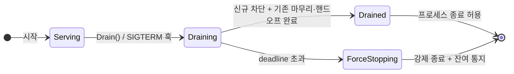

[스펙 목차](README.ko.md) | [이전: 메시지 흐름 상관관계 (Flow Correlation)](53-flow-correlation.ko.md) | [다음: Framework 언어별 구현 차이](90-implementation-gap.ko.md)

# Graceful Drain & Handoff 수명주기 계약

> **구현 상태:** 목표 계약은 이 문서에 고정되어 있으며 현재 구현과의 차이는
> [구현 차이](90-implementation-gap.ko.md)와 구현 계획에서 추적한다. [location runtime](40-location-runtime.ko.md)의
> typed `Draining` 필드와 STREAM 계층의 `session-closing` 제어 프레임을 모든 언어가 같은 의미로
> 구현해야 한다.

이 문서는 stateful 노드가 **우아하게 종료(graceful shutdown)**하거나 무중단 롤아웃을 위해
비워질 때, 무슨 일이 어떤 순서로 일어나는지를 정하는 언어 중립 공통 계약이다. 이것은 **런북이
아니라 계약**이다 — 배포 자동화(예: Kubernetes `preStop`)가 훅을 걸 수 있도록 framework가 노출하는
API와 상태 기계를 정의한다. 환경별 배포 매니페스트·grace period 값·용량 산정·대시보드는 이 문서의
범위가 아니다(팀의 몫). 네이밍은 [framework API](05-framework-api.ko.md)의 언어별 표현 원칙을 따른다.

## 1. 목적과 성격

무상태 서버는 그냥 죽여도 된다. 그러나 stateful 노드(라이브 SPOT 룸 + 바인딩된 actor + 활성 STREAM
세션을 가진 SpotNode)는 `SIGTERM` 즉시 종료 시 **접속 유저가 전부 튕기고 진행 중 룸이 유실**된다.

framework가 제공하는 것은 **v1 인스턴스의 우아한 종료(drain)**다 — v2 롤아웃(교체) 자체는 배포
오케스트레이터의 일이고, drain은 그 롤아웃이 무중단이 되게 하는 한쪽 절반이다. drain은 "새 배정은
막고, 기존 상태는 옮기거나 마무리하고, 다 끝나면 나간다"를 **명시적 계약**으로 정의한다.

## 2. 수명주기 상태 기계



| 상태 | 의미 | 배치 후보 | owner lease |
|------|------|:---------:|:-----------:|
| `Serving` | 정상 서비스 | O | 갱신 |
| `Draining` | 신규 차단, 기존 마무리·핸드오프 진행 | **X** | **계속 갱신**(§3.3) |
| `Drained` | 마무리 완료, 종료 안전 | X | 제거 직전 |
| `ForceStopping` | grace deadline 초과 → 강제 종료 | X | 제거 |

현재 상태는 `zlink.drain.state` observable gauge의 닫힌 `state` label과 lifecycle 이벤트로 관측한다(§9).

## 3. location runtime 상호작용 (P0 핵심)

drain의 정확성은 [location runtime](40-location-runtime.ko.md)과의 상호작용에 달려 있다. 이 절이 이
계약의 가장 미묘한 부분이다.

### 3.1 "연결 유지 + 배치 제외"의 분리 — draining 마커

**순진한 구현의 자기모순:** Draining 진입 시 이 노드의 peer row를 **삭제**하면, [location-runtime
§6](40-location-runtime.ko.md)의 자동 연결 diff가 이 peer로의 연결을 **끊는다**. 그러면 §5의
"in-flight reply까지 마무리"와 actor transfer commit·핸드오프 메시징이 전부 깨진다. 즉 peer row
삭제로는 "신규 배정 제외"와 "기존 연결 유지"를 동시에 만족할 수 없다.

**계약:** location runtime peer row의 typed `Draining: bool` 필드 하나를 사용한다. 기본값은
`false`이고 drain 진입 시 `true`로 갱신한다. `Metadata`, `Capabilities` 또는 언어별 임의 key에 같은
상태를 중복 기록하지 않는다. row codec과 store schema가 이 필드를 소유한다. 마커는 **연결을 유지한
채 배치에서만 제외**한다. lease renew와 registration writer는 현재 `Draining` 값을 보존하며 drain이
시작된 generation을 `false`로 되돌릴 수 없다.

**마커를 읽는 결정 지점**은 둘이다. 그 밖의 경로는 marker를 읽지 않으므로 혼동하지 않는다.

| 결정 지점 | 동작 |
|-----------|------|
| **drain handoff 대상 노드 선택** | actor를 넘겨받을 후보에서 draining peer를 제외한다(§4) |
| **remote user Spot으로의 actor join** | 대상 노드의 peer row가 draining이면 join을 거부한다 |
| **local drain admission gate** | drain에 들어간 노드는 신규 actor·spot·session admission을 스스로 차단한다 |
| **자동 연결 diff([location-runtime §6](40-location-runtime.ko.md))** | **마커만으로 disconnect하지 않음**(연결 유지) |

**marker를 읽지 않는 경로:**

- **spot `GetOrCreate`는 클러스터 배치 API가 아니다.** 호출한 프로세스가 등록한 로컬 SpotNode에서
  spot을 만든다. 노드 선택 자체가 없으므로 marker도 weight도 보지 않는다.
- **Entry Spot join은 호출자가 target node rid를 지정한다.** framework가 후보를 고르지 않는다.
- **기존 owner routing**은 actor/spot row의 owner 주소를 그대로 쓴다. 이미 그 노드에 있는 대상에
  보내는 것이므로 배치 결정이 아니다.

### 3.2 `Draining` 마커와 socket `Weight`는 다른 장치다

둘 다 존재하지만 목적과 발동 경로가 다르다. 하나로 다른 하나를 대체할 수 없다.

| 축 | 무엇을 하나 | 누가 읽나 |
|----|-------------|-----------|
| **`Draining` 마커**(이 문서) | **graceful drain lifecycle**을 구성한다. 마커 전파를 기다린 뒤 admission을 차단하고 actor handoff·spot 정리·in-flight 완료 대기·session drain·owner 정리를 순서대로 수행한다 | §3.1의 결정 지점, drain executor |
| **socket `Weight`**(0..100) | **transport 계층의 부하 가중치**다. core 소켓의 load balancing 후보와 rid 지정 routed send의 수락 여부를 정한다 | core 소켓 |

**`Weight` 변경의 전파는 원자적이지 않다.** 런타임에 server socket weight를 바꾸면 ① core 소켓에
즉시 반영되고 ② 연결된 peer에 **비동기로** 전달되며 ③ location auto-connect가 구성된 경우
peer row의 `Weight`는 **다음 reconcile에서** 갱신된다. 따라서 local getter가 0을 돌려줬다고 해서
모든 client에 전파가 끝난 것은 아니다 — 전파 완료를 확인하려면 실제 트래픽으로 관측해야 한다.

`Weight = 0`인 peer는 core의 load balancing 후보에서 빠지고, **rid를 지정한 routed send도
거부된다.** 즉 신규 request 유입을 막는 **transport 게이트**로는 유효하다. 그러나 `Weight = 0`은
**graceful drain lifecycle을 시작하지 않는다** — `Draining` 마커, readiness, `zlink.drain.state`
gauge, drain lifecycle event를 아무것도 바꾸지 않는다. actor handoff도 일어나지 않는다.

**노드를 실제로 비우려면 `Draining` 마커 기반 drain lifecycle을 써야 한다.** `Weight = 0`은 그
앞뒤에서 channel 부하를 빼는 보조 수단이다.

### 3.3 owner lease는 Draining 동안 계속 갱신한다

핸드오프는 곧 location row의 소유권 이동이다. [location-runtime §2.5](40-location-runtime.ko.md)에서
owner lease heartbeat(기본 5s)가 끊기면 TTL(기본 15s) 후 **그 owner의 전 row가 stale**이 되어
핸드오프 중 라우팅이 붕괴한다. 따라서:

1. **Draining ~ Drained 동안 owner lease heartbeat를 계속 갱신**한다. drain이 lease 갱신을 멈추면 안
   된다.
2. 핸드오프 완료 단위마다 대상 row는 target owner가 `Takeover`로 이전한다([location-runtime
   §3.1/§4](40-location-runtime.ko.md)의 계획된 이동 = deactivate-first + `Takeover`).
3. workload 정리가 끝나면 `RemoveOwnerLease` + owner별 일괄 row 제거를 완료한다([location-runtime
   §3.2](40-location-runtime.ko.md)의 "owner 자신의 shutdown 경로"). 이때까지 store와 lease runtime을
   유지한다.
4. row/lease 정리가 성공한 뒤에만 `Drained`로 전이하고 terminal result를 완료한다. 실패가 deadline까지
   계속되면 `ForceStopping` 정리 경로를 거쳐 `ForceStopped`를 반환한다.

### 3.4 readiness flip의 전파 지연 — 정직한 상한

peer의 store 관찰은 polling(기본 1s)+k8s probe 주기라, 마커를 세운 뒤에도 **수 초간 신규 request/
연결이 계속 도착**한다. 그래서 §5의 "신규 차단"과 "기존 연결 위 신규 request 정상 처리"가 겉보기
모순이 아니다.

- **차단 대상은 신규 상태 배정**(spot 생성/actor join/신규 STREAM 연결)이다.
- **기존 연결 위 신규 request는 전파 지연 창 동안 정상 처리**한다. 완전 차단은 분산 시스템에서
  불가능하다.
- 원격 관찰 지연은 `polling interval + 한 번의 store read timeout + scheduler jitter`를 상한으로
  계산한다. 구현과 E2E는 실제 설정값으로 이 상한을 출력하며, 의미가 정해지지 않은 `N` 배수를
  사용하지 않는다.
- public location 옵션을 늘리지 않고 언어 간 같은 동작을 유지하기 위해 store read timeout은
  **5초**, scheduler jitter budget은 **100ms**인 framework 내부 정책으로 고정한다. 모든 location
  store read 경계는 5초 cancellation 상한을 적용한다. drain 로그와 E2E evidence는 polling interval,
  `store_read_timeout=5s`, `scheduler_jitter_budget=100ms`, 합산 전파 상한을 각각 출력한다. application
  request timeout을 store read timeout으로 대신 사용하지 않는다.

store 장애로 draining 마커를 게시하지 못해도 로컬 `IsReady`와 신규 수용 차단은 즉시 적용한다.
마커 게시는 deadline까지 재시도하되, 한 번도 성공하지 못한 drain은 안전하게 완료됐다고 볼 수
없으므로 `Drained`가 아니라 `ForceStopping`으로 끝난다.

## 4. Drain 단계 계약 (순서 고정)

`Drain(deadline)` 호출 시 다음이 이 순서로 일어난다.

1. **draining 마커 + 상태 전이** — 즉시 `Draining`으로 전이, peer row에 draining 마커(§3.1),
   `IsReady()`=false. location store에서 신규 배정 후보에서 빠진다.
2. **신규 수용 차단** — 새 STREAM 연결, 새 SPOT 생성, 새 actor join(admission)을 거부한다.
   단, **진행 중 transfer의 inbound commit은 수용**한다(§5.3).
3. **핸드오프** — 이동 가능한 actor와 재생성 가능한 Spot을 §5 정책으로 정리한다. owner lease는
   계속 갱신한다. actor 이동은 내부 bounded concurrency로 실행해 mailbox/transport를 무제한으로
   점유하지 않는다.
4. **in-flight 완료 대기** — 처리 중 request/콜백이 끝날 때까지 deadline 안에서 대기.
5. **owner 정리** — store와 lease runtime을 유지한 채 source owner row/lease 제거를 완료한다.
6. **완료 신호** — 위 완료 시 `Drained` 전이 + drain-complete 이벤트와 terminal result. 배포 자동화가
   이 신호로 종료를 진행한다.
7. **deadline 초과** — `ForceStopping` 전이 + §7 강제 종료.

## 5. Surface별 Drain 동작

| surface | Draining 진입 시 동작 |
|---------|----------------------|
| **channel/route server** | draining 마커로 신규 배정 제외. in-flight reply까지 마무리 후 unbind. 전파 지연 창의 신규 request는 정상 처리(§3.4) |
| **STREAM session** | 신규 연결에 `session-closing(server_drain)`을 보낸 뒤 종료. 기존 세션은 §5.2 actor 핸드오프 + §7 종료 통지 |
| **actor** | §5.2 정책 |
| **SPOT** | §5.1 정책 |

| 신규 수용 surface | 공개 결과 | 기본 재시도 |
|-------------------|-----------|-------------|
| channel/route request가 전파 지연 뒤 draining node에 직접 도착 | `RequestRejected` | no |
| 새 STREAM 연결 | `session-closing(reason=server_drain)` 뒤 연결 종료 | connector 정책 |
| SPOT create/join admission | `RequestRejected` | no |
| actor create | `ActorCreateRejected` | no |
| actor join admission | `RequestRejected` | no |

framework는 redirect endpoint를 반환하지 않는다. 자동 배치와 discovery는 `Draining=true` node를
후보에서 제외한다.

### 5.1 SPOT 정책 (앱이 선언)

framework에는 **actor** transfer 표면만 있고 **SPOT 상태 이동** 표면은 없다([spot-actor](23-spot-actor.ko.md)는
actor의 spot 간 이동만 정의). 따라서 SPOT drain 정책은 다음 둘이며 **`migrate`는 이 계약 범위 밖**
이다(§5.4).

| 정책 | 동작 | 적합한 SPOT |
|------|------|-------------|
| `drain-natural` | 신규 join만 막고 룸이 자연 종료될 때까지 대기(deadline 내) | 짧은 룸(틱택토 한 판, Bingo) |
| `release-and-recreate` | spot row를 해제 → 다음 요청이 타 노드에서 `GetOrCreate`로 재구성 | **event-sourcing owner spot**(ShoppingMall `OrderWorkflowSpot`, GameQuest `PlayerQuestSpot`) |

`drain-natural`도 전체 drain deadline을 넘기면 §7의 강제 종료로 전이하므로 별도 `deadline` 정책은
같은 동작을 중복 표현해 두지 않는다.

`release-and-recreate`는 application이 해당 Spot이 외부 영속 상태에서 재구성 가능하다고 명시적으로
선언한 경우에만 허용한다. framework는 Spot serial queue와 in-flight callback이 모두 비워진 뒤
Spot을 close하고 owner row를 해제한다. queue가 비기 전에 row만 먼저 지우지 않는다. 다음 요청의
`GetOrCreate`는 새 owner에서 재구성하며, framework가 메모리 상태를 자동 복사한다고 보장하지 않는다.

### 5.2 actor 핸드오프와 mid-transfer 경합

- **transfer adapter 미등록 actor도 이동 대상이다.** [spot-actor §6](23-spot-actor.ko.md): 미등록은
  실패가 아니라 **빈 state transfer가 기본**이다(도메인 상태만 빈 채로, target에서 lazy-load).
  v1은 별도 actor drain policy를 공개하지 않는다. target이 있으면 모든 actor를 이동하고, 없으면
  §5.3의 자연 종료/전역 deadline 규칙을 적용한다.
- **mid-transfer × Drain 3케이스**([spot-actor §5.1/§5.2/§5.3](23-spot-actor.ko.md)):
  1. **source가 draining, outbound transfer 진행 중** → 그 transfer는 §5.1의 10단계 완료 조건까지
     완주한 뒤 집계한다. deadline 내 미완이면 §7 강제 종료 경로.
  2. **draining 노드가 transfer의 target** → 신규 admission(`OnActorJoin`)은 거부하되(§4-2), **이미
     admission accept된 commit은 수용**한다 — 거부하면 actor가 미아가 된다(§5.3).
  3. **drain의 대량 transfer 증폭** → drain은 다수 actor를 이동시키므로 moving 직전 pending request
     분포를 `zlink.actor.transfer.pending_requests.count`([runtime-metrics §4.3](51-runtime-metrics.ko.md))로
     관측한다. drain deadline은 [spot-actor §10.4](23-spot-actor.ko.md)의 forwarding window(기본 5s)를
     고려한다.

### 5.3 핸드오프 대상 선택과 "갈 곳 없음"

롤링 배포에서 여러 노드가 동시에 Draining일 수 있다.

- **대상 선택은 draining peer를 제외**한다(§3.1 마커).
- **eligible target이 0개**면 actor는 source에 유지한 채 자연 종료를 기다리고 전체 deadline에서
  강제 종료한다. actor fallback을 SPOT 정책으로 표현하지 않는다.
- Spot은 선언한 `drain-natural` 또는 `release-and-recreate` 정책을 그대로 적용한다.
- 대상 선정은 기존 framework placement 정책이 소유하며 이 v1 계약은 새 application override hook을
  추가하지 않는다.

### 5.4 `migrate`(SPOT 상태 이동)는 별도 후속 스펙

room 상태를 통째로 다른 노드로 옮기는 `migrate`는 (i) room 상태 직렬화 hook(신설 공개 계약), (ii)
spot location row `Takeover`, (iii) 멤버 actor 전원의 연쇄 transfer와 부분 실패 처리, (iv) 이동 중
room 큐 콜백 처리 정책을 전부 요구한다. 이는 별도 스펙 **"room-spot transfer adapter"**로 분리하며,
**본 계약은 `migrate`의 메커니즘을 제공한다고 주장하지 않는다.**

## 6. API 표면 (언어 중립 동사)

| 동사 | 의미 |
|------|------|
| `Drain(deadline)` | 우아한 종료 시작. 모든 호출자가 같은 terminal result에 합류 |
| `IsReady()` | 현재 배정 후보 여부(probe 연결용) |
| `AwaitDrained()` | drain 시작 전에도 등록 가능하며 같은 terminal result를 반환 |
| drain lifecycle 이벤트 | 상태 전이 관측 |

**동작 규칙:**

- terminal result는 `Drained` 또는 `ForceStopped(reason)`이다. `ZLinkDrainForceReason`의 닫힌 값은
  `DeadlineExceeded`, `DrainingStatePublishFailed`, `OwnerCleanupFailed`, `TeardownFailed`다.
  `ForceStopped`는 강제 teardown과 bounded 세션 통지 시도가 끝난 뒤 완료된다. `Drained`도 owner
  row/lease 정리가 끝난 뒤 완료된다.
- `Drain()`은 **멱등**이다. 첫 호출이 shared operation의 deadline을 고정한다. 후속 호출은 전달한
  deadline과 관계없이 기존 operation의 결과에 합류하며 deadline을 앞당기거나 연장하지 않는다.
- 호출자의 취소는 그 호출자의 대기만 중단한다. 이미 시작한 shared drain, lease 갱신, 핸드오프와
  다른 waiter를 취소하지 않는다. 0 이하 deadline은 실행 전에 validation error다.
- 기본 deadline은 모든 언어에서 **30초**다. 인자 없는 overload와 host 자동 drain이 같은 값을 쓴다.
- host lifecycle 통합이 있는 `.NET`, Java/Kotlin, Node.js는 process stop에서 자동 호출한다. C++처럼
  process signal을 application이 소유하는 환경은 app의 signal hook이 `drain()`을 호출해야 하며,
  framework가 전역 signal handler를 가로채지 않는다.
- 자동 drain은 transport, location store와 owner lease background task가 중지되기 **전에** 시작하고
  terminal result 뒤에 이 dependency들을 종료한다. 일반 hosted-service 종료 순서에 우연히 의존하지
  않는다.

## 7. 강제 종료·타임아웃과 세션 종료 통지

grace deadline 초과 시:

- 잔여 actor/room을 **강제 종료**한다.
- 활성 STREAM 세션에 **종료 사유 코드**를 담은 종료 통지를 보낸다(`close_reason=server_drain`,
  [runtime-metrics §4.1](51-runtime-metrics.ko.md) 닫힌 enum).
- 유실 in-flight는 `zlink.drain.forced`(§9)로 계수.
- 통지 전송 자체가 deadline을 다시 무한 지연시키지 않도록 통지 상한을 둔다.

### 7.1 session-closing control과 reconnect 범위

TCP/WS 연결은 이동할 수 없다. 현재 connector의 자동 reconnect는 같은 endpoint로 연결한다(STREAM
guide 기준). 이 계약은 대체 endpoint 안내를 추가하지 않고 연결을 닫는 사유를 connector에 전달하는
데 한정한다.

TCP에는 종료 사유를 전달할 native 표면이 없으므로 socket close만으로는 이 계약을 구현할 수 없다.
framework는 서버가 STREAM 연결을 의도적으로 닫기 전에 versioned `session-closing` control packet을 보낸다. packet은
`version=1`, 닫힌 `reason` code와 optional UTF-8 diagnostic message만 포함하며 대체 endpoint는 담지
않는다. connector는 packet을 수신하면 마지막 close reason을 저장한 뒤 disconnect event를 내보내고
재접속 정책을 실행한다. control은 ack를 요구하지 않지만 bounded transport write completion과 orderly
close까지 기다린다. 상한을 넘기면 `zlink.drain.forced`을 증가시키고 connector는 EOF를
`transport_error`로 관측할 수 있다.

control name은 ASCII `session-closing`으로 고정하고 payload는 다음 순서로 인코딩한다.

```text
u8  version = 1
u8  reason
u16 diagnostic_length (network byte order, 0..512)
u8  diagnostic[diagnostic_length] (UTF-8)
```

reason 값은 `1=client_close`, `2=idle_timeout`, `3=heartbeat_timeout`, `4=server_drain`,
`5=protocol_error`, `6=transport_error`로 고정한다. 예약되지 않은 reason, 지원하지 않는 version,
512바이트를 넘는 diagnostic 또는 잘못된 UTF-8은 `protocol_error`로 연결을 닫는다. diagnostic은
로그 보조 정보일 뿐 애플리케이션 분기 기준으로 사용하지 않는다.

서버 producer는 idle timeout에 `idle_timeout`, heartbeat timeout에 `heartbeat_timeout`, drain의 정상
또는 강제 server close에 `server_drain`, protocol 위반에 `protocol_error`를 보낸다. client가 먼저
닫으면 connector가 `client_close`를 기록하며 server control은 필요 없다. control을 받지 못한 EOF,
socket 오류와 TLS/WS transport 실패는 connector가 `transport_error`로 합성한다. 모든 경우 connector는
close reason을 저장한 뒤 disconnect event를 내보낸다.

서버의 liveness 정책은 언어별 public 설정을 추가하지 않는 framework 내부 고정 정책이다. 모든 언어가
다음 값을 같은 의미로 사용한다.

- 서버가 1초마다 heartbeat ping을 보내고, 마지막 ping 뒤 5초 안에 pong을 받지 못하면
  `heartbeat_timeout`으로 종료한다.
- 애플리케이션 message를 30초 동안 받지 못하면 `idle_timeout`으로 종료한다. heartbeat와
  `session-closing` 같은 control packet은 application idle 시간을 갱신하지 않는다.
- application message는 idle 시간만 갱신하고, heartbeat pong은 heartbeat 응답 상태만 갱신한다.
- 두 제한이 같은 검사 주기에 함께 만료되면 통신 불능을 더 직접적으로 나타내는
  `heartbeat_timeout`을 먼저 적용한다.
- 서버는 node마다 liveness 검사 loop 하나를 사용한다. session마다 timer나 task를 만들지 않으며,
  실제 종료는 해당 session의 직렬 실행 queue에서 한 번만 수행한다.

1초/5초는 connector의 기본 heartbeat와 같은 값이다. 30초 idle 제한은 heartbeat에는 응답하지만
애플리케이션 message를 주고받지 않는 session을 정리하는 별도 제한이다. 이 값들은 wire와 운영 의미를
언어 간 동일하게 유지하기 위한 고정 정책이므로 request timeout이나 location heartbeat 설정으로
대체하지 않는다.

대체 endpoint 선택과 재접속은 **앱/connector의 몫**으로 둔다. connector의 disconnect 이벤트/오류
표면은 `closeReason`(닫힌 enum, [runtime-metrics §4.1](51-runtime-metrics.ko.md)의 `close_reason`과 정합)을
노출한다. 언어별 projection은 각 connector 문서가 소유한다(예:
[Java `ZLinkStreamCloseReason`](languages/java/03-stream-connector.ko.md),
[TypeScript `closeReason` union](languages/typescript/03-stream-connector.ko.md)); .NET/C++/Kotlin connector도 같은
닫힌 enum을 언어 케이싱으로 노출한다. 서버가 대체 endpoint를 지정하는 기능은 이 계약에 포함하지
않는다.

## 8. 배포 자동화 연동 (개념 예시)

framework는 아래 훅 지점만 제공하고, 스크립트·probe 배선은 팀이 쓴다.

```text
# Kubernetes preStop (개념)
1. SIGTERM 또는 preStop 진입
2. app: Drain(deadline=25s)     # framework: 마커 + 신규 차단 + 핸드오프 + lease 계속 갱신
3. app: AwaitDrained()          # Drained 또는 ForceStopped 결과, owner 정리까지 완료
4. 프로세스 종료

# readiness probe
- probe 엔드포인트 → IsReady() → Draining이면 false → LB/서비스에서 제외
```

> framework는 preStop 스크립트·probe 서버를 대신 제공하지 않는다. `Drain`/`AwaitDrained`/`IsReady`
> API와 그 수명주기 계약만 제공한다.

## 9. 관측

drain lifecycle 이벤트는 [MFT observer 계약](52-message-flow-tracing.ko.md)(offload executor, 예외
격리 — [비동기 실행 정책](04-async-execution-policy.ko.md))을 따른다. 계기 이름 문법·종류·라벨은
[runtime-metrics](51-runtime-metrics.ko.md)를 따른다.

**drain 이벤트는 source 등록이 필요 없다(오류를 정의로 제거).** socket/spot monitoring source와 달리
drain은 노드 생애 수 회의 저빈도 lifecycle 이벤트라 polling·filter 파라미터가 없다. 따라서 등록 표면
(`AddDrainEvents` 같은 것)을 만들지 않고, runtime event handler가 존재하면 monitoring 구성 유무와
무관하게 항상 수신한다. drain 이벤트의 `SourceName`은 **고정값 `drain`**이다. 이렇게 해야 flow
correlation이 제거한 "조용한 무관측" 함정이 drain에서 재발하지 않는다.

| 계기/이벤트 | 종류 | 의미 |
|-------------|------|------|
| `zlink.drain.state` | observable gauge | 현재 상태 label 하나에 값 1을 방출(`state`는 닫힌 집합) |
| `zlink.drain.duration` | histogram | Drain 시작→terminal 소요(`outcome=drained` 또는 `force_stopped`) |
| `zlink.drain.actors.handed_off` | counter | 핸드오프 성공 actor 수 |
| `zlink.drain.rooms.drained` | counter | 정책대로 정리된 room 수(`policy` 라벨) |
| `zlink.drain.forced` | counter | 강제 종료 단위 수(`kind`=actor · spot · request · session) |
| drain lifecycle 이벤트 | observer | 상태 전이(운영 알람 연결) |

`state` 값은 `serving|draining|drained|force_stopping`, `outcome`은
`drained|force_stopped`, `policy`는 `drain_natural|release_and_recreate`, `kind`는
`actor|spot|request|session`으로 고정한다.

## 10. 구현 상태

언어별 drain API 표면과 현재 차이는 [언어별 구현 차이](90-implementation-gap.ko.md)에 기록한다.

## 11. 회귀 테스트 매트릭스 (DRAIN)

| ID | 검증 |
|----|------|
| DRAIN-001 | `Drain()` 즉시 draining 마커 + `IsReady()`=false, 신규 배정 후보에서 제외되나 **연결은 유지** |
| DRAIN-002 | Draining 중 새 STREAM 연결·새 SPOT·새 actor admission이 §5 표의 공개 결과로 거부됨 |
| DRAIN-003 | transfer adapter 등록 actor가 대상 노드로 이동 후 bound session 연속성 유지 |
| DRAIN-004 | SPOT 정책 `drain-natural`/`release-and-recreate`가 각각 명세대로 동작 |
| DRAIN-005 | in-flight request가 deadline 안에서 완료된 뒤 `Drained` 전이 |
| DRAIN-006 | deadline 초과 시 `ForceStopping` + 세션에 `server_drain` 종료 통지 |
| DRAIN-007 | `Drain`/`AwaitDrained`가 같은 terminal result를 반환하고 caller 취소가 shared drain을 중단하지 않음 |
| DRAIN-008 | drain 계기(state/duration/handed_off/forced)가 실제 결과와 일치 |
| DRAIN-009 | Draining 동안 owner lease가 계속 갱신되어 기존 row가 stale로 전락하지 않음 |
| DRAIN-010 | draining 노드로 향하던 진행 중 transfer의 inbound commit은 수용, 신규 admission은 거부 |
| DRAIN-011 | outbound transfer 진행 중 Drain 발화 시 [spot-actor §5.1](23-spot-actor.ko.md) 10단계까지 완주 후 집계 |
| DRAIN-012 | eligible target이 없을 때 actor는 source에서 deadline까지 유지되고 Spot은 선언 정책을 적용 |
| DRAIN-013 | readiness flip 후 기존 연결로 도착한 request가 전파 지연 창 동안 정상 처리(오류율 0) |
| DRAIN-014 | 핸드오프 완료 단위 location row가 `Takeover`/재등록으로 이전되고 구 row resolve가 실패하지 않음(전환 원자성) |
| DRAIN-015 | `Drain()` 중복 호출이 멱등(두 번째 호출은 동일 완료 신호에 합류) |
| DRAIN-016 | Drained/ForceStopping 종료 시 owner lease 및 잔여 row 제거(`RemoveOwnerLease` 경로) |
| DRAIN-017 | ForceStopping 세션 종료 통지가 통지 상한 내에 끝나고 프로세스 종료를 무한 지연시키지 않음 |
| DRAIN-018 | `session-closing(reason=server_drain)` control을 connector가 closeReason으로 노출한 뒤 연결 종료 |
| DRAIN-019 | transport/store/lease task가 terminal drain 뒤에 종료되어 shutdown 순서가 registration 순서에 의존하지 않음 |
| DRAIN-020 | store 장애로 marker 게시가 끝까지 실패하면 local 수용은 차단되고 terminal result는 ForceStopped |

## 12. 언어별 투영

| 언어 | 표면 |
|------|------|
| `.NET` | `IHostApplicationLifetime` + hosted service `StopAsync(ct)`에서 `Drain`; readiness는 health check |
| Java/Kotlin | Spring `SmartLifecycle.stop(Runnable)` graceful shutdown; Actuator readiness group |
| Node | NestJS `onApplicationShutdown(signal)` + `enableShutdownHooks()`; readiness는 health controller |
| C++ (레퍼런스) | `app.drain(deadline)` / `app.await_drained()` / `app.is_ready()` |

---

> 관련: [location runtime](40-location-runtime.ko.md) · [spot-actor](23-spot-actor.ko.md) ·
> [runtime metrics](51-runtime-metrics.ko.md) · [메시지 흐름 상관관계](53-flow-correlation.ko.md)
