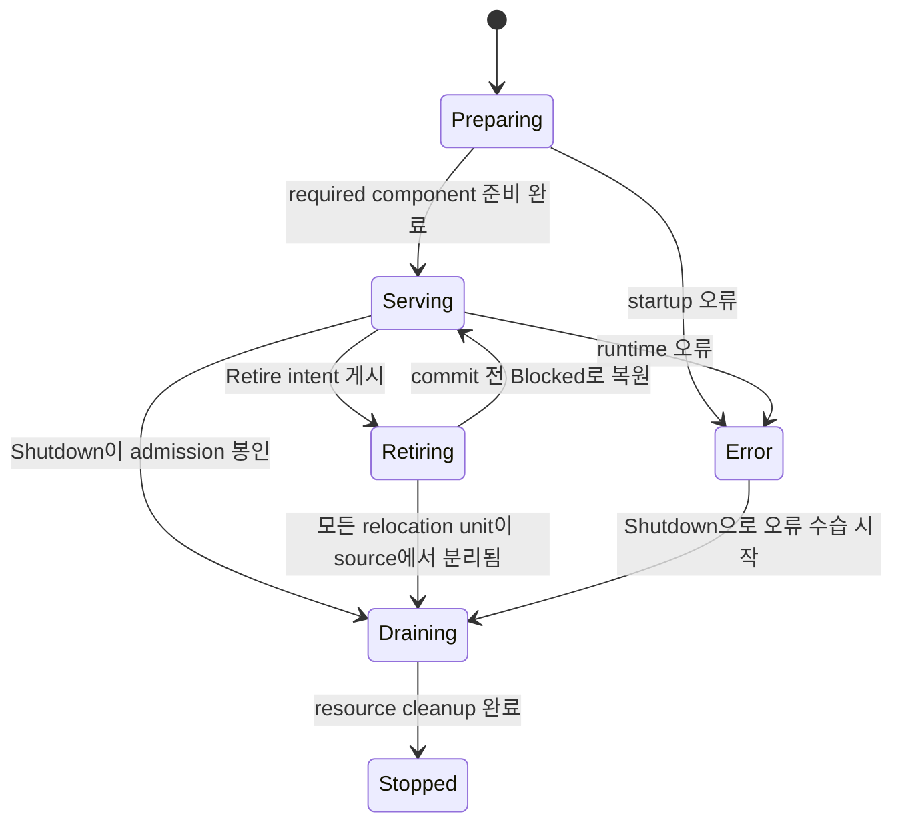

# Host Retire, Shutdown과 handoff

[공통 스펙 목차](README.ko.md) · [MeshNode](21-mesh-node.ko.md) ·
[ClientServer Channel](12-client-server-channel.ko.md) ·
[Async policy](04-async-execution-policy.ko.md) · [Location runtime](40-location-runtime.ko.md) ·
[Runtime monitoring](50-runtime-monitoring.ko.md)

## 1. 이 문서가 정의하는 범위

이 문서는 ZLink Framework 11.0.0에서 process를 교체하거나 종료할 때 host가 다음
resource를 정리하는 순서를 정의한다.

- Service admission
- 이미 수락한 작업
- Stateful object
- Session
- Transport

Logical object를 다른 host에서 계속 처리해야 하면 `Retire`를 사용한다. Object
continuity를 준비하지 않고 현재 host를 정해진 시간 안에 종료하려면 `Shutdown`을
사용한다.

두 operation은 host가 소유한 모든 RouteMesh MeshNode, ClientServer server와 fanout
publisher를 함께 조정한다. Application은 `MeshName`, `ChannelName`이나 node RID를
넘겨 component의 종료 순서를 조립하지 않는다.

Claim과 cancellation의 기본 의미는 [Async policy](04-async-execution-policy.ko.md), descriptor와 relocation
authority는 [40 Location runtime](40-location-runtime.ko.md), Actor membership ordering은
[23 Spot Actor](23-spot-actor.ko.md)가 소유한다.

## 2. Runtime state, 결과와 public operation

Host lifecycle은 `FrameworkRuntimeState` 하나가 소유한다. 값은 다음 여섯 개로 고정한다.

| 값 | State | 계약 |
|---:|---|---|
| 0 | `Preparing` | Host가 registration, bind, [descriptor](01-glossary.ko.md#descriptor) 검증과 recovery를 진행한다. 아직 application message를 받지 않는다. |
| 1 | `Serving` | Host가 ready 상태이며 새로운 application message를 받을 수 있다. |
| 2 | `Retiring` | Host가 `Retire` 의도를 게시하여 새 placement·[membership](01-glossary.ko.md#membership)·relocation target에서 제외된다. Relocation 실행 권한을 아직 얻지 못한 relocation unit은 기존 message와 timer를 계속 처리한다. |
| 3 | `Draining` | 모든 relocation unit이 source의 application dispatch에서 분리되었다. Host는 남은 resource를 정리한다. |
| 4 | `Stopped` | Application·infrastructure resource와 listener 정리가 모두 끝났다. |
| 5 | `Error` | Startup 또는 runtime 오류 때문에 service를 제공할 수 없으며 [ready](01-glossary.ko.md#ready) 상태가 아니다. |

Host의 `IsReady`는 `Serving`에서만 true다. `Retiring`은 `Retire`가 준비된 unit부터 순차적으로 이전하는
중간 상태이고 `Draining`은 source application dispatch가 모두 끝난 뒤의 종료 상태다. 두 state는 독립 command가
아니며 `Retire` 또는 `Shutdown` operation이 관리한다. Host state에는 `Drained`와 `ForceStopping`을 추가하지 않는다.
[MeshNode](01-glossary.ko.md#meshnode)와 다른 topology component의 lifecycle snapshot은 component 상태를 관측하는 정보다. Component별 종료
command는 제공하지 않으며 host state가 모든 topology의 종료 순서를 결정한다.

허용 transition은 `Preparing -> Serving|Error`, `Serving -> Retiring|Draining|Error`,
`Retiring -> Serving|Draining`, `Error -> Draining`, `Draining -> Stopped`다. `Retiring -> Serving`은
relocation commit이 하나도 없고 모든 tentative 작업을 정리한 `Blocked` 결과에서만 허용한다. `Stopped`에서 다른
상태로 전환하지 않는다. `Error` 상태의 host는 continuity
preflight를 시작할 수 없으므로 `Retire`가 `Blocked/RuntimeNotReady`로 끝난다. `Shutdown`은 `Error`에서도
bounded cleanup을 시작할 수 있다. `ForceStopped`는 cleanup 방식에 대한 outcome이며 cleanup 뒤 host state는
`Stopped`다.



`ForceStopped`는 별도 state가 아니다. Admission을 닫은 뒤 bounded teardown으로
host resource를 정리한 outcome이며, teardown 뒤 state는 `Stopped`다.

Host는 local [RouteMesh](01-glossary.ko.md#routemesh) MeshNode, ClientServer server와 fanout publisher의 startup·termination을 조정해
`FrameworkRuntimeState`를 결정한다. Startup 중에는 `Preparing`, 모든 required component가 ready면 `Serving`,
`Retire` intent publication 뒤에는 `Retiring`, 모든 relocation unit이 source에서 분리되거나 `Shutdown`이 admission을
seal한 뒤에는 `Draining`, 모든 resource cleanup 뒤에는 `Stopped`다. Termination 전 required
component 하나라도 service를 제공할 수 없으면 `Error`다. Host termination [snapshot](01-glossary.ko.md#snapshot)은 이 state를 제공한다.
`ZLinkMeshNodeState` 같은 component state는 각 component의 상태를 표현하며
`FrameworkRuntimeState`로 이름이나 enum 값을 바꾸지 않는다.

`Drain`, `AwaitDrained`, `Stop` 계열 공개 member는 각 언어별 exact interface가 정한 host-wide compatibility
facade다. 이 표면은 continuity를 준비하지 않는 `Shutdown` intent와 같은 coordinator를 사용한다. MeshName,
ChannelName이나 node RID를 받는 partial termination operation은 제공하지 않는다. Rolling replacement에는
`Retire`를 사용한다.

Host termination 결과는 다음 닫힌 값으로 고정한다.

Result는 호출을 처리한 `EffectiveIntent`, `Outcome`, `Reason`을 함께 제공한다. EffectiveIntent wire 값은
`Retire=0`, `Shutdown=1`이다.

| 값 | Outcome | 허용 reason | 계약 |
|---:|---|---|---|
| 0 | `Stopped` | `None` | 요청한 host 종료가 정상 완료됨 |
| 1 | `Blocked` | `TargetUnavailable`, `StoreUnavailable`, `RelocationDisabled`, `StateIncompatible`, `DeadlineExceeded`, `RuntimeNotReady`, `ManualTopologyUnsupported` | `Retire`가 첫 relocation commit 전에 continuity를 준비하지 못해 reversible 작업을 정리하고 `Serving`을 복원함 |
| 2 | `ForceStopped` | `DeadlineExceeded`, `RelocationFailed`, `TeardownFailed` | admission을 닫은 뒤 bounded teardown으로 host resource를 정리함 |

Outcome wire 값은 `Stopped=0`, `Blocked=1`, `ForceStopped=2`다. Reason wire 값은 `None=0`,
`TargetUnavailable=1`, `StoreUnavailable=2`, `RelocationDisabled=3`, `StateIncompatible=4`,
`DeadlineExceeded=5`, `RelocationFailed=6`, `TeardownFailed=7`, `RuntimeNotReady=8`,
`ManualTopologyUnsupported=9`이다. 정의하지 않은 outcome과
reason 조합은 protocol 오류다.

Published Location [authority](01-glossary.ko.md#authority)가 가리키는 Relocation root의 permanent missing, checksum mismatch 또는 inventory digest
mismatch는 object-level non-retriable `RelocationDataLost`다. 진행 중인 `Retire` 결과는
`ForceStopped/RelocationFailed`로 끝내고 monitoring error detail에 `RelocationDataLost`를 보존한다. Commit된 owner와
membership을 source로 rollback하지 않는다.

| Operation | 계약 |
|---|---|
| `Retire(deadline, cancellation)` | 모든 local stateful object의 continuity를 preflight한 뒤 admission seal, relocation과 host 종료를 하나의 operation으로 수행함 |
| `Shutdown(deadline, cancellation)` | 새 relocation나 target reservation을 시작하지 않고 accepted work와 resource를 deadline 안에 정리함 |

다음 .NET 발췌는 두 host-wide operation을 보여준다. 다른 언어에 같은 signature를
요구하지 않으며, 정확한 .NET 계약은
[.NET runtime interface](server/languages/dotnet/interfaces/10-topology-monitoring.ko.md)가
정의한다.

```csharp
public interface IZLinkFrameworkRuntime
{
    ZLinkFrameworkRuntimeState State { get; }
    bool IsReady { get; }
    ValueTask<ZLinkFrameworkTerminationResult> RetireAsync(
        TimeSpan? deadline = null,
        CancellationToken cancellationToken = default);
    ValueTask<ZLinkFrameworkTerminationResult> ShutdownAsync(
        TimeSpan? deadline = null,
        CancellationToken cancellationToken = default);
}
```

```csharp
var result = await runtime.RetireAsync(
    TimeSpan.FromSeconds(30),
    cancellationToken);
    // Stopped이면 continuity를 준비한 host 종료가 정상 완료됐다.
    // Blocked이면 이전과 종료 없이 Serving으로 복원됐으므로 Outcome을 반드시 확인한다.
```

두 operation의 기본 [deadline](01-glossary.ko.md#deadline)은 30초이며 명시한 deadline은 0보다 커야 한다. Concurrent `Retire` waiter는 같은
preflight attempt를 공유한다. `Blocked`는 host terminal result가 아니므로 그 waiter들에게 결과를 전달한 뒤
attempt를 닫으며, 다음 `Retire`는 새 preflight transaction을 시작할 수 있다. Deadline은 최초 호출 시점부터
계산한다.

Host state가 `Retiring` 또는 `Draining`으로 전환되면 먼저 시작한 termination operation의 intent와 deadline이 shared operation에
고정된다. 이후 같은 intent와 cross-intent 호출은 새 transaction을 만들지 않고 진행 중인 operation 또는
저장된 terminal result를 사용한다. Caller cancellation은 해당 waiter만 끝내며 shared operation, relocation나
teardown을 취소하지 않는다. 뒤에 합류한 호출의 deadline은 진행 중인 operation을 줄이거나 늘리지 않는다.

`Retiring` 또는 `Draining`에서 호출한 `Retire` 또는 `Shutdown`은 먼저 시작한 host 정리 operation에 합류하고 그 operation의
effective intent가 포함된 terminal result를 받는다. 따라서 `Retire`가 먼저 시작됐으면 뒤의 `Shutdown`도
`EffectiveIntent=Retire`, `Shutdown`이 먼저 시작됐으면 뒤의 `Retire`도 `EffectiveIntent=Shutdown`을
관측한다. 후자의 경우 새 continuity transaction을 시작하지 않는다. `Retire`가 `Blocked`로 끝나면
termination operation이 시작되지 않았으므로 application은 조건을 고친 뒤 `Retire`를 다시 시작하거나 별도
`Shutdown`을 시작할 수 있다.

`Retire` preflight·intent publication과 `Shutdown`의 admission seal은 같은 host maintenance barrier에서 순서를 정한다.
`Shutdown`이 seal을 먼저 commit하면 진행 중인 `Retire` preflight는 reservation을 해제하고
`EffectiveIntent=Shutdown` operation에 합류한다. `Retire`가 `Retiring` publication을 먼저 commit하면
`Shutdown`이 `EffectiveIntent=Retire` operation에 합류한다.

`Preparing` 또는 `Error`에서 호출한 `Retire`는 state와 admission을 바꾸지 않고
`Blocked/RuntimeNotReady`로 끝난다. `Shutdown`은 `Preparing`에서는 startup을 중단하고 `Error`에서는 오류
수습을 포함한 bounded cleanup을 시작해 `Stopped` 또는 `ForceStopped`로 유한 완료된다. `Stopped`에서 호출한
두 operation은 저장된 terminal result가 있으면 그 결과를 반환한다. 저장된 결과가 없으면 요청 intent를
`EffectiveIntent`로 사용한 `Stopped/None`을 idempotent하게 반환하며 새 operation을 시작하지 않는다.

## 3. Retire preflight와 intent notification

`Serving`에서 시작한 `Retire`는 host state나 어느 local component의 admission도 바꾸기 전에 다음 항목을
하나의 host maintenance barrier에서 확인한다. 이 preflight는 host 전체 continuity가 가능한지 검사하지만
relocation unit을 seal하거나 final target reservation을 만들지 않는다.

1. Barrier가 새 Spot·Actor 생성, join, Instance placement, session binding과 inbound relocation을 inventory와
   직렬화한다.
2. Host가 사용하는 service topology가 모두 automatic discovery인지 확인한다. Local manual RouteMesh peer,
   ClientServer client endpoint, fanout subscriber endpoint 또는 Location Store에 descriptor를 게시하지 않는
   manual fanout publisher가 하나라도 있으면 `ManualTopologyUnsupported`로 차단한다. 이 조건은 endpoint가
   현재 연결되어 있는지와 관계없이 registration을 기준으로 판단한다. Automatic server·publisher·MeshNode가
   listener 주소를 명시적으로 bind하는 설정 자체는 manual topology가 아니다.
3. 모든 local MeshNode의 Actor, [Spot](01-glossary.ko.md#spot), timer, session과 진행 중인 infrastructure operation을 inventory한다.
4. Location authority, 필요한 Relocation Store와 target descriptor의 lease를 확인한다.
5. Standalone Actor, User Spot aggregate와 Instance Spot의 relocation policy, Snapshot adapter capability와 target의
   bounded headroom을 확인한다. Exact inventory가 아직 없으므로 final reservation은 만들지 않는다.
6. Target이 `Serving`이고 application version, type capability, maintenance wave와 bounded capacity를
   모두 만족하는지 확인한다. Target application version은 source와 같거나 커야 하므로 same-version maintenance와
   N→N+1 patch를 모두 허용하고 더 오래된 version으로는 이전하지 않는다. Source에 maintenance wave가 설정되어
   있으면 같은 wave의 target은 제외하고 다른 wave의 compatible target만 사용한다.
7. Source가 읽은 각 automatic RouteMesh의 complete descriptor snapshot에는 source 자신을 제외한 non-draining
   replacement peer가 최소 하나 있어야 한다. 각 replacement peer는 Core peer table에서 같은 RID와 lifecycle
   generation이 `Admitted`이고 `Ready`여야 한다. 빈 snapshot, source 자신만 있는 snapshot, 모든 remote peer가
   draining인 snapshot, descriptor publication 또는 connect intent만으로는 이 조건을 충족하지 않는다. 아직
   준비되지 않은 peer가 있으면 host state와 admission을 바꾸지 않고 deadline까지 새 snapshot과 Core peer table의
   수렴을 기다린다.

Preflight가 성공하면 host state와 descriptor를 `Retiring`으로 게시한다. 이 publication부터 새 [ChannelName](01-glossary.ko.md#channelname)·Logical
Multicast selection, object placement, membership 변경, inbound relocation target과 신규 session binding에서 host를
제외한다. 기존 [owner](01-glossary.ko.md#owner)로 직접 들어오는 application message와 timer는 unit별 seal 전까지 계속 처리한다.

여러 MeshNode의 `Retiring` descriptor를 게시하다 일부 write가 실패하거나 응답을 확인할 수 없으면, Framework는
시도한 descriptor 전체를 `Serving`으로 되돌린다. 모든 rollback write를 확인한 경우에만 host state와 admission을
유지하고 `Blocked/StoreUnavailable`을 반환한다. 하나라도 rollback을 확인할 수 없으면 Location Store에는 이미
`Retiring`이 공개됐을 수 있으므로 `Serving`으로 복원됐다고 보고하지 않는다. 이 경우 신규 admission을 닫고 bounded
cleanup을 수행한 뒤 `ForceStopped/TeardownFailed`로 끝낸다.

Framework는 다음 세 종류를 relocation unit으로 inventory한다.

- User Spot과 seal 시점의 member Actor 전체를 묶은 하나의 aggregate
- User Spot aggregate에 속하지 않는 standalone Actor 하나
- Actor membership이 없는 [Instance Spot](01-glossary.ko.md#entry-spot-user-spot과-instance-spot) 하나

Entry Spot 자체는 relocation unit이 아니다. Coordinator는 각 unit queue에 `Retire` intent를 infrastructure
notification으로 예약한다. 이 notification은 application callback을 호출하거나 readiness 값을 application에
요구하지 않는다. Notification을 처리한 queue turn 경계에서만 unit이 relocation-ready가 된다. 그 경계에서 필요한
permit을 nonblocking으로 얻지 못하면 seal하지 않고 다음 notification을 예약하며 application message와 timer turn을
계속 처리한다.

`SpotWide` User Spot aggregate는 공유 Spot gate 경계에서 notification을 처리한다. `PerActor` aggregate는
Spot lane, seal 시점의 모든 member Actor lane과 timer별 lane을 포함하는 barrier generation을 예약한다.
각 lane은 현재 claim을 마친 뒤 barrier에 도착한다. `Yield`로 Spot gate를 반납한 `SpotWide` Actor callback은
Actor FIFO claim이 끝나지 않았으므로 barrier 도착으로 보지 않는다. Framework는 준비된 lane만 먼저
capture하거나 일부 participant만 seal하지 않는다.

하나라도 준비할 수 없으면 preflight read와 tentative coordination을 정리하고 `Blocked`를 반환한다. 이 경우 host state는
`Serving`이고 readiness, descriptor와 application admission도 그대로 유지된다. 한 process에
여러 MeshNode가 있으면 한 Mesh의 blocker가 host 전체 `Retire`를 차단한다.

Maintenance barrier, target reservation 또는 automatic RouteMesh의 exact peer readiness를 deadline 전에 확보하지
못하면 `TargetUnavailable`, Store read·write
또는 lease 확인이 실패하면 `StoreUnavailable`, relocation policy가 허용하지 않으면 `RelocationDisabled`를
사용한다. Application version·type·Snapshot adapter capability가 맞지 않거나 허용된 attempt에서
`Capture`·`Restore`가 모두 실패하면 `StateIncompatible`를 사용한다. Framework가 operation deadline 때문에
callback을 취소하면 `DeadlineExceeded`를 사용한다. Framework는 application state bytes를 해석하거나 별도 state
contract ID를 비교하지 않는다.

### 3.1 Rolling replacement topology 순서

Framework가 지원하는 `Retire`는 참여하는 framework host와 client가 모두 automatic discovery를 사용하는
closed-world 구성을 전제로 한다. Deployment는 replacement node를 먼저 할당하고 시작한다. Framework는 새 node가
descriptor를 게시했다는 사실만으로 기존 host를 종료하지 않는다. Source가 exact RID와 lifecycle generation의
peer를 Core table에서 `Admitted`·`Ready`로 확인한 뒤에만 `Retiring`을 게시한다.

Runtime preflight가 직접 차단할 수 있는 범위는 해당 host의 local registration이다. 다른 process가 Framework
밖에서 만든 manual connection이나 외부 client의 endpoint 구성은 source runtime이 관찰할 수 없다. 따라서 참여
process 전체가 automatic discovery만 사용한다는 조건은 deployment가 보장해야 하는 전제이며, Framework가 cluster
전체의 외부 connection mode를 검사했다고 해석하지 않는다.

그 뒤에는 다음 순서를 유지한다.

1. Green node가 `Serving` descriptor를 게시하고 source의 automatic RouteMesh에서 exact peer가 `Ready`가 된다.
2. Old host가 `Retiring`을 게시해 새 selection과 placement에서 제외된다.
3. Stateful relocation을 target의 `Prepared`, authority commit과 steady normalization까지 진행한다.
4. 모든 relocation unit이 source dispatch에서 분리된 뒤 old host가 `Draining`을 게시하고 accepted work,
   reply, STREAM과 session barrier를 완료한다.
5. Descriptor와 owner lease를 release한다.
6. 마지막으로 peer connection, listener와 raw transport를 disconnect한다.

Automatic ClientServer client와 fanout subscriber는 green descriptor를 발견해 새 connection을 만들고 old descriptor의
`Retiring`·`Draining` 상태를 새 selection에 반영한다. Old connection은 해당 topology의 accepted work와 barrier가
끝나기 전에 descriptor 변화만을 이유로 닫지 않는다. Framework는 manual endpoint가 replacement node를 가리키도록
바뀌었는지 증명할 수 없으므로 manual topology를 이 순서의 일부로 인정하지 않는다.

## 4. Bounded sliding relocation

Coordinator는 ready unit을 한꺼번에 seal하지 않고 permit이 허용하는 sliding window 안에서 다음 순서로 진행한다.

1. Queue turn 경계에서 source outbound unit, target inbound unit, 필요한 `Capture`·`Restore` callback과 encoded
   payload byte permit을 nonblocking으로 획득한다. Byte reservation은 Snapshot participant마다 adapter가 반환할
   수 있는 최대 64 MiB와 Framework가 이미 소유한 queue·journal bytes, timer·manifest·metadata의 deterministic
   encoded upper bound를 더한 값이다. 어느 permit이든 실패하면 provisional permit을 모두 즉시 반환하고 unit을
   seal하지 않는다.
2. Permit을 모두 얻으면 해당 unit의 barrier generation을 게시하고 application ingress, timer dispatch와
   아직 시작하지 않은 continuation admission을 원자적으로 seal한다. `SpotWide`에서는 공유 gate claim이
   0이 될 때까지 기다리고, `PerActor`에서는 Spot lane, 모든 member Actor lane과 timer별 lane의 active
   claim이 0이 될 때까지 기다린다. 모든 lane이 같은 generation에 도착하기 전에는 새 application
   callback이나 `Capture`를 시작하지 않는다.
3. Seal 시점에 실행하지 않은 message queue, accepted journal, timer logical registration·pending tick과 Framework
   manifest·metadata를 exact boundary로 고정한다. `Snapshot`이면 `Capture`를 실행해 application state를 추가한다.
4. Target factory와 `Restore`에 필요한 initial staging root를 저장한 뒤 exact inventory로 target reservation과
   staging을 완료한다. 이 root는 target admission을 열거나 public authority의 복원 근거로 사용하지 않는다.
5. Commit 경계에서 source ingress hold의 high-water를 고정한다. Initial state와 hold journal을 함께 가리키는
   final immutable manifest를 저장하고 검증한 뒤 `Prepared` CAS와 owner·membership commit을 수행한다. Location
   authority는 이 final manifest만 공개한다. Hold message는 original operation identity와 generation을 유지해
   committed target으로 relay한다.
6. Standalone Actor는 target lifecycle callback과 accepted message·journal replay를 완료하고 Framework timer를
   자동 복원한다. 그 뒤 old Entry membership과 남은 source resource의 durable cleanup,
   `Completed`를 마친다. 같은 ObjectGeneration의 Actor가 Session에 bind되어 있으면
   Session owner가 보관한 해당 Actor의 binding route, 즉 현재 Actor owner에 전달할 경로를 target owner로 갱신해 달라고
   요청하고 확인을 받는다(`command 44·45`). 같은 Session의 다른 Actor route와 physical STREAM
   connection은 유지한다. Route 갱신은 같은 `ObjectGeneration`에만 적용하며 새
   incarnation은 application이 명시적으로 다시 bind해야 한다. Steady normalization 뒤
   target packet·push admission을 연다.
7. Unit의 outbound·inbound·callback·byte permit을 반환하고 다음 ready unit을 진행한다.

Process별 기본 상한은 active outbound relocation unit 64개, active inbound relocation unit 64개, encoded payload
in-flight 256 MiB다. `Capture` callback과 `Restore` callback은 각각 process당 최대 8개를 동시에 실행한다. 다섯 값은
Location option으로 바꿀 수 있지만 실행 중인 attempt에는 변경 전 값을 유지하고 새 attempt부터 적용한다. Callback permit은
unit·byte permit과 독립적으로 적용한다.

Payload byte에는 application state, seal 시점의 미실행 message queue, accepted journal, timer logical
registration·pending tick, relocation manifest와 Framework metadata를 모두 포함한다. Queue turn 경계에서
Framework는 admission sequencing fence를 잠시 유지해 현재 accepted framework-owned bytes와 count를 고정한다.
Permit 획득에 실패하면 fence를 해제하고 새 ingress를 source queue에 계속 수락하며 semantic seal이나 ingress hold를
만들지 않는다. Permit 획득에 성공하면 같은 경계에서 seal하므로 그 뒤 도착한 ingress는 source ingress hold로 보낸다.
Framework는 실제 도착량을 permit에 나중에 더하지 않는다. Hold는 최대 1,024개 record와 journal header를 포함한
16 MiB encoded size로 제한하며, 이 최대 크기를 seal 시점의 byte reservation에 포함한다. Final manifest가 그
범위 안에서 만들어지면 actual encoded size로만 reservation을 축소한다.

Application state 크기를 미리 묻는 public callback이나 application 제공 estimate는 두지 않는다. Snapshot participant
하나의 reservation은 [23 Spot Actor](23-spot-actor.ko.md)가 정한 64 MiB 최대값을 사용한다. Framework-owned
section은 이미 encode된 bytes와 bounded field count·길이로 계산한 deterministic upper bound를 사용하며, envelope와
chunk framing overhead도 포함한다. `Capture`가 끝나면 reservation을 actual encoded size로만 축소할 수 있고
늘릴 수 없다. Adapter가 64 MiB를 넘기면 adapter contract violation으로 precommit abort하고 source normalization 뒤
`Blocked/StateIncompatible`로 끝낸다. Framework encoder의 upper bound는 실제 encoded size보다 작아서는 안 되며
runtime은 seal 뒤 permit을 추가로 얻어 이 구현 오류를 우회하지 않는다.

Coordinator는 unit, callback과 byte permit을 하나의 nonblocking admission attempt로 처리한다. 실패한 attempt가
일부 permit을 보유한 채 기다리거나 다음 notification까지 넘기면 안 된다. Reservation이 256 MiB보다 큰
단일 User Spot aggregate는 payload window의 사용량과 다른 oversized admission이 모두 0일 때만 exclusive
oversized permit 하나로 진행한다. 이 permit이 유지되는 동안 normal·oversized payload를 새로 admit하지 않는다.
Actual size로 축소한 뒤 window 안에 들어오더라도 해당 aggregate가 byte permit을 반환할 때까지 exclusive 상태를
유지한다. 따라서 큰 aggregate와 normal unit이 서로의 partial permit을 보유한 채 대기하지 않는다. Standalone
Actor와 Instance Spot unit은 configured byte gate 안에서만 admit한다.

Seal 뒤 source로 들어온 application ingress는 initial staging root에 추가하지 않고 bounded source ingress hold에
보관한다. Commit 경계에서 final immutable manifest의 accepted journal에 포함해 durable하게 만든 뒤 authority를
commit한다. Commit 전 abort는 hold를 source queue에 arrival order로 되돌리고, commit 뒤에는 target으로 relay한다.
Hold의 message·byte 상한을 넘은 request는 `SpotMoving`, one-way operation은 moving drop으로 끝낸다. Source는
commit 전에 hold를 target application handler로 전달하지 않는다.

모든 relocation unit이 source dispatch에서 분리되고 source ingress hold가 commit 또는 abort로 정리된 뒤 host를
`Draining`으로 전환한다. 이후 local Spot·owner authority와 descriptor lease, ClientServer listener, fanout publisher,
peer connection과 raw transport resource를 순서대로 정리하고 `Stopped/None`을 완료한다.

첫 relocation commit 뒤에는 `Blocked`나 `Serving`으로 돌아가지 않는다. Deadline이나 relocation·teardown failure가
발생하면 신규 admission을 닫은 상태로 bounded teardown을 수행하고 `ForceStopped`를 한 번만 완료한다. Commit된
relocation의 durable recovery는 source host의 `ForceStopped` 완료와 독립적으로 계속될 수 있다.

Store failure가 첫 relocation commit 전에 발생하면 durable abort와 reversible 작업 정리 뒤
`Blocked/StoreUnavailable`로 끝낸다. 첫 commit 뒤 authority 또는 relocation root 진행이 실패하면
`ForceStopped/RelocationFailed`, descriptor·owner cleanup이나 relocation root 삭제를 확인할 수 없으면
`ForceStopped/TeardownFailed`로 끝낸다. 이 처리보다 deadline이 먼저 끝나면 reason은 `DeadlineExceeded`다.
`StoreUnavailable`은 `ForceStopped` reason으로 사용하지 않는다.

Deadline이 preflight 또는 첫 unit commit 전에 도달하면 relocation reference와 reservation을 정리하고 source
authority와 admission을 원래 상태로 복원한다. Automatic RouteMesh의 exact peer readiness가 끝까지 수렴하지 않은
경우는 `Blocked/TargetUnavailable`, 그 밖의 precommit deadline은 `Blocked/DeadlineExceeded`로 끝낸다. 첫 unit
commit 뒤에는 deadline을 이유로 `Blocked`로 되돌리지 않는다. 이 시점 이후 deadline은 bounded teardown과 recovery
handoff를 수행한 뒤 `ForceStopped/DeadlineExceeded`로 한 번만 완료한다.

Descriptor를 `Draining`으로 게시했다는 이유만으로 peer connection을 즉시 끊지 않는다. In-flight reply,
relocation control과 STREAM barrier가 같은 ROUTER connection을 사용할 수 있기 때문이다.

## 5. Shutdown 진행 순서

`Shutdown`은 target eligibility, relocation policy와 spare capacity를 blocker로 사용하지 않으며 `Blocked`를
반환하지 않는다. 다음 순서를 수행한다.

1. Host state를 `Draining`으로 바꾸고 모든 local component의 신규 application admission과 새 relocation reservation을
   닫는다.
2. `Draining` descriptor를 게시하고 새 ChannelName·Instance placement·fanout selection에서 제외한다.
3. 이미 수락한 handler, request completion과 진행 중인 relocation·session barrier를 deadline까지 처리한다.
4. 새 object relocation을 시작하지 않는다. Actor membership과 local instance가 유효한 상태에서 모든 local
   Entry·User·Instance Spot에 `HostShutdown` closing context를 전달한다. 언어 runtime에 표준 cooperative
   cancellation 표현이 있으면 남은 deadline의 cleanup signal도 함께 전달한다.
   Actor별 closing callback은 호출하지 않는다.
5. Spot closing callback을 완료한 뒤 local Actor·Spot scope, owner record, listener와 transport를 정리한다.
6. Deadline 안에 끝나면 `Stopped/None`, 끝나지 않으면 bounded teardown 뒤 `ForceStopped`를 완료한다.

`Shutdown`은 logical continuity를 보장하지 않는다. `Disabled` object, 호환 가능한 target 부재와 Relocation Store
provider 부재는 `Shutdown`을 차단하지 않는다. Hardware failure나 SIGKILL로 operation을 실행할 수 없는
경우의 owner recovery는 [40 Location runtime](40-location-runtime.ko.md)의 lease와 durable authority를 따른다.

## 6. Selection과 admission

| Surface | `Retiring` | `Draining` |
|---|---|---|
| ChannelName select-one | 새 selection 대상에서 제외하되 기존 direct owner route는 유지한다. | 새 admission을 닫고 이미 submit된 operation만 terminal completion까지 진행한다. |
| Logical Multicast | 새 target snapshot에서 제외하고 이미 수락한 제출은 유지한다. | 새 admission을 닫고 이미 수락한 제출만 유지한다. |
| Node direct application request | 기존 owner direct request는 unit별 seal 전까지 수락한다. | 신규 request를 shutdown 또는 moving 결과로 끝낸다. |
| [Node direct](01-glossary.ko.md#node-direct) infrastructure control | relocation, completion, binding과 recovery control을 계속 수락한다. | termination barrier에 필요한 control만 deadline까지 수락한다. |
| Spot·Actor direct | 해당 unit을 seal하기 전에는 application payload와 timer를 계속 처리한다. | 신규 payload를 거부하고 이미 queue에 수락한 turn만 처리한다. |
| Spot·Actor create와 join | 신규 owner와 membership admission을 거부한다. | 같은 거부를 유지한다. |
| Instance Spot placement | 새 target claim에서 제외하되 기존 instance direct route는 unit별 seal 전까지 유지한다. | Seal 전에 수락한 activation만 terminal 상태까지 진행한다. |
| STREAM | 신규 binding에서 제외하고 기존 session을 unit relocation barrier로 처리한다. | 신규 session을 받지 않고 pending reply와 binding barrier만 처리한다. |
| ClientServer server | 새 target selection에서 제외하되 이미 수락한 handler와 reply route를 유지한다. | handler admission을 닫고 accepted request의 reply route만 유지한다. |
| classic fanout publisher | 새 automatic subscriber 연결을 만들지 않고 이미 수락한 event를 처리한다. | publish admission을 닫고 이미 수락한 event만 처리한다. |

Retire relocation에서 seal 뒤 이전 owner에 도착한 operation은 bounded source ingress hold에 먼저 보관한다.
Commit하면 같은 operation ID와 generation으로 target에 relay하고 abort하면 source queue에 되돌린다. Hold의
message·byte 상한을 넘은 request만 retry 가능한 `SpotMoving`으로 끝내며 one-way operation은 moving drop으로
관측한다. Framework가 새 operation ID로 다른 owner에 숨은 재제출을 시작하지 않는다.
[23 Spot Actor](23-spot-actor.ko.md)의 bounded stale-route forwarding이 적용되는 Actor message는 같은 operation
ID와 object·authority owner generation fence를 유지하며 별도 application retry로 취급하지 않는다. Shutdown에서 seal 뒤
도착한 request는 shutdown 결과로 끝난다.

Application callback이 비동기 작업을 기다리는 동안에도 infrastructure claim은 send-ready, request
completion, peer lifecycle, relocation recovery와 session binding을 진행할 수 있어야 한다. Observer, metric
reader와 runtime event handler는 termination progress를 막는 claim을 소유하지 않는다.

Spot closing callback의 호출 자체가 application에 종료를 알린다. 언어의 표준 cleanup cancellation을 전달하는
경우에도 이미 수락한 handler를 중단시키는 token을 재사용하지 않으며 남은 shutdown deadline이 끝날 때만
취소한다. 표준 cancellation 표현이 없는 언어에서는 Framework가 deadline에 callback completion 대기를 끝낸다.
Callback exception은 `ForceStopped/TeardownFailed`, deadline 만료는 `ForceStopped/DeadlineExceeded`로
분류한다. Hardware failure와 `SIGKILL`에서는 callback 실행을 보장하지 않는다.

## 7. STREAM barrier

Standalone Actor, User Spot aggregate와 Instance Spot relocation은
[40 Location runtime](40-location-runtime.ko.md)의 owner·relocation authority CAS를 사용한다. `Retire`는 type
등록의 `Disabled`, `Recreate`, `Snapshot` policy를 적용한다.

- `Disabled` object가 남아 있으면 preflight를 `RelocationDisabled`로 차단한다.
- `Recreate`는 target [factory](01-glossary.ko.md#factory)를 같은 logical ID로 실행하며 application state section 없이 accepted journal과
  recovery payload를 relocation envelope에 기록한다.
- `Snapshot`은 Actor 또는 Spot relocation adapter의 `Capture`가 반환한 opaque bytes와 seal 전 accepted journal을
  Relocation Store에 기록한다. Target factory가 만든 instance에 같은 adapter의 `Restore`를 실행하고, restore가
  성공한 뒤에만 owner·membership commit을 허용한다. Application이 bytes의 format, version과 migration을
  관리하며 Framework는 state contract ID와 generic state type을 두지 않는다.
- Entry Spot은 relocation하지 않고 target node startup에서 Framework가 새 identity로 구성한다.
- User Spot은 Spot과 preflight linearization point의 member Actor 전체를 하나의 relocation aggregate로 처리한다.
  Spot과 각 Actor에 등록한 policy·Snapshot adapter capability를 함께 검사하며 participant 하나라도
  `Disabled`이거나 호환 target을 찾을 수 없으면 commit 전에 전체 aggregate를 `RelocationDisabled`로 차단한다.
- User Spot aggregate는 non-zero 128-bit aggregate ID, 최대 1024 participant와 encoded 최대 1 MiB record를
  사용한다. Spot owner, Actor owner와 membership은 한 commit generation에서 함께 전환한다. Commit 전 실패는
  source aggregate 전체를 유지하고, commit 뒤 실패는 일부 participant를 source로 되돌리지 않고 target aggregate
  recovery를 계속한다.
- Cross-node Actor `JoinSpot`·`JoinEntrySpot`은 target proposal, shared policy preflight, source seal, durable
  capture, target reservation·factory·restore, owner·membership aggregate commit, callback·ACK 순서로
  진행한다. `Snapshot`일 때 maintenance와 같은 Actor relocation adapter를 사용한다. Commit 전 실패는 source
  owner와 membership을 유지하고 commit 뒤 실패는 target recovery를 계속한다. Same-node join은 relocation이
  아니므로 relocation policy로 차단하지 않고 adapter도 호출하지 않는다.
- Host `Retire`로 source Entry Spot member가 target Entry Spot에 복원되면 owner·membership commit 뒤 target
  Entry Spot의 `OnActorRelocated`와 source Entry Spot의 `OnLeaveActor` callback을 호출한다. Callback failure는
  rollback하지 않고 current authority fence에서 재시도하며 target admission은 두 callback과 accepted journal
  replay가 끝날 때까지 닫는다. Source process가 종료되면 source callback을 더 실행할 수 없으므로 durable source
  cleanup이 완료를 대신하고 target recovery를 막지 않는다. Application이 요청한 join은 기존 joined lifecycle을
  사용하고 maintenance callback을 추가로 호출하지 않는다. User Spot aggregate는 membership이 유지되므로 Actor
  join·leave·relocation callback을 호출하지 않는다.
- Instance Spot의 public activation은 Spot direct fluent call의 명시적인 Instance intent만 시작한다. Marker가
  없는 일반 message와 find는 existing authority만 사용하며 hidden create를 시작하지 않는다. `Retire` target
  materialization은 cold activation과 다른 maintenance transaction이다.

Bound STREAM connection 자체는 이동하지 않는다. Actor owner·membership commit 뒤
callback·journal replay와 durable source cleanup, `Completed`를 끝낸 다음 같은
ObjectGeneration을 검증한다. 그 뒤 Framework는 Session owner가 보관한 해당 Actor의
[binding route](01-glossary.ko.md#binding-route), session relay authority와 binding generation만 target owner 기준으로 갱신해
달라고 요청하고 확인을 받는다(`command 44·45`). 같은 Session의 다른 Actor route는 바꾸지
않으며, route 갱신은 같은 `ObjectGeneration`에만 적용한다. 새 incarnation은
application이 명시적으로 다시 bind해야 한다. Steady normalization 전에는 target의
session packet·push admission을 열지 않는다. Stale packet과 reply는 거부한다. Runtime timer handle과 callback continuation도
이동하지 않는다. Framework는 seal 시점의 timer logical registration, 다음 실행 시각과 이미 발생했지만 실행하지
않은 pending tick을 relocation payload에 기록한다. Target은 `Restore` 뒤 이 registration을 자동으로 복원하고 pending
tick을 accepted queue 순서에 맞춰 dispatch한다. Application은 `Capture` payload에 Framework timer를 중복 저장하거나
`Restore`에서 다시 등록하지 않는다.

Instance Spot handler나 timer가 자신의 context에서 시작한 `Close`와 maintenance relocation은 같은 authority CAS에서
순서를 정한다. `Closing`이 먼저 commit되면 `Retire`는 close completion을 기다리고 relocation하지 않는다.
Relocation이 먼저 commit되면 늦은 `Close`는 moving 결과로 끝나며 Framework가 새 owner에 자동 재제출하지
않는다.

## 8. Location과 resource cleanup

`Draining` 동안 descriptor와 owner lease를 계속 renew한다. Lease를 먼저 중단하면 accepted request,
relocation과 session barrier가 사용하는 fence를 잃을 수 있다. Barrier가 끝난 뒤 다음 순서로 정리한다.

1. Actor membership과 local instance를 유지한 채 Spot closing callback을 완료한 뒤 local scope를 정리한다.
2. Current authority를 가진 source만 Actor·Spot owner와 relocation participant record를 advance하거나 release한다.
3. MeshNode, ClientServer server와 fanout publisher descriptor·[owner lease](01-glossary.ko.md#owner-lease)를 release한다.
4. Peer connection, listener, executor와 binding raw transport를 닫는다.

Store failure 뒤에도 local readiness와 admission seal은 닫힌 상태를 유지한다. Deadline까지 authority나 cleanup을
확인할 수 없으면 `Stopped`로 보고하지 않고 bounded teardown 뒤 `ForceStopped`를 완료한다. Manual peer를 포함한
host는 `Retire` preflight에서 차단되지만 `Shutdown`은 admission된 peer control로 state를 전파하고 barrier 뒤
connection을 닫는다.

## 9. 관측 정보

`FrameworkRuntimeState` 변화는 `zlink.runtime.host.termination_changed` event로 관찰한다. MeshNode,
ClientServer와 fanout lifecycle event는 같은 host state의 descriptor projection을 제공한다. Terminal event는
observer overflow로 잃지 않는다.

| Metric | 종류 | Label | 의미 |
|---|---|---|---|
| `zlink.termination.state` | observable | `state` | 현재 host state 하나에 값 1을 기록 |
| `zlink.termination.duration` | histogram | `intent`, `outcome` | Retire 또는 Shutdown 시작부터 terminal result까지 걸린 시간 |
| `zlink.termination.blocked` | counter | `reason` | 첫 relocation commit 없이 reversible 작업을 정리하고 `Serving`을 복원한 Retire 수 |
| `zlink.termination.forced` | counter | `intent`, `reason` | bounded teardown으로 끝난 operation 수 |
| `zlink.relocation.completed` | counter | `object_kind`, `policy` | Retire에서 완료한 object relocation 수 |

Metric label에는 Actor ID, Spot ID, node RID, endpoint, session ID와 relocation ID를 넣지 않는다. 개별 blocker와
relocation 상태는 bounded diagnostic query와 trace에서 확인한다. Observer callback 실패는 termination과
relocation 진행을 막지 않는다.

## 10. 구현 및 contract test 검증 요구

- `Retire` preflight blocker가 있으면 host state가 `Serving`이고 모든 local admission이 유지된다.
- Manual RouteMesh peer, ClientServer client endpoint, fanout subscriber endpoint 또는 manual fanout publisher가
  하나라도 있으면 `Retire`가 `Blocked/ManualTopologyUnsupported`로 끝나며 `Shutdown`은 계속 동작한다.
- Automatic RouteMesh의 descriptor만 게시된 상태에서는 `Retire` preflight가 통과하지 않는다. Source Core peer
  table에서 exact RID와 lifecycle generation이 `Admitted`·`Ready`가 된 뒤에만 `Retiring`을 게시한다.
- Automatic RouteMesh의 complete snapshot이 비어 있거나 source 자신만 포함하거나 모든 remote peer가 draining이면
  replacement가 없는 것으로 판정하여 `Blocked/TargetUnavailable`로 끝난다.
- Rolling replacement는 green `Ready`, old `Retiring`, relocation, old `Draining`과 barrier, descriptor·owner lease
  release, disconnect 순서를 지킨다.
- Same-version target과 더 높은 application version target은 compatible하고, 더 낮은 version과 source와 같은
  maintenance wave의 target은 preflight에서 제외한다.
- Multi-Mesh host의 preflight가 all-or-none으로 동작하고 unit seal은 permit 기반 sliding window로 진행된다.
- `Retire` 성공은 supported standalone Actor·User Spot aggregate·Instance Spot continuity, session barrier와 host
  cleanup을 모두 완료한다.
- `Shutdown`은 새 relocation을 시작하지 않고 `Stopped` 또는 `ForceStopped`로 유한 완료된다.
- 기본 deadline은 30초이며 caller cancellation은 waiter만 끝낸다.
- Concurrent `Retire` waiter는 같은 preflight attempt를 공유하지만 `Blocked` result는 host terminal로 저장하지
  않는다.
- `Retiring` 또는 `Draining` 이후 반복 호출과 `Stopped`·`ForceStopped` 뒤 호출은 같은 shared operation 또는 저장된 terminal
  result를 사용한다.
- `Preparing`·`Error`의 `Retire`는 admission을 바꾸지 않고 `Blocked/RuntimeNotReady`로 끝난다.
- Cross-intent waiter는 `Retiring`을 시작한 operation과 그 `EffectiveIntent` terminal result에 합류한다.
- `Blocked` 뒤의 `Retire`와 `Shutdown`은 새 operation을 시작할 수 있다.
- 첫 relocation commit 뒤 실패는 `Blocked`가 아니라 `ForceStopped`로 끝난다.
- Preflight부터 첫 relocation commit 전까지 deadline이 끝나면 reversible 작업을 정리하고
  `Blocked/DeadlineExceeded`로 끝난다. 첫 commit 뒤 deadline은 `ForceStopped/DeadlineExceeded`로 끝난다.
- Store failure가 첫 relocation commit 전에는 `Blocked/StoreUnavailable`, commit 뒤에는 단계에 따라
  `ForceStopped/RelocationFailed|TeardownFailed`로 끝난다.
- User Spot과 member Actor가 하나의 bounded aggregate로 preflight·commit되고 partial owner·membership이 공개되지
  않는다.
- `Serving`이 아닌 node는 새 ChannelName, [Logical Multicast](01-glossary.ko.md#logical-multicast), Instance placement와 relocation target에서 제외된다.
- 이미 수락한 request는 reply·error·timeout·shutdown 가운데 하나로 한 번만 끝난다.
- Application callback이 대기 중이어도 infrastructure completion과 termination barrier가 진행된다.
- Actor relocation, bound session과 accepted journal이 generation·authority fence를 보존한다.
- `Retire` intent notification은 application callback을 호출하지 않으며 queue turn 경계에서 permit을 얻은 unit만
  seal한다. Permit을 얻지 못한 unit은 application message와 timer를 계속 처리한다.
- Process별 기본 gate가 outbound 64, inbound 64, payload in-flight 256 MiB, `Capture`·`Restore` 각각 8이고
  oversized User Spot aggregate는 payload window에서 단독으로 진행된다.
- Seal 전 byte reservation은 Snapshot participant별 64 MiB와 Framework-owned encoded upper bound를 포함하며
  `Capture` 뒤 actual size로만 축소된다.
- Permit admission은 all-or-nothing이고 oversized User Spot aggregate는 empty payload window에서 exclusive하게 진행하므로
  normal unit과 partial permit deadlock을 만들지 않는다.
- Seal 시점의 미실행 message·journal·timer registration·pending tick이 payload에 포함되고, seal 뒤 ingress는
  commit 후 target relay 또는 abort 후 source queue 복원을 따른다.
- Target Framework가 timer를 자동 복원하므로 application `Restore`는 timer를 다시 등록하지 않는다.
- Target은 Activated 뒤에도 sealed이며 durable source cleanup, Completed, bound-session route ACK와 steady
  normalization 뒤에만 Ready다.
- Precommit abort는 durable Aborted CAS 전에 session route를 되돌리거나 source admission을 열지 않는다.
- Instance maintenance relocation이 logical create나 stale ref의 hidden create를 시작하지 않는다.
- Store failure와 deadline 경쟁에서도 terminal result는 한 번만 완료된다.
- `FrameworkRuntimeState`, outcome, reason, event와 metric 값이 공통 wire 값 및 실제 terminal result와 일치한다.
- ClientServer와 fanout cleanup이 MeshNode descriptor나 Spot·Actor authority를 잘못 변경하지 않는다.
