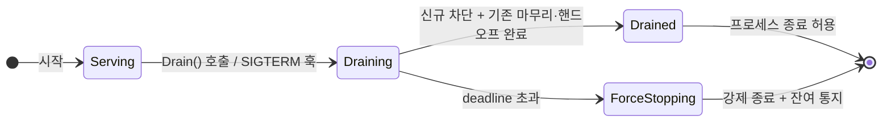

<!-- draft-status: DRAFT · 제안 단계 · 공개 계약 아님 -->

[스펙 목차](../README.ko.md)

# Graceful Drain & Handoff 수명주기 계약 — DRAFT

> **상태: DRAFT.** 아직 채택된 공개 계약이 아니라 제안 초안이다. API 동사·상태 이름·기본
> deadline은 리뷰에서 바뀔 수 있다.

이 문서는 stateful 노드가 **우아하게 종료(graceful shutdown)**할 때 무슨 일이 어떤 순서로
일어나는지를 정하는 언어 중립 공통 계약 초안이다. 이것은 **런북이 아니라 계약**이다 — 배포
자동화(예: Kubernetes `preStop`)가 훅을 걸 수 있도록, framework가 노출하는 API와 상태 기계를
정의한다. 환경별 배포 매니페스트·용량 산정·대시보드는 이 문서의 범위가 아니다(팀의 몫).

## 1. 왜 필요한가 — 문제 상황

무상태 서버는 그냥 죽여도 된다. 그러나 stateful 노드(라이브 SPOT 룸 + 바인딩된 actor + 활성
STREAM 세션을 가진 SpotNode)는 다르다.

- k8s가 `SIGTERM`을 보내고 pod를 종료하면, **접속 유저가 전부 튕기고 진행 중 룸이 유실**된다.
- 라이브 서비스의 무중단 배포(v2 롤아웃)는 이 stateful 노드를 **안 죽이고 교체**할 수 있어야
  한다.

그래서 "새 배정은 막고, 기존 상태는 옮기거나 마무리하고, 다 끝나면 나간다"를 **명시적 계약**으로
정의한다.

## 2. 수명주기 상태 기계



| 상태 | 의미 | readiness |
|------|------|-----------|
| `Serving` | 정상 서비스. 신규 배정 수용 | true |
| `Draining` | 신규 차단, 기존 마무리·핸드오프 진행 | **false** |
| `Drained` | 마무리 완료. 종료 안전 | false |
| `ForceStopping` | grace deadline 초과 → 강제 종료 경로 | false |

## 3. Drain 단계 계약 (순서 고정)

`Drain()`이 호출되면 다음이 **이 순서로** 일어난다.

1. **readiness flip** — 노드가 즉시 `Draining`으로 전이하고 readiness=false를 신호한다. location
   store에서 이 노드는 **신규 배정 후보에서 빠진다**(새 room/actor가 여기 안 생성됨).
2. **신규 수용 차단** — 새 STREAM 연결, 새 SPOT 생성, 새 actor join을 거부하거나 다른 노드로
   리다이렉트한다.
3. **핸드오프** — 이동 가능한 상태를 다른 노드로 옮긴다(§5의 surface별 정책).
4. **in-flight 완료 대기** — 처리 중인 request/콜백이 끝날 때까지 grace deadline 안에서 기다린다.
5. **완료 신호** — 위가 끝나면 `Drained`로 전이하고 drain-complete 이벤트를 발화한다. 배포
   자동화는 이 신호를 보고 프로세스 종료를 진행한다.
6. **deadline 초과 시** — grace deadline을 넘기면 `ForceStopping`으로 전이하고 §7의 강제 종료
   경로를 밟는다.

## 4. 책임 경계

| 일 | 누가 |
|----|------|
| readiness flip, 신규 차단, in-flight 대기, 상태 전이·완료 신호 | **framework 자동** |
| room-spot을 옮길지 / 자연 종료를 기다릴지 **정책 선택** | **앱**(등록 시 선언) |
| actor transfer adapter 구현(이동 상태 직렬화) | **앱**(이미 존재하는 표면) |
| `SIGTERM` 수신 → `Drain()` 호출 → drain-complete 대기 → exit | **배포 자동화**(preStop) |
| readiness probe 엔드포인트를 노드 readiness에 연결 | **앱/배포** |
| 배포 매니페스트·grace period 값·대시보드 | **팀** |

## 5. Surface별 Drain 동작

| surface | Draining 진입 시 동작 |
|---------|----------------------|
| **channel/route server** | 신규 request 수용 계속하되, drain-complete 전 in-flight reply까지 마무리. 이후 unbind |
| **STREAM session** | 신규 연결 거부(리다이렉트 힌트 반환). 기존 세션은 §6 정책에 따라 handoff 또는 deadline까지 유지 |
| **actor** | transfer adapter가 등록된 actor는 대상 노드로 이동. 미등록 actor는 자연 종료 또는 강제 종료 시 통지 |
| **SPOT(room)** | 앱이 선택한 정책: `migrate`(대상 노드로 이동) / `drain-natural`(신규 join 막고 룸이 자연 종료될 때까지 대기) / `deadline`(기한 내 강제 종료) |

> **room 정책은 앱이 선언한다.** 짧은 룸(틱택토 한 판)은 `drain-natural`이 자연스럽고, 긴 룸
> (지속 월드/존)은 `migrate`가 맞다. framework는 세 정책의 메커니즘을 제공하고, 선택은 앱이 한다.

## 6. API 표면 (언어 중립 동사)

| 동사 | 의미 |
|------|------|
| `Drain(deadline)` | 우아한 종료 시작. `Draining`으로 전이. deadline 안에 완료 목표 |
| `IsReady()` / readiness 조회 | 현재 노드가 신규 배정 후보인지(probe 연결용) |
| `AwaitDrained()` | `Drained`(또는 `ForceStopping`) 도달까지 대기. 배포 자동화가 여기서 exit 결정 |
| drain lifecycle 이벤트 | `Draining`/`Drained`/`ForceStopping` 전이를 관측 훅으로 발화 |

## 7. 강제 종료·타임아웃

grace deadline을 넘기면:

- 잔여 actor/room을 **강제 종료**한다.
- 활성 STREAM 세션에는 **재접속 힌트(reconnect hint)**를 담은 종료 통지를 보낸다 — 클라이언트가
  다른 노드로 재접속하도록. (통지 전송 자체가 deadline을 다시 넘기지 않도록 상한을 둔다.)
- 유실된 in-flight request는 §9의 `drain.forced.*` 계기로 계수한다.
- 강제 종료는 **예외 경로**다. 정상 배포에서 여기 도달하면 grace period가 너무 짧거나 room 정책이
  잘못된 것이므로, 운영이 조정할 신호다.

## 8. 배포 자동화 연동 (개념 예시)

framework는 아래 훅 지점만 제공하고, 스크립트는 팀이 쓴다.

```text
# Kubernetes preStop (개념)
1. SIGTERM 또는 preStop 진입
2. app: Drain(deadline=25s) 호출        # framework가 readiness=false + 신규 차단 + 핸드오프
3. app: AwaitDrained() 대기             # Drained 또는 ForceStopping 도달
4. 프로세스 종료

# readiness probe
- probe 엔드포인트 → IsReady() 결과를 반환 → Draining이면 false → LB/서비스에서 제외
```

> framework는 preStop 스크립트나 probe 서버를 **대신 제공하지 않는다.** `Drain`/`AwaitDrained`/
> `IsReady` API와 그 수명주기 계약을 제공할 뿐이다. 스크립트·probe 배선은 팀이 한다.

## 9. 관측

drain은 [런타임 메트릭](runtime-metrics.ko.md) 및 흐름 추적과 연동해 다음을 낸다.

| 계기/이벤트 | 종류 | 의미 |
|-------------|------|------|
| `zlink.drain.duration` | histogram | Drain 시작→Drained 소요 |
| `zlink.drain.actors.handed_off` | counter | 핸드오프 성공 actor 수 |
| `zlink.drain.rooms.drained` | counter | 정책대로 정리된 room 수 |
| `zlink.drain.forced.count` | counter | deadline 초과로 강제 종료된 단위 수 |
| drain lifecycle 이벤트 | observer | 상태 전이 관측(운영 알람 연결) |

## 10. 회귀 테스트 매트릭스 (DRAIN)

| ID | 검증 |
|----|------|
| DRAIN-001 | `Drain()` 호출 즉시 readiness=false, location store 신규 배정 후보에서 제외 |
| DRAIN-002 | Draining 중 새 STREAM 연결·새 SPOT·새 actor join이 거부/리다이렉트 |
| DRAIN-003 | transfer adapter 등록 actor가 대상 노드로 이동 후 세션 연속성 유지 |
| DRAIN-004 | room 정책 `migrate`/`drain-natural`/`deadline`이 각각 명세대로 동작 |
| DRAIN-005 | in-flight request가 deadline 안에서 완료된 뒤 `Drained` 전이 |
| DRAIN-006 | deadline 초과 시 `ForceStopping` 전이 + 세션에 reconnect 힌트 통지 |
| DRAIN-007 | `AwaitDrained()`가 Drained/ForceStopping에서 정확히 반환 |
| DRAIN-008 | drain 계기(duration/handed_off/forced)가 실제 결과와 일치 |

## 11. 언어별 투영

| 언어 | 표면 |
|------|------|
| `.NET` | `IHostApplicationLifetime` + hosted service `StopAsync(ct)`에서 `Drain`; readiness는 health check로 |
| Java/Kotlin | Spring `SmartLifecycle.stop(Runnable)` / graceful shutdown 훅; Actuator readiness group |
| Node | NestJS `onApplicationShutdown(signal)` + `enableShutdownHooks()`; readiness는 health controller |
| C++ (레퍼런스) | `app.drain(deadline)` / `app.await_drained()` / `app.is_ready()` |

---
<!-- draft-status: DRAFT · 제안 단계 · 공개 계약 아님 -->
