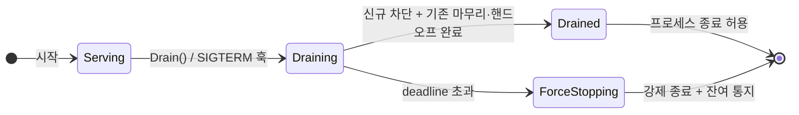

[스펙 목차](README.ko.md)

# Graceful Drain & Handoff 수명주기 계약

> **상태: 제안(Proposed).** [공개 계약 관리](public-contract-governance.ko.md)의 승격 절차를 아직
> 거치지 않았다. 이 계약은 [location runtime](location-runtime.ko.md)에 **draining 마커** 추가와
> STREAM 계층에 **세션 종료 사유 코드**(선택적으로 reconnect 안내 control packet)를 함축한다 —
> 승격 전 그 파급을 함께 검토해야 한다.

이 문서는 stateful 노드가 **우아하게 종료(graceful shutdown)**하거나 무중단 롤아웃을 위해
비워질 때, 무슨 일이 어떤 순서로 일어나는지를 정하는 언어 중립 공통 계약이다. 이것은 **런북이
아니라 계약**이다 — 배포 자동화(예: Kubernetes `preStop`)가 훅을 걸 수 있도록 framework가 노출하는
API와 상태 기계를 정의한다. 환경별 배포 매니페스트·grace period 값·용량 산정·대시보드는 이 문서의
범위가 아니다(팀의 몫). 네이밍은 [framework API](framework-api.ko.md)의 언어별 표현 원칙을 따른다.

## 1. 목적과 성격

무상태 서버는 그냥 죽여도 된다. 그러나 stateful 노드(라이브 SPOT 룸 + 바인딩된 actor + 활성 STREAM
세션을 가진 SpotNode)는 `SIGTERM` 즉시 종료 시 **접속 유저가 전부 튕기고 진행 중 룸이 유실**된다.

framework가 제공하는 것은 **v1 인스턴스의 우아한 종료(drain)**다 — v2 롤아웃(교체) 자체는 배포
오케스트레이터의 일이고, drain은 그 롤아웃이 무중단이 되게 하는 한쪽 절반이다. drain은 "새 배정은
막고, 기존 상태는 옮기거나 마무리하고, 다 끝나면 나간다"를 **명시적 계약**으로 정의한다.

## 2. 수명주기 상태 기계



| 상태 | 의미 | 배치 후보 | owner lease |
|------|------|:---------:|:-----------:|
| `Serving` | 정상 서비스 | O | 갱신 |
| `Draining` | 신규 차단, 기존 마무리·핸드오프 진행 | **X** | **계속 갱신**(§3.2) |
| `Drained` | 마무리 완료, 종료 안전 | X | 제거 직전 |
| `ForceStopping` | grace deadline 초과 → 강제 종료 | X | 제거 |

현재 상태는 `zlink.drain.state`(gauge, enum) 및 lifecycle 이벤트로 관측한다(§9).

## 3. location runtime 상호작용 (P0 핵심)

drain의 정확성은 [location runtime](location-runtime.ko.md)과의 상호작용에 달려 있다. 이 절이 이
계약의 가장 미묘한 부분이다.

### 3.1 "연결 유지 + 배치 제외"의 분리 — draining 마커

**순진한 구현의 자기모순:** Draining 진입 시 이 노드의 peer row를 **삭제**하면, [location-runtime
§6.3](location-runtime.ko.md)의 자동 연결 diff가 이 peer로의 연결을 **끊는다**. 그러면 §5의
"in-flight reply까지 마무리"와 actor transfer commit·핸드오프 메시징이 전부 깨진다. 즉 peer row
삭제로는 "신규 배정 제외"와 "기존 연결 유지"를 동시에 만족할 수 없다.

**계약:** location runtime의 peer row에 **draining 마커**를 둔다(peer row의 `Metadata` 또는
`Capabilities`에 `draining=true`, [location-runtime §2.1](location-runtime.ko.md) — 이는
location-runtime 스펙 개정 사항으로 명시한다). 마커는 **연결을 유지한 채 배치에서만 제외**한다.

**마커를 읽는 결정 지점**(전부 이 마커로 draining peer를 후보에서 제외):

| 결정 지점 | 동작 |
|-----------|------|
| spot `GetOrCreate` 배치(신규 room/owner spot 생성 노드 선택) | draining peer 제외 |
| actor join target 노드 선택 | draining peer 제외 |
| Entry Spot 배정 | draining peer 제외 |
| owner routing(신규 owner spot allocation) | draining peer 제외 |
| **자동 연결 diff(§6.3)** | **마커만으로 disconnect하지 않음**(연결 유지) |

`Weight`(0..100)를 0으로 두는 방법은 배치 로직이 Weight를 참조한다는 계약이 없으므로 채택하지
않는다 — 명시적 `draining` 마커 + 위 결정 지점 계약이 정본이다.

### 3.2 owner lease는 Draining 동안 계속 갱신한다

핸드오프는 곧 location row의 소유권 이동이다. [location-runtime §2.5](location-runtime.ko.md)에서
owner lease heartbeat(기본 5s)가 끊기면 TTL(기본 15s) 후 **그 owner의 전 row가 stale**이 되어
핸드오프 중 라우팅이 붕괴한다. 따라서:

1. **Draining ~ Drained 동안 owner lease heartbeat를 계속 갱신**한다. drain이 lease 갱신을 멈추면 안
   된다.
2. 핸드오프 완료 단위마다 대상 row는 target owner가 `Takeover`로 이전한다([location-runtime
   §3.1/§4](location-runtime.ko.md)의 계획된 이동 = deactivate-first + `Takeover`).
3. `Drained`/`ForceStopping` 종료 시 `RemoveOwnerLease` + owner별 일괄 row 제거([location-runtime
   §3.2](location-runtime.ko.md)의 "owner 자신의 shutdown 경로").

### 3.3 readiness flip의 전파 지연 — 정직한 상한

peer의 store 관찰은 polling(기본 1s)+k8s probe 주기라, 마커를 세운 뒤에도 **수 초간 신규 request/
연결이 계속 도착**한다. 그래서 §5의 "신규 차단"과 "기존 연결 위 신규 request 정상 처리"가 겉보기
모순이 아니다.

- **차단 대상은 신규 상태 배정**(spot 생성/actor join/신규 STREAM 연결)이다.
- **기존 연결 위 신규 request는 전파 지연 창 동안 정상 처리**한다. 완전 차단은 분산 시스템에서
  불가능하다.
- 전파 지연 상한은 `polling interval × N`(관찰 host 기준)이며, drain deadline은 이 창을 흡수하도록
  잡아야 한다.

## 4. Drain 단계 계약 (순서 고정)

`Drain(deadline)` 호출 시 다음이 이 순서로 일어난다.

1. **draining 마커 + 상태 전이** — 즉시 `Draining`으로 전이, peer row에 draining 마커(§3.1),
   `IsReady()`=false. location store에서 신규 배정 후보에서 빠진다.
2. **신규 수용 차단** — 새 STREAM 연결, 새 SPOT 생성, 새 actor join(admission)을 거부/리다이렉트.
   단, **진행 중 transfer의 inbound commit은 수용**한다(§5.3).
3. **핸드오프** — 이동 가능한 상태를 §5.1 정책으로 다른 노드로 옮긴다. owner lease는 계속 갱신(§3.2).
4. **in-flight 완료 대기** — 처리 중 request/콜백이 끝날 때까지 deadline 안에서 대기.
5. **완료 신호** — 위 완료 시 `Drained` 전이 + drain-complete 이벤트. 배포 자동화가 이 신호로 종료
   진행.
6. **deadline 초과** — `ForceStopping` 전이 + §7 강제 종료.

## 5. Surface별 Drain 동작

| surface | Draining 진입 시 동작 |
|---------|----------------------|
| **channel/route server** | draining 마커로 신규 배정 제외. in-flight reply까지 마무리 후 unbind. 전파 지연 창의 신규 request는 정상 처리(§3.3) |
| **STREAM session** | 신규 연결 거부(리다이렉트). 기존 세션은 §5.2 actor 핸드오프 + §7 종료 통지 |
| **actor** | §5.2 정책 |
| **SPOT** | §5.1 정책 |

### 5.1 SPOT 정책 (앱이 선언)

framework에는 **actor** transfer 표면만 있고 **SPOT 상태 이동** 표면은 없다([spot-actor](spot-actor.ko.md)는
actor의 spot 간 이동만 정의). 따라서 SPOT drain 정책은 다음 셋이며 **`migrate`는 이 계약 범위 밖**
이다(§5.4).

| 정책 | 동작 | 적합한 SPOT |
|------|------|-------------|
| `drain-natural` | 신규 join만 막고 룸이 자연 종료될 때까지 대기(deadline 내) | 짧은 룸(틱택토 한 판, Bingo) |
| `deadline` | 기한 내 강제 종료 + 참여 actor 통지 | 지속 룸이지만 이전 불가한 경우 |
| `release-and-recreate` | spot row를 해제 → 다음 요청이 타 노드에서 `GetOrCreate`로 재구성 | **event-sourcing owner spot**(ShoppingMall `OrderWorkflowSpot`, GameQuest `PlayerQuestSpot`) |

> `release-and-recreate`는 event store replay로 상태를 재구성할 수 있는 owner spot의 정답이다. 세션
> 없는 owner spot은 룸 정책과 별개로 이 경로로 비운다([ShoppingMall](../dotnet/guide/samples/shoppingmall-sample.ko.md)
> `projection rebuild`).

### 5.2 actor 핸드오프와 mid-transfer 경합

- **transfer adapter 미등록 actor도 이동 가능하다.** [spot-actor §6](spot-actor.ko.md): 미등록은
  실패가 아니라 **빈 state transfer가 기본**이다(도메인 상태만 빈 채로, target에서 lazy-load). 따라서
  앱은 actor type별로 "이동 허용(빈 state) / 자연 종료"를 선언한다 — "미등록=자연 종료"가 아니다.
- **mid-transfer × Drain 3케이스**([spot-actor §5.1/§5.2/§5.3](spot-actor.ko.md)):
  1. **source가 draining, outbound transfer 진행 중** → 그 transfer는 §5.1의 10단계 완료 조건까지
     완주한 뒤 집계한다. deadline 내 미완이면 §7 강제 종료 경로.
  2. **draining 노드가 transfer의 target** → 신규 admission(`OnActorJoin`)은 거부하되(§4-2), **이미
     admission accept된 commit은 수용**한다 — 거부하면 actor가 미아가 된다(§5.3).
  3. **drain의 대량 transfer 증폭** → drain은 다수 actor를 동시에 이동시키므로, 이동을 가로지른
     request의 orphan 위험([spot-actor §10.5](spot-actor.ko.md) 계약이 닫힌 구현에서는 0)이 있으면
     대량 증폭된다. `zlink.actor.transfer.request.orphaned`([runtime-metrics §4.3](runtime-metrics.ko.md))로
     관측하고, drain deadline은 [spot-actor §10.4](spot-actor.ko.md)의 forwarding window(기본 5s)를
     고려한다.

### 5.3 핸드오프 대상 선택과 "갈 곳 없음"

롤링 배포에서 여러 노드가 동시에 Draining일 수 있다.

- **대상 선택은 draining peer를 제외**한다(§3.1 마커).
- **eligible target이 0개**(전 노드 drain, v2 미기동)일 때 `migrate`/actor 핸드오프는 SPOT 정책의
  **`drain-natural`/`deadline`으로 강등**한다(폴백은 앱이 선언).
- 대상 선정 주체는 framework 기본 정책(배치 로직)이며, 앱이 정책 hook으로 override할 수 있다.

### 5.4 `migrate`(SPOT 상태 이동)는 별도 후속 스펙

room 상태를 통째로 다른 노드로 옮기는 `migrate`는 (i) room 상태 직렬화 hook(신설 공개 계약), (ii)
spot location row `Takeover`, (iii) 멤버 actor 전원의 연쇄 transfer와 부분 실패 처리, (iv) 이동 중
room 큐 콜백 처리 정책을 전부 요구한다. 이는 별도 스펙 **"room-spot transfer adapter"**로 분리하며,
**본 계약은 `migrate`의 메커니즘을 제공한다고 주장하지 않는다.**

## 6. API 표면 (언어 중립 동사)

| 동사 | 의미 |
|------|------|
| `Drain(deadline)` | 우아한 종료 시작. `Draining` 전이 |
| `IsReady()` | 현재 배정 후보 여부(probe 연결용) |
| `AwaitDrained()` | `Drained`(또는 `ForceStopping`) 도달까지 대기 |
| drain lifecycle 이벤트 | 상태 전이 관측 |

**동작 규칙:**

- `Drain()`은 **멱등**이다. 두 번째 호출은 no-op이며 같은 completion에 합류한다(다른 deadline이면
  더 이른 deadline을 채택).
- **자동 drain이 기본이다.** 프로세스 stop 신호(host shutdown/SIGTERM)가 오면 framework가 `Drain()`을
  자동 호출한다. 따라서 `Drain()` 전에 `AwaitDrained()`를 부른 배포 자동화는 미정의 동작이 아니라 그
  자동 drain(또는 뒤이은 명시 `Drain`)의 완료에 합류해 대기한다 — 오류를 정의로 제거한다.
- 기본 deadline 값은 언어별 spec에서 고정하되 언어 간 동일하게 둔다. deadline 없는 `Drain()`/
  `DrainAsync(ct)` overload가 이 기본값을 쓴다(자동 drain 경로와 대칭).

## 7. 강제 종료·타임아웃과 세션 종료 통지

grace deadline 초과 시:

- 잔여 actor/room을 **강제 종료**한다.
- 활성 STREAM 세션에 **종료 사유 코드**를 담은 종료 통지를 보낸다(`close_reason=server_drain`,
  [runtime-metrics §4.1](runtime-metrics.ko.md) 닫힌 enum).
- 유실 in-flight는 `zlink.drain.forced`(§9)로 계수.
- 통지 전송 자체가 deadline을 다시 무한 지연시키지 않도록 통지 상한을 둔다.

### 7.1 reconnect 안내는 와이어 변경 — 범위 결정

TCP/WS 연결은 이동할 수 없다. 세션의 재접속은 **클라이언트가 다른 노드로 다시 붙는 것**인데,
현재 connector의 자동 reconnect는 **같은 endpoint로만** 붙는다(STREAM guide 기준). 따라서 "다른
노드로 가라"는 안내는 다음을 요구한다.

- (i) 서버→클라이언트 **신규 control packet**(MFT §9급 와이어 스펙: flag/레이아웃/하위호환 — 구버전
  connector가 이 패킷을 받으면 무시하고 표준 재접속으로 폴백),
- (ii) connector 측 **대체 endpoint 수용·재접속 로직** 신설.

**본 계약의 기본 범위:** framework는 **종료 사유 코드(`server_drain`)만 제공**하고, 대체 endpoint로의
재접속 로직은 **앱/connector의 몫**으로 둔다. 이 사유 코드는 **connector 측에서 disconnect 시 읽을 수
있어야** 하므로, connector의 disconnect 이벤트/오류 표면에 `closeReason`(닫힌 enum, [runtime-metrics
§4.1](runtime-metrics.ko.md)의 `close_reason`과 정합)을 노출한다. 클라이언트는 이 값을 보고 재접속·백오프를
결정한다. 언어별 projection은 각 connector 문서가 소유한다(예:
[Java `ZLinkStreamCloseReason`](languages/java/stream-connector.ko.md),
[Node `closeReason` union](languages/node/stream-connector.ko.md)); .NET/C++/Kotlin connector도 같은
닫힌 enum을 언어 케이싱으로 노출한다. reconnect 안내 control packet(서버가 대체 endpoint를 지정)은 별도 후속 스펙으로 분리하며,
채택 시 이 절을 MFT §9 형식의 와이어 레이아웃 절로 확장한다.

## 8. 배포 자동화 연동 (개념 예시)

framework는 아래 훅 지점만 제공하고, 스크립트·probe 배선은 팀이 쓴다.

```text
# Kubernetes preStop (개념)
1. SIGTERM 또는 preStop 진입
2. app: Drain(deadline=25s)     # framework: 마커 + 신규 차단 + 핸드오프 + lease 계속 갱신
3. app: AwaitDrained()          # Drained 또는 ForceStopping 도달
4. 프로세스 종료

# readiness probe
- probe 엔드포인트 → IsReady() → Draining이면 false → LB/서비스에서 제외
```

> framework는 preStop 스크립트·probe 서버를 대신 제공하지 않는다. `Drain`/`AwaitDrained`/`IsReady`
> API와 그 수명주기 계약만 제공한다.

## 9. 관측

drain lifecycle 이벤트는 [MFT observer 계약](message-flow-tracing.ko.md)(offload executor, 예외
격리 — [비동기 실행 정책](async-execution-policy.ko.md))을 따른다. 계기 이름 문법·종류·라벨은
[runtime-metrics](runtime-metrics.ko.md)를 따른다.

**drain 이벤트는 source 등록이 필요 없다(오류를 정의로 제거).** socket/spot monitoring source와 달리
drain은 노드 생애 수 회의 저빈도 lifecycle 이벤트라 polling·filter 파라미터가 없다. 따라서 등록 표면
(`AddDrainEvents` 같은 것)을 만들지 않고, runtime event handler가 존재하면 monitoring 구성 유무와
무관하게 항상 수신한다. drain 이벤트의 `SourceName`은 **고정값 `drain`**이다. 이렇게 해야 flow
correlation이 제거한 "조용한 무관측" 함정이 drain에서 재발하지 않는다.

| 계기/이벤트 | 종류 | 의미 |
|-------------|------|------|
| `zlink.drain.state` | gauge(enum) | 현재 drain 상태(Serving/Draining/Drained/ForceStopping) |
| `zlink.drain.duration` | histogram | Drain 시작→Drained 소요(프로세스 생애 1회 이벤트, fleet 집계용) |
| `zlink.drain.actors.handed_off` | counter | 핸드오프 성공 actor 수 |
| `zlink.drain.rooms.drained` | counter | 정책대로 정리된 room 수(`policy` 라벨) |
| `zlink.drain.forced` | counter | deadline 초과로 강제 종료된 단위 수 |
| drain lifecycle 이벤트 | observer | 상태 전이(운영 알람 연결) |

## 10. 구현 상태

언어별 drain API 표면과 현재 차이는 [언어별 구현 차이](implementation-gap.ko.md)에 기록한다.

## 11. 회귀 테스트 매트릭스 (DRAIN)

| ID | 검증 |
|----|------|
| DRAIN-001 | `Drain()` 즉시 draining 마커 + `IsReady()`=false, 신규 배정 후보에서 제외되나 **연결은 유지** |
| DRAIN-002 | Draining 중 새 STREAM 연결·새 SPOT·새 actor admission이 거부/리다이렉트 |
| DRAIN-003 | transfer adapter 등록 actor가 대상 노드로 이동 후 bound session 연속성 유지 |
| DRAIN-004 | SPOT 정책 `drain-natural`/`deadline`/`release-and-recreate`가 각각 명세대로 동작 |
| DRAIN-005 | in-flight request가 deadline 안에서 완료된 뒤 `Drained` 전이 |
| DRAIN-006 | deadline 초과 시 `ForceStopping` + 세션에 `server_drain` 종료 통지 |
| DRAIN-007 | `AwaitDrained()`가 Drained/ForceStopping에서 정확히 반환 |
| DRAIN-008 | drain 계기(state/duration/handed_off/forced)가 실제 결과와 일치 |
| DRAIN-009 | Draining 동안 owner lease가 계속 갱신되어 기존 row가 stale로 전락하지 않음 |
| DRAIN-010 | draining 노드로 향하던 진행 중 transfer의 inbound commit은 수용, 신규 admission은 거부 |
| DRAIN-011 | outbound transfer 진행 중 Drain 발화 시 [spot-actor §5.1](spot-actor.ko.md) 10단계까지 완주 후 집계 |
| DRAIN-012 | 동시 drain으로 eligible target이 없을 때 `drain-natural`/`deadline` 폴백으로 강등 |
| DRAIN-013 | readiness flip 후 기존 연결로 도착한 request가 전파 지연 창 동안 정상 처리(오류율 0) |
| DRAIN-014 | 핸드오프 완료 단위 location row가 `Takeover`/재등록으로 이전되고 구 row resolve가 실패하지 않음(전환 원자성) |
| DRAIN-015 | `Drain()` 중복 호출이 멱등(두 번째 호출은 동일 완료 신호에 합류) |
| DRAIN-016 | Drained/ForceStopping 종료 시 owner lease 및 잔여 row 제거(`RemoveOwnerLease` 경로) |
| DRAIN-017 | ForceStopping 세션 종료 통지가 통지 상한 내에 끝나고 프로세스 종료를 무한 지연시키지 않음 |

## 12. 언어별 투영

| 언어 | 표면 |
|------|------|
| `.NET` | `IHostApplicationLifetime` + hosted service `StopAsync(ct)`에서 `Drain`; readiness는 health check |
| Java/Kotlin | Spring `SmartLifecycle.stop(Runnable)` graceful shutdown; Actuator readiness group |
| Node | NestJS `onApplicationShutdown(signal)` + `enableShutdownHooks()`; readiness는 health controller |
| C++ (레퍼런스) | `app.drain(deadline)` / `app.await_drained()` / `app.is_ready()` |

---

> 관련: [location runtime](location-runtime.ko.md) · [spot-actor](spot-actor.ko.md) ·
> [runtime metrics](runtime-metrics.ko.md) · [메시지 흐름 상관관계](flow-correlation.ko.md)
