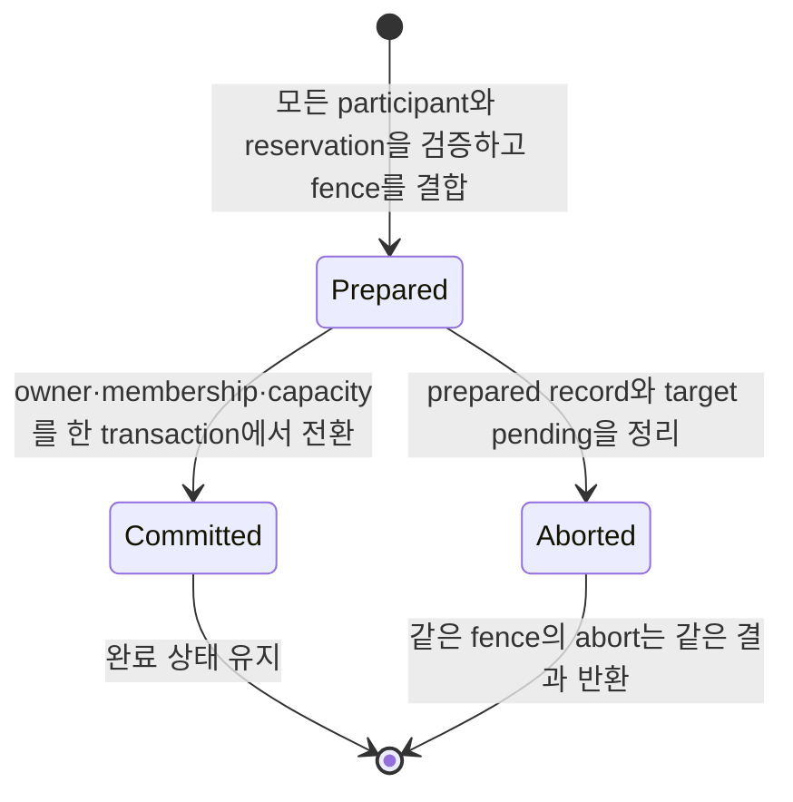

# C++ maintenance record와 의미

[C++ exact interface 목차](README.ko.md) · [Location Store SPI](07-location-store.ko.md#3-location-store-구성)

## 1. Authority와 Relocation provider capability

`location_store_t`는 아래 record를 사용하는 opaque authority CAS를 필수 capability로 제공한다. Class와
전체 member declaration은 [Location Store SPI](07-location-store.ko.md#3-location-store-구성)가 유일하게 소유한다. Relocation Store 등록 조건과
missing·duplicate startup error는 [Configuration과 host](02-configuration-host.ko.md)가 소유한다. Application
service code는 두 provider operation을 직접 호출하지 않는다.

부분 capability를 따로 등록하거나 조합하는 public interface는 제공하지 않는다. Descriptor, owner lease, authority와 placement
변경이 같은 transaction domain에 있어야 하므로 provider는 `location_store_t` 하나를 완전하게
구현한다.

완료 가능한 모든 cross-node Actor·Spot 이동은 Relocation Store를 사용한다. `Recreate`도 accepted journal과
recovery payload를 저장하며 `Snapshot`은 application state를 추가로 저장한다. Same-node Actor join은 Relocation
payload를 만들지 않고, `Disabled` cross-node 이동은 capture 전에 거부한다.

```cpp
struct authority_key_t { std::string value; };
struct object_creation_target_t {
    std::string mesh_name;
    node_rid_t node_rid;
    std::uint64_t node_lifecycle_generation;
    location_owner_token_t owner;
};
enum class placement_allocation_state_t : std::uint8_t {
    reserved = 1,
    active = 2
};
struct spot_type_capacity_delta_t {
    placement_object_kind_t object_kind;
    std::string stable_type;
    std::uint32_t slots;
};
struct placement_capacity_bundle_t {
    std::uint32_t actor_slots;
    std::uint32_t spot_slots;
    std::optional<spot_type_capacity_delta_t> spot_type;
};
struct placement_allocation_t {
    placement_allocation_state_t state;
    placement_object_kind_t object_kind;
    std::string stable_type;
    object_creation_target_t target;
    placement_capacity_bundle_t capacity_bundle;
};
struct pending_object_creation_t {
    std::string reservation_id;
    std::string request_content_reference;
    std::array<std::byte, 32> request_sha256;
    std::uint32_t request_encoded_size;
};
struct authority_snapshot_t {
    std::string store_version;
    std::vector<std::byte> payload;
    std::uint64_t object_generation;
    std::uint64_t authority_owner_generation;
    location_owner_token_t owner;
    placement_allocation_t allocation;
    std::optional<pending_object_creation_t> pending_creation;
    std::chrono::system_clock::time_point store_now;
};

struct authority_missing_t {
    std::chrono::system_clock::time_point store_now;
};
using authority_read_result_t =
  std::variant<authority_missing_t, authority_snapshot_t>;

enum class authority_generation_transition_t {
    preserve = 1,
    new_owner = 2
};

struct authority_entry_t {
    authority_key_t key;
    authority_snapshot_t snapshot;
};
class authority_scan_cursor_t final {
public:
    explicit authority_scan_cursor_t(std::string encoded);
    std::string_view encoded() const noexcept;

private:
    std::string encoded_;
};
struct authority_page_t {
    std::vector<authority_entry_t> items;
    std::optional<authority_scan_cursor_t> next_cursor;
};
struct authority_scan_expired_t {};
using authority_scan_result_t =
  std::variant<authority_page_t, authority_scan_expired_t>;

struct relocation_capacity_fence_t {
    std::string value;
};

struct authority_put_t {
    std::vector<std::byte> payload;
    authority_generation_transition_t generation_transition;
    std::optional<location_owner_token_t> target_owner;
    std::optional<relocation_capacity_fence_t> relocation_capacity_fence;
};
struct authority_restore_t {
    std::vector<std::byte> payload;
    location_owner_token_t expected_owner;
};
struct authority_delete_t {};
using authority_mutation_t =
  std::variant<authority_put_t, authority_restore_t, authority_delete_t>;

struct authority_stored_t { authority_snapshot_t snapshot; };
struct authority_deleted_t {
    std::string store_version;
    std::chrono::system_clock::time_point store_now;
};
struct authority_conflict_t { authority_read_result_t current; };
struct authority_generation_exhausted_t {};
using authority_compare_exchange_result_t = std::variant<
  authority_stored_t, authority_deleted_t, authority_conflict_t,
  authority_generation_exhausted_t>;

struct object_creation_key_t {
    placement_object_kind_t kind;
    std::string global_id;
};

struct object_creation_intent_t {
    std::string stable_type;
    std::string request_content_reference;
    std::array<std::byte, 32> request_sha256;
    std::uint64_t request_encoded_size;
};

struct object_reserve_request_t {
    object_creation_key_t key;
    object_creation_intent_t intent;
    object_creation_target_t target;
    std::vector<std::byte> creating_payload;
    placement_capacity_bundle_t capacity_bundle;
};

struct object_reservation_fence_t {
    std::string reservation_id;
    std::string expected_store_version;
    std::uint64_t object_generation;
    std::uint64_t authority_owner_generation;
    object_creation_target_t target;
    placement_capacity_bundle_t capacity_bundle;
};

struct object_reserved_t {
    object_reservation_fence_t fence;
    authority_snapshot_t creating;
};
struct object_already_exists_t { authority_snapshot_t current; };
struct object_type_mismatch_t { authority_snapshot_t current; };
struct object_placement_capacity_exhausted_t {};
struct object_reserve_conflict_t { authority_read_result_t current; };
using object_reserve_result_t = std::variant<
  object_reserved_t,
  object_already_exists_t,
  object_type_mismatch_t,
  object_placement_capacity_exhausted_t,
  object_reserve_conflict_t,
  authority_generation_exhausted_t>;

struct object_commit_request_t {
    object_creation_key_t key;
    object_reservation_fence_t fence;
    std::vector<std::byte> ready_payload;
};
struct object_committed_t { authority_snapshot_t ready; };
struct object_already_committed_t { authority_snapshot_t ready; };
struct object_commit_stale_t {};
struct object_commit_conflict_t { authority_read_result_t current; };
using object_commit_result_t = std::variant<
  object_committed_t,
  object_already_committed_t,
  object_commit_stale_t,
  object_commit_conflict_t,
  authority_generation_exhausted_t>;

struct creation_operation_identity_t {
    routing_id_t source_node_rid;
    std::uint64_t source_node_generation;
    std::uint64_t operation_id_high;
    std::uint64_t operation_id_low;
};

enum class creation_terminal_state_t : std::uint8_t {
    created = 1,
    rejected = 2,
    failed = 3
};

struct creation_terminal_publication_t {
    std::vector<std::byte> semantic_envelope;
    std::array<std::byte, 32> semantic_envelope_sha256;
    std::chrono::system_clock::time_point expires_at;
};

struct creation_terminal_record_t {
    creation_operation_identity_t operation;
    std::string reservation_id;
    placement_object_kind_t object_kind;
    creation_terminal_state_t state;
    creation_terminal_publication_t publication;
    std::chrono::system_clock::time_point store_now;
};

struct creation_terminal_missing_t {};
struct creation_terminal_found_t { creation_terminal_record_t terminal; };
using creation_terminal_read_result_t = std::variant<
  creation_terminal_missing_t,
  creation_terminal_found_t>;

struct object_creation_created_t {
    std::vector<std::byte> ready_payload;
    creation_terminal_publication_t publication;
};
struct object_creation_rejected_t {
    creation_terminal_publication_t publication;
};
struct object_creation_failed_t {
    creation_terminal_publication_t publication;
};
using object_creation_completion_t = std::variant<
  object_creation_created_t,
  object_creation_rejected_t,
  object_creation_failed_t>;

struct object_creation_complete_request_t {
    object_creation_key_t key;
    object_reservation_fence_t fence;
    creation_operation_identity_t operation;
    object_creation_completion_t completion;
};
struct object_creation_completed_t { creation_terminal_record_t terminal; };
struct object_creation_already_completed_t {
    creation_terminal_record_t terminal;
};
struct object_creation_complete_stale_t {};
struct object_creation_complete_conflict_t {
    authority_read_result_t current;
};
using object_creation_complete_result_t = std::variant<
  object_creation_completed_t,
  object_creation_already_completed_t,
  object_creation_complete_stale_t,
  object_creation_complete_conflict_t,
  authority_generation_exhausted_t>;

struct object_abort_request_t {
    object_creation_key_t key;
    object_reservation_fence_t fence;
};
struct object_aborted_t {};
struct object_already_aborted_t {};
struct object_abort_stale_t {};
struct object_abort_conflict_t { authority_read_result_t current; };
using object_abort_result_t = std::variant<
  object_aborted_t,
  object_already_aborted_t,
  object_abort_stale_t,
  object_abort_conflict_t,
  authority_generation_exhausted_t>;

struct relocation_capacity_reserve_request_t {
    std::array<std::byte, 16> reservation_id;
    authority_key_t key;
    std::string expected_store_version;
    placement_object_kind_t object_kind;
    std::string stable_type;
    object_creation_target_t source;
    object_creation_target_t target;
    placement_capacity_bundle_t capacity_bundle;
};
struct relocation_capacity_reserved_t {
    relocation_capacity_fence_t fence;
};
struct relocation_capacity_already_reserved_t {
    relocation_capacity_fence_t fence;
};
struct relocation_capacity_conflict_t {
    authority_read_result_t current;
};
struct relocation_capacity_target_unavailable_t {};
struct relocation_capacity_exhausted_t {};
using relocation_capacity_reserve_result_t = std::variant<
  relocation_capacity_reserved_t,
  relocation_capacity_already_reserved_t,
  relocation_capacity_conflict_t,
  relocation_capacity_target_unavailable_t,
  relocation_capacity_exhausted_t>;

enum class relocation_capacity_abort_result_t : std::uint8_t {
    aborted = 1,
    already_aborted = 2,
    already_committed = 3,
    stale = 4
};

struct aggregate_id_t {
    std::array<std::byte, 16> value;
};

struct inventory_digest_t {
    std::array<std::byte, 32> value;
};

struct aggregate_participant_t {
    authority_key_t key;
    std::string expected_store_version;
    authority_generation_transition_t owner_transition;
    std::vector<std::byte> authority_payload;
    std::vector<std::byte> membership_mutation;
};

struct aggregate_prepare_request_t {
    aggregate_id_t aggregate_id;
    std::uint64_t aggregate_generation;
    std::vector<aggregate_participant_t> participants;
    inventory_digest_t inventory_digest;
    mesh_node_descriptor_key_t target_descriptor;
    std::uint64_t target_descriptor_lifecycle_generation;
    placement_capacity_bundle_t capacity_bundle;
    location_owner_token_t target_owner;
};

struct aggregate_fence_t {
    aggregate_id_t aggregate_id;
    std::uint64_t aggregate_generation;
};

struct aggregate_prepared_t { aggregate_fence_t fence; };
struct aggregate_already_prepared_t { aggregate_fence_t fence; };
struct aggregate_prepare_conflict_t {};
struct aggregate_prepare_stale_t {};
using aggregate_prepare_result_t = std::variant<
  aggregate_prepared_t,
  aggregate_already_prepared_t,
  aggregate_prepare_conflict_t,
  aggregate_prepare_stale_t,
  authority_generation_exhausted_t>;

enum class aggregate_commit_result_t : std::uint8_t {
    committed = 1,
    already_committed = 2,
    stale = 3,
    generation_exhausted = 4
};

enum class aggregate_abort_result_t : std::uint8_t {
    aborted = 1,
    already_aborted = 2,
    stale = 3
};

struct relocation_stored_t {
    std::string reference;
    std::uint32_t checksum_crc32c;
    std::chrono::system_clock::time_point expires_at;
    std::chrono::system_clock::time_point store_now;
};
struct relocation_found_t { std::vector<std::byte> payload; };
struct relocation_missing_t {};
using relocation_read_result_t =
  std::variant<relocation_found_t, relocation_missing_t>;
enum class relocation_delete_result_t { deleted = 0, missing = 1 };
struct relocation_renewed_t {
    std::chrono::system_clock::time_point expires_at;
    std::chrono::system_clock::time_point store_now;
};
struct relocation_renew_missing_t {};
using relocation_renew_result_t =
  std::variant<relocation_renewed_t, relocation_renew_missing_t>;

class relocation_store_t {
public:
    virtual ~relocation_store_t() = default;
    virtual task_t<relocation_stored_t> put_relocation(
      std::vector<std::byte> payload,
      std::chrono::hours retention,
      std::stop_token cancellation = {}) = 0;
    virtual task_t<relocation_read_result_t> get_relocation(
      std::string reference,
      std::stop_token cancellation = {}) = 0;
    virtual task_t<relocation_renew_result_t> renew_relocation(
      std::string reference,
      std::chrono::hours retention,
      std::stop_token cancellation = {}) = 0;
    virtual task_t<relocation_delete_result_t> delete_relocation(
      std::string reference,
      std::stop_token cancellation = {}) = 0;
};

```

`checksum_crc32c`는 저장된 immutable root bytes의 CRC32C(Castagnoli)를 나타내는 exact unsigned 32-bit 값이다.
Runtime은 이 값과 Location [authority](../../../../01-glossary.ko.md#authority)에 publish할 checksum이 정확히 같은지 검증한다.

`placement_capacity_bundle_t`는 Actor slot 수, Spot slot 수와 optional Spot kind·stable type slot을 함께
보존한다. 각 slot 수는 `0..2147483647`이고 bundle 전체에는 양수 slot이 하나 이상 있어야 한다.
`spot_type`은 User·Instance Spot 항목만 허용한다. Actor 하나는
`{actor_slots=1, spot_slots=0, spot_type=nullopt}`, User·Instance Spot 하나는
`{actor_slots=0, spot_slots=1, spot_type=(kind, stable_type, 1)}`을 사용한다. User Spot과 member Actor
`N`개의 aggregate relocation은 Spot 1개, 해당 stable type 1개와 Actor `N`개를 하나의 bundle로 사용한다.
Location Store는 bundle이 요구하는 Actor 전체·Spot 전체·Spot stable type별 limit을 한 transaction에서
검사하며 일부 slot만 예약하거나 전환하지 않는다.

Creation과 relocation operation의 조건과 변경 결과는 다음과 같다. 표는 아래의 exact field 검증 규칙을
요약하며, 표에 적지 않은 expectation을 생략하지 않는다.

| Operation | 실행 조건 | 성공하면 함께 변경하는 값 | 중복·불일치 결과 |
|---|---|---|---|
| `reserve(...)` | Authority가 Missing이고 target descriptor, owner lease와 capacity 조건을 만족해야 한다. | Creating authority, generation, creation intent와 target pending capacity를 한 atomic operation에 기록한다. | Existing object, type mismatch, capacity 부족과 conflict는 각각 선언된 variant로 반환한다. Counter가 소진되면 `authority_generation_exhausted_t`이며 mutation은 0이다. |
| `commit(...)` | Exact creation reservation과 target [descriptor](../../../../01-glossary.ko.md#descriptor) lifecycle·[owner lease](../../../../01-glossary.ko.md#owner-lease)가 계속 일치해야 한다. | Creating을 Ready로 바꾸고 pending capacity를 줄이며 active capacity를 늘린다. | 같은 fence는 `object_already_committed_t`, 다른 generation은 `object_commit_stale_t`, current authority 불일치는 `object_commit_conflict_t`다. 닫힌 결과에는 `authority_generation_exhausted_t`도 포함되며 실패하면 reservation을 유지하고 mutation은 0이다. |
| `complete_creation(...)` | Exact reservation과 source node lifecycle·operation ID가 일치해야 한다. | Created는 Ready authority와 operation terminal을 함께 기록하고 Rejected·Failed는 Creating과 pending capacity를 정리하면서 operation terminal을 기록한다. | 같은 operation은 저장된 semantic terminal을 반환한다. 서로 다른 operation은 terminal을 공유하지 않고 Ready면 Existing을 반환하며, Creating 정리가 끝났으면 새 reservation을 얻어 실행한다. |
| `read_creation_terminal(...)` | Source node RID raw bytes, source lifecycle generation과 128-bit operation ID가 모두 일치해야 한다. | Authority를 변경하지 않고 해당 operation의 semantic terminal만 읽는다. | Terminal이 없으면 `creation_terminal_missing_t`다. 다른 operation이나 현재 request correlation으로 검색하지 않는다. |
| `abort(...)` | Exact Creating authority와 reservation fence가 일치해야 한다. Current target lifecycle이나 lease는 요구하지 않는다. | Creating authority와 해당 target pending capacity를 함께 해제한다. | 같은 fence는 `object_already_aborted_t`, 다른 generation은 `object_abort_stale_t`, current authority 불일치는 `object_abort_conflict_t`다. 닫힌 결과에는 mutation이 0인 `authority_generation_exhausted_t`도 포함된다. |
| `reserve_relocation_capacity(...)` | Request source가 current authority와 durable Active allocation에 일치하고 target이 live하며 capacity가 있어야 한다. | Target pending capacity만 예약하고 fence를 durable하게 유지한다. | 같은 ID와 같은 request는 `relocation_capacity_already_reserved_t`, 다른 내용은 `relocation_capacity_conflict_t`, target이 유효하지 않으면 `relocation_capacity_target_unavailable_t`, capacity가 부족하면 `relocation_capacity_exhausted_t`다. |
| Standalone `new_owner` CAS | Reserved fence와 authority version, source·target owner가 모두 일치해야 한다. | Authority [owner](../../../../01-glossary.ko.md#owner) 변경, source active 감소와 target pending-to-active 변경을 한 transaction에서 처리한다. | Fence나 expectation이 다르면 current authority read를 포함한 `authority_conflict_t`이며 mutation은 0이다. |
| `prepare_aggregate(...)` | `new_owner`가 있으면 해당 participant의 exact non-zero capacity만 합산한다. All-preserve이면 capacity는 zero이고 membership mutation은 모두 empty여야 한다. | Relocation mode는 Reserved fence를 bind한다. All-preserve mode는 reservation 없이 payload 변경을 durable Prepared record에 고정한다. | Zero+`new_owner`, non-zero+all-preserve와 다른 불일치는 `aggregate_prepare_conflict_t`이며 mutation은 0이다. Exact duplicate는 `aggregate_already_prepared_t`, 다른 generation은 `aggregate_prepare_stale_t`다. |
| `commit_aggregate(...)` | Relocation mode는 allocation과 target descriptor·owner를, all-preserve mode는 participant expectation을 다시 확인한다. | Relocation mode는 owner·membership·capacity를 전환한다. All-preserve mode는 owner, 두 generation, membership과 Active allocation을 유지하고 payload만 atomic하게 바꾼다. | 같은 fence는 `already_committed`, 다른 generation이나 stale expectation은 `stale`이며 mutation은 0이다. 닫힌 결과에는 `generation_exhausted`도 포함된다. |
| `abort_aggregate(...)` | 같은 aggregate generation이 아직 commit되지 않았어야 한다. | Prepared record와 bind된 fence의 target pending을 정리하고 fence를 aborted로 닫는다. | 같은 fence는 idempotent하고 다른 generation은 stale이다. |

Aggregate lifecycle은 다음 순서로 진행한다.



Target 검증이 stale이거나 expectation 하나가 다르면 일부 participant만 변경하지 않는다. Commit 전 target
검증 실패는 fence를 Prepared에 bind한 상태로 유지하며, 다른 불일치는 아래에 정의한 결과와 mutation 0
규칙을 따른다.

`reserve(...)`는 Framework가 encode한 `creating_payload`를 해석하지 않고 Missing authority를 Creating으로
바꾸며 final object·owner generation, durable creation intent와
target typed reserved capacity bundle을 하나의 atomic operation에서 확정한다. Request content는 최대 1 MiB이며 reference와
SHA-256이 일치해야 한다. Reservation에는 TTL을 두지 않는다. `commit(...)`은 exact reservation에서
target descriptor lifecycle과 owner lease를 다시 확인하고 Framework가 encode한 `ready_payload`를 해석하지
않은 채 Creating→[Ready](../../../../01-glossary.ko.md#ready)와 bundle 전체의 Reserved→Active 전환을 함께 처리한다. Stale이면 mutation 0으로 reservation을
유지한다. `abort(...)`는 current lifecycle·lease를 요구하지 않고 reservation에 고정한 exact Creating authority와
이전 target reserved bundle 전체만 해제한다. 같은 fence의 Commit과 Abort는 각각 `object_already_committed_t`와
`object_already_aborted_t`를 반환하고 다른 reservation generation은 stale 결과다. Counter가 소진되면 mutation과
counter 소비 없이 `authority_generation_exhausted_t`를 반환한다. Reserve의 결과는 Reserved, AlreadyExists,
TypeMismatch, PlacementCapacityExhausted, Conflict와 GenerationExhausted로 닫혀 있다. Provider는 object kind를
해석하지 않지만 Reserved snapshot에는 `pending_creation`을 반드시 반환하고 Active [snapshot](../../../../01-glossary.ko.md#snapshot)에서는 `nullopt`로
반환한다. 이 projection은 provider-issued reservation ID와 Actor·User [Spot](../../../../01-glossary.ko.md#spot)·Instance Spot 생성 요청의 immutable
content reference, exact 32-byte SHA-256과 `0..1 MiB` encoded size를 가진다. Target-owned [Instance Spot](../../../../01-glossary.ko.md#entry-spot-user-spot과-instance-spot)의 cold
activation content만 complete `instance-activation-recovery-v1` envelope이며, Actor와 User Spot의 manager create
content에는 이 envelope를 사용하지 않는다.

Actor manager 생성의 terminal은 `creation-operation-terminal-v1` semantic envelope로 저장한다. 이 envelope에는
현재 transport correlation이나 reply route를 넣지 않는다. Runtime은 같은 source node RID raw bytes,
source lifecycle generation과 128-bit operation ID의 replay에만 terminal을 재사용하고, 현재 요청의
correlation과 reply route로 reply framing을 새로 만든다. 서로 다른 operation이 Creating을 관찰하면 authority
종료를 기다린다. 종료 결과가 Ready이면 Existing을 반환하고 Rejected·Failed 정리가 끝났으면 새 reservation으로
자기 요청을 실행한다. Terminal retention은 원래 요청 deadline에서 최소 5분이다.

Existing object relocation은 creation reservation을 재사용하지 않는다. `reserve_relocation_capacity`는
non-zero 128-bit reservation ID, current authority version, kind·stable type, source·target descriptor와 exact
owner token과 typed `capacity_bundle`을 검증하고 target의 bundle 전체를 Reserved로 예약한다. 같은 ID와 exact request는
`relocation_capacity_already_reserved_t`, 다른 내용은 conflict다. Standalone Actor의 `new_owner` CAS와 aggregate
commit만 fence를 소비하며 source Active bundle 감소와 target Reserved→Active 전환을 authority mutation과 같은
transaction에서 처리한다. Commit 전 abort는 reserved bundle 전체를 해제하고 reservation은 TTL로 만료시키지 않는다.
Standalone `new_owner` fence가 reserved 상태가 아니거나 authority key·expected StoreVersion·source·target
owner와 일치하지 않거나 이미 committed·aborted됐으면 current authority read를 담은
`authority_conflict_t`다. CAS transaction은 request source를 durable current Active allocation과 다시
비교하고 target descriptor lifecycle과 target owner lease만 live/exact로 확인한다. Source descriptor row나
source owner lease가 stale·missing이어도 allocation match가 유지되면 commit할 수 있다. Target이 stale이면
authority row, capacity와 fence state의 mutation은 0이다.

`aggregate_id_t`는 all-zero가 아닌 128-bit 값이고 aggregate generation은
`1..9223372036854775807`이다. `participants`는 authority key의 canonical byte order로 정렬하며 중복이 없는
bounded canonical participant set이다. Participant는 최대 1024개이며 prepare request와 durable aggregate
record의 encoded 크기는 각각 최대 1 MiB다. `inventory_digest`는 participant set과 mutation 전체를 canonical
encode한 bytes의 SHA-256이다. Provider는 participant payload와 [membership](../../../../01-glossary.ko.md#membership) mutation을 해석하지 않는다.
`prepare_aggregate(...)`는 participant의 `owner_transition`으로 두 mode를 판정한다. `new_owner`가 하나라도
있는 relocation mode는 `preserve` participant와 섞을 수 있다. `capacity_bundle`은 `new_owner` participant의
durable allocation delta만 exact 합산한 non-zero typed bundle이어야 한다. User Spot initial relocation에서는
owner가 바뀌는 Actor slot `N`, Spot slot `1`과 User Spot stable type slot `1`을 표현한다. 모든 participant
expectation과 durable Active allocation, `target_descriptor`, lifecycle generation과 `target_owner`를 exact
검증한 뒤 bundle을 같은 transaction에서 reserved capacity로 예약한다.

모든 participant가 `preserve`이면 completion·steady-normalization mode다. `capacity_bundle`은 exact zero이고
모든 `membership_mutation`은 empty여야 한다. Capacity reservation·mutation 없이 exact participant set의
payload만 atomic하게 변경하며 owner, object generation,
[AuthorityOwnerGeneration](../../../../01-glossary.ko.md#authorityownergeneration)과 durable Active allocation을 유지한다.
Zero capacity와 `new_owner`, non-zero capacity와 all-preserve 조합은 conflict이고 mutation은 0이다. Exact
duplicate prepare만 already-prepared다. Relocation mode의 `commit_aggregate(...)`는 owner·membership·capacity를
한 transaction에서 전환하고 completion·steady-normalization mode는 payload만 변경한다. Commit 직전 mode별
expectation이 stale이면 mutation 없이 prepared 상태를 유지한다. `abort_aggregate(...)`는 relocation mode에서만
target pending을 정리하고 fence를 aborted로 닫는다. 같은
fence는 idempotent하고 다른 generation은 stale이며 expectation 하나가 다르면 participant, reservation, index와
counter를 하나도 변경하지 않는다.

`compare_exchange_authority`는 Active `Found`의 current StoreVersion 문자열을 직접 받는다. Missing authority를
만드는 public transition은 없다. `authority_put_t::target_owner`와 `relocation_capacity_fence`는 `preserve`에서
`std::nullopt`, `new_owner`에서 필수다. Provider는 exact target owner
lease를 CAS와 같은 transaction에서 검증하고 성공한 snapshot의 `owner`로 기록하며 opaque payload에서 owner
metadata를 해석하지 않는다. `preserve`는 stored current owner lease, `new_owner`는 `target_owner` lease를
검증한다. Missing·stale lease는 current authority read를 가진
`authority_conflict_t`로 끝나고 mutation은 0이다. Invalid `target_owner` 조합은 provider 호출 전에
`std::invalid_argument`로 거부한다. Missing result에 fake StoreVersion을 넣지 않는다.

`authority_restore_t`는 current StoreVersion과 `expected_owner`를 같은 transaction에서 exact하게 검증하고
opaque payload와 StoreVersion만 바꾼다. Owner, allocation, object generation과 authority owner generation은
유지하며 current owner lease의 live 상태는 요구하지 않는다. 따라서 이전 process의 lease가 만료된 뒤에도
startup recovery가 exact authority snapshot을 복구할 수 있다. Provider는 payload의 relocation phase를 해석하지
않는다.
`list_authorities`의 first page는 `cursor=nullopt`로 요청한다. Provider는 한 snapshot을 만들고 이어지는
page에 필요한 모든 상태를 하나의 `authority_scan_cursor_t`에 담는다. 다음 page는 직전 page의
`next_cursor` 객체를 해석하거나 다시 조립하지 않고 그대로 넘긴다. Cursor의 UTF-8 encoded 크기는
`1..4096` bytes이며 empty cursor는 허용하지 않는다. Constructor는 범위를 검증하고 값을 복사하므로
만든 뒤에는 바뀌지 않는다. Provider는 snapshot에 포함된 key incarnation을 scan 전체에서 각각 한 번만
반환한다. Concurrent delete는 Framework의 exact read에서 missing으로 제거되고 snapshot 뒤의
create·recreate는 다음 scan에서 반환된다. Framework는
각 candidate를 exact read한 뒤 current StoreVersion으로 CAS한다. 등록한 MeshName scope의 initial scan이
완료되기 전에는 Serving을 게시하지 않고, 이후 scan은 background recovery로 반복한다.
Provider가 cursor가 가리키는 scan을 만료시켰으면 이어지는 page 요청은 `authority_scan_expired_t`를
반환한다. Framework는 부분 결과를 사용하지 않고 first page부터 새 scan을 시작한다.
한 authority opaque payload의 encoded 크기는 최대 1 MiB다. Scan `limit`은 `1..1000`이고 provider는
encoded page 4 MiB에 먼저 도달하면 요청보다 적은 entry와 `next_cursor`를 반환한다. 이 byte limit을
바꾸는 public option은 없다. Hot authority row는 compact metadata와 replay cursor만 보관하며 complete terminal
reply bytes는 relocation stream에 저장한다.
Page는 opaque key와 payload를 반환하며 provider는 payload를 해석하지 않는다. Framework operational
query가 Actor projection을 decode하며 이 목록은 routing authority로 사용하지 않는다. Provider domain은
영구적인 global object generation, authority owner generation과 Store revision counter를 각각 하나씩 유지한다.
Generic Reserve만 object와 initial owner generation, Reserved allocation을 발급한다. Commit은 같은 allocation을
Active로 바꾸고 Abort는 Reserved allocation을 제거한다. `new_owner`는 owner generation만 증가시키고 target
Active allocation으로 바꾸며 `preserve`는 generation과 allocation을 유지한다. Delete는 Active allocation의
exact capacity bundle 전체를 감소시키고 row를 제거한다. Reserved row의 generic CAS는 conflict와 mutation 0이다. Stored
mutation과 delete는 global Store revision으로 fence하고 per-key counter나 version tombstone을 유지하지 않는다.
Scan lease가 활성화된 동안만 scan snapshot을 유지하기 위한 tombstone을 bounded로
유지할 수 있다. Payload에 generation을 중복 encode하지 않는다. Authority row는
TTL을 갖지 않고 explicit fenced delete가 성공할 때까지 유지된다. Owner·coordinator lease는 별도 token row에
저장하며 lease 만료나 reclaim이 authority row를 삭제하거나 수정하지 않는다. Framework는
relocation put과 renew의 retention에 24시간을 전달한다. Authority의 current relocation reference를 확인한
owner 또는 recovery coordinator만 renew를 호출한다. Renew 성공은 provider clock의 새 expiry와 Store time을
반환한다. Missing reference는 `relocation_renew_missing_t` 정상 결과이며 retention은 application option이
아니다. Framework는 logical relocation payload를 immutable 64 MiB chunk 최대 4096개와 root manifest로 내부에서
나누므로 logical state ceiling은 256 GiB다. Relocation Store의 opaque put/get interface는 바꾸지 않으며
chunk 크기, 개수와 manifest를 설정하는 public option도 제공하지 않는다. Capture가 ceiling을 넘으면 seal을
되돌려 normal messaging을 다시 허용하고 Retire 결과를 `blocked`로 종료한다. 일반 message의 negotiated
effective bound는 relocation chunk 크기 때문에 줄이지 않는다. Provider는 key, authority payload와 relocation
payload를 해석하지 않는다.

Location Store는 phase, relocation reference와 checksum, canonical participant set, participant mutation,
aggregate generation, membership·aggregate count와 inventory digest를 authority로 소유한다. Relocation manifest는
opaque state, accepted journal, full inventory와 replay payload를 찾는 용도일 뿐 authority가 아니다. Framework는
manifest를 먼저 저장하고 digest가 [Location Store](../../../../01-glossary.ko.md#location-store)의 canonical inventory digest와 일치하는지 확인한 뒤 authority
CAS로 reference를 공개한다. Root를 교체할 때도 새 root 저장과 digest 검증을 먼저 수행하고, CAS가 성공한 뒤
이전 reference를 release한 다음 이전 payload를 삭제한다. Relocation payload 사용을 끝낼 때는 Location Store에서
reference 사용 종료를 CAS한 뒤 Relocation Store에서 payload를 삭제한다. 두 Store 사이 transaction은 요구하지 않는다.
Authority가 참조하는 Relocation payload가 없거나 digest가 일치하지 않으면 `RelocationDataLost`로 종료하며 이전
owner로 rollback하지 않는다. Restore와 accepted journal replay는 manifest digest와 `inventory_digest`가 exact
match인 경우에만 시작한다.

세 counter는 `1..9223372036854775807` 범위이며 wrap하거나 재사용하지 않는다. CAS 성공에 새
StoreVersion, object generation 또는 authority owner generation이 필요한데 해당 global counter가 최댓값이면
provider는 non-retriable `authority_generation_exhausted_t`를 반환한다. 이 결과는 row, index와 모든 counter를
바꾸거나 값을 소비하지 않는다. 외부 상태가 바뀌지 않은 채 같은 expectation을 다시 제출하면 같은 결과를
반환한다. Transport 또는 provider exception은 이 닫힌 결과와 구분한다. Framework는 기존 lifecycle failure로
operation을 닫으며 application용 error enum을 추가하지 않는다.

Framework가 provider에 넘긴 authority와 relocation 입력 buffer는 asynchronous operation이 끝날 때까지
유효하며 바뀌지 않는다. Provider가 완료 뒤에도 buffer를 보관하려면 먼저 복사해야 한다. Provider가 성공
result로 반환한 payload storage는 result가 사용되는 동안 안정적이어야 하며 provider는 반환 뒤 그 storage를
수정하거나 다른 result에 재사용하지 않는다. Mutable buffer 기반 adapter는 provider boundary에서 snapshot을
만든다.

Cancellation이 provider 호출 전에 이미 요청되었으면 Framework는 provider operation을 시작하지 않으므로 I/O와
commit이 없다. Provider operation을 시작한 뒤 waiter가 취소되거나 오류로 끝나면 commit 여부는 알 수 없다.
Authority CAS는 같은 exact key와 expectation의 StoreVersion을 다시 읽어 결과를 reconcile한 뒤 retry한다.
Relocation put은 content-addressed reference를 확인한 뒤 idempotent하게 retry한다. Authority에 연결되지 않은
committed put은 orphan이며 고정 retention과 cleanup으로 제거한다. 이 의미를 표현하는 public result는 추가하지
않는다.

`location_store_t` class와 Location record, owner lease, watch, Redis provider의 exact declaration은
[Location Store·Redis](07-location-store.ko.md)가 소유한다. 이 문서는 stateful maintenance에서 사용하는
authority·placement·aggregate record와 별도 `relocation_store_t` declaration을 소유한다. Authority Store를 root에 별도로 등록하는
member는 제공하지 않는다. Location Store와 Relocation Store 등록 member는
[Configuration과 host](02-configuration-host.ko.md)의 `zlink_framework_options_t`가 소유한다.
Redis creation-terminal key의 RID segment는 transport `routing_id_t`의 exact raw bytes 길이와 그 raw bytes의
lowercase hex를 사용한다. Canonical hex text를 UTF-8로 다시 encode하지 않는다. Raw bytes가 `node-a`이면
segment는 `6:6e6f64652d61`이다.
