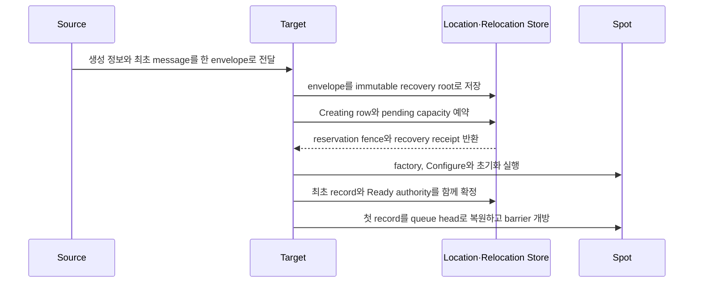

# .NET Spot 공개 인터페이스

Session에 bind된 Actor를 포함한 Spot relocation은 owner와 membership을 commit한 뒤 필요한 lifecycle
callback과 accepted journal replay·logical timer 복원을 끝내고 durable source state를 정리한 다음 `Completed`를 commit한다.
같은 `ObjectGeneration`에 command 44 route update와 command 45 ACK를 교환하고 steady route로
normalize한 뒤에만 target packet·push를 허용한다. Relocation 자체는 physical·logical disconnect가
아니므로 Actor disconnect callback을 실행하지 않는다. 다른 Actor의 route와 physical connection은
변경하지 않는다.

[.NET exact interface 목차](README.ko.md)

## 1. Spot

SpotId는 UTF-8 encoded 크기 1..255 bytes의 `string`이며 Location Store transaction domain 전체에서
유일한 logical ID다. 비교는 case-sensitive exact match이고 normalization하지 않는다. 일반 message는 SpotId만 받고
current authority를 resolve한다. `SpotRef`는 exact incarnation을 닫을 때 사용하는 immutable location
snapshot이며 runtime resource나 local Spot instance를 소유하지 않는다.

```csharp
public enum ZLinkSpotKind
{
    Invalid = 0,
    Entry = 1,
    User = 2,
    Instance = 3
}

public readonly record struct SpotRef(
    string SpotId,
    ulong ObjectGeneration,
    string MeshName,
    RoutingId NodeRid);

public enum ZLinkSpotCloseReason
{
    ExplicitClose = 0,
    HostShutdown = 1,
    RelocationOut = 2
}

public readonly record struct ZLinkSpotClosingContext(
    ZLinkSpotCloseReason Reason,
    DateTimeOffset Deadline);

public interface IZLinkSpot
{
    IZLinkSpotContext Context { get; }
    void Configure()
    {
    }

    ValueTask<ZLinkSpotCreateResponse> OnCreateAsync(
        ZLinkMessage request,
        CancellationToken cancellationToken)
    {
        // 기본 lifecycle은 생성 요청을 수락한다.
        return ValueTask.FromResult(ZLinkSpotCreateResponse.Accept());
    }

    ValueTask OnInitializeAsync(CancellationToken cancellationToken)
    {
        return ValueTask.CompletedTask;
    }

    ValueTask OnClosingAsync(
        ZLinkSpotClosingContext context,
        CancellationToken cleanupCancellationToken)
    {
        return ValueTask.CompletedTask;
    }
}

public interface IZLinkInstanceSpot
{
    IZLinkInstanceSpotContext Context { get; }
    void Configure()
    {
    }

    ValueTask OnInitializeAsync(CancellationToken cancellationToken)
    {
        return ValueTask.CompletedTask;
    }

    ValueTask OnClosingAsync(
        ZLinkSpotClosingContext context,
        CancellationToken cleanupCancellationToken)
    {
        return ValueTask.CompletedTask;
    }
}

public interface IZLinkSpotRelocationAdapter<TSpot>
    where TSpot : class
{
    ValueTask<byte[]> CaptureAsync(
        TSpot spot,
        CancellationToken cancellationToken);
    ValueTask RestoreAsync(
        TSpot spot,
        ReadOnlyMemory<byte> payload,
        CancellationToken cancellationToken);
}

public readonly record struct ZLinkSpotCreateResponse(
    bool Accepted,
    ZLinkMessage? Reply)
{
    public static ZLinkSpotCreateResponse Accept(ZLinkMessage? reply = null);
    public static ZLinkSpotCreateResponse Accept<TReply>(TReply reply);
    public static ZLinkSpotCreateResponse Reject(ZLinkMessage? reply = null);
    public static ZLinkSpotCreateResponse Reject<TReply>(TReply reply);
}

public interface IZLinkSpotHandlerRegistry : IZLinkActorHandlerRegistry
{
    void AddPacket<THandler>() where THandler : class;
    void AddSubscribe<THandler>(string channelName, string topic) where THandler : class;
}

public interface IZLinkInstanceSpotHandlerRegistry
{
    void AddPacket<THandler>() where THandler : class;
}

public interface IZLinkSpotOutbound
{
    IZLinkSpotSendCall SendToSpot<TMessage>(string spotId, TMessage message);
    IZLinkSpotRequestCall RequestToSpot<TRequest>(string spotId, TRequest request);
    IZLinkPublishCall Publish<TEvent>(
        string channelName,
        string topic,
        TEvent message);
    IZLinkSendCall SendToChannel<TMessage>(
        string channelName,
        TMessage message);
    IZLinkChannelRequestCall RequestToChannel<TRequest>(
        string channelName,
        TRequest request);
}

public interface IZLinkSpotCommonContext
{
    string MeshName { get; }
    string SpotId { get; }
    ulong ObjectGeneration { get; }
    RoutingId NodeRid { get; }
    IZLinkSpotOutbound Outbound { get; }
    ValueTask<IZLinkTimer> AddTimer<THandler>(
        string name,
        TimeSpan period,
        ZLinkTimerOptions? options = null,
        CancellationToken cancellationToken = default)
        where THandler : class;
    IZLinkWorkerCall<TResult> RunCpuWorker<TResult>(
        Func<CancellationToken, TResult> work);
    IZLinkWorkerCall<TResult> RunIoWorker<TResult>(
        Func<CancellationToken, ValueTask<TResult>> work);
}

public interface IZLinkSpotContext : IZLinkSpotCommonContext
{
    IZLinkSpotHandlerRegistry Handlers { get; }

    ValueTask LeaveActorAsync(
        IZLinkActor actor,
        CancellationToken cancellationToken = default);

    ValueTask<bool> CloseAsync(
        CancellationToken cancellationToken = default);
}

public interface IZLinkInstanceSpotContext : IZLinkSpotCommonContext
{
    IZLinkInstanceSpotHandlerRegistry Handlers { get; }

    ValueTask<bool> CloseAsync(
        CancellationToken cancellationToken = default);
}

public interface IZLinkEntrySpot
{
    IZLinkEntrySpotContext Context { get; }
    void Configure()
    {
    }

    ValueTask OnInitializeAsync(CancellationToken cancellationToken)
    {
        return ValueTask.CompletedTask;
    }

    ValueTask OnClosingAsync(
        ZLinkSpotClosingContext context,
        CancellationToken cleanupCancellationToken)
    {
        return ValueTask.CompletedTask;
    }
}

public interface IZLinkSpotActorMembershipLifecycle<TActor>
    where TActor : IZLinkActor
{
    ValueTask OnJoinedActorAsync(
        TActor actor,
        CancellationToken cancellationToken);

    ValueTask OnLeaveActorAsync(
        TActor actor,
        CancellationToken cancellationToken);

    ValueTask OnDisconnectActorAsync(
        TActor actor,
        CancellationToken cancellationToken)
    {
        // 연결 단절 처리가 필요하지 않은 Spot은 이 callback을 구현하지 않아도 된다.
        return ValueTask.CompletedTask;
    }
}

public interface IZLinkSpotActorLifecycle<TActor>
    : IZLinkSpotActorMembershipLifecycle<TActor>
    where TActor : IZLinkActor
{
    ValueTask<ZLinkSpotActorJoinResult> OnActorJoinAsync(
        string actorId,
        ZLinkMessage request,
        CancellationToken cancellationToken);
}

public interface IZLinkSpot<TActor> : IZLinkSpot, IZLinkSpotActorLifecycle<TActor>
    where TActor : IZLinkActor;

public readonly record struct ZLinkActorCreateResponse(
    bool Accepted,
    ZLinkMessage? Reply)
{
    public static ZLinkActorCreateResponse Accept(ZLinkMessage? reply = null);
    public static ZLinkActorCreateResponse Accept<TReply>(TReply reply);
    public static ZLinkActorCreateResponse Reject(ZLinkMessage? reply = null);
    public static ZLinkActorCreateResponse Reject<TReply>(TReply reply);
}

public interface IZLinkEntrySpot<TActor>
    : IZLinkEntrySpot, IZLinkSpotActorMembershipLifecycle<TActor>
    where TActor : IZLinkActor
{
    ValueTask<ZLinkActorCreateResponse> OnCreateActorAsync(
        TActor actor,
        ZLinkMessage createRequest,
        CancellationToken cancellationToken)
    {
        // 기본 lifecycle은 Actor 생성을 승인한다.
        return ValueTask.FromResult(ZLinkActorCreateResponse.Accept());
    }

    ValueTask OnActorRelocatedAsync(
        TActor actor,
        CancellationToken cancellationToken)
    {
        // 이동 뒤 별도 처리가 필요하지 않은 Entry Spot은 기본 구현을 사용한다.
        return ValueTask.CompletedTask;
    }
}

public readonly record struct ZLinkSpotActorJoinResult(
    bool Accepted,
    ZLinkMessage? Reply)
{
    public static ZLinkSpotActorJoinResult Accept(ZLinkMessage? reply = null);
    public static ZLinkSpotActorJoinResult Accept<TReply>(TReply reply);
    public static ZLinkSpotActorJoinResult Reject(ZLinkMessage? reply = null);
    public static ZLinkSpotActorJoinResult Reject<TReply>(TReply reply);
}

public interface IZLinkEntrySpotContext : IZLinkSpotCommonContext
{
    IZLinkSpotHandlerRegistry Handlers { get; }

    ValueTask DestroyActorAsync(
        IZLinkActor actor,
        CancellationToken cancellationToken = default);
}

public interface IZLinkSpotActorSendHandler<TSpot, TActor, in TMessage>
    where TSpot : class
    where TActor : IZLinkActor
{
    ValueTask HandleAsync(
        TSpot spot,
        TActor actor,
        IZLinkMessageContext context,
        TMessage message,
        CancellationToken cancellationToken);
}

public interface IZLinkSpotActorRequestHandler<TSpot, TActor, in TRequest, TReply>
    where TSpot : class
    where TActor : IZLinkActor
{
    ValueTask<TReply> HandleAsync(
        TSpot spot,
        TActor actor,
        IZLinkMessageContext context,
        TRequest request,
        CancellationToken cancellationToken);
}

public interface IZLinkEntrySpotActorSendHandler<TEntrySpot, TActor, in TMessage>
    where TEntrySpot : class, IZLinkEntrySpot
    where TActor : IZLinkActor
{
    ValueTask HandleAsync(
        TEntrySpot entrySpot,
        TActor actor,
        IZLinkMessageContext context,
        TMessage message,
        CancellationToken cancellationToken);
}

public interface IZLinkEntrySpotActorRequestHandler<TEntrySpot, TActor, in TRequest, TReply>
    where TEntrySpot : class, IZLinkEntrySpot
    where TActor : IZLinkActor
{
    ValueTask<TReply> HandleAsync(
        TEntrySpot entrySpot,
        TActor actor,
        IZLinkMessageContext context,
        TRequest request,
        CancellationToken cancellationToken);
}
```

`ZLinkSpotCloseReason`의 numeric 값은 `ExplicitClose=0`, `HostShutdown=1`, `RelocationOut=2`다.
`Deadline`은 closing operation의 absolute deadline이다. Framework는 callback invocation 전에는
`cleanupCancellationToken`을 취소하지 않고 [deadline](../../../../01-glossary.ko.md#deadline)이 끝날 때 취소한다. 이미 취소된 handler token을 재사용하지
않는다. Entry·User·Instance Spot만 callback을 받고 Actor별 closing callback은 제공하지 않는다. Host Shutdown은
Actor membership과 local instance가 유효한 상태에서 callback을 실행하고 completion 뒤 scope와 [authority](../../../../01-glossary.ko.md#authority)를
정리한다. Standalone Actor relocation은 Entry Spot을 닫지 않으므로 이 callback을 호출하지 않는다.

`IZLinkSpotRelocationAdapter<TSpot>`은 [Snapshot](../../../../01-glossary.ko.md#relocation-policy) policy로 cross-node User·[Instance Spot](../../../../01-glossary.ko.md#entry-user-instance-spot) instance를
materialize할 때만 호출한다. Whole User Spot relocation에서는 [Spot](../../../../01-glossary.ko.md#spot) adapter가 Spot application payload를 처리하고,
각 member Actor의 payload는 Actor factory에 등록한 Actor adapter가 각각 처리한다. `Recreate`는 adapter를 호출하지
않고 application state 없이 instance를 다시 만들며 `Disabled`는 capture 전에 cross-node 이동을 거부한다.

Spot adapter의 capture와 restore는 stable relocation attempt에서 at-least-once 호출될 수 있으므로 retry-safe해야
한다. `CaptureAsync(...)` 결과는 최대 64 MiB이며 빈 배열은 유효하고 null은 contract 위반이다. Framework는
완료된 배열을 즉시 복사하고 이후 application mutation을 관찰하지 않는다. `RestoreAsync(...)`의
`ReadOnlyMemory<byte>`는 callback 완료까지만 유효하므로 보관하려면 application이 복사해야 한다. Capture
exception은 durable abort와 source normalization 뒤 admission을 복원한다. Restore exception이 발생한 instance는
폐기하고, 새 attempt는 [factory](../../../../01-glossary.ko.md#factory)가 만든 새 instance에 같은 immutable payload를 적용한다. Framework가 operation
deadline 때문에 callback을 취소하면 `DeadlineExceeded`로 분류한다. Framework는 callback의 external side effect를
exactly-once로 실행한다고 보장하지 않는다.

Maintenance가 Actor를 다른 node의 Entry Spot에 복원하면 Actor adapter restore를 먼저 완료하고 Location authority와
Entry [membership](../../../../01-glossary.ko.md#membership)을 commit한다. Target Entry Spot의 `OnActorRelocatedAsync(...)`와 source Entry Spot의
`OnLeaveActorAsync(...)`를 완료한 뒤 accepted journal을 replay하고 logical timer를 복원한다. 이어서 old Entry
membership을 포함한 source resource cleanup, `Completed` CAS, bound-session route switch·ACK와 steady
normalization을 마친 뒤에만 Actor dispatch admission을 연다. 어느 callback이 실패해도
authority를 source로 rollback하지 않고 target을 sealed 상태로 유지한 채 재시도한다.
Source process가 종료되면 exact source fence의 durable cleanup terminal이 source callback 완료를 대신하므로
target recovery를 막지 않는다.
User Spot으로 향하는 일반 application join은 target의 `OnActorJoinAsync(...)`,
membership commit, target의 `OnJoinedActorAsync(...)` 순서를 유지한다. Entry Spot
복귀는 admission callback 없이 membership을 commit한 뒤 target Entry Spot의
`OnJoinedActorAsync(...)`를 호출한다.
Whole User Spot aggregate move는 membership callback을 호출하지 않는다. `OnActorRelocatedAsync(...)`를 포함한 lifecycle callback은 at-least-once 호출될 수 있으므로
retry-safe해야 한다.

Spot과 Actor의 current location 조회는 manager가 global ID로 수행한다. Public resolver와 runtime handle은
제공하지 않는다. owner route와 generation 갱신 규칙은
[Spot 주소 메시징](../../../../24-spot-address-messaging.ko.md)을 따른다.

Spot handler signatures는 다음과 같다.

```csharp
public interface IZLinkSpotPacketHandler<TSpot, in TMessage>
    where TSpot : class
{
    ValueTask HandleAsync(
        TSpot spot,
        TMessage message,
        CancellationToken cancellationToken);
}

public interface IZLinkSpotRequestHandler<TSpot, in TRequest, TReply>
    where TSpot : class
{
    ValueTask<TReply> HandleAsync(
        TSpot spot,
        TRequest request,
        CancellationToken cancellationToken);
}

public interface IZLinkSpotSubscriptionHandler<TSpot, in TEvent>
    where TSpot : class
{
    ValueTask HandleAsync(
        TSpot spot,
        TEvent message,
        ZLinkPublishMessageContext context,
        CancellationToken cancellationToken);
}

public interface IZLinkSpotTimerHandler<TSpot>
    where TSpot : class
{
    ValueTask HandleAsync(
        TSpot spot,
        ZLinkTimerTick tick,
        CancellationToken cancellationToken);
}

public interface IZLinkTimer : IAsyncDisposable
{
    bool IsDisposed { get; }
    ValueTask CancelAsync();
}

public sealed record ZLinkTimerOptions
{
    public ZLinkTimerOverrunPolicy OverrunPolicy { get; init; }
        = ZLinkTimerOverrunPolicy.SkipLateTicks;
    public int MaxCatchUpTicks { get; init; } = 1;
    public bool StopOnUnhandledException { get; init; }
}

public enum ZLinkTimerOverrunPolicy
{
    SkipLateTicks = 1,
    CatchUpBounded = 2,
    DelayNextTick = 3
}

public readonly record struct ZLinkTimerTick(
    string Name,
    ulong DeliveryIndex,
    ulong ScheduledIndex,
    TimeSpan Period,
    DateTimeOffset ScheduledAt,
    DateTimeOffset StartedAt,
    TimeSpan ScheduledElapsed,
    TimeSpan StartedElapsed,
    TimeSpan Delay,
    ulong SkippedTicks);
```

Framework timer는 owner Actor·Spot에 속한 logical registration이다. Cross-node relocation에서는 timer 이름,
handler type, period, `ZLinkTimerOptions`, scheduling cursor와 seal 시점의 pending tick을 relocation payload에
자동으로 포함한다. Application의 relocation adapter는 timer를 capture·restore하거나 target에서 다시 등록하지
않는다. Native timer handle과 backend state는 payload에 포함하지 않고 target runtime이 logical registration으로
다시 만든다. Source는 queue를 seal한 뒤 새 tick을 dispatch하지 않으며 target은 Restore와 authority commit을
마치고 dispatch admission이 열린 뒤에만 복원한 pending tick과 다음 tick을 [owner](../../../../01-glossary.ko.md#owner) mailbox에 제출한다.

Spot 외부 client는 다음 시그니처를 사용한다.

```csharp
public interface IZLinkSpotClient
{
    IZLinkSpotSendCall SendToSpot<TMessage>(string spotId, TMessage message);
    IZLinkSpotRequestCall RequestToSpot<TRequest>(string spotId, TRequest request);
}

public interface IZLinkSpotSendCall : IZLinkMetadataCall<IZLinkSpotSendCall>
{
    IZLinkSpotSendCall InstanceSpot();
    IZLinkSpotSendCall InstanceSpot(string instanceSpotType);
    IZLinkSpotSendCall InMesh(string meshName);
    ValueTask Async(
        CancellationToken cancellationToken = default);
}

public interface IZLinkSpotRequestCall : IZLinkMetadataCall<IZLinkSpotRequestCall>
{
    IZLinkSpotRequestCall InstanceSpot();
    IZLinkSpotRequestCall InstanceSpot(string instanceSpotType);
    IZLinkSpotRequestCall InMesh(string meshName);
    IZLinkSpotRequestCall Timeout(TimeSpan timeout);
    ValueTask<TReply> Async<TReply>(
        CancellationToken cancellationToken = default);
    ValueTask<TReply> Yield<TReply>(
        CancellationToken cancellationToken = default);
}

public enum ZLinkSpotCreateState
{
    Existing = 0,
    Created = 1,
    Rejected = 2
}

public readonly record struct ZLinkSpotCreateResult(
    SpotRef Spot,
    ZLinkSpotCreateState State,
    ZLinkMessage? Reply);

public interface IZLinkSpotManager
{
    IZLinkSpotCreateCall Create(string spotType);
    IZLinkSpotGetOrCreateCall GetOrCreate(
        string spotId,
        string spotType);
    ValueTask<SpotRef?> FindAsync(
        string spotId,
        CancellationToken cancellationToken = default);
    ValueTask<bool> CloseAsync(
        SpotRef spot,
        CancellationToken cancellationToken = default);
}

public interface IZLinkSpotCreateCall
{
    IZLinkSpotCreateCall InMesh(string meshName);
    IZLinkSpotCreateCall Request(ZLinkMessage request);
    IZLinkSpotCreateCall Request<TRequest>(TRequest request);
    IZLinkSpotCreateCall Timeout(TimeSpan timeout);
    ValueTask<ZLinkSpotCreateResult> Async(CancellationToken cancellationToken = default);
    ValueTask<ZLinkSpotCreateResult> Yield(CancellationToken cancellationToken = default);
}

public interface IZLinkSpotGetOrCreateCall
{
    IZLinkSpotGetOrCreateCall InMesh(string meshName);
    IZLinkSpotGetOrCreateCall Request(ZLinkMessage request);
    IZLinkSpotGetOrCreateCall Request<TRequest>(TRequest request);
    IZLinkSpotGetOrCreateCall Timeout(TimeSpan timeout);
    ValueTask<ZLinkSpotCreateResult> Async(CancellationToken cancellationToken = default);
    ValueTask<ZLinkSpotCreateResult> Yield(CancellationToken cancellationToken = default);
}

public interface IZLinkSpotPublisherClient
{
    IZLinkPublishCall Publish<TEvent>(
        string channelName,
        string topic,
        TEvent message);
}
```

User·Instance SpotId는 UTF-8 encoded 크기 1..255 bytes의 global string key다. Stable type은 UTF-8 1..255 bytes이며 case-sensitive exact value로
비교하고 normalization하지 않는다. `SpotRef.ObjectGeneration`은 1..`long.MaxValue`다. MeshName과 NodeRid는
조회 시점의 route snapshot이며 identity key에 포함하지 않는다.

`IZLinkSpotOutbound`과 `IZLinkSpotClient`는 global SpotId를 받고 Spot 전용 call을 반환한다. 일반
call은 current Ready location만 resolve한다. RID가 Missing이면 send는 `TargetNotFound`, request는
`RequestTargetNotFound`로 완료한다. `InstanceSpot()`
또는 `InstanceSpot(instanceSpotType)`을 명시한 call만 Missing Instance Spot을 새로 만들고 초기화하여
사용할 수 있게 준비할 수 있다. 이 과정을 cold activation이라 한다. [Ready](../../../../01-glossary.ko.md#ready) Instance authority가 있는 call은
authority에 저장된 [stable type](../../../../01-glossary.ko.md#stable-type)을 사용하므로 caller가
type을 다시 제공할 필요가 없다. Instance marker를 사용했는데 existing authority가 User Spot이거나
명시한 stable type과 authority의 type이 다르면 `SpotTypeMismatch`다.

[Cold activation](../../../../01-glossary.ko.md#cold-activation)에서 `InstanceSpot()`은 선택된 Mesh에 등록된
Instance Spot type이 하나일 때만 그
type을 사용한다. 등록 type이 여러 개면 `InstanceSpot(instanceSpotType)`으로 type을 명시해야
한다. 선택한 Mesh에 type이 없으면 target-not-found, 여러 개인데 type을 생략하면
`InvalidConfiguration`으로 완료한다.
`InMesh`는 Missing Instance Spot을 처음 생성할 Mesh를 지정한다. Object Client 또는 Server role의
Mesh가 하나면 생략할 수 있다. 후보가 둘 이상인데 생략하면 `MeshSelectionRequired`, 후보가 없으면
`ObjectClientNotConfigured`, 지정한 Mesh가 없으면 `MeshNotFound`로 완료한다. 이 option은 Instance
marker가 있는 call에서만 유효하며 marker 없이 사용하면
`InvalidConfiguration`이다. Existing authority를 다른 Mesh나 owner로
이동시키지 않는다. Option을 사용해도 target node나 endpoint를 지정할 수는 없다. Request
`Timeout`은 resolve, cold activation, handler와 reply 전체의 deadline을 고정한다. One-way call은 선택한
MeshNode의 send deadline에 resolve, cold activation과 outbound admission을 포함한다. Metadata와 terminal
소유권은 각 call이 계속 유지하며, send는 `Async`, request는 `Async<TReply>` 또는
`Yield<TReply>`로 한 번만 제출한다. Instance marker와 각 option은 한 번만 설정할 수 있다.
`Yield<TReply>`는 `SpotWide` User Spot 또는 Instance Spot callback에서만 유효하다. Entry Spot,
`PerActor` User Spot, Entry Spot Actor, Node·Channel handler와 owner turn 밖의 client에서 호출하면
operation을 제출하거나 turn을 반납하지 않고 `InvalidConfiguration`으로 완료한다.

`IZLinkInstanceSpot`은 `IZLinkSpot`을 상속하지 않는 actor-free lifecycle interface다. Direct packet과 timer
handler만 등록할 수 있다. Actor handler나 Logical Multicast subscription을 등록하면 Framework는 `Ready`
commit 전에 activation을 거부한다.

Store-backed User Spot은 manager create operation이 reservation을 시작하지만 Instance Spot은 최초 message가
생성 요청을 시작한다. Source와 target은 다음 순서로 역할을 나눈다.

1. Source는 `Ready` authority가 있으면 current owner에게 일반 message를 보낸다.
2. Authority가 `Missing`이고 `InstanceSpot(...)` intent가 있으면 Source가 eligible target을 선택한다.
   Source는 placement reservation을 만들지 않는다.
3. Source는 최초 message와 creation intent를 하나의 activation envelope에 넣어 target으로 보낸다. 이
   envelope는 `Ready` 전 application dispatch가 아니라 target activation을 요청하는 Framework 내부 message다.
4. Target은 metadata presence와 frame을 포함한 complete
   [activation envelope](../../../../01-glossary.ko.md#activation-envelope)를 Relocation Store에 immutable
   recovery root로 먼저 저장한다.
5. 같은 Spot의 local instance가 없을 때만 Target이 자신을 owner로 하는 `Creating` row와 pending capacity를
   Reserve한다. Pending snapshot은 provider가 발급한 reservation fence와 recovery root receipt를 반환한다.
6. Reservation을 먼저 확보한 target만 factory로 target scope와 Spot을 만든 뒤 `Configure`,
   `OnInitializeAsync`를 실행하고 최초 message를 durable activation inbox의 첫 record로 확정한다.
   `OnCreateAsync`나 empty `ZLinkMessage`는 사용하지 않는다.
7. Target은 handler barrier를 유지한 채 recovery root·cursor, `Ready`와 active capacity를 commit한다.
   Runtime은 첫 record를 local queue head로 복원한 뒤 barrier를 연다.



이 다이어그램은 선택된 target이 reservation을 먼저 확보한 정상 경로다. 경쟁 target이나 중복 envelope가
먼저 reservation을 확보하면 현재 target은 factory를 시작하지 않는다. 대신 current authority를 읽어 owner로
reroute하거나 진행 중인 attempt에 합류한다. Source는 `Ready` 뒤 같은 message를 다시 보내지 않으므로 최초
message는 한 번만 queue에 들어간다. Authority와 일치하지 않는 local-only instance는 message를 처리할 수
없다. Activation envelope transport는 CAS 전에 허용하지만 일반 Spot transport와 application dispatch는
current `Ready` authority만 사용한다. 이 barrier를 제어하는 별도 application API는 없다.
Recovery pointer는 첫 handler terminal completion을 durable하게 기록하고 replay cursor를 inbox sequence까지
갱신한 뒤에만 Preserve CAS로 제거한다. Queue admission만으로 제거하지 않는다.

`CloseAsync(spotRef)`는 exact incarnation만 닫는다. 해당 incarnation이 없으면 `false`, generation이 다르면
`SpotGenerationStale`, pre-commit seal 중이면 `SpotMoving`이다. User Spot에 Actor membership이 남아 있으면
`false`이며 Actor를 자동 leave·destroy하지 않는다. Framework는 current ref를 다시 찾아 다른 incarnation을
닫지 않는다.

`IZLinkSpotManager`는 User Spot의 명시적 create·get-or-create, resolve와 exact close만 제공한다. Manager에
Spot kind를 선택하는 인자나 Instance Spot create·get-or-create overload를 두지 않는다. Instance Spot의
생성 경로는 Spot 전용 message call의 명시적 `InstanceSpot(...)` opt-in 하나다. Instance Spot
구현이 자신의 lifecycle을 종료하는 `IZLinkInstanceSpotContext.CloseAsync()`는 남긴다.

User Spot Create와 GetOrCreate call은 single-use다. 같은 option을 두 번 설정하면 `InvalidConfiguration`, terminal
`Async(...)`를 두 번 호출하면 `AlreadySubmitted`다. `InMesh(...)` 선택과 오류 및 전체
deadline 규칙은 Actor create와 같다. `Create`는 Framework가 새 global Spot ID를 발급한다. `GetOrCreate`는 같은
User Spot stable type의 Ready Spot을 `Existing`으로 반환한다. Creating이면 authority
변경을 기다리고, Ready가 되면 `Existing`, cleanup으로 Missing이 되면 새 reservation을
경쟁한다. CAS loser는 별도 factory를 실행하지 않는다. Kind나 type이 다르면 `SpotTypeMismatch`, deadline 안에 terminal state가 되지 않으면
`DeadlineExceeded`다. Creation request는 최대 1 MiB이며 reservation 전에 immutable
reference와 hash로 보관한다.

Missing authority에 대한 첫 `InstanceSpot(...)` call이 kind, stable type과 initial Mesh를 creation intent에
기록한다. Ready authority에 대한 message는 SpotId만으로 current owner를 resolve한다. Owner loss 뒤
reactivation은 authority에 저장한 intent를 사용하며 marker가 없는 Missing call은 새 intent를 만들지
않는다. Public activation driver, address, handle, resolver와 unbounded list는 제공하지 않는다. 운영 조회는
Location runtime의 page size 1..1000, encoded page 4 MiB 이하인 paged query가 소유한다.

Cold Instance factory·initialize가 실패하면 durable public `Failed` state를 게시하지 않는다. Runtime은 local
failed barrier를 유지하고 exact authority fence로 delete한 뒤 read해 reconcile한다. Delete 확인 전 같은 address
호출은 같은 typed failure를 반환하며 hidden retry는 0이다. `Missing` 확인 뒤 Instance marker를
명시한 다음 caller만 새
`ColdActivating` claim을 시작한다. 이 recovery 상태를 조작하는 public API는 없다.

`IZLinkSpotPublisherClient.Publish(...)`와 `IZLinkSpotOutbound.Publish(...)`는 [Logical Multicast](../../../../01-glossary.ko.md#logical-multicast)다.
외부 publisher와 Spot callback의 outbound는 모두 ChannelName과 topic만 받는다. Process-local [ChannelName](../../../../01-glossary.ko.md#channelname)
index가 owner [MeshNode](../../../../01-glossary.ko.md#meshnode)를 선택하며 caller는 [MeshName](../../../../01-glossary.ko.md#meshname)을 추가로 넘기지 않는다.
각 remote target은 MeshNode ROUTER의 송신 규칙을 따르며, 같은 node의 일치하는 Spot queue는 immutable
message storage를 공유한다. 정확한 설정 표면은
[Topology configuration §5](03-configuration-topology.ko.md#5-publisher와-runtime-option)가 소유한다.
Remote transport와 local Spot queue의 target별 수락·실패 결과는 반환하거나 monitoring에 집계하지
않는다. Remote Spot queue 제출과 remote·local handler 실행 또는 완료는 기다리지 않는다.
