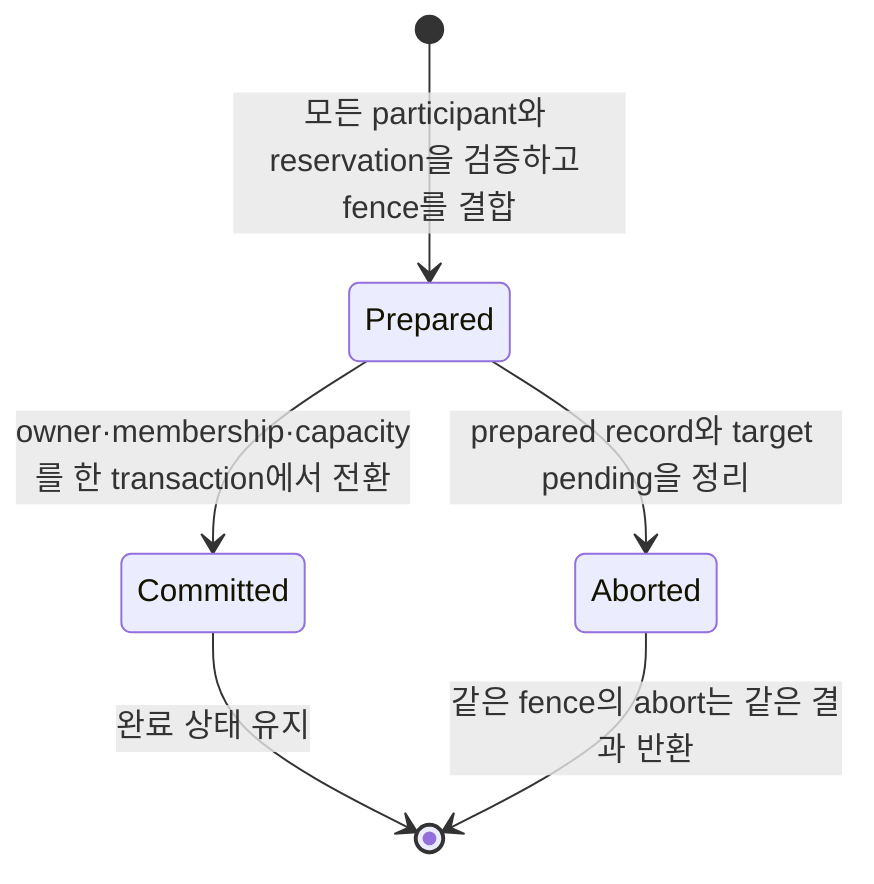

# .NET Authority와 Relocation Store 공개 인터페이스

[.NET exact interface 목차](README.ko.md) · [Location record](08-location-maintenance.ko.md) ·
[공통 Location runtime](../../../../40-location-runtime.ko.md)

## 1. 범위

Location Store가 Actor, User Spot과 Instance Spot의 current owner와 lifecycle state를
확정해 보관하는 정보를 authority라 한다. 이 문서는 [owner](../../../../01-glossary.ko.md#owner)·relocation authority를 원자적으로 바꾸는 provider capability와 immutable
relocation bytes를 보관하는 provider capability를 고정한다. 두 interface는 provider 구현자를 위한 extension
surface다. Application service code는 이 interface를 호출하거나 key, store version, payload, relocation
reference와 retention을 조립하지 않는다.

## 2. Authority Store

[Authority](../../../../01-glossary.ko.md#authority) Store는 current owner와
lifecycle state를 읽고 exact expectation으로 변경한다.

```csharp
public readonly record struct ZLinkAuthorityKey(string Value);

public enum ZLinkPlacementAllocationState
{
    Reserved = 1,
    Active = 2
}

public sealed record ZLinkSpotTypeCapacityDelta(
    ZLinkPlacementObjectKind ObjectKind,
    string StableType,
    int Count);

public sealed record ZLinkCapacityVector(
    int Actors,
    int Spots,
    ZLinkSpotTypeCapacityDelta? SpotType);

public sealed record ZLinkPlacementAllocation(
    ZLinkPlacementAllocationState State,
    ZLinkPlacementObjectKind ObjectKind,
    string StableType,
    ZLinkMeshNodeDescriptorKey Descriptor,
    ulong DescriptorLifecycleGeneration,
    ZLinkCapacityVector Capacity);

public sealed record ZLinkReservedObjectCreation(
    string ReservationId,
    string RequestContentReference,
    ReadOnlyMemory<byte> RequestSha256,
    int RequestEncodedSize);

public sealed record ZLinkAuthoritySnapshot(
    string StoreVersion,
    ReadOnlyMemory<byte> Payload,
    ulong ObjectGeneration,
    ulong AuthorityOwnerGeneration,
    string OwnerId,
    long OwnerLeaseGeneration,
    ZLinkPlacementAllocation Allocation,
    ZLinkReservedObjectCreation? ReservedCreation,
    DateTimeOffset StoreNow);

public abstract record ZLinkAuthorityReadResult
{
    private protected ZLinkAuthorityReadResult() { }
    public sealed record Missing(
        DateTimeOffset StoreNow) : ZLinkAuthorityReadResult;
    public sealed record Found(
        ZLinkAuthoritySnapshot Snapshot) : ZLinkAuthorityReadResult;
}

public sealed record ZLinkAuthorityEntry(
    ZLinkAuthorityKey Key,
    ZLinkAuthoritySnapshot Snapshot);

public readonly record struct ZLinkAuthorityScanCursor
{
    public ZLinkAuthorityScanCursor(string encoded);
    public string Encoded { get; }
}

public sealed record ZLinkAuthorityPage(
    IReadOnlyList<ZLinkAuthorityEntry> Items,
    ZLinkAuthorityScanCursor? NextCursor);

public abstract record ZLinkAuthorityScanResult
{
    private protected ZLinkAuthorityScanResult() { }
    public sealed record Page(
        ZLinkAuthorityPage Value) : ZLinkAuthorityScanResult;
    public sealed record ScanExpired : ZLinkAuthorityScanResult;
}

public readonly record struct ZLinkRelocationCapacityFence(string Value);

public abstract record ZLinkAuthorityMutation
{
    private protected ZLinkAuthorityMutation() { }
    public sealed record Put(
        ReadOnlyMemory<byte> Payload,
        ZLinkAuthorityGenerationTransition GenerationTransition,
        ZLinkLocationOwnerToken? TargetOwner,
        ZLinkRelocationCapacityFence? RelocationCapacityFence)
        : ZLinkAuthorityMutation;
    public sealed record Delete : ZLinkAuthorityMutation;
}

public enum ZLinkAuthorityGenerationTransition
{
    Preserve = 1,
    NewOwner = 2
}

public abstract record ZLinkAuthorityCompareExchangeResult
{
    private protected ZLinkAuthorityCompareExchangeResult() { }
    public sealed record Stored(
        ZLinkAuthoritySnapshot Snapshot) : ZLinkAuthorityCompareExchangeResult;
    public sealed record Deleted(
        string StoreVersion,
        DateTimeOffset StoreNow) : ZLinkAuthorityCompareExchangeResult;
    public sealed record Conflict(
        ZLinkAuthorityReadResult Current) : ZLinkAuthorityCompareExchangeResult;
    public sealed record GenerationExhausted : ZLinkAuthorityCompareExchangeResult;
}

public sealed record ZLinkObjectReservationRequest(
    ZLinkPlacementObjectKind ObjectKind,
    ZLinkAuthorityKey Key,
    string StableType,
    string CreationIntentReference,
    ReadOnlyMemory<byte> CreationIntentHash,
    int CreationIntentEncodedSize,
    ZLinkMeshNodeDescriptorKey TargetDescriptor,
    ulong TargetNodeLifecycleGeneration,
    ZLinkLocationOwnerToken TargetOwner,
    ReadOnlyMemory<byte> CreatingPayload,
    ZLinkCapacityVector Capacity);

public sealed record ZLinkObjectReservation(
    ZLinkAuthorityKey Key,
    string StoreVersion,
    ulong ObjectGeneration,
    ulong AuthorityOwnerGeneration,
    string ReservationVersion,
    ZLinkMeshNodeDescriptorKey TargetDescriptor,
    ulong TargetNodeLifecycleGeneration,
    ZLinkLocationOwnerToken TargetOwner);

public abstract record ZLinkObjectReserveResult
{
    private protected ZLinkObjectReserveResult() { }
    public sealed record Reserved(
        ZLinkObjectReservation Reservation) : ZLinkObjectReserveResult;
    public sealed record Conflict(
        ZLinkAuthorityReadResult Current) : ZLinkObjectReserveResult;
    public sealed record AlreadyExists(
        ZLinkAuthoritySnapshot Current) : ZLinkObjectReserveResult;
    public sealed record TypeMismatch(
        ZLinkAuthoritySnapshot Current) : ZLinkObjectReserveResult;
    public sealed record PlacementCapacityExhausted : ZLinkObjectReserveResult;
    public sealed record GenerationExhausted : ZLinkObjectReserveResult;
}

public abstract record ZLinkObjectCommitResult
{
    private protected ZLinkObjectCommitResult() { }
    public sealed record Committed(
        ZLinkAuthoritySnapshot Snapshot) : ZLinkObjectCommitResult;
    public sealed record AlreadyCommitted(
        ZLinkAuthoritySnapshot Snapshot) : ZLinkObjectCommitResult;
    public sealed record Stale : ZLinkObjectCommitResult;
    public sealed record GenerationExhausted : ZLinkObjectCommitResult;
}

public readonly record struct ZLinkCreationOperationId(
    RoutingId SourceNodeRid,
    ulong SourceNodeGeneration,
    ulong OperationIdHigh,
    ulong OperationIdLow);

public enum ZLinkCreationTerminalState
{
    Created = 1,
    Rejected = 2,
    Failed = 3
}

public sealed record ZLinkCreationTerminalPublication(
    ZLinkCreationOperationId Operation,
    ReadOnlyMemory<byte> TerminalEnvelope,
    ReadOnlyMemory<byte> TerminalEnvelopeSha256,
    DateTimeOffset ExpiresAt);

public sealed record ZLinkCreationTerminalRecord(
    ZLinkCreationOperationId Operation,
    string ReservationId,
    ZLinkPlacementObjectKind ObjectKind,
    ZLinkCreationTerminalState State,
    ReadOnlyMemory<byte> TerminalEnvelope,
    ReadOnlyMemory<byte> TerminalEnvelopeSha256,
    DateTimeOffset ExpiresAt,
    DateTimeOffset StoreNow);

public abstract record ZLinkCreationTerminalReadResult
{
    private protected ZLinkCreationTerminalReadResult() { }
    public sealed record Missing(DateTimeOffset StoreNow) : ZLinkCreationTerminalReadResult;
    public sealed record Found(ZLinkCreationTerminalRecord Record) : ZLinkCreationTerminalReadResult;
}

public abstract record ZLinkObjectCreationCompletion
{
    private protected ZLinkObjectCreationCompletion() { }
    public sealed record Created(
        ReadOnlyMemory<byte> ReadyPayload,
        ZLinkCreationTerminalPublication Terminal) : ZLinkObjectCreationCompletion;
    public sealed record Rejected(
        ZLinkCreationTerminalPublication Terminal) : ZLinkObjectCreationCompletion;
    public sealed record Failed(
        ZLinkCreationTerminalPublication Terminal) : ZLinkObjectCreationCompletion;
}

public abstract record ZLinkObjectCreationCompleteResult
{
    private protected ZLinkObjectCreationCompleteResult() { }
    public sealed record Created(
        ZLinkAuthoritySnapshot Snapshot,
        ZLinkCreationTerminalRecord Terminal) : ZLinkObjectCreationCompleteResult;
    public sealed record Rejected(
        ZLinkCreationTerminalRecord Terminal) : ZLinkObjectCreationCompleteResult;
    public sealed record Failed(
        ZLinkCreationTerminalRecord Terminal) : ZLinkObjectCreationCompleteResult;
    public sealed record AlreadyCompleted(
        ZLinkCreationTerminalRecord Terminal) : ZLinkObjectCreationCompleteResult;
    public sealed record Stale : ZLinkObjectCreationCompleteResult;
    public sealed record GenerationExhausted : ZLinkObjectCreationCompleteResult;
}

public abstract record ZLinkObjectAbortResult
{
    private protected ZLinkObjectAbortResult() { }
    public sealed record Aborted : ZLinkObjectAbortResult;
    public sealed record AlreadyAborted : ZLinkObjectAbortResult;
    public sealed record Stale : ZLinkObjectAbortResult;
    public sealed record GenerationExhausted : ZLinkObjectAbortResult;
}

public sealed record ZLinkRelocationCapacityReservationRequest(
    Guid ReservationId,
    ZLinkAuthorityKey Key,
    string ExpectedStoreVersion,
    ZLinkPlacementObjectKind ObjectKind,
    string StableType,
    ZLinkMeshNodeDescriptorKey SourceDescriptor,
    ulong SourceNodeLifecycleGeneration,
    ZLinkLocationOwnerToken SourceOwner,
    ZLinkMeshNodeDescriptorKey TargetDescriptor,
    ulong TargetNodeLifecycleGeneration,
    ZLinkLocationOwnerToken TargetOwner,
    ZLinkCapacityVector Capacity);

public abstract record ZLinkRelocationCapacityReserveResult
{
    private protected ZLinkRelocationCapacityReserveResult() { }
    public sealed record Reserved(
        ZLinkRelocationCapacityFence Fence) : ZLinkRelocationCapacityReserveResult;
    public sealed record AlreadyReserved(
        ZLinkRelocationCapacityFence Fence) : ZLinkRelocationCapacityReserveResult;
    public sealed record Conflict(
        ZLinkAuthorityReadResult Current) : ZLinkRelocationCapacityReserveResult;
    public sealed record TargetUnavailable : ZLinkRelocationCapacityReserveResult;
    public sealed record PlacementCapacityExhausted : ZLinkRelocationCapacityReserveResult;
}

public enum ZLinkRelocationCapacityAbortResult
{
    Aborted = 1,
    AlreadyAborted = 2,
    AlreadyCommitted = 3,
    Stale = 4
}

public sealed record ZLinkAggregateParticipant(
    ZLinkAuthorityKey Key,
    string ExpectedStoreVersion,
    ZLinkAuthorityGenerationTransition OwnerTransition,
    ReadOnlyMemory<byte> AuthorityPayload,
    ReadOnlyMemory<byte> MembershipMutation);

public sealed record ZLinkAggregatePrepareRequest(
    Guid AggregateId,
    ulong AggregateGeneration,
    IReadOnlyList<ZLinkAggregateParticipant> Participants,
    ReadOnlyMemory<byte> InventoryDigest,
    ZLinkMeshNodeDescriptorKey TargetDescriptor,
    ulong TargetDescriptorLifecycleGeneration,
    ZLinkCapacityVector Capacity,
    ZLinkLocationOwnerToken TargetOwner);

public readonly record struct ZLinkAggregateFence(
    Guid AggregateId,
    ulong AggregateGeneration);

public abstract record ZLinkAggregatePrepareResult
{
    private protected ZLinkAggregatePrepareResult() { }
    public sealed record Prepared(
        ZLinkAggregateFence Fence) : ZLinkAggregatePrepareResult;
    public sealed record AlreadyPrepared(
        ZLinkAggregateFence Fence) : ZLinkAggregatePrepareResult;
    public sealed record Conflict : ZLinkAggregatePrepareResult;
    public sealed record Stale : ZLinkAggregatePrepareResult;
    public sealed record GenerationExhausted : ZLinkAggregatePrepareResult;
}

public enum ZLinkAggregateCommitResult
{
    Committed = 1,
    AlreadyCommitted = 2,
    Stale = 3,
    GenerationExhausted = 4
}

public enum ZLinkAggregateAbortResult
{
    Aborted = 1,
    AlreadyAborted = 2,
    Stale = 3
}

public interface IZLinkAuthorityStore
{
    ValueTask<ZLinkAuthorityReadResult> ReadAuthorityAsync(
        ZLinkAuthorityKey key,
        CancellationToken cancellationToken = default);
    ValueTask<ZLinkAuthorityCompareExchangeResult> CompareExchangeAuthorityAsync(
        ZLinkAuthorityKey key,
        string expectedStoreVersion,
        ZLinkAuthorityMutation mutation,
        CancellationToken cancellationToken = default);
    ValueTask<ZLinkAuthorityScanResult> ListAuthoritiesAsync(
        string prefix,
        ZLinkAuthorityScanCursor? cursor,
        int limit,
        CancellationToken cancellationToken = default);
    ValueTask<ZLinkObjectReserveResult> ReserveAsync(
        ZLinkObjectReservationRequest request,
        CancellationToken cancellationToken = default);
    ValueTask<ZLinkObjectCommitResult> CommitAsync(
        ZLinkObjectReservation reservation,
        ReadOnlyMemory<byte> readyPayload,
        CancellationToken cancellationToken = default);
    ValueTask<ZLinkObjectCreationCompleteResult> CompleteCreationAsync(
        ZLinkObjectReservation reservation,
        ZLinkObjectCreationCompletion completion,
        CancellationToken cancellationToken = default);
    ValueTask<ZLinkCreationTerminalReadResult> ReadCreationTerminalAsync(
        ZLinkCreationOperationId operation,
        CancellationToken cancellationToken = default);
    ValueTask<ZLinkObjectAbortResult> AbortAsync(
        ZLinkObjectReservation reservation,
        CancellationToken cancellationToken = default);
    ValueTask<ZLinkRelocationCapacityReserveResult> ReserveRelocationCapacityAsync(
        ZLinkRelocationCapacityReservationRequest request,
        CancellationToken cancellationToken = default);
    ValueTask<ZLinkRelocationCapacityAbortResult> AbortRelocationCapacityAsync(
        ZLinkRelocationCapacityFence fence,
        CancellationToken cancellationToken = default);
    ValueTask<ZLinkAggregatePrepareResult> PrepareAggregateAsync(
        ZLinkAggregatePrepareRequest request,
        CancellationToken cancellationToken = default);
    ValueTask<ZLinkAggregateCommitResult> CommitAggregateAsync(
        ZLinkAggregateFence fence,
        CancellationToken cancellationToken = default);
    ValueTask<ZLinkAggregateAbortResult> AbortAggregateAsync(
        ZLinkAggregateFence fence,
        CancellationToken cancellationToken = default);
}
```

`StoreVersion`, generation과 `StoreNow`는 provider가 발급한다. Missing은 `StoreNow`만 반환하고 fake
StoreVersion을 갖지 않는다. `CompareExchangeAuthorityAsync`는 Active `Found`의 exact StoreVersion을 받는
overload만 제공한다. `Preserve`·`NewOwner`·delete는 current StoreVersion을 요구하며
`Missing`과 Pending row에는 적용할 수 없다. `Put.TargetOwner`는 `Preserve`에서 `null`이어야 하고
`NewOwner`에서 반드시 값을 가져야 한다. Provider는 exact target owner lease를 CAS와 같은 transaction에서
검증하고 성공한 snapshot의 owner metadata로 기록하며 opaque payload를 해석하지 않는다. 정상 create는 generic
reservation만 사용한다. `Preserve`와 delete는 stored current [owner lease](../../../../01-glossary.ko.md#owner-lease), `NewOwner`는 `TargetOwner` lease를
검증한다. Missing·stale lease는 current authority read를 가진 `Conflict`로 끝나고 mutation은 0이다.
Invalid `TargetOwner` 조합은 provider 호출 전에 `ArgumentException`으로 거부한다.
`RelocationCapacityFence`는 `NewOwner`에서 반드시 값을 갖고 `Preserve`에서 `null`이어야 한다.
`NewOwner` 성공은 fence의 source active 감소와 target pending-to-active, target Active allocation과 authority
owner metadata를 같은 transaction에서 적용한다.
`ListAuthoritiesAsync`의 first page는 `cursor=null`로 요청한다. Provider는 한
[snapshot](../../../../01-glossary.ko.md#snapshot)을 만들고 이어지는 page에 필요한 모든 상태를 하나의 `ZLinkAuthorityScanCursor`에 담는다. 다음
page는 직전 page의 `NextCursor` 값을 해석하거나 다시 조립하지 않고 그대로 넘긴다. Cursor의 UTF-8 encoded
크기는 `1..4096` bytes이며 empty cursor는 허용하지 않는다. Constructor는 범위를 검증하고 immutable
`string` 값을 보관한다. Provider는 snapshot에 포함된 key incarnation을 scan 전체에서 각각 한 번만
반환한다. Concurrent delete는 Framework의 exact read에서 Missing으로 제거되고 snapshot 뒤의
create·recreate는 다음 scan에서 반환된다. Framework는 각 candidate를
exact read한 뒤 current StoreVersion으로 CAS한다. Host recovery partition의 initial scan이 완료되기
전에는 Serving을 게시하지 않고, 이후 scan은 background recovery로 반복한다. Page는 opaque
key와 payload를 반환한다. Framework가 operational Actor projection을 decode하며 provider는 key와 payload를
해석하지 않는다.
Provider가 cursor가 가리키는 scan을 만료시켰으면 이어지는 page 요청은 `ScanExpired`를 반환한다.
Framework는 부분 결과를 사용하지 않고 first page부터 새 scan을 시작한다.
Provider domain은 영구적인 global object generation, authority owner generation과 Store revision counter를
각각 하나씩 유지한다. Initial `ObjectGeneration`과 `AuthorityOwnerGeneration`은 Reserve만 발급한다.
`NewOwner`는 owner generation만 증가시키며 `Preserve`는 둘 다 유지한다. Stored mutation과 delete는 global
Store revision으로 fence한다. Reserve는 Missing→Reserved, exact Commit은 Reserved→Active, exact Abort는
Reserved→Missing만 수행한다. `Preserve`·`NewOwner`·delete는 Active에만 적용한다. Delete는 current Active
allocation의 typed capacity vector를 감소시킨 뒤 row를 완전히 제거하며 per-key counter나 version tombstone을
유지하지 않는다. Scan lease가 활성화된 동안만 scan snapshot을 유지하기 위한 tombstone을 bounded로 유지할 수
있다. Payload에 generation이나 current allocation을 중복 encode하지 않는다. Authority row는 TTL을 갖지 않고
explicit fenced delete가 성공할 때까지 유지된다. Owner·coordinator lease는 별도 token row에 저장하며 lease
만료나 reclaim이 authority row를 삭제하거나 수정하지 않는다. Relocation phase와 recovery cursor는 opaque
payload에 둔다.

`IZLinkAuthorityStore`는 별도로 등록하지 않는다. Root에 등록하는 `IZLinkLocationStore`가 이 capability를
상속하며 같은 provider instance가 location owner와 relocation authority를 한 transaction domain에서 처리한다.
Provider는 [Instance Spot](../../../../01-glossary.ko.md#entry-spot-user-spot과-instance-spot)이나 Actor relocation phase별 interface를 추가로 구현하지 않는다.

한 authority opaque payload의 encoded 크기는 최대 1 MiB다. Scan `limit`은 `1..1000`이고 provider는
encoded page 4 MiB에 먼저 도달하면 요청보다 적은 entry와 `NextCursor`를 반환한다. 이 byte limit을
바꾸는 public option은 없다. Hot authority row는 compact metadata와 replay cursor만 보관하며 complete terminal
reply bytes는 relocation stream에 저장한다.

세 counter는 `1..long.MaxValue` 범위이며 wrap하거나 재사용하지 않는다. CAS 성공에 새 StoreVersion,
ObjectGeneration 또는 AuthorityOwnerGeneration이 필요한데 해당 global counter가 최댓값이면 provider는
non-retriable `GenerationExhausted`를 반환한다. 이 결과는 row, index와 모든 counter를 바꾸거나 값을 소비하지
않는다. 외부 상태가 바뀌지 않은 채 같은 expectation을 다시 제출하면 같은 결과를 반환한다. Transport 또는
provider exception은 이 닫힌 결과와 구분한다. Framework는 기존 lifecycle failure로 operation을 닫으며
application용 error enum을 추가하지 않는다.

Creation과 relocation operation의 조건과 변경 결과는 다음과 같다. 표는 아래의 exact field 검증 규칙을
요약하며, 표에 적지 않은 expectation을 생략하지 않는다.

| Operation | 실행 조건 | 성공하면 함께 변경하는 값 | 중복·불일치 결과 |
|---|---|---|---|
| `ReserveAsync` | Authority가 `Missing`이고 target descriptor, owner lease와 capacity 조건을 만족해야 한다. | `Creating` row, initial generation, creation intent와 target pending capacity를 한 transaction에 기록한다. | Current row가 바뀌면 `Conflict`, object가 이미 있으면 `AlreadyExists`, type이 다르면 `TypeMismatch`, capacity가 부족하면 `PlacementCapacityExhausted`다. Counter가 소진되면 `GenerationExhausted`이며 row, capacity와 counter를 변경하지 않는다. |
| `CommitAsync` | Exact creation reservation과 target [descriptor](../../../../01-glossary.ko.md#descriptor) lifecycle·owner lease가 계속 일치해야 한다. | Reserved allocation을 Active로 바꾸고 `readyPayload`를 게시하며 reserved count를 줄이고 active count를 늘린다. | 같은 fence는 `AlreadyCommitted`, 다른 fence나 stale target은 mutation 없이 `Stale`이다. 닫힌 결과에는 `GenerationExhausted`도 포함되며 이 경우 reservation과 counter를 변경하지 않는다. |
| `CompleteCreationAsync` | Actor reservation, exact operation identity, correlation-free semantic envelope·SHA와 expiry가 유효해야 한다. | Created는 Ready·capacity·terminal을 함께 publish하고 Rejected·Failed는 Creating 제거·capacity 반환·terminal을 함께 publish한다. | 같은 operation은 `AlreadyCompleted`, stale fence는 `Stale`이며 서로 다른 operation의 application reply를 공유하지 않는다. |
| `ReadCreationTerminalAsync` | Source Node RID·lifecycle generation·OperationId가 exact해야 한다. | Retained terminal 또는 StoreNow가 포함된 Missing을 반환한다. | 같은 source lifecycle·OperationId의 재전송만 사용하며 현재 correlation·reply route로 reply를 다시 encode한다. |
| `AbortAsync` | Exact `Creating` authority와 reservation fence가 일치해야 한다. Current target lifecycle이나 lease는 요구하지 않는다. | Creating authority와 해당 target의 reserved vector를 함께 제거한다. | 같은 fence는 `AlreadyAborted`, 다른 fence는 `Stale`이다. 닫힌 결과에는 `GenerationExhausted`도 포함되며 이 경우 authority, capacity와 counter를 변경하지 않는다. |
| `ReserveRelocationCapacityAsync` | Request source가 current authority owner와 durable Active allocation에 일치하고 target이 live하며 capacity가 있어야 한다. | Target pending capacity만 예약하고 reservation을 durable하게 유지한다. | 같은 ID와 같은 request는 `AlreadyReserved`, 내용이 다르면 `Conflict`, target이 유효하지 않으면 `TargetUnavailable`, capacity가 부족하면 `PlacementCapacityExhausted`다. |
| Standalone `NewOwner` CAS | Reserved fence와 authority version, source·target owner가 모두 일치해야 한다. | Authority owner 변경, source active 감소와 target pending-to-active 변경을 한 transaction에서 처리한다. | Fence나 expectation이 다르면 current authority read를 포함한 `Conflict`이며 mutation은 0이다. |
| Aggregate prepare | 모든 participant expectation과 target descriptor·owner·typed capacity vector가 정확히 일치해야 한다. | Capacity vector 전체를 예약하고 aggregate를 `Prepared`로 기록한다. | Exact duplicate는 `AlreadyPrepared`, participant나 vector가 다르면 `Conflict`, 다른 generation은 `Stale`이며 mutation은 0이다. 닫힌 결과에는 mutation이 0인 `GenerationExhausted`도 포함된다. |
| Aggregate commit | Prepared aggregate의 allocation과 target descriptor lifecycle·owner lease가 계속 일치해야 한다. | 모든 owner, `AuthorityOwnerGeneration`, membership visibility와 capacity를 한 transaction에서 전환한다. | 같은 fence는 `AlreadyCommitted`, 다른 generation이나 stale target은 mutation 없이 `Stale`이다. 닫힌 결과에는 fence를 bind 상태로 유지하는 `GenerationExhausted`도 포함된다. |
| Aggregate abort | 같은 aggregate generation이 아직 commit되지 않았어야 한다. | Prepared record와 bind된 fence의 target pending을 정리하고 fence를 aborted로 닫는다. | 같은 fence는 idempotent하며 다른 generation은 `Stale`이다. |

Aggregate lifecycle은 다음 순서로 진행한다.



Target 검증이 stale이거나 expectation 하나가 다르면 일부 participant만 변경하지 않는다. Commit 전 target
검증 실패는 fence를 `Prepared`에 bind한 상태로 유지하며, 다른 불일치는 아래에 정의한 결과와 mutation 0
규칙을 따른다.

Logical create는 generic `ReserveAsync`만 사용한다. Reserve는 Missing authority를 Reserved allocation을 가진
Creating row로 바꾸고 initial generation을 발급하며 Framework가 encode한 `CreatingPayload`, creation intent와
target typed reserved capacity를 한 transaction에서 기록한다. `CommitAsync`는 target descriptor lifecycle과 owner
lease를 다시 확인하고 Framework가 전달한 `readyPayload`를 exact reservation의 Reserved→Active allocation,
reserved count 감소와 active count 증가와 함께 게시한다. Stale이면 mutation 0으로 reservation을 유지한다.
Provider는 두 payload를 해석하거나 합성하지 않는다. `AbortAsync`는 current lifecycle·lease를 요구하지 않고
reservation에 고정한 exact Creating authority와 이전 target reserved vector를 함께 제거한다. Commit과 abort의
같은 fence 재호출은 각각
`AlreadyCommitted`와 `AlreadyAborted`이고, 다른 fence는 `Stale`이다. Counter 증가가 필요한 operation에서
최댓값에 도달하면 `GenerationExhausted`이며 mutation과 counter 소비는 0이다.

`CreationIntentReference`는 immutable opaque value이고 `CreationIntentHash`는 exact 32-byte SHA-256이다.
`CreationIntentEncodedSize`는 `0..1 MiB`이며 실제 encoded request bound와 일치해야 한다. Stable type은
UTF-8 1..255 bytes다. `Capacity`는 Actor 전체 delta, Spot 전체 delta와 optional User·Instance Spot
kind·stable type delta를 한 typed vector로 보존한다. Actor 생성은 `(1, 0, null)`, Spot 생성은
`(0, 1, exact Spot type 1)`이다. 각 count는 0 이상이고 vector 전체는 하나 이상의 slot을 요청해야 한다.
Provider는 관련 limit을 모두 검사하고 초과하면
`PlacementCapacityExhausted`를 반환한다. Reservation에는 TTL을 두지 않는다. Creating authority와 reservation에
고정한 target descriptor lifecycle·owner token이 recovery·takeover·abort의 fence이며 elapsed time만으로
제거하지 않는다.

`ReservedCreation`은 `Allocation.State == Reserved`인 snapshot에서 반드시 존재하고 Active snapshot에서는 반드시
`null`이다. Provider는 Reserved current row에 reservation ID와 Actor·User Spot·Instance Spot 생성 요청의
immutable content reference, exact 32-byte SHA-256과 `0..1 MiB` encoded size를 함께 저장한다. Target-owned
Instance Spot의 cold activation content만 complete `instance-activation-recovery-v1` envelope이며, Actor와 User
Spot의 manager create content에는 이 envelope를 사용하지 않는다. Framework는 snapshot의
StoreVersion, generation, owner와 allocation target을 이 projection과 결합해 provider-issued exact reservation을
복원한다. 별도 process-local index나 caller-generated reservation ID에 의존하지 않는다.

Existing object relocation은 creation reservation을 재사용하지 않는다.
`ReserveRelocationCapacityAsync`는 `Guid.Empty`가 아닌 reservation ID, current authority version,
kind·[stable type](../../../../01-glossary.ko.md#stable-type), source·target descriptor key·lifecycle generation과 exact owner token을 검증하고
`Capacity` typed vector 전체를 target reserved capacity로 예약한다. Request source owner와 kind·stable type·descriptor
key·[lifecycle generation](../../../../01-glossary.ko.md#lifecycle-generation)·capacity vector는 current authority owner와 durable Active allocation에 정확히
일치해야 한다. Source descriptor row와 source owner lease의 live 상태는 요구하지 않는다. Target descriptor
lifecycle·owner lease·capability·pending limit은 같은 transaction에서 live/exact로 검증한다.
같은 ID와 exact request는 `AlreadyReserved`, 다른 내용은 `Conflict`다. Standalone Actor의 `NewOwner` CAS와
aggregate commit만 fence를 소비하며 source active 감소와 target pending-to-active를 authority mutation과 같은
transaction에서 처리한다. Commit 전 `AbortRelocationCapacityAsync`는 pending을 해제하고 reservation은 TTL로
만료시키지 않는다.
Standalone `NewOwner` fence가 reserved 상태가 아니거나 authority key·expected StoreVersion·source·target
owner와 일치하지 않거나 이미 committed·aborted됐으면 current authority read를 담은 `Conflict`이며 authority
row, capacity와 fence state의 mutation은 0이다. CAS transaction은 request source와 durable current Active
allocation의 exact match를 다시 확인하고 target descriptor lifecycle과 target owner lease만 live/exact로
재검증한다. Source descriptor row·lease가 stale·missing이어도 allocation match가 유지되면 commit할 수 있다.

Aggregate ID는 `Guid.Empty`가 아닌 128-bit 값이고 `AggregateGeneration`은 `1..long.MaxValue`다. Participant는
최대 1024개이며 prepare request와 durable aggregate record의 encoded 크기는 각각 최대 1 MiB다. Provider는
participant payload와 [membership](../../../../01-glossary.ko.md#membership) mutation을 해석하지 않는다. `Participants`가 bounded canonical participant
set의 authority이며 `InventoryDigest`는 이 exact set과 participant별 mutation을 canonical encoding한 32-byte
SHA-256이다. Relocation root manifest의 participant inventory는 payload를 찾기 위한 projection일 뿐 authority가
아니며, runtime은 두 digest가 일치할 때만 restore와 replay를 시작한다. User Spot aggregate는 participant별
relocation capacity fence를 만들지 않는다. `Capacity`는 Actor slot `N`, Spot slot `1`, User Spot stable
type slot `1`을 하나의 typed vector로 표현해야 한다. Prepare는 모든 participant expectation과 durable
Active allocation을 exact-match하고 `TargetDescriptor`, lifecycle generation과 `TargetOwner`를 live/exact로
검증한 뒤 vector 전체를 같은 transaction에서 reserved capacity로 예약한다. Participant set 또는 vector가
맞지 않으면 `Conflict`이며 mutation은 0이다. Exact duplicate prepare만 `AlreadyPrepared`다. Commit은 aggregate
record가 소유한 bundle만 소비해 모든 owner,
[AuthorityOwnerGeneration](../../../../01-glossary.ko.md#authorityownergeneration)과 membership visibility를 한 transaction에서 전환한다. Commit 직전에 source·target
allocation exact match와 target descriptor lifecycle·owner lease를 다시 확인한다. Target이 stale이면 mutation
없이 fence를 bind 상태로 유지하며 source descriptor row·lease가 stale·missing이어도 allocation match가
유지되면 commit할 수 있다. Abort는 commit 전 prepared
record가 소유한 target reserved vector를 정리하고 aggregate를 aborted로 닫는다. 같은 fence는 idempotent하고 다른 generation은 `Stale`이며, expectation 하나가
다르면 어떤 participant, reservation, index나 counter도 변경하지 않는다.

Provider metadata의 `ulong` generation은 conceptual non-zero unsigned 63-bit 값만 허용한다. JSON으로 투영할 때
generation은 선행 0 없는 decimal string이고 enum은 위 선언의 숫자를 저장한다. Aggregate ID는 provider boundary에서
opaque 16 bytes로 보존하며 application JSON 계약으로 노출하지 않는다.

## 3. Relocation Store

```csharp
public sealed record ZLinkRelocationStored(
    string Reference,
    uint ChecksumCrc32c,
    DateTimeOffset ExpiresAt,
    DateTimeOffset StoreNow);

public abstract record ZLinkRelocationReadResult
{
    private protected ZLinkRelocationReadResult() { }
    public sealed record Found(
        ReadOnlyMemory<byte> Payload) : ZLinkRelocationReadResult;
    public sealed record Missing : ZLinkRelocationReadResult;
}

public enum ZLinkRelocationDeleteResult
{
    Deleted = 0,
    Missing = 1
}

public abstract record ZLinkRelocationRenewResult
{
    private protected ZLinkRelocationRenewResult() { }
    public sealed record Renewed(
        DateTimeOffset ExpiresAt,
        DateTimeOffset StoreNow) : ZLinkRelocationRenewResult;
    public sealed record Missing : ZLinkRelocationRenewResult;
}

public interface IZLinkRelocationStore
{
    ValueTask<ZLinkRelocationStored> PutRelocationAsync(
        ReadOnlyMemory<byte> payload,
        TimeSpan retention,
        CancellationToken cancellationToken = default);
    ValueTask<ZLinkRelocationReadResult> GetRelocationAsync(
        string reference,
        CancellationToken cancellationToken = default);
    ValueTask<ZLinkRelocationRenewResult> RenewRelocationAsync(
        string reference,
        TimeSpan retention,
        CancellationToken cancellationToken = default);
    ValueTask<ZLinkRelocationDeleteResult> DeleteRelocationAsync(
        string reference,
        CancellationToken cancellationToken = default);
}
```

Framework는 put과 renew의 `retention`에 정확히 `TimeSpan.FromHours(24)`를 넘긴다. 이 값은 application
option이 아니다. Authority의 current relocation reference를 확인한 owner 또는 recovery coordinator만
`RenewRelocationAsync`를 호출하며, 존재하지 않는 reference는 `Missing` 정상 결과다.
Provider는 자신의 store clock에서 `ExpiresAt`을 계산하고 `Renewed`에 새 expiry와 `StoreNow`를 반환한다.
Runtime은 이 두 값을 다음 renewal 판단에 사용하며 local clock으로 provider expiry를 추측하지 않는다.
Provider는 reference와 payload를 opaque value로 취급한다. `ChecksumCrc32c`는 저장된 immutable root bytes의
CRC32C(Castagnoli)를 나타내는 unsigned 32-bit 값이다. Runtime은 이 값과 Location authority에 publish할
checksum이 정확히 같은지 검증한다.
`GetRelocationAsync`의 `Missing`은 닫힌 결과이고 `DeleteRelocationAsync`의 `Missing`은 idempotent cleanup
성공이다. Runtime은 completed·aborted transaction의 relocation을 즉시 삭제하며 실패나 orphan은 24시간 TTL이
정리한다.

모든 cross-node Actor·[Spot](../../../../01-glossary.ko.md#spot) 이동은 Relocation Store를 사용한다. `Recreate`도 accepted journal과 recovery payload를
저장하며 `Snapshot`은 application state를 추가로 저장한다. Same-node Actor join은 Relocation Store를 사용하지 않고,
`Disabled` cross-node 이동은 capture 전에 거부한다. Location authority가 publish한 reference가 permanent
`Missing`이거나 checksum 또는 inventory digest가 다르면 non-retriable `RelocationDataLost`로 seal하고 이전 owner로
rollback하지 않는다.

Framework는 logical relocation을 immutable 64 MiB chunk 최대 4096개와 root manifest로 내부에서 나누므로
logical state ceiling은 256 GiB다. `IZLinkRelocationStore`의 opaque put/get interface는 바꾸지 않으며 chunk
크기, 개수와 manifest를 설정하는 public option도 제공하지 않는다. Capture가 ceiling을 넘으면 seal을 되돌려
normal messaging을 다시 허용하고 Retire 결과를 `Blocked`로 종료한다. 일반 message의 negotiated effective
bound는 relocation chunk 크기 때문에 줄이지 않는다.

`Recreate` 또는 `Snapshot` factory가 하나라도 있거나 Instance Spot [factory](../../../../01-glossary.ko.md#factory)가 하나라도 있는 host는
`IZLinkRelocationStore`를 정확히 하나 등록해야 한다. Instance Spot factory가 없고 `Disabled` factory와
same-node join만 사용하는 host에는 Relocation Store가 필요하지 않다.
`Snapshot` adapter는 application payload만 capture·restore한다. Capture는 `byte[]`를 반환하고 restore는
`ReadOnlyMemory<byte>`를 받는다. Adapter는 relocation reference, retention, accepted journal과 Location authority
metadata를 받지 않는다.

Framework가 provider에 넘긴 `ReadOnlyMemory<byte>`의 underlying storage는 asynchronous operation이 끝날 때까지
유효하며 바뀌지 않는다. Provider가 완료 뒤에도 buffer를 보관하려면 먼저 복사해야 한다. Provider가 성공
result로 반환한 payload memory는 result가 사용되는 동안 안정적이어야 하며 provider는 반환 뒤 underlying
storage를 수정하거나 다른 result에 재사용하지 않는다. Mutable buffer 기반 adapter는 provider boundary에서
snapshot을 만든다.

Cancellation이 provider 호출 전에 이미 요청되었으면 Framework는 provider operation을 시작하지 않으므로 I/O와
commit이 없다. Provider operation을 시작한 뒤 waiter가 취소되거나 오류로 끝나면 commit 여부는 알 수 없다.
Authority CAS는 같은 exact key와 expectation의 StoreVersion을 다시 읽어 결과를 reconcile한 뒤 retry한다.
Relocation put은 content-addressed reference를 확인한 뒤 idempotent하게 retry한다. Immutable root를 먼저 저장하고
reference·checksum·retention을 검증한 뒤 Location authority CAS 한 번이 visibility를 publish한다. CAS 전에 실패하거나
CAS conflict가 발생한 committed put은 orphan이며 고정 retention과 cleanup으로 제거한다. Root 교체는 새 root 저장,
Location reference CAS, old root cleanup 순서이고 삭제는 Location reference release CAS 뒤 Relocation delete 순서다.
두 Store 사이의 transaction이나 2PC는 요구하지 않는다. 이 의미를 표현하는 public result는 추가하지 않는다.
