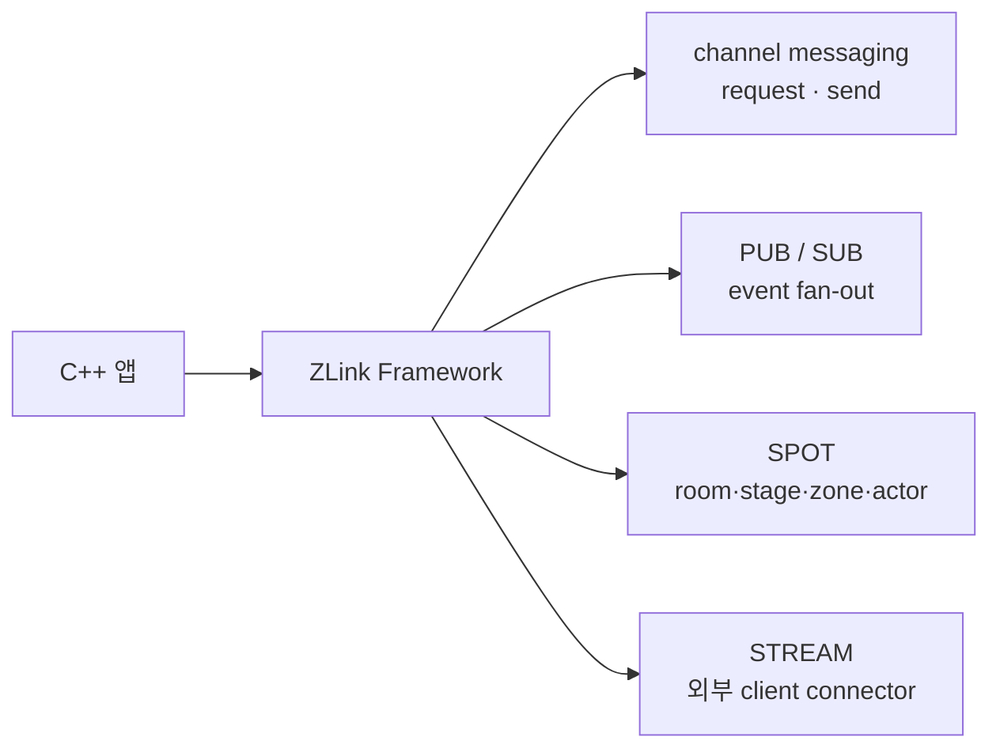
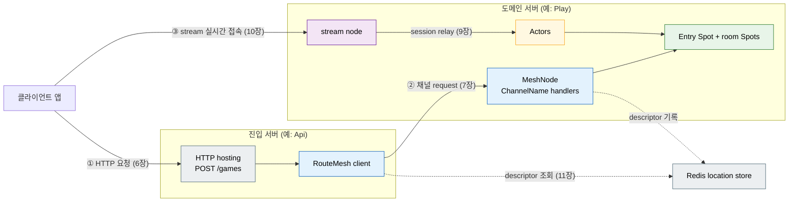

[← 목차](README.ko.md)

# 1. 개요

> 이 문서는 C++ framework 가이드의 진입점이다. C++ 애플리케이션 개발자가
> `zlink::framework`를 **읽고 바로 따라 쓸 수 있도록** 개념과 사용법을 설명한다.
> 언어 중립 정식 정의는 [공통 스펙 목차](../../common/README.ko.md)가,
> C++ 표면의 자세한 계약은 [spec/](../../common/spec/server/languages/cpp/interfaces/README.ko.md) 문서가
> 다룬다. 두 표기가 어긋나면 spec이 우선이다.

## 1. 이 프레임워크가 하는 일

`ZLink Framework for C++`는 별도 L7 gateway나 전용 로드밸런서 없이 논리 채널 이름
기준의 서버 간 호출, pub/sub, SPOT, STREAM을 C++ application의 DI, handler,
hosted service 모델 안에서 제공한다.

핵심은 raw socket과 low-level discovery를 직접 다루지 않는다는 것이다. 개발자는
handler, client, filter를 작성하고, 연결·발견·라우팅·재연결·correlation은 framework가
처리한다.

> **ZLink는 다국어 framework다.** 호출 계약이 공통 payload schema, codec과 논리
> channel/packet으로 닫혀 있어서 서로 다른 언어로 구현된 서비스가 같은 channel
> 위에서 상호 호출한다. 예를 들어 room 서버는 C++로, API 서버는 .NET이나 Java로
> 구현할 수 있다.

**실시간 메시징이 중요한 서버 시스템**을 여러 프로세스로 나눠 만드는 프레임워크다.
서버 간 실시간 통신, 상태 변화의 즉각적인 클라이언트 전달, 동시 접속 관리가 핵심인
시스템에 맞게 설계됐다.

| 도메인 | 핵심 시나리오 |
|--------|--------------|
| 실시간 게임 | 룸 생성 → 플레이어 입장 → 게임 상태 갱신 → 클라이언트 push |
| 고객 지원 채팅 | 대화 개설 → 상담원 배정 → 메시지 중계 → 대화 상태 push |
| 주문 워크플로 | 주문 접수 → 단계별 처리 → 상태 변경 → 클라이언트 알림 |
| 배송·배차 | 배차 요청 → 수행자 배정·수락 → 상태 추적 → 실시간 push |

공통된 구조가 있다 — 역할별 서버 프로세스들이 typed 메시지로 통신하고, 클라이언트는
실시간 연결로 상태 변화를 받는다.

서버 하나를 만들 때 직접 작성해야 했던 것들을 프레임워크가 처리한다.

| 직접 만들어야 했던 것 | 프레임워크가 처리하는 방식 |
|-----------------------|---------------------------|
| socket 생성·바인딩·연결 관리 | 채널/stream 이름으로 선언하면 런타임이 연결 |
| 메시지 직렬화·역직렬화 | codec 등록 한 번으로 struct를 그대로 주고받음 |
| 요청 라우팅·dispatch | 핸들러 클래스 등록하면 메시지가 자동으로 찾아옴 |
| 로깅·검증·권한 확인 같은 공통 처리 반복 | HTTP route는 middleware, ZLink handler는 handler filter로 분리 |
| 동시 요청의 상태 보호 | SPOT의 직렬 실행으로 락 없이 상태 관리 |
| 서비스 생성·의존성 관리 | DI 컨테이너 — `dependency_types` 선언만으로 생성자 주입 |
| 외부 HTTP API 서버 별도 운영 | HTTP hosting 내장 — 같은 프로세스에 endpoint 선언 |
| 서버 주소 관리·연결 해석 | Redis location store descriptor로 peer set 갱신 |
| 설정·로그·모니터링 | 내장 config·logging·health·metrics |

### 어떤 문제를 푸는가

C++ 서버가 서로 통신할 때 흔히 드는 비용은 다음과 같다.

- 서비스마다 주소·포트를 알아야 하고, 앞단에 gateway나 로드밸런서를 둔다.
- 메시징 라이브러리를 직접 쓰면 socket·endpoint·재연결·discovery를 앱이 관리한다.
- 요청/응답, 단방향 전송, 이벤트 fan-out마다 다른 코드 경로가 생긴다.
- 로깅·검증·권한 확인 같은 공통 처리가 HTTP middleware와 handler 코드 사이에 흩어진다.
- 게임 room, stage 같은 동적 단위를 다루려면 라우팅과 session 관리를 또 따로 짠다.

ZLink Framework는 서버 간 호출을 MeshName과 ChannelName으로 식별한다. Application은
논리 이름으로 요청하고 location store 또는 manual peer 구성이 실제 MeshNode 목록을
관리한다.

### 기존 방식 대비

서버 간 요청/응답을 직접 구성하면 peer 관리, 재연결, correlation, 직렬화와 수신
dispatch를 application이 소유해야 한다. Framework를 쓰면 MeshNode와 handler 등록으로
이 책임을 모을 수 있다.

```cpp
class get_price_handler_t
{
  public:
    using request_type = price_request_t;
    using reply_type = price_reply_t;
    static constexpr const char *topic_name = "get-price";

    reply_type handle (const request_type &request)
    {
        return price_reply_t{request.symbol, 187.42};
    }
};

app.add_zlink_framework ([&] (zlink::framework::zlink_framework_options_t &options) {
    auto mesh = options.add_route_mesh ("services")
      .listen ("tcp://0.0.0.0:7301")
      .set_routing_id (zlink::routing_id_t::from ("price-1"));
    mesh.channel_name ("price").use_handler_group ("price");

    options.handlers ()
      .group ("price")
      .add<get_price_handler_t> ();
});
```

### 아키텍처

| 사용자 관점 계층 | 공개 역할 |
|------------------|----------|
| C++ application | DI 서비스, hosted service와 handler를 작성한다 |
| ZLink Framework | RouteMesh·ChannelName 메시징, SPOT·Actor, STREAM session과 운영 설정을 제공한다 |

Application은 공개 Framework 표면만 사용한다. 연결과 메시지 처리의 내부 구조는
[C++ runtime architecture](../internals/runtime-architecture.ko.md)가 설명한다.

## 2. 개념 요약

이 프레임워크의 기능 단위들이다. 각각 전용 장에서 상세히 다룬다.

### DI 컨테이너 — 서비스 의존성을 한 곳에서 관리

ASP.NET Core 스타일의 DI 컨테이너가 내장돼 있다. `service_collection_t`에
서비스를 등록하면 핸들러 생성자에 **자동으로 주입**된다.

```cpp
// 등록 — topology는 singleton, 핸들러는 dependency_types로 자동 transient 등록
options.services ()
    .add_singleton<sample_topology_t> (std::make_unique<sample_topology_t> (config))
    .add_singleton<season_store_t> ();
```

```cpp
// 핸들러가 필요한 것을 선언하면 컨테이너가 생성자에 주입
class open_conversation_handler_t {
    using dependency_types =
        dependency_list_t<sample_topology_t, request_client_t, logger_t<open_conversation_handler_t>>;
    open_conversation_handler_t (sample_topology_t &t, request_client_t &c,
                                 logger_t<open_conversation_handler_t> &l);
};
```

수명은 singleton / scoped / transient 세 가지다. `request_client_t`, `logger_t<T>` 같은
프레임워크 서비스도 같은 방식으로 받는다.

[4장 →](04-di-container.ko.md)

### Configuration — 설정 소스 통합

CLI 인자, 환경 변수, JSON 파일을 우선순위 순서로 합성한다. `bind<T>()` 한 번으로
설정 섹션을 struct에 매핑한다.

```cpp
struct server_config_t {
    std::string host;
    uint16_t    port;
    static server_config_t bind (const configuration_section_t &s) {
        return {s.require ("host"),
                static_cast<uint16_t> (std::stoul (s.require ("port")))};
    }
};
// app.config().bind_required<server_config_t>("server") 로 바인딩
```

[5장 →](05-configuration.ko.md)

### HTTP Hosting — 프로세스 안에 REST API 내장

별도 웹 서버 없이 같은 프로세스 안에 HTTP endpoint를 올린다. 경로 파라미터,
TLS, readiness/liveness endpoint를 fluent builder로 선언한다.

```cpp
options.http ()
    .listen ("https://0.0.0.0:8443")
    .configure_tls ([] (auto &tls) { tls.certificate_file (cert_path).private_key_file (key_path); })
    .map_post<open_conversation_http_handler_t> ("/conversations")
    .map_get<get_conversation_http_handler_t> ("/conversations/{id}")
    .map_readiness ("/ready");
```

HTTP 핸들러는 채널 핸들러와 동일한 `request_type`/`reply_type`/`handle()` 계약을
쓴다. 핸들러 안에서 `request_client_t`로 도메인 서버에 요청을 위임하는 것이
일반적인 패턴이다. DI를 통해 topology, logger 등을 생성자에서 받는다.

[6장 →](06-http-hosting.ko.md)

### 채널 (Channel) — 서버 간 메시징, 기본 빌딩 블록

채널은 서버 사이의 통신 경로에 이름을 붙인 것이다. 보내는 쪽이 이름으로
채널을 찾아 typed 요청을 보내고, 받는 쪽의 핸들러가 처리해 응답한다.
직렬화·연결·요청 correlation은 런타임이 처리한다.

**채널 핸들러 서버는 SPOT·actor 없이도 완전한 서비스다.** 요청을 받고, DB나
외부 API를 호출하고, 응답하는 일반 마이크로서비스를 채널 핸들러만으로 구현한다.
SPOT·actor는 실시간 상태가 필요할 때 선택적으로 추가하는 기능이다.

```cpp
// "inventory.service" ChannelName과 핸들러 두 개 — SPOT/Actor 등록은 필요 없다.
auto mesh = options.add_route_mesh ("inventory")
  .listen ("tcp://0.0.0.0:5580")
  .set_routing_id (zlink::routing_id_t::from ("inventory-1"));
mesh.channel_name ("inventory.service").use_handler_group ("inventory");
// check_stock_handler_t, reserve_item_handler_t 가 DB를 조회하고 응답
```

메시징 표면은 세 가지다.

- **ChannelName select-one** — 같은 membership의 ready positive-weight MeshNode 하나로
  request 또는 send.
- **Node direct** — 특정 MeshNode RID로 request 또는 send.
- **classic fanout** — publisher가 보내면 subscriber에게 전달.
  상태 변화를 여러 서버에 알리는 데 쓴다.

채널 핸들러의 공통 처리는 handler filter로 묶는다. HTTP middleware는 HTTP route에만
적용되므로, ZLink handler 앞뒤의 로깅·검증·권한 확인·메트릭 기록은 filter로 분리한다.

[7장 →](07-channel-messaging.ko.md)

### Runtime 경계

Application은 MeshName, ChannelName, RID와 typed payload만 다룬다. 연결 생성, peer
admission, correlation과 frame 처리는 framework 내부 책임이며 guide의 사용법에 transport
배선을 노출하지 않는다. 내부 구조가 필요하면
[C++ runtime architecture](../internals/runtime-architecture.ko.md)를 본다.

### 통합 축 한눈에



| 축 | 사용자에게 보이는 것 | 가이드 챕터 |
|----|----------------------|-------------|
| channel messaging | handler type, `request_client_t`, handler filter | [7장](07-channel-messaging.ko.md) |
| classic fanout | `publisher_t`, fanout channel, topic handler | [7장](07-channel-messaging.ko.md) |
| SPOT | `spot_t`, `entry_spot_t`, timer, route context | [8장](08-spot.ko.md) |
| actor / session | MeshNode-owned actor factory와 session relay | [9장](09-actor-session.ko.md) |
| STREAM | stream node, packet stream session, connector | [10장](10-stream.ko.md) |
| 인프라 | location topology, runtime monitoring | [11장](11-registry.ko.md), [12장](12-monitoring.ko.md) |

### SPOT — 상태 단위를 락 없이 관리

SPOT은 게임 룸, 지원 대화, 주문 처리 단위처럼 **"하나의 상태 영역"** 과 그
참여자를 묶는 실행 단위다. SPOT 인스턴스 하나가 상태 단위(룸·대화·주문) 하나다.

핵심은 **직렬 실행**이다. 같은 SPOT에 들어오는 모든 것 — 채널 패킷,
타이머 tick, 입퇴장 — 은 큐를 통해 한 번에 하나씩 처리된다. 이 덕분에
SPOT이 소유한 상태에 std::mutex 없이 접근할 수 있다.

**SPOT은 actor·session 없이 독립적으로 사용할 수 있다.** 클라이언트 실시간
연결이 없는 서버 사이드 상태 머신에도 쓴다. 채널 핸들러가 SPOT을 생성하고
요청을 전달하는 것이 전형적인 패턴이다.

```
예 (ShoppingMall 샘플):
  CommerceApi 서버 ──채널 요청──→ OrderWorkflow 서버
                                        │
                                 route handler가
                                 OrderWorkflowSpot 생성/조회
                                        │
                                 SPOT이 주문 단계를 직렬 처리
                                 (재고 예약 → 결제 → 확정)
                                        │
                                 actor/session 없음 — 서버 간 채널만 사용
```

- **entry spot**: 배정·할당 담당(매칭, 상담원 배정, 주문 접수), 노드당 1개
- **room spot**: 상태 단위 하나를 직접 소유하고 처리, 단위마다 1개

actor·session을 함께 쓰면 클라이언트 실시간 연결을 SPOT에 참여시킬 수 있다 —
이 경우에도 SPOT 자체는 그대로고, actor가 외부 연결의 대리인 역할을 한다.

[8장 →](08-spot.ko.md)

### Actor · Session — 클라이언트 session

Actor는 연결 하나(사용자 하나)를 대표하는 서버 쪽 객체다. 클라이언트가
stream으로 접속하면 session이 actor를 생성하고, actor는 SPOT에 입장해 상태
처리에 참여한다. 클라이언트 연결이 끊어지면 Framework가 current binding 전체를 먼저 snapshot하고
각 binding에 disconnect를 all-settled 방식으로 통지한 뒤 binding tombstone과 local cleanup을 수행한다. 이 통지는
actor destroy나 SPOT leave가 아니므로 actor와 membership은 유지된다. Application은
연결이 유지되는 동안 특정 actor에 논리적 disconnect를 알릴 때만 명시적 통지 API를 사용한다.

서버 간에도 actor를 relay할 수 있다 — Session 서버가 인증·연결을 전담하고,
도메인 서버의 SPOT이 상태를 담당하는 분리 구조에 쓴다.

[9장 →](09-actor-session.ko.md)

### Stream — 클라이언트 실시간 연결

게임 클라이언트, 채팅 앱, 배송원 앱처럼 외부에서 접속하는 양방향 연결이다.
stream node가 접속을 받고, 연결마다 session 인스턴스를 생성한다. session이
`on_packet`으로 클라이언트 패킷을 받아 actor를 통해 SPOT으로 전달한다.

클라이언트 쪽 접속은 별도 산출물인 stream connector가 담당한다.

[10장 →](10-stream.ko.md)

### Location store — 주소 자동 연결

서버가 여러 인스턴스로 확장될 때 어느 주소로 연결할지를 코드에 하드코딩하지
않는다. MeshNode가 Redis location store에 descriptor를 기록하고, 같은 MeshName의
node가 revision을 읽어 peer set을 갱신한다. 고정 topology는
`peer_connections().connect(...)`로 직접 등록할 수 있다.

[11장 →](11-registry.ko.md)

## 3. 전체 topology

각 기능이 어떻게 맞물리는지 보여주는 예시다(TicTacToe 샘플 기준). 이 지도를
각 기능 장이 확대해 들어간다.



- **진입 서버** — HTTP로 외부 요청을 받아 도메인 서버에 위임. 게임이면 Api 서버,
  채팅이면 ApiServer, 쇼핑이면 CommerceApi 등 도메인에 따라 이름이 달라진다.
- **도메인 서버** — MeshNode + SPOT(상태 단위) + Actor + stream node.
  게임 룸, 지원 대화, 주문 단위를 SPOT이 담당한다.
- **Redis location store** — MeshNode descriptor와 revision을 관리한다.
- **클라이언트 앱** — HTTP로 요청 생성, stream으로 실시간 상태 수신.

## 4. 산출물

| 항목 | 값 |
|------|-----|
| CMake target | `zlink::framework` |
| facade header | `#include <zlink/framework.hpp>` |
| public 계약 | `zlink/framework/contracts/*` (Boost 등 구현 의존성 비노출) |
| 네임스페이스 | `zlink::framework` |

HTTP **요청을 보내는** 쪽은 별도 산출물 `zlink::http_client`다 —
[http-client 가이드](../../../http-client/cpp/README.ko.md).

## 5. 이름 표기 규칙

가이드 전체에서 다음 표기를 일관되게 쓴다.

- C++ framework public 타입과 함수는 `zlink::framework` 네임스페이스에 둔다.
- C++ framework facade header는 `#include <zlink/framework.hpp>`다.
- CMake target은 `zlink::framework`다.
- client 측 HTTP 요청은 framework가 아니라 별도 `zlink::http_client` 산출물이 맡는다.

## 6. 현재 상태

이 가이드가 설명하는 표면은 [spec/](../../common/spec/server/languages/cpp/interfaces/README.ko.md)의 계약을
따른다. 구현 세부나 public header와 문서 표현이 어긋나면 spec과 header를 우선한다.
새 API 설계가 아직 구현 전 단계라면 정식 guide가 아니라 draft spec에서 먼저 다룬다.

## 7. 누구를 위한 것인가 / 비목표

- **대상:** 서버 간 메시징이 필요한 C++ 백엔드, 실시간 game/stage 서버,
  외부 client(STREAM)를 받는 gateway 서버, 클러스터 topology를 운영에서
  확인해야 하는 팀.
- **비목표:** 새 transport 의미를 만드는 것이 아니다. 기존 C++ 바인딩 위에서
  RouteMesh, Spot, Actor와 STREAM의 application 계약을 제공한다.

Framework는 handler를 자동으로 모든 channel에 열지 않는다. handler 등록은 handler를
**찾는** 단계이고, 실제 노출은 channel이 어떤 handler group을 쓰는지에 따라 정해진다.
자세한 규칙은 [7장](07-channel-messaging.ko.md)에서 다룬다.

## 8. 이 가이드 읽는 순서

1. [2장](02-getting-started.ko.md) — 첫 앱 구성과 실행
2. [3장](03-concepts.ko.md) — 핵심 개념
3. [4장](04-di-container.ko.md) — DI 컨테이너
4. [5장](05-configuration.ko.md) — 설정 바인딩
5. [6장](06-http-hosting.ko.md) — HTTP hosting
6. [7장](07-channel-messaging.ko.md) — request/send/pub-sub와 filter
7. [8장](08-spot.ko.md) — SPOT과 timer
8. [9장](09-actor-session.ko.md) — actor/session relay
9. [10장](10-stream.ko.md) — 외부 client STREAM
10. [11장](11-registry.ko.md) — location store와 topology 조회
11. [12장](12-monitoring.ko.md) — runtime 이벤트와 metrics
12. [13장](13-interface-catalog.ko.md) — 주요 public 표면
13. [14장](14-samples-map.ko.md) — 샘플별 실행 흐름

[다음: 시작하기 →](02-getting-started.ko.md)
