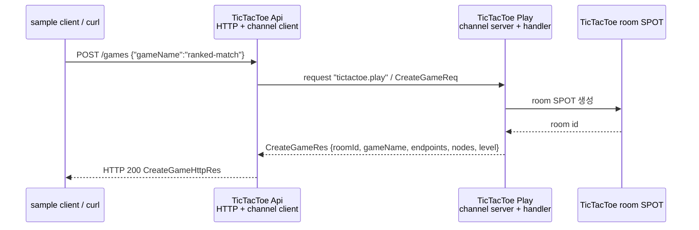
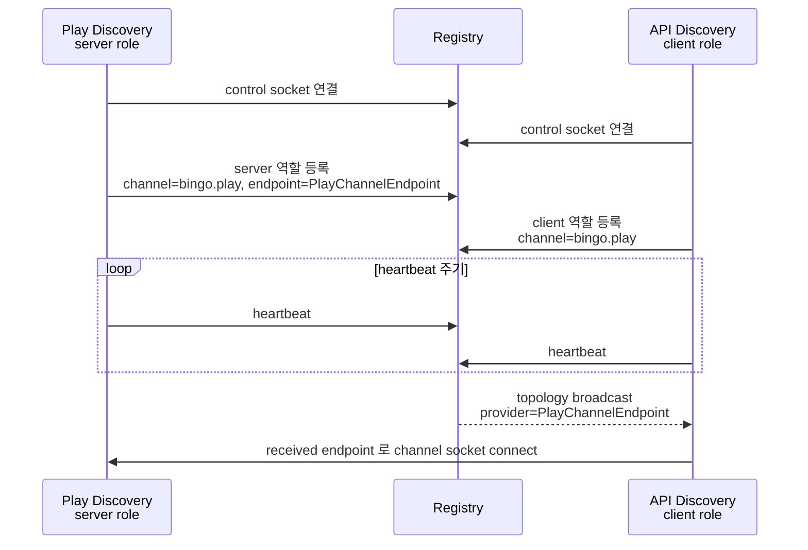

[← 목차](README.ko.md)

# 2. 시작하기

이 장은 실제 `samples/TicTacToe`의 첫 흐름만 따라간다. 전체 게임 규칙을 설명하지
않고, 외부 클라이언트가 `POST /games`를 호출했을 때 API 서버가 Play 서버로 서버 간
channel request를 보내는 부분만 본다.

여기서 확인하는 것은 세 가지다.

- HTTP endpoint는 외부 요청을 받는 진입점이다.
- `channel_client_t`는 다른 서버의 channel handler로 request를 보낸다.
- 처음에는 Registry 없이 **수동 연결**로 endpoint를 직접 지정한다.

## 1. 실제 샘플 위치

| 역할 | 실제 파일 |
|------|-----------|
| 실행 스크립트 | `framework/languages/cpp/samples/TicTacToe/run_sample.sh` |
| API 서버 조립 | `Server/Api/api_server_host_factory.hpp` |
| HTTP handler | `Server/Api/Handlers/create_game_http_handler.hpp` |
| Play 서버 조립 | `Server/Play/play_server_host_factory.hpp` |
| channel handler | `Server/Play/Infrastructure/ZLink/Handlers/create_game_handler.hpp` |
| 메시지 계약 | `Shared/Contracts/messages.hpp` |

빌드 산출물 이름은 `sample_cpp_framework_tictactoe_api`,
`sample_cpp_framework_tictactoe_play`, `sample_cpp_framework_tictactoe_client`다.

## 2. 첫 요청 흐름



이 흐름에서 API 서버는 Play 서버 주소를 Discovery로 찾지 않는다. 실제 C++ 샘플은
설정값 `topology.play_endpoint`를 읽어 `enable_client(endpoint)`로 직접 연결한다.
처음 읽을 때는 이 방식이 가장 단순하다.

## 3. 메시지 계약

실제 샘플의 메시지는 `Shared/Contracts/messages.hpp`에 있다.

```cpp
struct create_game_http_req_t
{
    static constexpr const char *packet_name = "CreateGameHttpReq";
    std::string game_name;
};

struct create_game_http_res_t
{
    static constexpr const char *packet_name = "CreateGameHttpRes";
    std::string room_id;
    std::string game_name;
    std::string owner_play_endpoint;
    std::vector<std::string> play_endpoints;
    std::vector<play_node_info_t> play_nodes;
    int required_level = 0;
};

struct create_game_req_t
{
    static constexpr const char *packet_name = "CreateGameReq";
    std::string game_name;
};

struct create_game_res_t
{
    static constexpr const char *packet_name = "CreateGameRes";
    std::string room_id;
    std::string game_name;
    std::string owner_play_endpoint;
    std::vector<std::string> play_endpoints;
    std::vector<play_node_info_t> play_nodes;
    int required_level = 0;
};
```

HTTP DTO와 channel DTO를 분리해 둔 점이 중요하다. 지금은 필드가 비슷하지만, 외부 HTTP
계약과 서버 간 계약은 나중에 따로 바뀔 수 있다.

## 4. API 서버: HTTP endpoint에서 channel request 보내기

API 서버는 HTTP route를 열고, Play 서버로 나가는 client 역할을 함께 선언한다.

```cpp
options.http ()
  .listen (topology.api_http_endpoint)
  .map_post<create_game_http_handler_t> ("/games");

options.add_client_server_channel (sample_names_t::play_channel)
  .enable_client (topology.play_endpoint);
```

`sample_names_t::play_channel` 값은 `"tictactoe.play"`다. `enable_client(endpoint)`는
수동 연결이다. API 서버가 Play 서버의 channel endpoint를 설정으로 알고 시작한다.

HTTP handler는 `channel_client_t`를 DI로 받고, `CreateGameReq`를 Play channel로 보낸다.

```cpp
class create_game_http_handler_t
{
  public:
    using request_type = create_game_http_req_t;
    using reply_type = create_game_http_res_t;
    using dependency_types =
      zlink::framework::dependency_list_t<zlink::framework::channel_client_t>;
    static constexpr const char *topic_name = "CreateGame";

    explicit create_game_http_handler_t (zlink::framework::channel_client_t &client) :
        _client (client) {}

    zlink::framework::task_t<create_game_http_res_t>
    handle (const create_game_http_req_t &request)
    {
        auto room = co_await _client
                      .request (sample_names_t::play_channel,
                                create_game_req_t{request.game_name})
                      .async<create_game_res_t> ();
        co_return create_game_http_res_t{room.room_id,
                                         room.game_name,
                                         room.owner_play_endpoint,
                                         room.play_endpoints,
                                         room.play_nodes,
                                         room.required_level};
    }

  private:
    zlink::framework::channel_client_t &_client;
};
```

핵심은 HTTP handler가 직접 게임 룸을 만들지 않는다는 것이다. HTTP는 진입점이고,
도메인 처리는 Play 서버 channel handler로 위임한다.

## 5. Play 서버: channel handler 노출하기

Play 서버는 `tictactoe.play` channel의 server 역할을 열고 handler group `"play"`를
붙인다.

```cpp
options.handlers ()
  .add<create_game_handler_t> ("play")
  .add<ensure_player_actor_handler_t> ("play");

options.add_client_server_channel (sample_names_t::play_channel)
  .enable_server (topology.play_endpoint)
  .use_handler_group ("play");
```

`create_game_handler_t`는 `CreateGameReq`를 받아 room id, game name, owner Play stream
endpoint, 참가 가능한 Play stream endpoint 목록, Play node 목록, 요구 level을 돌려준다.
실제 구현은 room SPOT을 만들기 때문에 [8장 SPOT](08-spot.ko.md)에서 다시 이어진다.

```cpp
class create_game_handler_t
{
  public:
    using request_type = create_game_req_t;
    using reply_type = create_game_res_t;
    static constexpr const char *topic_name = "CreateGame";
    // 생성자에서 room 생성 서비스(_creator)와 sample_topology_t(_topology)를
    // dependency_types + 생성자 주입으로 받는다 (지면상 생략).

    create_game_res_t handle (const create_game_req_t &request)
    {
        auto response = _creator.create (request.game_name);
        // 실제 샘플은 여기서 TicTacToe room SPOT을 만든다.
        return response;
    }
};
```

## 6. 실행과 확인

전체 샘플은 스크립트로 실행한다.

```bash
$ framework/languages/cpp/samples/TicTacToe/run_sample.sh
```

스크립트는 Play 서버와 API 서버를 띄운 뒤 sample client를 실행한다. 첫 단계에서 sample
client는 API 서버에 `POST /games`를 보내고, 이어서 반환된 `owner_play_endpoint`와
`play_endpoints`로 STREAM 접속을 진행한다. 이 장은 그중 `POST /games`에서 `CreateGameReq`로
이어지는 부분만 설명한다.

## 7. 자동 연결 — Registry/Discovery

수동 연결 다음 단계는 **Registry/Discovery 자동 연결**이다. 앞 흐름은 client 가
server endpoint(host:port)를 직접 알아야 했다. 자동 연결에서는 **앱 코드가 channel
이름만 알고**, 실제 주소 조회와 channel client 연결은 framework runtime 이 처리한다.

- **Registry** — 어느 노드가 어떤 channel 을 어디(endpoint)서 제공하는지 모아 두는
  디렉터리 서버다. **control-plane** 만 담당하고, 실제 request/reply 데이터는 지나가지
  않는다.
- **Discovery** — `use_discovery().add_registry_endpoint(...)` 를 켜면 **각 서버의
  framework runtime 안에서 도는 agent** 다. 매 서버에서 Discovery 가 ① Registry 로
  control socket 을 연결하고, ② 자기 역할을 등록한 뒤 주기적으로 **heartbeat** 를
  보내며, ③ Registry 가 뿌린 topology 를 받아 **peer 와 직접 소켓을 연결**한다(provider 가
  바뀌면 자동 갱신).

그래서 자동 연결은 두 평면으로 나뉜다.

- **control-plane** — 각 서버의 Discovery ↔ Registry. server 역할은 자기 endpoint 를
  등록하고, client 역할은 필요한 channel view 를 받는다. 양쪽 다 자기 역할을 등록하고
  heartbeat(기본 1초 간격·3초 timeout)로 살아 있음을 알린다 — heartbeat 가 끊기면 Registry 가 그 역할을
  lost 로 보고 topology 에서 빼고 재broadcast 한다.
- **data-plane** — Discovery 가 topology 로 알게 된 endpoint 로 **노드끼리 직접**
  DEALER→ROUTER 소켓을 맺는다. 이후 request/reply 는 Registry 를 거치지 않고 이 직접
  소켓으로 흐른다.

Discovery 와 Registry 연결만 떼어 보면 다음 순서다.



그 결과 만들어진 직접 연결까지 포함하면 전체 흐름은 다음과 같다.

```mermaid
sequenceDiagram
  participant P as Play 서버<br/>enable_server + use_discovery
  participant R as Registry
  participant A as API 서버<br/>enable_client + use_discovery
  participant C as sample client

  rect rgb(245, 247, 250)
    Note over P,R,A: control-plane — 각 서버의 Discovery ↔ Registry
    P->>R: Discovery: control socket 연결
    A->>R: Discovery: control socket 연결
    P->>R: Discovery: 역할 등록 (server "bingo.play" @ PlayChannelEndpoint)
    A->>R: Discovery: 역할 등록 (client "bingo.play")
    loop heartbeat 주기 (기본 1초)
      P->>R: Discovery: heartbeat (server 역할 alive)
      A->>R: Discovery: heartbeat (client 역할 alive)
    end
    R-->>A: topology broadcast: "bingo.play" providers = [PlayChannelEndpoint]
    A->>P: Discovery: provider endpoint 으로 DEALER→ROUTER 직접 소켓 연결
    Note over R: Registry 는 디렉터리(control-plane)일 뿐 — 데이터는 안 지난다
  end

  rect rgb(250, 248, 240)
    Note over C,P: data-plane — Registry 경유 없음
    C->>A: HTTP/API request
    A->>P: request("bingo.play", ...) — 위에서 맺은 직접 소켓으로
    P-->>A: reply
    A-->>C: HTTP/API response
  end

  Note over R,A: provider 추가·이탈 → Registry 재broadcast → API Discovery 가 직접 소켓 갱신
```

> 참고: 현재 C++ `Bingo` 샘플은 Registry 프로세스와 `use_discovery()` 구성을 포함하고,
> API→Play route mesh channel client 는 `.enable_client()`로 endpoint를 직접 넘기지 않는다.
> framework discovery가 Registry에서 받은 provider endpoint로 직접 소켓을 갱신한다.
> 운영 흐름은 [11장 Registry](11-registry.ko.md)를 함께 본다.

## 8. 잘 안 될 때

| 증상 | 점검 |
|------|------|
| API가 Play로 요청하지 못한다 | `topology.play_endpoint`와 Play 서버 `enable_server(...)` endpoint가 같은지 확인 |
| HTTP 요청이 실패한다 | API 서버의 `topology.api_http_endpoint`와 호출 URL이 같은지 확인 |
| 시작 시 예외 | channel 이름 중복, handler group 미등록, client endpoint 누락 여부 확인 |
| 전체 샘플 실패 | `run_sample.sh`는 임시 디렉터리(`mktemp -d`)에 `play.log`·`api.log`·`client.log`를 남기고, 클라이언트 실패 시 그 로그 내용을 stderr로 출력한다 — 그 출력을 확인 |

## 9. 다음 단계

| 하고 싶은 것 | 가는 곳 |
|--------------|---------|
| framework의 핵심 개념 정리 | [3장 핵심 개념](03-concepts.ko.md) |
| 설정 파일과 command line으로 endpoint를 바꾸기 | [5장 Configuration](05-configuration.ko.md) |
| request/send/pub-sub 전체 사용법 | [7장 채널 메시징](07-channel-messaging.ko.md) |
| room/stage 같은 동적 노드 | [8장 SPOT](08-spot.ko.md) |
| Registry 운영 모델과 topology 조회 | [11장 Registry](11-registry.ko.md) |
| 실행 가능한 전체 예제 | `samples/TicTacToe`와 `run_sample.sh` |

[다음: 핵심 개념 →](03-concepts.ko.md)
