[← 목차](README.ko.md)

# 3. 핵심 개념

ZLink framework 는 **다섯 가지 핵심 개념**으로 선다:
**channel · spot · actor · stream · registry/discovery**. 나머지 챕터는 전부 이
다섯의 변주다. 낯선 단어가 나오면 먼저 §0 용어 표에서 한 줄로 잡고, §1~§5 에서
다섯 개념을 차례로 본다. §6 은 이들을 받치는 실행·구성 모델(app 수명주기, DI,
핸들러·실행 모델)이다.

## 0. 용어 빠르게 잡기

가이드에 자주 나오는 용어를 먼저 잡아 둔다. 정식 계약은
[공통 스펙 목차](../../common/README.ko.md)와
[C++ framework spec](../../spec/server/languages/cpp/02-framework-interfaces.ko.md)이 다룬다.

| 용어 | 한 줄 풀이 |
|------|-----------|
| **channel(채널)** | 서버 간 호출을 묶는 논리 이름. `host:port` 대신 `"orders"` 같은 이름으로 부른다 |
| **역할(capability)** | 한 channel 이 맡는 일 — server로 받기, client로 보내기, publisher, subscriber |
| **handler(핸들러)** | 들어온 메시지를 처리하는 클래스나 SPOT 메서드 |
| **client** | 다른 서비스로 호출을 보내는 주입 객체(예: `channel_client_t`) |
| **request / send / publish** | 각각 응답 받는 호출 / 응답 없는 단방향 통지 / 여러 구독자에게 발행 |
| **packet name(패킷 이름)** | 같은 channel 안에서 어느 메시지 종류인지 구분하는 키 |
| **codec** | payload를 바이트로 직렬화·역직렬화하는 방식 |
| **SPOT** | room/zone처럼 동적으로 생겼다 사라지는 상태 노드. 한 SPOT의 callback은 직렬 실행된다 |
| **actor** | 외부 client나 사용자 하나를 대표하는 서버 쪽 객체 |
| **Entry Spot** | actor가 생성 직후 머무는 기본 실행 위치 |
| **STREAM(스트림)** | 외부 client와의 연결 지향 양방향 채널 |
| **session(세션)** | STREAM 연결 하나에 대응하는 서버 측 객체 |
| **Registry** | 어떤 서비스가 어디 떠 있는지 모으는 중앙 디렉터리 서버 |
| **Discovery** | client가 Registry를 보고 연결 대상을 자동으로 찾는 것 |
| **RoutingId** | 노드·SPOT의 논리 주소 |
| **correlation(상관)** | 요청과 응답을 짝지어 주는 식별 정보. framework가 자동 처리 |
| **deadline / timeout** | 응답을 얼마나 기다릴지의 상한 시간 |
| **DI / lifecycle** | 의존성 주입과 앱 시작·종료 수명 관리 |

## 0.1 Payload 직렬화

C++ framework의 일반 payload는 메시지 타입마다 codec을 설정하지 않는다.
payload 타입이 `to_json`/`from_json`을 제공하면 framework가 기본 JSON 직렬화 경로를
사용한다. 사용자는 handler의 `request_type`, `reply_type`, `message_type`,
`event_type`을 선언하고 handler group에 등록하면 된다.

`options.codecs().use(...)`는 일반 메시지 타입을 나열하는 API가 아니다. 기본 JSON으로
표현할 수 없는 payload나 별도 binary serializer가 필요한 extension을 연결할 때만 쓴다.

`zlink::framework::message_t`에 이미 타입이 지워진 payload를 담아 전달하는 고급 경로는
runtime이 타입 이름만 보고 serializer를 찾아야 한다. 이 경우에는 handler 등록으로 알려진
타입이거나 custom serializer extension이 제공한 타입이어야 한다. 일반 업무 코드는 가능한 한
typed request/send/publish API를 사용하고, raw frame이나 `message_t` 우회로 payload 변환을
직접 맡지 않는다.

## 1. channel — 서버 간 연결

channel 은 **서버↔서버 연결을 묶는 논리 이름**이다. 주소(`host:port`)가 아니라
`"orders"` 같은 이름으로 부르고, 실제 위치는 registry/discovery(§5)가 푼다. 배포
값(주소·topology)은 handler 가 아니라 **channel 등록**이 소유한다. 그래서 handler 의
`topic_name` 은 메시지 종류만 나타내고 channel 이름은 갖지 않는다.

**channel 종류(kind)** — 서버 간 연결 방식이 다르다:

| 종류 | 등록 | 연결 패턴 |
|------|------|-----------|
| client-server | `add_client_server_channel` | request-reply · 단방향 send — **ROUTER 서버에 DEALER 클라이언트**가 붙는다 (DEALER 소켓 = client, ROUTER 소켓 = server) |
| fanout | `add_fanout_channel` | publisher → 다수 subscriber, topic (PUB / SUB) |
| route mesh | `add_route_mesh` | router ↔ router — routing id 로 특정 주소에 라우팅 (SPOT node 가 이 route mesh 로 구성된다: [8장](08-spot.ko.md)) |

**소켓 구조 한눈에** — 어떤 소켓이 어떻게 붙는지가 네 종류의 차이다.

- **client-server** — ROUTER 서버 **하나**에 DEALER 클라이언트 **여럿**이 붙는 비대칭 구조.

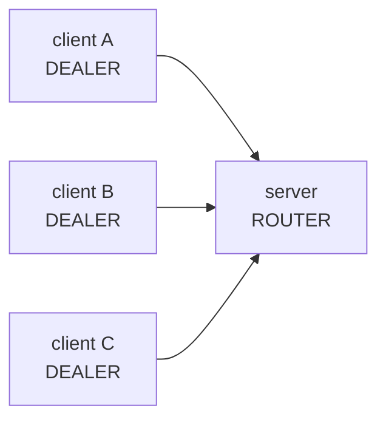

- **fanout** — PUB 하나가 발행하면 같은 메시지가 SUB 여럿에 동시에 퍼진다.

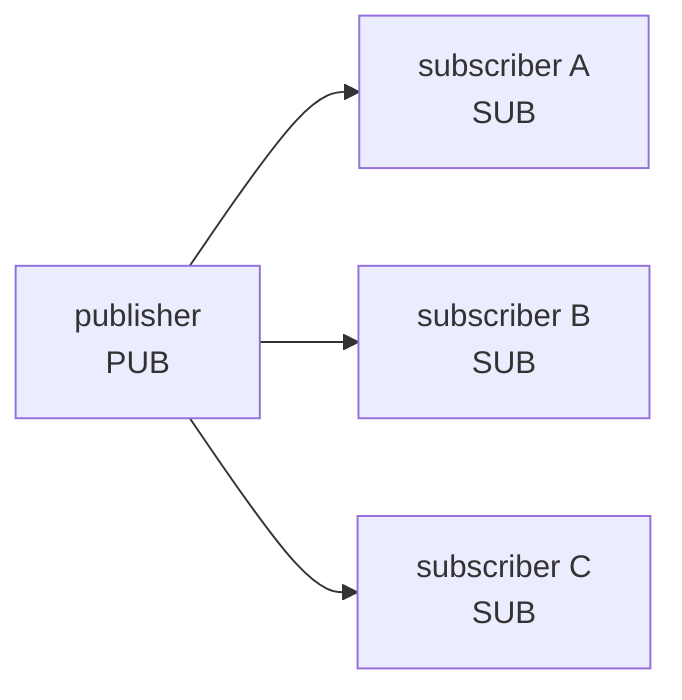

- **route mesh** — ROUTER 끼리 붙어, **routing id 로 지정한 주소에만** 보낸다(분산 아님). SPOT node 가 이 구조로 구성된다.

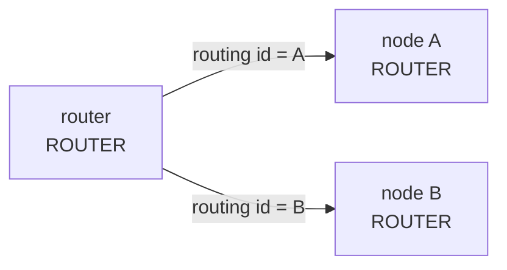

**역할(capability)** — 한 channel 에서 이 앱이 맡는 일:

| 역할 | 의미 | 비고 |
|------|------|------|
| `enable_server(endpoint)` | 이 channel의 request/send를 local handler가 받는다 | bind endpoint 필수 |
| `enable_client()` / `enable_client(endpoint)` | 이 channel로 request/send를 내보낸다 | Discovery 또는 manual endpoint |
| `enable_publisher(endpoint)` | 이 channel로 이벤트를 publish한다 | bind endpoint 필수 |
| `enable_subscriber()` / `enable_subscriber(endpoint)` | 이 channel의 이벤트를 구독한다 | Discovery 또는 manual endpoint |

한 channel 이 여러 역할을 가질 수 있다. server/publisher 는 외부가 접근할 endpoint 가
필요하므로 endpoint 를 받는 overload 를, client/subscriber 는 Discovery 나 수동
endpoint 중 하나로 연결 대상을 얻는다. request/send/pub-sub 사용법과 handler
노출 전체는 [7장 채널 메시징](07-channel-messaging.ko.md)이 다룬다.

> **주의:** channel 이름과 handler **group 이름**은 서로 다르다. group 은 코드 안
> 논리 묶음(`"api"`)이고, channel 은 배포 식별자(`"tictactoe.api"`)다. 같은 group 을
> 여러 channel 에 매핑할 수 있다.

## 2. spot — 상태 단위

spot 은 room/zone/stage 처럼 **동적으로 생겼다 사라지는 상태 노드**다. spot 에
들어오는 actor 패킷·join/leave 는 **한 줄로 직렬 실행**되므로, spot 이 소유한 도메인
상태에 lock 없이 접근한다. 게임 룸·매치처럼 가변 상태를 두기 좋은 자리다.
(단 timer tick 은 room·entry 모두 이 직렬 경계 밖이라 공유 상태 접근 시 자체 동기화가
필요하다 — [8장 §5](08-spot.ko.md).)

한 SPOT 에 들어오는 모든 일은 **단일 큐**를 통과해 한 줄로 처리된다 — 그래서 상태에
lock 이 없다.

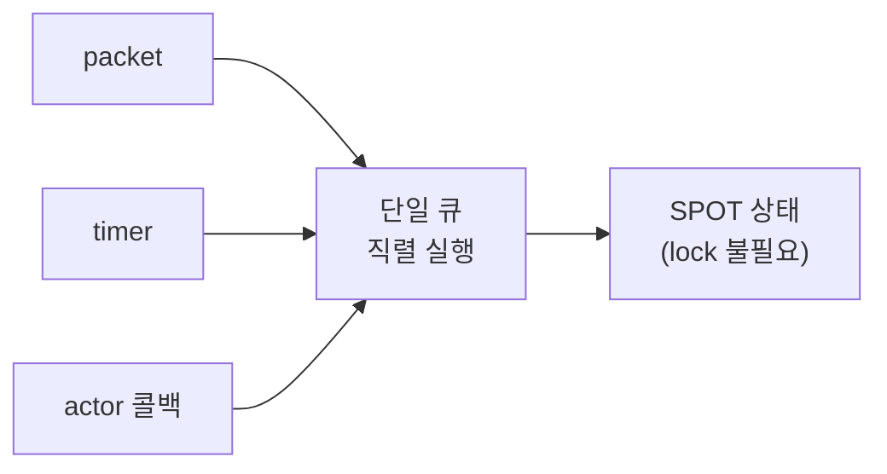

직렬 실행이 보장되는 이유와 작성법은 [8장 SPOT](08-spot.ko.md).

## 3. actor — ID 로 식별되는 상태 객체

actor 는 **외부 client 나 사용자 하나를 대표하는 서버 쪽 상태 객체**다. 같은 actor
id 로 온 메시지는 늘 같은 인스턴스가 처리하고, 외부 client session 을 actor 에
바인딩해 **연결 서버(세션)와 로직 서버(actor)를 분리**할 수 있다.

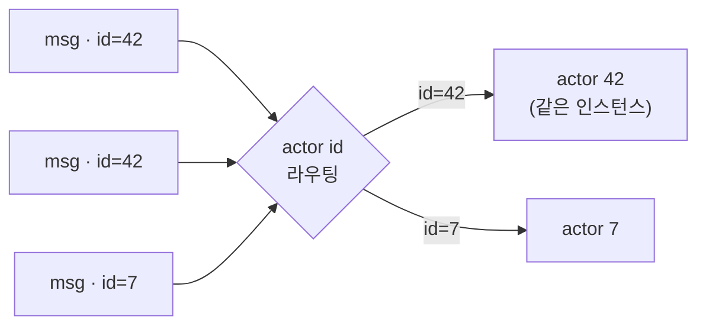

상세는 [9장 Actor · Session](09-actor-session.ko.md).

## 4. stream — 외부 client 연결

stream 은 모바일·게임 같은 **외부 client 와의 연결 지향 양방향 채널**이다. 서버
간 channel(§1)과 달리 연결 수명·재연결·heartbeat 를 framework 가 관리하고, 연결
하나가 서버 측 **session** 객체에 대응한다.

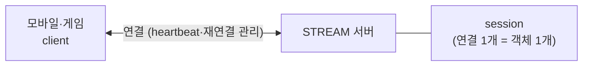

상세는 [10장 Stream](10-stream.ko.md).

## 5. registry / discovery — 주소 자동 연결

앱 코드는 **channel 이름만** 안다. 실제 peer 주소(`host:port`)는 **Registry +
Discovery** 가 해결한다.

- **Registry** — 어느 노드가 어떤 channel 을 어디(endpoint)서 제공하는지 모아 두는
  디렉터리 서버. server/publisher 역할이 startup 에 자기 endpoint 를 등록·heartbeat.
- **Discovery** — `options.use_discovery().add_registry_endpoint(...)` 를 켠
  client/subscriber 가 Registry 의 해당 channel view 를 구독해 provider endpoint 를
  받아 **자동 연결**하고, provider 집합이 바뀌면 **자동 재연결**한다(앱 재시작 불필요).

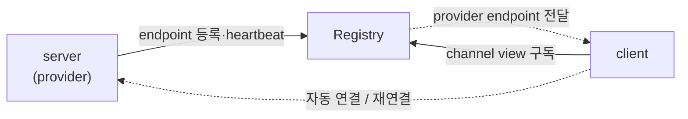

주소 해결 → 자동 연결 sequence 는 [2장 §7](02-getting-started.ko.md)이 그림으로
보여 주고, 운영·배포는 [11장 Registry](11-registry.ko.md)가 다룬다. Registry 없이
endpoint 를 직접 지정하는 **수동 연결**도 가능하다(endpoint overload 반복 호출).

| 전역 Discovery | 역할 manual endpoint | 결과 |
|:---:|:---:|---|
| O | X | Discovery 자동 연결 |
| O | O | manual endpoint 우선 |
| X | O | manual endpoint |
| X | X | startup validation 오류 |

## 6. 보조 — 실행·구성 모델

위 다섯 개념을 받치는 공통 동작이다. 여기서 한 번 짚고, 상세는 각 챕터가 소유한다.

### 6.1 핸들러 모델 — 노드 핸들러 vs SPOT 핸들러

핸들러는 실행 컨텍스트에 따라 두 종류로 나뉘고, 구조와 수명이 완전히 다르다.

- **노드 핸들러(채널·HTTP)** — 독립 클래스. `request_type` / `reply_type` /
  `topic_name` 멤버가 계약이고, `dependency_types` + 생성자 주입으로 의존성을 받는다.
  수명은 **transient**(요청마다 새로), 실행은 **동시**(worker 풀). 그래서 가변
  도메인 상태를 핸들러 멤버에 두지 않는다.
- **SPOT 핸들러** — 독립 클래스가 아니라 **spot 클래스 자체의 메서드**다. `spot_t` /
  `entry_spot_t` 를 상속하고 `configure()` 에서 `add_actor_packet<&T::method>()` 로
  등록한다. 같은 SPOT 안에서는 **전체 직렬 실행**이라 상태에 lock 이 필요 없다.

| | 노드 핸들러 (채널·HTTP) | entry spot | room spot |
|---|---|---|---|
| 기반 | 독립 클래스 | `entry_spot_t` 상속 | `spot_t` 상속 |
| 수명 | transient (요청마다) | 노드와 동일 (영속) | 상태 단위와 동일 (영속) |
| 실행 | 동시 (worker 풀) | **전체 직렬** — 단일 큐 | **전체 직렬** — 단일 큐 |
| 공유 상태 | 핸들러에 두지 않음 | 큐 안에서 안전 | 락 없이 안전 |
| 역할 | 요청 처리·위임 | 배정·매칭·할당 | 도메인 상태 소유·처리 |
| 계약 | `request_type`/`reply_type`/`topic_name` | `configure()` + `add_actor_packet` | `configure()` + `add_actor_packet` |
| DI | `dependency_types` + 생성자 주입 | channel `enable_client(...)` 로 채널 연결 | channel `enable_client(...)` 로 채널 연결 |

**실행 모델 비교** — 같은 3개 요청이 두 핸들러에서 어떻게 도는가:

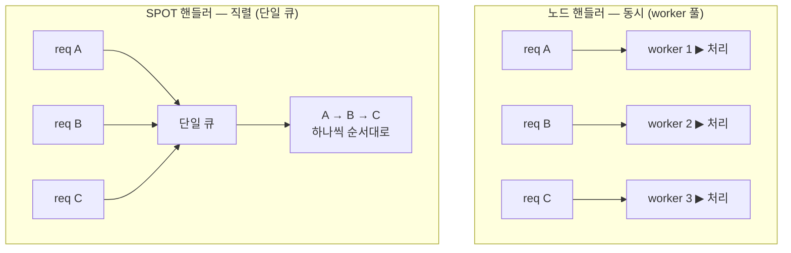

노드 핸들러는 요청마다 다른 worker 가 **동시에** 처리하니 핸들러에 가변 상태를 두면
경합이 난다. SPOT 핸들러는 단일 큐로 **한 번에 하나씩** 처리하니 상태에 lock 이
필요 없다.

가변 도메인 상태(게임 룸 등)는 **SPOT**, 불변 구성(topology)은 싱글톤 서비스, 공유
인프라(캐시·카운터)는 싱글톤 + 자체 동기화에 둔다. SPOT 핸들러 작성과 직렬 실행
보장은 [8장](08-spot.ko.md), 채널 핸들러 노출은 [7장](07-channel-messaging.ko.md).

**handler 노출은 명시적이다** — `options.handlers().group("api").add<T>()` 로 group 에 넣고,
channel 등록에서 `use_handler_group("api")` 로 붙인다. 시작 단계에서 같은 handler
group 안 packet 중복, registry handler 중복, client/subscriber 의 연결 경로 누락,
허용되지 않는 반환형 등이 거부된다.

### 6.2 실행 모델 — `task_t` / `result_t`, `co_await`

프레임워크 전반의 비동기 값은 `task_t<T>`, 성공/실패는 `result_t<T>` 로 표현된다.
규칙은 하나다 — **런타임(핸들러) 스레드에서는 `co_await`, blocking(`.result()`)은
테스트·클라이언트 시나리오에서만.** 실패는 `co_await` 경로에서
`framework_exception_t`(`kind()`/`is_retriable()`)로 던져지고, `result_t` 경로에서는
`error()` 로 조회한다.

```cpp
zlink::framework::task_t<create_game_http_res_t>
handle (const create_game_http_req_t &request)
{
    auto room = co_await _client
                  .request ("tictactoe.play", create_game_req_t{request.game_name})
                  .async<create_game_res_t> ();
    co_return create_game_http_res_t{room.room_id,
                                     room.game_name,
                                     room.owner_play_endpoint,
                                     room.play_endpoints,
                                     room.play_nodes,
                                     room.required_level};
}
```

채널·HTTP 핸들러는 **worker 풀**(기본 = CPU 코어 수,
`options.handler_coroutine_workers(n)`)에서 실행된다. 핸들러가 `co_await` 에 도달하면
코루틴만 멈추고(suspend) 실행 스레드는 다른 큐 항목을 처리한다. 같은 Spot 큐는 그
handler 완료 전까지 다음 callback 을 시작하지 않는다.

핵심은 **이벤트마다 코루틴 하나, 스레드는 공유**다 — SPOT 의 event(message·timer)는
각각 `task_t` 코루틴이 되어 소수의 worker 스레드에 다중화되고, `co_await` 에 걸린
코루틴은 스레드를 **놓는다**(blocking 아님). 그래서 스레드 몇 개로 대기 중인 코루틴
수천 개를 떠받친다.

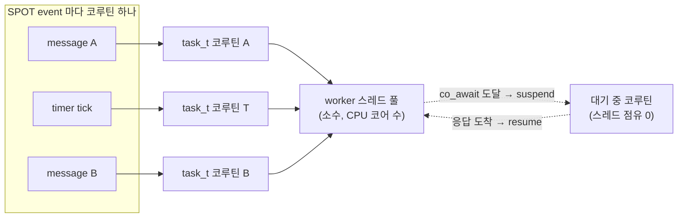

아래 타임라인은 같은 흐름을 시간순으로 본 것이다 — A 가 `co_await` 로 suspend 되면
같은 스레드가 즉시 B 를 처리하고, A 는 응답이 오면 resume 된다.

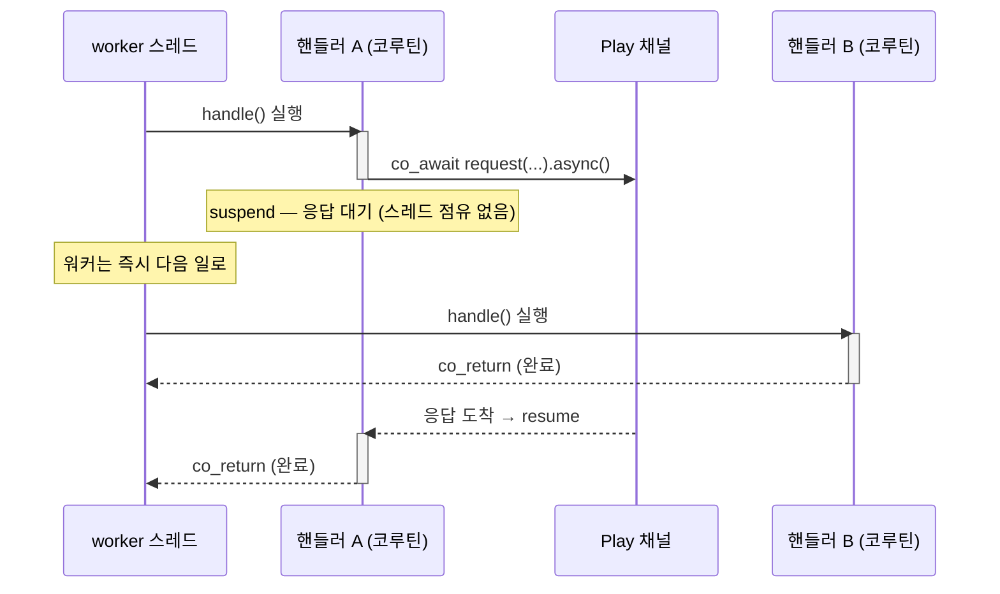

그래서 비동기 호출을 콜백 없이 **동기식 코드처럼 위에서 아래로** 쓰면서도, worker
몇 개로 수많은 동시 요청을 처리한다. 같은 코드를 `.result()` 로 쓰면 스레드 하나가
통째로 잠들기 때문에 핸들러 안에서 금지한다.

### 6.3 app_t 수명주기

`app_t` 는 구성 → 서비스 → 종료의 호스트 수명주기를 소유한다. `run(argc, argv)` 는
블로킹이고 반환값이 종료 코드다.

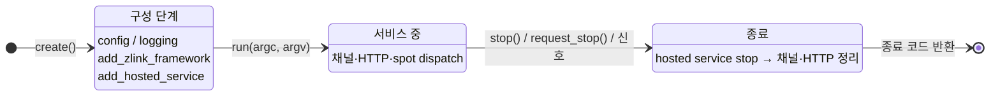

- **구성 단계** — `run` 전에 모든 선언을 끝낸다. 잘못된 구성은 구성 시점이나 `run`
  시작에서 예외로 거부된다.
- **종료** — `request_stop()` 은 비동기 요청(신호 핸들러 등), `stop()` 은 동기 정지.
  종료 시 **등록된 hosted service 를 역순으로 `stop()`** 한다(채널·stream·HTTP 도
  hosted service 로 편입돼 같은 경로로 정리된다).
- 백그라운드 작업은 `hosted_service_t` 로 수명주기에 편입시킨다.

### 6.4 구성: DI 컨테이너 · 진입점 · module_t

- **DI 컨테이너** — `options.services()` 에 `add_singleton/scoped/transient` 로
  등록하고, 소비 측은 `dependency_types` + 생성자 주입(또는 `get_required<T>()`)으로
  받는다. 전체 API 는 [4장 DI 컨테이너](04-di-container.ko.md).
- **구성 표면 지도** — `app_t` 진입점이 역할별로 나뉜다:

  | 진입점 | 역할 | 다루는 장 |
  |--------|------|-----------|
  | `app.config()` / `app.logging()` | 설정·로그 | [5장](05-configuration.ko.md) · 12장 |
  | `app.monitoring()` / `app.metrics()` / `app.health()` | 관측·상태 | 12장 |
  | `app.add_zlink_framework(람다)` | **zlink 토폴로지 선언** (채널/SPOT/stream/registry) | 6~11장 |
  | `app.add_module(...)` / `add_zlink_framework<TModule>()` | 구성 패키징 | 아래 |
  | `app.advanced()` | services/handlers/zlink builder 직접 접근 (탈출구) | — |

- **module_t** — 기능 단위 구성(서비스·zlink 토폴로지·핸들러)을 한 단위로 묶어
  재사용한다. `configure_services / configure_zlink / configure_handlers /
  configure_monitoring` 을 구현하고 `app.add_zlink_framework<TModule>()` 로 붙인다.

[다음: DI 컨테이너 →](04-di-container.ko.md)
