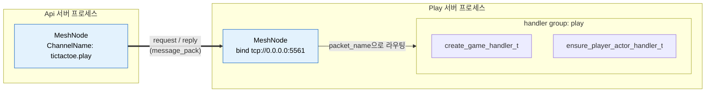
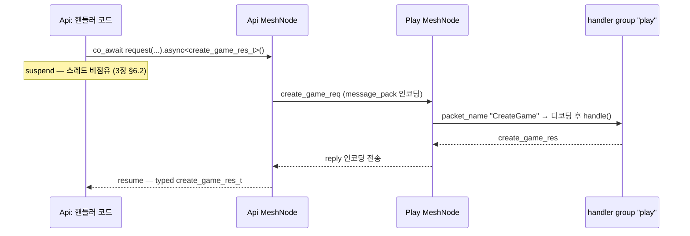
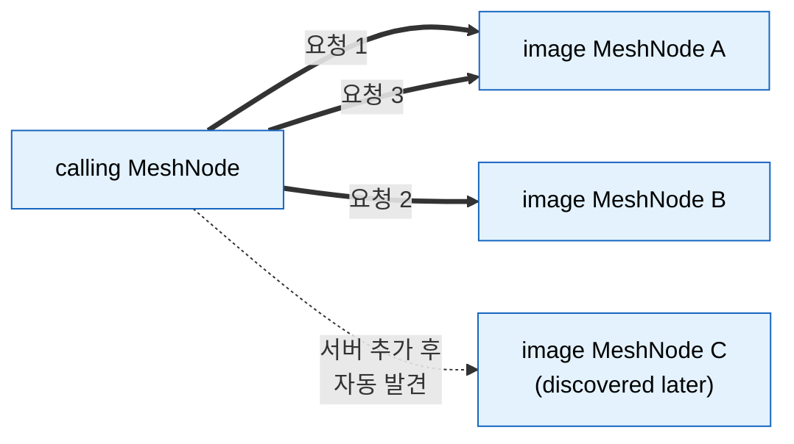
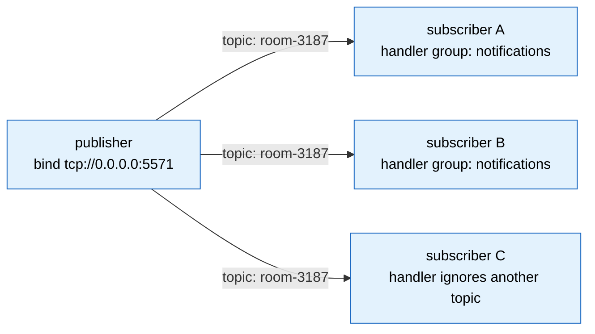

[← 목차](README.ko.md)

# 7. 채널 메시징

## 1. 채널이 하는 일

채널은 이름을 가진 메시징 경로다. 서버 프로세스끼리 typed 메시지를 주고받는
기본 수단이며, endpoint 연결·재접속·직렬화·dispatch는 런타임이 처리한다.

| 종류 | 선언 | 패턴 |
|------|------|------|
| RouteMesh ChannelName | `add_route_mesh(mesh).channel_name(channel)` | 같은 물리 mesh의 논리 membership으로 request-reply와 단방향 send |
| Node direct | `route_client_t::request_to_node(mesh, rid, request)` | 같은 RouteMesh의 특정 MeshNode RID로 전달 |
| fanout | `add_fanout_channel(name)` | publisher → 다수 subscriber (topic) |

## 2. 서버 쪽: 핸들러 그룹과 채널

핸들러([3장 §6.1](03-concepts.ko.md))를 그룹에 등록하고, 채널이 그룹을 가져다
쓴다.

> **cpp 는 수동 등록만 제공한다.** 어트리뷰트·리플렉션 기반 자동 등록(어노테이션
> scan)은 cpp 언어 표준이 아니라 제공하지 않는다 — 핸들러는 항상 명시 registry
> (`handlers().group(...).add<T>()`, SPOT 은 `configure()` context)로 등록한다. dotnet·node·java·kotlin
> 는 수동에 더해 어트리뷰트/데코레이터 자동 등록도 제공한다.

```cpp
app.add_zlink_framework ([&] (zlink::framework::zlink_framework_options_t &options) {
    options.codecs ().use (
      zlink::framework_codecs::messagepack ()); // MessagePack extension을 한 번 등록한다.

    auto mesh = options.add_route_mesh ("tictactoe.application")
      .listen ("tcp://0.0.0.0:5561")             // MeshNode의 ROUTER endpoint
      .set_routing_id (zlink::routing_id_t::from ("play-node-1"));
    mesh.channel_name ("tictactoe.play")          // 같은 socket의 논리 membership
      .use_handler_group ("play");

    options.handlers ()
      .group ("play")
      .add<create_game_handler_t> ()
      .add<ensure_player_actor_handler_t> ();
});
```

- **codec** — 채널 메시지의 직렬화 형식. JSON은 기본 codec으로 제공하며
  JSON codec은 기본값이므로 명시 등록하지 않는다. MessagePack과 Protobuf는
  framework codec extension package를 참조한 뒤 `codecs().use(extension)`으로 등록한다.
- **커스텀 codec(Avro·Thrift 등)** — 기본 codec 외 포맷은
  extension 객체를 `codecs().use(extension)`으로 등록한다.
  extension 내부 registrar가 serializer를 한 번 등록한다.
  serialize는 업무 객체를 `message_t`(byte payload)로, deserialize는 그 반대로 변환하는
  함수다. packet name 결정과 handler/client API는 codec 변경과 분리된다.

  ```cpp
  struct avro_codec_extension_t {
      schema_t schema;

      template <typename TRegistrar>
      void register_framework_codecs (TRegistrar &codecs) const {
          codecs.template add_serializer<place_order_t> (
              [schema = schema] (const place_order_t &order) {
                  return zlink::framework::encoded_payload_t::from_raw (
                      zlink::message_t::from (avro_encode (schema, order)));
              },
              [schema = schema] (const zlink::framework::encoded_payload_t &payload) {
                  return avro_decode<place_order_t> (schema, payload.to_raw ().to_string ());
              });
      }
  };

  options.codecs ().use (avro_codec_extension_t{schema});
  ```

  다른 언어의 등록 표면은 [framework-api §9](../../spec/05-framework-api.ko.md#9-codec) 표를
  본다. client connector 쪽은 extension이 제공하는 `typed_codec_t` 구현을 connector options에
  한 번 넣어 같은 커스텀 codec을 사용한다.
- 같은 그룹을 여러 채널이 공유할 수 있고, 한 채널에 그룹 하나를 연결한다.

위 선언이 만들어 내는 것:



MeshName(`tictactoe.application`)은 물리 mesh를 식별하고 ChannelName(`tictactoe.play`)은 그 mesh 안의
논리 membership을 식별한다. 각 MeshNode는 ROUTER endpoint 하나를 열며, 같은 ChannelName에 등록한
handler group으로 typed 요청을 dispatch한다.

## 3. 호출하는 MeshNode: request_client_t

요청을 보내는 프로세스도 같은 MeshName의 MeshNode를 등록한다. 수동 연결은 상대 endpoint를
`peer_connections()`에 넣고, 자동 연결은 location store에서 같은 MeshName의 descriptor를 찾는다.

```cpp
auto mesh = options.add_route_mesh ("tictactoe.application")
  .listen ("tcp://0.0.0.0:5562")
  .set_routing_id (zlink::routing_id_t::from ("api-node-1"));
mesh.channel_name ("tictactoe.play");
mesh.peer_connections ().connect ("tcp://10.30.1.15:5561"); // 수동 peer
```

`request_client_t`는 DI 서비스다. 핸들러의 `dependency_types`로 받는다.

```cpp
class create_game_http_handler_t
{
  public:
    using dependency_types =
      zlink::framework::dependency_list_t<zlink::framework::request_client_t>;
    explicit create_game_http_handler_t (zlink::framework::request_client_t &client) :
        _client (client) {}

    zlink::framework::task_t<create_game_http_res_t>
    handle (const create_game_http_req_t &request)
    {
        auto room = co_await _client
                      .request ("tictactoe.application", "tictactoe.play",
                                create_game_req_t{request.game_name})
                      .async<create_game_res_t> ();
        co_return create_game_http_res_t{room.room_id,
                                         room.game_name,
                                         room.owner_play_endpoint,
                                         room.play_endpoints,
                                         room.play_nodes,
                                         room.required_level};
    }
    // ...
};
```

### call 표면

| facade | 호출 | 의미 |
|--------|------|------|
| `request_client_t` | `request(mesh, channel, req).async<TReply>()` | request-reply. `co_await`로 typed 응답 |
| `request_client_t` | `send(mesh, channel, msg).submit()` | 응답 없는 단방향 전송 |
| `publisher_t` | `publish(channel, topic, event)` | fanout 채널로 topic publish (§6) |

`request_client_t`는 DI로 주입받거나 `message_bus_t::client()`에서 얻는다.
`publisher_t`는 `message_bus_t::publisher()`에서도 얻을 수 있다.

call 객체에는 전송 전에 옵션을 설정할 수 있다.

```cpp
auto reply = co_await _client
               .request ("tictactoe.application", "tictactoe.play",
                         create_game_req_t{name})
               .metadata ("trace-id", trace_id)
               .async<create_game_res_t> ();
```

`.timeout(...)`을 생략해도 **무기한 대기하지 않는다.** 호출별 timeout이 있으면
그 값을 쓰고, 없으면 channel builder의 `set_default_request_timeout(...)`, 마지막으로
framework 전역 `set_default_request_timeout(...)` 값을 사용한다. 전역 기본값은
**30초**다. 이 호출만 더 짧게/길게 두고 싶을 때 호출 단위로 지정한다.

request 한 번의 전체 흐름 — 디코딩/인코딩과 핸들러 호출은 런타임이 처리하고,
양쪽 application 코드는 typed DTO만 본다.



실패는 `co_await`에서 `framework_exception_t`로 던져진다 —
에러 처리는 [3장 §6.2](03-concepts.ko.md)와 동일 모델이다.

## 4. filter — 공통 처리

HTTP middleware(`options.http().use<TMiddleware>()`)는 HTTP route 파이프라인 전용이다.
ZLink channel handler에는 자동으로 적용되지 않는다. channel handler 앞뒤의 로깅,
검증, 권한 확인, metric 기록처럼 여러 handler에 반복되는 처리는 handler filter로 둔다.

```cpp
class audit_filter_t
{
  public:
    using dependency_types =
      zlink::framework::dependency_list_t<zlink::framework::logger_t<audit_filter_t>>;

    explicit audit_filter_t (zlink::framework::logger_t<audit_filter_t> &logger) :
        _logger (logger) {}

    zlink::framework::task_t<zlink::message_t>
    invoke (const zlink::framework::handler_invocation_context_t &invocation,
            zlink::framework::handler_next_t next)
    {
        _logger.info ("dispatch zlink handler",
                      {{"packet", invocation.context.packet_name}});

        auto reply = co_await next ();   // 호출하지 않으면 handler는 실행되지 않는다.

        co_return reply;
    }

  private:
    zlink::framework::logger_t<audit_filter_t> &_logger;
};

app.add_zlink_framework ([&] (zlink::framework::zlink_framework_options_t &options) {
    options.use_filter<audit_filter_t> ();

    options.handlers ()
      .group ("play")
      .add<create_game_handler_t> ()
      .add<ensure_player_actor_handler_t> ();
});
```

filter 타입은 `invoke(const handler_invocation_context_t &, handler_next_t)`를 제공한다.
`handler_invocation_context_t`에는 handler descriptor, channel/packet 이름 같은 dispatch
context, 변경할 수 없는 raw message payload가 들어 있다. 처리를 계속하려면 `next()`를
`co_await`하고, handler 호출을 막아야 하는 경우에는 `next()`를 호출하지 않고 직접
`message_t`를 반환한다.

filter도 framework가 직접 `new`로 만들지 않는다. `options.use_filter<TFilter>()`로
등록하면 같은 DI 컨테이너에서 resolve되며, 등록한 순서대로 handler 호출 앞단을 감싼다.

## 5. 같은 ChannelName을 제공하는 MeshNode 여러 개

처리량을 늘리려면 같은 MeshName과 ChannelName membership을 가진 MeshNode를 여러 process에 등록한다.
호출하는 MeshNode는 여러 peer endpoint를 직접 지정하거나 location store discovery로 찾는다. 호출 코드는
ChannelName만 사용하고 endpoint 목록은 framework 설정에 둔다.

```cpp
// 이미지 처리 MeshNode A
auto mesh = options.add_route_mesh ("image.application")
  .listen ("tcp://0.0.0.0:5600")
  .set_routing_id (zlink::routing_id_t::from ("image-node-a"));
mesh.channel_name ("image.resize").use_handler_group ("resize");

// 이미지 처리 MeshNode B — 동일 MeshName과 ChannelName, 다른 process
auto mesh = options.add_route_mesh ("image.application")
  .listen ("tcp://0.0.0.0:5601")
  .set_routing_id (zlink::routing_id_t::from ("image-node-b"));
mesh.channel_name ("image.resize").use_handler_group ("resize");
```

```cpp
// 호출하는 MeshNode: 두 peer endpoint를 수동 등록
auto mesh = options.add_route_mesh ("image.application")
  .listen ("tcp://0.0.0.0:5599")
  .set_routing_id (zlink::routing_id_t::from ("image-api"));
mesh.channel_name ("image.resize");
mesh.peer_connections ().connect ("tcp://10.30.1.10:5600");
mesh.peer_connections ().connect ("tcp://10.30.1.10:5601");
```

각 MeshNode는 `listen(endpoint)`로 다른 MeshNode가 연결할 endpoint를 제공한다. Handler group을 연결한
ChannelName은 요청을 처리하고, 연결하지 않은 membership은 다른 MeshNode의 handler를 호출하는 데 사용할
수 있다. Location store를 등록하면 manual peer 목록 대신 같은 MeshName의 descriptor를 기준으로 peer를
자동 조정한다. 내부 연결과 송수신 배선은
[runtime architecture](../internals/runtime-architecture.ko.md)에서 설명한다.



request handler는
`request_type`/`reply_type`/`topic_name` + `handle()`을 두고, send handler는
`message_type` + `handle()`을 둔다.

ChannelName 호출은 해당 membership의 후보 가운데 한 MeshNode를 선택한다. 특정 MeshNode RID로 보내야 하면
Node direct 호출([§7](#7-node-direct-호출))을 사용한다.

## 6. fanout: publish/subscribe

알림처럼 한 곳에서 여러 구독자로 흘리는 메시지는 fanout 채널을 쓴다.

```cpp
// publisher 쪽 채널 선언
options.add_fanout_channel ("bingo.notifications")
  .enable_publisher ("tcp://0.0.0.0:5571");

// 보내기 — publisher_t로 topic 단위 publish
publisher.publish ("bingo.notifications", "room-3187",
                   number_drawn_notify_t{state});

// subscriber 쪽 — 핸들러 그룹으로 받는다
options.add_fanout_channel ("bingo.notifications")
  .enable_subscriber ("tcp://10.30.1.20:5571")
  .use_handler_group ("notifications");
options.handlers ()
  .group ("notifications")
  .add_publish<number_drawn_handler_t> ();
```

`publisher_t`는 `auto pub = app.advanced().zlink().publisher();`의
`zlink_builder_t::publisher()`에서 얻는다. SPOT 코드에서 fanout으로 발행하려면
owner MeshNode의 Spot publish 설정을 사용하고 `spot_context_t::publish(topic, event)`를
호출한다([8장 §6](08-spot.ko.md)).



publish한 message는 channel의 모든 subscriber에게 전달된다. topic은 transport 구독 필터가 아니다.
subscriber의 handler는 수신 context의 topic을 확인하고 application이 처리할 topic인지 판단한다.

## 7. Node direct 호출

RouteMesh는 MeshName 하나로 식별하는 물리 mesh이며, 각 MeshNode는 고유한 `routing_id_t`를 갖는다.
ChannelName의 후보 선택을 사용하지 않고 특정 MeshNode로 전달해야 할 때 `route_client_t`의 Node direct
호출을 사용한다. Node, Channel, Spot과 Actor 메시지는 별도 bridge 없이 같은 MeshNode ROUTER를 사용한다.

```cpp
auto mesh = options.add_route_mesh ("tictactoe.application")
  .listen (topology.play_router_endpoint)          // MeshNode ROUTER endpoint
  .set_routing_id (topology.play_rid);
mesh.channel_name ("tictactoe.play");              // 논리 membership
```

`route_client_t`는 호출마다 MeshName과 대상 RID를 받는다. 특정 ChannelName의 후보로 요청하려면
`request_to_channel(mesh_name, channel_name, request)`를 사용한다.

```cpp
class match_handler_t
{
  public:
    using dependency_types =
      zlink::framework::dependency_list_t<zlink::framework::route_client_t>;

    explicit match_handler_t (zlink::framework::route_client_t &routes) :
        _routes (routes) {}

    zlink::framework::task_t<allocate_room_res_t>
    handle (const allocate_room_req_t &request)
    {
        auto target = zlink::routing_id_t::from ("play-node-1");
        co_return co_await _routes
          .request_to_node ("tictactoe.application", target, request)
          .async<allocate_room_res_t> ();
    }

  private:
    zlink::framework::route_client_t &_routes;
};
```

같은 MeshName으로 반복 호출하면 application 코드에서 작은 wrapper를 만들어 DI에 등록할 수 있다. 이
wrapper는 framework API가 아니라 application이 정한 이름이다. 업무 코드는 MeshName 문자열을 반복하지
않고 wrapper 안에서 물리 mesh 선택을 한 곳에 둔다.

```cpp
class play_routes_t
{
  public:
    using dependency_types =
      zlink::framework::dependency_list_t<zlink::framework::route_client_t>;

    explicit play_routes_t (zlink::framework::route_client_t &routes) :
        _routes (routes) {}

    zlink::framework::channel_request_call_t
    request (zlink::routing_id_t target, allocate_room_req_t request)
    {
        return _routes.request_to_node ("tictactoe.application", std::move (target),
                                        std::move (request));
    }

  private:
    zlink::framework::route_client_t &_routes;
};

options.services ()
  .add_singleton<play_routes_t, zlink::framework::route_client_t> ();
```

Spot과 Actor는 별도 mesh runtime을 만들지 않고 owner MeshNode에 등록한다. 외부 호출자는 resolved
`spot_handle_t` 또는 `actor_ref_t`를 사용하며 Spot RID와 MeshNode RID를 직접 조립하지 않는다.

[다음: SPOT →](08-spot.ko.md)
