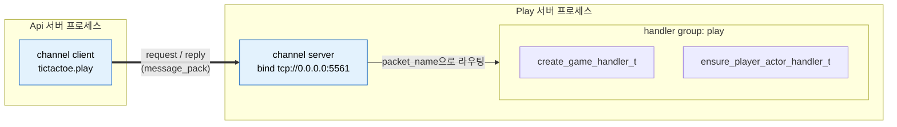
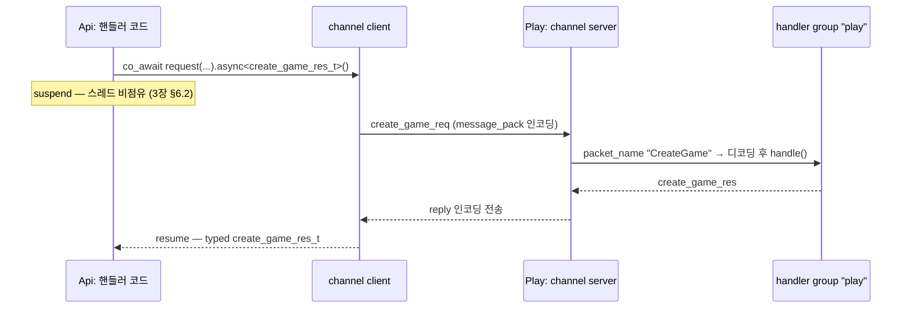
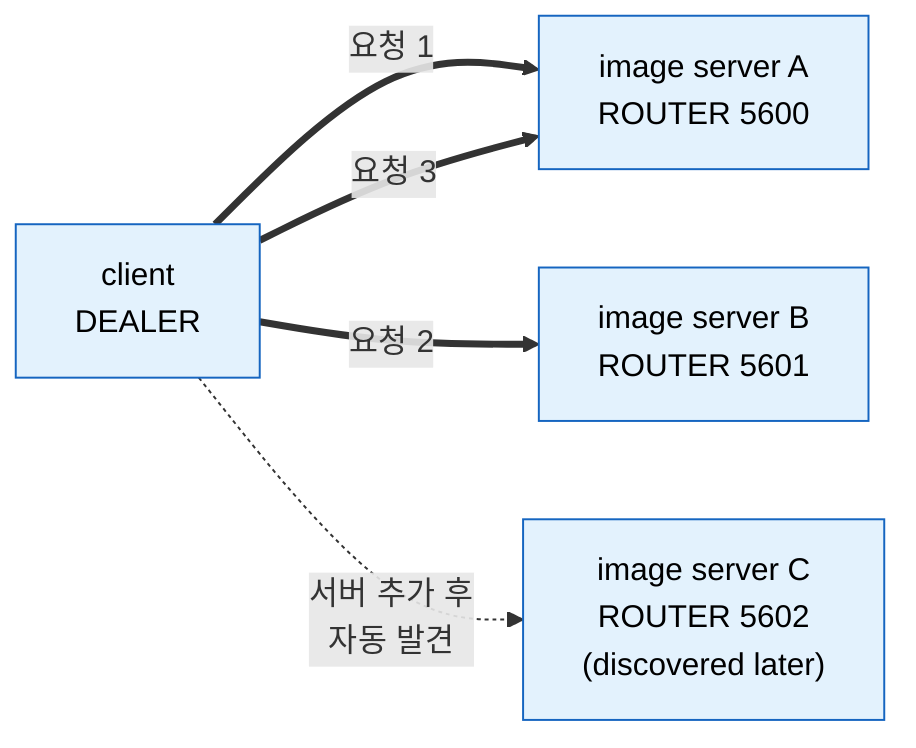
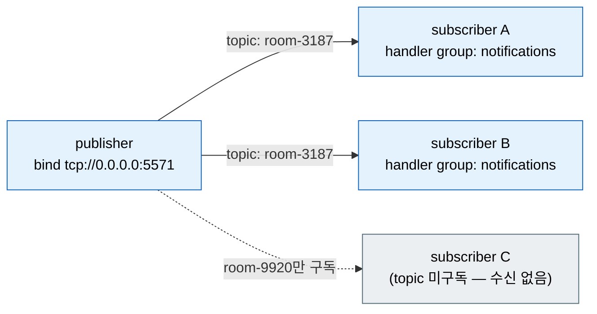

[← 목차](README.ko.md)

# 7. 채널 메시징

## 1. 채널이 하는 일

채널은 이름을 가진 메시징 경로다. 서버 프로세스끼리 typed 메시지를 주고받는
기본 수단이며, endpoint 연결·재접속·직렬화·dispatch는 런타임이 처리한다.

| 종류 | 선언 | 패턴 |
|------|------|------|
| client/server | `add_client_server_channel(name)` | request-reply, 단방향 send — ROUTER 서버에 DEALER 클라이언트 (DEALER=client, ROUTER=server) |
| fanout | `add_fanout_channel(name)` | publisher → 다수 subscriber (topic) |
| route mesh | `add_route_mesh(name)` | router ↔ router — routing id 로 주소 라우팅 (SPOT node 구성: [8장](08-spot.ko.md)) |

## 2. 서버 쪽: 핸들러 그룹과 채널

핸들러([3장 §6.1](03-concepts.ko.md))를 그룹에 등록하고, 채널이 그룹을 가져다
쓴다.

> **cpp 는 수동 등록만 제공한다.** 어트리뷰트·리플렉션 기반 자동 등록(어노테이션
> scan)은 cpp 언어 표준이 아니라 제공하지 않는다 — 핸들러는 항상 명시 registry
> (`handlers().group(...).add<T>()`, SPOT 은 `configure()` context)로 등록한다. dotnet·node·java
> 는 수동에 더해 어트리뷰트/데코레이터 자동 등록도 제공한다.

```cpp
app.add_zlink_framework ([&] (zlink::framework::zlink_framework_options_t &options) {
    options.codecs ().use (
      zlink::framework_codecs::messagepack<create_game_req_t,
                                           create_game_res_t> ());

    options.add_client_server_channel ("tictactoe.play")
      .enable_server ("tcp://0.0.0.0:5561")
      .use_handler_group ("play");

    options.handlers ()
      .group ("play")
      .add<create_game_handler_t> ()
      .add<ensure_player_actor_handler_t> ();
});
```

- **codec** — 채널 메시지의 직렬화 형식. JSON은 기본 codec으로 제공하며
  JSON codec은 기본값이므로 명시 등록하지 않는다. MessagePack과 Protobuf는
  framework codec extension package를 참조한 뒤 `codecs().use(extension)`으로 등록한다.
- **커스텀 codec(Avro·Thrift 등)** — 기본 codec 외 포맷은
  extension 객체를 `codecs().use(extension)`으로 등록한다.
  extension 내부 registrar가 serializer를 한 번 등록한다.
  serialize는 업무 객체를 `message_t`(byte payload)로, deserialize는 그 반대로 변환하는
  함수다. packet name 결정과 handler/client API는 codec 변경과 분리된다.

  ```cpp
  struct avro_codec_extension_t {
      schema_t schema;

      template <typename TRegistrar>
      void register_framework_codecs (TRegistrar &codecs) const {
          codecs.template add_serializer<place_order_t> (
              [schema = schema] (const place_order_t &order) {
                  return zlink::framework::encoded_payload_t::from_raw (
                      zlink::message_t::from (avro_encode (schema, order)));
              },
              [schema = schema] (const zlink::framework::encoded_payload_t &payload) {
                  return avro_decode<place_order_t> (schema, payload.to_raw ().to_string ());
              });
      }
  };

  options.codecs ().use (avro_codec_extension_t{schema});
  ```

  다른 언어의 등록 표면은 [framework-api §2.2](../../spec/05-framework-api.ko.md) 표를
  본다. client connector 쪽은 `codec_traits<T>` 특수화로 같은 커스텀 codec을 끼운다.
- 같은 그룹을 여러 채널이 공유할 수 있고, 한 채널에 그룹 하나를 연결한다.

위 선언이 만들어 내는 것:



채널 이름(`tictactoe.play`)이 양쪽을 잇는 키다. 서버는 endpoint에 bind하고
그룹의 핸들러로 dispatch하며, 클라이언트는 같은 이름으로 연결해 typed 요청을
보낸다.

## 3. 클라이언트 쪽: channel_client_t

요청을 보내는 프로세스는 채널을 client로 연결하고, `channel_client_t`를
주입받아 호출한다.

```cpp
options.add_client_server_channel ("tictactoe.play")
  .enable_client ("tcp://10.30.1.15:5561");   // endpoint 직접 지정
// 또는 registry discovery로 endpoint를 찾게 한다 (11장)
options.add_client_server_channel ("tictactoe.play").enable_client ();
```

`channel_client_t`는 DI 서비스다 — 핸들러의 `dependency_types`로 받는다.

```cpp
class create_game_http_handler_t
{
  public:
    using dependency_types =
      zlink::framework::dependency_list_t<zlink::framework::channel_client_t>;
    explicit create_game_http_handler_t (zlink::framework::channel_client_t &client) :
        _client (client) {}

    zlink::framework::task_t<create_game_http_res_t>
    handle (const create_game_http_req_t &request)
    {
        auto room = co_await _client
                      .request ("tictactoe.play", create_game_req_t{request.game_name})
                      .async<create_game_res_t> ();
        co_return create_game_http_res_t{room.room_id,
                                         room.game_name,
                                         room.owner_play_endpoint,
                                         room.play_endpoints,
                                         room.play_nodes,
                                         room.required_level};
    }
    // ...
};
```

### call 표면

| facade | 호출 | 의미 |
|--------|------|------|
| `channel_client_t` | `request(channel, req).async<TReply>()` | request-reply. `co_await`로 typed 응답 |
| `publisher_t` | `publish(channel, topic, event)` | fanout 채널로 topic publish (§6) |
| `message_bus_t` | `send(channel, msg)` | 응답 없는 단방향 전송 (advanced — `app.advanced().zlink()`의 builder에서 `message_bus()`로 획득) |

`channel_client_t`는 DI로 주입받고, `publisher_t`/`message_bus_t`는
`zlink_builder_t`(`publisher()`/`message_bus()`)에서 얻는다.

call 객체에는 전송 전에 옵션을 얹을 수 있다.

```cpp
auto reply = co_await _client
               .request ("tictactoe.play", create_game_req_t{name})
               .metadata ("trace-id", trace_id)
               .async<create_game_res_t> ();
```

`.timeout(...)`을 생략해도 **무기한 대기하지 않는다.** 호출별 timeout이 있으면
그 값을 쓰고, 없으면 channel builder의 `set_default_request_timeout(...)`, 마지막으로
framework 전역 `set_default_request_timeout(...)` 값을 사용한다. 전역 기본값은
**30초**다. 이 호출만 더 짧게/길게 두고 싶을 때 호출 단위로 지정한다.

request 한 번의 전체 흐름 — 디코딩/인코딩과 핸들러 호출은 런타임이 처리하고,
양쪽 application 코드는 typed DTO만 본다.



실패는 `co_await`에서 `framework_exception_t`로 던져진다 —
에러 처리는 [3장 §6.2](03-concepts.ko.md)와 동일 모델이다.

## 4. filter — 공통 처리

HTTP middleware(`options.http().use<TMiddleware>()`)는 HTTP route 파이프라인 전용이다.
ZLink channel handler에는 자동으로 적용되지 않는다. channel handler 앞뒤의 로깅,
검증, 권한 확인, metric 기록처럼 여러 handler에 반복되는 처리는 handler filter로 둔다.

```cpp
class audit_filter_t
{
  public:
    using dependency_types =
      zlink::framework::dependency_list_t<zlink::framework::logger_t<audit_filter_t>>;

    explicit audit_filter_t (zlink::framework::logger_t<audit_filter_t> &logger) :
        _logger (logger) {}

    zlink::framework::task_t<zlink::message_t>
    invoke (const zlink::framework::handler_invocation_context_t &invocation,
            zlink::framework::handler_next_t next)
    {
        _logger.info ("dispatch zlink handler",
                      {{"packet", invocation.context.packet_name}});

        auto reply = co_await next ();   // 호출하지 않으면 handler는 실행되지 않는다.

        co_return reply;
    }

  private:
    zlink::framework::logger_t<audit_filter_t> &_logger;
};

app.add_zlink_framework ([&] (zlink::framework::zlink_framework_options_t &options) {
    options.use_filter<audit_filter_t> ();

    options.handlers ()
      .group ("play")
      .add<create_game_handler_t> ()
      .add<ensure_player_actor_handler_t> ();
});
```

filter 타입은 `invoke(const handler_invocation_context_t &, handler_next_t)`를 제공한다.
`handler_invocation_context_t`에는 handler descriptor, channel/packet 이름 같은 dispatch
context, 변경할 수 없는 raw message payload가 들어 있다. 처리를 계속하려면 `next()`를
`co_await`하고, handler 호출을 막아야 하는 경우에는 `next()`를 호출하지 않고 직접
`message_t`를 반환한다.

filter도 framework가 직접 `new`로 만들지 않는다. `options.use_filter<TFilter>()`로
등록하면 같은 DI 컨테이너에서 resolve되며, 등록한 순서대로 handler 호출 앞단을 감싼다.

## 5. client/server: 같은 서비스 여러 대에 연결

처리량을 늘리고 싶을 때 같은 client/server channel 이름으로 서버 인스턴스를 여러 개
띄운다. 클라이언트는 같은 channel에서 여러 server endpoint를 직접 지정하거나 discovery로
찾는다. 호출 코드는 channel 이름만 쓰고, endpoint 목록은 framework 설정에 둔다.

```cpp
// 이미지 처리 서버 A
options.add_client_server_channel ("image.resize")
    .enable_server ("tcp://0.0.0.0:5600")
    .use_handler_group ("resize");

// 이미지 처리 서버 B — 동일 채널, 다른 프로세스
options.add_client_server_channel ("image.resize")
    .enable_server ("tcp://0.0.0.0:5601")
    .use_handler_group ("resize");
```

```cpp
// 클라이언트: 같은 채널에서 두 서버 endpoint를 모두 등록
options.add_client_server_channel ("image.resize")
    .enable_client ("tcp://10.30.1.10:5600")
    .enable_client ("tcp://10.30.1.10:5601");

// 또는 discovery로 자동 발견 — 서버가 추가될 때 클라이언트 재시작 불필요
options.add_client_server_channel ("image.resize")
    .enable_client ();   // 인자 없는 enable_client = registry discovery로 자동 연결
```

server role은 `enable_server(endpoint)`로 ROUTER endpoint를 열고 handler group을 실행한다.
client role은 `enable_client(...)`로 DEALER 연결을 만든다. 같은 프로세스가 두 역할을 모두
가질 수 있지만, 각 역할의 socket과 책임은 분리된다.



request handler는
`request_type`/`reply_type`/`topic_name` + `handle()`을 두고, send handler는
`message_type` + `handle()`을 둔다.

> **route mesh와 차이**: client/server channel은 일반 service endpoint 호출에 적합하다. 특정 엔티티(주문 ID, 사용자 ID 등)가 항상 같은 서버로 가야 한다면 route mesh([§7](#7-route-mesh-고급))를 쓴다.

## 6. fanout: publish/subscribe

알림처럼 한 곳에서 여러 구독자로 흘리는 메시지는 fanout 채널을 쓴다.

```cpp
// publisher 쪽 채널 선언
options.add_fanout_channel ("bingo.notifications")
  .enable_publisher ("tcp://0.0.0.0:5571");

// 보내기 — publisher_t로 topic 단위 publish
co_await publisher.publish ("bingo.notifications", "room-3187",
                            number_drawn_notify_t{state}).async ();

// subscriber 쪽 — 핸들러 그룹으로 받는다
options.add_fanout_channel ("bingo.notifications")
  .enable_subscriber ("tcp://10.30.1.20:5571")
  .use_handler_group ("notifications");
options.handlers ()
  .group ("notifications")
  .add_publish<number_drawn_handler_t> ();
```

`publisher_t`는 `auto pub = app.advanced().zlink().publisher();`의
`zlink_builder_t::publisher()`에서 얻는다. SPOT 코드에서 fanout으로 발행하려면
SpotMesh의 pub/sub 역할을 켜고 `spot_context_t::publish(topic, event)`를
사용한다([8장 §6](08-spot.ko.md)).



publish 한 message 는 **구독자 수와 무관하게 한 번만 인코딩**된다. 런타임은 그
인코딩 결과를 **구독 중인 각 구독자 연결로 한 번씩 전달**할 뿐, 구독자마다 다시
직렬화하지 않는다.

## 7. route mesh (고급)

route mesh 는 **router ↔ router** 연결로, `routing_id` 를 지정해 **특정 주소로
라우팅**한다. 한 노드가
**server 와 client 를 둘 다** 한다 — `enable_server(endpoint)` 로 bind 해서 받고(제공),
`enable_client(endpoint)` 로 다른 router 에 연결한다(소비). 둘은 같은 ROUTER socket을
공유한다. SPOT 노드가 이 route mesh 로 구성되므로, SPOT 라우팅 백본이 필요할 때 쓴다.
TicTacToe Play 서버 선언:

```cpp
options.add_route_mesh ("tictactoe.router")
  .enable_server (topology.play_router_endpoint)   // 이 ROUTER bind(제공)
  .set_routing_id (topology.play_rid);             // 이 router 의 주소
```

route mesh 로 직접 호출할 때는 `route_client_t`를 주입받고, 호출마다 route channel
이름과 대상 `routing_id_t`를 지정한다. `route_client_t`는 특정 channel 하나에 묶인
client 가 아니므로, route mesh channel 이 여러 개 있어도 호출 인자의 channel 이름으로
어느 경로를 쓸지 분명하게 정한다.

```cpp
class match_handler_t
{
  public:
    using dependency_types =
      zlink::framework::dependency_list_t<zlink::framework::route_client_t>;

    explicit match_handler_t (zlink::framework::route_client_t &routes) :
        _routes (routes) {}

    zlink::framework::task_t<allocate_room_res_t>
    handle (const allocate_room_req_t &request)
    {
        auto target = zlink::routing_id_t::from ("play-node-1");
        co_return co_await _routes
          .request ("tictactoe.router", target, request)
          .async<allocate_room_res_t> ();
    }

  private:
    zlink::framework::route_client_t &_routes;
};
```

같은 route channel 로 반복 호출하면 application 코드에서 작은 wrapper 를 만들어 DI 에
등록해도 된다. 이 wrapper 는 framework API 가 아니라 application 이 정한 이름이다. 그래서
업무 코드는 매번 channel 문자열을 반복하지 않고, wrapper 내부에서 어떤 route channel 로
나가는지만 한 곳에 둔다.

```cpp
class play_routes_t
{
  public:
    using dependency_types =
      zlink::framework::dependency_list_t<zlink::framework::route_client_t>;

    explicit play_routes_t (zlink::framework::route_client_t &routes) :
        _routes (routes) {}

    zlink::framework::route_request_call_t
    request (zlink::routing_id_t target, allocate_room_req_t request)
    {
        return _routes.request ("tictactoe.router", std::move (target),
                                std::move (request));
    }

  private:
    zlink::framework::route_client_t &_routes;
};

options.services ()
  .add_singleton<play_routes_t, zlink::framework::route_client_t> ();
```

같은 프로세스에 RouteMesh와 SpotMesh가 있으면 framework가 시작 시점에 두 runtime을
자동으로 연결한다. 그래서 외부 코드가 route client로 Spot `routing_id_t`를 대상으로
호출할 때 별도 egress/accept 설정을 맞출 필요가 없다.

[다음: SPOT →](08-spot.ko.md)
