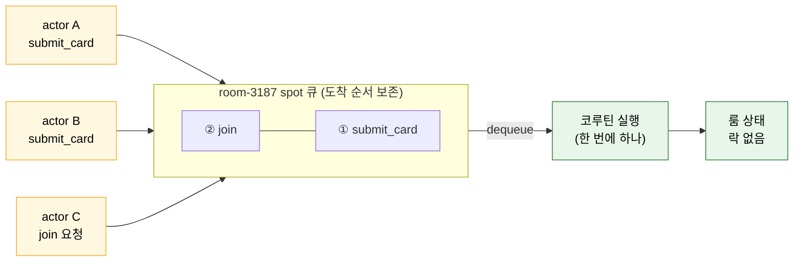
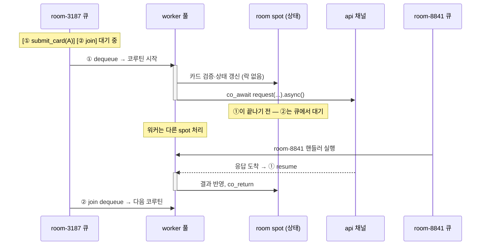

[← 목차](README.ko.md)

# 8. SPOT

## 현재 구현 기준

외부 channel에서 특정 Spot으로 send/request를 보낼 때는 framework가 core
`spot_route_bridge_t`를 내부에서 사용한다. 같은 프로세스에 RouteMesh와 SpotMesh가
있으면 framework가 자동으로 bridge를 붙인다. 사용자는 raw `DEALER`, `ROUTER`, `PUB`
socket을 `SpotNode`에 attach하지 않는다. Spot에서 외부 pub/sub channel로 publish할
때는 일반 channel publisher client를 주입해서 사용한다.

## 1. SPOT이 하는 일

SPOT은 room·stage·zone처럼 **"장소" 하나의 상태와 참가자를 묶는 실행 단위**다.
게임 룸 하나가 spot 인스턴스 하나다. actor([9장](09-actor-session.ko.md))가
spot에 입장(join)하고, spot 안에서 패킷을 처리하고, 토픽으로 알림을 받는다.

spot은 두 종류이며 **직렬화 범위가 다르다** — 이 차이가 상태 관리 방식을 결정한다.

| | `spot_t` (room spot) | `entry_spot_t` (entry spot) |
|--|--|--|
| 개수 | 상태 단위마다 1개 | 노드당 1개 |
| 직렬화 | **spot callback** — actor 패킷·join/leave는 단일 큐. timer는 예외([§5](#5-timer)) | **Entry Spot callback** — actor 패킷·join/leave는 Entry Spot 단일 큐. timer는 예외([§5](#5-timer)) |
| 공유 상태 접근 | spot 큐 안에서 락 없이 안전. timer tick은 자체 동기화 필요 | Entry Spot 큐 안에서 락 없이 안전. timer tick은 자체 동기화 필요 |
| 역할 | 도메인 상태 소유·처리 | 배정·매칭·할당 |

## 1.1 room spot 직렬화 — 큐 하나, 한 번에 하나

room spot(`spot_t`)으로 들어오는 actor 패킷과 join/leave callback은
**spot별 순서 보존 큐**로 모인다. 런타임은 큐에서 하나를 꺼내 핸들러를
**코루틴으로** 실행하고, 그 핸들러가 끝나야 다음 항목을 꺼낸다.
timer tick은 이 큐에 들어오지 않는다([§5](#5-timer)).



핸들러가 `co_await`로 다른 서버를 기다리는 동안에도 두 가지가 동시에 성립한다.

- **spot 관점** — 큐는 그 핸들러가 끝날 때까지 다음 항목을 꺼내지 않는다.
  suspend 지점에서도 다른 패킷이 끼어들지 않으므로 룸 상태는 안전하다.
- **스레드 관점** — suspend된 동안 worker 스레드는 풀로 돌아가 **다른 spot의**
  핸들러를 실행한다. 룸 하나가 외부 응답을 기다린다고 서버가 멈추지 않는다.



핸들러를 비동기로 쓰면서도 동기식 코드처럼 위에서 아래로 작성할 수 있는 이유는
[3장 §6.2](03-concepts.ko.md)의 실행 모델 그대로다 — spot은 거기에 "같은 룸은
절대 겹치지 않는다"는 직렬성 보장을 더한 것이다.

`async()`는 이 기본 serial 의미를 유지한다. 공용 상태를 await 전후로 이어 쓰는 handler는
`co_await call.async()`를 사용한다.

player 한 명의 admission/preflight처럼 await 전후에 actor-local 값과 reply 값만 쓰는
흐름에서는 `yield()`를 사용할 수 있다. `yield()`는 현재 mailbox turn을
반납하고, completion 뒤 같은 mailbox continuation으로 돌아온다. 같은 actor의 다음 packet은
continuation 뒤에 실행되지만, 다른 actor나 timer 작업은 그 사이에 실행될 수 있다.

Bingo C++ sample의 `match_bingo` 흐름은 API channel request와 room `join_spot(...)` 대기에
`yield()`를 사용한다. room list, match queue, lobby state 같은 공용 mutable state를
await 전후로 이어서 판단하는 handler에는 `yield()`를 쓰지 않는다. `thread_local`은
짧은 runtime lookup이나 logging context 용도로만 사용하고, turn이나 mailbox 소유권 저장소로
사용하지 않는다.

짧고 빠른 local 계산을 Spot 실행 큐 밖에서 처리해야 하면 `run_worker(...)`를
사용한다. worker 함수는 Spot 상태를 직접 만지지 않고, 완료 뒤 `co_await` 지점에서
다시 같은 Spot 실행 큐로 돌아와 상태를 갱신한다.

```cpp
auto score = co_await context
  .run_worker ([snapshot] { return calculate_score (snapshot); })
  .async ();
if (score) {
    current_score = score.value ();
}
```

## 2. 노드 선언

spot은 spot mesh(디스커버리 채널) 아래 노드로 선언한다. Bingo Play 서버의 실제
구성:

```cpp
options.add_spot_mesh ("bingo.room.discovery")
  .set_routing_id (topology.play_rid).enable_router (topology.play_spot_router_endpoint)
  .enable_pub_sub (topology.play_spot_endpoint)
  .add_entry_spot<bingo_entry_spot_t> ()
  .add_spot<bingo_room_spot_t> ("bingo.room");
```

| 빌더 | 의미 |
|------|------|
| `add_spot_mesh(name)` | 프로세스의 단일 spot 노드와 discovery view 선언 |
| `set_routing_id (rid)` | Spot node의 대표 routing id 지정 |
| `enable_router(endpoint)` | 노드 간 라우팅 수신 |
| `enable_pub_sub(endpoint)` | spot 토픽 pub/sub endpoint. framework가 대표 id에서 pub/sub 내부 id를 파생해 설정함 |
| `use_discovery(channel)` | registry 기반 노드 발견 ([11장](11-registry.ko.md)) — `add_spot_mesh()`에서는 기본으로 mesh 이름을 사용함 |
| `add_route_mesh(name)` | 같은 프로세스의 SpotMesh로 들어오는 외부 routed 호출 수신 ([7장 §7](07-channel-messaging.ko.md)) |
| channel `enable_client(...)` | spot 코드에서 쓸 외부 channel client 연결 |
| `add_entry_spot<T>()` | 입장 spot 등록 (노드당 1개) |
| `add_spot<T>(name)` | spot 타입 등록 |
| `add_actor_factory<F>(type)` | actor factory 등록 ([9장](09-actor-session.ko.md)) |
| `enable_actor_gateway()` | actor gateway 활성화 ([9장](09-actor-session.ko.md)) |

## 3. room spot 작성

`spot_t`를 상속하고 도메인 상태를 직접 소유한다. `configure()`에서
`add_actor_packet<&T::method>()`로 메서드를 actor 패킷 핸들러로 등록한다.
인스턴스는 **룸(게임)마다 하나**이며 수명은 룸과 같다.

```cpp
class bingo_room_spot_t : public zlink::framework::spot_t,
                           public bingo_room_game_t       // 도메인 상태 직접 소유
{
  public:
    void configure (zlink::framework::spot_context_t &context)
    {
        context.handlers ().add_actor_packet<&bingo_room_spot_t::submit_card> ();
    }

    // 시그니처: (const TActor&, const spot_actor_request_context_t&, const TReq&) → TRes
    submit_bingo_card_res_t
    submit_card (const player_actor_t &actor,
                 const zlink::framework::spot_actor_request_context_t &context,
                 const submit_bingo_card_req_t &request)
    {
        // bingo_room_game_t 멤버 접근 — 직렬 실행 보장, 락 불필요
        return bingo_room_game_t::submit_card (actor.actor.actor_id, request.card);
    }

    // 입장 수락/거부
    zlink::framework::spot_actor_join_response_t
    on_actor_join (const player_actor_t &actor, const zlink::framework::message_t &request)
    {
        auto join_request = request.decode<bingo_room_join_req_t> ();
        join (actor.actor.actor_id, join_request.display_name);
        return zlink::framework::spot_actor_join_response_t::accept (
          bingo_room_join_res_t{snapshot ()});
    }

    void on_actor_joined (const player_actor_t &actor) { /* 입장 완료 후 알림 */ }
    void onLeaveActor (const player_actor_t &actor) { leave (actor.actor.actor_id); }
};
```

수명주기 훅:

| 훅 | 시점 |
|----|------|
| `configure(context)` | spot 생성 시 — 핸들러/타이머 등록 |
| `on_actor_join(actor, msg)` | 입장 요청 — `accept(reply)`/`reject(reply)` 반환 |
| `on_actor_joined(actor)` | 입장 확정 후 |
| `onLeaveActor(actor)` | 퇴장 |

핸들러 메서드는 동기 반환 또는 `task_t<...>` 코루틴 둘 다 가능하다.
코루틴 중에도 spot 큐 직렬성은 유지된다([§1.1](#11-실행-컨텍스트-직렬화--큐-하나-한-번에-하나)).

노드 핸들러(채널·HTTP)와의 핵심 차이 — spot_t 메서드에는
`request_type`/`reply_type`/`topic_name`이 없고 `dependency_types` DI도 없다.
필요한 채널 client는 channel 선언의 `enable_client(...)`로 켜고, publisher는 노드 선언의
`enable_pub_sub(...)`로 Spot pub/sub 역할을 켜서 사용한다([§6](#6-spot에서-바깥으로-보내기)).

## 4. entry spot: 매칭과 룸 배정

entry spot은 룸에 들어가기 **전** 단계 — 매칭, 룸 생성/배정 — 를 담당한다.
`entry_spot_t`를 상속하며 **노드당 1개**만 생성된다.

entry spot의 actor 패킷도 Entry Spot 실행 큐에서 직렬로 처리된다. 같은 actor의
연속 요청 순서는 actor mailbox가 먼저 보존하고, 실제 application handler 실행은
Entry Spot 실행 줄에서 한 번에 하나씩 진행된다. 따라서 entry spot 안의 admission
상태는 handler 안에서 별도 lock 없이 갱신할 수 있다.

```cpp
class bingo_entry_spot_t : public zlink::framework::entry_spot_t
{
  public:
    void configure (zlink::framework::spot_context_t &context)
    {
        context.handlers ().add_actor_packet<&bingo_entry_spot_t::match_bingo> ();
    }

    match_bingo_res_t match_bingo (const player_actor_t &actor,
                                   zlink::framework::spot_actor_request_context_t &,
                                   const match_bingo_req_t &request)
    {
        const auto room_id = rooms.allocate (request.mode);
        return {room_id, rooms.get (room_id).snapshot ()};
    }

    bingo_room_allocator_t rooms;
};
```

room spot(`spot_t`)과의 차이:

| | entry spot (`entry_spot_t`) | room spot (`spot_t`) |
|--|--|--|
| 개수 | 노드당 1개 | 상태 단위마다 1개 |
| 역할 | 배정·매칭 (라우팅 전) | 도메인 상태 소유·처리 |
| 직렬화 범위 | actor 패킷·join/leave는 단일 큐. timer는 예외([§5](#5-timer)) | actor 패킷·join/leave는 단일 큐. timer는 예외([§5](#5-timer)) |
| 공유 상태 접근 | Entry Spot 큐 안에서 락 없이 안전. timer tick은 자체 동기화 필요 | spot 큐 안에서 락 없이 안전. timer tick은 자체 동기화 필요 |
| actor lifecycle | Entry Spot은 기본 accept. 훅 `onCreateActor(actor[, request])`/`on_actor_joined`/`onLeaveActor`/`onDisconnectActor` | `on_actor_join`으로 수락/거부 + lifecycle 훅 |

## 5. Timer

spot 안의 주기 작업은 `spot_context_t::add_timer<THandler>`로 등록한다.
`THandler` 타입은 timer 진단 이벤트에 남는 handler type으로 사용된다.

timer tick은 room spot과 entry spot 모두에서 spot 직렬 큐에 들어가지 않는다.
tick 처리 경로에서 spot 공유 상태에 접근할 때는 자체 동기화가 필요하다.

```cpp
struct draw_tick_timer_t {};

void configure (zlink::framework::spot_context_t &context)
{
    _draw_timer = context.add_timer<draw_tick_timer_t> (
      "draw-number", std::chrono::seconds (5),
      {.overrun_policy = zlink::framework::timer_overrun_policy_t::skip_late_ticks});
}
```

| `timer_overrun_policy_t` | 늦은 tick 처리 |
|--------------------------|----------------|
| `skip_late_ticks` (기본) | 늦은 tick은 건너뜀 (`timer_tick_t::skipped_ticks`로 보고) |
| `catch_up_bounded` | `max_catch_up_ticks`까지 따라잡기 |
| `delay_next_tick` | 다음 tick을 밀어서 간격 유지 |

`timer_t::cancel()`로 중지한다. tick 핸들러의 미처리 예외 정책은
`stop_on_unhandled_exception`으로 정한다. timer 이벤트는
[12장 모니터링](12-monitoring.ko.md)의 `add_spot_timer_events`로 관측한다.

## 6. spot에서 바깥으로 보내기

- client/server channel에 `enable_client(...)`를 설정하면 spot 코드에서 그
  채널로 request/send를 보낼 수 있다.
- `enable_pub_sub(...)`로 Spot topic publish 경로를 연다.
- local spot을 만들지 않는 노드에서 SPOT mesh로 publish하려면
  `spot_publisher_client_t`를 주입받아 `publish(channel, topic, event)`를 호출한다.
- 토픽 구독자(클라이언트)에게 가는 알림은 `enable_pub_sub` endpoint를 통해
  spot 토픽으로 발행된다.

## 7. Stage wrapper (playhouse Stage 류)

`playhouse` Stage 같은 상위 실행 모델을 SPOT 위에 올릴 수 있다. SPOT이 transport
바닥(노드 수명주기, spot_rid 생성/종료, publish/subscribe, attach client send/request,
timer 등록, 같은 Spot callback의 직렬 실행)을 제공하고, wrapper는 그 위에 membership 정책, broadcast
정책, 입장/권한, `stage_id → 주소` 조회를 얹는다. cpp framework 는 Stage wrapper 를
별도 타입으로 제공하지 않으므로 응용이 SPOT 위에 직접 구성한다.

## 8. 자주 막히는 곳

- **`publish`가 안 된다** → 노드에 `enable_pub_sub`가 없다.
- **routed 호출이 안 나간다** → 대상 이름이 RouteMesh인지, 같은 프로세스의 SpotMesh가
  router 역할을 켰는지, target ROUTER에 실제로 연결돼 있는지 확인한다([7장 §7](07-channel-messaging.ko.md)).
- **spot factory 타입 중복** → 같은 노드 안에서 같은 타입을 두 번 등록하면 시작 예외.
- **spot 상태에 lock을 걸어야 하나?** → actor 패킷·join/leave처럼 같은 spot 큐에서
  도는 callback끼리는 직렬 실행이라 불필요(§1.1). timer tick이나 외부에서
  `spot_rid`로 직접 접근하는 경로는 별도 동기화가 필요하다.
- **timer는 직렬 큐에 들어가나?** → room spot과 entry spot 모두 timer tick은 spot
  직렬화 경계 밖이라 공유 상태 접근 시 자체 동기화가 필요하다(§5).

## 9. 더 보기

- 인터페이스/계약 카탈로그: [13장 인터페이스 카탈로그](13-interface-catalog.ko.md)
- 실행 가능한 전체 예제(room/stage/zone): [14장 샘플 맵](14-samples-map.ko.md)
- spot 안의 참가자별 상태/세션이 필요하면: [9장 Actor · Session](09-actor-session.ko.md)

[다음: Actor · Session →](09-actor-session.ko.md)
