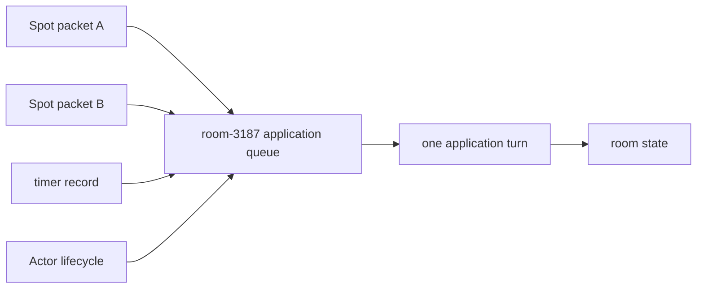

[← 목차](README.ko.md)

# 8. SPOT

SPOT은 RouteMesh의 MeshNode가 소유하는 상태 실행 단위다. Node·ChannelName·Spot·Actor
메시지는 같은 MeshNode에 속하므로 별도 Spot 전용 mesh나 bridge를 구성하지 않는다.
Application은 MeshName, ChannelName과 `RoutingId`를 사용하고 transport 배선은 framework에
맡긴다.

## 1. SPOT이 하는 일

SPOT은 room·stage·zone처럼 장소 하나의 상태와 참가자를 묶는다. 게임 룸 하나가
`spot_t` instance 하나다. Actor([9장](09-actor-session.ko.md))는 Spot에 join하고,
Spot lifecycle과 Actor payload는 각 owner의 직렬 실행 문맥에서 처리된다.

| 종류 | 개수 | 주된 책임 | 직렬 실행 owner |
|------|------|-----------|-----------------|
| `spot_t` | 상태 단위마다 하나 | 도메인 상태와 Spot packet·subscription 처리 | 각 Spot |
| `entry_spot_t` | MeshNode마다 하나 | Actor 생성 전 입장·배정과 lifecycle 처리 | Entry Spot lifecycle은 Entry Spot, Actor payload는 각 Actor |

### 1.1 room Spot 직렬화 — 큐 하나, 한 번에 하나

같은 Spot의 packet, lifecycle과 timer callback은 Spot application queue에서 순서대로
실행된다. 한 turn이 `async()`로 결과를 기다리면 continuation이 끝날 때까지 같은 Spot의
다음 application record를 실행하지 않는다. 서로 다른 Spot이나 Actor는 병렬로 실행할
수 있다.



`yield()`는 현재 turn을 반납한다. 대기 중 같은 owner의 다음 record가 상태를 바꿀 수
있으므로 await 전에 읽은 mutable 상태를 continuation에서 그대로 신뢰하면 안 된다.
공용 Spot 상태를 await 전후로 이어서 사용할 때는 `async()`를 사용한다.

짧은 CPU 계산을 Spot queue 밖에서 처리하려면 `run_cpu_worker(...)`를 사용한다. Worker는
Spot 상태를 직접 변경하지 않고 snapshot만 받으며 `std::stop_token`으로 cancellation
요청을 확인한다.

```cpp
auto score = co_await context
  .run_cpu_worker<std::optional<int>> ([snapshot] (std::stop_token stop) {
      if (stop.stop_requested ()) {
          return std::optional<int>{}; // cancellation 뒤 계산을 시작하지 않는다.
      }
      return std::optional<int>{calculate_score (snapshot)};
  })
  .async ();

if (score) {
    current_score = *score; // continuation에서 Spot 상태를 갱신한다.
}
```

## 2. MeshNode에 Spot 등록

Spot·Entry Spot·Actor factory는 owner MeshNode builder에 등록한다. `listen(...)`은
MeshNode endpoint를 열고 `set_routing_id(...)`는 이 node의 논리 주소를 정한다.
`channel_name(...)`은 같은 MeshName 안의 논리 membership을 추가한다. 수동 peer는
`peer_connections().connect(...)`로 등록하고, location store를 구성하면 같은 MeshName의
descriptor로 peer set을 갱신한다.

```cpp
auto mesh = options.add_route_mesh ("bingo.application")
  .listen (topology.play_router_endpoint)
  .set_routing_id (topology.play_rid);

mesh.channel_name ("bingo.room");
mesh.peer_connections ().connect (topology.peer_router_endpoint);
mesh.configure_spot_publisher ().no_drop = true;
mesh.add_entry_spot<bingo_entry_spot_t> ();
mesh.add_spot<bingo_room_spot_t> ("bingo.room");
mesh.add_actor_factory<player_actor_factory_t> ("player");
```

| 표면 | 의미 |
|------|------|
| `add_route_mesh(mesh_name)` | process-local MeshNode 등록 |
| `listen(endpoint)` / `set_routing_id(rid)` | 수신 endpoint와 node RID 설정 |
| `channel_name(channel_name)` | 논리 ChannelName membership 추가 |
| `peer_connections().connect(endpoint)` | 수동 MeshNode peer 등록 |
| `configure_spot_publisher().no_drop` | Logical Multicast admission 정책 설정 |
| `add_entry_spot<T>()` | MeshNode의 Entry Spot type 등록 |
| `add_spot<T>(spot_name)` | 생성 가능한 Spot type 등록 |
| `add_actor_factory<F>(actor_type)` | Actor factory 등록 |

MeshNode에는 ChannelName을 하나 이상 등록해야 한다. 같은 process에서 MeshName을 중복
등록하거나 동일 Spot 이름·Actor type을 중복 등록하면 startup이 실패한다.

## 3. room Spot 작성

`spot_t`를 상속하고 `configure(...)`에서 일반 Spot packet과 subscription handler를
등록한다. Actor payload handler는 Spot registry가 아니라 Actor의
`actor_context_t::handlers()`에 등록한다. Actor handler는 mutable Spot을 받지 않으며,
Spot 상태 변경이 필요하면 `spot_handle_t` direct call로 새 Spot turn을 제출한다.

```cpp
class bingo_room_spot_t : public zlink::framework::spot_t,
                          public bingo_room_t {
public:
    void configure (zlink::framework::spot_context_t &context)
    {
        context.handlers ().add_handler<&bingo_room_spot_t::reset_round> ();
        context.handlers ().add_subscribe<&bingo_room_spot_t::on_room_event> (
          "room.events");
    }

    void reset_round (const reset_round_t &request)
    {
        bingo_room_t::reset (request.round_id); // 같은 Spot turn에서 상태를 변경한다.
    }

    zlink::framework::spot_actor_join_response_t on_actor_join (
      const zlink::framework::actor_join_request_t &actor,
      const zlink::framework::message_t &request)
    {
        const auto join = request.decode<bingo_room_join_req_t> ();
        return actor.actor.empty () || join.display_name.empty ()
          ? zlink::framework::spot_actor_join_response_t{false, std::nullopt}
          : zlink::framework::spot_actor_join_response_t{true, std::nullopt};
    }

    void on_actor_joined (
      const zlink::framework::actor_membership_t &membership);
    void on_leave_actor (
      const zlink::framework::actor_membership_t &membership);
    void on_disconnect_actor (
      const zlink::framework::actor_membership_t &membership);
};

class player_actor_t : public zlink::framework::actor_t {
public:
    void configure (zlink::framework::actor_context_t &context)
    {
        context.handlers ().add_request<&player_actor_t::submit_card> ();
    }

    submit_bingo_card_res_t submit_card (
      const zlink::framework::spot_actor_request_context_t &context,
      const submit_bingo_card_req_t &request);
};
```

`on_actor_join(...)`은 immutable join request와 message를 검증해 accept 또는 reject를
반환한다. Accept된 membership을 commit한 뒤에만 `on_actor_joined(...)`가 실행된다.
Lifecycle은 registry 항목이 아니라 Spot member callback이다.

코루틴 중에도 같은 owner의 직렬성은 [§1.1](#11-room-spot-직렬화--큐-하나-한-번에-하나)을
따른다.

## 4. Entry Spot: 입장과 배정

`entry_spot_t`는 MeshNode마다 하나이며 Actor가 user Spot에 join하기 전의 입장·배정
정책을 처리한다. Entry Spot lifecycle callback은 Entry Spot queue에서 실행하지만 Actor
payload handler는 대상 Actor queue에서 실행된다. 따라서 Actor handler에서 여러 Actor가
공유하는 mutable 상태를 직접 변경하지 않는다.

```cpp
class bingo_entry_spot_t : public zlink::framework::entry_spot_t {
public:
    void configure (zlink::framework::spot_context_t &context)
    {
        context.handlers ().add_handler<&bingo_entry_spot_t::allocate_room> ();
    }

    room_allocated_t allocate_room (const allocate_room_t &request)
    {
        return allocator.allocate (request.mode); // Entry Spot turn에서 배정 상태를 변경한다.
    }

    bingo_room_allocator_t allocator;
};
```

Entry Spot에서 Actor를 제거할 때는 `entry_spot_context_t::destroy_actor(...)`를 사용한다.
Actor가 user Spot에 있으면 먼저 leave 또는 Entry Spot join을 완료해야 한다.

## 5. Timer

Spot timer는 network record와 같은 Spot application turn에서 callback을 실행한다. 같은
timer key를 다시 등록하면 이전 generation의 대기 record는 callback을 실행하지 않는다.
`cancel()`은 아직 시작하지 않은 callback을 막지만 이미 시작한 callback을 강제로
중단하지 않는다.

```cpp
struct draw_tick_timer_t {};

void configure (zlink::framework::spot_context_t &context)
{
    _draw_timer = context.add_timer<draw_tick_timer_t> (
      "draw-number", std::chrono::seconds (5),
      {.overrun_policy = zlink::framework::timer_overrun_policy_t::skip_late_ticks});
}
```

| `timer_overrun_policy_t` | 늦은 tick 처리 |
|--------------------------|----------------|
| `skip_late_ticks` | 늦은 tick을 건너뛴다 |
| `catch_up_bounded` | `max_catch_up_ticks` 상한 안에서 처리한다 |
| `delay_next_tick` | 다음 tick 시점을 늦춰 간격을 유지한다 |

Timer 상태는 [12장 모니터링](12-monitoring.ko.md)에서 관측한다.

## 6. Spot에서 바깥으로 보내기

Spot context는 owner MeshName을 이미 알고 있다.

- `send_to_spot(...)`와 `request_to_spot(...)`는 `spot_handle_t` 하나로 target을 지정한다.
- `publish(channel_name, topic, event)`는 owner MeshNode의 ChannelName에 Logical
  Multicast를 제출한다. 별도 PUB/SUB 역할을 구성하지 않는다.
- local Spot이 없는 process에서 같은 Logical Multicast를 제출하려면 DI의
  `spot_publisher_client_t`를 사용해 MeshName과 ChannelName을 함께 지정한다.
- 특정 Spot을 외부에서 호출할 때는 `spot_handle_resolver_t`로 `spot_handle_t`를 얻고
  `route_client_t::send_to_spot(...)` 또는 `request_to_spot(...)`에 넘긴다.

```cpp
auto result = co_await context
  .publish ("bingo.room", "room-3187", number_drawn_t{number})
  .async ();

auto external = co_await spot_publisher
  .publish ("bingo.application", "bingo.room", "room-3187",
            number_drawn_t{number})
  .async ();
```

Logical Multicast는 local matching queue와 remote MeshNode admission을 하나의 결과로
집계한다. 기본 `no_drop=true`에서는 모든 대상의 reserve가 성공해야 수락한다. 독립
classic fanout이 필요하면 `add_fanout_channel(...)`을 별도로 구성한다([7장 §6](07-channel-messaging.ko.md#6-fanout-publishsubscribe)).

## 7. Stage wrapper (playhouse Stage 류)

Stage 같은 상위 모델은 SPOT 위에 application 계층으로 구성할 수 있다. SPOT은 MeshNode
수명, Spot RID, owner turn, timer와 Logical Multicast를 제공하고 wrapper는 membership,
권한과 `stage_id` 조회 정책을 소유한다. C++ framework는 별도 Stage public type을
제공하지 않는다.

## 8. 자주 막히는 곳

- **Logical Multicast 대상이 없다** → owner MeshNode의 ChannelName membership과 peer
  admission, remote positive weight를 확인한다.
- **특정 Spot 호출이 실패한다** → resolver에 전달한 MeshName·Spot RID와 반환된
  `spot_handle_t`가 최신인지 확인한다.
- **Spot factory type이 중복된다** → 같은 MeshNode에 동일 Spot 이름을 한 번만 등록한다.
- **Spot 상태에 lock이 필요한가?** → 같은 Spot application turn끼리는 직렬이다.
  Worker나 다른 owner가 공유하는 상태는 별도 동기화하거나 Spot turn으로 제출한다.
- **Timer가 다른 Spot callback과 겹치는가?** → 같은 Spot에서는 겹치지 않는다. 서로
  다른 owner의 turn은 병렬로 실행할 수 있다.

## 9. 더 보기

- 인터페이스/계약 카탈로그: [13장 인터페이스 카탈로그](13-interface-catalog.ko.md)
- 실행 가능한 전체 예제: [14장 샘플 맵](14-samples-map.ko.md)
- 참가자별 상태와 session binding: [9장 Actor · Session](09-actor-session.ko.md)

[다음: Actor · Session →](09-actor-session.ko.md)
