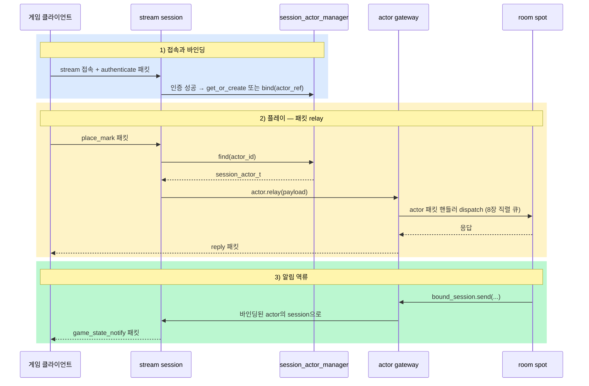

[← 목차](README.ko.md)

# 9. Actor · Session

## 1. actor가 하는 일

actor는 **접속한 사용자 한 명을 대표하는 객체**다. 클라이언트는
stream([10장](10-stream.ko.md))으로 게이트웨이 서버에 붙고, 인증을 거쳐 자신의
actor와 바인딩된다. 이후 클라이언트의 패킷은 actor를 통해 spot으로 relay되고,
spot의 알림은 역방향으로 클라이언트까지 흘러간다.



## 2. actor 타입과 factory

actor는 평범한 struct다. factory가 `create(actor_id)`로 만들어 준다.

```cpp
struct player_actor_t
{
    std::string actor_id;
    mutable zlink::framework::actor_ref_t actor_ref;

    void set_actor_ref (const zlink::framework::actor_ref_t &ref) const
    {
        actor_ref = ref;
    }
};

struct player_actor_factory_t
{
    player_actor_t create (std::string actor_id) const { return {std::move (actor_id)}; }
};
```

spot 노드에 factory를 등록한다.

```cpp
options.add_spot_mesh ("tictactoe.game.discovery")
  .add_node ("tictactoe.spot.node")
  // ...
  .add_actor_factory<player_actor_factory_t> ("player");   // actor type 이름
```

spot의 actor 패킷 핸들러([8장 §3](08-spot.ko.md))가 받는 첫 인자가 바로 이
actor 타입이다.

## 3. actor 생성/조회

인증 뒤에 session과 actor를 묶을 때는 `session_actor_manager_t`를 사용한다.
같은 stream node가 actor를 직접 만들 수 있으면 `get_or_create(actor_type, actor_id)`를
호출한다. 다른 서버가 이미 만든 actor 참조를 받아 바인딩해야 하면 `bind(actor_ref)`를
호출한다. C++ 공개 계약에는 별도 handler 명명 규칙이 없다.

```cpp
auto actor = _actors.get_or_create ("player", authenticated_actor_id);
if (!actor) {
    // actor 생성 실패나 gateway 구성 오류를 여기서 처리한다.
    co_return;
}
_bound_actor_id = std::string (actor.value ().actor_id ());
```

`bind(actor_ref)`를 쓰는 경우의 `actor_ref_t`는 `node_rid`, `actor_type`, `actor_id`,
`generation`을 담는다. `generation`은 재접속 뒤 이전 세대의 actor 참조가 더 이상
유효하지 않다는 것을 gateway가 구분하는 데 쓰인다.

## 4. session ↔ actor 바인딩

stream session([10장](10-stream.ko.md)) 쪽에서 `session_actor_manager_t`로
바인딩을 관리한다. 인증 성공 시 `get_or_create` 또는 `bind`, 연결 종료 시
`unbind_session`을 호출한다.

**중요**: 클라이언트가 끊겼을 때 actor 바인딩 해제와 spot 퇴장 처리는
**프레임워크가 자동으로 하지 않는다.** `on_disconnected` 안에서 애플리케이션
코드가 직접 `unbind_session()`을 호출해야 한다. SPOT에서의 퇴장 역시 마찬가지로
개발자가 결정하는 로직이다 — 예를 들어 재접속을 허용하는 설계라면 disconnection
시 spot에서 퇴장시키지 않고 actor를 유지할 수 있다.

```cpp
class play_session_t final : public zlink::framework::packet_stream_session_t
{
  public:
    using dependency_types =
      zlink::framework::dependency_list_t<zlink::framework::session_actor_manager_t,
                                          authenticate_play_session_handler_t>;
    // ...

    zlink::framework::task_t<void> on_packet (zlink::framework::stream_t &stream,
                                              const zlink::framework::stream_dispatch_context_t &dispatch,
                                              const zlink::message_t &payload) override
    {
        if (_authenticate.can_handle (dispatch)) {
            auto authenticated = co_await _authenticate.handle (_actors, stream, payload);
            auto actor = _actors.get_or_create ("player", std::string (authenticated.actor_id ()));
            if (!actor) {
                co_return;
            }
            _bound_actor_id = std::string (actor.value ().actor_id ());
            co_return;
        }

        auto actor = _actors.find (*_bound_actor_id);
        co_await actor.value ().relay (payload).async ();   // 현재 dispatch의 packet을 spot으로 전달
    }

    zlink::framework::task_t<void> on_disconnected (zlink::framework::stream_t &) override
    {
        if (_bound_actor_id) {
            // 자동 처리 아님 — 앱이 직접 호출해야 한다
            _actors.unbind_session (*_bound_actor_id);
        }
        // spot 퇴장(leave) 처리도 여기서 결정 — 재접속 허용 설계라면 생략 가능
    }
};
```

핵심 표면:

| API | 의미 |
|-----|------|
| `session_actor_manager_t::create(actor_type, actor_id[, create_request])` | 같은 stream node에서 actor handle 생성. `create_request`는 Entry Spot의 `onCreateActor(actor, createRequest)`로 전달된다 |
| `session_actor_manager_t::get_or_create(actor_type, actor_id[, create_request])` | 같은 stream node에서 actor 생성 또는 조회. 이미 있으면 새 `create_request`는 사용하지 않는다 |
| `session_actor_manager_t::bind(actor_ref)` | 이미 만들어진 actor 참조를 session actor로 바인딩 (`request_call_t<session_actor_t>`) |
| `session_actor_manager_t::find(actor_id)` | 바인딩된 actor 핸들 조회 (`std::optional<session_actor_t>`) |
| `session_actor_manager_t::unbind_session(actor_id)` | session-액터 바인딩 해제 |
| `session_actor_t::relay(payload).submit()` | 클라이언트 패킷을 actor가 입장한 spot으로 relay |

## 5. actor gateway

게이트웨이는 stream 노드와 spot 노드를 잇는 다리다. 양쪽에 한 줄씩 선언한다.

```cpp
// spot 노드 쪽 — actor 입장은 SpotNode와 route channel 설정으로 자동 연결된다
options.add_spot_mesh (...).add_node ("bingo.room.node")
  .add_entry_spot<bingo_entry_spot_t> ();

// stream 노드 쪽 — 이 stream의 session actor를 해당 spot 노드로 보낸다
options.add_stream_node ("tictactoe.stream")
  .bind (topology.stream_endpoint)
  .register_session<play_session_t> ()
```

게이트웨이가 켜지면: 클라이언트 패킷 → session relay → gateway → spot의 actor
패킷 핸들러 순으로 흐르고, spot이 `bound_session_t`로 보낸 패킷은 역경로로
클라이언트에 닿는다.
relay 계약의 세부(메타데이터 전파 정책 등)는 spec
[actor-gateway-session-relay](../../common/spec/languages/cpp/02-framework-interfaces.ko.md)가 다룬다.

## 6. 오류 처리

actor·session 경로의 실패도 채널과 같은 모델이다 — `co_await` 경로에서는
`framework_exception_t`(`kind()`/`is_retriable()`)로 던져지고, `result_t` 경로에서는
`error()`로 조회한다([3장 §6.2](03-concepts.ko.md)). 존재하지 않는 actor/spot 조회,
게이트웨이 미연결 같은 구성 오류는 시작 단계 또는 첫 호출에서 드러난다.

## 7. 더 보기

- 인터페이스/계약 카탈로그: [13장 인터페이스 카탈로그](13-interface-catalog.ko.md)
- 실행 가능한 전체 예제: [14장 샘플 맵](14-samples-map.ko.md)
- 외부 client 연결·session 수명 관리: [10장 Stream](10-stream.ko.md)
- spot 직렬 실행·room/entry 작성: [8장 SPOT](08-spot.ko.md)

[다음: Stream →](10-stream.ko.md)
