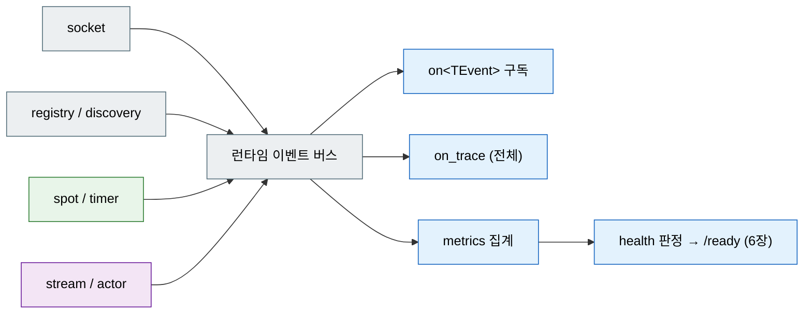

[← 목차](README.ko.md)

# 12. Monitoring

관측은 네 갈래다 — 로그, 런타임 이벤트, 메트릭, health. 각각 `app.logging()`,
`app.monitoring()`, `app.metrics()`, `app.health()`로 구성한다.

## 1. 로깅

```cpp
app.logging ().use_file ("match-api.log");
```

코드에서 로그를 남길 때는 `logger_t<TOwner>`를 DI로 받는다. 소유 타입이 로그
소스 이름이 된다.

```cpp
class create_game_http_handler_t
{
  public:
    using dependency_types =
      zlink::framework::dependency_list_t<
        zlink::framework::logger_t<create_game_http_handler_t>>;

    explicit create_game_http_handler_t (
      zlink::framework::logger_t<create_game_http_handler_t> &logger) : _logger (logger) {}

    reply_type handle (const request_type &request)
    {
        _logger.info ("http POST /games");
        // ...
    }
};
```

## 2. 런타임 이벤트

런타임 내부에서 일어나는 일(socket 연결, discovery 변화, spot 입퇴장, timer handler 실패/예외 후 정지 등)은 이벤트로 노출된다. 소스별로 켜고, typed 핸들러로 받는다.

```cpp
app.monitoring ()
  .add_socket_events ("match-api")
  .add_discovery_events ("match-api.discovery")
  .add_registry_events ("match-api", std::chrono::seconds (5))   // 수집 주기
  .add_spot_events ("match-api", std::chrono::seconds (5))
  .add_spot_timer_events ("match-api")
  .add_stream_events ("match-api")
  .add_actor_events ("match-api");

// typed 구독
app.monitoring ().on<zlink::framework::spot_event_payload_t> (
  [] (const zlink::framework::spot_event_payload_t &event) {
      if (event.event == zlink::framework::spot_event_kind_t::timer_handler_failed
          && event.timer_diagnostic) {
          alert ("spot timer failed: " + event.timer_diagnostic->timer_name
                 + " - " + event.timer_diagnostic->exception_message);
      }
  });

// 전체 trace (디버깅용)
app.monitoring ().on_trace ([] (const zlink::framework::runtime_event_base_t &event) {
    /* 모든 런타임 이벤트 */
});
```

| 소스 등록 | 내용 |
|-----------|------|
| `add_socket_events(name)` | connected/connection_ready/disconnected/handshake_failed/peer_admission_changed/closed |
| `add_discovery_events(name)` | discovery 변화 |
| `add_registry_events(name, interval)` | registry 상태·topology·서비스 요약 변화 |
| `add_spot_events(name, interval)` | spot 상태·peer·subject 변화 |
| `add_spot_timer_events(name)` | timer handler 실패와 예외 후 정지 |
| `add_stream_events(name)` | stream 연결/해제/transport 오류/handler 예외 |
| `add_actor_events(name)` | actor 바인딩/해제/relay 실패/session 해제 |

typed 구독에 쓰는 payload는 `socket_event_payload_t`,
`discovery_event_payload_t`, `registry_event_payload_t`, `spot_event_payload_t`,
`stream_event_payload_t`, `actor_event_payload_t`, `metric_event_payload_t`다.
timer 실패도 monitoring에서는 `spot_event_payload_t`로 들어오며,
`timer_tick_t`와 `timer_failure_event_t`는 timer 계약 타입이다.



## 3. health

health check를 등록하고, HTTP로 노출한다([6장 §3](06-http-hosting.ko.md)).

```cpp
app.health ()
  .add_zlink_runtime_check ()                 // 기본 이름 "zlink.runtime"
  .add_channel_check ("bingo.play")
  .add_registry_check ("bingo.registry")
  .add_stream_endpoint_check ("bingo.stream")
  .add_hosted_service_check ("bingo.worker");

app.add_zlink_framework ([&] (zlink::framework::zlink_framework_options_t &options) {
    options.http ()
      .listen ("http://0.0.0.0:8080")
      .map_health ("/healthz")
      .map_readiness ("/ready")
      .map_liveness ("/live");
});
```

```bash
$ curl -s http://127.0.0.1:8080/ready
{"status":"healthy","readiness":"healthy","liveness":"healthy"}
```

readiness가 unhealthy면 로드밸런서/오케스트레이터가 트래픽을 빼도록 연결하는
것이 운영 관례다.

check 상태는 `health_status_t::healthy`, `health_status_t::degraded`,
`health_status_t::unhealthy` 중 하나다. `set_status(name, status, message)`로 등록된
check의 현재 상태를 바꾸고, `report()`로 전체 `status`, `readiness`, `liveness`,
개별 `checks`를 읽는다. `ready()`와 `live()`는 각각 readiness/liveness가
`unhealthy`가 아닐 때 true를 반환한다.

## 4. 메트릭

```cpp
app.metrics ().add_runtime_metrics ();                      // 런타임 기본 메트릭
app.metrics ().record_runtime_metric ("games.active", 42.0,
                                      {{"region", "kr"}});  // (name, value, tags)
```

`record_runtime_metric`은 `metric_event_payload_t`를 monitoring state에 발행한다.
외부 수집기로 내보내려면 `app.monitoring().on<metric_event_payload_t>(...)` 또는
`on_trace(...)`에서 받아 전송한다.

## 5. 메시지 흐름 추적 (dispatch 관측)

런타임 이벤트(§2)가 socket/registry/spot **상태 변화**를 본다면, 메시지 흐름 추적은 한 메시지가
**도착했나 / 핸들러로 갔나 / 응답이 나갔나**를 dispatch 길목에서 표준 기능으로 찍는다(C++가
레퍼런스 구현). `corr=`로 grep 하면 한 요청의 생애주기가 노드 간으로 이어진다. 출력은 §1 로깅과
같은 `logger_t` 경로로 나간다.

```cpp
app.add_zlink_framework ([] (zlink::framework::zlink_framework_options_t &options) {
    options.configure_dispatch ()
      // off → errors_only(기본) → key_transitions → verbose → diagnostic
      .message_flow (zlink::framework::message_flow_log_mode_t::key_transitions)
      .trace_log_file ("logs/flow-api.log")   // 지정=전용 파일, 미지정=app.logging() 통합, 둘 다 없으면 std::clog
      .trace_label ("api");                   // 구조화 필드 label=
});

// 운영 중 켜고 끄기 (재시작 없이, 모든 surface 즉시 반영)
app.set_message_flow_mode (zlink::framework::message_flow_log_mode_t::key_transitions);
```

- 모드 게이팅: `dropped`·에러는 `errors_only` 이상, 성공 전이(`received`/`dispatched`/`replied`/
  `sent`/`reply_received`)는 `key_transitions` 이상. `off` 면 참조 기반 트레이서 + lazy 이벤트로
  옵션 복사·문자열 할당이 0이다(게이트 = 공유 atomic load 1회).
- 콜렉터/OTel 연동: `options.configure_dispatch().set_message_flow_observer(...)`(observer 또는
  `std::function`)로 구조화 이벤트를 받는다(앱 레이어). framework 는 OTel 에 의존하지 않는다.
- 정식 계약: [spec/cpp-monitoring §7](../../common/spec/languages/cpp/02-framework-interfaces.ko.md), 공통 의미:
  [공통 스펙 메시지 흐름 추적](../../common/spec/52-message-flow-tracing.ko.md).

## 6. 자주 막히는 곳

- **이벤트가 안 들어온다** → 해당 source의 등록(`add_socket_events` /
  `add_discovery_events` / `add_registry_events` / `add_spot_events` /
  `add_spot_timer_events` / `add_stream_events` / `add_actor_events`)을 안 했다(§2).
- **health가 항상 healthy** → check를 `add_*_check`로 등록하지 않았다(§3).
- **메트릭이 안 보인다** → `add_runtime_metrics()` 등록과 외부 수집기 `on<TEvent>`
  구독(`on<metric_event_payload_t>`)을 확인한다(§4).
- **이벤트 핸들러에서 블로킹** → 이벤트 콜백에서 무거운 동기 작업을 하면 관측
  경로가 막힌다. 집계·전송만 하고 무거운 일은 다른 경로로 넘긴다.

## 7. 더 보기

- 인터페이스/계약 카탈로그: [13장 인터페이스 카탈로그](13-interface-catalog.ko.md)
- registry 이벤트·health 연동: [11장 Registry](11-registry.ko.md)
- 실행 가능한 전체 예제: [14장 샘플 맵](14-samples-map.ko.md)

[다음: 인터페이스 카탈로그 →](13-interface-catalog.ko.md)
