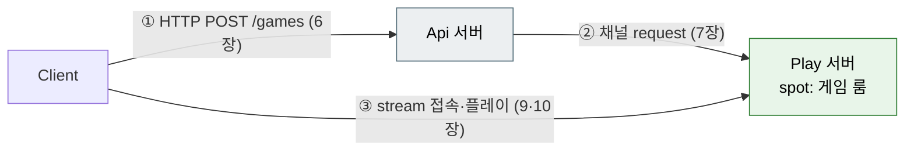
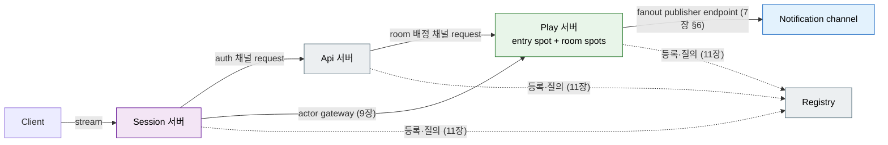

[← 목차](README.ko.md)

# 14. 샘플 지도

`samples/`는 [공통 샘플 시나리오](../../common/sample/README.ko.md) 정본을 cpp framework
구조로 구현한 묶음이다. 기능을 처음 붙일 때는 해당 샘플의 같은 자리를 먼저 본다.

> **샘플 패리티:** cpp는 정본 샘플 전체 — **TicTacToe · Bingo · SupportChat · DeliveryDispatch ·
> ShoppingMall · GameQuest** — 를 제공한다. TicTacToe·Bingo 가 토폴로지
> 기준(§2·§3)이고, 나머지는 §4에 요약하며, per-sample 동작은 각 샘플의 `README.ko.md` 와 공통
> 시나리오 정본이 소유한다.

## 1. 실행

```bash
# 전체 샘플 일괄 (빌드 후)
framework/languages/cpp/samples/run_samples.sh

# 개별 샘플 — 서버들 + 클라이언트 시나리오를 한 번에
framework/languages/cpp/samples/TicTacToe/run_sample.sh
framework/languages/cpp/samples/Bingo/run_sample.sh
```

각 샘플은 `Server/Configuration/`의 topology를 [5장](05-configuration.ko.md)
방식(CLI/env/JSON)으로 덮어쓸 수 있다.

## 2. TicTacToe — 기본 토폴로지

가장 작은 완전체. Api + Play 2개 서버와 stream 클라이언트.



| 위치 | 보여주는 것 | 장 |
|------|-------------|-----|
| `Server/Api/main.cpp` + `api_server_host_factory.hpp` | app 조립, HTTP `map_post`, 채널 client/server, codec 등록 | [2](02-getting-started.ko.md)·[7](07-channel-messaging.ko.md)·[6](06-http-hosting.ko.md) |
| `Server/Api/Handlers/create_game_http_handler.hpp` | 코루틴 핸들러 + `dependency_types` DI + `channel_client_t.request` | [3](03-concepts.ko.md)·[7 §3](07-channel-messaging.ko.md#3-클라이언트-쪽-channel_client_t) |
| `Server/Play/play_server_host_factory.hpp` | spot mesh + route mesh + stream node + actor gateway 전체 선언 | [7 §7](07-channel-messaging.ko.md#7-route-mesh-고급)·[8](08-spot.ko.md)·[10](10-stream.ko.md) |
| `Server/Play/Infrastructure/ZLink/Sessions/play_session.hpp` | stream session — 인증 → actor 바인딩 → relay | [9](09-actor-session.ko.md)·[10 §3](10-stream.ko.md#3-session-작성) |
| `Server/Play/Infrastructure/ZLink/Actors/player_actor.hpp` | actor struct + factory | [9 §2](09-actor-session.ko.md#2-actor-타입과-factory) |
| `Server/Configuration/` | `bind<T>` topology, 부트스트랩 로딩 순서 | [5](05-configuration.ko.md) |
| `Client/` | stream connector 사용, http_client로 게임 생성 | [10 §4](10-stream.ko.md#4-클라이언트-stream-connector) |

## 3. Bingo — registry 포함 확장 토폴로지

4개 서버(Api · Play · Session · Registry). Registry/Discovery가 channel provider endpoint를
전파하고, client role은 `enable_client()`로 discovery-backed 연결을 사용한다. fanout 채널
publisher endpoint와 protobuf codec도 함께 쓴다.



| 위치 | 보여주는 것 | 장 |
|------|-------------|-----|
| `Server/Registry/registry_host_factory.hpp` | `enable_registry(pub, router)` 한 줄 registry 서버 | [11 §2](11-registry.ko.md#2-registry-서버-띄우기) |
| `Server/Play/play_server_host_factory.hpp` | `use_discovery().add_registry_endpoint`, no-arg `enable_client()`, fanout publisher endpoint, protobuf codec, spot mesh | [7](07-channel-messaging.ko.md)·[8](08-spot.ko.md)·[11](11-registry.ko.md) |
| `Server/Play/Infrastructure/ZLink/Spots/bingo_entry_spot.hpp` | entry spot — 매칭/룸 배정 | [8 §4](08-spot.ko.md#4-entry-spot-매칭과-룸-배정) |
| `Server/Play/Infrastructure/ZLink/Spots/bingo_room_spot.hpp` | room spot — `add_actor_packet`, join 수락, 도메인 결합 | [8 §3](08-spot.ko.md#3-room-spot-작성) |
| `Server/Session/` | 세션 전담 서버 분리 — 인증과 actor 바인딩 | [9](09-actor-session.ko.md) |
| `Server/Api/Handlers/match_bingo_handler.hpp` | 매칭 요청 → Play 채널의 room 배정 요청 | [7 §3](07-channel-messaging.ko.md#3-클라이언트-쪽-channel_client_t) |

## 4. 그 외 정본 샘플

TicTacToe·Bingo 외 샘플은 공통 시나리오 정본을 cpp 구조로 옮긴 것이다. 서버 역할·메시지
이름·smoke 순서는 [공통 샘플 시나리오](../../common/sample/README.ko.md)를 따르고,
per-sample 동작은 각 샘플 `README.ko.md` 가 소유한다.

| 샘플 | 보여주는 것 | 코드 |
|------|-------------|------|
| SupportChat | 고객·상담원이 conversation spot에 참여, 메시지·typing·idle·close 상태 전이, 재접속 (Session/Api/Support/Registry) | [SupportChat/](../../../../languages/cpp/samples/SupportChat/README.ko.md) |
| DeliveryDispatch | 배달 생성 → courier 배정 → 픽업 → 완료 상태 전이, 재배정 timer | [DeliveryDispatch/](../../../../languages/cpp/samples/DeliveryDispatch/README.ko.md) |
| ShoppingMall | 주문 생성과 order workflow 상태 전이(결제 승인 → 재고 예약 → 주문 확정) | [ShoppingMall/](../../../../languages/cpp/samples/ShoppingMall/README.ko.md) |
| GameQuest | 플레이어 행동이 quest mission 진행도로 이어지는 흐름 | [GameQuest/](../../../../languages/cpp/samples/GameQuest/README.ko.md) |

## 5. 무엇을 어디서 베낄까

| 하고 싶은 것 | 베낄 자리 |
|--------------|-----------|
| 새 서버 프로세스 추가 | TicTacToe `Server/Api/main.cpp` + host factory 패턴 |
| HTTP 입구 + 내부 채널 위임 | TicTacToe `create_game_http_handler` |
| 게임 룸(상태 + 입퇴장 + 알림) | Bingo `bingo_room_spot` |
| 매칭/룸 배정 | Bingo `bingo_entry_spot` |
| 클라이언트 접속·인증·plays | TicTacToe `play_session` + `Client/` |
| Registry/Discovery 구성 확인 | Bingo의 discovery 구성 |
| 멀티 서버 기동 스크립트 | 각 샘플 `run_sample.sh` |

샘플 구조와 동작은 회귀 테스트(`test_cpp_framework_sample_parity`)가 고정하므로,
가이드·샘플·코드가 어긋나면 테스트가 먼저 알려 준다.

[← 목차](README.ko.md)
