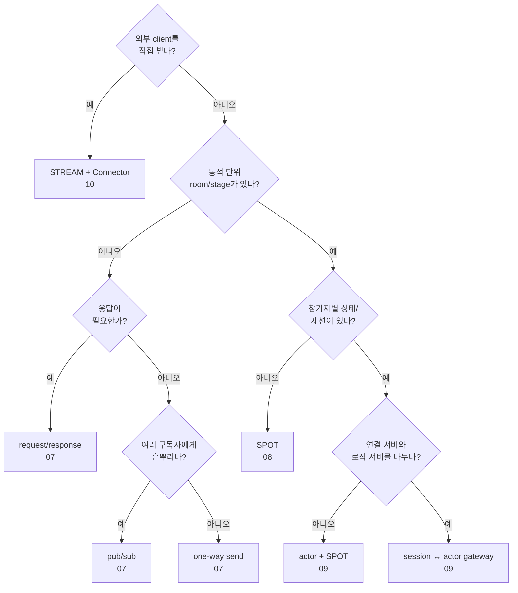

[← 목차](README.ko.md)

# 15. 기능 맵 — 무엇을, 얼마나 쉽게, 언제

> 각 기능의 사용법은 앞 챕터(7~12)가, 정식 계약은 spec 문서가 다룬다. 이 문서는
> 기능 선택을 돕는 지도다.

## 1. 난이도 기준

| 등급 | 의미 |
|------|------|
| **낮음** | handler 1개 + channel 등록 수준. 가이드만으로 도입 가능 |
| **중간** | lifecycle/factory/등록 조합을 이해해야 함 |
| **높음** | 분산 토폴로지·세션 라우팅 결정이 필요 |

## 2. 기능 × 난이도 × 언제 쓰나

| 기능 | 난이도 | 언제 쓰나 | 가이드 |
|------|:------:|-----------|--------|
| 서버 간 request/response | 낮음 | 서비스 A가 서비스 B의 결과가 필요할 때 | [7](07-channel-messaging.ko.md) |
| 서버 간 단방향 send | 낮음 | 응답 없는 작업 위임/통지 | [7](07-channel-messaging.ko.md) |
| pub/sub 이벤트 fan-out | 낮음 | domain event를 여러 구독자에게 전파 | [7 §6](07-channel-messaging.ko.md#6-fanout-publishsubscribe) |
| dealer mesh (수평 확장) | 중간 | 외부 LB 없이 같은 채널에 노드 추가·분산 | [7 §5](07-channel-messaging.ko.md#5-dealer-mesh-외부-로드밸런서-없이-수평-확장) |
| route mesh (주소 라우팅) | 높음 | routing id로 특정 노드 고정 라우팅(SPOT 백본) | [7 §7](07-channel-messaging.ko.md#7-route-mesh-고급) |
| SPOT(room/stage/zone) | 중간 | 동적 생성·소멸 논리 노드 단위 라우팅 | [8](08-spot.ko.md) |
| channel handler에서 target Spot 호출 | 중간 | HTTP/세션 gateway가 current Spot 없이 특정 Spot 호출 | [8 §6](08-spot.ko.md#6-spot에서-바깥으로-보내기) |
| Spot timer (게임 루프 등) | 중간 | 주기 tick, heartbeat, 정리 작업 | [8 §5](08-spot.ko.md#5-timer) |
| Stage wrapper | 중간 | `playhouse` Stage 류를 SPOT 위에 직접 얹을 때(전용 타입 없음) | [8 §7](08-spot.ko.md#7-stage-wrapper-playhouse-stage-류) |
| actor / Entry Spot | 높음 | session과 묶인 actor로 packet 자동 dispatch | [9](09-actor-session.ko.md) |
| session ↔ actor 바인딩·게이트웨이 | 높음 | 연결 서버와 로직 서버를 분리(재접속 이전성) | [9 §4–5](09-actor-session.ko.md#4-session-actor-바인딩) |
| STREAM session(서버) | 중간 | 외부 client(TCP/WS)를 framework로 받기 | [10](10-stream.ko.md) |
| Stream Connector(client) | 중간 | client 측에서 STREAM 서버에 접속 | [connector 가이드](../../../stream-connector/cpp/guide/INDEX.ko.md) |
| Registry topology 조회 | 중간 | 클러스터 topology snapshot/query | [11](11-registry.ko.md) |
| runtime monitoring | 낮음 | socket/registry/spot 이벤트·health·metric 관찰 | [12](12-monitoring.ko.md) |

## 3. 빠른 선택 가이드

- **서비스끼리 호출만** → request/response 또는 send. 난이도 낮음,
  [2장 Getting Started](02-getting-started.ko.md)로 충분.
- **이벤트를 흩뿌린다** → pub/sub.
- **처리량을 늘린다(같은 서비스 N개)** → dealer mesh.
- **방/판/존 같은 동적 단위** → SPOT. 그 안에 참가자별 상태/세션이 있으면 actor.
- **일반 handler에서 Spot 흐름으로** → actor 생성 또는 Entry Spot join으로 `actor_ref_t` 확보.
- **외부 게임/모바일 client** → STREAM(서버) + Stream Connector(client).
- **연결 서버와 로직 서버 분리(재접속 이전성)** → session ↔ actor 게이트웨이.

## 4. 기능을 실제로 보여 주는 샘플

cpp framework 가 정본 샘플 전체를 제공한다([14장 §1](14-samples-map.ko.md#1-실행)).

| 샘플 | 핵심 기능 묶음 | codec |
|------|----------------|:-----:|
| TicTacToe | route mesh, actor game join | MessagePack |
| Bingo | Registry/Discovery, Entry Spot, room Spot, bound push | Protobuf |
| SupportChat | Entry Spot, conversation Spot, idle/close timer, 재접속, bound push | JSON |
| DeliveryDispatch | channel + fanout, 재배정 timer, 고객 stream push | JSON |
| ShoppingMall | channel request, order workflow 상태 전이, event-sourcing/보상 | JSON |
| GameQuest | stateless API scale-out, owner routing, fanout + event sourcing | JSON |

## 5. 더 보기

- 핵심 개념: [3장 핵심 개념](03-concepts.ko.md)
- 모든 계약 인터페이스: [13장 인터페이스 카탈로그](13-interface-catalog.ko.md)
- 실행 가능한 전체 예제: [14장 샘플 맵](14-samples-map.ko.md)

[다음: 목차 →](README.ko.md)
