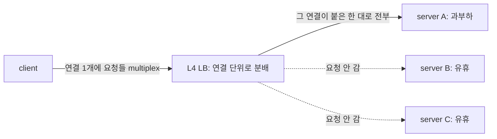
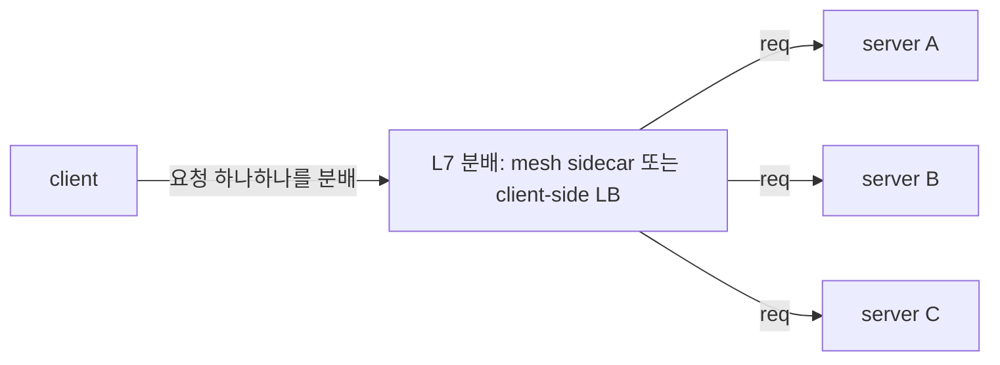

[← 목차](README.ko.md)

# 16. ZLink을 어디에 쓰나 — 내부 서비스 통신과 실시간 상태 서버 패턴

> ZLink은 단순 RPC 라이브러리가 아니라, C++ 백엔드에서 **논리 channel, 연결 수명,
> 동적 상태 노드(SPOT), pub/sub, discovery를 한 framework 안에서 묶어 주는 서버 간·
> 실시간 메시징 계층**이다. 특히 "서비스가 어디 떠 있는지", "client가 어디 붙어
> 있는지", "room/zone/symbol 같은 상태 단위를 어떻게 직렬 처리할지"가 **반복 문제로
> 나올 때** 효과가 크다.
>
> 이 챕터는 그 도입 판단을 돕는 문서다. 사용법 정식은 7~12 챕터가 다룬다.

## 1. 한눈에 보는 사용처

먼저 경계를 잡는다. **모노리스나 모듈러 모노리스로 충분하면 ZLink를 먼저 넣지
않는다.** 같은 프로세스 안의 모듈 호출은 함수 호출이면 되고, 서버 간 transport가
필요 없다. ZLink는 여러 프로세스/서버로 나뉘어야 하는 이유가 생겼을 때, 그 사이의
통신·연결·라우팅·상태 dispatch 복잡도를 줄이는 도구다.

| 상황 | ZLink이 좋은 이유 | 쓰는 기능 |
|------|--------------------|-----------|
| 내부 서비스끼리 자주 호출 | host/port/stub 대신 **channel name**으로 호출 | channel + Registry |
| 이벤트를 실시간으로 여러 서비스에 뿌림 | 별도 broker 없이 **transport fan-out** | fanout pub/sub |
| 게임 room·채팅 room·ride zone 같은 동적 상태 단위 | **단일 실행 큐**로 lock 없는 직렬 상태 처리 | SPOT |
| 모바일·게임 client와 장기 연결 | 연결 수명·framing·재접속 흐름을 framework가 소유 | STREAM |
| 연결 서버와 로직 서버를 분리 | actor id 기준 binding으로 **재접속 이전성** | session ↔ actor gateway |
| **서로 다른 언어로 구현된 서비스끼리 호출** | 언어 중립 wire protocol + codec 위 같은 channel 계약으로 **상호 호출** | cross-language binding |
| 초저지연 HFT·durable queue·외부 공개 API | **ZLink 주 영역 아님** | gRPC/REST/Kafka/FIX 유지 |

## 2. 무엇을 덜 고민하게 되나 — 개발 모델

ZLink의 체감 장점은 "인프라 박스가 빠진다"보다 **"개발자가 덜 고민한다"**에 있다.
응용은 도메인 단위(channel/spot/session)만 다루고, 나머지는 framework가 가져간다.

- **channel name만 알고 호출한다** — 대상 host/port/stub를 모른다.
- **service location과 peer 분배**는 Registry/Discovery가 맡는다.
- **request correlation과 reply 대기**는 framework가 맡는다.
- **client 연결 수명과 packet framing**은 STREAM이 맡는다.
- **room/zone/symbol 상태 직렬성**은 SPOT 실행 큐가 맡는다.
- **재접속 후 actor/session binding**은 framework가 이어 준다.

> ZLink은 이 문제들을 **없애는 게 아니라 호출자 밖으로 밀어낸다.** 위치·연결·
> correlation·dispatch 직렬성을 framework가 가져가므로, 응용 코드가 transport
> 배선이 아니라 **업무 흐름처럼** 보인다.

### 2.1 여러 언어가 한 channel 위에서 (cross-language)

ZLink은 C++ 전용이 아니다. 호출 계약이 **언어 중립 wire protocol(ZMP) +
codec(protobuf/json/messagepack) + 논리 channel/packet 이름**이라, 서로 다른 언어로
구현된 서비스가 **같은 channel 위에서 상호 호출**한다. 예를 들어 게임 시스템에서
**room 서버는 C++, API·매치메이킹 서버는 .NET 또는 Java**로 두고 같은 channel/spot
계약으로 메시징할 수 있다.

- 언어 간 계약 = **packet 이름 + codec으로 인코딩된 DTO**(교차 언어는 protobuf 권장).
  gRPC처럼 service-stub 코드 생성이나 HTTP/2를 강제하지 않는다 — payload 스키마만
  공유하면 된다.
- 각 언어 binding은 같은 core(C ABI, ZMP) 위에 handler/SPOT/STREAM 표면을 올린다.
  그래서 handler 작성 언어가 달라도 wire 상으로는 같은 channel·packet이다.

> **구현 상태(정직하게).** `.NET`이 reference 구현이고, **C++/Java/Node가 1차로
> 개발 중**, **Python/Go/Rust가 뒤따른다.** cross-language는 ZLink의 **설계 목표이자
> 진행 중인 로드맵**이다.

## 3. 이런 문제가 반복되면 ZLink 후보

기술명보다 **증상**으로 판단한다. 아래가 반복되면 ZLink가 후보다.

- 서비스마다 RPC stub·channel factory·deadline·discovery 설정이 반복된다.
- L4 로드밸런서로 부하가 고르게 안 퍼져 mesh를 고민한다.
- 게임 room·채팅 room·ride zone처럼 상태 단위를 lock으로 보호하고 있다.
- 재접속 때 client가 어느 서버에 붙어 있었는지 별도 저장소로 따로 관리한다.
- 실시간 이벤트 fan-out 때문에 broker를 쓰는데, 실제로는 replay가 필요 없다.
- 외부 client 연결·내부 서비스 호출·room 상태 처리가 서로 다른 framework로 흩어져 있다.

## 4. ZLink이 하지 않는 것 — 경계

장점이 선명하려면 경계도 분명해야 한다. 다음은 그대로 두는 게 맞다.

| 요구 | ZLink 판단 |
|------|------------|
| 외부 공개 HTTP API | REST/gRPC 유지 |
| durable queue·replay·consumer offset | Kafka/NATS 유지 |
| DB 조회·geo-index·audit trail | DB/Redis/event store 유지 |
| HFT 마이크로초 matching loop | Disruptor/Aeron/FIX 유지 |
| 내부 서비스 통신 + 실시간 상태 dispatch | **ZLink 적합** |

요지: ZLink은 transport·dispatch 계층이지 **datastore·durable log·HFT 버스가
아니다.** 분산 데이터 일관성(saga·outbox·idempotency)·영속·중복 제어 같은 도메인
난제는 그대로 응용/인프라가 진다.

## 5. 참고 — gRPC·service mesh 스택과의 비교

§1의 "내부 서비스끼리 자주 호출"이 왜 ZLink 후보인지, gRPC 스택과 비교해 근거를 본다.

### 5.1 gRPC는 혼자 끝나지 않는다

gRPC 자체는 빠르고 좋다. 문제는 이런 류의 서비스를 **"프로덕션급"**으로 만들려면
공식 베스트프랙티스가 곧바로 추가 인프라를 요구한다는 점이다.

- **channel/stub 재사용 강제.** 호출마다 channel을 만들면 지연이 크게 늘어 channel
  factory/pool로 수명을 직접 관리한다. ([grpc.io performance](https://grpc.io/docs/guides/performance/))
- **deadline을 매 호출에.** 단일 느린 RPC가 상위 서비스를 막지 않도록 deadline을 건다.
- **기본 로드밸런서(L4)로는 gRPC 부하가 고르게 안 흩어진다.**
  - **L4 로드밸런서**는 4계층(TCP)에서 **연결(connection) 단위**로 트래픽을 나눈다.
  - gRPC는 **HTTP/2** 위에서 **연결 하나를 오래 열어 둔 채** 여러 요청을 겹쳐 보낸다
    (multiplex). 그래서 L4 눈에는 **연결이 1개뿐**이라 그 연결이 붙은 **서버 한 대로
    요청이 쏠린다**.
  - 고르게 나누려면 **요청(request) 하나하나를 보고 분배**(L7)해야 한다. 그래서 보통
    client-side LB, headless service, 또는 Envoy/Istio sidecar를 추가로 끌어온다.
  ([Kubernetes 블로그](https://kubernetes.io/blog/2018/11/07/grpc-load-balancing-on-kubernetes-without-tears/))
- **그 밖에** service discovery(Consul/xDS), retry·hedging, `.proto` 파이프라인, mTLS,
  그리고 **이벤트 fan-out은 또 별도 broker**(Kafka/NATS)로 간다.

**L4는 "연결"을 나누고, L7은 "요청"을 나눈다.** gRPC는 연결 하나를 오래 유지하므로,
L7 분배 장치가 없으면 요청이 서버 한 대에 쏠린다.





ZLink의 **dealer mesh**는 이 L7 분배를 별도 sidecar 없이 framework가 직접 한다
([7장 §5](07-channel-messaging.ko.md#5-dealer-mesh-외부-로드밸런서-없이-수평-확장)).

### 5.2 배치 구조 비교

```text
[classic] gRPC + service mesh + broker + WS edge

  +------------------+          +------------------+
  | order-service    |          | payment-service  |
  | app + gRPC stub  |          | app + gRPC server|
  | Envoy sidecar    +--mTLS--->| Envoy sidecar    |
  +--------+---------+          +---------+--------+
           |                              |
           +-------------+----------------+
                         |
                +--------v---------+
                | mesh control     |
                | discovery + L7 LB|
                +------------------+
```

```text
[ZLink] ZLink Framework + Registry

  +------------------+          +------------------+
  | order-service    |          | payment-service  |
  | app              | channel  | app              |
  | ZLink Framework  +--------->| ZLink Framework  |
  | channel client   | name     | channel server   |
  +--------+---------+          +---------+--------+
           |                              |
           +-------------+----------------+
                         |
                +--------v---------+
                | Registry         |
                | discovery view   |
                +------------------+
```

Envoy sidecar와 mesh control plane(discovery·L7 LB·mTLS) 자리가 framework와 Registry
한 겹으로 들어온다. broker와 WS edge는 요구가 단순한 실시간 전파·연결 수용이면
fanout channel·STREAM으로 흡수할 수 있고, 영속 큐·replay나 HTTP edge 정책이 필요하면
그대로 둔다.

### 5.3 접히는 항목 요약 (cpp 표면)

| gRPC 베스트프랙티스/필요 인프라 | ZLink(cpp)에서 | 비고 |
|----------------------------------|------------|------|
| "stub/channel을 재사용하라" | `channel_client_t`가 DI 주입, socket 수명은 framework | 호출마다 만들 일 없음 |
| RPC deadline | `request(...).timeout(...).async<TReply>()` | reply 대기 시간 |
| L7 로드밸런싱(Envoy/Istio) | dealer mesh + discovery 모드 `enable_client()`가 peer 분배 | sidecar 불필요([7 §5](07-channel-messaging.ko.md#5-dealer-mesh-외부-로드밸런서-없이-수평-확장)) |
| service discovery(Consul/xDS) | `use_discovery().add_registry_endpoint(...)` + Registry | [11장](11-registry.ko.md) |
| interceptor | handler filter(`invoke(...)`) | [7 §4](07-channel-messaging.ko.md#4-filter--공통-처리) |
| 이벤트 broker(Kafka/NATS) | fanout channel pub/sub | 실시간 fan-out 한정. 영속/replay는 broker 유지 |
| 통합 관측(mesh telemetry) | runtime monitoring 이벤트 | [12장](12-monitoring.ko.md) |
| 양방향 streaming | STREAM session | 외부 client 수용. HTTP edge 정책은 별도 |

## 6. 더 보기

- 기능 선택 지도: [15장 기능 맵](15-feature-map.ko.md)
- 표면 매핑·계약: [7 §1](07-channel-messaging.ko.md#1-채널이-하는-일), [13장 인터페이스 카탈로그](13-interface-catalog.ko.md)
- 실행 가능한 전체 예제: [14장 샘플 맵](14-samples-map.ko.md)

### 참고 자료

- gRPC Performance Best Practices — https://grpc.io/docs/guides/performance/
- gRPC Load Balancing on Kubernetes without Tears — https://kubernetes.io/blog/2018/11/07/grpc-load-balancing-on-kubernetes-without-tears/

[다음: 목차 →](README.ko.md)
