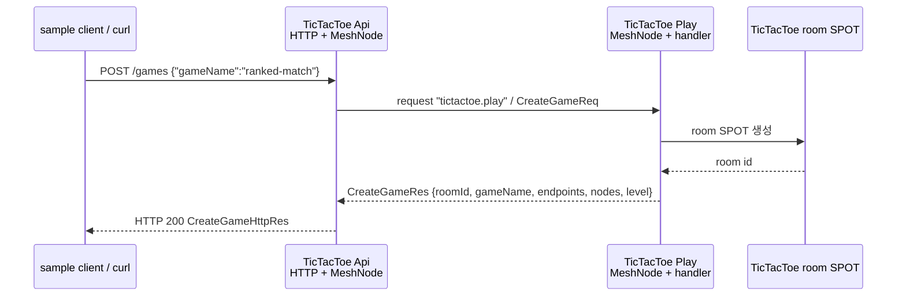

<!-- framework-adapter-nav:start -->
[가이드 홈](../../../index.ko.md) | [이전: 1. 개요](01-overview.ko.md) | [다음: 3. 핵심 개념](../../../common/guide/server/03-concepts.ko.md)
<!-- framework-adapter-nav:end -->

# 2. 시작하기

> 이 장이 따라가는 코드는 저장소의 `framework/languages/cpp/samples/TicTacToe`다.
> 빌드 연동과 옵션의 정식 계약은 [C++ configuration과 host 공개 계약](../../../common/spec/server/languages/cpp/interfaces/02-configuration-host.ko.md)이 다룬다.

이 장은 실제 `samples/TicTacToe`의 첫 흐름만 따라간다. 전체 게임 규칙을 설명하지
않고, 외부 클라이언트가 `POST /games`를 호출했을 때 API 서버가 Play 서버로 서버 간
channel request를 보내는 부분만 본다.

여기서 확인하는 것은 세 가지다.

- HTTP endpoint는 외부 요청을 받는 진입점이다.
- `request_client_t`는 다른 MeshNode의 channel handler로 request를 보낸다.
- 처음에는 location store 없이 manual peer endpoint를 직접 지정한다.

## 1. 실제 샘플 위치

| 역할 | 실제 파일 |
|------|-----------|
| 실행 스크립트 | `framework/languages/cpp/samples/TicTacToe/run_sample.sh` |
| API 서버 조립 | `Server/Api/api_server_host_factory.hpp` |
| HTTP handler | `Server/Api/Handlers/create_game_http_handler.hpp` |
| Play 서버 조립 | `Server/Play/play_server_host_factory.hpp` |
| channel handler | `Server/Play/Infrastructure/ZLink/Handlers/create_game_handler.hpp` |
| 메시지 계약 | `Shared/Contracts/messages.hpp` |

빌드 산출물 이름은 `sample_cpp_framework_tictactoe_api`,
`sample_cpp_framework_tictactoe_play`, `sample_cpp_framework_tictactoe_client`다.

## 2. 첫 요청 흐름



첫 단계에서는 API MeshNode가 `peer_connections().connect(...)`에 Play MeshNode endpoint를
등록한다. 두 node는 같은 MeshName과 ChannelName membership을 사용한다.

## 3. 메시지 계약

실제 샘플의 메시지는 `Shared/Contracts/messages.hpp`에 있다.

```cpp
struct create_game_http_req_t
{
    static constexpr const char *packet_name = "CreateGameHttpReq";
    std::string game_name;
};

struct create_game_http_res_t
{
    static constexpr const char *packet_name = "CreateGameHttpRes";
    std::string room_id;
    std::string game_name;
    std::string owner_play_endpoint;
    std::vector<std::string> play_endpoints;
    std::vector<play_node_info_t> play_nodes;
    int required_level = 0;
};

struct create_game_req_t
{
    static constexpr const char *packet_name = "CreateGameReq";
    std::string game_name;
};

struct create_game_res_t
{
    static constexpr const char *packet_name = "CreateGameRes";
    std::string room_id;
    std::string game_name;
    std::string owner_play_endpoint;
    std::vector<std::string> play_endpoints;
    std::vector<play_node_info_t> play_nodes;
    int required_level = 0;
};
```

HTTP DTO와 channel DTO를 분리해 둔 점이 중요하다. 지금은 필드가 비슷하지만, 외부 HTTP
계약과 서버 간 계약은 나중에 따로 바뀔 수 있다.

## 4. API 서버: HTTP endpoint에서 channel request 보내기

API 서버는 HTTP route와 process-local MeshNode를 함께 등록한다.

```cpp
options.http ()
  .listen (topology.api_http_endpoint)
  .map_post<create_game_http_handler_t> ("/games");

auto mesh = options.add_route_mesh (sample_names_t::application_mesh)
  .listen (topology.api_router_endpoint)
  .set_routing_id (topology.api_rid);
mesh.channel_name (sample_names_t::play_channel);
mesh.peer_connections ().connect (topology.play_router_endpoint);
```

`sample_names_t::play_channel` 값은 `"tictactoe.play"`다. Manual peer 구성에서는 API
서버가 Play MeshNode endpoint를 설정으로 알고 시작한다.

HTTP handler는 `request_client_t`를 DI로 받고, `CreateGameReq`를 Play channel로 보낸다.

```cpp
class create_game_http_handler_t
{
  public:
    using request_type = create_game_http_req_t;
    using reply_type = create_game_http_res_t;
    using dependency_types =
      zlink::framework::dependency_list_t<zlink::framework::request_client_t>;
    static constexpr const char *topic_name = "CreateGame";

    explicit create_game_http_handler_t (zlink::framework::request_client_t &client) :
        _client (client) {}

    zlink::framework::task_t<create_game_http_res_t>
    handle (const create_game_http_req_t &request)
    {
        auto room = co_await _client
                      .request ("tictactoe.application", sample_names_t::play_channel,
                                create_game_req_t{request.game_name})
                      .submit<create_game_res_t> ();
        co_return create_game_http_res_t{room.room_id,
                                         room.game_name,
                                         room.owner_play_endpoint,
                                         room.play_endpoints,
                                         room.play_nodes,
                                         room.required_level};
    }

  private:
    zlink::framework::request_client_t &_client;
};
```

핵심은 HTTP handler가 직접 게임 룸을 만들지 않는다는 것이다. HTTP는 진입점이고,
도메인 처리는 Play 서버 channel handler로 위임한다.

## 5. Play 서버: channel handler 노출하기

Play 서버는 같은 MeshName으로 MeshNode를 등록하고 `tictactoe.play` ChannelName에
handler group `"play"`를 연결한다.

```cpp
auto mesh = options.add_route_mesh (sample_names_t::application_mesh)
  .listen (topology.play_router_endpoint)
  .set_routing_id (topology.play_rid);
mesh.channel_name (sample_names_t::play_channel)
  .use_handler_group ("play");

options.handlers ()
  .group ("play")
  .add<create_game_handler_t> ()
  .add<ensure_player_actor_handler_t> ();
```

`create_game_handler_t`는 `CreateGameReq`를 받아 room id, game name, owner Play stream
endpoint, 참가 가능한 Play stream endpoint 목록, Play node 목록, 요구 level을 돌려준다.
실제 구현은 room SPOT을 만들기 때문에 [8장 SPOT](../../../common/guide/server/06-spot.ko.md)에서 다시 이어진다.

```cpp
class create_game_handler_t
{
  public:
    using request_type = create_game_req_t;
    using reply_type = create_game_res_t;
    static constexpr const char *topic_name = "CreateGame";
    // 생성자에서 room 생성 서비스(_creator)와 sample_topology_t(_topology)를
    // dependency_types + 생성자 주입으로 받는다 (지면상 생략).

    create_game_res_t handle (const create_game_req_t &request)
    {
        auto response = _creator.create (request.game_name);
        // 실제 샘플은 여기서 TicTacToe room SPOT을 만든다.
        return response;
    }
};
```

## 6. 실행과 확인

전체 샘플은 스크립트로 실행한다.

```bash
$ framework/languages/cpp/samples/TicTacToe/run_sample.sh
```

스크립트는 Play 서버와 API 서버를 띄운 뒤 sample client를 실행한다. 첫 단계에서 sample
client는 API 서버에 `POST /games`를 보내고, 이어서 반환된 `owner_play_endpoint`와
`play_endpoints`로 STREAM 접속을 진행한다. 이 장은 그중 `POST /games`에서 `CreateGameReq`로
이어지는 부분만 설명한다.

## 7. 자동 연결 — location store

수동 `peer_connections().connect(...)` 대신 location store를 등록하면 framework가 같은
MeshName의 descriptor를 조회해 peer set을 갱신한다. Application request는 계속
MeshName과 ChannelName만 사용하며 store endpoint나 remote address를 호출마다 넘기지
않는다.

```cpp
options.add_location_store (
  std::make_shared<zlink::framework::redis_location_store_t> (redis_options));
```

MeshNode는 자기 RID, endpoint와 ChannelName membership을 store에 기록한다. 다른
MeshNode는 revision이 바뀌면 peer intent를 갱신한다. 실제 request/reply payload는
location store를 통과하지 않는다. Store 장애와 readiness, descriptor lifecycle은
[11장 location store](../../../common/guide/server/10-location.ko.md)에서 다룬다.

## 8. 잘 안 될 때

| 증상 | 점검 |
|------|------|
| API가 Play로 요청하지 못한다 | 두 MeshNode의 MeshName·ChannelName과 manual peer endpoint를 확인 |
| HTTP 요청이 실패한다 | API 서버의 `topology.api_http_endpoint`와 호출 URL이 같은지 확인 |
| 시작 시 예외 | MeshName 중복, ChannelName 누락, handler group과 RID 설정을 확인 |
| 전체 샘플 실패 | `run_sample.sh`는 임시 디렉터리(`mktemp -d`)에 `play.log`·`api.log`·`client.log`를 남기고, 클라이언트 실패 시 그 로그 내용을 stderr로 출력한다 — 그 출력을 확인 |

## 9. 다음 단계

| 하고 싶은 것 | 가는 곳 |
|--------------|---------|
| framework의 핵심 개념 정리 | [3장 핵심 개념](../../../common/guide/server/03-concepts.ko.md) |
| 설정 파일과 command line으로 endpoint를 바꾸기 | [5장 Configuration](19-configuration.ko.md) |
| request/send/pub-sub 전체 사용법 | [7장 채널 메시징](../../../common/guide/server/05-channel-messaging.ko.md) |
| room/stage 같은 동적 노드 | [8장 SPOT](../../../common/guide/server/06-spot.ko.md) |
| location store 운영과 topology 조회 | [11장 location store](../../../common/guide/server/10-location.ko.md) |
| 실행 가능한 전체 예제 | `samples/TicTacToe`와 `run_sample.sh` |

## 10. 관련 문서

- 정식 계약: [C++ configuration과 host 공개 계약](../../../common/spec/server/languages/cpp/interfaces/02-configuration-host.ko.md)
- 다음 장: [3. 핵심 개념](../../../common/guide/server/03-concepts.ko.md)
- C++ 실행 모델: [21. 실행·구성 모델](21-execution-model.ko.md)
- 샘플 전체: [14. 샘플 고르기](../../../common/guide/server/14-samples.ko.md)
