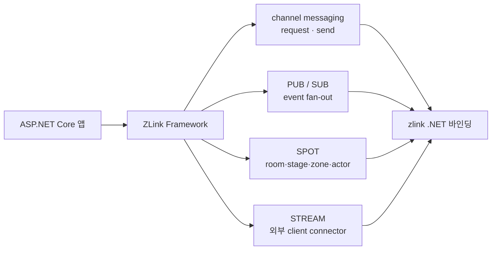

<!-- framework-adapter-nav:start -->
[문서 목록](../../../README.ko.md) | [이전: ZLink Framework for .NET](../README.ko.md) | [다음: Getting Started](02-getting-started.ko.md)
<!-- framework-adapter-nav:end -->

# 1. ZLink Framework for .NET — 개요

> 이 문서는 `.NET` 가이드의 진입점이다. 가이드는 `ASP.NET Core` 개발자가
> ZLink Framework 의 기능을 **읽고 바로 따라 쓸 수 있도록** 개념과 사용법을
> 직접 설명한다. 개념의 **언어 중립 정식 정의**는 [공통 스펙
> 개요](../../common/spec/overview.ko.md)가, `.NET` 표면의 **정식 계약**은
> [spec/](../spec/handler-interfaces.ko.md) 문서가 다룬다. 두 표기가 어긋나면
> spec 이 우선이다.

## 1. 한 줄 정의

`ZLink Framework for .NET`은 zlink `.NET` 바인딩 위에 올라가, 별도 **gateway 나
전용 로드밸런서 없이** 논리 `channel name` 기준의 서버 간 호출, pub/sub, `SPOT`,
`STREAM`을 `ASP.NET Core`의 DI 와 hosted service 모델 안에서 쓰게 해 주는 상위
계층이다.

핵심은 "raw socket 과 low-level discovery 를 직접 다루지 않는다"는 것이다.
개발자는 HTTP/gRPC 를 쓰던 감각으로 **handler, client, filter** 를 작성하고,
연결·발견·라우팅·재연결·correlation 은 framework 가 처리한다. HTTP middleware 는
HTTP pipeline 전용이므로, ZLink handler 앞뒤의 로깅·검증·권한 확인·메트릭 기록은
`IZLinkHandlerFilter` 로 분리한다.

> **ZLink 은 다국어 framework 다.** 호출 계약이 언어 중립 wire protocol(ZMP) +
> codec + 논리 channel/packet 이라, 서로 다른 언어로 구현된 서비스가 같은 channel
> 위에서 상호 호출한다(예: room 서버 C++, API 서버 .NET·Java). 이 가이드는 `.NET`
> binding 기준이며 `.NET` 구현을 reference 로 삼는다. 다른 언어로 구현된 서비스도
> 같은 channel 계약 위에서 함께 통신한다. 자세한 cross-language 모델은
> [13-grpc-alternative §2.1](13-grpc-alternative.ko.md)이 다룬다.

### 어떤 문제를 푸는가

ASP.NET Core 서비스가 서로 통신할 때 흔히 드는 비용은 다음과 같다.

- 서비스마다 주소·포트를 알아야 하고, 앞단에 gateway 나 로드밸런서를 둔다.
- 메시징 라이브러리를 쓰면 socket·endpoint·재연결·discovery 를 앱이 직접 관리한다.
- 요청/응답, 단방향 전송, 이벤트 fan-out 마다 다른 코드 경로가 생긴다.
- 로깅·검증·권한 확인 같은 공통 처리가 HTTP middleware 와 handler 코드 사이에 흩어진다.
- 게임 room/stage 같은 동적 단위를 다루려면 라우팅과 세션 관리를 또 따로 짠다.

ZLink Framework 는 이 모든 호출의 단위를 **논리 `channel name` 하나**로 좁힌다.
응용은 "`order` channel 로 요청을 보낸다"만 알면 되고, 그 channel 이 어디에 몇 개
떠 있는지는 channel 별 `Discovery`가 숨긴다.

서버 하나를 만들 때 직접 작성해야 했던 것들을 framework 가 처리한다.

| 직접 만들어야 했던 것 | framework 가 처리하는 방식 |
|-----------------------|----------------------------|
| socket 생성·bind·connect 관리 | channel/stream 이름과 역할로 선언하면 hosted service가 연결 |
| 메시지 직렬화·역직렬화 | codec 등록과 handler 계약으로 DTO를 그대로 주고받음 |
| 요청 routing·dispatch | handler group 또는 typed handler 등록으로 메시지가 자동으로 찾아옴 |
| 로깅·검증·권한 확인 같은 공통 처리 반복 | HTTP route는 middleware, ZLink handler는 `IZLinkHandlerFilter`로 분리 |
| 동시 요청의 상태 보호 | SPOT의 직렬 실행으로 lock 없이 상태 관리 |
| 서비스 생성·의존성 관리 | ASP.NET Core DI에서 handler, client, filter를 resolve |
| 서버 주소 관리·연결 해석 | Registry / Discovery로 endpoint 자동 연결 |
| 설정·로그·모니터링 | ASP.NET Core 설정·logging·hosted service와 통합 |

### 기존 방식 대비 (체감 난이도)

같은 "서버 간 요청/응답"을 붙이는 코드량 차이다.

**raw 바인딩으로 직접 (개념적):**

```csharp
// discovery 구성, dealer socket 생성, endpoint 연결, 재연결 관리,
// correlation id 매칭, 직렬화, 수신 루프 ... 수십 줄의 배선 코드
```

**ZLink Framework:**

```csharp
// 서버: handler 하나
public sealed class GetPriceHandler
    : IZLinkRequestHandler<PriceRequest, PriceReply>
{
    public ValueTask<PriceReply> HandleAsync(
        PriceRequest request, ZLinkRequestContext context, CancellationToken ct)
        => ValueTask.FromResult(new PriceReply(request.Symbol, 187.42m));   // 187.42m 은 데모용 고정값(실제론 조회 결과)
}

// 등록 — 채널 선언 → 서버 활성화 → handler 등록이 한 channel 빌더에 묶인다(이게 "한 줄짜리 channel 등록").
builder.Services.AddZLinkFramework(options =>
{
    {
        var channel =     options.AddClientServerChannel("price"); // channel 이름 선언
                channel.EnableServer("tcp://0.0.0.0:7301");        // 이 channel 의 server 역할 활성화(수신 endpoint)
        channel.AddRequestHandler<GetPriceHandler>();              // 그 server 가 부를 handler 등록

    }
});

// 클라이언트: IZLinkChannelClient 를 주입받아 호출한다. builder(RequestToChannel = 요청 구성) +
// 종결자(.Async<TReply> = 실제 송신하고 reply 도착까지 대기)의 2단계다.
var reply = await client
    .RequestToChannel("price", new PriceRequest("AAPL"))   // builder: 어느 channel 에 무슨 요청을
    .Async<PriceReply>(ct);                                // 종결자: reply 타입 지정 + 송신·대기
```

배선 코드가 사라지고 남는 것은 handler 와 한 줄짜리 channel 등록뿐이다.

### 아키텍처 — 어디에 올라가는가

```
+-----------------------------------------------------------+
|  ASP.NET Core app (DI, hosted service, handler)           |
+-----------------------------------------------------------+
|  ZLink Framework for .NET (adapter surface)               |
|   - channel messaging  - SPOT/actor  - STREAM session     |
|   - registry/monitoring integration                       |
+-----------------------------------------------------------+
|  zlink .NET binding (DealerSocket, RouterSocket, Spot,    |
|   SpotNode, Registry, Discovery ...)                      |
+-----------------------------------------------------------+
|  zlink core (C API) - transport, ZMP, I/O threads         |
+-----------------------------------------------------------+
```

Framework 는 새 transport 나 새 socket 의미를 만들지 않는다. 기존 바인딩
기능을 **DI · hosted service · handler · attribute** 모델로 감싸 노출할 뿐이다.
backend 의존 기준은
[internals/backend-dependency-policy](../internals/backend-dependency-policy.ko.md)
가 소유한다.

## 2. 개념 요약

이 framework 의 기능 단위들이다. 각각 전용 장에서 상세히 다룬다.

### DI 컨테이너 — ASP.NET Core 서비스 의존성 사용

`AddZLinkFramework(...)` 안에서 등록한 handler, client, filter는 ASP.NET Core DI와
같은 컨테이너에서 만들어진다. 사용자는 handler 생성자에 필요한 서비스를 선언하고,
framework 는 dispatch 시점에 필요한 객체를 resolve한다.

[3장 →](03-concepts.ko.md)

### Configuration — ASP.NET Core 설정과 함께 사용

Framework 설정은 `AddZLinkFramework(options => ...)`에서 channel, discovery, codec,
SPOT, STREAM 역할을 선언하는 방식으로 묶는다. 주소나 환경별 값은 일반 ASP.NET Core
configuration에서 읽어 options에 넘긴다.

[2장 →](02-getting-started.ko.md)

### ASP.NET Core HTTP 연동 — HTTP pipeline 과 분리

외부 REST API는 ASP.NET Core endpoint와 middleware가 담당한다. HTTP middleware는
HTTP 요청에만 적용되므로, ZLink channel handler의 공통 처리는 `IZLinkHandlerFilter`로
분리한다.

[4장 →](04-channel-messaging.ko.md)

### 채널 (Channel) — 서버 간 메시징, 기본 빌딩 블록

채널은 서버 사이의 통신 경로에 이름을 붙인 것이다. 보내는 쪽이 이름으로 channel을
찾아 typed 요청을 보내고, 받는 쪽의 handler가 처리해 응답한다. 직렬화·연결·재시도는
runtime이 처리한다.

채널 handler 서버는 SPOT·actor 없이도 완전한 서비스다. 요청을 받고, DB나 외부 API를
호출하고, 응답하는 일반 마이크로서비스를 channel handler만으로 구현한다. SPOT·actor는
실시간 상태가 필요할 때 선택적으로 추가하는 기능이다.

채널 패턴은 다음과 같다.

- **client/server** — ROUTER 서버에 DEALER 클라이언트가 붙는 request-reply 또는 단방향 send.
- **fanout (pub/sub)** — publisher가 보내면 여러 subscriber에게 전달.
- **route mesh** — ROUTER끼리 연결하고, routing id로 특정 서버나 상태 단위에 고정 라우팅한다.

[4장 →](04-channel-messaging.ko.md)

### zlink core 와 기본 소켓 패턴

위 레이어 그림처럼 framework 는 새 소켓 의미를 만들지 않는다. zlink core(C API)가 소켓
패턴을 제공하고, .NET 바인딩이 이를 typed 클래스로 노출하며, framework runtime 이
channel·spot 선언에 맞춰 생성·bind·connect 한다. 그래서 가이드 곳곳에
`DEALER`·`ROUTER`·`PUB/SUB` 이름이 보이며, **어떤 소켓 위에서 도는지** 알면 channel 종류
선택이 쉬워진다.

| framework 구성 | 하부 소켓 | 쓰임 |
|----------------|-----------|------|
| client-server channel | `DEALER → ROUTER` | 1:1 request/response·단방향 send |
| fanout channel | `PUB → SUB` | 이벤트 fan-out (여러 구독자) |
| route mesh channel | `ROUTER ↔ ROUTER` | routing id 기반 엔티티 라우팅 |
| STREAM session | `STREAM` | 외부 client(raw TCP/WS) 연동 |

각 소켓의 메시징 패턴·라우팅 전략·호환성 매트릭스·코드 예제는 zlink core 가이드가
자세히 다룬다:
[소켓 패턴 개요](../../../../../core/doc/guide/03-0-socket-patterns.ko.md) ·
[DEALER](../../../../../core/doc/guide/03-3-dealer.ko.md) ·
[ROUTER](../../../../../core/doc/guide/03-4-router.ko.md) ·
[PUB/SUB](../../../../../core/doc/guide/03-2-pubsub.ko.md) ·
[STREAM](../../../../../core/doc/guide/03-5-stream.ko.md)

### SPOT — 상태 단위를 lock 없이 관리

SPOT은 game room, stage, zone, 주문 처리 단위처럼 하나의 상태 영역과 참여자를 묶는
실행 단위다. 같은 SPOT에 들어오는 packet, timer, actor callback은 하나의 실행 줄에서
처리되므로 SPOT이 소유한 상태에 lock 없이 접근할 수 있다.

[5장 →](05-spot.ko.md)

### Actor · Session — 클라이언트 세션

Actor는 연결 하나 또는 사용자 하나를 대표하는 서버 쪽 객체다. STREAM session이 외부
client 연결을 받고, actor는 SPOT에 입장해 상태 처리에 참여한다. 서버 간 actor relay도
가능하므로 session 서버와 domain 서버를 나눌 수 있다. actor lifecycle·호스팅은 6장이,
session↔actor binding·dispatch·client push 는 7장이 다룬다.

[6장 →](06-actor-spot.ko.md) · [7장 →](07-actor-session.ko.md)

### Stream — 클라이언트 실시간 연결

게임 클라이언트, 채팅 앱, 배송원 앱처럼 외부에서 접속하는 양방향 연결이다. stream node가
접속을 받고, 연결마다 session 인스턴스를 생성한다. client 측 접속은 별도 산출물인
Stream Connector가 담당한다.

[8장 →](08-stream.ko.md)

### Registry / Discovery — 주소 자동 연결

서버가 여러 인스턴스로 확장될 때 어느 주소로 연결할지를 코드에 하드코딩하지 않는다.
Registry 서버가 등록된 서버 목록을 관리하고, client 역할의 서버가 Discovery로 현재
살아 있는 서버를 동적으로 찾는다.

[9장 →](09-registry.ko.md)

### 통합 4축 한눈에



| 축 | 사용자에게 보이는 것 | 가이드 챕터 |
|----|----------------------|-------------|
| channel messaging | `[ZLinkRequest]`/`[ZLinkSend]` handler, `IZLinkChannelClient`, `IZLinkHandlerFilter` | [04-channel-messaging](04-channel-messaging.ko.md) |
| PUB/SUB | `[ZLinkPublish]`, `EnableSubscriber()`, `IZLinkFanoutClient` | [04-channel-messaging](04-channel-messaging.ko.md) |
| SPOT | typed spot factory, Spot context outbound, timer | [05-spot](05-spot.ko.md) |
| actor / session | actor factory, Entry Spot, `IZLinkBoundSession`, session actor dispatch | [06-actor-spot](06-actor-spot.ko.md) · [07-actor-session](07-actor-session.ko.md) |
| STREAM | framework session packet, Stream Connector | [08-stream](08-stream.ko.md) |
| 인프라 | Registry topology, runtime monitoring | [09-registry](09-registry.ko.md), [10-monitoring](10-monitoring.ko.md) |

## 3. 전체 토폴로지

각 기능이 어떻게 맞물리는지 보여주는 예시다. 이 지도를 각 기능 장이 확대해 들어간다.


- **진입 서버** — ASP.NET Core HTTP로 외부 요청을 받아 domain 서버에 위임한다.
- **도메인 서버** — channel server + SPOT(상태 단위) + session relay + stream node.
- **Registry 서버** — 서버 주소를 관리한다. 점선 = discovery로 해석되는 연결.
- **클라이언트 앱** — HTTP로 요청 생성, stream으로 실시간 상태 수신.

## 4. 산출물

| 항목 | 값 |
|------|-----|
| assembly | `Zlink.Framework`(계약·runtime), `Zlink.Framework.AspNetCore`(DI·hosted service 통합) |
| namespace | `Zlink.Framework` / `Zlink.Framework.Contracts.*`, 등록 확장(`AddZLinkFramework`)은 `Zlink.Framework.AspNetCore` |
| public 계약 | `Zlink.Framework.Contracts.*`와 `spec/handler-interfaces.ko.md` |
| 등록 진입점 | `builder.Services.AddZLinkFramework(...)` |

client 측 Stream Connector는 별도 산출물 `Systems.Zlink.Stream.Connector`다. 서버
framework와 독립적으로 배포되며, client 앱에서 TCP/TLS/WS/WSS 접속과 packet codec을
담당한다.

## 5. 누구를 위한 것인가 / 비목표

- **대상:** 서버 간 메시징이 필요한 `ASP.NET Core` 백엔드, 실시간 game/stage
  서버, 외부 client(STREAM)를 받는 게이트 서버, 클러스터 topology 를 운영에서
  들여다봐야 하는 팀.
- **비목표:** 새 transport 나 새 socket 의미를 만드는 것이 아니다. 기존
  `.NET` 바인딩(`DealerSocket`, `SpotNode`, `Registry` 등)을 그대로 쓰되
  framework 친화적으로 감싼다.

framework 는 handler 를 자동으로 모든 channel 에 열지 않는다. assembly scan 은
handler 를 **찾는** 단계이고, 실제 노출은 `AddHandlerGroup(...)` 또는 개별 typed
handler registration 이 정한다. 자세한 규칙은
[04-channel-messaging](04-channel-messaging.ko.md) §3 에서 다룬다.

## 6. 이름 표기 규칙 (혼동 주의)

가이드 전체에서 다음 표기를 일관되게 쓴다.

- **framework adapter 가 노출하는 모든 public 타입**(interface, record, enum,
  attribute, exception, DI 확장 메서드)은 `ZLink` prefix(대문자 `L`)를 쓴다. 예:
  `IZLinkChannelClient`, `ZLinkRequestContext`, `[ZLinkRequest]`, `AddZLinkFramework`,
  `ZLinkFrameworkException`.
- **단, client 측 Stream Connector 패키지**(`Systems.Zlink.Stream.Connector`)의
  타입은 `Zlink` prefix(소문자 `l`)를 쓴다. 예: `IZlinkStreamConnector`,
  `ZlinkStreamConnectorOptions`, `ZlinkStreamMessage`. 이는 connector 가 서버
  framework 패키지에 의존하지 않는 독립 client 라이브러리이기 때문이다.
- **하부 zlink core C API** 는 `zlink_*` snake_case 다.
- NuGet package id 와 namespace 단어는 역순 도메인 규칙을 따라
  `Systems.Zlink.*` 다(예: `Systems.Zlink.Framework`).

> 정리하면: **서버 framework = `ZLink`, client connector = `Zlink`.** 한 코드에
> 두 표기가 같이 보이면 오타가 아니라 위 규칙 때문이다.

## 7. 현재 상태

이 가이드가 설명하는 표면은 [spec/](../spec/handler-interfaces.ko.md) 의 계약
카탈로그를 따른다. 구현이 진행되는 동안에도 인터페이스의 모양과 동사(`Request`,
`Submit`, `Bind`, `AddHandlerGroup` 등)는 spec 문서를 기준으로 확인한다. 세부
필드까지 정확한 정식 정의가 필요하면 항상 spec 문서를 교차 참조한다.

## 8. 이 가이드 읽는 순서

1. [02-getting-started](02-getting-started.ko.md) — 패키지부터 첫 동작 확인까지
2. [03-concepts](03-concepts.ko.md) — 핵심 개념 (channel, 역할, DI)
3. [04-channel-messaging](04-channel-messaging.ko.md) — request/send/pub-sub 상세
4. [05-spot](05-spot.ko.md) — room/stage/zone, timer, routed Spot 호출
5. [06-actor-spot](06-actor-spot.ko.md) — actor lifecycle, Spot 호스팅·콜백
6. [07-actor-session](07-actor-session.ko.md) — session↔actor binding·dispatch, client push
7. [08-stream](08-stream.ko.md) — 외부 client(STREAM) 서버 + Stream Connector
8. [09-registry](09-registry.ko.md) — Registry 구동과 topology 조회
9. [10-monitoring](10-monitoring.ko.md) — runtime 이벤트 관찰
10. [11-feature-map](11-feature-map.ko.md) — 무엇을·얼마나 쉽게·언제 쓰나
11. [12-interface-catalog](12-interface-catalog.ko.md) — 모든 계약 인터페이스를 코드로(ContractTests 검증)
12. [13-grpc-alternative](13-grpc-alternative.ko.md) — **ZLink 을 어디에 쓰나**(사용처·문제 신호·경계 + 케이스 허브, 도입 판단 문서)
13. 케이스 스터디 — 도입 판단과 아키텍처 매핑:
    [13 전자상거래](case-studies/13-case-ecommerce-checkout.ko.md) ·
    [14 mesh+운영](case-studies/14-case-microservice-mesh.ko.md) ·
    [15 게임](case-studies/15-case-realtime-game.ko.md) ·
    [16 라이드헤일링](case-studies/16-case-ride-hailing.ko.md) ·
    [17 채팅](case-studies/17-case-chat-messaging.ko.md) ·
    [17-1 마켓플레이스 채팅](case-studies/17-1-case-marketplace-chat.ko.md) ·
    [17-2 라이브 커머스 채팅](case-studies/17-2-case-live-commerce-chat.ko.md) ·
    [17-3 게임 채팅](case-studies/17-3-case-game-chat.ko.md) ·
    [18 트레이딩](case-studies/18-case-trading-system.ko.md)
13. [guide/samples](samples/channel-messaging-samples.ko.md) — 등록 코드와 실행 흐름을 확인하는 기능별 샘플
14. [spec/](../spec/handler-interfaces.ko.md) — 정식 계약(인터페이스 카탈로그)

---
<!-- framework-adapter-nav:bottom:start -->
[문서 목록](../../../README.ko.md) | [이전: ZLink Framework for .NET](../README.ko.md) | [다음: Getting Started](02-getting-started.ko.md)
<!-- framework-adapter-nav:bottom:end -->
