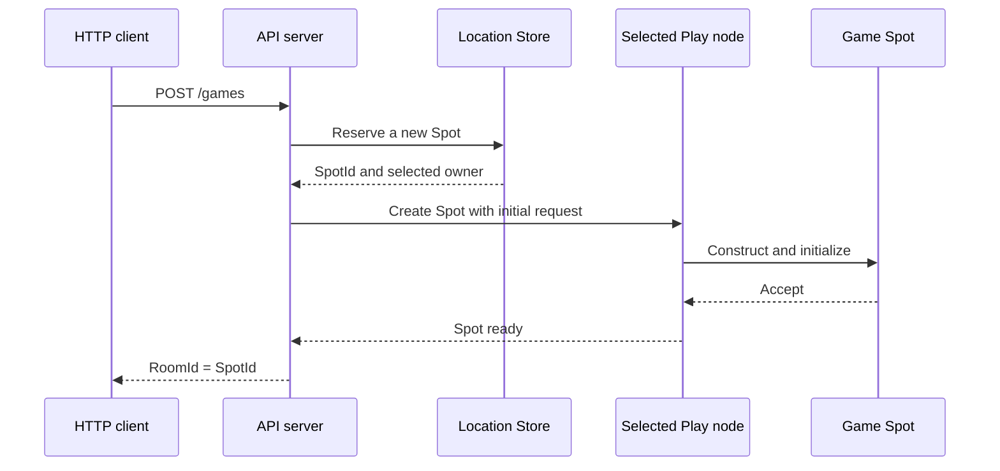

<!-- framework-adapter-nav:start -->
[문서 목록](../../../README.ko.md) | [이전: ZLink Framework for .NET 개요](01-overview.ko.md) | [다음: 핵심 개념](03-concepts.ko.md)
<!-- framework-adapter-nav:end -->

# 2. Getting Started — TicTacToe 방 만들기

이 장은 실제 [TicTacToe sample](../../../../languages/dotnet/samples/TicTacToe/)에서
방 하나를 만드는 흐름을 설명한다.

핵심은 API 서버가 특정 Play node를 고르지 않는다는 점이다. API 서버는 방의 stable
type과 최초 설정만 넘긴다. Framework가 해당 type을 등록한 Object Server 중 하나를
선택하고, 전역에서 유일한 `SpotId`를 발급한다.

## 1. 실행 흐름



API 코드에는 Play node의 `NodeRid`나 endpoint가 들어가지 않는다. Play node가
추가되거나 교체되어도 같은 생성 코드를 사용한다.

## 2. sample 위치

| 확인할 내용 | 파일 |
|---|---|
| 전체 실행 | `framework/languages/dotnet/samples/TicTacToe/run_sample.sh` |
| API 실행 project | `samples/TicTacToe/Server/Api/TicTacToe.Server.Api.csproj` |
| Play 실행 project | `samples/TicTacToe/Server/Play/TicTacToe.Server.Play.csproj` |
| HTTP handler | `samples/TicTacToe/Server/Api/Handlers/CreateGameHttpHandler.cs` |
| API Framework 설정 | `samples/TicTacToe/Server/Api/ApiServer.cs` |
| Play Framework 설정 | `samples/TicTacToe/Server/Play/PlayServer.cs` |
| Game Spot | `samples/TicTacToe/Server/Play/Infrastructure/ZLink/Spots/TicTacToeGameSpot/TicTacToeGame.cs` |
| 공용 메시지 | `samples/TicTacToe/Shared/Contracts/Messages.cs` |

표의 상대 경로는 `framework/languages/dotnet`을 기준으로 한다.

## 3. API 서버 설정

API 서버는 Location Store와 Object Client role을 등록한다. Object Client role은
Actor와 Spot을 다른 Object Server에 생성하거나 호출할 때 사용한다.

```csharp
builder.Services.AddZLinkFramework(options =>
{
    // 모든 process가 같은 위치 정보를 조회하도록 공용 Store를 등록한다.
    options.AddLocationStore(new ZLinkRedisLocationStore(redis =>
    {
        redis.ConnectionString = settings.RedisEndpoint;
        redis.KeyPrefix = settings.RedisKeyPrefix;
    }));

    var mesh = options.AddRouteMesh(SampleNodes.Mesh)
        .Listen(settings.MeshEndpoint)
        .SetRoutingIdPrefix("tictactoe-api");

    // API process는 Object를 보관하지 않고 원격 Object 호출만 시작한다.
    mesh.Objects().Client();
});
```

sample은 재현 가능한 로컬 실행을 위해 peer endpoint를 설정 파일에서 읽는다. 이
endpoint는 연결을 구성할 뿐, 새 Game Spot을 어느 Play node에 배치할지는 지정하지
않는다.

## 4. HTTP 요청에서 Spot 만들기

HTTP handler는 DI로 받은 `IZLinkSpotManager`를 사용한다.

```csharp
internal static async Task<IResult> HandleAsync(
    CreateGameHttpReq request,
    IZLinkSpotManager spots,
    SampleSettings settings,
    ILoggerFactory loggerFactory,
    CancellationToken cancellationToken)
{
    var gameName = !string.IsNullOrWhiteSpace(request.GameName)
        ? request.GameName
        : SampleDefaults.GameName;

    var created = await spots
        .Create(SampleTypes.GameSpot)      // 이 stable type을 제공하는 node가 후보가 된다.
        .InMesh(SampleNodes.Mesh)          // Object를 만들 RouteMesh를 선택한다.
        .Request(new TicTacToeGameCreateReq(
            gameName,
            SampleDefaults.RequiredLevel)) // 새 Spot의 OnCreateAsync에 전달할 최초 설정이다.
        .Async(cancellationToken);

    return Results.Ok(new CreateGameHttpRes(
        created.Spot.SpotId,               // Framework가 발급한 SpotId를 room id로 사용한다.
        settings.PlayEndpoints,
        settings.PlayNodes,
        gameName,
        SampleDefaults.RequiredLevel));
}
```

`Create`는 호출자가 `SpotId`를 정하지 않는 새 User Spot 생성에 사용한다. 같은
`SpotId`를 다시 찾거나 만들려면 `GetOrCreate(spotId, spotType)`을 사용한다.

## 5. Play 서버에서 stable type 등록

Framework는 요청한 stable type을 등록한 Serving Object Server만 생성 후보로
사용한다. Play 서버는 `TicTacToeGame` factory를 다음과 같이 등록한다.

```csharp
var mesh = options.AddRouteMesh(SampleNodes.Mesh)
    .Listen(settings.MeshEndpoint)
    .SetRoutingIdPrefix("tictactoe-play");

mesh.Objects().Server()
    .AddSpotFactory<TicTacToeGame>(
        SampleTypes.GameSpot,                    // API가 Create에 넘긴 stable type과 같다.
        null,
        ZLinkRelocationPolicy<TicTacToeGame>.Disabled);
```

특정 Play node를 선호하거나 `NodeRid`로 배치하는 sample 계약은 없다. 배치 후보와
용량은 Framework와 Location Store가 판단한다.

## 6. 최초 설정 검증

선택된 Play node는 Spot을 만든 뒤 최초 요청을 `OnCreateAsync`에 전달한다. Spot은
설정을 검증하고 생성 수락 여부를 반환한다.

```csharp
public ValueTask<ZLinkSpotCreateResponse> OnCreateAsync(
    ZLinkMessage request,
    CancellationToken cancellationToken)
{
    var settings = request.Decode<TicTacToeGameCreateReq>();

    if (string.IsNullOrWhiteSpace(settings.GameName))
        return ValueTask.FromResult(
            ZLinkSpotCreateResponse.Reject("GameName is required."));

    _gameName = settings.GameName;
    _requiredLevel = settings.RequiredLevel;

    // Accept 이후에만 Location Store에서 이 Spot이 Ready로 공개된다.
    return ValueTask.FromResult(ZLinkSpotCreateResponse.Accept());
}
```

생성을 거부하면 해당 예약은 Ready Spot으로 공개되지 않는다. 호출자는 typed failure로
완료 결과를 받는다.

## 7. ClientServer channel은 별도 용도다

TicTacToe의 `tictactoe.api` ClientServer channel은 Play session이 사용자 인증을
API 서버에 요청할 때 사용한다. Game Spot 생성에는 사용하지 않는다.

```csharp
// API process: 인증 요청을 처리한다.
options.AddClientServerChannel(SampleChannels.Api)
    .Server()
    .Listen()
    .AddRequestHandler<
        AuthenticatePlayerHandler,
        AuthenticatePlayerReq,
        AuthenticatePlayerRes>();

// Play process: 인증 요청을 보낸다.
options.AddClientServerChannel(SampleChannels.Api)
    .Client();
```

Object 생성과 ClientServer 호출은 서로 다른 기능이다. 방 생성 전용 channel이나
`CreateGameHandler`를 추가하지 않는다.

## 8. build와 실행

```bash
# sample solution을 먼저 build한다.
dotnet build framework/languages/dotnet/samples/TicTacToe/TicTacToe.sln

# Redis와 네 개 process를 준비하고 전체 scenario를 검증한다.
framework/languages/dotnet/samples/TicTacToe/run_sample.sh
```

runner는 API 두 개와 Play 두 개를 실행한다. Game Spot을 생성한 뒤 서로 다른 Play
endpoint에 연결한 참가자들이 같은 방에 join하고, 게임 메시지와 종료 정리를
검증한다.

## 9. 실패할 때 확인할 항목

| 증상 | 확인할 항목 |
|---|---|
| 생성 후보가 없다 | Play process가 같은 `MeshName`에 Object Server와 `GameSpot` stable type을 등록했는지 확인한다. |
| startup이 실패한다 | Redis 연결, `MeshName`, listen endpoint와 중복 등록 오류를 확인한다. |
| 생성이 거부된다 | `OnCreateAsync`가 받은 최초 설정과 reject 사유를 확인한다. |
| client가 방에 join하지 못한다 | HTTP 응답의 `RoomId`를 Actor join 요청에 그대로 사용했는지 확인한다. |

다음 장에서는 여기서 사용한 channel, Spot, Actor, Stream과 Location Store의 역할을
각각 설명한다.

---
<!-- framework-adapter-nav:bottom:start -->
[문서 목록](../../../README.ko.md) | [이전: ZLink Framework for .NET 개요](01-overview.ko.md) | [다음: 핵심 개념](03-concepts.ko.md)
<!-- framework-adapter-nav:bottom:end -->
