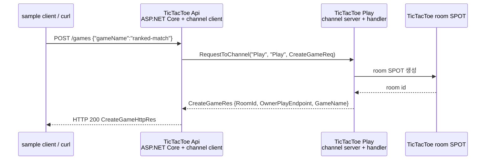

<!-- framework-adapter-nav:start -->
[문서 목록](../../../README.ko.md) | [이전: ZLink Framework for .NET — 개요](01-overview.ko.md) | [다음: .NET ZLink Framework 이해를 위한 핵심 개념](03-concepts.ko.md)
<!-- framework-adapter-nav:end -->

# 2. Getting Started — 처음 한 번 띄워 보기

이 장은 실제 `samples/TicTacToe`의 첫 흐름만 따라간다. 전체 게임 규칙을 설명하지
않고, 외부 클라이언트가 `POST /games`를 호출했을 때 API 서버가 Play 서버로 서버 간
channel request를 보내는 부분만 본다.

여기서 확인하는 것은 세 가지다.

- ASP.NET Core endpoint는 외부 요청을 받는 진입점이다.
- `IZLinkRouteClient`는 다른 MeshNode의 channel handler로 request를 보낸다.
- 처음에는 외부 위치 저장소 없이 **수동 연결**로 endpoint를 직접 지정한다.

등록 시그니처와 옵션 전체는 [05-channel-messaging](05-channel-messaging.ko.md)과
[spec/aspnet-core-channel-messaging](../../spec/server/languages/dotnet/01-system-structure.ko.md)이
다룬다. 용어가 낯설면 [03-concepts §0](03-concepts.ko.md)을 먼저 펼쳐 둔다.

## 1. 실제 샘플 위치

| 역할 | 실제 파일 |
|------|-----------|
| 실행 스크립트 | `framework/languages/dotnet/samples/TicTacToe/run_sample.sh` |
| API 서버 실행 진입점 | `Server.Api/Program.cs` |
| Play 서버 실행 진입점 | `Server.Play/Program.cs` |
| API 서버 조립 | `Server/Api/ApiServer.cs` |
| HTTP handler | `Server/Api/Handlers/CreateGameHttpHandler.cs` |
| Play 서버 조립 | `Server/Play/PlayServer.cs` |
| channel handler | `Server/Play/Infrastructure/ZLink/Handlers/CreateGameHandler.cs` |
| 메시지 계약 | `Shared/Contracts/Messages.cs` |

현재 저장소의 `TicTacToe.Server.csproj`는 NuGet 패키지가 아니라 프로젝트 참조로
`src/Zlink.Framework`, `src/Zlink.Framework.AspNetCore`,
`src/Systems.Zlink.Stream.Connector`, `bindings/dotnet/src/Zlink`를
가져온다. 소스에서 사용하는 framework namespace는 `Zlink.Framework.*`다.

## 2. 첫 요청 흐름



이 흐름에서 API 서버는 Play 서버 주소를 자동으로 찾지 않는다. 설정값으로 Play endpoint를 읽어
`PeerConnections.Connect(endpoint)`로 직접 연결한다. 처음 읽을 때는 이 방식이 가장 단순하다.

> **이 장은 단순화한다.** 실제 `TicTacToe` 샘플은 Play 노드를 **여러 개**(`Play(0)`/`Play(1)`,
> 설정 `PlayChannelEndpoints[]`) 실행하고, `CreateGameHttpHandler`가 게임마다 owner Play 노드를
> 하나 골라 보낸다. 아래 코드는 흐름의 본질(HTTP→channel request→reply)을 보이려고 Play 노드 하나만
> 쓰는 형태로 줄였다. 다중 노드·owner 선택의 전체 모습은 위 표의 실제 파일을 본다.

## 3. 메시지 계약

메시지는 `Shared/Contracts/Messages.cs`에 있다. 아래는 이 장의 흐름에 필요한 **핵심 필드만 추린**
형태다(실제 `CreateGameRes`/`CreateGameHttpRes`에는 다중 Play 노드용 `PlayEndpoints`·`PlayNodes`,
`RequiredLevel` 등 필드가 더 있다 — §2 단순화 참고).

```csharp
// Http* = 외부 HTTP 경계 계약. 입력이 비어 올 수 있어 GameName은 nullable.
public sealed record CreateGameHttpReq(string? GameName);

public sealed record CreateGameHttpRes(   // 실제 파일에는 필드가 더 있다(추려서 표시)
    string RoomId,
    string OwnerPlayEndpoint,
    string GameName);

// (Http 접두사 없음) = 서버 간 channel 계약(내부). 정규화 후라 GameName은 non-null.
public sealed record CreateGameReq(string GameName);

public sealed record CreateGameRes(       // 실제 파일에는 필드가 더 있다(추려서 표시)
    string RoomId,
    string OwnerPlayEndpoint,
    string GameName);
```

HTTP DTO와 channel DTO를 분리해 둔 점이 중요하다. 지금은 필드가 비슷하지만, 외부 HTTP
계약과 서버 간 계약은 나중에 따로 바뀔 수 있다.

## 4. API 서버: HTTP endpoint에서 channel request 보내기

API 서버는 HTTP route를 열고, Play 서버로 나가는 client 역할을 함께 선언한다.

```csharp
builder.WebHost.UseUrls(settings.ApiBindUrl);

builder.Services.AddZLinkFramework(options =>
{
    var play = options.AddRouteMesh(SampleChannels.Play)
        .Listen("tcp://127.0.0.1:0") // 이 API 프로세스도 Play mesh에 참여할 로컬 endpoint를 연다.
        .SetRoutingId(RoutingId.From("api-play"));
    play.ChannelName(SampleChannels.Play); // 호출할 논리 channel을 같은 MeshNode에 선언한다.
    play.PeerConnections.Connect(
        settings.PlayChannelEndpoint); // Play MeshNode endpoint를 수동 peer로 지정한다.
});

var app = builder.Build();
app.MapPost("/games", CreateGameHttpHandler.HandleAsync);   // HTTP 진입과 channel은 별개 평면이다
```

`SampleChannels.Play` 값은 `"Play"`다. 예제를 짧게 유지하려고 MeshName과 ChannelName에 같은 값을
사용했다. `PeerConnections.Connect(endpoint)`는 수동 연결이며, API 서버가 Play 서버의 MeshNode
endpoint를 설정으로 알고 시작한다.

HTTP handler는 `IZLinkRouteClient`를 DI로 받고, `CreateGameReq`를 Play channel로
보낸다.

```csharp
public static async Task<IResult> HandleAsync(
    CreateGameHttpReq request,
    IZLinkRouteClient client,          // DI로 주입(ASP.NET minimal API 파라미터 주입) — 호출부에서 안 넘긴다.
    ILoggerFactory loggerFactory,
    CancellationToken cancellationToken)
{
    // 빈/공백이면 기본값으로 치환 → channel 계약 CreateGameReq의 non-null GameName을 만족시킨다.
    var gameName = !string.IsNullOrWhiteSpace(request.GameName)
        ? request.GameName
        : SampleDefaults.GameName;

    // builder(RequestToChannel) + 종결자(.Async<CreateGameRes> = 송신하고 reply 대기) 2단계.
    var reply = await client.RequestToChannel(
            SampleChannels.Play,       // 요청 대상을 찾을 MeshName이다.
            SampleChannels.Play,       // 그 mesh 안에서 선택할 ChannelName이다.
            new CreateGameReq(gameName))
        .Async<CreateGameRes>(cancellationToken);

    return Results.Ok(new CreateGameHttpRes(
        reply.RoomId,
        reply.OwnerPlayEndpoint,
        reply.GameName));
}
```

핵심은 HTTP handler가 직접 게임 룸을 만들지 않는다는 것이다. HTTP는 진입점이고,
도메인 처리는 Play 서버 channel handler로 위임한다.

## 5. Play 서버: channel handler 노출하기

Play 서버는 `Play` MeshNode endpoint를 열고 같은 이름의 channel membership에
`CreateGameHandler`를 등록한다.

```csharp
builder.Services.AddZLinkFramework(options =>
{
    options.AddRouteMesh(SampleChannels.Play)                 // MeshName은 API 쪽과 반드시 일치한다.
        .Listen(settings.PlayChannelEndpoint)                 // API가 수동 peer로 지정한 endpoint를 연다.
        .SetRoutingId(RoutingId.From("play-a"))
        .ChannelName(SampleChannels.Play)                      // 논리 ChannelName membership을 등록한다.
        .AddRequestHandler<CreateGameHandler>();               // 이 channel이 호출할 handler를 등록한다.
});
```

`CreateGameHandler`는 `CreateGameReq`를 받아 room id와 stream endpoint를 돌려준다.
실제 구현은 room SPOT을 만들기 때문에 [06-spot](06-spot.ko.md)에서 다시 이어진다.

```csharp
sealed class CreateGameHandler(
    TicTacToeGameCreator games,                  // 생성자 의존성은 handler dispatch 시점에 DI로 resolve
    ILogger<CreateGameHandler> logger)
    : IZLinkRequestHandler<CreateGameReq, CreateGameRes>
{
    public async ValueTask<CreateGameRes> HandleAsync(
        CreateGameReq request,
        ZLinkRequestContext context,             // framework가 주입하는 요청 메타(correlation 등)
        CancellationToken cancellationToken)
    {
        // 실제론 여기서 room SPOT을 만든다 — 그 흐름은 06-spot으로 이어진다.
        return await games.CreateAsync(request.GameName, cancellationToken);
    }
}
```

## 6. 실행과 확인

전체 샘플은 스크립트로 실행한다.

```bash
$ framework/languages/dotnet/samples/TicTacToe/run_sample.sh
```

스크립트는 Play 서버와 API 서버를 띄운 뒤 sample client를 실행한다. 첫 단계에서 sample
client는 API 서버에 `POST /games`를 보내고, 이어서 반환된 `OwnerPlayEndpoint`로 STREAM
접속을 진행한다. 이 장은 그중 `POST /games`에서 `CreateGameReq`로 이어지는 부분만
설명한다.

## 7. 자동 연결의 위치

이 장의 예제는 연결 관계를 눈으로 따라가기 쉽게 endpoint를 직접 적는 **수동 연결**로
설명했다. 실제 배포에서 서버가 늘고 주소가 바뀌는 환경이라면, endpoint를 코드에 적지
않고 channel 이름만으로 연결 대상을 찾는 **location store 기반 자동 연결**을 쓴다 —
store 인스턴스 하나를 등록하면 서버는 자기 위치를 자동으로 알리고 client는 그걸 보고
연결된다. [10-location](10-location.ko.md)에서 이어서 본다.

## 8. 잘 안 될 때

| 증상 | 점검 |
|------|------|
| API가 Play로 요청하지 못한다 | `PlayChannelEndpoint`와 Play 서버 `Listen(...)` endpoint가 같은지 확인 |
| HTTP 요청이 실패한다 | API 서버의 `ApiBindUrl`과 호출 URL이 같은지 확인 |
| 시작 시 예외 | MeshName·ChannelName 중복, local `Listen(...)`, manual peer endpoint 누락 여부 확인 |
| 전체 샘플 실패 | `run_sample.sh`가 남긴 로그 디렉토리의 api/play/client 로그를 확인 |

## 9. 다음 단계

| 하고 싶은 것 | 가는 곳 |
|--------------|---------|
| 표면 개념 정리(channel, 역할, DI) | [03-concepts](03-concepts.ko.md) |
| request/send/pub-sub 전체 사용법 | [05-channel-messaging](05-channel-messaging.ko.md) |
| room/stage 같은 동적 단위 | [06-spot](06-spot.ko.md) |
| 외부 game/mobile client 받기 | [09-stream](09-stream.ko.md) |
| 실행 가능한 전체 시나리오 | [공통 샘플](../../common/sample/README.ko.md) |

---
<!-- framework-adapter-nav:bottom:start -->
[문서 목록](../../../README.ko.md) | [이전: ZLink Framework for .NET — 개요](01-overview.ko.md) | [다음: .NET ZLink Framework 이해를 위한 핵심 개념](03-concepts.ko.md)
<!-- framework-adapter-nav:bottom:end -->
