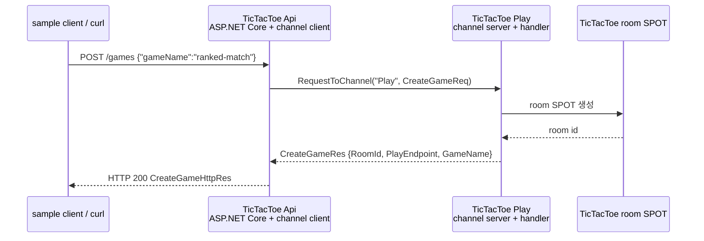
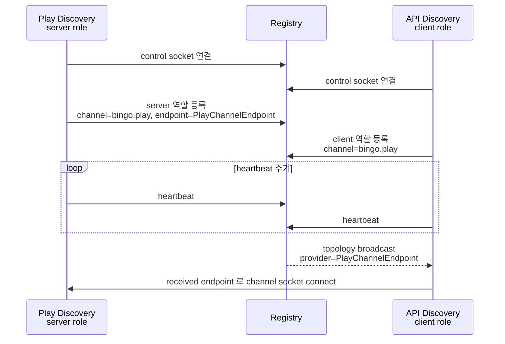

<!-- framework-adapter-nav:start -->
[문서 목록](../../../README.ko.md) | [이전: ZLink Framework for .NET — 개요](01-overview.ko.md) | [다음: .NET ZLink Framework 이해를 위한 핵심 개념](03-concepts.ko.md)
<!-- framework-adapter-nav:end -->

# 2. Getting Started — 처음 한 번 띄워 보기

이 장은 실제 `samples/TicTacToe`의 첫 흐름만 따라간다. 전체 게임 규칙을 설명하지
않고, 외부 클라이언트가 `POST /games`를 호출했을 때 API 서버가 Play 서버로 서버 간
channel request를 보내는 부분만 본다.

여기서 확인하는 것은 세 가지다.

- ASP.NET Core endpoint는 외부 요청을 받는 진입점이다.
- `IZLinkChannelClient`는 다른 서버의 channel handler로 request를 보낸다.
- 처음에는 Registry 없이 **수동 연결**로 endpoint를 직접 지정한다.

등록 시그니처와 옵션 전체는 [04-channel-messaging](04-channel-messaging.ko.md)과
[spec/aspnet-core-channel-messaging](../spec/aspnet-core-channel-messaging.ko.md)이
다룬다. 용어가 낯설면 [03-concepts §0](03-concepts.ko.md)을 먼저 펼쳐 둔다.

## 1. 실제 샘플 위치

| 역할 | 실제 파일 |
|------|-----------|
| 실행 스크립트 | `framework/languages/dotnet/samples/TicTacToe/run_sample.sh` |
| 서버 실행 진입점 | `Server/Program.cs` |
| API 서버 조립 | `Server/Api/ApiServer.cs` |
| HTTP handler | `Server/Api/Handlers/CreateGameHttpHandler.cs` |
| Play 서버 조립 | `Server/Play/PlayServer.cs` |
| channel handler | `Server/Play/Adapters/ZLink/Handlers/CreateGameHandler.cs` |
| 메시지 계약 | `Shared/Contracts/Messages.cs` |

현재 저장소의 `TicTacToe.Server.csproj`는 NuGet 패키지가 아니라 프로젝트 참조로
`src/Zlink.Framework`, `src/Zlink.Framework.AspNetCore`,
`src/Systems.Zlink.Stream.Connector`, `bindings/dotnet/src/Zlink`를
가져온다. 소스에서 사용하는 framework namespace는 `Zlink.Framework.*`다.

## 2. 첫 요청 흐름



이 흐름에서 API 서버는 Play 서버 주소를 Discovery로 찾지 않는다. 실제 `.NET`
`TicTacToe` 샘플은 설정값 `PlayChannelEndpoint`를 읽어
`EnableClient(endpoint)`로 직접 연결한다. 처음 읽을 때는 이 방식이 가장 단순하다.

## 3. 메시지 계약

실제 샘플의 메시지는 `Shared/Contracts/Messages.cs`에 있다.

```csharp
// Http* = 외부 HTTP 경계 계약. 입력이 비어 올 수 있어 GameName 은 nullable.
public sealed record CreateGameHttpReq(string? GameName);

public sealed record CreateGameHttpRes(
    string RoomId,
    string PlayEndpoint,
    string GameName);

// (Http 접두사 없음) = 서버 간 channel 계약(내부). 정규화 후라 GameName 은 non-null.
public sealed record CreateGameReq(string GameName);

public sealed record CreateGameRes(
    string RoomId,
    string PlayEndpoint,
    string GameName);
```

HTTP DTO와 channel DTO를 분리해 둔 점이 중요하다. 지금은 필드가 비슷하지만, 외부 HTTP
계약과 서버 간 계약은 나중에 따로 바뀔 수 있다.

## 4. API 서버: HTTP endpoint에서 channel request 보내기

API 서버는 HTTP route를 열고, Play 서버로 나가는 client 역할을 함께 선언한다.

```csharp
builder.WebHost.UseUrls(settings.ApiBindUrl);

builder.Services.AddZLinkFramework(options =>
{
    options.Codecs.AddJson();   // 송수신 DTO 직렬화 codec. API/Play 양쪽이 같은 codec 이어야 매칭된다.

    options.AddClientServerChannel(SampleChannels.Play)
        .EnableClient(settings.PlayChannelEndpoint);  // 수동 연결 — Registry 없이 Play endpoint 를 설정으로 직접 지정(7장 자동연결과 대비)
});

var app = builder.Build();
app.MapPost("/games", CreateGameHttpHandler.HandleAsync);   // HTTP 진입과 channel 은 별개 평면이다
```

`SampleChannels.Play` 값은 `"Play"`다. `EnableClient(endpoint)`는 수동 연결이다.
API 서버가 Play 서버의 channel endpoint를 설정으로 알고 시작한다.

HTTP handler는 `IZLinkChannelClient`를 DI로 받고, `CreateGameReq`를 Play channel로
보낸다.

```csharp
public static async Task<IResult> HandleAsync(
    CreateGameHttpReq request,
    IZLinkChannelClient client,        // DI 로 주입(ASP.NET minimal API 파라미터 주입) — 호출부에서 안 넘긴다
    ILoggerFactory loggerFactory,
    CancellationToken cancellationToken)
{
    // 빈/공백이면 기본값으로 치환 → channel 계약 CreateGameReq 의 non-null GameName 을 만족시킨다.
    var gameName = !string.IsNullOrWhiteSpace(request.GameName)
        ? request.GameName
        : SampleDefaults.GameName;

    // builder(RequestToChannel) + 종결자(.Async<CreateGameRes> = 송신하고 reply 대기) 2단계.
    var reply = await client.RequestToChannel(
            SampleChannels.Play,
            new CreateGameReq(gameName))
        .Async<CreateGameRes>(cancellationToken);

    return Results.Ok(new CreateGameHttpRes(
        reply.RoomId,
        reply.PlayEndpoint,
        reply.GameName));
}
```

핵심은 HTTP handler가 직접 게임 룸을 만들지 않는다는 것이다. HTTP는 진입점이고,
도메인 처리는 Play 서버 channel handler로 위임한다.

## 5. Play 서버: channel handler 노출하기

Play 서버는 `Play` channel의 server 역할을 열고 `CreateGameHandler`를
`AddRequestHandler<>`로 등록한다.

```csharp
builder.Services.AddZLinkFramework(options =>
{
    options.Codecs.AddJson();

    options.AddClientServerChannel(SampleChannels.Play)            // channel 이름은 API(client) 쪽과 반드시 일치
        .EnableServer(settings.PlayChannelEndpoint)               // API 의 EnableClient 와 같은 endpoint 를 server 로 bind
        .AddRequestHandler<CreateGameHandler>();                  // 그 server 가 부를 handler 등록
});
```

`CreateGameHandler`는 `CreateGameReq`를 받아 room id와 stream endpoint를 돌려준다.
실제 구현은 room SPOT을 만들기 때문에 [05-spot](05-spot.ko.md)에서 다시 이어진다.

```csharp
sealed class CreateGameHandler(
    TicTacToeGameCreator games,                  // 생성자 의존성은 handler dispatch 시점에 DI 로 resolve
    ILogger<CreateGameHandler> logger)
    : IZLinkRequestHandler<CreateGameReq, CreateGameRes>
{
    public async ValueTask<CreateGameRes> HandleAsync(
        CreateGameReq request,
        ZLinkRequestContext context,             // framework 가 주입하는 요청 메타(correlation 등)
        CancellationToken cancellationToken)
    {
        // 실제론 여기서 room SPOT 을 만든다 — 그 흐름은 05-spot 으로 이어진다.
        return await games.CreateAsync(request.GameName, cancellationToken);
    }
}
```

## 6. 실행과 확인

전체 샘플은 스크립트로 실행한다.

```bash
$ framework/languages/dotnet/samples/TicTacToe/run_sample.sh
```

스크립트는 Play 서버와 API 서버를 띄운 뒤 sample client를 실행한다. 첫 단계에서 sample
client는 API 서버에 `POST /games`를 보내고, 이어서 반환된 `PlayEndpoint`로 STREAM
접속을 진행한다. 이 장은 그중 `POST /games`에서 `CreateGameReq`로 이어지는 부분만
설명한다.

## 7. 자동 연결 — Registry/Discovery

수동 연결 다음 단계는 **Registry/Discovery 자동 연결**이다. 앞의 TicTacToe 흐름은
client 가 server endpoint(host:port)를 직접 알아야 했다. 자동 연결에서는 **앱 코드가
channel 이름만 알고**, 실제 주소 조회와 channel client 연결은 framework runtime 이
처리한다.

- **Registry** — 어느 노드가 어떤 channel 을 어디(endpoint)서 제공하는지 모아 두는
  디렉터리 서버다. **control-plane** 만 담당하고, 실제 request/reply 데이터는 지나가지
  않는다.
- **Discovery** — `UseDiscovery(...)` 를 켜면 **각 서버의 framework runtime 안에서 도는
  agent** 다. 매 서버에서 Discovery 가 ① Registry 로 control socket 을 연결하고,
  ② 자기 역할을 등록한 뒤 주기적으로 **heartbeat** 를 보내며, ③ Registry 가 뿌린
  topology 를 받아 **peer 와 직접 소켓을 연결**한다(provider 가 바뀌면 자동 갱신).

그래서 자동 연결은 두 평면으로 나뉜다.

- **control-plane** — 각 서버의 Discovery ↔ Registry. server 역할은 자기 endpoint 를
  등록하고, client 역할은 필요한 channel view 를 받는다. Registry 서버의 기본 설정은
  heartbeat 주기 5초, timeout 15초다. timeout 안에 heartbeat 가 들어오지 않으면
  Registry 가 그 역할을 lost 로 보고 topology 에서 빼고 재broadcast 한다.
- **data-plane** — Discovery 가 topology 로 알게 된 endpoint 로 **노드끼리 직접**
  DEALER→ROUTER 소켓을 맺는다. 이후 request/reply 는 Registry 를 거치지 않고 이 직접
  소켓으로 흐른다.

Discovery 와 Registry 연결만 떼어 보면 다음 순서다.



그 결과 만들어진 직접 연결까지 포함하면 전체 흐름은 다음과 같다.

```mermaid
sequenceDiagram
  participant P as Play 서버<br/>EnableServer + Discovery
  participant R as Registry
  participant A as API 서버<br/>EnableClient + Discovery
  participant C as sample client

  rect rgb(245, 247, 250)
    Note over P,R,A: control-plane — 각 서버의 Discovery ↔ Registry
    P->>R: Discovery: control socket 연결
    A->>R: Discovery: control socket 연결
    P->>R: Discovery: 역할 등록 (server "bingo.play" @ PlayChannelEndpoint)
    A->>R: Discovery: 역할 등록 (client "bingo.play")
    loop heartbeat 주기 (Registry 기본 5초)
      P->>R: Discovery: heartbeat (server 역할 alive)
      A->>R: Discovery: heartbeat (client 역할 alive)
    end
    R-->>A: topology broadcast: "bingo.play" providers = [PlayChannelEndpoint]
    A->>P: Discovery: provider endpoint 으로 DEALER→ROUTER 직접 소켓 연결
    Note over R: Registry 는 디렉터리(control-plane)일 뿐 — 데이터는 안 지난다
  end

  rect rgb(250, 248, 240)
    Note over C,P: data-plane — Registry 경유 없음
    C->>A: HTTP/API request
    A->>P: RequestToChannel("bingo.play", ...) — 위에서 맺은 직접 소켓으로
    P-->>A: reply
    A-->>C: HTTP/API response
  end

  Note over R,A: provider 추가·이탈 → Registry 재broadcast → API Discovery 가 직접 소켓 갱신
```

실제 `.NET Bingo` 샘플이 이 흐름을 그대로 보여 준다. Registry 프로세스를 띄우고,
API/Play 서버가 같은 Registry를 바라보게 한다.

```csharp
// Bingo.Server.Registry.RegistryHostFactory
builder.Services.AddZLinkRegistry(options =>
{
    options.PubEndpoint = topology.RegistryPubEndpoint;        // topology broadcast 를 내보내는 PUB
    options.RouterEndpoint = topology.RegistryRouterEndpoint;  // 역할 등록·control 을 받는 ROUTER
});
```

API 서버는 Play endpoint를 직접 쓰지 않고 `EnableClient()`만 선언한다.

```csharp
// Bingo.Server.Api.ApiServerHostFactory
options.UseDiscovery().AddRegistryEndpoint(topology.RegistryRouterEndpoint); // client 는 Registry 만 알면 됨(provider 주소는 모름)
{
    var channel = options.AddClientServerChannel(SampleNames.PlayChannel);
    channel.EnableClient();   // endpoint 인자 없음 = 주소를 Discovery 가 채운다(TicTacToe 의 EnableClient(endpoint) 수동연결과 대비)

}
```

Play 서버는 자기 endpoint를 server 역할로 열고 같은 Registry를 바라본다.

```csharp
// Bingo.Server.Play.PlayServerHostFactory
options.UseDiscovery().AddRegistryEndpoint(topology.RegistryRouterEndpoint); // API 와 동일한 Registry 를 가리켜야 같은 topology 에 묶임
{
    var channel = options.AddClientServerChannel(SampleNames.PlayChannel);
        channel.EnableServer(topology.PlayChannelEndpoint);   // server 는 자기 주소를 명시해 Registry 에 등록(client 의 인자 없는 EnableClient 와 대칭)
    channel.AddHandlerGroup("play");                          // group 단위 등록(handler 개별 등록 AddRequestHandler<> 와 다른 방식)

}
```

즉 `TicTacToe`는 “endpoint를 직접 알고 연결하는 최소 흐름”, `Bingo`는
“Registry가 endpoint를 찾아 주는 흐름”으로 읽으면 된다.

## 8. 잘 안 될 때

| 증상 | 점검 |
|------|------|
| API가 Play로 요청하지 못한다 | `PlayChannelEndpoint`와 Play 서버 `Bind(...)` endpoint가 같은지 확인 |
| HTTP 요청이 실패한다 | API 서버의 `ApiBindUrl`과 호출 URL이 같은지 확인 |
| 시작 시 예외 | channel 이름 중복, handler group 미등록, client endpoint 누락 여부 확인 |
| 전체 샘플 실패 | `run_sample.sh`가 남긴 로그 디렉토리의 api/play/client 로그를 확인 |

## 9. 다음 단계

| 하고 싶은 것 | 가는 곳 |
|--------------|---------|
| 표면 개념 정리(channel, 역할, DI) | [03-concepts](03-concepts.ko.md) |
| request/send/pub-sub 전체 사용법 | [04-channel-messaging](04-channel-messaging.ko.md) |
| room/stage 같은 동적 노드 | [05-spot](05-spot.ko.md) |
| 외부 game/mobile client 받기 | [08-stream](08-stream.ko.md) |
| 자동 연결과 Registry 운영 | [09-registry](09-registry.ko.md) |
| 실행 가능한 전체 예제 | [guide/samples](samples/channel-messaging-samples.ko.md) |

---
<!-- framework-adapter-nav:bottom:start -->
[문서 목록](../../../README.ko.md) | [이전: ZLink Framework for .NET — 개요](01-overview.ko.md) | [다음: .NET ZLink Framework 이해를 위한 핵심 개념](03-concepts.ko.md)
<!-- framework-adapter-nav:bottom:end -->
